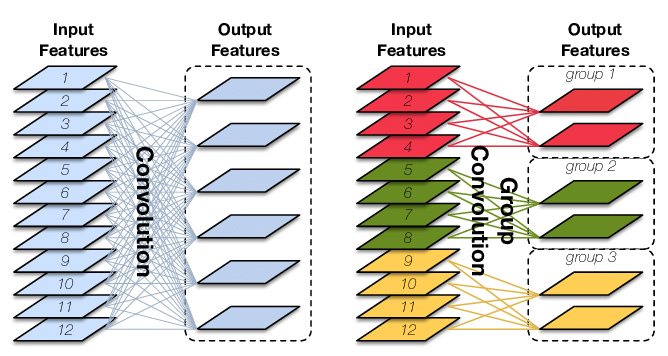
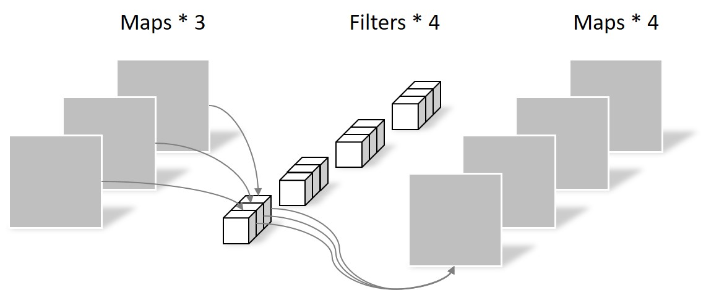
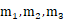
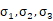
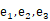
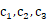
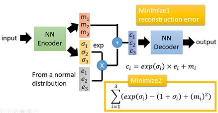

# 教程

- **卷积神经网络**：[Convolutional Neural Networks: Architectures, Convolution / Pooling Layers](https://cs231n.github.io/convolutional-networks/)

- **U-Net++**：[研习U-Net](https://zhuanlan.zhihu.com/p/44958351)

    我的理解：① U-Net++的嵌套结构就相当对应小学（L1）、初中（L2）、高中（L3）、大学（L4）学的数学知识。每个结构都包含了更小的结构，比如大学（L4）包含了高中（L3），其实也包含了初中（L2）和小学（L1）

    ​				② 关于文中说的“剪枝”那部分，对于U-Net++训练中的反向传播，相当于你学到后面的知识会影响你前面学过的知识，比如在大学（L4）学的线性代数，会帮助你理解初中（L2）学了但是没学好的方程组；而当U-Net++进行测试的时候（即只有前向传播），因为L2和L4的精度差不多，但L4会花更多的时间，所以只用L2就能解决问题，对应到前面的例子中就是对于求解多个未知数，可以只用初中的方程组就能搞定，无需用上大学线代中的矩阵知识了。所以，训练的时候不能剪枝，但预测的时候可以剪枝！

- [**group convolution**](https://zhuanlan.zhihu.com/p/65377955)：原理如下图所示。group conv和conv的关系类似conv和全连接的关系。在卷积中设置groups=g，则参数减少为原来的1/g

  

- [**separable convolution**](https://yinguobing.com/separable-convolution/)：将一个完整的卷积运算分解为两步进行（Depthwise Convolution与Pointwise Convolution），简单来说首先用depthwise conv将feature的每个channel卷积（∴output fature的channel不变），然后用Pointwise Conv（1*1 conv）改变维度

  

  

- NAS：自动搜索网络结构

  - [神经网络结构搜索 (1/3): 基本概念和随机搜索 Neural Architecture Search: Basics & Random Search_哔哩哔哩_bilibili](https://www.bilibili.com/video/BV14q4y177gQ)
  - [神经网络结构搜索 (2/3): RNN + RL Neural Architecture Search: RNN + RL_哔哩哔哩_bilibili](https://www.bilibili.com/video/BV15K4y1A7hq)
  - [神经网络结构搜索 (3/3): 可微方法 Differentiable Neural Architecture Search_哔哩哔哩_bilibili](https://www.bilibili.com/video/BV1C64y127Fv)

- **变分自编码器（Variational auto-encoder，VAE）**：在auto-encoder中，编码器是直接产生一个编码的，但是在VAE中，为了给编码添加合适的噪音，编码器会输出两个编码，一个是原有编码()，另外一个是控制噪音干扰程度的编码()，第二个编码其实很好理解，就是为随机噪音码()分配权重，然后加上exp()的目的是为了保证这个分配的权重是个正值，最后将原编码与噪音编码相加，就得到了VAE在code层的输出结果()。其它网络架构都与Deep Auto-encoder无异。

  

  - [【学习笔记】生成模型——变分自编码器 (gwylab.com)](http://www.gwylab.com/note-vae.html)
  - [【机器学习】白板推导系列(三十二) ～ 变分自编码器(VAE)_哔哩哔哩_bilibili](https://www.bilibili.com/video/BV15E411w7Pz)

- **Gumbel Softmax**：属于重参数(re-parameterization)技巧，一个用处是把离散采样的步骤移出计算图，这样整个图就可以计算梯度BP更新了。在可微NAS中的应用为，在多选一（离散）的情况下，保持置信度高（即被选中的概率尽量高于其他选项）的同时，让梯度可以回传

  - [Gumbel softmax在可微NAS的作用是什么？](https://www.cnblogs.com/marsggbo/p/13227992.html)
  - [Gumbel-Softmax Trick和Gumbel分布 - initial_h - 博客园 (cnblogs.com)](https://www.cnblogs.com/initial-h/p/9468974.html#二、gumbel分布采样效果)