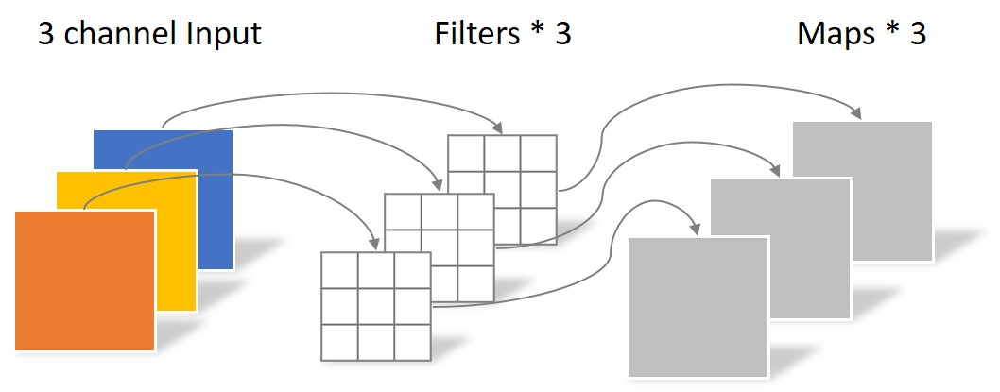

# 教程

- 卷积神经网络：[Convolutional Neural Networks: Architectures, Convolution / Pooling Layers](https://cs231n.github.io/convolutional-networks/)

- U-Net++：[研习U-Net](https://zhuanlan.zhihu.com/p/44958351)

    我的理解：① U-Net++的嵌套结构就相当对应小学（L1）、初中（L2）、高中（L3）、大学（L4）学的数学知识。每个结构都包含了更小的结构，比如大学（L4）包含了高中（L3），其实也包含了初中（L2）和小学（L1）

    ​				② 关于文中说的“剪枝”那部分，对于U-Net++训练中的反向传播，相当于你学到后面的知识会影响你前面学过的知识，比如在大学（L4）学的线性代数，会帮助你理解初中（L2）学了但是没学好的方程组；而当U-Net++进行测试的时候（即只有前向传播），因为L2和L4的精度差不多，但L4会花更多的时间，所以只用L2就能解决问题，对应到前面的例子中就是对于求解多个未知数，可以只用初中的方程组就能搞定，无需用上大学线代中的矩阵知识了。所以，训练的时候不能剪枝，但预测的时候可以剪枝！

- [group convolution](https://zhuanlan.zhihu.com/p/65377955)：原理如下图所示。group conv和conv的关系类似conv和全连接的关系。在卷积中设置groups=g，则参数减少为原来的1/g

  

- [separable convolution](https://yinguobing.com/separable-convolution/)：将一个完整的卷积运算分解为两步进行（Depthwise Convolution与Pointwise Convolution），简单来说首先用depthwise conv将feature的每个channel卷积（∴output fature的channel不变），然后用Pointwise Conv（1*1 conv）改变维度

  

  