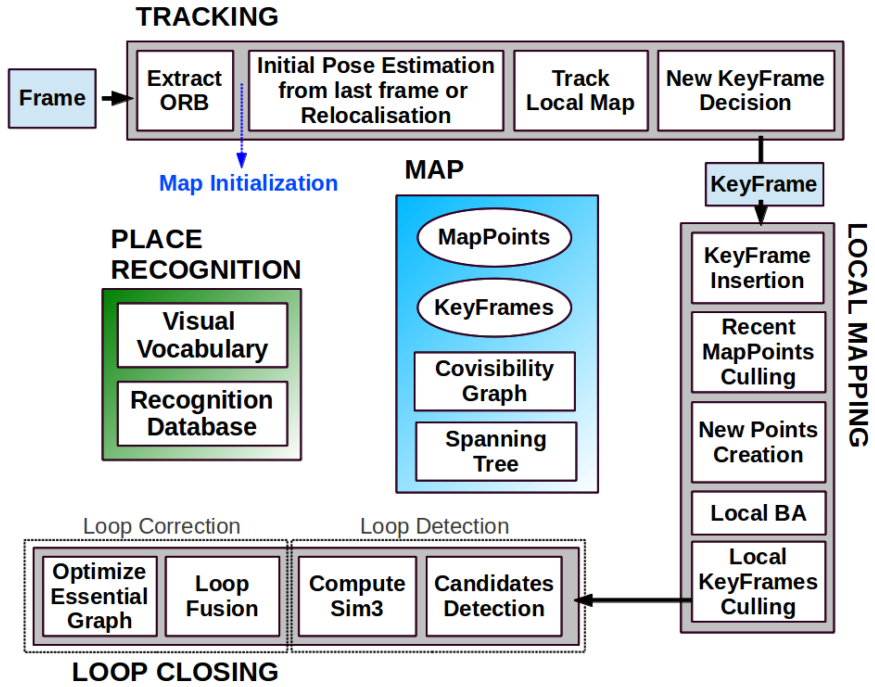

# ORBSLAM2

## TRACKING

### Extract ORB

- ORB = orientated FAST（旋转不变性）+ BRIEF描述子（特殊设计的固定的pattern）+ 图像金字塔（尺度不变性）
- ORBSLAM2将图片分块（30*30像素）然后每一块提取FAST角点（为了保证FAST角点的均匀性，见下一条）
- 每一个图像块先用较大阈值提取FAST，提取不到的话用小一些的阈值
- 使用四叉树将整张图中所有的FAST角点（在空间上）均匀采样至所需数量（保留质量最好的，即FAST角点提取时的响应值最大的）
    - ORBSLAM2不能使用太竖屏（即宽度<<高度），否则四叉树的初始节点数量为0
    - 数据结构为c++的list，每个节点分裂成4个节点然后加入list最前面
    - 如果节点中之有一个特征点，则后续不再分裂；如果一个都没有，则节点被删除
    - 由于每次分裂完后节点数量为4^n，所以如果想要节点数量刚好为所需的数量，需要：在最后一次分裂之前，优先分裂特征点数量最多的节点，然后到刚好分裂到所需数量时停下来

### Initial Pose Estimation from last frame or Relocalisation

### Track Local Map

### New KeyFrame Decision

## LOCAL MAPPING

### KeyFrame Insertion

### Recent MapPoints Culling

### New Points Creation

### Local BA

### Local KeyFrames Culling

## LOOP CLOSING

### Candiates Detection

### Compute Sim3

### Loop Fusion

### Optimize Essential Graph

## MAP

## PLACE RECOGNITION

