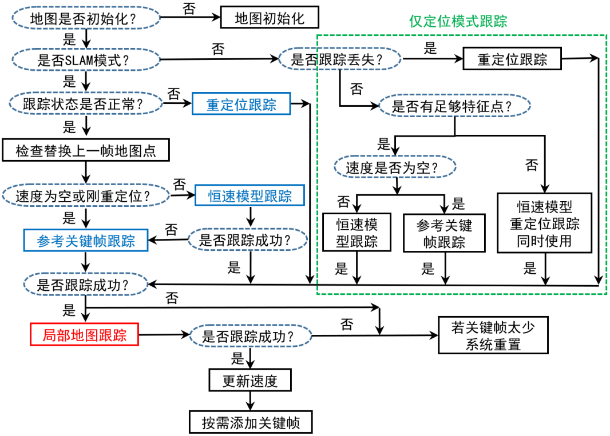
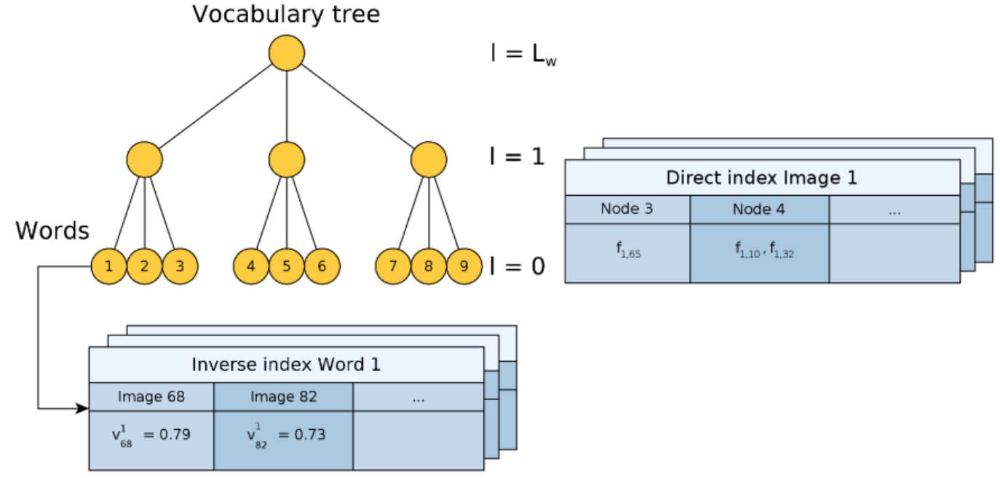
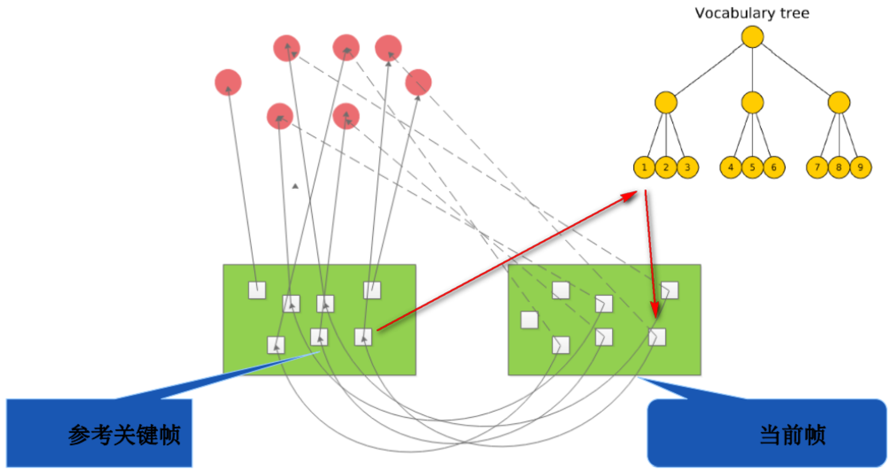
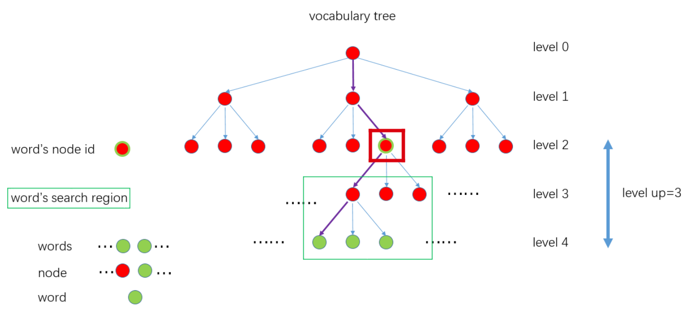
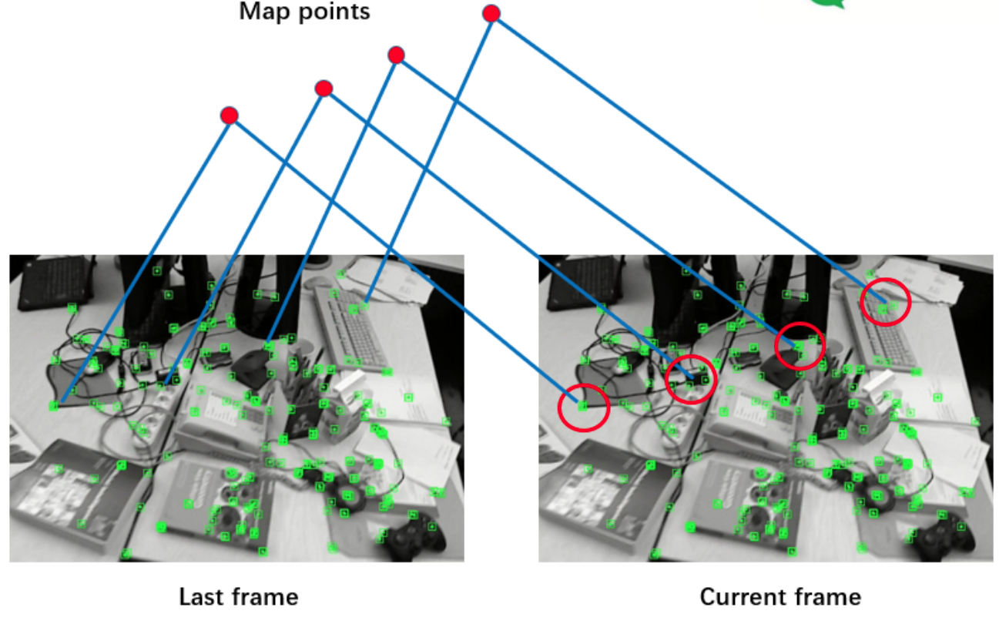
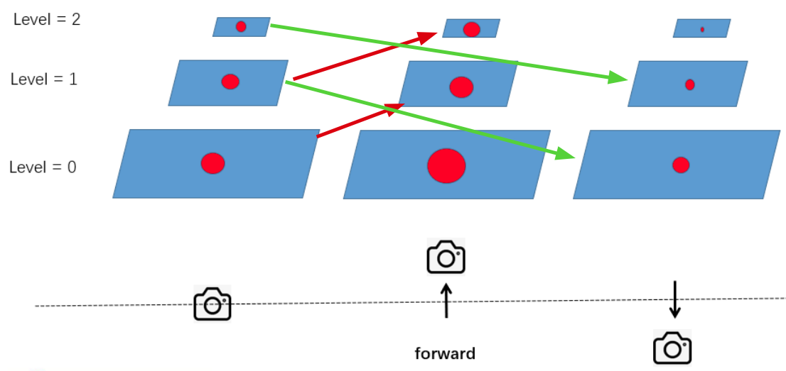
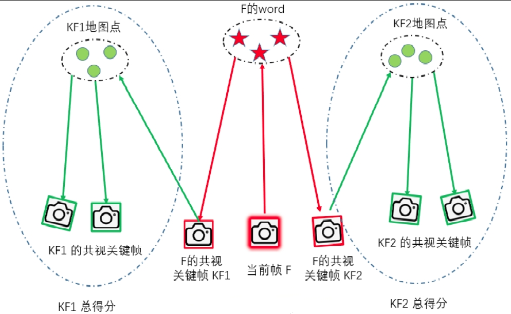
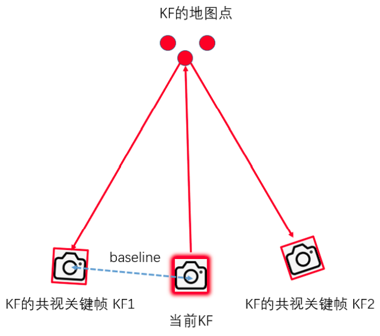
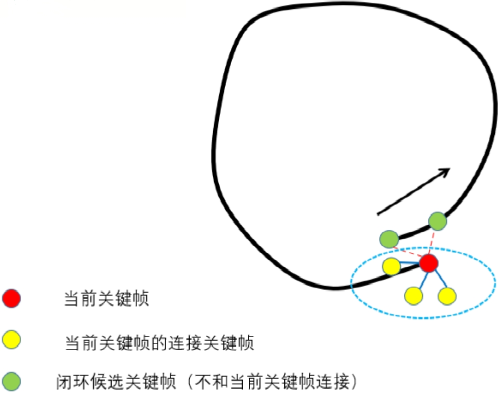
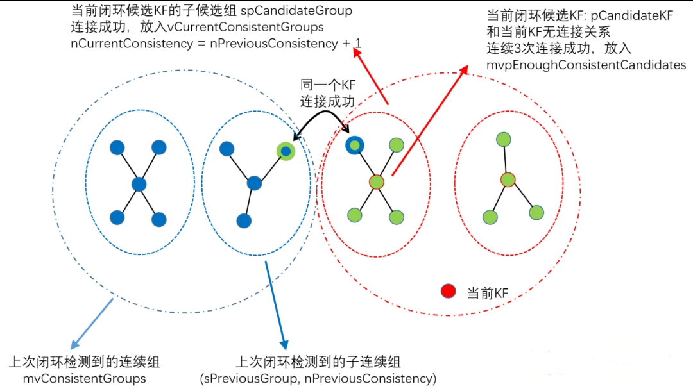

# ORBSLAM2

## TRACKING

### Extract ORB

- **ORB = orientated FAST（旋转不变性）+ BRIEF描述子（特殊设计的固定的pattern）+ 图像金字塔（尺度不变性）**
- ORBSLAM2将图片分块（30*30像素）然后每一块提取FAST角点（为了保证FAST角点的均匀性，见下一条）
- 每一个图像块先用较大阈值提取FAST，提取不到的话用小一些的阈值
- 使用四叉树将整张图中所有的FAST角点（在空间上）**均匀采样**至所需数量（保留质量最好的，即FAST角点提取时的响应值最大的）
    - ORBSLAM2不能使用太竖屏的图片（即宽度<<高度），否则四叉树的初始节点数量为0
    - 数据结构为c++的list，每个节点分裂成4个节点然后加入list最前面
    - 如果节点中之有一个特征点，则后续不再分裂；如果一个都没有，则节点被删除
    - 由于每次分裂完后节点数量为4^n，所以如果想要节点数量刚好为所需的数量，需要：在最后一次分裂之前，优先分裂特征点数量最多的节点，然后到刚好分裂到所需数量时停下来
- orientated FAST**计算灰度质心**时（用于旋转不变性），为了加速计算灰度值的遍历，使用了**对称**的方法，即v只从1开始遍历到v_max（v=0的时候没有对称，因为在u轴上），然后使用v和-v的像素坐标。
    - 问题：为啥u没有用对称呢？
- 提取特征点时使用了**仿函数**，其优点在于
    - 仿函数有自己的成员变量
    - 仿函数通常比一般函数有更好的速度
- 提取描述子前，使用高斯模糊来减少噪声
- 使用**图像金字塔**提取了不同尺度下的ORB特征点后，还需要将金字塔中缩小的层上的ORB特征点的坐标**放大回**原始图像的坐标系
- 对Keypoints进行去畸变，而不是对整张图去畸变，这样能减少计算量
-  去畸变的时候，需要计算去畸变后的图像边界，但是在第一帧或者内参改变之后算一次
- **将图片的有效区域（去畸变后）分成大小64像素的网格，特征点存在每个网格中**
    - 应该是为了后续快速遍历特征点

### Map Initialization

- 步骤如下
    - 将单目初始化的两帧都当做关键帧
    - 然后将所有关键帧的描述子转成BoW，并插入地图
    - 将初始化得到的3D点生成地图点
        - 每个3D点对应一个地图点（三维），包含属性：
            - 观测到地图点的关键帧ID以及它上面对应的二维特征点ID
            - 从这个地图点的所有特征点中选取**最具代表性的特征点**，其描述子作为这个地图点的描述子，选取方法为
                - 计算每个特征点跟其他所有特征点的描述子距离，选取中值
                - 选出中值最小的特征点作为最具代表性的特征点
            - **平均观测方向**：能观测到该地图点的所有关键帧，对该点的观测方向归一化为单位向量，然后进平均得到该地图点的朝向
            - **观测距离范围**：地图点和当前关键帧的光心距离，乘上所在金字塔的缩放倍数（$=1.2^n$，n为所在金字塔层数）为<u>最大范围</u>（因为图像缩放的时候会有精度丢失？），最大范围÷最大缩放倍数（$=1.2^N$，N为金字塔总层数）为<u>最小范围</u>
    - 将 新关键帧 跟 所有关键帧 建立**共视图**（无向加权图）
        - 将 新关键帧 和 每个已有关键帧 之间都能看到3D点的数量作为**权重**：遍历新关键帧中的所有3D点，遍历3D点所在的所有关键帧，将 这个关键帧 和 新关键帧的权重+1
        - 将“权重>阈值(15个) 以及 最大权重 的关键帧” 跟 新关键帧 建立边
        - 将权重最大的关键帧 作为 新关键帧 的<u>父关键帧</u>，而新关键帧为其<u>子关键帧</u>
    - 全局BA优化，同时优化所有位姿和三维点
    - 尺度归一化：计算所有3D点的深度的中值$z_{mid}$，将pose的平移和3D点都$÷z_{mid}$来归一化到1
    - 如果初始化的两帧之间的特征点<100个，则要<u>重新初始化</u>
    - 将关键帧插入局部地图，更新归一化后的位姿、局部地图点

### Initial Pose Estimation from last frame or Relocalization

- **卡方检验**：主要在事实与期望不符合情况下看是否系统出了问题，还是属于正常波动。步骤如下
  
    - 选择要检验的**假设**（H0）及其**备择假设**H1。例如：H0为系统没问题，H1为系统有问题
    
    - 确定**自由度**：用于计算检验统计量的独立变量的数目
    
        - 单行或单列：自由度 = 组数-限制数
        - 表格类：自由度 = (行数 - 1) * (列数 - 1)
    
    - 确定**显著性水平**，是指当原假设为正确时人们却把它拒绝了的概率或风险，通常取α=0.05或α=0.01（即接受H0时，正确概率为95%或99%）
    
    - 根据自由度 & 显著性水平，查表得到**拒绝域**
    
    - 计算**理论期望**$E$和**实际观察次数**$O$
    
    - 使用**卡方公式**计算统计量
        $$
        \mathcal{X}^2=\sum\frac{(O-E)^2}{E}
        $$
    
    - 如果计算得到的$\mathcal{X}^2$>拒绝域，则拒绝H0接受H1；<的话则相反

### 单目初始化

- 构造初始器Initializer必须要有连续2帧，每一帧特征点数都必须大于100 而且 两帧配准上的特征点数量也要>100，否则删了重新构造

- 初始化时需要专门的特征匹配

    - 只使用原始层级的特征点（缩小层级的不考虑），
    - 特征匹配范围为100（所以要求运动不能太大），搜索的时候遍历范围内的网格（事先已将图片分成大小64像素的网格）
    - 特征匹配距离记录最佳 & 次佳，要求①最佳距离小于一定距离；②最佳要明显小于次佳（即 最佳÷次佳<阈值）
    - 每个特征点最多一个匹配，如果多个匹配就都删掉（？）
    - 可以检查每个配准的角度差（使用直方图），因为一张图上的角度差应该是差不多的，角度差太大的配准可以删掉

- 使用单应矩阵（H）或者本质矩阵（F，更倾向）进行单目初始化，得到2帧相对运动和三维点

    - 使用两个线程同时计算两个矩阵，都使用8个（4对）特征点

    - 计算矩阵（H or F）前，需要对特征点进行归一化，即质心挪到原点然后对尺度归一化。这样能够在一定程度上消除噪声、错误匹配带来的影响，但还是不够的。归一化过程的矩阵形式为
        $$
        \left[\begin{array}{c}
        x^{\prime} \\
        y^{\prime} \\
        1
        \end{array}\right]=
        \left[\begin{array}{ccc}
        s X & 0 & -\operatorname{mean} X * s X \\
        0 & s Y & -\operatorname{mean} Y * s Y \\
        0 & 0 & 1
        \end{array} \right]
        \left[\begin{array}{l}
        x \\
        y \\
        1
        \end{array}\right]\\
        \operatorname{mean} X=\bar\mu_X \text{(均值), } sX=\frac{1}{|\bar\mu_X |\text{(一阶绝对矩) }}
        $$
         

    - 计算完单应矩阵后，需要转换成归一化之前的，基础矩阵同理
        $$
        p_1\text{为图1的特征点，}T_1\text{为它对应的归一化过程}
        \\p^N_1 = T_1 p_1, p^N_1 = T_2 p_2\\
        H_{2to1} =\operatorname{computeH\_2to1}(p_1, p_2)\\
        H^{final}_{2to1} = T^{-1}_2 H T_1,H^{final}_{1to2} = (H^{final}_{2to1})^{-1}
        $$
        
    - 计算完两个矩阵后，使用单应矩阵计算重投影误差，作为RANSAC的评分

- 初始化成功后，删除那些无法进行三角化的匹配点

- 单应矩阵计算$R+t$：《motion and structure from motion in a piecewise planar environment》

  - 单应矩阵$H=\boldsymbol{K}\left(\boldsymbol{R}-\frac{\boldsymbol{t} \boldsymbol{n}^{\mathrm{T}}}{d}\right) \boldsymbol{K}^{-1}$，令$A=\boldsymbol{R}-\frac{\boldsymbol{t} \boldsymbol{n}^{\mathrm{T}}}{d}$，则$A=K^{-1}*H*K$

  - 对A进行奇异分解，得到奇异值$d_1, d_2, d_3$（从大到小）

  - 令$d'=d_2$（也可以$d'=-d_2$），接下来要分别计算并讨论 H 矩阵分解的 8 组解

  - 根据论文eq.12得
    $$
    \left\{\begin{array}{l}
    x_{1}=\varepsilon_{1} \sqrt{\frac{d_{1}^{2}-d_{2}^{2}}{d_{1}^{2}-d_{3}^{2}}} \\
    x_{2}=0 \\
    x_{3}=\varepsilon_{3} \sqrt{\frac{d_{2}^{2}-d_{3}^{2}}{d_{1}^{2}-d_{3}^{2}}}
    \end{array}\right.
    \quad \varepsilon_{1}, \varepsilon_{3}=\pm 1
    $$

  - 首先讨论$d'>0$的情况，根据论文eq.13-14得到四组R+t

  - 再讨论$d'<0$的情况，根据论文eq.15-16得到四组R+t

  - 对8组解进行验证，并选择在相机前方最多3D点的解为最优解，满足以下条件

      - 最优解中3D点数量，*0.75>次优解，>最小数量，占总数的90%以上
      - 视差角>1°

- 基础矩阵计算$R+t$：

  - 计算本质矩阵$E=K^T*F*K$
  - 对本质矩阵E进行SVD分解得$E=U\Sigma V^T$
  - $U$的最后一列归一化后就是$t$（why？？？），令$\boldsymbol{R}_{1} =\boldsymbol{U} \boldsymbol{R}_{Z}^{\mathrm{T}}\left(\frac{\pi}{2}\right) \boldsymbol{V}^{\mathrm{T}}$和$ \boldsymbol{R}_{2} =\boldsymbol{U} \boldsymbol{R}_{Z}^{\mathrm{T}}\left(-\frac{\pi}{2}\right) \boldsymbol{V}^{\mathrm{T}}$，则得到四组可能的解$(R_1,\pm t)$和$(R_2,\pm t)$
  - 对4组解进行验证，并选择在相机前方最多3D点的解为最优解，满足以下条件
    - 有效匹配点的数量*0.9>50
    - 最优解中3D点数量，*0.7>次优解
    - 视差角>1°
  
- 单目投影恢复三维点

  

  - 假设单应矩阵or基本矩阵得到的R+t是从2->1的，则第2个相机的坐标系到第一个相机的坐标系的变换矩阵为
    $$
    T_{1->2}=T_{2->1}^{-1}=\left[\begin{array}{cc}R_{21} & t_{21} \\ 0^{T} & 1\end{array}\right]^{-1}=\left[\begin{array}{cc}
    R_{21}^{T} & -R_{21}^{T} t_{21} \\
    0^{T} & \mathbf{1}
    \end{array}\right]
    $$

  - 所以第二个相机的光心坐标为$-R_{21}^{T} t_{21}$

  - 特征点的投影矩阵为$P=K*[R | t]$（维度3*4）

  - 将空间点$X$投影到图像上的$x$，其中$\lambda$为归一化因子（未知），$p_1$的矩阵为投影矩阵
      $$
      \left[\begin{array}{c}
      x \\
      y \\
      1
      \end{array}\right]=\lambda\left[\begin{array}{llll}
      p_{1} & p_{2} & p_{3} & p_{4} \\
      p_{5} & p_{6} & p_{7} & p_{8} \\
      p_{9} & p_{10} & p_{11} & p_{12}
      \end{array}\right]\left[\begin{array}{c}
      X \\
      Y \\
      Z \\
      1
      \end{array}\right]=\lambda\left[\begin{array}{lll}
      - & P_{0} & - \\
      - & P_{1} & - \\
      - & P_{2} & -
      \end{array}\right]\left[\begin{array}{l}
      X \\
      Y \\
      Z \\
      1
      \end{array}\right]
      $$

  - 上面方程左右两遍同时叉乘$\left[\begin{array}{l}x \\ y \\ 1\end{array}\right]$后，左边变成0，同时可以约去$\lambda$，整理后得到
      $$
      \left[\begin{array}{c}
      y P_{2}-P_{1} \\
      P_{0}-x P_{2} \\
      x P_{1}-y P_{0}
      \end{array}\right]\left[\begin{array}{l}
      X \\
      Y \\
      Z
      \end{array}\right]=\left[\begin{array}{l}
      0 \\
      0 \\
      0
      \end{array}\right]
      $$

  -  根据一对特征点（2个点），并取上面矩阵的前两行（因为Z未知且单个点无法计算得到Z）得公式
      $$
      \left[\begin{array}{c}
      y P_{2}-P_{1} \\
      P_{0}-x P_{2} \\
      y^{\prime} P_{2}^{\prime}-P_{1}^{\prime} \\
      P_{0}^{\prime}-x^{\prime} P_{2}^{\prime}
      \end{array}\right] X=AX=0
      $$

  - 使用SVD求解，右奇异矩阵的最后一行就是最终的解。如果计算得到的Z＜0，则丢弃

  - （可选）计算$\angle O_1PO_2$，如果小于1°，则丢弃

  - 计算重投影误差，即将三维点投影到第二张图然后跟第二张图的二维点计算距离，如果太大的话就丢弃

### 双目初始化

- 输入双目图片已经做了极线矫正

- 立体匹配步骤（左图右图反一下没关系）

    - 对于<u>右图</u>中每一个特征点$F_r$，确定<u>左图</u>搜索范围

        - 虽然已经做了极线矫正，但是实际中并不是只在对应的那一行上进行搜索，而是在那一行的上下几行进行搜索，因为存在误差
        - 也不是每一列都搜索的，如果在左图上搜索右图上的像素$p$，搜索范围为$[p-maxD,p-minD]$
            - 最小depth不能超过基线，所以最大视差$maxD=\frac{f*b}{b}$
            - 最大depth是无穷远，所以最小视差$minD=0$
        - 去搜索范围内的特征点来进行匹配，而且要求空间尺度差（图像金字塔里面的）不超过2

    - 粗配准：将$F_r$跟搜索范围内所有的特征点配准，使用描述子的汉明距离来衡量相似度

    - 精配准：SAD，滑动窗口，

        - 需要注意有没有越界
        - 在配准到的特征点的附近滑动，滑动范围为5
        - 将窗口中图片归一化以减少亮度变化的影响

    - 亚像素插值

         

    - 保存最优视差值（深度）
    - 删除outliers：根据SAD的值，删除＞1.5\*1.4\*中值的点

### BoW

- BoW的**优点**：①加速匹配效率；②匹配精度好：源论文中说26K张图片中false positive=0

- BoW的**缺点**（忽略不计？）：加载预先训练的词袋字典；但是可以 使用 <u>二进制存储</u>

- BoW一般使用BRIEF描述子，因为

    - 计算描述子非常快（论文中说256位只要17.3µs），使用汉明距离（异或操作）匹配也非常快
    - 在中景和远景上，尺度变化不大，BRIEF 表现接近甚至优于SURF64（但可通过金字塔来一定程度解决尺度问题）；数据集上的表现，BRIEF的Percision和Recall的面积也最大

- BoW训练过程

    - 对<u>每一张</u>训练图像 <u>提取ORB</u>特征点
    - 设定vocabulary tree的<u>分支数K</u>和<u>深度L</u>
    - 首先使用K-means聚类，得到K个集合，作为第一层；然后对每个集合再做K-means聚类，总共生成L层
    - 叶子节点则作为单词Word，并赋予<u>权重</u>（<u>出现次数多</u>的，辨别力差，权重低）

- 正向索引表 和 逆向（倒排）索引表，可以加速检索

    - <u>正向</u>索引表 用于 参考关键帧跟踪

    - <u>逆向</u>（倒排）索引表 用于 <u>重定位</u>

        

### 跟踪模式一：参考关键帧跟踪

- **应用场景**：没有速度信息（初始化）、刚完成重定位、恒速模型跟踪失败（特征点数较少），<u>大部分时间不用</u>。<u>只利用参考帧</u>的信息。

- 思路：和最近一个关键帧匹配。利用BoW加速匹配

- **步骤**：

    

    - Step1：将当前帧的所有描述子转化为BoW向量，每一个描述子要记录
        - 在BoW中对应叶节点（单词）的ID、权重
        - 距离对应叶节点固定层数（=levelsup）的父节点的ID（如下图红色框中的节点）。此外还要将自己（描述子）记录在这个父节点对应的vector中——这样后续配准只需要配准这个父节点的子节点（下图绿色框），大大<u>缩小搜索空间</u>，从而<u>提速</u>
    - Step 2：通过词袋BoW加速当前帧与参考帧之间的特征点匹配，若匹配数量<15则认为跟踪失败
        - 分别取出 <u>关键帧</u> 和 <u>当前帧</u> 中记录好的属于同父节点的ORB特征点的ID：在前面“将帧内所有描述子转化为BoW向量”已经记录好了；因为只有属于同一节点，才有可能是匹配点
        - <u>暴力匹配</u> 上面取出的 关键帧中所有的特征点 和 当前帧中所有的特征点
        - （跟之前一样）根据 最小距离 和 次小距离 <u>筛选</u>：最小距离<阈值，最小距离<0.7*次小距离（比初始化的时候更加严格）
        - （跟之前一样）统计 旋转角度差（计算描述子的时候已经算好）的直方图，<u>剔除</u>不在3个主要角度差的匹配：因为所有的特征点的角度变化应该是差不多的
    - Step 3：将 <u>上一帧的位姿</u> 作为 当前帧位姿的<u>初始值</u>，通过优化3D-2D的重投影误差来获得位姿
        - 重投影使用<u>g2o</u>来迭代优化计算
    - Step 4：将 上一步计算得到的<u>outlier</u> 从 当前帧 中 <u>剔除</u>，防止后续影响；同时计算剩下的inlier数量，如果 <10 则 跟踪失败

### 跟踪模式二：恒速模型

NOTE：==主要使用==

- **思想**：<u>短时间</u>内（相邻帧）物体处于匀速状态，可用<u>上一帧的位姿和速度</u>来估计当前帧的位姿。

- 步骤： ① 用恒速模型先估计一个初始位姿；②用该位姿进行投影匹配，候选点来自GetFeaturesInArea，未使用BoW；③ BA（？）优化（仅优化位姿），提供比较粗糙的位姿

    - Step 1：计算 上一帧 到 其<u>参考关键帧</u> 的 位姿，在上一帧中生成临时地图点（提高鲁棒性）

        - 如果 是 单目（why？） or 上一帧就是关键帧，则不更新地图点；
        - 只对 双目&RGBD 生成临时地图点，用来跟踪，不加入map
            - 临时地图点来自 上一帧 <u>未被算入地图点</u> 的 特征点（质量没那么好的特征点） & 创建后还<u>未被观测</u>到的 地图点（可能不靠谱）
            - 一旦发现  遍历到 <u>第100个特征点之后</u> 某个点的<u>深度超过阈值</u>（35倍基线？），则<u>停止生成&抛弃</u>临时地图点

    - Step 2：根据之前估计的速度，用恒速模型得到当前帧的<u>初始位姿</u>

    - Step 3：使用PNP重投影来匹配；若 匹配太少（<20），则 搜索范围 扩大一倍 再来一次，还是不行的话就不行了

        

        - 会计算相机是向前、向后运动 or 不动，来设定金字塔搜索范围

            

    - Step 4： 通过g2o优化3D-2D的重投影误差来获得位姿，根 [参考关键帧跟踪](#跟踪模式一：参考关键帧跟踪) 一样

    - Step 5：剔除outlier（根 [参考关键帧跟踪](#跟踪模式一：参考关键帧跟踪) 一样），若配准<u>数量>20</u>则认为<u>成功</u>

### 跟踪模式三：重定位

-  步骤

    - Step 1：计算当前帧的特征点的词袋向量

    - Step 2：找出候选关键帧

        

        - 找出所有和当前帧<u>共有word</u>的关键帧，
        - 第一次筛选：<u>保留</u> 与当前帧 共有word数量>最大数量*0.8 的帧，并计算每一候选帧 和 当前帧 的<u>相似度</u>（作为score）
        - 遍历剩下的候选关键帧，计算<u>总分</u>
            - 选出其 <u>共视程度</u>最高的10帧（也是关键帧，之前有记录）
            - 将<u>也在侯选帧中</u>的帧的score加起来作为总分，同时保留best score
        - 第二次筛选：计算<u>最高总分</u>，去除 总分<最高总分*0.75的帧

    - Step 3：使用 词袋BoW加速当前帧与候选帧之间的特征点匹配（详见[参考关键帧跟踪](#跟踪模式一：参考关键帧跟踪) ），如果 匹配数量 > 15 则初始化 <u>EPnP</u>

    - Step 4：不断遍历、剔除候选帧，<u>直到找到某一帧</u> or <u>所有帧都被剔除</u>（重定位失败）。

        - 使用 <u>EPnP</u>（使用到RANSAC） 迭代5次 估计 候选帧->当前帧的 位姿
        - 对EPnP找到的内点做BA优化（通过g2o），并剔除outlier；若内点数量<10则剔除这个候选帧；
        - 内点数量<50，则尝试拯救两次，让内点数量>50 
            - 第一次拯救：使用<u>PNP重投影</u>来<u>增加</u>匹配（详见[恒速模型](#跟踪模式二：恒速模型)的Step3）；若此时 内点数量>50，则再次对 这些匹配 使用 BA优化（通过g2o）
            - 第二次拯救：若内点数量在30-50，使用 更小窗口、更严格的描述子阈值 下的 <u>PNP重投影</u> 来<u>增加</u>匹配；若此时 内点数量>50，则再次对 这些匹配 使用 BA优化（通过g2o）
        - 若最终内点数量<u>>=50</u>，则<u>重定位成功</u>，也不考虑别的候选帧，记录当前帧id，直接<u>退出</u>

### 跟踪模式四：局部地图跟踪

- 应用场景：前面3种跟踪方式得到当前帧地图点后的后处理，每次跟踪都使用。前提是必须知道当前帧的 位姿和地图点（尽管不准确），利用到了当前帧的两级共视关键帧的信息，使得位姿更加准确。

- 帧类型

    - 当前帧：普通帧， mCurrentFrame
    - 参考关键帧: 与当前帧共视程度最高的关键帧作为参考关键帧，mCurrentFrame.mpReferenceKF
    - 父关键帧：和 当前关键帧 共视程度最高 的关键帧；在KeyFrame::UpdateConnections() 里确定关键帧的父子关系（<u>当前帧必须是关键帧</u>）
    - 子关键帧：是上述父关键帧的子关键帧（即当前关键帧）

- 步骤：

    - Step 1：找出局部关键帧 和 局部地图点

        - 更新 局部关键帧：遍历 当前帧的地图点，将 <u>也有这些地图点</u>的关键帧（红色） 和 其相邻的关键帧（绿色，每个红色只取一个） 及 其父子关键帧（每个红色只取一个），作为mvpLocalKeyFrames

            

        - 更新 局部地图点：添加上面找到的所有帧的地图点（注意不要重复添加，可以使用标记）

    - Step 2：用局部地图点进行投影匹配，得到更多的匹配关系

        - 筛选前面找到的地图点：去除当前帧的地图点，去除在当前帧的坐标系下 深度为负、投影到当前帧后 超出像素范围、侧向观测（使用 之前算好的 平均观测方向）的地图点；剩下的点计算一个尺度（仿照特征点金字塔层级）
        - 使用PNP重投影来匹配（类似[恒速模型](#跟踪模式二：恒速模型)），不过没有用旋转差直方图

    - Step 3：更新当前帧的地图点被观测程度，并统计跟踪局部地图后匹配数目

    - Step 4：若刚刚才重定位过，则要求匹配>50才算成功；否则 匹配>30就成功

### Track Local Map

### New KeyFrame Decision

- 关键帧选取指标：时间间隔够长、跟最近关键帧距离够远、共视特征点数目够少
- 跟踪线程选择关键帧标准较宽松，局部建图线程 再跟据共视冗余度进行剔除
- 跟踪完成后，判断当前帧 **是否成为关键帧** 步骤：
    - Step 1：不插入关键帧——纯定位模式、正在loop closing、上一次重定位比较近、超过关键帧最大数量限制
    - Step 2：查看当前帧的 参考关键帧 中 被观测数量>=3（如果关键帧才2帧，则要求>=2） 的地图点的个数
    - Step 3：决策是否需要插入关键帧=[① || (②&&③) || (④ || ⑤)] && ⑥
        - 条件①：很长时间（1秒）没有插入关键帧，可以插入
        - 条件②：满足插入关键帧的最小间隔（其实是0帧）
        - 条件③ ：localMapper处于空闲状态，可以插入
        - 条件④：双目、RGB-D，当前帧 跟踪到的地图点数 < 参考关键帧的0.25倍
        - 条件⑤：双目、RGB-D，近点（距离近的特征点） 中 是地图点的内点的数量 够少 && 近点中 剩下的点数 够多
        - （主）条件⑥：前帧 跟踪到的地图点数 < 参考关键帧的n倍（<u>单目插入关键帧更频繁</u>，∴n大些），但是 不能太少
    - Step 4：确定插入关键帧——localMapper空闲，直接插入；否则，单目不插入，双目、RGBD缓冲队列少于3帧时可以插入
- **插入关键帧**：
    - 将 当前帧 构造成 关键帧
    - 将当前关键帧设置为当前帧的 <u>参考关键帧</u>
    - 只对 双目&RGBD 生成<u>地图点</u>（数量变多，类似[恒速模型](#跟踪模式二：恒速模型)的Step1中）
    - 插入关键帧

## LOCAL MAPPING

### KeyFrame Insertion

步骤如下：

- Step 1：从 关键帧缓冲队列 中取出一帧关键帧
- Step 2：计算BoW向量（BoW Vector + Feature Vector）
- Step 3：使用当前<u>关键帧中</u> <u>有效</u>的地图点，更新 <u>平均观测方向</u>、<u>观测距离范围</u>、<u>最佳描述子</u>等信息
- Step 4：更新关键帧间的 连接关系（<u>共视图</u>）——很重要
    - 统计当前关键帧 和 其他关键帧 的共视程度（=与当前帧共视的地图点数量=<u>权重</u>）
    - 共视地图点数>15的关键帧 建立 <u>共视关系</u>（边），同时 找到 共视程度最高（=共视特征点数量） 的关键帧（权重最大）
    - 若上一步，一个共视关系都没有，则与 共视程度最高 的关键帧 建立共视关系（比较弱）
    - 对有 共视关系 的关键帧 的权重排序，并更新 连接边 的权重
    - 共视程度最高的关键帧 作为 当前帧的<u>父关键帧</u>，当前帧 则为其 <u>子关键帧</u>
- Step 5：当前关键帧 <u>插入地图</u>

### Recent MapPoints Culling

- 新增地图点的时候，以防万一 记录一下它是 新增的，再检查一遍 
- 遍历每一个地图点，“依次”（if…else if…） 满足下属要求的 从 地图 和 新增点 中<u>删除</u>
    - 条件 1：已经被标记是坏点
    - 条件 2：跟踪到该地图点的帧数 < 0.25*预计帧数
    - 条件 3：已经重建超过2个关键帧 && 观测到该地图点的关键帧数 < 阈值 （单目为2，双目RGBD为3）
    - 条件 4：已经重建超过3个关键帧 （质量还不错，不从地图中删除）

### New Points Creation

- 作用：用当前关键帧 与 相邻关键帧 通过 <u>三角化</u>产生新的地图点，使得<u>跟踪更稳</u>
- 步骤：找到 当前关键帧 共视程度最高的n帧 共视关键帧，搜索匹配（使用BoW） 并用 <u>极线约束</u> 剔除误匹配，最终<u>三角化</u>
- 处理完成 关键帧缓冲队列 中所有关键帧后，会检查并融合 当前关键帧 与 相邻关键帧（两级相邻关键帧 = 共视排名前10/20帧 + 他们的前5个共视关键帧）中重复的地图点
    - **正向投影融合**：将当前帧的地图点分别 投影到 两级相邻关键帧，寻找匹配点对应的地图点进行融合；如果能匹配关键帧的特征点，融合策略如下
        - 若该特征点<u>有</u>对应的地图点，选择观测数目多的替换两个地图点
        - 若该特征点<u>没有</u>对应的地图点，为该点 添加 该投影地图点
    - **反向投影融合**：将 两级相邻关键帧 的地图点 分别投影到 当前关键帧，寻找匹配点对应的地图点进行融合；融合策略跟 正向 一致

### Local BA

- 
- BA同时优化关键帧（当前帧+共视关键帧，至少2帧以上才会BA）的位姿 和 地图点坐标，但是会用到二级关键帧（不动）的信息来做约束
- 步骤：
    - 取出 当前帧+共视关键帧（一级关键帧），以及他们的 地图点，后面都要优化更新
    - 取出 二级关键帧，用于约束 不更新
    - 构造g2o优化器，然后判断要不要停止BA
    - 添加待优化的位姿顶点：局部关键帧（当前帧+共视关键帧）的位姿
    - 添加不优化的位姿顶点：固定关键帧（二级关键帧）的位姿
    - 添加待优化的局部地图点顶点
    - 每一对关联的地图点和关键帧构建边，边的权重=地图点的金字塔尺度的倒数，然后判断要不要停止BA
    - 第一次BA优化，然后判断要不要停止BA，再将outlier剔除 后续不优化
    - 第二次BA优化（不使用核函数）
    - 重新计算误差，剔除连接误差比较大的关键帧和地图点（？？？）
    - 更新 关键帧位姿 以及 地图点的位置、平均观测方向 等属性

### Local KeyFrames Culling

- 目的：对于当前关键帧的所有共视关键帧，<u>删除</u> “有90%的地图点 可以 被其它所有关键帧（至少3个）观测到” 的<u>共视关键帧</u>
- 冗余的判定：该关键帧的90%的地图点 可以 被其它所有关键帧（至少3个）观测到

## LOOP CLOSING

- loop closing所用的关键帧来自local mapping新增的关键帧
- 距离上次闭环没多久（小于10帧），不进行闭环检测
- 连续3帧闭环才算是闭环
- 闭环检测，除了要消除累计的**位姿误差**，单目还要消除**尺度误差**（ORBSLAM2认为双目&RGBD没有尺度误差）

### Candiates Detection

步骤如下

- 从 关键帧缓冲队列（来自local maping）开头中取出一个关键帧（上图**红色**关键帧），作为当前检测闭环关键帧
- 遍历当前回环关键帧所有连接（>15个共视地图点）关键帧（上图**黄色**关键帧），计算当前关键帧 与 每个共视关键的相似度（使用BowVec），并得到最低minScore（要求后续闭环关键帧的相似度>当前最低的）
- 在所有关键帧中 找出 <u>闭环候选帧</u>（**不和当前帧连接**，上图**绿色**关键帧）：类似重定位中的
    - 找出和当前帧 具有共视单词的所有关键帧（上图**绿色**关键帧的父集，=共视关键帧？），不包括与当前帧连接的关键帧
    - 统计出最大的共视单词数（上图红色和所有绿色之间），*0.8为阈值minCommonWords
    - 选出 共视单词数>minCommonWords && 相似度(使用BowVec)>minScore 的关键帧
    - 遍历 每个闭环候选关键帧的 前10个共视关键帧（邻居也要相似）作为一<u>组</u>，要求
        - 组中每一帧都跟当前帧相似，找出其中最相似的那个，还要将10帧的相似度累加 作为 这一组的score（记录最高分的组，用于计算阈值）
    - 将所有组 中 最高得分*0.75作为阈值，对于>阈值的组，取<u>其中分数最高的关键帧</u> 作为最后的闭环候选关键帧（上图**绿色**关键帧）
-  保留有<u>连续性</u>的候选关键帧：要求连续3帧关键帧都检测到闭环，且相邻两帧的前10帧共视关键帧有重叠

### Compute Sim3

- sim3：
- 

### Loop Fusion

### Optimize Essential Graph

## MAP

## PLACE RECOGNITION

