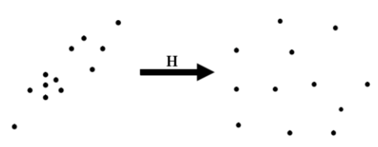
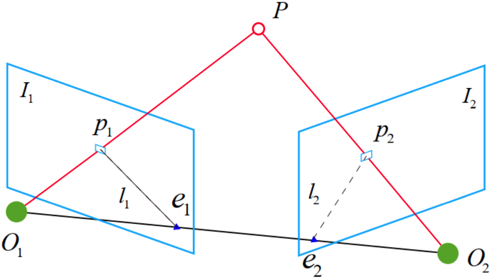
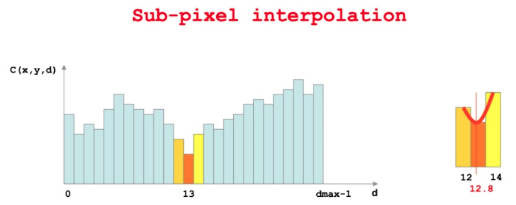
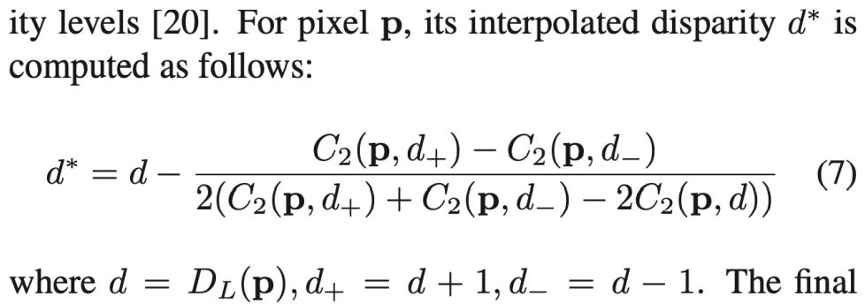

# ORBSLAM2

## TRACKING

### Extract ORB

- **ORB = orientated FAST（旋转不变性）+ BRIEF描述子（特殊设计的固定的pattern）+ 图像金字塔（尺度不变性）**
- ORBSLAM2将图片分块（30*30像素）然后每一块提取FAST角点（为了保证FAST角点的均匀性，见下一条）
- 每一个图像块先用较大阈值提取FAST，提取不到的话用小一些的阈值
- 使用四叉树将整张图中所有的FAST角点（在空间上）**均匀采样**至所需数量（保留质量最好的，即FAST角点提取时的响应值最大的）
    - ORBSLAM2不能使用太竖屏（即宽度<<高度），否则四叉树的初始节点数量为0
    - 数据结构为c++的list，每个节点分裂成4个节点然后加入list最前面
    - 如果节点中之有一个特征点，则后续不再分裂；如果一个都没有，则节点被删除
    - 由于每次分裂完后节点数量为4^n，所以如果想要节点数量刚好为所需的数量，需要：在最后一次分裂之前，优先分裂特征点数量最多的节点，然后到刚好分裂到所需数量时停下来
- orientated FAST**计算灰度质心**时（用于旋转不变性），为了加速计算灰度值的遍历，使用了**对称**的方法，即v只从1开始遍历到v_max（v=0的时候没有对称，因为在u轴上），然后使用v和-v的像素坐标。
    - 问题：为啥u没有用对称呢？
- 提取特征点时使用了**仿函数**，其优点在于
    - 仿函数有自己的成员变量
    - 仿函数通常比一般函数有更好的速度
- 提取描述子前，使用高斯模糊来减少噪声
- 使用**图像金字塔**提取了不同尺度下的ORB特征点后，还需要将金字塔中缩小的层上的ORB特征点的坐标**放大回**原始图像的坐标系
- 对Keypoints进行去畸变，而不是对整张图去畸变，这样能减少计算量
-  去畸变的时候，需要计算去畸变后的图像边界，但是在第一帧或者内参改变之后算一次
- **将图片的有效区域（去畸变后）分成大小64像素的网格，特征点存在每个网格中**
    - 应该是为了后续快速遍历特征点

### Map Initialization

- 步骤如下
    - 将单目初始化的两帧都当做关键帧
    - 然后将所有关键帧的描述子转成BoW，并插入地图
    - 将初始化得到的3D点生成地图点
        - 每个3D点对应一个地图点（三维），包含属性：
            - 观测到地图点的关键帧ID以及它上面对应的二维特征点ID
            - 从这个地图点的所有特征点中选取**最具代表性的特征点**，其描述子作为这个地图点的描述子，选取方法为
                - 计算每个特征点跟其他所有特征点的描述子距离，选取中值
                - 选出中值最小的特征点作为最具代表性的特征点
            - 平均观测方向：能观测到该地图点的所有关键帧，对该点的观测方向归一化为单位向量，然后进平均得到该地图点的朝向
            - 观测距离范围：地图点和当前关键帧的光心距离，乘上所在金字塔的缩放倍数（$=1.2^n$，n为所在金字塔层数）为最大范围（因为图像缩放的时候会有精度丢失？），最大范围÷最大缩放倍数（$=1.2^N$，N为金字塔总层数）为最小范围
    - TODO

### Initial Pose Estimation from last frame or Relocalization

- **卡方检验**：主要在事实与期望不符合情况下看是否系统出了问题，还是属于正常波动。步骤如下
    - 选择要检验的**假设**（H0）及其**备择假设**H1。例如：H0为系统没问题，H1为系统有问题
    
    - 确定**自由度**：用于计算检验统计量的独立变量的数目
    
        - 单行或单列：自由度 = 组数-限制数
        - 表格类：自由度 = (行数 - 1) * (列数 - 1)
    
    - 确定**显著性水平**，是指当原假设为正确时人们却把它拒绝了的概率或风险，通常取α=0.05或α=0.01（即接受H0时，正确概率为95%或99%）
    
    - 根据自由度 & 显著性水平，查表得到**拒绝域**
    
    - 计算**理论期望**$E$和**实际观察次数**$O$
    
    - 使用**卡方公式**计算统计量
        $$
        \mathcal{X}^2=\sum\frac{(O-E)^2}{E}
        $$

    - 如果计算得到的$\mathcal{X}^2$>拒绝域，则拒绝H0接受H1；<的话则相反

### 单目初始化

- 构造初始器Initializer必须要有连续2帧，每一帧特征点数都必须大于100 而且 两帧配准上的特征点数量也要>100，否则删了重新构造

- 初始化时需要专门的特征匹配

    - 只使用原始层级的特征点（缩小层级的不考虑），
    - 特征匹配范围为100（所以要求运动不能太大），搜索的时候遍历范围内的网格（事先已将图片分成大小64像素的网格）
    - 特征匹配距离记录最佳 & 次佳，要求①最佳距离小于一定距离；②最佳要明显小于次佳（即 最佳÷次佳<阈值）
    - 每个特征点最多一个匹配，如果多个匹配就都删掉（？）
    - 可以检查每个配准的角度差（使用直方图），因为一张图上的角度差应该是差不多的，角度差太大的配准可以删掉

- 使用单应矩阵（H）或者本质矩阵（F，更倾向）进行单目初始化，得到2帧相对运动和三维点

    - 使用两个线程同时计算两个矩阵，都使用8个（4对）特征点

    - 计算矩阵（H or F）前，需要对特征点进行归一化，即质心挪到原点然后对尺度归一化。这样能够在一定程度上消除噪声、错误匹配带来的影响，但还是不够的。归一化过程的矩阵形式为
        $$
        \left[\begin{array}{c}
        x^{\prime} \\
        y^{\prime} \\
        1
        \end{array}\right]=
        \left[\begin{array}{ccc}
        s X & 0 & -\operatorname{mean} X * s X \\
        0 & s Y & -\operatorname{mean} Y * s Y \\
        0 & 0 & 1
        \end{array} \right]
        \left[\begin{array}{l}
        x \\
        y \\
        1
        \end{array}\right]\\
        \operatorname{mean} X=\bar\mu_X \text{(均值), } sX=\frac{1}{|\bar\mu_X |\text{(一阶绝对矩) }}
        $$
         

    - 计算完单应矩阵后，需要转换成归一化之前的，基础矩阵同理
        $$
        p_1\text{为图1的特征点，}T_1\text{为它对应的归一化过程}
        \\p^N_1 = T_1 p_1, p^N_1 = T_2 p_2\\
        H_{2to1} =\operatorname{computeH\_2to1}(p_1, p_2)\\
        H^{final}_{2to1} = T^{-1}_2 H T_1,H^{final}_{1to2} = (H^{final}_{2to1})^{-1}
        $$
        
    - 计算完两个矩阵后，使用单应矩阵计算重投影误差，作为RANSAC的评分

- 初始化成功后，删除那些无法进行三角化的匹配点

- 单应矩阵计算$R+t$：《motion and structure from motion in a piecewise planar environment》

  - 单应矩阵$H=\boldsymbol{K}\left(\boldsymbol{R}-\frac{\boldsymbol{t} \boldsymbol{n}^{\mathrm{T}}}{d}\right) \boldsymbol{K}^{-1}$，令$A=\boldsymbol{R}-\frac{\boldsymbol{t} \boldsymbol{n}^{\mathrm{T}}}{d}$，则$A=K^{-1}*H*K$

  - 对A进行奇异分解，得到奇异值$d_1, d_2, d_3$（从大到小）

  - 令$d'=d_2$（也可以$d'=-d_2$），接下来要分别计算并讨论 H 矩阵分解的 8 组解

  - 根据论文eq.12得
    $$
    \left\{\begin{array}{l}
    x_{1}=\varepsilon_{1} \sqrt{\frac{d_{1}^{2}-d_{2}^{2}}{d_{1}^{2}-d_{3}^{2}}} \\
    x_{2}=0 \\
    x_{3}=\varepsilon_{3} \sqrt{\frac{d_{2}^{2}-d_{3}^{2}}{d_{1}^{2}-d_{3}^{2}}}
    \end{array}\right.
    \quad \varepsilon_{1}, \varepsilon_{3}=\pm 1
    $$

  - 首先讨论$d'>0$的情况，根据论文eq.13-14得到四组R+t

  - 再讨论$d'<0$的情况，根据论文eq.15-16得到四组R+t

  - 对8组解进行验证，并选择在相机前方最多3D点的解为最优解，满足以下条件

      - 最优解中3D点数量，*0.75>次优解，>最小数量，占总数的90%以上
      - 视差角>1°

- 基础矩阵计算$R+t$：

  - 计算本质矩阵$E=K^T*F*K$
  - 对本质矩阵E进行SVD分解得$E=U\Sigma V^T$
  - $U$的最后一列归一化后就是$t$（why？？？），令$\boldsymbol{R}_{1} =\boldsymbol{U} \boldsymbol{R}_{Z}^{\mathrm{T}}\left(\frac{\pi}{2}\right) \boldsymbol{V}^{\mathrm{T}}$和$ \boldsymbol{R}_{2} =\boldsymbol{U} \boldsymbol{R}_{Z}^{\mathrm{T}}\left(-\frac{\pi}{2}\right) \boldsymbol{V}^{\mathrm{T}}$，则得到四组可能的解$(R_1,\pm t)$和$(R_2,\pm t)$
  - 对4组解进行验证，并选择在相机前方最多3D点的解为最优解，满足以下条件
    - 有效匹配点的数量*0.9>50
    - 最优解中3D点数量，*0.7>次优解
    - 视差角>1°
  
- 单目投影恢复三维点

  

  - 假设单应矩阵or基本矩阵得到的R+t是从2->1的，则第2个相机的坐标系到第一个相机的坐标系的变换矩阵为
    $$
    T_{1->2}=T_{2->1}^{-1}=\left[\begin{array}{cc}R_{21} & t_{21} \\ 0^{T} & 1\end{array}\right]^{-1}=\left[\begin{array}{cc}
    R_{21}^{T} & -R_{21}^{T} t_{21} \\
    0^{T} & \mathbf{1}
    \end{array}\right]
    $$

  - 所以第二个相机的光心坐标为$-R_{21}^{T} t_{21}$

  - 特征点的投影矩阵为$P=K*[R | t]$（维度3*4）

  - 将空间点$X$投影到图像上的$x$，其中$\lambda$为归一化因子（未知），$p_1$的矩阵为投影矩阵
      $$
      \left[\begin{array}{c}
      x \\
      y \\
      1
      \end{array}\right]=\lambda\left[\begin{array}{llll}
      p_{1} & p_{2} & p_{3} & p_{4} \\
      p_{5} & p_{6} & p_{7} & p_{8} \\
      p_{9} & p_{10} & p_{11} & p_{12}
      \end{array}\right]\left[\begin{array}{c}
      X \\
      Y \\
      Z \\
      1
      \end{array}\right]=\lambda\left[\begin{array}{lll}
      - & P_{0} & - \\
      - & P_{1} & - \\
      - & P_{2} & -
      \end{array}\right]\left[\begin{array}{l}
      X \\
      Y \\
      Z \\
      1
      \end{array}\right]
      $$

  - 上面方程左右两遍同时叉乘$\left[\begin{array}{l}x \\ y \\ 1\end{array}\right]$后，左边变成0，同时可以约去$\lambda$，整理后得到
      $$
      \left[\begin{array}{c}
      y P_{2}-P_{1} \\
      P_{0}-x P_{2} \\
      x P_{1}-y P_{0}
      \end{array}\right]\left[\begin{array}{l}
      X \\
      Y \\
      Z
      \end{array}\right]=\left[\begin{array}{l}
      0 \\
      0 \\
      0
      \end{array}\right]
      $$

  -  根据一对特征点（2个点），并取上面矩阵的前两行（因为Z未知且单个点无法计算得到Z）得公式
      $$
      \left[\begin{array}{c}
      y P_{2}-P_{1} \\
      P_{0}-x P_{2} \\
      y^{\prime} P_{2}^{\prime}-P_{1}^{\prime} \\
      P_{0}^{\prime}-x^{\prime} P_{2}^{\prime}
      \end{array}\right] X=AX=0
      $$

  - 使用SVD求解，右奇异矩阵的最后一行就是最终的解。如果计算得到的Z＜0，则丢弃

  - （可选）计算$\angle O_1PO_2$，如果小于1°，则丢弃

  - 计算重投影误差，即将三维点投影到第二张图然后跟第二张图的二维点计算距离，如果太大的话就丢弃

### 双目初始化

- 输入双目图片已经做了极线矫正

- 立体匹配步骤（左图右图反一下没关系）

    - 对于<u>右图</u>中每一个特征点$F_r$，确定<u>左图</u>搜索范围

        - 虽然已经做了极线矫正，但是实际中并不是只在对应的那一行上进行搜索，而是在那一行的上下几行进行搜索，因为存在误差
        - 也不是每一列都搜索的，如果在左图上搜索右图上的像素$p$，搜索范围为$[p-maxD,p-minD]$
            - 最小depth不能超过基线，所以最大视差$maxD=\frac{f*b}{b}$
            - 最大depth是无穷远，所以最小视差$minD=0$
        - 去搜索范围内的特征点来进行匹配，而且要求空间尺度差（图像金字塔里面的）不超过2

    - 粗配准：将$F_r$跟搜索范围内所有的特征点配准，使用描述子的汉明距离来衡量相似度

    - 精配准：SAD，滑动窗口，

        - 需要注意有没有越界
        - 在配准到的特征点的附近滑动，滑动范围为5
        - 将窗口中图片归一化以减少亮度变化的影响

    - 亚像素插值

         

    - 保存最优视差值（深度）
    - 删除outliers：根据SAD的值，删除＞1.5\*1.4\*中值的点

    

### Track Local Map

### New KeyFrame Decision

## LOCAL MAPPING

### KeyFrame Insertion

### Recent MapPoints Culling

### New Points Creation

### Local BA

### Local KeyFrames Culling

## LOOP CLOSING

### Candiates Detection

### Compute Sim3

### Loop Fusion

### Optimize Essential Graph

## MAP

## PLACE RECOGNITION

