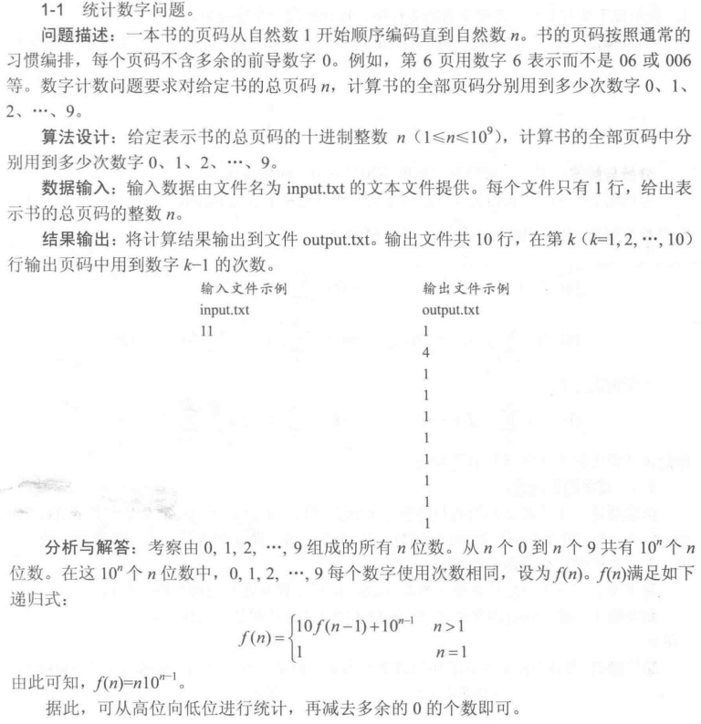
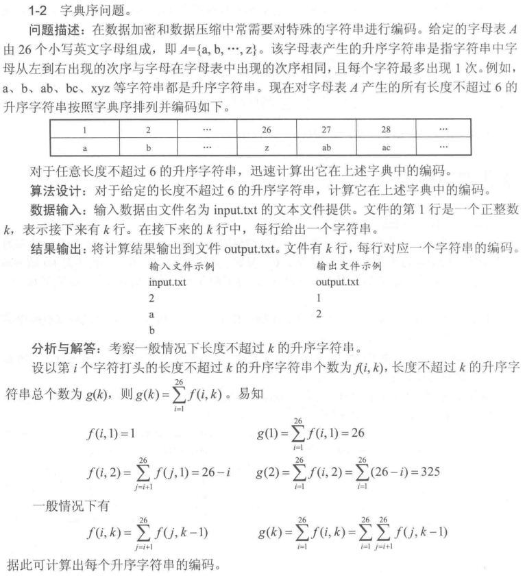
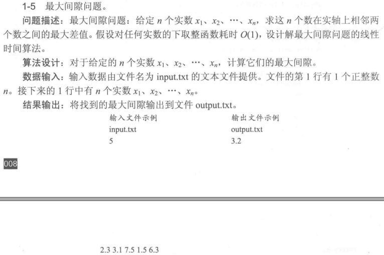

此为《计算机算法设计与分析》的笔记

# 算法概论

## 统计数字问题

**公式的理解**

例如$n=3$，有三位_ _ _，假设每一位都可以取0-9。在后两位中，每个数字出现的个数为$f(n-1)$，当最高位从0-9时，每个数字的个数都增加了$f(n-1)$，即总共增加了$10*f(n-1)$；而当最高位为某个数字（比如1）的时候，除了两位中出现了这个数字，最高位也出现了这个数字，并且出现的次数为$10^{n-1}$；所以$f(n)=10*f(n-1)+10^{n-1}$，即n位的一个数，其中0-9每个数字出现的个数可以用n-1位的重复10次，然后加上最高位出现的次数。

又因为题目要求书页不以0开始，所以说要减去0打头的数字中0的个数$\sum_{i=0}^{n-1} 10^i$

**我自己的另一种理解方式**

对任意数字。如果只有1位，表示为$X$，那么X之前的数字每个加1，然后就可以结束了

如果有2位以上，表示为$Xxx...x, X=1..9$，并且可以分为两个部分$X00...0$和$xx...x$。

- 第一部分：$X00...0$统计数字公式应该为

$$
从000...0到(X-1)99...9除去高位中，统计每个数字的个数：f(n)=x*f(n-1)=x*(n-1)*10^{n-2}\\
从000...0到(X-1)99...9的高位中，统计0~X-1数字的个数：f(n)=10^{n-1}\\
然后X对应数字的个数要加1，0的个数要加(数字的位数-1)，即算上X00...0本身中数字的个数\\
接着X对应数字的个数要加xx...x，因为第二个部分其实也是带有最高位的\\
最后剔除0开头的数字中0的个数：f(0)=\sum_{i=0}^{n-1-1}10^i
$$

- 第二部分：$xx...x$可以被当作另一个$Xxx...x$进行递归

例如：数字54321，分成两个部分0\~50000和50000\~54321。

- 第一部分：

    - 0~49999里低位5个9999，其中每个数字的个数为$f(n)=5*4*10^3$
    - 0\~49999里高位中，之出现了1\~4，他们的个数为$f(n)=10^4$
    - 在50000中，5的个数+1，0的个数加5-1
    - 因为在第二部分中，最高位为5，所以5的个数要加4321
    - 0~09999中，有很多数字开头全都是零，其中这些数字的个位出现了1次0，十位出现了10次，百位出现了10*10次。。。总共要减掉$10^0+10^1+10^2+10^3=\sum_{i=0}^3 10^i$

- 第二部分：因为最高位5已经在上面统计过了，所以只用统计剩下的4321。而4321也可以被进一步拆解成两个部分，从而实现递归。

    

## 字典序问题

**理解**

背景：对于长度为$a$的字符串，在升序的限制下，总共会有$C_{26}^a$种。因为从26个字母中选出了$a$个字母后，只能有一种排序方式，即升序排法。

假设字符串为①②③④⑤...，长度为$length$，位置为$location$（初始为0）。

首先可以计算出长度≤$l-1$的字符串的个数。即$\sum_{i=1}^{length-1} C_{26}^i$。

那么长度为$length$的字符串就应该从它后面开始计算。

先看第一个字母`①`。它的前面有 从`a`到`①`的字母打头的所有字符串，他们的长度分别为$C_{25-('a'-'a')}^{length-1},C_{25-('b'-'a')}^{length-1}...C_{25-(①-'a')}^{length-1}$（25的原因是打头的字母后面不能重复）。

​	比如`①`为`d`，那么在`d`打头的字符串之前，还有`a、b、c`打头的字符串，他们的长度分别为$C_{25-('a'-'a')}^{2}=C_{25}^{2},C_{25-('b'-'a')}^{2}=C_{24}^{2},C_{25-('c'-'a')}^{2}=C_{23}^{2}$

再看第二个字母`②`。它的前面有 从`①`（因为升序）到`②`打头的所有字符串，他们的长度分别为$C_{25-(①+1-a')}^{length-2}...C_{25-(②-'a')}^{length-2}$。

​	比如②为`g`，那么在`g`打头的字符串之前，还有`e、f`打头的字符串，他们的长度分别为$C_{25-('e'-'a')}^{1}=C_{21}^{1},C_{25-('f'-'a')}^{1}=C_{20}^{1}$

∴对于第$c$个字母`©`，它前面一个字母为`®`。它的前面有`®`到`©`打头的字符串，长度分别为$C_{25-i}^{length-c},i=(®+1-'a')...(©-'a')$

最终的$location$为上面所有的排列组合公式求和，再＋1（因为求和只是算的当前位置的前一个位置）。

## 最大间隙问题

核心思想：n个点，其中两个点作为左右边界。剩下n-2个点，在n-1个格子必定有一个为空。找到空的格子，ta前面格子的最大值和后面格子的最小值间隙最大。鸽舍原理？？？