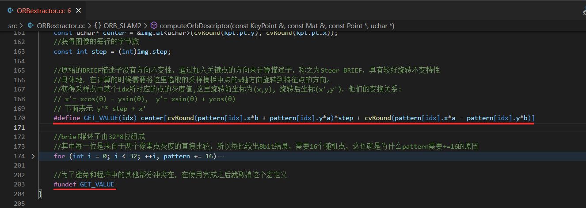

# 基础

## pair

- [`std::pair`](https://www.cnblogs.com/nimeux/archive/2010/10/05/1844191.html)主要的作用是将两个数据组合成一个数据，两个数据可以是同一类型或者不同类型

    - 例如std::pair<int,float> 。

    - pair`实质上是一个结构体，其主要的两个成员变量是first和second，这两个变量可以直接使用。初

    - 始化一个pair可以使用构造函数，也可以使用std::make_pair函数，

    - make_pair函数的定义如下：

        ```c++
        template pair make_pair(T1 a, T2 b) { return pair(a, b); }
        ```

    - 一般make_pair都使用在需要pair做参数的位置，可以直接调用make_pair生成pair对象。 

    - pair可以接受隐式的类型转换，这样可以获得更高的灵活度

## static

- [类中的**静态成员变量**](http://c.biancheng.net/view/2227.html)：
    - 实现多个对象 <u>共享数据</u>的目标。
    - 静态成员变量 是<u>全局变量</u>，不占用对象的内存，而是在所有<u>对象之外开辟内存</u>，即使<u>不创建对象也可以访问</u>，到程序结束时才释放
    - 静态成员变量必须初始化，<u>不能在类定义里边初始化</u>，只能在class body外初始化
    - 静态成员变量可以<u>通过 对象名 or 类名 访问</u>，但要遵循 private、protected 和 public 关键字的访问权限限制
- [类中的**静态成员函数**](http://c.biancheng.net/view/2228.html)：
    - 静态成员函数 <u>没有this指针</u>，编译器不会为它增加形参 this，不能调用普通成员函数，<u>只能访问静态成员（主要目的）</u>
- 

# 多线程

## thread

- [函数**形参为引用**时](https://stackoverflow.com/questions/65358028/c-thread-error-static-assert-failed-due-to-requirement)，需要将实参使用`std::ref()`转换成`reference_wrapper`后再传入，例如

    ```c++
    void foo(int &args){
    	// something
    }
    int main(){
        int args;
        std::thread worker(foo, std::ref(args));
        worker.join();
    }
    ```

- [调用**重载的类成员函数**](https://blog.csdn.net/OTZ_2333/article/details/125736959)

    ```c++
    #include<iostream>
    #include<thread>
    using namespace std;
    
    class Print{
     public:
      void print() { cout << "void print()" << 0 << endl; }
      void print(int i) { cout << "void print(int i)" << i << endl; }
      int print(float i) { cout << "void print(float i)" << i << endl; return 0; }
      void print(int i, float j) { cout << "void print(int i, float j)" << i << " " << j << endl; }
      void print(const int& i) { cout << "void print(const int& i)" << i << endl; }
    };
    int main() {
      Print p1, p2;
      thread t1(static_cast<void(Print::*)()>(&Print::print), &p1);
      thread t2(static_cast<void(Print::*)(int)>(&Print::print), &p1, 1);
      thread t3(static_cast<int(Print::*)(float)>(&Print::print), &p1, 2.0);
      thread t4(static_cast<void(Print::*)(int, float)>(&Print::print), &p1, 3, 4.0);
      thread t5(static_cast<void(Print::*)(const int&)>(&Print::print), &p2, 5); // 不能去掉&，否则调用的是void print(int i)
    
      t1.join();t2.join();t3.join();t4.join();t5.join();
      return 0;
    }
    ```

- [函数的形参即使有**默认值**，在thread中调用时仍然需要给那个参数赋值](https://stackoverflow.com/a/65182257/11271721)，因为正常调用函数时，编译器其实是将默认参数填进去了；而thread是一个标准库中的函数，不会多加一个参数，必须要求找到参数数量相同的函数

# 文件操作

## 文件读写

- c语言风格

    ```c
    FILE *fp;
    string path = "./depth.txt";
    fp = fopen(path.c_str(), "r"); //写入文件的话就是"w"，可以根据是否为二进制文件选择添加“b”
    int id=0;
    uint16_t depth[WIDTH * HEIGHT] = {0};
    fread(&id, sizeof(int), 1, fp);	//第二个参数为一次读取数据大小，必须与写入的大小保持一致；第三个参数为读取次数
    fread(depth, sizeof(uint16_t), WIDTH * HEIGHT, fp);	//读取顺序必须与写入顺序一致（因此在写入文件的时候，某种程度上就是对文件加密了，因为只要读取顺序、方式不对，读取出来的内容就不是原来的内容了）。fread执行完以后会自动将指针指向未读取的第一个元素（但是win上有时候会有bug，不会自动挪动指针）
    fclose(fp);
    ```

- c++风格：一次读取一行。头文件`#include <fstream>`

    ```c++
    string filepath = "./depth.txt", data;
    ifstream fp(filepath);
    if (!fp) {
        cout << "Error: " << "file " << filepath <<" does not exit!" << endl;
        exit(0);
    }
    while (getline(fp, data)) {
    	...
    }
    fp.close();
    ```

## 读取整个文件到string

```c++
#include <string>
#include <fstream>

std::ifstream file("file.txt");
std::string str((std::istreambuf_iterator<char>(file)),
                std::istreambuf_iterator<char>());

```

## 递归读取某一文件夹下文件/子目录的完整路径

可以指定文件类型、也可以只搜索

```cpp
#include <dirent.h>
# 注意father_dir要以“/”结尾，例如“../binfiles/”
bool GetFilesPath(const string& father_dir, vector<string> &files ){
    DIR *dir=opendir(father_dir.c_str());
    if(dir==nullptr){
        cout << father_dir << " don't exit!" << endl;
        return false;
    }
    struct dirent *entry;
    while((entry = readdir(dir)) != nullptr){
        string name(entry->d_name);               
        if(entry->d_type == DT_DIR ) { // 类型为目录
            if (name.find('.') == string::npos) {	//排除“.”和“..”以及隐藏文件夹
                string son_dir = father_dir + name + "/";

                vector<string> tempPath;
                GetFilesPath(son_dir, tempPath);
                files.insert(files.end(), tempPath.begin(), tempPath.end());
            }
        }
        else if(name.find("bin") != string::npos) // 类型为文件。只找bin文件
            files.push_back(father_dir+name);
    }
    closedir(dir);
    return true;
}
```

## 获得文件格式

```c++
std::string fn = "filename.conf";
if(fn.substr(fn.find_last_of(".") + 1) == "conf") {
	std::cout << "Yes..." << std::endl;
} else {
	std::cout << "No..." << std::endl;
}
```


# 字符串操作

## 提取字符串最后一个字符

```c++
string str = "...";
// 方法一
cout << str[str.length()-1] << endl;

// 方法二
string::const_iterator it = str.end();
it--;
cout << *it << endl;
```


## String <--> int、float、double

```c++
// int、float、double  --> string
string s = to_string(num);

// string --> int、float、double
cout << stoi(s) << endl; //string --> int;
cout << stol(s) << endl; //string --> int
cout << stof(s) << endl; //string --> float
cout << stof(s) << endl; //string --> doubel
```


## find()：查询是否包含字符(串)

```c++
string s = "...";
if (s.find("...") != String::npos)
```


## strtok()：根据分隔符分割字符串

> 参考资料：[C++之split字符串分割](https://blog.csdn.net/Mary19920410/article/details/77372828)

```cpp
#incude <vector>
vector<string> split(const string &str, const string &delim) {
    vector<string> res;
    if ("" == str) return res;
    //先将要切割的字符串从string类型转换为char*类型
    char *strs = new char[str.length() + 1]; //不要忘了
    strcpy(strs, str.c_str());

    char *d = new char[delim.length() + 1];
    strcpy(d, delim.c_str());

    char *p = strtok(strs, d); // 第一个参数为起始位置
    while (p) {
        string s = p; //分割得到的字符串转换为string类型
        res.push_back(s); //存入结果数组
        p = strtok(NULL, d);
    }
    return res;
}
```

## cout彩色输出

> 参考资料：[std::cout彩色输出](https://blog.csdn.net/zww0815/article/details/51275262)

```c++
#define RESET   "\033[0m"
#define RED     "\033[31m" 
#define YELLOW  "\033[33m" 
#define BLUE    "\033[34m"
#define GREEN   "\033[32m" 
cout << RED << "I am RED. " << RESET << "I am normal. " << YELLOW << "I am YELLOW" << endl; 
```

## 多次重复一个字符

在python中可以使用`"="*10`得到`"=========="` 的效果，c++中则使用`std::string(10, '=')`

# STL

## vector

- vector.push_back中完成的是值拷贝，而不仅仅是地址的复制。
- [vector中使用emplace_back代替push_back](http://c.biancheng.net/view/6826.html)，因为emplace_back的效率更高
    - push_back() 向容器尾部添加元素时，首先会创建这个元素，然后再将这个元素拷贝或者移动到容器中（如果是拷贝的话，事后会自行销毁先前创建的这个元素）
    - emplace_back() 在实现时，则是直接在容器尾部创建这个元素，省去了拷贝或移动元素的过程。

# 其他

## 使用PCL解析命令行参数

```c++
int main(int argc, char **argv) {
    cout << RED << "解析命令行参数中。。。" << RESET << endl;
    string parameter;
    int arg_index = pcl::console::find_argument(argc, argv, "--filename");
    if (arg_index != -1)
        parameter = argv[arg_index];
    else parameter = "...";
    ...
}
```

## 使用宏定义来定义“函数”

如果需要多次用到某个小操作，可以使用宏定义来定义一个临时的"函数"，而不是定义专门的函数（有调用时间）or 内联函数（太复杂了）

例如在ORBSLAM2中使用宏定义给二维向量进行旋转



## 获取屏幕分辨率

- Linux：头文件不需要在CMake中进行任何设置

    ```c++
    #include <X11/Xlib.h>	// 直接include
    
    Display* d = XOpenDisplay(NULL);
    Screen* s = DefaultScreenOfDisplay(d);
    cout << "Witdh = " << s->width << ", height = " << s->height << endl;
    ```

    

# CMake

- 设置c++版本

    ```cmake
    # 方法一
    add_compile_options(-std=c++11)
    # 方法二: 从CMake v3.1开始
    set(CMAKE_CXX_STANDARD 14)
    # 方法三
    set(CMAKE_CXX_FLAGS "${CMAKE_CXX_FLAGS} -std=c++11")
    ```

    
