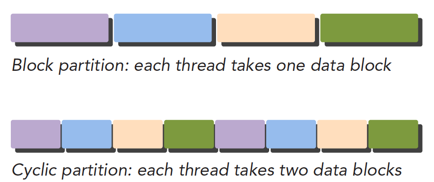
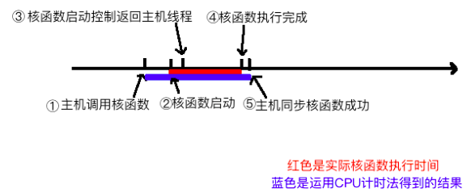
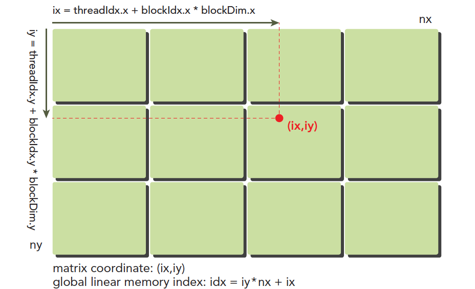
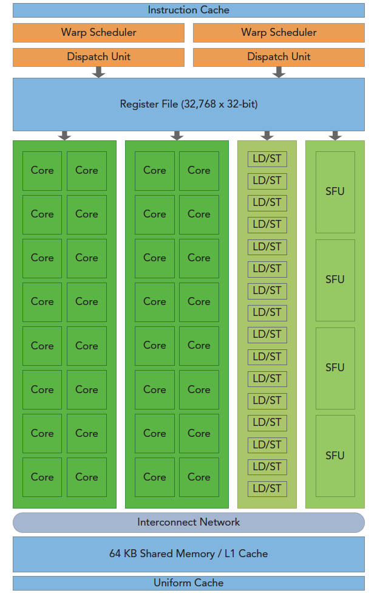
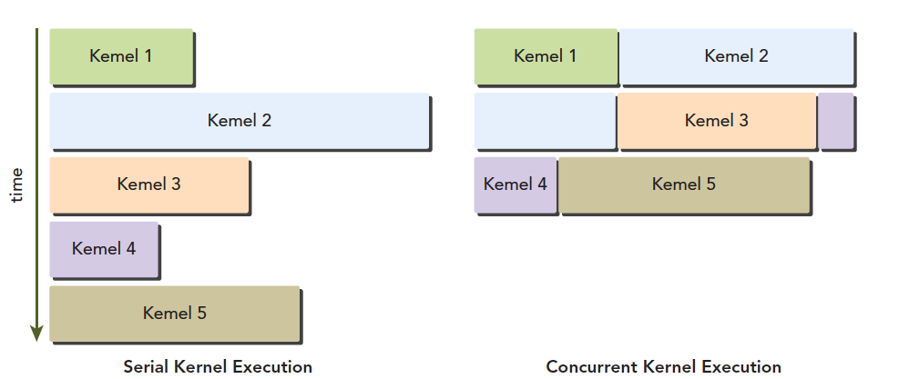
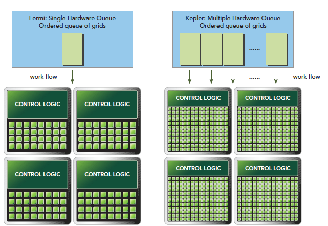

> [推荐几个不错的CUDA入门教程（非广告）](https://godweiyang.com/2021/01/25/cuda-reading/)

# CUDA编程入门极简教程

> CUDA编程入门极简教程 - 小小将的文章 - 知乎 https://zhuanlan.zhihu.com/p/34587739

## CUDA编程基础

- host指代CPU及其内存，device指代GPU及其内存

- 核函数（kernel）：在device上线程中并行执行的函数

    - 核函数用`__global__`符号声明，在调用时需要用`<<<grid, block>>>`来指定kernel要执行的线程数量
    - CUDA中，每一个线程都要执行核函数，并且每个线程会分配一个唯一的线程号thread ID，这个ID值可以通过核函数的内置变量`threadIdx`来获得

- cuda用三个函数类型限定词，区别host和device上的函数

    - `__global__`：在device上执行
        - 从host中调用（一些特定的GPU也可以从device上调用）
        - 返回类型必须是`void`，不支持可变参数参数，不能成为类成员函数
        - 注意：用`__global__`定义的kernel是异步的，这意味着host不会等待kernel执行完就执行下一步。
    - `__device__`：在device上执行
        - 单仅可以从device中调用
        - 不可以和`__global__`同时用
    - `__host__`：（一般省略不写）在host上执行
        - 仅可以从host上调用
        - 不可以和`__global__`同时用，但可和`__device__`，此时函数会在device和host都编译

- （逻辑层）kernel的线程两层组织结构：gird和block均为2-dim

    - 第一层**网格**（grid）：一个kernel所启动的所有线程称

        - 同一个网格上的线程共享相同的全局内存空间

    - 第二层**线程块**（block）：一个线程块里面包含很多线程

         

- grid和block都是定义为`dim3`类型的变量

    - `dim3`可以看成是包含三个无符号整数（x，y，z）成员的结构体变量

    - `dim3`在定义时，缺省值初始化为1。因此grid和block可以灵活地定义为1-dim，2-dim以及3-dim结构

    - 示例：上图结构（主要水平方向为x轴），定义的grid和block如下所示，kernel在调用时也必须通过[执行配置](https://link.zhihu.com/?target=http%3A//docs.nvidia.com/cuda/cuda-c-programming-guide/index.html%23execution-configuration)`<<<grid, block>>>`来指定kernel所使用的线程数及结构。

        ```c++
        dim3 grid(3, 2);
        dim3 block(5, 3);
        kernel_fun<<< grid, block >>>(prams...);
        ```

- 一个线程需要两个内置的坐标变量（blockIdx，threadIdx）来唯一标识，它们都是`dim3`类型变量，

    - blockIdx指明线程所在grid中的位置，而threaIdx指明线程所在block中的位置

    - 示例：上图Thread (1,1)满足

        ```c++
        threadIdx.x = 1
        threadIdx.y = 1
        blockIdx.x = 1
        blockIdx.y = 1
        ```

- 线程的全局ID： 假设线程局部ID为$(x,y,z)$，3-dim的block$(D_x,D_y,D_z)$​（通过变量blockDim获得），则全局坐标为
    $$
      (x+y*D_x+z*D_x*D_y)
    $$
    另外线程还有内置变量gridDim，用于获得网格块各个维度的大小。

- CUDA的内存模型

    - 本地内存（Local Memory）：每个 线程 有自己的私有

    - 共享内存（Shared Memory）：每个 线程块 包含，可以被线程块中所有线程共享

        - 其生命周期与线程块一致

    - 全局内存（Global Memory）：所有的线程都可以访问

    - 常量内存（Constant Memory）：所有的线程都只读

    - 纹理内存（Texture Memory）：所有的线程都只读

         

- 流式多处理器（SM，Streaming Multiprocessor）

    - 核心组件包括CUDA核心，共享内存，寄存器等
    - SM可以并发地执行数百个线程，并发能力就取决于SM所拥有的资源数
    - 一个线程块只能在一个SM上被调度。SM一般可以调度多个线程块
    - SM采用的是[SIMT](https://link.zhihu.com/?target=http%3A//docs.nvidia.com/cuda/cuda-c-programming-guide/index.html%23simt-architecture) (Single-Instruction, Multiple-Thread，单指令多线程)架构，
        - 基本的执行单元是线程束（warps)，线程束包含32个线程（所以block大小一般要设置为32的倍数）
        - 这些线程同时执行相同的指令，但是每个线程都包含自己的指令地址计数器和寄存器状态，也有自己独立的执行路径。

     

## 函数API

- 内存管理

    - cudaMalloc函数：在device上分配内存，和C语言中的malloc类似

        ```c++
        cudaError_t cudaMalloc(void** devPtr, size_t size);
        ```

        > devPtr：指向所分配内存的指针

    - cudaFree函数：释放分配的内存，和C语言中的free函数对应

    - cudaMemcpy函数：负责host和device之间数据通信

        ```c++
        cudaError_t cudaMemcpy(void* dst, const void* src, size_t count, cudaMemcpyKind kind)
        ```

        > src：向数据源
        >
        > dst：目标区域
        >
        > count：复制的字节数
        >
        > kind：控制复制的方向，cudaMemcpyHostToHost, cudaMemcpyHostToDevice, cudaMemcpyDeviceToHost及cudaMemcpyDeviceToDevice

    - cudaMallocManaged函数：统一内存，使用一个托管内存来共同管理host和device中的内存，并且自动在host和device中进行数据传输

        ```c++
        cudaError_t cudaMallocManaged(void **devPtr, size_t size, unsigned int flag=0);
        ```

# GPU编程（CUDA）- 谭升的博客

> [GPU编程（CUDA）- 谭升的博客](https://face2ai.com/program-blog/#GPU%E7%BC%96%E7%A8%8B%EF%BC%88CUDA%EF%BC%89)

## [1.0 并行计算与计算机架构](http://www.face2ai.com/CUDA-F-1-0-并行计算与计算机架构/)

- 该博客参考《CUDA C编程权威指南》，结构如下

     

- **并行计算** 涉及 计算机架构（硬件）&& 并行程序设计（软件）

- **程序并行** 分为 指令并行 && <u>数据并行</u>（更关注）

- 数据并行程序设计首先依据线程划分数据：块划分、周期划分
     


## 1.1 [异构计算与CUDA](https://face2ai.com/CUDA-F-1-1-%E5%BC%82%E6%9E%84%E8%AE%A1%E7%AE%97-CUDA/)

- 衡量GPU计算能力：

    | 容量特征                 | 性能指标     |
    | ------------------------ | ------------ |
    | CUDA核心数量（越多越好） | 峰值计算能力 |
    | 内存大小（越大越好）     | 内存带宽     |

    - nvidia自己有一套描述GPU计算能力的代码，其名字就是“计算能力”，主要区分不同的架构

        - 早其架构的计算能力不一定比新架构的计算能力强

        | 计算能力 | 1.x   | 2.x   | 3.x    | 4.x     | 5.x    | 6.x   |
        | -------- | ----- | ----- | ------ | ------- | ------ | ----- |
        | 架构名   | Tesla | Fermi | Kepler | Maxwell | Pascal | Volta |

- CUDA C 是标准ANSI C语言的扩展

- CUDA API：用来操作设备完成计算。分类

    - CUDA驱动API：低级的API，使用相对困难

    - CUDA运行时API：高级API使用简单，其实现基于驱动API

      > 注意：两者之间的函数不可以混合调用

       

- CUDA代码可以分成两部分：CPU 主机端代码 && GPU 设备端代码（核函数）
  
    - CUDA nvcc编译器会自动分离你代码里面的不同部分
        
    
- 一般CUDA程序分成下面这些步骤：

    - 分配GPU内存
    - 拷贝内存到设备
    - 调用CUDA内核函数来执行计算
    - 把计算完成数据拷贝回主机端
    - 内存销毁

- NVIDIA为提供工具

    - Nvidia Nsight集成开发环境
    - CUDA-GDB 命令行调试器
    - 性能分析可视化工具
    - CUDA-MEMCHECK工具
    - GPU设备管理工具

## [2.0 CUDA编程模型概述(一)](http://www.face2ai.com/CUDA-F-2-0-CUDA编程模型概述1/)

- 编程模型：

    - 理解我们要用到的语法，内存结构，线程结构等这些我们写程序时我们自己控制的部分，这些部分控制了异构计算设备的工作模式，都是属于编程模型。
    - GPU（或者其他异构）中大致可以分为：核函数 + 内存管理 + 线程管理 + 流

- **内存管理：**

    | 标准C函数 | CUDA C 函数 | 说明     |
    | --------- | ----------- | -------- |
    | malloc    | cudaMalloc  | 内存分配 |
    | memcpy    | cudaMemcpy  | 内存复制 |
    | memset    | cudaMemset  | 内存设置 |
    | free      | cudaFree    | 释放内存 |

     

- **线程管理：**

    - 一个核函数只能有一个grid，一个grid可以有很多个block，每个块可以有多个thread
    - 不同block内thread不能相互影响！他们是物理隔离的！
    - thread标号通过下面两个内置结构体（基于 uint3）确认
        - blockIdx（线程块在线程网格内的位置索引）：有x、y、z
        - threadIdx（线程在线程块内的位置索引）：有x、y、z
    - thread标号的范围则通过 blockDim和gridDim确定，是dim3类型（基于 uint3）。grid 和 block 一般是二维和三维的

## [2.1 CUDA编程模型概述(二)](http://www.face2ai.com/CUDA-F-2-1-CUDA编程模型概述2/)

- 核函数启动

    ```c
    kernel_name<<<grid,block>>>(argument list);
    ```

    > 可以使用dim3类型的grid维度和block维度配置内核，也可以使用int类型的变量，或者常量直接初始化
    >
    > **所有CUDA核函数的启动都是异步的**，这点与C语言是完全不同的

- 当host启动了核函数，控制权马上回到host，而不是host等待device完成核函数的运行

- **host等待device执行**

    - 显式方法

        ```c
        cudaError_t cudaDeviceSynchronize(void);
        ```

    - 隐式方法：设备端不执行完，主机没办法进行，比如内存拷贝函数

        ```
        cudaError_t cudaMemcpy(void* dst,const void * src,
          size_t count,cudaMemcpyKind kind);
        ```

- 核函数声明的**限定符**

    | 限定符     | 执行       | 调用                                            | 备注                     |
    | ---------- | ---------- | ----------------------------------------------- | ------------------------ |
    | __global__ | 设备端执行 | 可以从主机调用，也可以从计算能力3以上的设备调用 | 必须有一个void的返回类型 |
    | __device__ | 设备端执行 | 设备端调用                                      |                          |
    | __host__   | 主机端执行 | 主机调用                                        | 可以省略                 |

    > 特殊情况：有些函数可以同时定义为 device 和 host

- Kernel核函数限制

    - 只能访问设备内存
    - 必须有void返回类型
    - 不支持可变数量的参数
    - 不支持静态变量
    - 显示异步行为

- ==CUDA小技巧==：当我们进行调试的时候可以把核函数配置成单线程的

    ```c
    kernel_name<<<1,1>>>(argument list)
    ```

- 错误防御性处理

    ```c++
    #define CHECK(call)\
    {\
      const cudaError_t error=call;\
      if(error!=cudaSuccess)\
      {\
          printf("ERROR: %s:%d,",__FILE__,__LINE__);\
          printf("code:%d,reason:%s\n",error,cudaGetErrorString(error));\
          exit(1);\
      }\
    }
    ```

## [2.2 给核函数计时](http://www.face2ai.com/CUDA-F-2-2-核函数计时/)

- CPU计时

    ```c
    #include <sys/time.h>
    double cpuSecond(){
      struct timeval tp;
      gettimeofday(&tp,NULL);
      return((double)tp.tv_sec+(double)tp.tv_usec*1e-6);
    }
    int main(){
      // ...
      double iStart,iElaps;
      iStart=cpuSecond();
      sumArraysGPU<<<grid,block>>>(a_d,b_d,res_d,nElem);
      cudaDeviceSynchronize();
      iElaps=cpuSecond()-iStart;
      // ...
    }
    ```

     

- 用nvprof计时：用法

    ```c
    nvprof [nvprof_args] <application> [application_args]
    ```

    > 计算能力8.x以上的显卡不能使用这个方法

- ？？？GPU理论界限计算方式，例如

    - Tesla K10 单精度峰值浮点数计算次数：745MHz核心频率 x 2GPU/芯片 x（8个多处理器 x 192个浮点计算单元 x 32 核心/多处理器） x 2 OPS/周期 =4.58 TFLOPS
    - Tesla K10 内存带宽峰值： 2GPU/芯片 x 256 位 x 2500 MHz内存时钟 x 2 DDR/8位/字节 = 320 GB/s
    - 指令比：字节 4.58 TFLOPS/320 GB/s =13.6 个指令： 1个字节

## [2.3 组织并行线程](http://www.face2ai.com/CUDA-F-2-3-组织并行线程/)

- thread的全局坐标(ix, iy):

     

## [2.4 设备信息查询](http://www.face2ai.com/CUDA-F-2-4-设备信息/)

- GPU参数：每一个都对性能有影响
    - CUDA驱动版本
    - 设备计算能力编号
    - 全局内存大小
    - GPU主频
    - GPU带宽
    - L2缓存大小
    - 纹理维度最大值，不同维度下的
    - 层叠纹理维度最大值
    - 常量内存大小
    - 块内共享内存大小
    - 块内寄存器大小
    - 线程束大小
    - 每个处理器硬件处理的最大线程数
    - 每个块处理的最大线程数
    - 块的最大尺寸
    - 网格的最大尺寸
    - 最大连续线性内存


## [3.1 CUDA执行模型概述](http://www.face2ai.com/CUDA-F-3-1-CUDA执行模型概述/)

### GPU架构概述

 

- 流式多处理器SM

     

    > SFU为特殊功能单元，执行固有指令，如正弦，余弦，平方根和插值
    >
    > LD/ST为加载/存储单元

    - 当一个blcok被分配给一个SM后，只能在这个SM上执行，不能重新分配到其他SM上
    - 多个线程块可以被分配到同一个SM上。
    - 在SM上同一个块内的多个线程进行线程级别并行，而同一线程内 指令利用指令级并行将单个线程处理成流水线（串行）。

- 线程束warp：维持在32个线程

    - CUDA 采用单指令多线程SIMT架构管理执行线程

        - 单指令多数据SIMD vs 单指令多线程SIMT

            | SIMD               | SIMT                 |
            | ------------------ | -------------------- |
            | 规定所有人必须执行 | 规定有些人可以不执行 |
            | 指令级别的并行     | 线程级别的并行       |

        - SIMT包括以下SIMD不具有的关键特性：

            - 每个线程都有自己的指令地址计数器
            - 每个线程都有自己的寄存器状态
            - 每个线程可以有一个独立的执行路径

- 编程模型层面看，所有线程都是并行执行的，但在物理层面上看，因为SM有限，所有线程块也是分批执行。**块内同步，但 块之间没办法同步**

### 现有架构

- Fermi 架构：第一个完整的GPU架构

    - 支持并发执行内核：允许执行一些小的内核程序来充分利用GPU

        

-  Kepler 架构：Fermi架构的后代

    - 允许内核启动内核：可以使用GPU完成简单的递归操作

         

    - Hyper-Q技术：CPU和GPU之间的同步硬件连接，以确保CPU在GPU执行的同事做更多的工作

         

## [3.2 理解线程束执行的本质（Part I）](http://www.face2ai.com/CUDA-F-3-2-理解线程束执行的本质-P1/)


## [3.2 理解线程束执行的本质（Part II）](http://www.face2ai.com/CUDA-F-3-2-理解线程束执行的本质-P2/)

## [3.3 并行性表现](http://www.face2ai.com/CUDA-F-3-3-并行性表现/)


## [3.4 避免分支分化](http://www.face2ai.com/CUDA-F-3-4-避免分支分化/)


## [3.5 循环展开](http://www.face2ai.com/CUDA-F-3-5-展开循环/)


## [3.6 动态并行](http://www.face2ai.com/CUDA-F-3-6-动态并行/)


## [4.0 全局内存](http://www.face2ai.com/CUDA-F-4-0-全局内存/)


## [4.1 内存模型概述](http://www.face2ai.com/CUDA-F-4-1-内存模型概述/)


## [4.2 内存管理](http://www.face2ai.com/CUDA-F-4-2-内存管理/)


## [4.3 内存访问模式](http://www.face2ai.com/CUDA-F-4-3-内存访问模式/)


## [4.4 核函数可达到的带宽](http://www.face2ai.com/CUDA-F-4-4-核函数可达到的带宽/)


## [4.5 使用统一内存的向量加法](http://www.face2ai.com/CUDA-F-4-5-使用统一内存的向量加法/)


## [5.0 共享内存和常量内存](http://www.face2ai.com/CUDA-F-5-0-共享内存和常量内存/)


## [5.1 CUDA共享内存概述](http://www.face2ai.com/CUDA-F-5-1-CUDA共享内存概述/)


## [5.2 共享内存的数据布局](http://www.face2ai.com/CUDA-F-5-2-共享内存的数据布局/)


## [5.3 减少全局内存访问](http://www.face2ai.com/CUDA-F-5-3-减少全局内存访问/)


## [5.4 合并的全局内存访问](http://www.face2ai.com/CUDA-F-5-4-合并的全局内存访问/)


## [5.5 常量内存](http://www.face2ai.com/CUDA-F-5-5-常量内存/)


## [5.6 线程束洗牌指令](http://www.face2ai.com/CUDA-F-5-6-线程束洗牌指令/)


## [6.0 流和并发](http://www.face2ai.com/CUDA-F-6-0-流和并发/)


## [6.1 流和事件概述](http://www.face2ai.com/CUDA-F-6-1-流和事件概述/)


## [6.2 并发内核执行](http://www.face2ai.com/CUDA-F-6-2-并发内核执行/)


## [6.3 重叠内核执行和数据传输](http://www.face2ai.com/CUDA-F-6-3-重叠内核执行和数据传输/)


## [6.4 重叠GPU和CPU的执行](http://www.face2ai.com/CUDA-F-6-4-重叠GPU和CPU的执行/)

## [6.5 流回调](http://www.face2ai.com/CUDA-F-6-5-流回调/)

# [NVIDIA CUDA初级教程视频](https://www.bilibili.com/video/BV1kx411m7Fk)

## [1.CPU体系架构概述](https://www.easyhpc.net/course/26/lesson/281/material/356)

- 编译好的程序，最优化目标 = CPI(每条指令的时钟数) * 时钟周期
- Pipelining：利用指令集的并行instruction-level parallelism(ILP)
    - \+ 极大的减小时钟周期
    - \- 增加一些延迟和芯片面积
    - 流水线长度：Alleged Pipeline Length
    - Bypassing旁路：将之前的数据临时开一个小路先送到后面去


5.GPU编程模型
6.CUDA编程（1）
7.CUDA编程（2）
8.CUDA编程（3）
9.CUDA程序分析和调试工具
10.CUDA程序基本优化
11.CUDA程序深入优化
12.CUDA Fortran 介绍 1
13.CUDA Fortran 介绍 2
14.cuDNN
15.SimpleNNwithCUDA