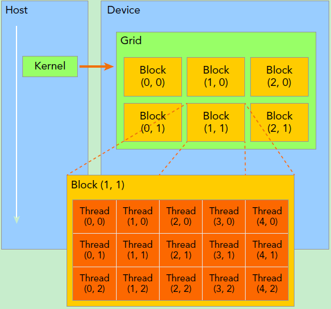
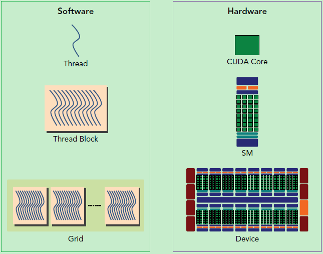
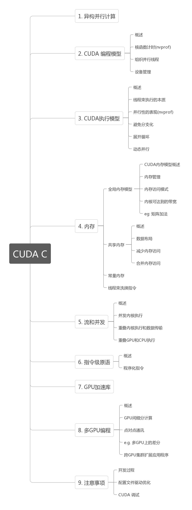

> [推荐几个不错的CUDA入门教程（非广告）](https://godweiyang.com/2021/01/25/cuda-reading/)

# CUDA编程入门极简教程

> CUDA编程入门极简教程 - 小小将的文章 - 知乎 https://zhuanlan.zhihu.com/p/34587739

## CUDA编程基础

- host指代CPU及其内存，device指代GPU及其内存

- 核函数（kernel）：在device上线程中并行执行的函数

    - 核函数用`__global__`符号声明，在调用时需要用`<<<grid, block>>>`来指定kernel要执行的线程数量
    - CUDA中，每一个线程都要执行核函数，并且每个线程会分配一个唯一的线程号thread ID，这个ID值可以通过核函数的内置变量`threadIdx`来获得

- cuda用三个函数类型限定词，区别host和device上的函数

    - `__global__`：在device上执行
        - 从host中调用（一些特定的GPU也可以从device上调用）
        - 返回类型必须是`void`，不支持可变参数参数，不能成为类成员函数
        - 注意：用`__global__`定义的kernel是异步的，这意味着host不会等待kernel执行完就执行下一步。
    - `__device__`：在device上执行
        - 单仅可以从device中调用
        - 不可以和`__global__`同时用
    - `__host__`：（一般省略不写）在host上执行
        - 仅可以从host上调用
        - 不可以和`__global__`同时用，但可和`__device__`，此时函数会在device和host都编译

- （逻辑层）kernel的线程两层组织结构：gird和block均为2-dim

    - 第一层**网格**（grid）：一个kernel所启动的所有线程称

        - 同一个网格上的线程共享相同的全局内存空间

    - 第二层**线程块**（block）：一个线程块里面包含很多线程

         

- grid和block都是定义为`dim3`类型的变量

    - `dim3`可以看成是包含三个无符号整数（x，y，z）成员的结构体变量

    - `dim3`在定义时，缺省值初始化为1。因此grid和block可以灵活地定义为1-dim，2-dim以及3-dim结构

    - 示例：上图结构（主要水平方向为x轴），定义的grid和block如下所示，kernel在调用时也必须通过[执行配置](https://link.zhihu.com/?target=http%3A//docs.nvidia.com/cuda/cuda-c-programming-guide/index.html%23execution-configuration)`<<<grid, block>>>`来指定kernel所使用的线程数及结构。

        ```c++
        dim3 grid(3, 2);
        dim3 block(5, 3);
        kernel_fun<<< grid, block >>>(prams...);
        ```

- 一个线程需要两个内置的坐标变量（blockIdx，threadIdx）来唯一标识，它们都是`dim3`类型变量，

    - blockIdx指明线程所在grid中的位置，而threaIdx指明线程所在block中的位置

    - 示例：上图Thread (1,1)满足

        ```c++
        threadIdx.x = 1
        threadIdx.y = 1
        blockIdx.x = 1
        blockIdx.y = 1
        ```

- 线程的全局ID： 假设线程局部ID为$(x,y,z)$，3-dim的block$(D_x,D_y,D_z)$​（通过变量blockDim获得），则全局坐标为
    $$
      (x+y*D_x+z*D_x*D_y)
    $$
    另外线程还有内置变量gridDim，用于获得网格块各个维度的大小。

- CUDA的内存模型

    - 本地内存（Local Memory）：每个 线程 有自己的私有

    - 共享内存（Shared Memory）：每个 线程块 包含，可以被线程块中所有线程共享

        - 其生命周期与线程块一致

    - 全局内存（Global Memory）：所有的线程都可以访问

    - 常量内存（Constant Memory）：所有的线程都只读

    - 纹理内存（Texture Memory）：所有的线程都只读

         

- 流式多处理器（SM，Streaming Multiprocessor）

    - 核心组件包括CUDA核心，共享内存，寄存器等
    - SM可以并发地执行数百个线程，并发能力就取决于SM所拥有的资源数
    - 一个线程块只能在一个SM上被调度。SM一般可以调度多个线程块
    - SM采用的是[SIMT](https://link.zhihu.com/?target=http%3A//docs.nvidia.com/cuda/cuda-c-programming-guide/index.html%23simt-architecture) (Single-Instruction, Multiple-Thread，单指令多线程)架构，
        - 基本的执行单元是线程束（warps)，线程束包含32个线程（所以block大小一般要设置为32的倍数）
        - 这些线程同时执行相同的指令，但是每个线程都包含自己的指令地址计数器和寄存器状态，也有自己独立的执行路径。

     

## 函数API

- 内存管理

    - cudaMalloc函数：在device上分配内存，和C语言中的malloc类似

        ```c++
        cudaError_t cudaMalloc(void** devPtr, size_t size);
        ```

        > devPtr：指向所分配内存的指针

    - cudaFree函数：释放分配的内存，和C语言中的free函数对应

    - cudaMemcpy函数：负责host和device之间数据通信

        ```c++
        cudaError_t cudaMemcpy(void* dst, const void* src, size_t count, cudaMemcpyKind kind)
        ```

        > src：向数据源
        >
        > dst：目标区域
        >
        > count：复制的字节数
        >
        > kind：控制复制的方向，cudaMemcpyHostToHost, cudaMemcpyHostToDevice, cudaMemcpyDeviceToHost及cudaMemcpyDeviceToDevice

    - cudaMallocManaged函数：统一内存，使用一个托管内存来共同管理host和device中的内存，并且自动在host和device中进行数据传输

        ```c++
        cudaError_t cudaMallocManaged(void **devPtr, size_t size, unsigned int flag=0);
        ```

# GPU编程（CUDA）- 谭升的博客

> [GPU编程（CUDA）- 谭升的博客](https://face2ai.com/program-blog/#GPU%E7%BC%96%E7%A8%8B%EF%BC%88CUDA%EF%BC%89)

## [1.0 并行计算与计算机架构](http://www.face2ai.com/CUDA-F-1-0-并行计算与计算机架构/)

- 该博客参考《CUDA C编程权威指南》，结构如下

    

- **并行计算** 涉及 计算机架构（硬件）&& 并行程序设计（软件）

- **程序并行** 分为 指令并行 && <u>数据并行</u>（更关注）

- 