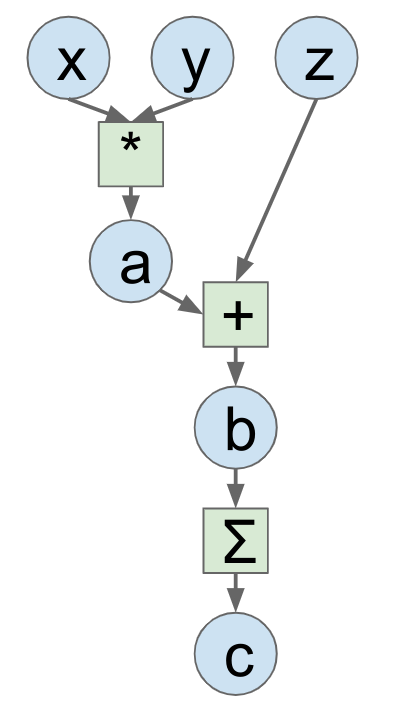
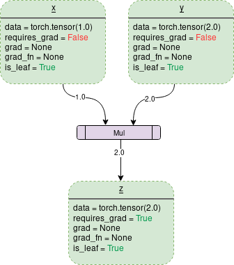
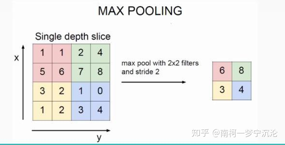
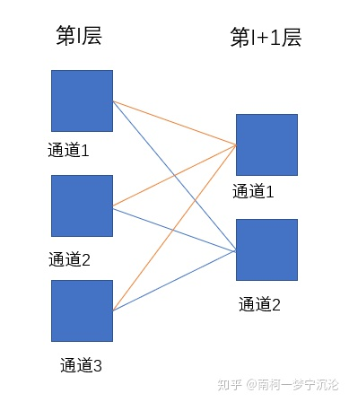
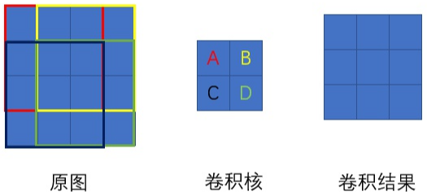
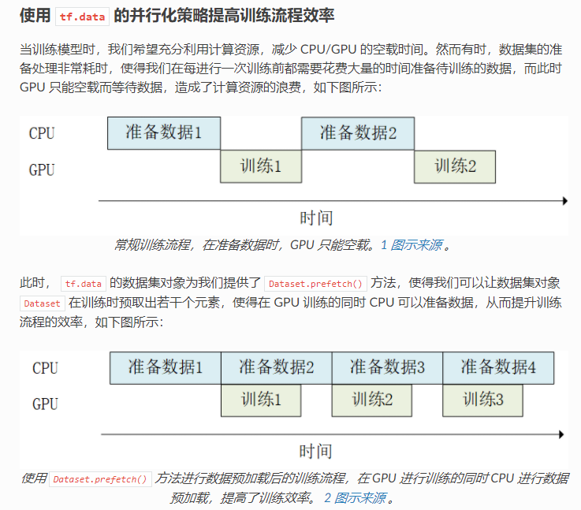

# 理论

- **模型训练的重点过程就两点：前向传播和反向传播**。前向传播用numpy就能很好完成，深度学习框架解决的核心问题就是反向传播时的梯度计算和更新.[^2]

- 计算图[^2]：用图的方式表示计算过程。例如，左边的是抽象的，右边是pytorch中的

    

## CNN的反向传播公式[^6]

- **池化层的反向传播**

    

    - **最大池化**：上图中池化后的数字6对应于池化前的红色区域，实际上只有红色区域中最大值数字6对池化后的结果有影响，权重为1，而其它的数字对池化后的结果影响都为0。

        ∴反向传播时，左边红色区域中6的误差等于右边红色区域中的$\delta$误差，而1、1、5对应位置的误差为0。

        因此，最大池化前向传播时，要记录区域的最大值+其位置，方便后续反向传播。

    - 平均池化：其前向传播时区域中每个值对池化后结果贡献的权重都为区域大小的倒数，即$\frac{1}{k*k}$，所以$\delta$误差反向传播回来时，在区域每个位置的delta误差都为池化后delta误差除以区域的大小，即$\frac{\delta}{k*k}$。

- **激活层的反向传播**：$\delta^{l}=\delta^{l+1}\odot \sigma^{\prime}\left(z^{l}\right)$

- **卷积层的反向传播**

    
    - 输入层（$l$层）的$\delta$误差：$\delta^{l}=\delta^{l+1} * Rotate 180\left(w^{l+1}\right)$，即把卷积核旋转180°后与后一层（$l+1$层）的$\delta$误差卷积

    

    - 输入层与输出层之间**卷积核的导数**：$\frac{\partial C}{\partial w^{l}}=\delta^{l} * \sigma\left(z^{l-1}\right)$，即卷积核的每个位置，在输入层能影响到的像素与卷积结果进行卷积，上图。注意输入层需要先padding
    - 输入层与输出层之间**bias的导数**：$\frac{\partial C}{\partial b^{l}}=\sum_{x} \sum_{y} \delta^{l}$

# 各种操作

## 扩展torch.autograd：自定义层

通过继承子类`torch.autograd.Function`而非`torch.nn.Module`来扩展torch.autograd（自定义层）[^4][^9]，并且必须实现两个静态函数（用`@staticmethod`修饰）[^11][^12]：

- `forward(ctx: Any, *args: Any, **kwargs: Any) → Any`：
    - 输入值可以为任何python的对象
    - 使用`ctx.save_for_backward(a, b)`保存forward()静态方法中的张量, 从而可以在backward()静态方法中调用
- `backward(ctx: Any, *grad_outputs: Any) → Any`：
    - 输入参数的个数=`forward()`中返回值的个数，即每个输入对应了`forward()`中对应返回值的梯度
    - 返回参数的个数=`forward()`中输入值的个数，每个返回值对应了`forward()`输入值的梯度。如果`forward()`中输入有非Ternsor，那么它们在backward()中对应的返回值为None
    - 如果`forward()`的输入不需要梯度（可以通过`ctx.needs_input_grad`获得一个bool的tuple，每个元素表示对应`forward()`中输入是否需要求导），或者这些输入不是`Tensor`，那`backward()`中对应的返回值可以为`None`
    - 通过`a, b = ctx.saved_tensors`重新获得在`forward()`中保存的`Tensor`

ctx和self的区别[^13]：

- ctx是context的缩写, 翻译成"上下文; 环境"，专门用在静态方法中
- self指的是实例对象; 而ctx用在静态方法中, 调用的时候不需要实例化对象, 直接通过类名就可以调用, 所以self在静态方法中没有意义


示例：自定义LinearFunction[^10]

## model结构&数据流可视化

安装 tensorboard (conda) 和 tensorboardX (pip)，然后在代码中添加如下内容[^5]

```python
import torch as t
import torchvision as tv
from tensorboardX import SummaryWriter
class DRConv()
input = t.rand(4, 3, 32, 32)
net = DRConv(3, 10, 3, 9)
with SummaryWriter(comment="DRconv") as w:
    w.add_graph(net, (input,))
```

运行后，会在代码所在目录生成一个`runs`文件。在代码所在目录的终端里运行命令`tensorboard --logdir=runs`，就可以获得浏览器地址，比如`http://localhost:6006/`。从浏览器进去后，选择`GRAPHS`即可

## label变成one hot编码

```python
index = t.argmax(t.rand(4, 5, 32, 32), dim=1) # label大小为N*H*W，每个位置中存放着label的下标

onehot = t.zeros(4, 5, 32, 32).scatter(1, index.unsqueeze(1), 1)  # onehot大小为N*L*H*W，第二个维度中为着label的个数
# PS: 
# index.unsqueeze(1)是为了让其大小变为N*1*H*W；
# 倒数第三个1表示把第二个维度变成onehot编码；
# 倒数第一个1表示填充的数字为1
```

## 并行化读取数据

在[学习tensorflow](https://tf.wiki/)的时候，发现 tf 有一个函数可以并行化读取数据以提高训练效率



网上找了一下，pytorch的[Dataloader](https://pytorch.org/docs/stable/data.html#module-torch.utils.data)中有一个类似的参数`prefetch_factor`

> **prefetch_factor** ([*int*](https://docs.python.org/3/library/functions.html#int)*,* *optional**,* *keyword-only arg*) – Number of sample loaded in advance by each worker. `2` means there will be a total of 2 * num_workers samples prefetched across all workers. (default: `2`)

还可以使用 Nvidia 提出的分布式框架 Apex提供的[解决方案](https://zhuanlan.zhihu.com/p/66145913)

## 获取中间层的特征图和梯度

### Hook技术

由于pytorch在计算过程中会舍弃除了叶子节点以外的中间层的特征图和梯度，想要获取他们并进行一定的修改，可以使用Hook技术

hook包含三种函数：

- [register_hook(hook)](https://pytorch.org/docs/stable/autograd.html#torch.Tensor.register_hook)：该函数属于Tensor对象为Tensor注册一个backward hook，用来获取变量的梯度

  其中的hook为函数名称（可以任意），必须遵循如下的格式：`hook(grad) -> Tensor or None`，其中grad为获取的梯度

  具体实例：

  ```python
  import torch
  
  grad_list = []
  def print_grad(grad):
      grad = grad * 2	
      grad_list.append(grad)
  
  x = torch.tensor([[1., -1.], [1., 1.]], requires_grad=True)
  h = x.register_hook(print_grad)    # double the gradient
  out = x.pow(2).sum()
  out.backward()
  print(grad_list) # [tensor([[ 4., -4.], [ 4.,  4.]])]
  
  # 删除hook函数
  h.remove()
  ```

- [register_forward_hook(hook)](https://pytorch.org/docs/stable/generated/torch.nn.Module.html#torch.nn.Module.register_forward_hook)：该函数属于Module对象，返回为`torch.utils.hooks.RemovableHandle`。用于前向传播中进行hook，可以提取特征图

  在网络执行`forward()`之后，执行hook函数，需要具有如下的形式：

  ```python
  hook(module, input, output) -> None or modified output
  ```

  hook可以修改input和output，但是不会影响**forward**的结果。最常用的场景是需要提取模型的某一层（不是最后一层）的输出特征，但又不希望修改其原有的模型定义文件，这时就可以利用forward_hook函数。

- [register_backward_hook(hook)](https://pytorch.org/docs/stable/generated/torch.nn.Module.html#torch.nn.Module.register_backward_hook)：该函数属于Module对象，返回为`torch.utils.hooks.RemovableHandle`。用于反向传播中进行hook，可以提取梯度

  每一次module的inputs的梯度被计算后调用hook，hook具有如下的形式：

  ```python
  hook(module, grad_input, grad_output) -> Tensor or Non
  ```

  `grad_input` 和 `grad_output`参数分别表示输入的梯度和输出的梯度，是不能修改的，但是可以通过return一个梯度元组tuple来替代`grad_input`。

  `grad_input`元组包含(`bias的梯度`，`输入x的梯度`，`权重weight的梯度`)，`grad_output`元组包含(`输出y的梯度`)。
  可以在hook函数中通过return来修改`grad_input`

  对于没有参数的Module，比如`nn.ReLU`来说，`grad_input`元组包含(`输入x的梯度`)，`grad_output`元组包含(`输出y的梯度`)。

PS：经过实践，不能将`hook`定义为某个类的成员函数，否则会参数个数会不匹配的（因为会多一个`self`参数）

> 参考：[Pytorch获取中间层信息-hook函数](https://blog.csdn.net/winycg/article/details/100695373)、[官方教程Forward and Backward Function Hooks](https://pytorch.org/tutorials/beginner/former_torchies/nnft_tutorial.html#forward-and-backward-function-hooks)

### 自定义forward函数：只能获取中间层的特征

此方法的原理是获取给定模型的每一层，然后在前向传播的时候将想要层的特征保存下来即可

```python
class FeatureExtractor(nn.Module):
    def __init__(self, submodule, extracted_layers):	#extracted_layers为一个列表
        super(FeatureExtractor, self).__init__()
        self.submodule = submodule
        self.extracted_layers = extracted_layers
 
    # 自己修改forward函数
    def forward(self, x):
        outputs = []
        for name, module in self.submodule._modules.items():
            if name is "fc": x = x.view(x.size(0), -1)
            x = module(x)
            if name in self.extracted_layers:
                outputs.append(x)
        return outputs
   
extract_list = ["conv1", "maxpool", "layer1", "avgpool", "fc"]
resnet = models.resnet50(pretrained=True)
x = torch.random(1,3,256,256)
extract_result = FeatureExtractor(resnet, extract_list)
print(extract_result(x)[4])  # [0]:conv1  [1]:maxpool  [2]:layer1  [3]:avgpool  [4]:fc
```

> 参考：[PyTorch提取中间层的特征（Resnet）](https://www.codeleading.com/article/8544702154/)

## 参数统计&&共享问题

统计方法有两种：

```python
# 第一种：使用torchsummary
import torchsummary
torchsummary.summary(model, (1, 512, 512))
# 第二种：自定义函数，统计model中可导参数
def count_parameters(model):
	print(sum(p.numel() for p in model.parameters() if p.requires_grad))
```

但是当网络中共享 层（即[参数共享](https://pytorch.org/tutorials/beginner/examples_nn/dynamic_net.html?highlight=share)）时，上面的统计方法都会有问题。例如：

```python
import torch
import torch.nn as nn
import torchsummary
class BaseNet(nn.Module):
    def __init__(self):
        super(BaseNet,self).__init__()
        self.conv1=nn.Conv2d(in_channels=1,out_channels=1,kernel_size=3,bias=False)
        self.conv2=nn.Conv2d(in_channels=1,out_channels=1,kernel_size=3,bias=False)
        self.conv3=nn.Conv2d(in_channels=1,out_channels=1,kernel_size=3,bias=False)
    def forward(self,x):
        x=self.conv1(x)
        out_map=self.conv1(x)
        return out_map
def count_parameters(model):
    print(sum(p.numel() for p in model.parameters() if p.requires_grad))
model = BaseNet()
torchsummary.summary(model, (1, 512, 512))
count_parameters(model)
```

实际输出参数个数应该为9（因为只有一个3*3的卷积核，没有权重），但是`torchsummary`输出为18，`count_parameters`输出为27

因为`torchsummary`计算时是先把层结构打印下来，然后再统计对各个层的参数求和，`conv1`被调用了两次，所以为18；而在`BaseNet`类里多初始化了`conv2`和`conv3`，即使没有在forward里面调用，但是它也算在`model.parameters()`里面，因此`count_parameters`为27

> 参考教程：[PyTorch几种情况下的参数数量统计](https://zhuanlan.zhihu.com/p/64425750)

# 各种函数

## torch.Tensor

### Tensor.grad_fn[^1][^2]

反向传播时，用来计算梯度的函数，即指示梯度函数是哪种类型。Tensor类属性方法。叶子节点通常为None，只有结果节点的grad_fn才有效

### Tensor.is_leaf[^2]

标记该tensor是否为叶子节点。Tensor类变量，布尔值。

所有requires_grad=False的Tensors都为叶子节点

所有用户显示初始化的Tensors也为叶子节点

由各种操作(operation)的结果隐式生成的不是叶子节点，比如`a.cuda()`以及加减乘除操作

叶节点就是由用户创建的 Variable（一般是输入变量） 或 Parameter（网络参数W和b）[^8]

叶子节点没有下一个可传播的节点，它就是梯度反向传递在这条分路上的终点[^8]

## torch

- **torch.expand(*sizes)**：返回当前张量在某维扩展更大后的张量

    ```python
    a = torch.rand(2,3)
    b = a.expand(6,3)
    ```

    

- **torch.view()**：相当于numpy中的resize()。例如

    ```python
    a = torch.rand(2,3,4,5)
    b = a.view(3,4,5,-1) # -1表示该维度进行推断，但是只有一个维度能为-1
    # b.size() = [3, 4, 5, 2]
    ```

- 

- 

## torch.autograd

- **torch.autograd.backward()**[^1]：反向传播，根据链式法则叶子节点的梯度。参数如下

    ```python
    torch.autograd.backward(
    		tensors, 
    		grad_tensors=None, 
    		retain_graph=None, 
    		create_graph=False, 
    		grad_variables=None)
    ```

    - 对于一个tensor`z`，`torch.autograd.backward(z)==z.backward()`这两种方式等价
    - grad_tensors为前面算出的梯度，可以理解成求当前梯度时的权重

- **torch.autograd.grad()**[^1]：

## torch.nn

## torch.nn.functional

# 参考资料

[^1]:[Pytorch autograd,backward详解](https://zhuanlan.zhihu.com/p/83172023)
[^2]:[【深度学习理论】一文搞透pytorch中的tensor、autograd、反向传播和计算图](https://zhuanlan.zhihu.com/p/145353262)
[^3]:[PyTorch: 梯度下降及反向传播](https://blog.csdn.net/m0_37306360/article/details/79307354)
[^4]:[Pytorch入门学习（八）-----自定义层的实现（甚至不可导operation的backward写法）](https://blog.csdn.net/Hungrier/article/details/78346304)
[^5]:[Pytorch使用Tensorboard可视化网络结构_sunqiande88的博客-CSDN博客](https://blog.csdn.net/sunqiande88/article/details/80155925)
[^6]:[卷积神经网络(CNN)反向传播算法推导](https://zhuanlan.zhihu.com/p/61898234)
[^7]:[卷积神经网络(CNN)Python的底层实现——以LeNet为例](https://zhuanlan.zhihu.com/p/62303214)

[^8]:[Pytorch 中的反向传播](https://zhuanlan.zhihu.com/p/212748204)
[^9]:[探讨Pytorch中nn.Module与nn.autograd.Function的backward()函数](https://oldpan.me/archives/pytorch-nn-module-functional-backward)
[^10]:[Pytorch： 自定义网络层](https://blog.csdn.net/xholes/article/details/81478670)
[^11]:[Extending `torch.autograd`](https://pytorch.org/docs/stable/notes/extending.html#extending-torch-autograd)
[^12]: [扩展 torch.autograd](https://pytorch-cn.readthedocs.io/zh/latest/notes/extending/#torchautograd)
[^13]: [pytroch中ctx和self的区别](https://blog.csdn.net/littlehaes/article/details/103828130)