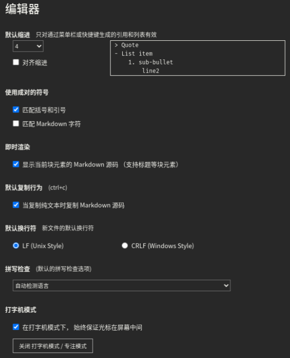
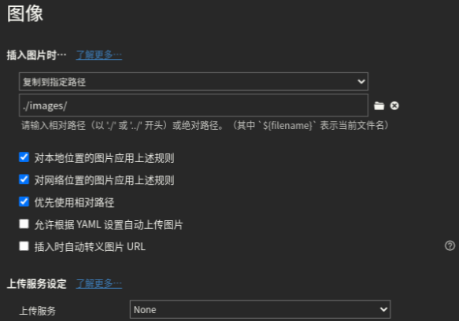
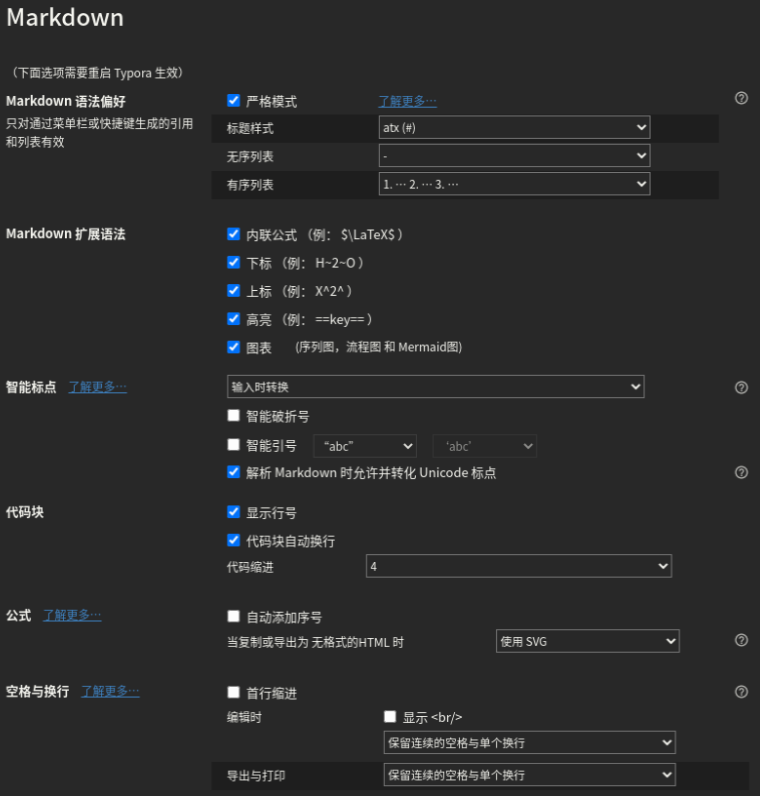
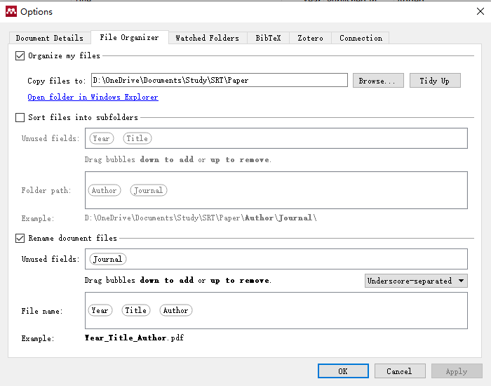

[TOC]

# VS Code

## 扩展

- ~~[**Markdown All in One**](https://marketplace.visualstudio.com/items?itemName=yzhang.markdown-all-in-one)：超级好用的快捷键、自动补全~~
- ~~**Markdown PDF**：将Markdown转为PDF（也可以转为jpg、HTML），但是生成的中文字体有点奇怪，而且生成的目录无法跳转~~
- ~~**Markdown TOC**：生成目录。简洁而且可以在Markdown PDF生成的PDF中也可以使用。~~
- ~~[**Markdown Preview Enhanced**](https://shd101wyy.github.io/markdown-preview-enhanced/#/zh-cn/)：可以生成目录、转换为PDF、以及有漂亮的预览~~
- **TabNine**：我觉得超级好用的自动补全软件
- **Python**：直接运行python文件（不需要扩展Code Runner），然后不需要手动配置python的路径了，好像会自动配置的（我已经安装了anaconda，而且添加到环境变量里面了）
- **C/C++**：编译C/C++，但是好像不能运行（具体的有点混，搞不清楚）
- **Code Runner**：配合扩展C/C++来运行C/C++的程序
- **CMake**：可以自动补全CMake相关的代码
- **Remote - SSH**：远程调试代码全家桶
- **Remote Development**：远程调试代码全家桶
- **Remote - Containers**：远程调试代码全家桶
- **Remote - SSH: Editing Configuration Files**：远程调试代码全家桶
- **Remote - WSL**：用来跟WSL互动
- **Anaconda Extension Pack**：可以切换Anaconda的虚拟环境
- **Chinese (Simplified) Language Pack for Visual Studio Code**：中文有时候还是用得到的吧

## 配置

- **python代码格式化**：使用库`Autopep8`。

```bash
pip install --upgrade autopep8
```

- **python代码检查**：使用库`Flake8`。

```bash
pip install --upgrade flake8
```

- 
- **配置C++运行环境**：主要参考[知乎上的一个回答](https://www.zhihu.com/question/30315894/answer/154979413)。但是要说的是，如果要**引用其他的库**（比如OpenCV），需要在**C_Cpp.default.includePath**中添加头文件路径（前面那个知乎的回答说还要填browse的）  
- **整体settings.json**

```JSON
{
    "editor.formatOnType": true, // 输入分号(C/C++的语句结束标识)后自动格式化当前这一行的代码
    "files.autoSave": "afterDelay",
    "editor.acceptSuggestionOnEnter": "off", // 我个人的习惯，按回车时一定是真正的换行，只有tab才会接受Intellisense
    //忽略“推荐扩展”
    "extensions.ignoreRecommendations": true,
    //不继承VS Code的Windows环境，针对Linux
    "terminal.integrated.inheritEnv": false,
    //调整窗口的缩放级别
    "window.zoomLevel": 0,
    "explorer.confirmDragAndDrop": false,


    //C++配置
    "C_Cpp.default.includePath": [
        "E://Library//OpenCV//opencv//build//include",
        "E://Library//OpenCV//opencv//build//include//opencv",
        "E://Library//OpenCV//opencv//build//include//opencv2"
    ],
    "C_Cpp.default.browse.path": [
        "E://Library//OpenCV//opencv//build//include",
        "E://Library//OpenCV//opencv//build//include//opencv",
        "E://Library//OpenCV//opencv//build//include//opencv2"
    ],
    "C_Cpp.clang_format_sortIncludes": true,
    "code-runner.ignoreSelection": true,
    "code-runner.saveFileBeforeRun": true,
    "code-runner.runInTerminal": true, // 设置成false会在“输出”中输出，无法输入
    "C_Cpp.clang_format_fallbackStyle": "{ BasedOnStyle: Google, AllowShortIfStatementsOnASingleLine: true, ColumnLimit: 0, IndentWidth: 4}",
    "debug.onTaskErrors": "showErrors",


    //自动预览markdown
    "markdown.extension.preview.autoShowPreviewToSide": false,
    "markdown-pdf.displayHeaderFooter": true,
    //markdown的目录是否为纯文本？？？
    "markdown.extension.toc.plaintext": true,
    //防止Markdown TOC生成的目录不自动换行
    "files.eol": "\n",
    
    
    // 是否启用交互式窗口（jupyter）？
    // "python.dataScience.sendSelectionToInteractiveWindow": true,
    //代码自动检查
    "python.linting.flake8Enabled": true,
    //python一行代码的最长长度，超了会报错
    "python.linting.flake8Args": [
        "--max-line-length=200"
    ],
    "python.pythonPath": "E:\\Library\\Anaconda3\\python.exe",
    //python一行代码的最长长度，格式化时会将超了的自动换行
    "python.formatting.autopep8Args": [
        "--max-line-length=200"
    ],
    //防止报错Module 'cv2' has no 'imread' member
    "python.linting.pylintArgs": [
        "-–generate-members"
    ],
    //第三方库的自动补全
    "python.autoComplete.extraPaths": [
        "E://Library//Anaconda3//Lib//site-packages",
        "E://Library//Anaconda3//Scripts"
    ],
    
    
    "remote.SSH.defaultForwardedPorts": [],
    "remote.SSH.remotePlatform": {
        "106-外网": "linux",
        "112-外网": "linux"
    },
    "remoteX11.SSH.privateKey": "~/.ssh/112-out",
    "remoteX11.screen": 1,
    "remoteX11.display": 1,
    "markdown-preview-enhanced.liveUpdate": false,
    //vscode 没办法给中文断词，所以加上中文常用标点
    "editor.wordSeparators": "`~!@#$%^&*()-=+[{]}\\|;:'\",.<>/?、，。？！“”‘’；：（）「」【】〔〕『』〖〗",
    
}
```

>参考：[CLANG-FORMAT STYLE OPTIONS

# Typora

- 偏好设置：

    

    

    

- 快捷键配置：编辑文件`conf.user.json`，Linux上的路径为`~/.config/Typora/conf/conf.user.json`；或者点击`文件` -> `偏好设置` -> `通用` -> `高级设置` -> `打开高级设置`。将整个文件内容替换为

```json
/** For advanced users. */
{
  "defaultFontFamily": {
    "standard": null, //String - Defaults to "Times New Roman".
    "serif": null, // String - Defaults to "Times New Roman".
    "sansSerif": null, // String - Defaults to "Arial".
    "monospace": null // String - Defaults to "Courier New".
  },
  "autoHideMenuBar": false, //Boolean - Auto hide the menu bar unless the `Alt` key is pressed. Default is false.

  // Array - Search Service user can access from context menu after a range of text is selected. Each item is formatted as [caption, url]
  "searchService": [
    ["Search with Google", "https://google.com/search?q=%s"]
  ],

  // Custom key binding, which will override the default ones.
  "keyBinding": {
    // for example: 
    // "Always on Top": "Ctrl+Shift+P"
    "Inline Math": "Ctrl+M",
    "Highlight": "Ctrl+Shift+H",
    "Superscript": "Ctrl+Shift+=",
    "Subscript": "Ctrl+="
    // "Comment": "Ctrl+K+C"

  },

  "monocolorEmoji": false, //default false. Only work for Windows
  "autoSaveTimer" : 3, // Deprecidated, Typora will do auto save automatically. default 3 minutes
  "maxFetchCountOnFileList": 500,
  "flags": [] // default [], append Chrome launch flags, e.g: [["disable-gpu"], ["host-rules", "MAP * 127.0.0.1"]]
}
```

- 字典更新：Typora支持用户更新字典。[字典](./user-dict.json)保存路径为`{typora-user-folder}\dictionaries`。`{typora-user-folder}`可以通过设置里面的`主题文件夹`找到，或者在Linux上为`~/.config/Typora`，在Windows上为`C:/user/<用户名>/appData/Roaming/Typora`。

# CLion

- 与WSL连接：[WSL - Help | CLion - JetBrains](https://www.jetbrains.com/help/clion/how-to-use-wsl-development-environment-in-clion.html)
- 设置自动补全提示不区分大小写：File -> Settings -> Editor -> General -> Code Completion -> Match case **打开**，并选择 All letters
- 设置提示无延迟：File -> Settings -> Editor -> General -> Code Completion -> Show the documentation ... 关闭

>[Clang-Format Style Options](https://clang.llvm.org/docs/ClangFormatStyleOptions.html)

- 远程调试代码转发图形界面：在`Configuration`中的`Environment variables`添加内容`DISPLAY=localhost:0`。`0`为MobaXterm的X11设置的端口。

# Git

- 添加账号信息

    ```shell
    git config --global user.email "silence_33_@outlook.com"
    git config --global user.name "YellowOrz"
    ```

- 生成ssh密钥

    ```shell
    ssh-keygen -t rsa -b 4096 -C "silence_33_@outlook.com"
    ```

    将生成的`.pub`文件的内容添加到Github设置的**SSH and GPG keys**里面。测试是否添加成功

    ```shell
    ssh -T git@github.com
    ```

> [官方教程](https://docs.github.com/cn/free-pro-team@latest/github/authenticating-to-github/adding-a-new-ssh-key-to-your-github-account)


# Mendeley



# Libraries

## 各种库

| 库名称   | 说明             | 安装方法                                                     |
| -------- | ---------------- | ------------------------------------------------------------ |
| Eigen    | 矩阵处理         | apt install libeigen3-dev                                    |
| Pangolin | 可视化           | 依赖：apt install libgl1-mesa-dev libglew-dev <br>(可选，用于生成html/pdf文档) apt install Doxygen <br>[git](https://github.com/stevenlovegrove/Pangolin)后用cmake编译安装 |
| Sophus   | 李代数           | [git](https://github.com/strasdat/Sophus)后用cmake编译（无需安装） |
| Ceres    | 求解最小二乘问题 | 依赖：apt install liblapack-dev libsuitesparse-dev libcxsparse3 libgflags-dev libgoogle-glog-dev libgtest-dev<br>[git](https://github.com/ceres-solver/ceres-solver)后用cmake编译安装 |
| g2o      | 基于图优化       | 依赖：apt install cmake libeigen3-dev libsuitesparse-dev qtdeclarative5-dev qt5-qmake qt5-default libqglviewer-dev-qt5 libcxsparse3 libcholmod3<br>[git](https://github.com/RainerKuemmerle/g2o)后用cmake编译安装 |
| FLANN    | 最邻近算法       | [git](https://github.com/mariusmuja/flann)后用cmake编译安装  |
| PCL      | 点云处理         | 依赖：要先装FLANN<br>(必装) apt install build-essential libboost-all-dev libeigen3-dev libvtk7-dev <br> (可选) apt install libopenni-dev libqhull-dev libusb-1.0-0-dev <br> [git](https://github.com/PointCloudLibrary/pcl)后用cmake编译安装 |
| OctoMap  | 八叉树建图       | 方法一：apt install liboctomap-dev<br>方法二：[git](https://github.com/OctoMap/octomap)后用cmake编译安装 |
| OpenMesh | 三维网格处理     | 依赖：opengl、qt5、glew？？？<br>[git](https://www.graphics.rwth-aachen.de:9000/OpenMesh/OpenMesh)or[下载release](https://www.graphics.rwth-aachen.de:9000/OpenMesh/OpenMesh/-/releases)后用cmake编译安装 |

**注**：1. OpenMesh官网说依赖项只有qt5，但是我在有两个WSL上面安装的时候会报错大概`Not Find OpenGL(missing: OPENGL_opengl_LIBRARY, OPENGL_glx_LIBRARY)`和`Not Find QT5`，网上找了一些教程安装了几个，报错依旧存在。于是，我就找了另一台已经安装好的WSL（不记得当时怎么装的了），把ta上面的opengl和qt5的安装列表都copy下来了，然后就不报错了

```shell
# opengl
apt install libqglviewer-dev-qt5 libqglviewer2-qt5 libqt5concurrent5 libqt5core5a libqt5dbus5 libqt5gui5 libqt5network5 libqt5opengl5 libqt5opengl5-dev libqt5positioning5 libqt5printsupport5 libqt5qml5 libqt5quick5 libqt5quickparticles5 libqt5quicktest5 libqt5quickwidgets5 libqt5sensors5 libqt5sql5 libqt5sql5-sqlite libqt5svg5 libqt5test5 libqt5webchannel5 libqt5webkit5 libqt5widgets5 libqt5x11extras5 libqt5xml5 libvtk7.1-qt qt5-default qt5-gtk-platformtheme qt5-qmake qt5-qmake-bin qt5-qmltooling-plugins qtbase5-dev qtbase5-dev-tools qtchooser qtdeclarative5-dev qttranslations5-l10n
# qt5
apt install libgl1 libgl1-mesa-dev libgl1-mesa-dri libgl1-mesa-glx libgl2ps-dev libgl2ps1.4 libglade2-0 libglapi-mesa libgles1 libgles2 libgles2-mesa-dev libglew-dev libglew2.0 libglib2.0-0 libglib2.0-bin libglib2.0-data libglib2.0-dev libglib2.0-dev-bin libglibmm-2.4-1v5 libglu1-mesa libglu1-mesa-dev libglvnd-core-dev libglvnd-dev libglvnd0 libglx-mesa0 libglx0
# glew
apt install libglew-dev libglew2.0
# 有教程说还要装glue，但是已经装好OpenMesh的WSL上面并没有装
```

整理成.sh如下：

```bash
#安装这些依赖的时候好像会安装python2.7，我也不知道为啥。而且安装完后运行python会自动运行python2.7。  
#不过重新注入环境变量了以后再运行python用的就是anaconda里面的python，所以我也就没有管它了。
apt install libeigen3-dev liblapack-dev libcxsparse3 libgflags-dev libgoogle-glog-dev libgtest-dev cmake libsuitesparse-dev qtdeclarative5-dev qt5-qmake qt5-default libqglviewer-dev-qt5 libcxsparse3 libcholmod3 libgl1-mesa-dev libglew-dev build-essential libboost-all-dev libvtk7-dev
#如果安装Pangolin出现‘No package ‘xkbcommon’ found’
apt install libxkbcommon-x11-dev
# OpenMesh
git clone https://www.graphics.rwth-aachen.de:9000/OpenMesh/OpenMesh.git
cd OpenMesh && mkdir build && cd build && cmake ..
make -j7 install
cd ../..
# octomap
git clone https://github.com/OctoMap/octomap.git
cd octomap && mkdir build && cd build && cmake ..
make -j7 install
cd ../..
# Pangolin
git clone https://github.com/stevenlovegrove/Pangolin.git
cd Pangolin && mkdir build && cd build && cmake ..
make -j7 install
cd ../..
# Sophus
git clone https://github.com/strasdat/Sophus.git
cd Sophus && mkdir build && cd build && cmake ..
make -j7
make install #可以不安装，但是我还是装了
cd ../..
# ceres
git clone https://github.com/ceres-solver/ceres-solver.git
cd ceres-solver && mkdir build && cd build && cmake ..
make -j7 install
cd ../..
# g2o
git clone https://github.com/RainerKuemmerle/g2o.git
cd g2o && mkdir build && cd build && cmake ..
make -j7 install
cd ../..
# flann
git clone https://github.com/mariusmuja/flann.git
cd flann && mkdir build && cd build && cmake ..
make -j7 install
cd ../..

# PCL
git clone https://github.com/PointCloudLibrary/pcl.git # 或者tar xvfj pcl-pcl-1.7.2.tar.gz
cd pcl && mkdir build && cd build && cmake .. # 如果想要安装Release版本，运行命令cmake -DCMAKE_BUILD_TYPE=Release ..
make -j7 install
```

## OpenCV

参考[我的这篇博客](https://blog.csdn.net/OTZ_2333/article/details/104040394)

## miniconda

[官网](https://mirrors.tuna.tsinghua.edu.cn/anaconda/miniconda/)。安装方法参考[我的这篇博客](https://blog.csdn.net/OTZ_2333/article/details/86688480)，安装完后需要更改 [Anaconda镜像源](https://mirrors.tuna.tsinghua.edu.cn/help/anaconda/) 和 [pypi镜像源](https://mirrors.tuna.tsinghua.edu.cn/help/pypi/) (可选)为清华镜像，并安装如下包

```bash
conda install python=3.8 numpy matplotlib
conda install pytorch torchvision tensorboard cudatoolkit=10.2 -c pytorch
pip install opencv-contrib-python tensorboardX tensorflow
```