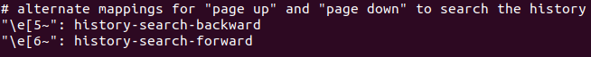
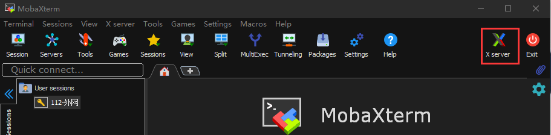
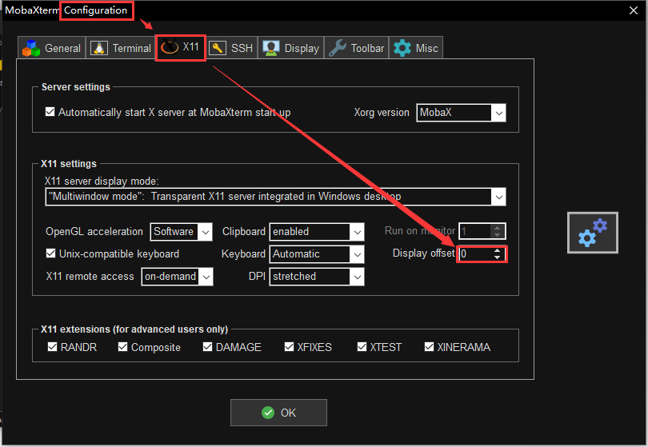
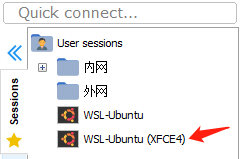
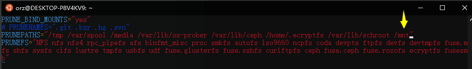

[TOC]

# 必装软件&库

==root身份==

1. 不做介绍

    ```shell
    apt install tmux cmake make g++-4.8 g++-5 g++-6 g++-7 g++-8 gcc-4.8 gcc-5 gcc-6 gcc-7 gcc-8 unzip zip rar unrar gdb build-essential git cmake-curses-gui chromium-browser gedit vim clang
    ```

    | 软件名                                                       | 介绍                                                         | 软件名                                                       | 介绍               |
    | ------------------------------------------------------------ | ------------------------------------------------------------ | ------------------------------------------------------------ | ------------------ |
    | [dingtalk](https://github.com/nashaofu/dingtalk)             | 用electron封装的网页版钉钉                                   | [electron-ssr](https://github.com/shadowsocksrr/electron-ssr)（[备份](https://github.com/qingshuisiyuan/electron-ssr-backup)） | linux最好用的ssr吧 |
    | [搜狗输入法](https://pinyin.sogou.com/linux/?r=pinyin)       | [参考教程](https://blog.csdn.net/lupengCSDN/article/details/80279177) | [Mathpix Snip](https://snapcraft.io/mathpix-snipping-tool)   | 数学公式识别神器   |
    | [Free Download Manager](https://www.freedownloadmanager.org/zh/download-fdm-for-linux.htm) | 下载工具。暂时没找到更好的                                   | [mendeley](https://www.mendeley.com/download-desktop-new/)   | 论文管理工具       |
    | [网易云音乐](https://music.163.com/#/download)               | 网易云音乐                                                   | [qq](https://im.qq.com/linuxqq/download.html)                | qq                 |
    | [WPS](https://linux.wps.cn/)                                 | linux最好用的office工具                                      | [XMind](https://www.xmind.cn/download/)                      | 思维导图           |
    | [Typora](https://typora.io/#linux)                           | markdown编辑器                                               | [CLion](https://www.jetbrains.com/clion/download/#section=linux) | IDE                |
    | [向日葵](https://sunlogin.oray.com/download)                 | 远程控制软件                                                 | [Stretchly](https://github.com/hovancik/stretchly/releases)  | 休息提醒           |
    | [VLC](https://www.videolan.org/vlc/download-ubuntu.html)     | 视频播放器                                                   | [福昕阅读器](https://www.foxitsoftware.cn/downloads/)        | pdf阅读器          |
    | [vscode](https://code.visualstudio.com/download)             | linux最好用的文本显示工具                                    | [MeshLab](https://snapcraft.io/meshlab)                      | 三维模型查看       |


# 通用配置

1. 更改镜像为[清华镜像源](https://mirrors.tuna.tsinghua.edu.cn/help/ubuntu/)or[阿里镜像源](https://developer.aliyun.com/mirror/ubuntu?spm=a2c6h.13651102.0.0.3e221b119vwOjw)
2. 美化Bash：在任意一个环境变量文件（比如`/etc/bash.bashrc`）添加如下代码，添加完后重新注入环境变量

```bash
export PS1="\[\e[36;1m\]\u\[\e[0m\]@\[\e[33;1m\]\h\[\e[0m\]:\[\e[31;1m\]\w\[\e[0m\]\$ " 
```

3. 添加代理：在环境变量（最好是`/etc/bash.bashrc` or `/etc/bashrc`）中添加如下内容

    ```shell
    # 在WSL为下面那个
    # IP=$(cat /etc/resolv.conf |grep name|cut -f 2 -d " ") 
    IP=127.0.0.1
    Port=7890
    #默认不开启代理。否则git可能会连不上，无论git有没有设置代理。
    #export http_proxy="http://${IP}:${Port}"
    #export https_proxy="https://${IP}:${Port}"
    proxyon(){
    	export http_proxy="http://${IP}:${Port}"
    	export https_proxy="https://${IP}:${Port}"
    	#    export http_proxy="socks5://${IP}:${Port}"
    	#    export https_proxy="socks5://${IP}:${Port}"
    	echo "proxy on, and IP is $(curl ip.sb)"
    }
    proxyoff(){
      unset http_proxy
      unset https_proxy
      echo "proxy off"
    }
    # git的代理。默认开启。
    git config --global http.proxy "socks5://${IP}:${Port}"
    git config --global https.proxy "socks5://${IP}:${Port}"
    gitproxyon(){
        git config --global http.proxy "socks5://${IP}:${Port}"
        git config --global https.proxy "socks5://${IP}:${Port}"
        echo "git proxy on"
        echo git config --global --get http.proxy $(git config --global --get http.proxy)
        echo git config --global --get https.proxy $(git config --global --get https.proxy)
    }
    gitproxyoff(){
        git config --global --unset http.proxy
        git config --global --unset https.proxy
        echo "git proxy off"
        echo git config --global --get http.proxy $(git config --global --get http.proxy)
        echo git config --global --get https.proxy $(git config --global --get https.proxy)
    }
    ```
    
4. Tmux：在配置文件`~/.tmux.conf `中加入如下内容

    ```shell
    # 启用鼠标
    set -g mouse on
    # 复制模式	
    set-window-option -g mode-keys vi #可以设置为vi或emacs
    # set-window-option -g utf8 on #开启窗口的UTF-8支持，报错
    ```

    复制模式步骤：

    1. C-b [ 进入复制模式
    2. 参考上表移动鼠标到要复制的区域，移动鼠标时可用vim的搜索功能"/","?"
    3. 安空格键开始选择复制区域
    4. 选择完成后安enter键退出
    5. C-b ] 粘贴

5. 终端根据历史补全命令：编辑`/etc/inputrc`，搜索关键字history-search找到如下两行，取消注释。保存退出后即可通过`PgUp`和`PgDn`根据历史补全命令

    

6. 自动进行git操作脚本`gitauto.sh`：

    ```shell
    #!/bin/bash
    proxyon
    # 用于判断的关键词
    fail="失败|error|fail"
    success="干净|succe|clear|clean"
    
    # 将要监控的git仓库路径存放在下面
    git_path=(
        "/home/orz/Documents/My-Learning-Notes/"
        # "/home/orz/Documents/"
    )
    date=$(date +%Y.%m.%d)
    
    # 处理每一个文件
    for path in ${git_path[*]}
    do
        echo -e "\e[1;31m$path\e[0m"
        name=$(echo $path | rev | cut  -d "/" -f  2 | rev )
    
        cd $path
        # pull
        if [ -n "$(git pull|grep -E "$fail")"  ]
        then
            echo -e "\e[1;33m ##### pull 失败 #####\e[0m"
            cd -L
            continue
        fi
    
        # add + commit
        if [ -n "$(git status|grep -E "$success")" ]
        then
            echo "无需commit"
            cd -L
            continue
        else
            read -p "输入姓名（可以空白）：" message
            if [ -n "$message" ]
            then
                message=$message"-"$date
            else
                message=$date
            fi
            git add .
            git commit -m "$message"
        fi
    
        # push
        if [ -n "$(git push|grep -E "$fail")" ]
            then
                echo -e "\e[1;34m ##### push 失败 ##### \e[0m"
        fi
    
        cd -L
    done

    proxyoff
    ```
```
    
    然后添加到环境变量`~/.bashrc`
    
    ```shell
    alias gitauto="bash ~/gitauto.sh"
```


# WSL

- 安装：现在BIOS打开虚化，然后控制面板 -> 启用或关闭Windows功能 中，打开虚拟机平台、适用于Linux的Windows子系统、Hyper-V，重启。

    可以到微软商店直接安装。或者到[这里](https://docs.microsoft.com/zh-cn/windows/wsl/install-manual#installing-your-distro)安装，（如果是用IDM下载，格式可能会变为.zip，需要改为.appx），然后在PowerShell运行

    ```powershell
    Add-AppxPackage .\Ubuntu_1804.2019.522.0_x64.appx
    ```

- WSL1升级为WSL2：参考[教程](https://www.liumingye.cn/archives/326.html)or官网

- 与Clion连接：[WSL - Help | CLion - JetBrains](https://www.jetbrains.com/help/clion/how-to-use-wsl-development-environment-in-clion.html)

- 图形界面：在WLS安装xfce4

    ```shell
    apt install xfce4
    ```

    Windows安装[MobaXTerm](https://mobaxterm.mobatek.net/download.html)。然后运行MobaXTerm，保证其X server为开启状态，即左上角的“X”为彩色，为灰色的话，按一下就彩色了

    

    在WSL上运行如下命令就会出现图形界面了

    ```bash
    startxfce4
    ```

    **PS**：如果只是想查看运行结果（比如OpenCV的imshow），可以不执行`startxfce4`，直接执行代码就会自动打开窗口。

    如果报错，则在环境变量中添加

    ```shell
    IP=localhost
    PortOffset=2222.0
    export DISPALY=${IP}:${PortOffeset}
    ```

    其中，PortOffset需与MobaXTerm中的X11设置保持一致

    

    或者MobaXterm可能会自动识别到WSL的图形界面，双击打开就好了

    

- 安装cuda：参考NIVIDIA官网[CUDA on WSL User Guide](https://docs.nvidia.com/cuda/wsl-user-guide/index.html#abstract)

    - 在Win上安装[相关驱动](https://developer.nvidia.com/cuda/wsl/download)，win会自动为wsl安装nvidia驱动

- `updatedb`排除文件夹`/mnt`：

    - 暂时排除：使用参数`-e`

        ```shell
        updatedb -e /mnt
        ```

    - 永久排除：编辑`/etc/updatedb.conf`，在变量**PRUNEPATHS**中添加`/mnt`，例如

    

- 