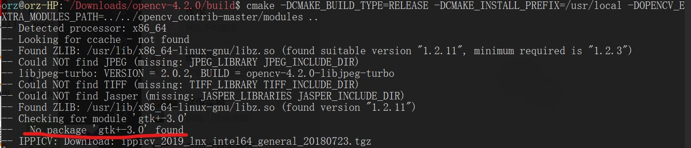
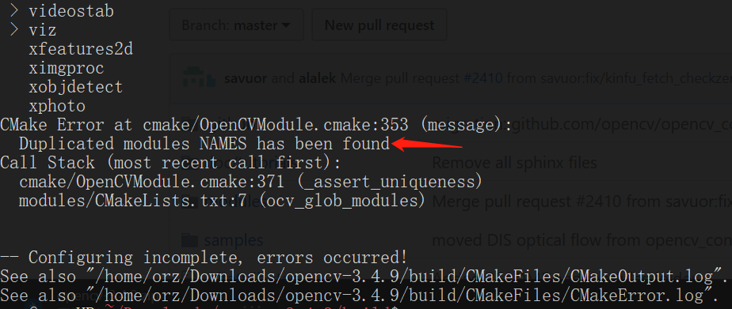
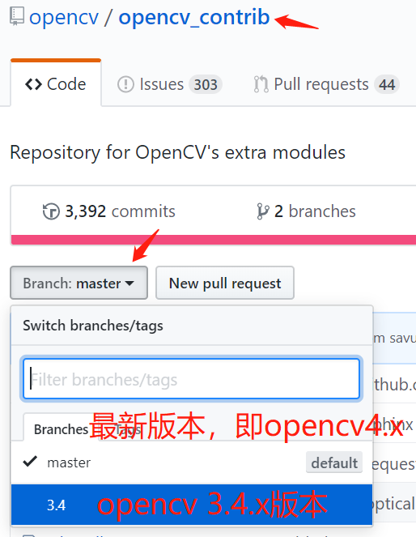

[TOC]

# 必装软件&库

==root身份==

## 软件

```shell
apt install vim openssh-server tmux net-tools htop unzip zip rar unrar git cmake-curses-gui gedit clang tree lrzsz samba smbclient cifs-utils tightvncserver xrdp vlc -y
apt install gcc g++ cmake gdb build-essential make libpng-dev libboost-all-dev -y 
```

| 软件名                                                       | 介绍                                                         | 软件名                                                       | 介绍                        |
| ------------------------------------------------------------ | ------------------------------------------------------------ | ------------------------------------------------------------ | --------------------------- |
| [钉钉](https://alidocs.dingtalk.com/i/p/nb9XJlJ7QbxN8GyA/docs/ROGpvEna5YQWmaPgQ156W4ykmK3zoB27) | 官方钉钉                                                     | [clash for windows](https://github.com/Fndroid/clash_for_windows_pkg/releases) | 代理软件                    |
| [搜狗输入法](https://pinyin.sogou.com/linux/?r=pinyin)       | [参考教程](https://blog.csdn.net/lupengCSDN/article/details/80279177) | [Mathpix Snip](https://snapcraft.io/mathpix-snipping-tool)   | 数学公式识别神器            |
| [Free Download Manager](https://www.freedownloadmanager.org/zh/download-fdm-for-linux.htm) | 下载工具。暂时没找到更好的                                   | [mendeley](https://www.mendeley.com/download-desktop-new/)   | 论文管理工具                |
| [网易云音乐](https://music.163.com/#/download)               | 网易云音乐                                                   | [qq](https://im.qq.com/linuxqq/download.html)                | 官方qq                      |
| [WPS](https://linux.wps.cn/)                                 | linux最好用的office工具                                      | [XMind](https://www.xmind.cn/download/)                      | 思维导图                    |
| [Typora](https://typora.io/#linux)                           | markdown编辑器                                               | [CLion](https://www.jetbrains.com/clion/download/#section=linux) | IDE                         |
| [向日葵](https://sunlogin.oray.com/download)                 | 远程控制软件                                                 | [Stretchly](https://github.com/hovancik/stretchly/releases)  | 休息提醒                    |
| [VLC](https://www.videolan.org/vlc/download-ubuntu.html)     | 视频播放器                                                   | [福昕阅读器](https://www.foxitsoftware.cn/downloads/)        | pdf阅读器                   |
| [vscode](https://code.visualstudio.com/download)             | linux最好用的文本显示工具                                    | [MeshLab](https://snapcraft.io/meshlab)                      | 三维模型查看                |
| [onedrive](https://github.com/abraunegg/onedrive/blob/master/docs/ubuntu-package-install.md#distribution-ubuntu-2004) | 第三方onedrive软件                                           | [Ao](https://github.com/klaussinani/ao/releases)             | Microsoft To-Do desktop app |
| [微信](https://blog.csdn.net/OTZ_2333/article/details/122368735) | 官方微信（从优麒麟镜像安装）                                 | [ToDesk](https://www.todesk.com/download.html)               | 远程控制软件                |

## 库

| 库名称   | 说明             | 安装方法      |
| -------- | ---------------- | --------------------------------------------- |
| OpenGL | 计算机图形学库 | apt-get install libgl1-mesa-dev libglu1-mesa-dev freeglut3-dev<br/>可选（推荐，现成demo）：apt install mesa-utils |
| Eigen    | 矩阵处理         | apt install libeigen3-dev   |
| [Pangolin](https://github.com/stevenlovegrove/Pangolin) | 可视化           | 依赖：apt install libgl1-mesa-dev libglew-dev<br>[git](https://github.com/stevenlovegrove/Pangolin)后用cmake编译安装 |
| Sophus   | 李代数           | 依赖：apt install libfmt-dev<br>[git](https://github.com/strasdat/Sophus)后用cmake编译（无需安装）  |
| [Ceres](http://ceres-solver.org/installation.html) | 求解最小二乘问题 | 依赖：apt install cmake libgoogle-glog-dev libgflags-dev libatlas-base-dev libeigen3-dev libsuitesparse-dev<br>[git](https://github.com/ceres-solver/ceres-solver)后用cmake编译安装 |
| g2o      | 基于图优化       | 依赖：apt install cmake libeigen3-dev libsuitesparse-dev qtdeclarative5-dev qt5-qmake qt5-default libqglviewer-dev-qt5 libcxsparse3 libcholmod3<br>[git](https://github.com/RainerKuemmerle/g2o)后用cmake编译安装 |
| [glog](https://github.com/google/glog) | 日志记录框架 | [git](https://github.com/google/glog)后用cmake编译安装 |
| OpenCV |计算机视觉库 | 见下面OpenCV专栏 |
| PCL | 点云库 | 见下面PCL专栏 |
|FLANN|最完整的（近似）最近邻开源库|见下面PCL专栏 |
| Boost | 为C++语言标准库提供扩展的一些C++程序库的总称 | 见下面PCL专栏 |
| VTK | 可视化工具库 | 见下面PCL专栏 |
| OpenNI | 开放自然交互。。。懂的都懂 | 见下面PCL专栏 |
| QHull | 计算几何库 | 见下面PCL专栏 |
| nvtop | GPU信息查看 | 依赖：apt install cmake libncurses5-dev libncursesw5-dev git<br>[git](https://github.com/Syllo/nvtop)后用cmake编译 |

整理成.sh如下：
```shell
# OpenGL
apt-get install libgl1-mesa-dev libglu1-mesa-dev freeglut3-dev
# OpenGL可选
apt install mesa-utils
# 安装这些依赖的时候好像会安装python2.7，我也不知道为啥。而且安装完后运行python会自动运行python2.7，不过重新注入环境变量了以后再运行python用的就是conda里面的python，所以我也就没有管它了。
apt install gcc g++ cmake build-essential make libpng-dev libboost-all-dev -y 
apt install libeigen3-dev liblapack-dev libcxsparse3 libgflags-dev libgoogle-glog-dev libatlas-base-dev libgtest-dev cmake libsuitesparse-dev qtdeclarative5-dev qt5-qmake qt5-default libqglviewer-dev-qt5 libcxsparse3 libcholmod3 libgl1-mesa-dev libglew-dev liblz4-dev libfmt-dev -y 
# 安装Pangolin出现‘No package ‘xkbcommon’ found’
apt install libxkbcommon-x11-dev

# Pangolin
git clone -b v0.8 --depth=1 https://github.com/stevenlovegrove/Pangolin.git
cd Pangolin
mkdir build
cd build
cmake ..
make -j4
make install
cd ../..

# Sophus
git clone -b v22.04.1 --depth=1 https://github.com/strasdat/Sophus.git
cd Sophus
mkdir build
cd build
cmake ..
make -j4
make install #可以不安装，但是我还是装了
cd ../..

# ceres
git clone -b 2.1.0 --depth=1 https://github.com/ceres-solver/ceres-solver.git
cd ceres-solver
mkdir build_
cd build_
cmake ..
make -j4
make install
cd ../..

# g2o
git clone -b 20201223_git --depth=1 https://github.com/RainerKuemmerle/g2o.git
cd g2o
mkdir build
cd build
cmake ..
make -j4
make install
cd ../..

# glog
git clone --depth=1 -b v0.6.0 https://github.com/google/glog.git
cd glog
cmake -S . -B build -G "Unix Makefiles"
cmake --build build
cmake --build build --target install
cd ..

# nvtop
git clone --depth=1 https://github.com/Syllo/nvtop.git
cd nvtop
mkdir build
cd build
cmake ..
make -j4 install
```

## PCL 

1. 安装依赖以及第三方库：Boost，Eigen，FlANN，VTK，（OpenNI，QHull）
   ```shell
   # 必装：其中eigen和vtk一直在更新，安装名称中的数字可能会发生变化
   apt install build-essential libboost-all-dev libeigen3-dev libvtk7-dev
   # FLANN
   git clone -b 1.9.1 --depth=1 https://github.com/flann-lib/flann.git
   cd flann
   mkdir build
   cd build
   cmake ..
   make -j7
   make install
   cd ../..
   
   # 可选2
   apt install libqhull-dev libusb-1.0-0 libusb-1.0-0-dev libopenni2-dev libopenni-dev
   ```
   PS：如果安装flann库的时候遇到下面的问题

   - cmake的时候报错`No SOURCES given to target: flann`，参考[这个链接](https://stackoverflow.com/questions/50763621/building-flann-with-cmake-fails)

   - make的时候，报错undefined reference to 'LZ4_resetStreamHC'啥的，且后面出现了matlab字样，则在cmake后面加个`-DBUILD_MATLAB_BINDINGS=OFF`

     

2. **从[GitHub](https://github.com/PointCloudLibrary/pcl)克隆源码**

    ```shell
    git clone -b pcl-1.12.1 https://github.com/PointCloudLibrary/pcl.git
    cd pcl && mkdir build && cd build
    cmake ..
    # 如果想要安装Release版本，运行命令cmake -DCMAKE_BUILD_TYPE=Release ..
    
    make -j6 install
    ```


## OpenCV

### python

```shell
#只安装opencv
pip install opencv_python
#安装opencv + opencv_contrib
pip install opencv-contrib-python
```
查看可以安装的版本，在命令后面加上`==`，例如`pip install opencv_python==`

### C++

以下不保证最新，最新的内容可以看[我的博客](https://blog.csdn.net/OTZ_2333/article/details/104040394)

安装前一定先看一遍**官方教程**（[Installation in Linux](https://docs.opencv.org/4.2.0/d7/d9f/tutorial_linux_install.html)，[opencv_contrib](https://github.com/opencv/opencv_contrib)）和**以下全文**，尤其是最后的**问题**

以opencv 4.2.0版本为例，我`home`下的`Downloads`文件夹里有`opencv-4.2.0`、`opencv_contrib-master`和`opencv_need`三个文件夹，分别存放着opencv 4.2.0的源码、opencv contrib的源码和问题三中自己手动下载的所有文件  

```shell
#安装所有必须的软件和依赖项。如果显示E: Unable to locate package xxxx，把镜像源更换为清华的应该就能解决。
apt install libgtk2.0-dev pkg-config libavcodec-dev libavformat-dev libswscale-dev
#可选项。若libjasper-dev不能安装,参考问题一。除了python的两个，其他的我全装了（都是处理各种图片格式的库），libjasper-dev找不到的话就算了吧（解决方法见下面问题一）
apt install python-dev python-numpy libtbb2 libtbb-dev libjpeg-dev libpng-dev libtiff-dev libjasper-dev libdc1394-22-dev

#获取源文件，git或者用IDM直接下载后传给linux解压
git clone -b 4.5.5 --depth=1 https://github.com/opencv/opencv.git
git clone -b 4.5.5 --depth=1 https://github.com/opencv/opencv_contrib.git

#进入opencv的文件夹
cd opencv
mkdir build
cd build

#如果报错，在-D后加个空格；
#-DOPENCV_EXTRA_MODULES_PATH=后面跟的是opencv_contrib的路径,因为我的opencv_contrib-master和opencv-4.2.0两个文件夹在同一个文件夹下
#-DBUILD_opencv_java和-DBUILD_opencv_python是用来选择是否要java和python的
# cmake -DCMAKE_BUILD_TYPE=RELEASE -DCMAKE_INSTALL_PREFIX=/usr/local -DOPENCV_EXTRA_MODULES_PATH=../../opencv_contrib/modules -DBUILD_opencv_java=OFF -DBUILD_opencv_python=OFF ..
cmake -DOPENCV_EXTRA_MODULES_PATH=../../opencv_contrib/modules -DBUILD_opencv_java=OFF -DBUILD_opencv_python=OFF ..
#若显示	-- Configuring done
#		-- Generating done
#则进行下一步，-j7表示多线程
make -j7 
make install
```
PS：如果cmake的时候，输出说`Could NOT find xxx`之类的，不要担心，只要不是让cmake终止的`error`都没问题。cmake成功后会显示`Configuring done`和`Generating done`  

**问题一**：安装可选依赖包libjasper-dev的时候，显示`E: Unable to locate package libjasper-dev`  
```shell
add-apt-repository "deb http://security.ubuntu.com/ubuntu xenial-security main"
apt update
apt install libjasper1 libjasper-dev
add-apt-repository --remove "deb http://security.ubuntu.com/ubuntu xenial-security main"
#其中libjasper1是libjasper-dev的依赖包
```
>参考教程：[Ubuntu18.04下安装OpenCv依赖包libjasper-dev无法安装的问题](https://blog.csdn.net/weixin_41053564/article/details/81254410)  

**问题二**：如果在`cmake编译`的时候，显示**No package 'gtk+-3.0' found**  


```shell
#以防万一，我觉得还是装了比较好
apt install libgtk-3-dev
```

**问题三**：在`cmake编译`的时候，需要到Github下载一些文件，可以开启代理下载

**问题四**：报错`Duplicated modules NAMES has been found`，如下图

因为*版本不匹配*！！！opencv contrib也是分版本的！！！在从github上下载opencv contrib的时候，需要选择banch。`master`指的是最新的版本，即opencv 4.x，`3.4`应该指的是opencv 3.4.x的（不懂了，那3.4.x之前的版本咋办？)，如图：



   

# 快捷键

## 终端

| 快捷键     | 作用                             | 快捷键     | 作用               |
| ---------- | -------------------------------- | ---------- | ------------------ |
| `ctrl + w` | 往回删除一个单词，光标放在最末尾 | `ctrl + l` | 清屏               |
| `ctrl + u` | 删除光标以前的字符               | `ctrl + k` | 删除光标以后的字符 |
| `ctrl + a` | 移动光标至的字符头               | `ctrl + e` | 移动光标至的字符尾 |
| `ctrl + c` |                                  | `ctrl + z` |                    |
|            |                                  |            |                    |


# 通用配置

1. 更改镜像为[清华镜像源](https://mirrors.tuna.tsinghua.edu.cn/help/ubuntu/)or[阿里镜像源](https://developer.aliyun.com/mirror/ubuntu?spm=a2c6h.13651102.0.0.3e221b119vwOjw)
2. 美化Bash：在任意一个环境变量文件（比如`/etc/bash.bashrc`or `/etc/bashrc`，如果里面已经有一个PS1了，可以注释掉）添加如下代码，添加完后重新注入环境变量

```bash
PS1="\[\e[36;1m\]\u\[\e[0m\]@\[\e[33;1m\]\h\[\e[0m\]:\[\e[31;1m\]\w\[\e[0m\]\$ " 
```

3. 添加代理：在环境变量（最好是`/etc/bash.bashrc` or `/etc/bashrc`）中添加如下内容

    ```shell
    # 在WSL为下面那个
    # IP=$(cat /etc/resolv.conf |grep name|cut -f 2 -d " ") 
    IP=127.0.0.1
    Port=7890
    #默认不开启代理。否则git可能会连不上，无论git有没有设置代理。
    #export http_proxy="http://${IP}:${Port}"
    #export https_proxy="https://${IP}:${Port}"
    proxyon(){
    	export http_proxy="http://${IP}:${Port}"
    	export https_proxy="https://${IP}:${Port}"
    	#    export http_proxy="socks5://${IP}:${Port}"
    	#    export https_proxy="socks5://${IP}:${Port}"
    	echo "proxy on, and IP is $(curl ip.sb)"
    }
    proxyoff(){
      unset http_proxy
      unset https_proxy
      echo "proxy off"
    }
    # git的代理。默认关闭。
    # git config --global http.proxy "socks5://${IP}:${Port}"
    # git config --global https.proxy "socks5://${IP}:${Port}"
    gitproxyon(){
        git config --global http.proxy "socks5://${IP}:${Port}"
        git config --global https.proxy "socks5://${IP}:${Port}"
        echo "git proxy on"
        echo git config --global --get http.proxy $(git config --global --get http.proxy)
        echo git config --global --get https.proxy $(git config --global --get https.proxy)
    }
    gitproxyoff(){
        git config --global --unset http.proxy
        git config --global --unset https.proxy
        echo "git proxy off"
        echo git config --global --get http.proxy $(git config --global --get http.proxy)
        echo git config --global --get https.proxy $(git config --global --get https.proxy)
    }
    ```
    
4. Tmux：在配置文件`~/.tmux.conf `中加入如下内容，然后重启tmux，或者按`ctrl+b`后输入`:source-file ~/.tmux.conf`

    ```shell
    # 启用鼠标
    set -g mouse on
    # set-option -g mouse on # 或者这个
    # 复制模式
    set-window-option -g mode-keys vi #可以设置为vi或emacs
    # 开启256 colors支持
    set -g default-terminal "screen-256color"
    # set-window-option -g utf8 on #开启窗口的UTF-8支持，报错
    ```

    复制模式步骤：

    1. `ctrl+b`，然后按`[`进入复制模式
    2. 移动鼠标到要复制的区域，移动鼠标时可用vim的搜索功能"/","?"
    3. 按空格键开始选择复制区域
    4. 选择完成后按`enter`退出，完成复制
    5. `ctrl+b` ，然后按`]`粘贴

5. 终端根据历史补全命令：编辑`/etc/inputrc`，搜索关键字`history-search`找到如下两行，取消注释。保存退出后即可通过`PgUp`和`PgDn`根据历史补全命令

    

6. 自动进行git操作脚本`gitauto.sh`：

    ```shell
    #!/bin/bash
    proxyon
    # 用于判断的关键词
    fail="失败|error|fail"
    success="干净|succe|clear|clean"
    
    # 将要监控的git仓库路径存放在下面
    git_path=(
        "/home/orz/Documents/My-Learning-Notes/"
        # "/home/orz/Documents/"
    )
    date=$(date +%Y.%m.%d)
    
    # 处理每一个文件
    for path in ${git_path[*]}
    do
        echo -e "\e[1;31m$path\e[0m"
        name=$(echo $path | rev | cut  -d "/" -f  2 | rev )
    
        cd $path
        # pull
        if [ -n "$(git pull|grep -E "$fail")"  ]
        then
            echo -e "\e[1;33m ##### pull 失败 #####\e[0m"
            cd -L
            continue
        fi
    
        # add + commit
        if [ -n "$(git status|grep -E "$success")" ]
        then
            echo "无需commit"
            cd -L
            continue
        else
            read -p "输入姓名（可以空白）：" message
            if [ -n "$message" ]
            then
                message=$message"-"$date
            else
                message=$date
            fi
            git add .
            git commit -m "$message"
        fi
    
        # push
        if [ -n "$(git push|grep -E "$fail")" ]
            then
                echo -e "\e[1;34m ##### push 失败 ##### \e[0m"
        fi
    
        cd -L
    done
	
    proxyoff
    ```

    
    然后添加到环境变量文件`~/.bashrc`中添加如下内容
    
    ```shell
    alias gitauto="bash ~/gitauto.sh"
	```


# WSL

- **安装**：现在BIOS打开虚化，然后控制面板 -> 启用或关闭Windows功能 中，打开虚拟机平台、适用于Linux的Windows子系统、Hyper-V，重启。

    可以到微软商店直接安装。或者到[这里](https://docs.microsoft.com/zh-cn/windows/wsl/install-manual#installing-your-distro)安装，（如果是用IDM下载，格式可能会变为.zip，需要改为.appx），然后在PowerShell运行

    ```powershell
    Add-AppxPackage .\Ubuntu_1804.2019.522.0_x64.appx
    ```

    **PS**：如果想要安装到其他分区，在[这里](https://docs.microsoft.com/zh-cn/windows/wsl/install-manual#downloading-distributions)下载安装包，拷贝到其他分区想要存放的地方，将文件后缀的.appx改成.zip，然后解压，然后运行ubuntu.exe即可

- **WSL1升级为WSL2**：参考[教程](https://www.liumingye.cn/archives/326.html)or官网

- **与CLion连接**：参考CLion的官方教程[WSL | CLion (jetbrains.com)](https://www.jetbrains.com/help/clion/how-to-use-wsl-development-environment-in-product.html)

- **图形界面**：在WLS安装图像界面，例如xfce4

    ```shell
    apt install xfce4
    ```

    然后在`~/.bashrc`中添加如下[内容](https://zhuanlan.zhihu.com/p/151853503)

    ```shell
    export DISPLAY=`cat /etc/resolv.conf | grep nameserver | awk '{print $2}'`:0.0
    # 或者这个？
    # export DISPLAY=localhost:0.0
    ```

    Windows安装[MobaXTerm](https://mobaxterm.mobatek.net/download.html)。然后运行MobaXTerm，保证其X server为开启状态，即左上角的“X”为彩色，为灰色的话，按一下就彩色了

    

    在WSL上运行如下命令就会出现图形界面了

    ```bash
    startxfce4
    ```

    如果只是想查看运行结果（比如OpenCV的imshow），可以不执行`startxfce4`，直接执行代码就会自动打开窗口。

    **注意：**环境变量DISPLAY中的`0.0`需与MobaXTerm中的X11设置保持一致

    

    或者MobaXterm可能会自动识别到WSL的图形界面，双击打开就好了

    

- **安装NVIDIA GPU驱动**：将win10升级至版本≥21H2 或者使用win11，然后给win[安装NVIDIA驱动](https://developer.nvidia.com/cuda/wsl)，不需要给WSL安装驱动。具体参考[微软官方教程](https://docs.microsoft.com/en-us/windows/ai/directml/gpu-cuda-in-wsl)或者更加详细的[NIVIDIA官方教程官网](https://docs.nvidia.com/cuda/wsl-user-guide/index.html)

- `updatedb`排除文件夹`/mnt`：

    - 暂时排除：使用参数`-e`

        ```shell
        updatedb -e /mnt
        ```

    - 永久排除：编辑文件`/etc/updatedb.conf`，在变量**PRUNEPATHS**里的后面加上`/mnt`，例如

    

- **监控远程服务器的GPU**：在win中安装软件**[ wsl-notify-send](https://github.com/stuartleeks/wsl-notify-send)**，然后使用如下脚本。显存占用量低于{显存大小}的GPU会被认定为空，然后在windows中发送通知

    ```shell
    ./tool/Material/monitor_GPU.sh {服务器代号} {显存大小}
    ```

    

