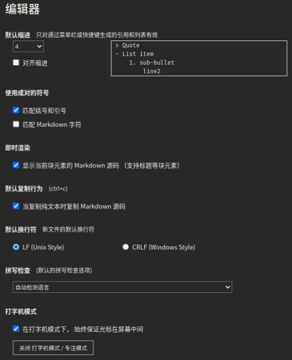
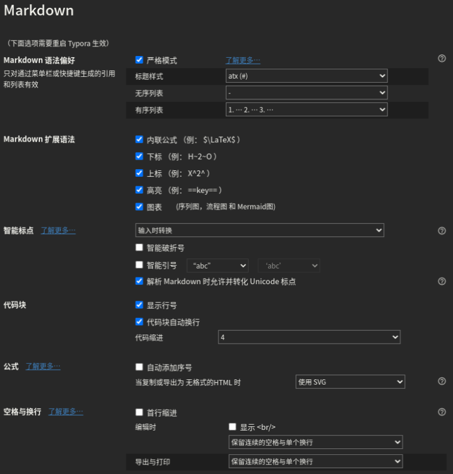

[TOC]

# 系统设置

- 分区：系统装在SSD上面。
    - C盘：至少150G。
    - D盘：剩下所有的容量都分给D盘
- OneDrive

# 必装软件

+ 必装软件分三种：
    + 通过**软件包安装**而且比较平常的（比如TIM、微信等）
    + 通过**压缩包解压**的不平常的（比如PdgCntEditor、OfficeBox）
    + **库软件**（比如OpenCV，Anaconda）：==如果可以全部装在WSL里面==
+ 所有的软件都**安装在C盘**，软件包安装的放在`Program Files`或者`Program Files (x86)`文件夹，压缩包解压的放在`Soft`文件夹，库软件放在`Library`文件夹
## 软件包安装
1. 不做介绍的软件：[TIM](https://tim.qq.com/download.html)、[微信](https://pc.weixin.qq.com/)、[网易云音乐](https://music.163.com/download)、[网易有道词典](https://cidian.youdao.com/index.html)、[钉钉](https://www.dingtalk.com/download)、[福昕阅读器](https://www.foxitsoftware.cn/downloads/PDF)、[阿里旺旺](https://wangwang.taobao.com/)、[百度网盘](https://pan.baidu.com/download)、[GitHub Desktop](https://help.github.com/cn/desktop/getting-started-with-github-desktop/installing-github-desktop)、[OneDrive](https://www.microsoft.com/zh-cn/microsoft-365/onedrive/online-cloud-storage)
2. 稍作介绍的软件：

| 软件名 | 介绍                | 软件名      | 介绍|
| :---: | :---: | :---: | :---: |
| ~~[XShell+Xftp](https://www.netsarang.com/zh/free-for-home-school/)~~ | ~~远程连接linux的好工具~~ | [VSCode](https://code.visualstudio.com/download) | 轻量敲代码工具|
| [Bandizip](https://cn.bandisoft.com/bandizip/) | 压缩软件| [PotPlayer](https://daumpotplayer.com/download/)  | 播放软件|
| [IDM](http://www.carrotchou.blog/59.html) | 一级棒的下载软件 | [按键精灵](http://www.anjian.com/)   | 模拟键鼠输入|
| [Mendeley](https://www.mendeley.com/download-desktop/)   | 管理文献软件| [向日葵](https://sunlogin.oray.com/personal/download/)| 远程控制软件，不会像TeamViewer那样封号 |
| [Edge](https://www.microsoft.com/zh-cn/edge/)  | chromium版| [~~X2Go~~](https://wiki.x2go.org/doku.php/download:start) | ~~远程连接Linux的图形界面~~ |
|[flux](https://justgetflux.com/)|调节屏幕色温|[stretchly](https://hovancik.net/stretchly/)|休息提醒|
|[MobaXTerm](https://mobaxterm.mobatek.net/download.html)|远程连接linux的好工具|[Typora](https://typora.io/#download)|Markdown编辑器|
|[Foxmail](https://www.foxmail.com/)|邮箱|[AIDA64](https://www.aida64.com/downloads)|显示电脑详细信息|
|[cloc](https://github.com/AlDanial/cloc)|代码行数统计|||

3. 大型软件：Lightroom Classic、Photoshop、Microsoft Office、~~Visual Studio~~、WLS（Ubuntu 18.04 LTS）、Visio、CLion
## 压缩包解压
| 软件名   | 介绍           | 软件名    | 介绍                                 |
| ----------- | ---------------- | ------------ | -------------------------------------- |
|[唧唧Down](http://client.jijidown.com/) | 下载b站视频 | PdgCntEditor | 编辑PDF目录                        |
| [DiskGenius](https://www.diskgenius.cn/download.php)  | 管理磁盘     | Scrcpy_GUI   | 手机投屏到电脑（可以媲美华为的投屏） |
| [Everything](https://www.voidtools.com/zh-cn/downloads/)  | 搜索本地文件 | ShadowsocksR | 必备工具                           |
| [万彩办公大师](http://www.wofficebox.com/) | 办公工具箱  | [SpeedPan](http://supanx.com/speedpan-free.html)     | 百度网盘资源下载器，免费版，用来搜资源 |
| [软媒魔方](https://mofang.ruanmei.com/)    | 管理电脑的工具箱 | [SpeedPanX](http://supanx.com/)    | 百度网盘资源下载器，付费版，用来下资源 |
## 库软件
==如果可以全部装在WSL里面==，否则全部安装于`C:\Library\`中  

| 软件名 | 介绍| 软件名| 介绍|
| ---------- | ------ | ------------ | ------ |
| [Anaconda3](https://www.anaconda.com/distribution/)  | 管理python| ~~CTEX~~ | ~~LaTeX发行版，毕设用~~ |
| ~~mingw64~~ | ~~和VSCode一起配置c/c++环境~~ |[OpenCV](https://github.com/opencv/opencv/releases)| 计算机视觉库|
|[Eigen](http://eigen.tuxfamily.org/index.php?title=Main_Page)|矩阵库|[PCL](https://github.com/PointCloudLibrary/pcl/releases)|处理点云库|
|[CMake](https://cmake.org/download/)|编译工具|[Git](https://git-scm.com/download/win)|版本控制系统|
# WSL
WSL的版本是Ubuntu 18.04。
首先需要到`控制面板 -> 卸载程序 -> 启用或关闭Windows功能 -> 适用于Linux的Windows子系统`，打勾，然后重启
进入`Microsoft Store`安装。

从WSL升级到WSL2可以参考[教程](https://www.liumingye.cn/archives/326.html)

## 配置
1. 更改镜像为[清华镜像](https://mirrors.tuna.tsinghua.edu.cn/help/ubuntu/)
2. 美化Bash：在任意一个环境变量文件添加如下代码，添加完后重新注入环境变量
```bash
export PS1="\[\e[36;1m\]\u\[\e[0m\]@\[\e[33;1m\]\h\[\e[0m\]:\[\e[31;1m\]\w\[\e[0m\]\$ " 
```
3. 添加代理：在环境变量（最好是`/etc/bash.bashrc` or `/etc/bashrc`）中添加如下内容

    ```shell
    IP=$(cat /etc/resolv.conf |grep name|cut -f 2 -d " ") 
    Port=23333
export http_proxy="http://${IP}:${Port}"
    export https_proxy="https://${IP}:${Port}"
    
    httpon(){
    	export http_proxy="http://${IP}:${Port}"
    	export https_proxy="https://${IP}:${Port}"
    	echo "proxy on, and IP is $(curl ip.sb)"
    }
    socks5on(){
        export http_proxy="socks5://${IP}:${Port}"
        export https_proxy="socks5://${IP}:${Port}"
    	echo "proxy on, and IP is $(curl ip.sb)"
    }
    proxyoff(){
      unset http_proxy
      unset https_proxy
      echo "proxy off"
    }
    # git的代理。不支持socks5。不过我加了以后好像更慢了。。。
    # git config --global http.proxy http://${IP}:${Port}
    # git config --global https.proxy http://${IP}:${Port}
    ```
    
4. 安装cuda：参考[CUDA on WSL User Guide](https://docs.nvidia.com/cuda/wsl-user-guide/index.html#abstract)

5. Tmux：在配置文件`~/.tmux.conf `中加入如下内容

    ```shell
    # 启用鼠标
    set -g mouse on
    # 复制模式	
    set-window-option -g mode-keys vi #可以设置为vi或emacs
    # set-window-option -g utf8 on #开启窗口的UTF-8支持，报错
    ```

    复制模式步骤：

    1. C-b [ 进入复制模式
    2. 参考上表移动鼠标到要复制的区域，移动鼠标时可用vim的搜索功能"/","?"
    3. 安空格键开始选择复制区域
    4. 选择完成后安enter键退出
    5. C-b ] 粘贴

6. 自动进行git操作脚本`gitauto.sh`：

    ```shell
    #!/bin/bash
    # 用于判断的关键词
    fail="失败|error|fail"
    success="干净|succe|clear"
    
    # 将要监控的git仓库路径存放在下面
    git_path=(
        "/home/orz/Documents/My-Learning-Notes/"
        # "/home/orz/Documents/"
    )
    date=$(date +%Y.%m.%d)
    
    # 处理每一个文件
    for path in ${git_path[*]}
    do
        echo -e "\e[1;31m$path\e[0m"
        name=$(echo $path | rev | cut  -d "/" -f  2 | rev )
    
        cd $path
        # pull
        if [ -n "$(git pull|grep -E "$fail")"  ]
        then
            echo -e "\e[1;33m ##### pull 失败 #####\e[0m"
            cd -L
            continue
        fi
    
        # add + commit
        if [ -n "$(git status|grep -E "$success")" ]
        then
            echo "无需commit"
            cd -L
            continue
        else
            read -p "输入姓名（可以空白）：" message
            if [ -n "$message" ]
            then
                message=$message"-"$date
            else
                message=$date
            fi
            git add .
            git commit -m "$message"
        fi
    
        # push
        if [ -n "$(git push|grep -E "$fail")" ]
            then
                echo -e "\e[1;34m ##### push 失败 ##### \e[0m"
        fi
    
        cd -L
    done
    ```

    然后添加到环境变量`~/.bashrc`

    ```shell
    alias gitauto="bash ~/gitauto.sh"
    ```

7. 与Clion连接：[WSL - Help | CLion - JetBrains](https://www.jetbrains.com/help/clion/how-to-use-wsl-development-environment-in-clion.html)
## 必装软件&库
==root身份==
1. 不做介绍
```bash
apt install tmux unzip zip
```
2. Anaconda：安装方法参考[我的这篇博客](https://blog.csdn.net/OTZ_2333/article/details/86688480)，安装完后需要更改[Anaconda镜像源](https://mirrors.tuna.tsinghua.edu.cn/help/anaconda/)和[pypi镜像源](https://mirrors.tuna.tsinghua.edu.cn/help/pypi/)(可选)为清华镜像，并安装如下包
```bash
pip install opencv-contrib-python
```

3. OpenCV：参考[我的这篇博客](https://blog.csdn.net/OTZ_2333/article/details/104040394)
4. 各种库：

|库名称|说明|安装方法|
|---|---|---|
|Eigen|矩阵处理|apt install libeigen3-dev|
|Pangolin|可视化|依赖：apt install libgl1-mesa-dev libglew-dev <br>(可选，用于生成html/pdf文档) apt install Doxygen <br>[git](https://github.com/stevenlovegrove/Pangolin)后用cmake编译安装|
|Sophus|李代数|[git](https://github.com/strasdat/Sophus)后用cmake编译（无需安装）|
|Ceres|求解最小二乘问题|依赖：apt install liblapack-dev libsuitesparse-dev libcxsparse3 libgflags-dev libgoogle-glog-dev libgtest-dev<br>[git](https://github.com/ceres-solver/ceres-solver)后用cmake编译安装|
|g2o|基于图优化|依赖：apt install cmake libeigen3-dev libsuitesparse-dev qtdeclarative5-dev qt5-qmake qt5-default libqglviewer-dev-qt5 libcxsparse3 libcholmod3<br>[git](https://github.com/RainerKuemmerle/g2o)后用cmake编译安装|
| FLANN | 最邻近算法 | [git](https://github.com/mariusmuja/flann)后用cmake编译安装 |
|PCL|点云处理|依赖：要先装FLANN<br>(必装) apt install build-essential libboost-all-dev libeigen3-dev libvtk7-dev <br> (可选) apt install libopenni-dev libqhull-dev libusb-1.0-0-dev <br> [git](https://github.com/PointCloudLibrary/pcl)后用cmake编译安装|
|OctoMap|八叉树建图|方法一：apt install liboctomap-dev<br>方法二：[git](https://github.com/OctoMap/octomap)后用cmake编译安装|
|OpenMesh|三维网格处理|[git](https://www.graphics.rwth-aachen.de:9000/OpenMesh/OpenMesh)or[下载release](https://www.graphics.rwth-aachen.de:9000/OpenMesh/OpenMesh/-/releases)后用cmake编译安装|
整理成.sh如下：
```bash
#安装这些依赖的时候好像会安装python2.7，我也不知道为啥。而且安装完后运行python会自动运行python2.7。  
#不过重新注入环境变量了以后再运行python用的就是anaconda里面的python，所以我也就没有管它了。
apt install libeigen3-dev liblapack-dev libcxsparse3 libgflags-dev libgoogle-glog-dev libgtest-dev cmake libsuitesparse-dev qtdeclarative5-dev qt5-qmake qt5-default libqglviewer-dev-qt5 libcxsparse3 libcholmod3 libgl1-mesa-dev libglew-dev build-essential libboost-all-dev libvtk7-dev

#如果安装Pangolin出现‘No package ‘xkbcommon’ found’
apt install libxkbcommon-x11-dev
# OpenMesh
git clone https://www.graphics.rwth-aachen.de:9000/OpenMesh/OpenMesh.git
cd OpenMesh && mkdir build && cd build && cmake ..
make -j7 install
cd ../..
# octomap
git clone https://github.com/OctoMap/octomap.git
cd octomap && mkdir build && cd build && cmake ..
make -j7 install
cd ../..
# Pangolin
git clone https://github.com/stevenlovegrove/Pangolin.git
cd Pangolin && mkdir build && cd build && cmake ..
make -j7 install
cd ../..
# Sophus
git clone https://github.com/strasdat/Sophus.git
cd Sophus && mkdir build && cd build && cmake ..
make -j7
make install #可以不安装，但是我还是装了
cd ../..
# ceres
git clone https://github.com/ceres-solver/ceres-solver.git
cd ceres-solver && mkdir build && cd build && cmake ..
make -j7 install
cd ../..
# g2o
git clone https://github.com/RainerKuemmerle/g2o.git
cd g2o && mkdir build && cd build && cmake ..
make -j7 install
cd ../..
# flann
git clone https://github.com/mariusmuja/flann.git
cd flann && mkdir build && cd build && cmake ..
make -j7 install
cd ../..

# PCL
git clone https://github.com/PointCloudLibrary/pcl.git # 或者tar xvfj pcl-pcl-1.7.2.tar.gz
cd pcl && mkdir build && cd build && cmake .. # 如果想要安装Release版本，运行命令cmake -DCMAKE_BUILD_TYPE=Release ..
make -j7 install
```
## 图形界面

1. WSL上安装图形界面：我选择的是`apt install xfce4`

2. Windows安装[MobaXTerm](https://mobaxterm.mobatek.net/download.html)。然后运行MobaXTerm，保证其X server为开启状态，即左上角的“X”为彩色，为灰色的话，按一下就彩色了

    

3. 在WSL上运行如下命令就会出现图形界面了
    ```bash
    startxfce4
    ```
​		**PS**：如果只是想查看运行结果（比如OpenCV的imshow），可以不执行`startxfce4`，直接执行代码就会自动打开窗口。

4. 如果报错，则在

    ```shell
    IP=$(cat /etc/resolv.conf |grep name|cut -f 2 -d " ")
    PortOffset=2222.0
    export DISPALY=${WINIP}:${PortOffeset}
    ```

    其中，PortOffset需与MobaXTerm中的X server设置保持一致

    

    PS：

# Typora

- 偏好设置：

    

    

    

- 快捷键配置：编辑文件`conf.user.json`，Linux上的路径为`~/.config/Typora/conf/conf.user.json`；或者点击`文件` -> `偏好设置` -> `通用` -> `高级设置` -> `打开高级设置`。将整个文件内容替换为
```json
/** For advanced users. */
{
  "defaultFontFamily": {
    "standard": null, //String - Defaults to "Times New Roman".
    "serif": null, // String - Defaults to "Times New Roman".
    "sansSerif": null, // String - Defaults to "Arial".
    "monospace": null // String - Defaults to "Courier New".
  },
  "autoHideMenuBar": false, //Boolean - Auto hide the menu bar unless the `Alt` key is pressed. Default is false.

  // Array - Search Service user can access from context menu after a range of text is selected. Each item is formatted as [caption, url]
  "searchService": [
    ["Search with Google", "https://google.com/search?q=%s"]
  ],

  // Custom key binding, which will override the default ones.
  "keyBinding": {
    // for example: 
    // "Always on Top": "Ctrl+Shift+P"
    "Inline Math": "Ctrl+M",
    "Highlight": "Ctrl+Shift+H",
    "Superscript": "Ctrl+Shift+=",
    "Subscript": "Ctrl+="
    // "Comment": "Ctrl+K+C"

  },

  "monocolorEmoji": false, //default false. Only work for Windows
  "autoSaveTimer" : 3, // Deprecidated, Typora will do auto save automatically. default 3 minutes
  "maxFetchCountOnFileList": 500,
  "flags": [] // default [], append Chrome launch flags, e.g: [["disable-gpu"], ["host-rules", "MAP * 127.0.0.1"]]
}
```

- 字典更新：Typora支持用户更新字典。[字典](./user-dict.json)保存路径为`{typora-user-folder}\dictionaries`。`{typora-user-folder}`可以通过设置里面的`主题文件夹`找到，或者在Linux上为`~/.config/Typora`，在Windows上为`C:/user/<用户名>/appData/Roaming/Typora`。

# Foxmail

|         | 邮箱类型 | 收件服务器            | SSL      | 端口 | 发件服务器            | SSL      | 端口 |
| ------- | -------- | --------------------- | -------- | ---- | --------------------- | -------- | ---- |
| outlook | IMAP     | imap-mail.outlook.com | &#10003; | 993  | smtp-mail.outlook.com | STARTTLS | 587  |
| gmail   | IMAP     | imap.gmail.com        | &#10003; | 993  | smtp.gmail.com        | &#10003; | 465  |
| 126     | IMAP     | imap.126.com          | &#10003; | 993  | smtp.126.com          | &#10003; | 465  |
| qq      | IMAP     | imap.qq.com           | &#10003; | 993  | smtp.qq.com           | &#10003; | 465  |


# CLion

- 与WSL连接：[WSL - Help | CLion - JetBrains](https://www.jetbrains.com/help/clion/how-to-use-wsl-development-environment-in-clion.html)
- 设置自动补全提示不区分大小写：设置成下图所示
- 设置提示无延迟：

# VS Code

## 扩展

- ~~[**Markdown All in One**](https://marketplace.visualstudio.com/items?itemName=yzhang.markdown-all-in-one)：超级好用的快捷键、自动补全~~
- ~~**Markdown PDF**：将Markdown转为PDF（也可以转为jpg、HTML），但是生成的中文字体有点奇怪，而且生成的目录无法跳转~~
- ~~**Markdown TOC**：生成目录。简洁而且可以在Markdown PDF生成的PDF中也可以使用。~~
- ~~[**Markdown Preview Enhanced**](https://shd101wyy.github.io/markdown-preview-enhanced/#/zh-cn/)：可以生成目录、转换为PDF、以及有漂亮的预览~~
- **TabNine**：我觉得超级好用的自动补全软件
- **Python**：直接运行python文件（不需要扩展Code Runner），然后不需要手动配置python的路径了，好像会自动配置的（我已经安装了anaconda，而且添加到环境变量里面了）
- **C/C++**：编译C/C++，但是好像不能运行（具体的有点混，搞不清楚）
- **Code Runner**：配合扩展C/C++来运行C/C++的程序
- **CMake**：可以自动补全CMake相关的代码
- **Remote - SSH**：远程调试代码全家桶
- **Remote Development**：远程调试代码全家桶
- **Remote - Containers**：远程调试代码全家桶
- **Remote - SSH: Editing Configuration Files**：远程调试代码全家桶
- **Remote - WSL**：用来跟WSL互动
- **Anaconda Extension Pack**：可以切换Anaconda的虚拟环境
- **Chinese (Simplified) Language Pack for Visual Studio Code**：中文有时候还是用得到的吧

## 配置

- **python代码格式化**：使用库`Autopep8`。

```bash
pip install --upgrade autopep8
```

- **python代码检查**：使用库`Flake8`。

```bash
pip install --upgrade flake8
```

- 
- **配置C++运行环境**：主要参考[知乎上的一个回答](https://www.zhihu.com/question/30315894/answer/154979413)。但是要说的是，如果要**引用其他的库**（比如OpenCV），需要在**C_Cpp.default.includePath**中添加头文件路径（前面那个知乎的回答说还要填browse的）  
- **整体settings.json**

```JSON
{
    "editor.formatOnType": true, // 输入分号(C/C++的语句结束标识)后自动格式化当前这一行的代码
    "files.autoSave": "afterDelay",
    "editor.acceptSuggestionOnEnter": "off", // 我个人的习惯，按回车时一定是真正的换行，只有tab才会接受Intellisense
    //忽略“推荐扩展”
    "extensions.ignoreRecommendations": true,
    //不继承VS Code的Windows环境，针对Linux
    "terminal.integrated.inheritEnv": false,
    //调整窗口的缩放级别
    "window.zoomLevel": 0,
    "explorer.confirmDragAndDrop": false,


    //C++配置
    "C_Cpp.default.includePath": [
        "E://Library//OpenCV//opencv//build//include",
        "E://Library//OpenCV//opencv//build//include//opencv",
        "E://Library//OpenCV//opencv//build//include//opencv2"
    ],
    "C_Cpp.default.browse.path": [
        "E://Library//OpenCV//opencv//build//include",
        "E://Library//OpenCV//opencv//build//include//opencv",
        "E://Library//OpenCV//opencv//build//include//opencv2"
    ],
    "C_Cpp.clang_format_sortIncludes": true,
    "code-runner.ignoreSelection": true,
    "code-runner.saveFileBeforeRun": true,
    "code-runner.runInTerminal": true, // 设置成false会在“输出”中输出，无法输入
    "C_Cpp.clang_format_fallbackStyle": "{ BasedOnStyle: Google, AllowShortIfStatementsOnASingleLine: true, ColumnLimit: 0, IndentWidth: 4}",
    "debug.onTaskErrors": "showErrors",


    //自动预览markdown
    "markdown.extension.preview.autoShowPreviewToSide": false,
    "markdown-pdf.displayHeaderFooter": true,
    //markdown的目录是否为纯文本？？？
    "markdown.extension.toc.plaintext": true,
    //防止Markdown TOC生成的目录不自动换行
    "files.eol": "\n",
    
    
    // 是否启用交互式窗口（jupyter）？
    // "python.dataScience.sendSelectionToInteractiveWindow": true,
    //代码自动检查
    "python.linting.flake8Enabled": true,
    //python一行代码的最长长度，超了会报错
    "python.linting.flake8Args": [
        "--max-line-length=200"
    ],
    "python.pythonPath": "E:\\Library\\Anaconda3\\python.exe",
    //python一行代码的最长长度，格式化时会将超了的自动换行
    "python.formatting.autopep8Args": [
        "--max-line-length=200"
    ],
    //防止报错Module 'cv2' has no 'imread' member
    "python.linting.pylintArgs": [
        "-–generate-members"
    ],
    //第三方库的自动补全
    "python.autoComplete.extraPaths": [
        "E://Library//Anaconda3//Lib//site-packages",
        "E://Library//Anaconda3//Scripts"
    ],
    
    
    "remote.SSH.defaultForwardedPorts": [],
    "remote.SSH.remotePlatform": {
        "106-外网": "linux",
        "112-外网": "linux"
    },
    "remoteX11.SSH.privateKey": "~/.ssh/112-out",
    "remoteX11.screen": 1,
    "remoteX11.display": 1,
    "markdown-preview-enhanced.liveUpdate": false,
    //vscode 没办法给中文断词，所以加上中文常用标点
    "editor.wordSeparators": "`~!@#$%^&*()-=+[{]}\\|;:'\",.<>/?、，。？！“”‘’；：（）「」【】〔〕『』〖〗",
    
}
```

>参考：[CLANG-FORMAT STYLE OPTIONS](https://clang.llvm.org/docs/ClangFormatStyleOptions.html)

