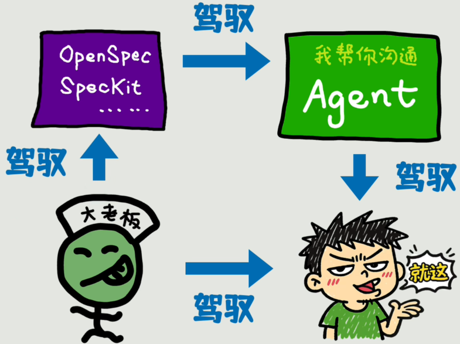
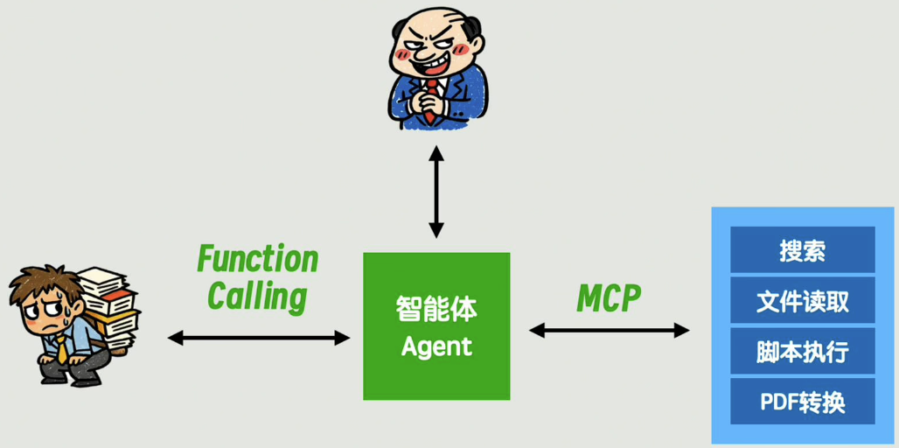
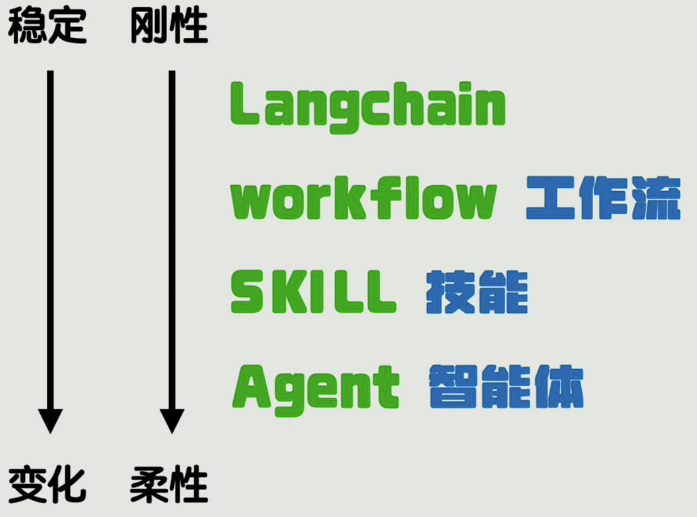
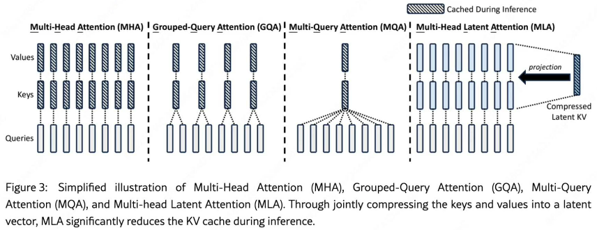
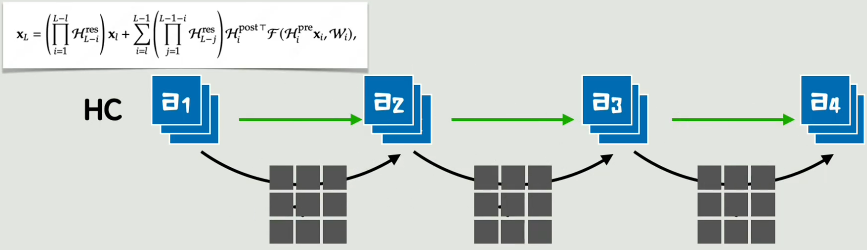

# 工具

## CLI

### Claude Code

- 功能：

    - Auto Memory：自动把它觉得需要记录的东西记下

    - Auto Dream：处理当前项目的memory记忆文件
    
- 安装：[官方的部署脚本](https://code.claude.com/docs/en/setup#installation)、[硅基流动的部署脚本](https://docs.siliconflow.cn/cn/usercases/use-siliconcloud-in-ClaudeCode#%E6%96%B9%E5%BC%8F%E4%B8%80%EF%BC%9A%E4%B8%80%E9%94%AE%E5%AE%89%E8%A3%85%E5%8F%8A%E9%85%8D%E7%BD%AE%E8%84%9A%E6%9C%AC)

    - 如果启动claude报如下错，在`~/.claude.json`中添加内容`"hasCompletedOnboarding": true`

        ```
        Unable to connect to Anthropic services
        Failed to connect to api.anthropic.com: ERR BAD REQUEST
        lease check your internet connection and network settings.
        Note: Claude Code might not be available in your country, Check supported countries atnttps://anthropic.com/supported-countriesS E:ltoollclaude code>
        ```

- 设置第三方的多个模型：以bash为例

    ```bash
    export ANTHROPIC_BASE_URL="https://api.siliconflow.cn/"
    export ANTHROPIC_API_KEY="sk-xxx"
    export ANTHROPIC_MODEL="Pro/deepseek-ai/DeepSeek-V3.2"	# 得有一个默认的模型
    _claude() {
        echo "使用$1, 价格 ¥$2/ M Tokens"
        export ANTHROPIC_MODEL="$1"
        claude
    }
    claude_kimi(){
        name="Pro/moonshotai/Kimi-K2.5"
        price=21
        _claude $name $price
    }
    claude_glm(){
        name="Pro/zai-org/GLM-4.7"
        price=16
        _claude $name $price
    }
    claude_deepseek(){
        name="Pro/deepseek-ai/DeepSeek-V3.2"
        price=3
        _claude $name $price
    }
    claude_minmax(){
        name="Pro/MiniMaxAI/MiniMax-M2.1"
        price=8.4
        _claude $name $price
    }
    ```

    

# 测评

- [Arena Leaderboard](https://arena.ai/zh/leaderboard)：类别包含Text、Code、Vision、Text-to-Image、Image、Edit、Search、Text-to-Video、Image-to-Video


# 技巧

> 2026年4月29日：[开源「洁癖.skill」，让你的Agent越用越聪明。](https://mp.weixin.qq.com/s/tg1wd-iN2gWHWhXdY0faeg)

- 让AI整理文档，合并优于追加，删除优于保留
    - 在AI协作的场景里，信息多不是优势，信息准才是

> 2026年4月14日：[用好Agent最重要的技巧不是Skills，是这四个字。](https://mp.weixin.qq.com/s?__biz=MzIyMzA5NjEyMA==&mid=2647681510&idx=1&sn=427a2e5af2f9aa7ca81442ffac4f2a59)

- Agent设定规则：**约束先行**
    - 让Agent干任何事情之前，先把规范定好，全局、项目、文件夹的规矩。
- 对于AI来说，你脑子里知道的东西，如果没有写进文档，就是不存在的

> 2026年4月3日：[Claude Code悄悄学会了做梦。](https://mp.weixin.qq.com/s?__biz=MzIyMzA5NjEyMA==&mid=2647681328&idx=1&sn=ef7b6d4a0ba5bb46313c142da225190b)

- Claude Code有四层记忆：越来越完整，也越来越像人

    - 第一层，CLAUDE.md。你手写的指令文件。项目规范、编码标准等等，这些是你主动教给Claude的东西。目前的最高权限。
    - 第二层，Auto Memory。Claude在工作过程中自己记的笔记。
    - 第三层，Session Memory。单次对话内的上下文记忆。即标准的上下文窗口，你跟它当前这轮对话里说的所有东西，对话结束就没了。但对话的原始记录会以JSONL日志文件的形式留在了本地。Claude平时不会去读这些日志，但Auto Dream做梦的时候会去翻它们，从里面捞有价值的信息出来。
    - 第四层，Auto Dream。后台的记忆巩固层。定期清理、整理、优化Auto Memory积累的所有笔记。

    

# 教程

## [Learn Claude Code by doing, not reading](https://claude.nagdy.me/)

### 3 Project Setup: Setting Up Claude Code for a Project

- CLAUDE.md 文件不超过 200 行。每一行都应与几乎所有会话相关
  - 如果某内容仅针对某一项功能，应将其放入路径专属的规则文件中\
  - 最有价值的部分包括：技术栈和版本、开发命令（安装、测试、构建、代码检查）、不常见的命名规范，以及会让新开发者踩坑的已知潜在问题。

### 4 Commands Deep Dive: Commands in Depth

- claude code的内置技能
  - `/simplify`审阅最近修改的文件以评估代码质量，同时生成并行的审阅智能体，负责不同方面的检查。
  - `/batch <instruction>` 适用于跨多个文件的大规模修改——它会规划工作、使用独立的 git 工作树，还能协调验证工作以及面向拉取请求（PR）的后续处理。
  - `/loop 5m check deploy status` 会按固定间隔重复执行指令，适用于轮询长时间运行的操作。
    - `/proactive` 是 `/loop` 的别名
- 快捷键
  | 快捷键        | 说明                                                         |
  | ------------- | ------------------------------------------------------------ |
  | Ctrl+O        | 进入详细模式，实时查看工具调用和推理步骤                     |
  | Ctrl+B        | 让正在运行的 bash 命令和代理在后台继续执行，从而在它们继续工作的同时给 Claude 下达另一条指令 |
  | Ctrl+X Ctrl+K | 终止所有后台代理                                             |
  | Ctrl+U        | 清空整个输入缓冲区                                           |
  | Ctrl+Y        | 恢复你刚刚清空的内容                                         |
  | Ctrl+L        | 除了清除提示输入外，还会强制全屏重绘，可用于终端输出出现撕裂或偏移的情况 |

### 5 Skills: Agent Skills

- Plugin skills 使用 `plugin-name:skill-name` 命名空间
- Skills分3个层级进行加载
- **层级一**：YAML格式的信息，用来描述技能，永远都会加载，以便 Claude 了解可用的功能。包含的字段如下
  - `name`：skill的名字，在claude中可以通过`/name`手动调用该技能
  - `description`：最重要的部分，决定了 Claude 何时自动调用该技能，必须精准描述，比如使用任务类型（“scan”, “generate”, “analyze”）、主题领域（“security”, “API”, “database”）以及明确的触发短语（“when the user mentions”, “use when”）。类似 “helps with code”这样模糊的描述永远不会触发调用
  - `when_to_use`：大致上是`description`的扩展。`description`和`when_to_use`文本合并后截断为1536个字符后记录到skill列表中，剩下的再记录到`when_to_use`
    - Claude 将skill描述的总空间预算设定为上下文窗口的约 1%，必要时提供 8000 个字符的备用容量，而设置中 `SLASH_COMMAND_TOOL_CHAR_BUDGET` 可以提高这一上限
    - 运行 `/context` 可检查skill是否未被列入列表
  - `shell `：指定用于 `!command`块的命令行解释器。比如在Windows上使用powershell（或者设置`CLAUDE_CODE_USE_POWERSHELL_TOOL=1`）
  - `disable-model-invocation: true` 表示只有用户能通过 /skill-name 调用它，Claude 永远不会自动触发——用于任何带有副作用的技能（部署、推送、发送操作）
  - `user-invocable: false` 会将技能从 / 菜单中隐藏，但仍允许 Claude 自动调用它——适合那些无法作为命令执行的背景知识类技能
  - `paths`：接受一个 YAML 格式的通配符列表，用于限定技能的生效范围
  - `context: fork` 在一个具有独立上下文窗口的隔离子智能体中运行该技能。
  - `agent`：指定智能体类型，Explore用于只读研究，Plan用于规划，general-purpose适用于需要所有工具的任何任务。
    - 子智能体承担繁重工作的同时，主对话保持简洁。
  - `argument-hint`：显示技能期望的参数
  - `allowed-tools`：限制技能运行时可使用的工具，其遵循与权限规则相同的模式语法
- **层级二**：SKILL.md的全文（推荐长度在500行以内），只有在Claude需要使用当前skill的时候加载
  - 使用!`<command>`的语法会在技能内容发送给 Claude 之前执行 shell 命令。输出会被内联处理——Claude 只能看到结果，无法看到命令。
      - 内联形式仅在 `!` 出现在行首或紧跟在空白之后时被识别
      - 多行命令，使用以 ````!` 开头的围栏代码块而不是内联形式
  - 捕获参数的方式有2种：`$ARGUMENTS` 会捕获命令名之后的所有内容作为单个字符串。`$0、$1、$2` 会捕获以空格分隔的单个参数
- **层级三**：在skill目录中的辅助文件（模板、脚本），通过bash按需加载
  - 辅助文件通过相对路径进行引用
  - 将 SKILL.md 的内容控制在 500 行以内；将详细的参考资料放在单独的辅助文件中
- claude code的内置技能
  - `/less-permission-prompts`（v2.1.112 版本新增功能）会扫描你的对话记录，查找常见的只读 Bash 和 MCP 工具调用，然后为你的 .claude/settings.json 生成一份优先许可白名单。在使用几次会话后运行该功能，就能生成适配你实际工作流程的权限配置

### 6 Hooks

- Hooks是在 Claude Code 会话期间特定事件发生时自动执行的脚本

    - 接收 JSON 输入（可访问由 Claude Code 自动设置的环境变量），并通过退出码和 JSON 输出结果
    - **命令hook**具有确定性、可组合性、可测试性 且与语言无关
    - **提示hook**和**智能体hook** 使用模型进行评估，具有不确定性

- 支持30多种hook事件：例如

    - `PreToolUse`：在工具运行前进行验证，可阻止执行

    - `PostToolUse`：在工具运行后进行观察或响应，可添加上下文

    - `UserPromptSubmit`：在 Claude 处理用户输入前对其进行拦截

    - `Stop`：在 Claude 完成响应时执行检查

    - `PermissionRequest`：用于权限处理的事件

    - `SubagentStart`和`SubagentStop`：子代理生命周期

    - `PostToolUseFailure`和`StopFailure`：故障

    - `FileChanged`：文件监控

    - `PreCompact`和`PostCompact`：上下文压缩。PreCompact可以阻止压缩操作的发生

    - 此外还有通知、配置更改、工作树管理

        > [!NOTE]
        >
        > 以下几个为2.1.76之后才有的事件

    - `CwdChanged`（v2.1.83）：在工作目录发生变化时触发

    - `TaskCreated`（v2.1.84）：在使用 `TaskCreate` 工具时触发

    - `WorktreeCreate`（v2.1.84）：在创建工作树智能体时触发，并且支持 `type: "http"` 用于**远程通知**

    - `Elicitation`（v2.1.76）：在 MCP 服务器通过交互式对话框在任务执行过程中请求结构化用户输入时触发，并且可以在提示信息展示给用户前拦截并修改。

    - `ElicitationResult`（v2.1.76）在用户响应 MCP 提示后触发，并且可以在响应发送回 MCP 服务器前拦截并覆盖该响应。

- 语法：

    - 在设置文件中，添加`“hooks"`，内容是任意数量的hook事件
    - 单个hook事件包含一个match数组，其中
        - `"matcher"`表示与工具名称匹配的正则表达式模式，其中
            - `"Bash"` 表示精确匹配
            - `"Write|Edit"` 匹配其中任意一个
            - `"*"` 匹配所有工具
            - `"mcp__github__.*"` 匹配所有 GitHub MCP 工具
        - `"if"`：在满足matcher的前提下，缩小工具的调用场景。例如，只需拦截 `git push` 命令，则填写`"Bash(git push*)"`
        - `"hooks"`：包含具体的hook事件内容
            - `"type"`：包含command、prompt、agent、http、mcp_tool

- 环境变量`CLAUDE_CODE_SESSION_ID` 包含唯一的会话标识符——可使用它将钩子日志和外部遥测数据与特定会话关联起来。

- hook输入输出：

    - `PostToolUse`和`PostToolUseFailure` hook的输入包含一个`duration_ms`字段，该字段显示工具的执行时间
    
    - `Stop` 和 `SubagentStop`  hook的输入包含 `background_tasks` 和 `session_crons` 数组。
    
        - 前者 列出了回合结束时仍在后台运行的 bash 命令和子智能体
    
        - 后者 列出了附加到会话的计划任务
    
    - 退出码`0`表示成功，退出码`2`表示阻塞错误
    
- hook类型：

    - command 类型：执行本地 shell 命令

    - prompt 类型：要求 Claude 评估一段提示词，通常在Stop或SubagentStop时触发

    - agent 类型：生成一个子智能体以进行多步验证。

    - http 类型：会将相同的 JSON 负载以 POST 方式发送至网络钩子端点，这对于远程日志记录或策略服务场景非常实用。支持在请求头中进行环境变量插值，且这些变量必须被明确加入允许列表

    - mcp_tool 类型：直接调用 MCP 工具。适用于需要调用外部服务（例如向 Slack 发布消息或创建 GitHub  issue）且无需通过 shell 执行时，该类型尤为适用

        > [!NOTE]
        >
        > the in-app config builder目前还无法生成mcp_tool类型的 hooks

- 可以使用 `hooks` 前置字段将钩子限定于特定skill和智能体

    - `once: true` 标志会让钩子在每个会话中仅运行一次

    ```markdown
    ---
    name: production-deploy
    hooks:
      PreToolUse:
        - matcher: "Bash"
          hooks:
            - type: command
              command: "./scripts/production-safety-check.sh"
              once: true
    ---
    ```

### [7 MCP Server：Model Context Protocol](https://claude.nagdy.me/learn/mcp/) 

- 添加服务器：`claude mcp add` 命令
    - 参数`--transport`：与服务器类型匹配的传输方式，`http` 适用于远程服务器，`stdio` 适用于本地运行的进程
- 管理服务器：`claude mcp list`、`claude mcp get <name>`和`claude mcp remove <name>`
- MCP 配置存储位置： `~/.claude.json` 或项目根目录下的 `.mcp.json`（与团队共享）
    - 所有配置字段均支持环境变量展开——可使用 `${VAR:-default}` 设置默认值
    - 临时加载MCP配置：使用命令行参数`--mcp-config`；再加上`--strict-mcp-config`可在该次会话中忽略所有其他 MCP 源
- 使用`MCP_TIMEOUT`以毫秒为单位设置每服务器连接超时（默认值因传输协议而异）。
- MCP 配置的作用域：本地作用域（`~/.claude.json`中项目相关字段）、项目作用域（`.mcp.json`）、用户作用域（`~/.claude.json`中全局字段）
- MCP 提示词 格式为 `/mcp__servername__promptname`
- MCP 资源可通过 `@server:protocol://resource/path` 内联引用
- MCP 工具会延迟加载并按需发现；除非在配置中添加 ``alwaysLoad: true``
- 单个 MCP 工具描述和服务器指令的长度均限制为 2KB；当 MCP 工具的输出超过 10000  token时警告，可修改环境变量`MAX_MCP_OUTPUT_TOKENS`
- MCP elicitation可以暂停工作流 并要求用户手动输入。`Elicitation`和`ElicitationResult`钩子可让你以编程方式拦截或自定义这些对话框。
- 安全最佳实践
    - 始终使用环境变量存储凭据，切勿将令牌提交到 git 仓库；
    - 仅需查询数据时使用只读令牌，并将服务器访问权限范围限制在最低必要
    - 对于企业级部署，`managed-mcp.json` 设置服务器白名单策略
- MCP 服务器可发送 `list_changed` 通知，无需重新连接就能动态更新其可用工具、提示词和资源
- MCP 服务器还能通过 `claude/channel` 功能向你的会话推送消息，让 Claude 能够对持续集成结果、监控警报或聊天消息等外部事件做出响应。

### [8 Subagents](https://claude.nagdy.me/learn/subagents/)

- Subagents使用 开头带YAML内容的Markdown文件
    - 单次会话使用`--agents` 命令行，或者把文件放在`.claude/agents/` 或者  `~/.claude/agents/`
    - `/agents` 命令提供交互式菜单，用于创建、编辑和管理子代理。
    - 文件格式：开头带YAML定义agent的身份（其中的），然后是提示词，
    - 插件也可打包子代理。优先级为：策略配置 > 命令行定义 > 项目范围 > 个人范围 > 插件 > 内置配置
- subagents的YAML字段：
    - `tools`限制可用工具
    - `model` 用于设置智能体使用的模型。使用 `inherit` 来继承父级模型
    - `effort` 控制受支持模型（如 Sonnet 4.6 和 Opus 4.6）的推理深度
    - `maxTurns` 限制智能体的运行时长
    - `permissionMode` 用于设置权限级别
    -  `disallowedTools`
    - `skills`预加载所选技能的 
    - `mcpServers`用于智能体作用域 MCP 访问
    - `initialPrompt`用于自动提交首轮对话
    - `memory`为跨会话的信息。agent的memory目录中`MEMORY.md`文件的前200行会自动加载到其系统提示中
    - `isolation: worktree`为智能体提供独立的 Git 工作树和分支。智能体完成任务后，会返回工作树路径和分支名供你查看并合并。
    - `background: true` 让智能体始终 后台运行，释放主对话资源。按 `Ctrl+B` 可将当前运行的智能体转入后台。
- 命令行参数`--add-dir <path>`添加额外的可访问的范围
    - 在设置中通过 `permissions.additionalDirectories` 跨会话保留这些权限
- 调用智能体：
    - 自动调用：当任务描述与智能体的`description`字段匹配
    - **手动指定**：使用`@"agent-name (agent)"`语法
    - 使用自然语言进行显式调用，例如`Use the security-reviewer agent to`
- 可将智能体串联使用。
- 监控智能体运行状态：使用命令 `claude agents` 
    - 命令行参数`--cwd <path>` 筛选指定目录下启动的会话
    - 命令行参数`--json`获取json格式的状态信息，可用于类似 tmux-resurrect 风格的启动脚本
    - 设置 `CLAUDE_CODE_DISABLE_AGENT_VIEW=1` 可禁用智能体视图
    - 通过 `claude --agent <name>` 运行特定智能体的完整会话，并通过 `Agent(...)` 工具白名单限制协调器可以启动哪些智能体。
- Claude Code 内置智能体：
    - `general-purpose` 可处理广泛的多步骤任务
    - `Explore` 借助 Haiku 进行快速的只读代码库分析
    - `Plan` 会先对代码库进行研究，再给出实施方案
    - `claude-code-guide` 则可解答有关 Claude Code 功能的问题
- 设置 `CLAUDE_CODE_FORK_SUBAGENT=1` 以启用分支子代理。分支子代理会从主会话继承完整的对话上下文，而非重新开始。

### [9 Advanced Features](https://claude.nagdy.me/learn/advanced-features/)

- 处理模式：
    - 命令行参数`--permission-mode <mode>`指定模式，与`-p`搭配可用于非交互式运行
    - plan mode：
        - 使用 `/plan <description>`、`--permission-mode plan` 命令行标志或 `Shift+Tab` 来切换权限模式
        - 在批准前，使用 `Ctrl+G` 在外部编辑器中打开当前计划
    - auto mode
        - 自动模式会对看似数据窃取、高风险的 shell 执行或影响生产环境的操作采取保守策略
        - 配置规则时，添加 `"$defaults"` 标记以保留内置规则
    - default mode: 可以自由读取，但会提示除此之外的操作。
    - acceptEdits mode: 自动批准会话的文件编辑，但写入受保护的目录除外
    - dontAsk mode: 只运行预先批准的工具，并拒绝其他所有内容。不在`Shift+Tab`的切换选项中
    - bypassPermissions mode: 跳过大多数权限提示，但写入受保护的目录仍然提示确认
- Extended thinking：
    - 使用 `Option+T`（macOS 系统）或 `Alt+T` 切换该功能
    - `/effort` 命令可设置推理深度：`low`、`medium`、`high`、`xhigh` 或 `max`（仅当前会话有效）
        - 如果需要极致推理，可再提示词中加入“ultrathink”
    - 通过 `export CLAUDE_CODE_EFFORT_LEVEL=high` 为每个会话单独设置
- **Ultraplan**
    - 将计划提交给网页会话中的 Claude Code
    - 启用方式：使用`/ultraplan <prompt>`命令、在提示词中包含“ultraplan”，或从完成的本地计划对话框中选择“在网页上使用Ultraplan优化”
        - 启动后，会出现状态标识：起草时显示 `◇ ultraplan`，Claude 有疑问时显示 `◇ ultraplan needs your input`，方案可审阅时显示 `◆ ultraplan ready`
    - Ultraplan 需要 claude.ai 订阅和一个已连接的 GitHub 代码仓库。
- 脚本化运行claude code：
    - ``claude -p "your prompt"`` 可非交互式执行 Claude 代码
    - ``--output-format json`` 可获取结构化输出
    - 使用 ``--permission-mode bypassPermissions`` 可满足完全自动化的 CI/CD 场景需求
- **Sandboxing**：
    - 为文件系统和网络访问提供操作系统级别的隔离，Claude 只能访问你配置的允许路径和网络规则。
    - 在会话中通过 `/sandbox` 启用该功能。
    - 配置：
        - 使用 `sandbox.network.allowedDomains` 和 `sandbox.network.deniedDomains` 来设置网络隔离，
            - 二者都支持通配符，后者优先级最高（从 **所有** 设置源合并而来）
        - 在 Linux 和 WSL 上，使用 `sandbox.bwrapPath` 和 `sandbox.socatPath` 指定 bubblewrap 和 socat 的二进制文件位置
- **Advisor Tool**（顾问工具）：双模型功能，让允许速度更快、成本更低的执行模型（如Sonnet）在任务执行过程中向更高智能的顾问模型（如Opus）寻求策略指导
    - 适用于长周期智能体工作负载，这类工作负载中大部分交互环节都是机械性的，但制定完善的计划至关重要。
    - 使用`/advisor`启用
- 项目清理：立即清除某个项目的所有 Claude Code 状态，请使用 `claude project purge`
    - `claude project purge --all --dry-run` 可预览完整清除操作会删除的内容。`-y` 和 `-i` 这两个简写形式也同样适用。
- 用于调试的环境变量：
    - `OTEL_LOG_RAW_API_BODIES=1` 会将完整的 API 请求和响应主体作为 OpenTelemetry 日志事件发出——在排查请求失败原因或 Claude 向模型发送的具体内容时可设置此参数。
    - `CLAUDE_CODE_USE_POWERSHELL_TOOL=1` 表示在 Linux 和 macOS 系统上启用 PowerShell 工具（需要 PATH 路径中存在 `pwsh`）
    - `DISABLE_UPDATES=1` 会阻止所有更新路径，包括手动的 `claude update`。这比 `DISABLE_AUTOUPDATER` 更为严格（后者仅阻止自动更新）
    - `CLAUDE_CODE_HIDE_CWD=1` 会在启动标志横幅中隐藏工作目录
    - `CLAUDE_CODE_NATIVE_CURSOR=1` 会在输入插入符号处显示终端自身的光标
    - `CLAUDE_CODE_OPUS_4_6_FAST_MODE_OVERRIDE=1` 会将快速模式固定为 Claude Opus 4.6，优先级高于 `CLAUDE_CODE_ENABLE_OPUS_4_7_FAST_MODE`
    - `CLAUDE_CODE_RESUME_PROMPT` 会覆盖 Claude 在恢复中途结束的会话时注入的继续消息。默认值为 `Continue from where you left off.`
    - `CLAUDE_CODE_ENABLE_FEEDBACK_SURVEY_FOR_OTEL=1` 在 Anthropic 非必要流量被阻止时，将会话质量调查发送至你自己的 OpenTelemetry 收集器。
        - 仅在设置了 `CLAUDE_CODE_DISABLE_NONESSENTIAL_TRAFFIC`、`DISABLE_TELEMETRY` 或 `DO_NOT_TRACK` 时生效
    - `ANTHROPIC_WORKSPACE_ID` 是[工作负载身份联合](https://platform.claude.com/docs/en/manage-claude/workload-identity-federation)所使用的工作空间 ID。
- 云端会话：
    - 使用`claude --remote "your task"`启动。多次调用可并行运行多个任务
    - `/teleport`（别名 `/tp`）将云端会话拉回你的本地终端。反向操作则是`--remote` 将任务发送至云端
    - `/autofix-pr` 会生成一个云会话来监控你当前的拉取请求（PR）。需要在代码仓库中安装 Claude GitHub 应用。
- 设置中的`prUrlTemplate` 将页脚拉取请求 指向自定义代码审查链接，而非默认的 GitHub 链接
- 配合git worktree使用：
    - `claude --worktree <name>` 会创建一个与 `<name>/` 关联的新工作树
    - 设置中的`worktree.baseRef` （v2.1.133）用于控制创建worktree时的分支基准引用，比如设置为`head`或者`fresh`
- 更多高级功能：
    - `/loop`：计划任务支持用于会话范围的定期检查
    - `/schedule`：用于云端支持的计划任务
    - `/resume`、`/rename`和`/teleport`：用于在本地命令行界面、浏览器和桌面应用之间切换
    - `/voice`：语音听写
    - `--chrome`：Chrome集成
    - `/remote-control`：实现远程控制
    - `/powerup`：交互式功能探索课程、持久任务列表

### [10 Workflows and Automation](https://claude.nagdy.me/learn/workflows/)

- 通过脚本实现 CI/CD 集成
    - `claude -p` 以非交互模式运行 Claude，发送提示词并将结果返回至标准输出。将其与 `--output-format json` 结合可实现结构化解析，与 `--permission-mode bypassPermissions` 搭配可实现全自动运行（无审批提示），搭配 `--max-turns` 则能限制执行时长。
    - `--from-pr` 参数可从现有的拉取请求启动会话
    - 使用 `--no-session-persistence` 可避免保存会话，若你需要最简洁的脚本输出，可考虑使用 `--bare`
    - 设置中 `prUrlTemplate`（v2.1.119）可将页脚拉取请求徽章 指向自定义代码审查 URL，而非默认的 github链接
    - 对于自动化的拉取请求（PR）监控功能，`/autofix-pr` 会在网页会话中启动一个 Claude Code，用于监控你当前分支的拉取请求
    - `/ultrareview`（v2.1.112）通过并行多智能体分析和点评执行全面的云端代码审查。
    - 使用 `/tasks` 可跟踪进行中和已完成的审查、打开详情视图，或终止正在进行的审查（终止操作会归档云端会话；不会返回部分结果）
- 多种调度模式
    - `/loop` 会在 Claude Code 运行期间创建会话级别的重复检查
    - `/schedule` 是云调度任务的对话入口，这些任务独立于本地终端持久运行
    - 设置中`background: true` 使得后台智能体可在运行时不阻塞主对话
- 多步骤的工作流模式：最可靠的工作流将skill、hook和subagent体整合到一个流水线中，其中每个步骤都有明确的输入、输出和错误处理机制。示例如下
    - “develop and verify” pattern：设置一个stop hook，当 Claude 停止运行时，该钩子会评估是否满足了所有要求。若未满足，它会告知 Claude 缺失的内容，随后 Claude 会继续执行
    - “parallel review” pattern：使用Agent Teams，一名负责检查安全性，另一名检查性能，还有一名检查测试覆盖率，最后团队负责人将他们的审查结果整合为一份报告。
    - 对于需要修改代码库中多个文件的任务，`/batch <instruction>` 会规划工作内容，将其拆分到独立 git 工作树的后台智能体中执行，专为大规模重构或重复性修改设计根据工作流程的不同，它还可以运行验证步骤，并协助为结果提交拉取请求。

### [11 Plugins](https://claude.nagdy.me/learn/plugins/)

- Plugins 是 Claude Code 中最高层级的扩展机制。它将skill、subagents、hooks、MCP 服务器和 LSP 配置打包成一个可安装的软件包

- 目录结构：唯一必需的文件是 `.claude-plugin/plugin.json`，声明插件身份的清单文件。其他所有内容均为可选，但需遵循 Claude Code 可识别的约定

- 清单文件的格式：

    - plugin基本信息

        ```json
        {
          "name": "pr-review",
          "description": "Complete PR review workflow with security and test coverage checks",
          "version": "1.0.0",
          "author": {
            "name": "Your Name"
          },
          "repository": "https://github.com/you/pr-review",
          "license": "MIT"
        }
        ```

    - `userConfig` 声明了用户可配置的选项。标记为 `sensitive: true` 的字段会存储在系统密钥链中，而非纯文本设置里

    - `monitors` 清单密钥将插件接入 [Monitor 工具](https://code.claude.com/docs/en/tools-reference#monitor-tool)

- 插件命令和插件提供的功能的命名空间为 `plugin-name:command-name`，以避免与项目级配置冲突。请使用完整的命名空间形式调用它们，例如 `/pr-review:check-security`。

- 插件通过 `${CLAUDE_PLUGIN_DATA}`（v2.1.78+）获取持久化数据目录

- 在hook和MCP设置的时候 使用 `${CLAUDE_PLUGIN_ROOT}` 表示插件安装目录

- 配置语言服务器（LSP）：在插件根目录中放置一个 `.lsp.json` 文件，以便 Claude 编辑文件时提供即时诊断、跳转到定义以及符号搜索功能，格式如下

    ```json
    {
      "typescript": {
        "command": "typescript-language-server",
        "args": ["--stdio"],
        "extensionToLanguage": {
          ".ts": "typescript",
          ".tsx": "typescriptreact"
        }
      }
    }
    ```

- 插件分发与开发

    - 请使用 参数`--plugin-dir` 在本地测试插件
    - `.zip` 格式的插件，`--plugin-url` 会在当前会话中获取并安装它们，非永久，仅用于信任的 URL
    - 使用 `/reload-plugins` 可以热重载插件文件，而无需重启会话。这会立即重新读取所有清单、技能、智能体、钩子和 MCP 配置
    - `/plugin`通过交互方式发现、安装插件，安装前会展示插件的各种信息（包含命令、agent、skill、hook等）

- 当插件的下载来源是Github（即名字格式为`owner/repo`），默认使用SSH，设置 `CLAUDE_CODE_PLUGIN_PREFER_HTTPS=1` 可强制改用 HTTPS 克隆

- 管理插件的生命周期的命令包含：`claude plugin list`、`claude plugin enable`、`claude plugin disable`、`claude plugin uninstall`、`claude plugin validate`、`claude plugin details <name>`（显示插件的组件清单和每次会话的预计token成本）以及 `claude plugin tag`（v2.1.121）


# 概念

> [手把手彻底学会 Agent Skills！【小白教程】](https://www.bilibili.com/video/BV1G3FNznEiS/) 

- Skill
    - 类比炒菜：流程<=>SKILL.md，配方<=>references，工具<=>scripts，材料==assets
    - 

---------

> [【闪客】你管这破玩意叫 Harness？虚拟世界的牛马套餐！](https://www.bilibili.com/video/BV1cNdrB4Evw)

- Prompt Engineering（提示词工程）：通过直接优化提示词来激发模型潜力

- Context Engineering（上下文工程）：围绕上下文的填充，方法包含手写、RAG、工具返回结果、skill、memory、history等

- Harness Engineering（驾驭工程）：进行限制，包含权限收敛、规范制定、颗粒度对齐等。让一个不可控的强大的智能，朝着我们想要的方向，安全稳定可控的走下去的各种办法

    - [anthropic的harness设计](https://www.anthropic.com/engineering/harness-design-long-running-apps)的一个关键思路：**不要压缩上下文**，而是**重启一个新的Agent**，通过传递前一个智能体达成的状态来完成交接，解决处理长任务时容易失去连贯性的问题

    

    > 驱动上图循环的要素
    >
    > - 人类是懒惰的：一切能写成SOP的东西，最终都会内化成工具和框架
    > - 功能下沉：一旦一个功能达到一定的通用程度，就会下沉到底层变成基础能力

---------

> [什么是 Agent 兵团？一口气搞懂 Agent 集群的进化逻辑！](https://www.bilibili.com/video/BV1AsNwzkErQ)

- Agent Team：多个subagent并行协作完成任务
    - 在claude code中，可以直接告诉它使用agent team完成即可，它就可以从一开始就规划出多个Agent并行来完成任务

----------

> [【闪客】一口气拆穿Skill/MCP/RAG/Agent/OpenClaw底层逻辑](https://www.bilibili.com/video/BV1ojfDBSEPv/)

- LLM（大语言模型）：语言模型在某个临界点涌现出了智能，注意**只能一问一答**

- Memory：Context中之前的对话信息，可以进行压缩（比如使用大模型压缩）

- Agent（智能体）：一个代理你和大模型进行沟通、并处理大模型无法完成的操作的程序，可以获取模型参数以外的信息的能力。

    > [!Note] 
    >
    > - Agent是所有不需要智能的地方构成的部分
    > - 一个流程当中所有能用固定的程序来解决而不需要问大模型的地方，就是Agent发挥作用的地方
    > - 把模糊的分流逻辑交给大模型 根据语义识别出用户想做a还是b，把确定的分流逻辑交给程序

    - Retrieval-Augmented Generation（RAG，检索增强生成）：通过语义匹配向量化的信息并将其加入上下文，以增强生成内容的可靠性

- MCP（模型上下文协议）：在Agent外部把功能单独写成一个服务，需要一套约定的规范给agent发现并调用

    - 后续可能被淘滩，因为常用的工具可能内化到Agent，或者在未来的基础SKILL包中存在

    

- Langchain（程序链）：通过编程的方式固定大模型处理某类任务的流程，

    - 比如把一个pdf中的文字翻译后存入md文件，其中从pdf提取问题 && 把翻译后的文字存入md可由编程完成，翻译的工作由大模型完成

- Workflow（工作流）：把Langchain中编程换成低代码的方式

    - 后续可能被淘汰，因为没有lanchain适合程序员，也没有skill适合普通人

- Skill：prompt加载器，用于将由程序控制的流程走向，变成由智能体自行控制

    - 特性：渐进式披露、按需加载

- SubAgent：一些独立的子任务，单独在这个子Agent中完成。本质就是做了**上下文隔离**

​	

# 理论

> 2026-06-17：[【闪客】1M 上下文很难吗？深入解读 GLM5.2 上下文背后的技术](https://www.bilibili.com/video/BV1uVLX6uEYC/)

- GLM 5.2支持1M上下文的技术：减少计算量、减少存储空间(KV缓存)、保证有效性
    - IndexShare：解决计算量。让几个注意力层共享indexer
        - DSA (DeepSeek Sparse Attension)：有一个indexer，给每个token打分，选出topk参与attension计算，也可以减少计算量
    - LayerSplit：解决KV缓存占用。让每张GPU不再存储全部层的KV Cache，各自持有不同层的KV Cache
    - slimeRL：提升训练效率。slime是一套agent的后训练的基础设施框架，支持多种训练任务和组织

> [【闪客】上帝视角拆解三年 LLM 架构演进！](https://www.bilibili.com/video/BV1mxR9BiEm8)

- Transform
    - 编码器：Positional Embedding（位置编码）+ Token Embedding（词嵌入）
        - Positional Embedding（位置编码）
            - 固定位置编码（正余弦函数）=>旋转位置编码（让点积得到友好的位置特征）=>YaRN（支持更长的上下文位置计算）
            - NoPE (No Positional Embedding)：在特定场景下有效
    - 归一化：
        - LayerNorm => RMSNorm
        - 放到模型中不同的位置：Pre-Norm/Post-Norm（在attention之前/后），Post-Norm还可以在残差的前面/后面
        - 可以对attention进行归一化，得到Q-Norm、K-Norm、V-Norm、QK-Norm、KV-Norm
    - 残差： HC（超连接）、mHC（流形约束的超连接）、AttentionResidual（注意力残差）
    - FFN（前馈神经网络层）
        - MoE（Mixture-of-Experts，混合专家模型）：将FFN拆分多个expert，然后通过Router（路由层）进行分发
        - DeepSeekMoE：在MoE的基础上加上 更细粒度的专家划分、设置了每个TOKEN都共享的专家
    - attention： 
        - Dense类型：MHA=>MQA、GQA、MLA
            - 优化方向：尝试减少计算量（比如缩短向量）
        - Sparse类型：DSA、SWA(滑动窗口注意力，Sliding Window Attention)、CSA /HCA (Compressed Sparse Attention / Heavily Compressed Attention)
            - 优化方向：计算的数量减少（比如只计算一个固定窗口内的Token，或者挑选一部分token进行计算）
        - Linear Attention (hybrid attention)：Kimi Delta Attention、Gated DeltaNet (Gated Delta Networks)、Lightning Attention、Mamba（一种State Space Model，即状态空间模型）
            - 优化方向：把计算复杂度变成线性
- AI发展的定律
    - ScalingLaw：只要持续增加数据、算力和模型规模，AI能力通常会按可预测规律提升。
    - BitterLesson：Al历史反复证明，长期最有效的法往往是依赖规模计算和数据，而不是人类手设计的聪明规则。
    - 莫拉维克悖论：对类来说很难的逻辑推理，机器可能很快学会；对类来说很自然的感知、运动和常识，机器反而极难掌握。

----------

> [【闪客】AI是否有“真”情绪？黑镜中的场景提前到来了](https://www.bilibili.com/video/BV18M9DBtEF4/)

- token向量 = 语义向量+情绪向量
    - 语义向量均值 = 不同情感的token向量 平均。认定情绪向量会抵消
    - 情绪向量 = token向量 - 语义向量均值
- 人类情绪的特征：情绪会决定我们表达的内容（情绪化表达）、表达的内容反过来决定我们的情绪
- 鸭子测试：有个东西 看起来像鸭子、游起来像鸭子、叫起来像鸭子，它就是个鸭子，即特征=>本质
    - 实验一：把不同情绪场景中的每个token向量 和 情绪词 做点积，即计算相关性 => 发现存在关联
    - 实验二：给不同情绪场景中的最后一个token向量（相当于这段话的token向量）找一个最相关的情绪词 => 发现存在相关性
    - 实验三：在没有任何提示词的情况下直接问“How does he feel”，然后在网络模型中添加特定的情绪向量 => 发现存在相关性
- 结论：
    - 情绪化用词，包含情绪向量
    - 整段话的语义，包含情绪向量
    - 情绪向量，影响语言表达

> [【闪客】深入解读 DeepSeek V1~V4！男女老少都听得懂～](https://www.bilibili.com/video/BV1rpovBCEGH)

- Scaling Laws：扩大模型参数、多维数据，模型性能就会提升，但是超参设置也很重要

- MoE（混合专家）：认定每个token在FFN（前馈神经网络）中不需要那么多参数 参与计算，因此可以拆分成多份，从而让总参数量不变，但每次计算的参数减少很多

    - DeepSeekMoE：在MoE的基础上加上 更细粒度的专家划分、设置了每个TOKEN都共享的专家，用于DSv2

- MHA (Multi-Head attention): 把attention中的qkv都进行分块计算、然后再合并。其中的kv在下次token来的时候需要再计算一次，会通过内存换空间（称为KVCache），于是占用大量显存，优化方式如下

    

    - Grouped-Query Attention (GQA，分组查询注意力) 
    - Multi-Query Attention (MQA，多查询注意力)
    - Multi-Head Latent Attention (MLA，多头潜在注意力)：认定原有的KV向量存在冗余（低秩），于是把所有token先缩成一个latent的kv向量，然后等具体用的时候，再分别还原。用于DSv2

- DeepSeek R1使用纯强化学习（RL），而非传统的SFT

- HC（超连接）：将普通残差连接中的简单加法 变成 拓宽通道数（即复制多份）乘上可学习的矩阵后再相加

    

    - mHC：对可学习矩阵加上流行约束，从而让这些矩阵不管怎么乘，都在可控范围内，从而让训练变稳定

- 对MLA的继续改进

    - DSA (Dynamic Sparse Attention)：主动找相关Token，用于DSv3.2
    - CSA (Compressed Sparse Attention)：压缩历史Token，用于DSv4
    - HCA (Heavily Compressed Attention)：长短距离不同压缩策略，用于DSv4
