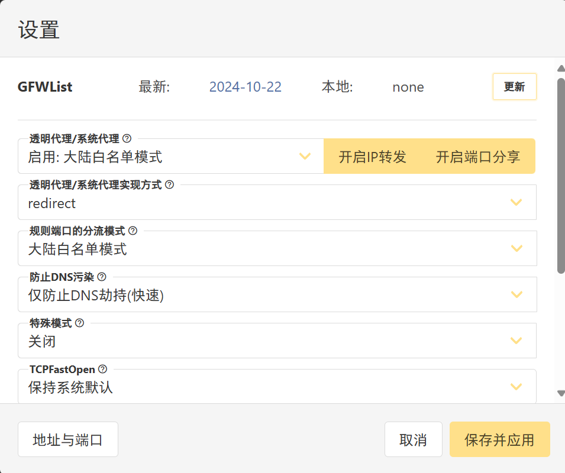

# 方案

> 参考：[岂止NAS？如何DIY一台全能家用服务器？](https://www.bilibili.com/video/BV1Ng4y1t7FS)、[让NAS永不boom！AIO下PVE的全自动备份攻略](https://www.bilibili.com/video/BV1Dm4y1B7pM)、[【NAS】一台小 NAS 可以有多强？自组8盘位全固态、万兆、一机两开的AMD平台多功能ALL IN ONE主机](https://www.bilibili.com/video/BV1wM4y1x7TU) 

## 硬件方案

- 机箱：迎广MS04。4个3.5寸硬盘位，可扩展至六盘位（其中至少一个为2.5寸）。支持 1U Flex 电源，ITX主板。整体尺寸比较小
- 电源：台达250瓦全模组Flex小1U电源。全模组方便更换电源线
    - 本来想着装企业级机械硬盘 && 为之后留余量，后面发现其实200瓦的就够了
    - 注意：小电源的价格基本上是一元一瓦，那种几十块钱能买200瓦的都是垃圾电源，具体见网上的各种解析
    - 以上两个购买地址：淘宝 搜索 优易科技公司，机箱价格399，电源价格267，外加40元运费，总计706
- 主板：微星 B450I GAMING PLUS AC，ITX尺寸
- CPU：AMD R5 5600G，6核12线程，核显比较强
- 内存：32GB + 16GB，主板有两个内存插槽
    - 以上配件拆自我的ITX，价格大概1500
- 硬盘： M.2固态（1T + 2T） ，SATA固态（1T），SATA机械（4T\*2）
    - 后续扩展硬盘，优先加2T的SATA固态
    - 硬盘没敢捡垃圾，都是买全新的。固态挑TLC颗粒的应该就好（京东自营或者其他平台的旗舰店），机械参考的[这个视频](https://www.bilibili.com/video/BV1yd2iYPEY8)，在拼多多上买的海康威视的机械硬盘
- OcuLink显卡扩展坞：开源宇宙的显卡坞母板 以及 支架，然后使用我的ITX上拆下来的SFX电源（需要使用SFX转ATX转接板才能安装）
- M.2 转 OcuLink 转接卡：我从PCIE转接出的M.2接口是朝向机箱内部的，需要买带延长线的M.2 转 OcuLink 转接卡，而且安装的时候需要把延长线对折一下
    - 购买地址：淘宝搜索 开源宇宙oculink显卡坞企业店（价格比他们另外一家店铺 开源宇宙GPU服务器工厂 便宜）
- PCIE转4盘位M.2阵列卡：我的主板只有一个PCIE插槽（带宽16x）和一个M.2接口。而oculink的带宽为4x，直接用PCIE转OcuLink的话会浪费12x的带宽。此外，我的CPU和主板支持PCIE拆分（拆分成8x+8x，或者8x+4x+4x），为了不浪费 PCIE的带宽，就选择进行拆分
    - 购买地址：淘宝 佳翼旗舰店，99块钱那款。实际使用中只有1、3、4号位置的M.2接口可以使用，而且1号位置带宽为8x，3、4号为4x
    - 我买的阵列卡的 M.2接口
- M.2转SATA扩展卡：为了后续实现纯机械NAS，需要把SATA controller直通给NAS（这样只有这个NAS启动后，机械才会通电）。大部分的家用主板都只有一个SATA controller（对应多个SATA接口），因此需要M.2转SATA扩展卡。
    - 因为我目前只需要两个机械硬盘，所以买的是M.2转2口SATA扩展卡
    - 购买地址：淘宝 天机电脑企业店

## 硬件优化

- 目前硬件方案的问题
    - 为了兼容现有的硬件，使用的ITX主板的扩展性非常差，用了很多的转接板，非常不优雅。而且ITX主板、1U电源、SFX电源、各种转接板的价格并不便宜。
    - 标准OcuLink使用的是PCIE 4.0 * 4x的带宽，目前的主板和 CPU 只支持 PCIE 3.0，一定程度上会降低外接显卡的性能
- 后续考虑使用MATX的主板，要求
    - 有2条PCIE插槽，支持PCIE 4.0，而且其中一条支持拆分
    - M.2接口越多越好（因为同容量的M.2固态比SATA便宜 && 快速）
    - 有2.5G有线网口和Type-C接口
- 机箱可以选御夫座6盘位机箱，电源换成ATX电源

## 软件方案

- 底层PVE，虚拟机中跑各种系统
- 一个虚拟机跑OpenWRT，作为旁路网关，负责代理（其他设备把网关填成OpenWRT的IP就可以走代理
- 一个虚拟机跑Windows，负责游戏、软件处理等任务
- 一个虚拟机跑Ubuntu，负责主力开发，图形界面选的是xfce（更轻量，适合远程，此外gnome远程一直有点问题）
- 一个虚拟机跑fnos，作为固态NAS，日常开机
- 一个虚拟机跑TrueNAS，作为机械NAS，负责冷备份，一周或者半个月开一次机
- 一个虚拟机跑Proxmox Backup Server (PBS)，负责备份虚拟机到机械NAS中

# 安装

## 主板设置

- 由于我买的PCIE转4个M2的转接卡，需要在MSI B450I主板的BIOS中，设置 高级=>PCIe=>PCI子系统设备=>PCI_E1 Lanes Configuration=>x8+x4+x4
- 主板中开启VT虚拟化技术：以MSI B450i为例，Overclocking settings(OC) =>高级CPU配置=>SVM Mode，设置为允许
- 主板中关闭secure boot：以MSI B450i为例，Settings=>高级=>Windows操作系统的配置=>安全启动，设置为禁止
- 主板设置来电自启：以MSI B450i为例，Settings=>高级=>电源管理设置=>AC电源掉电再来电的状态，设置为开机
- 主板设置wol：以MSI B450i为例，Settings=>高级=>唤醒事件设置=>PCIE设备唤醒，设置为允许
- 主板设置省电模式：以MSI B450i为例，Settings=>高级=>电源管理设置=>ErR Ready

## Proxmox Virtual Environment (PVE)

> [利用PVE虚拟机，来打造属于自己的All In One系统吧！](https://www.bilibili.com/video/BV1bc411v7A3)

- 镜像下载：[Download Proxmox software, datasheets, agreements](https://www.proxmox.com/en/downloads)

- 中科大镜像源：

    - Debian：[LUG's repo file generator (ustc.edu.cn)](https://mirrors.ustc.edu.cn/repogen/)，PVE 8.0.3对应Debian 12（代号bookworm）
    - PVE：[Proxmox - USTC Mirror Help](https://mirrors.ustc.edu.cn/help/proxmox.html)

- [ivanhao/pvetools](https://github.com/ivanhao/pvetools)：工具集

- 减少硬盘容量：https://www.mayanpeng.cn/archives/158.html

- [设置wol](https://wiki.archlinux.org/title/Wake-on-LAN)：`apt install ethtool`，然后在`/etc/systemd/system/ `下创建wol.service文件，内容为

  ```bash
  [Unit]
  Description=Wake-on-LAN for enp37s0
  Requires=network.target
  After=network.target
  
  [Service]
  ExecStart=/usr/sbin/ethtool -s enp37s0 wol g
  Type=oneshot
  
  [Install]
  WantedBy=multi-user.target
  ```
  
  然后运行`systemctl enable wol.service`以开机自启
  
- 自动切换显卡直通：创建.sh脚本

    ```bash
    #!/bin/bash
    conf_dir=/etc/pve/qemu-server/
    win_id=101
    ubuntu_id=102
    win_w_gpu=win.w.gpu
    win_wo_gpu=win.wo.gpu
    ubuntu_w_gpu=ubuntu.w.gpu
    ubuntu_wo_gpu=ubuntu.wo.gpu
    
    # 检查虚拟机是否在运行
    running=0
    if [ -z "$(pvesh get /cluster/resources|grep $win_id|grep stopped)" ]; then
      echo "[INFO] win is running, cannot switch"
      running=1
    fi
    if [ -z "$(pvesh get /cluster/resources|grep $ubuntu_id|grep stopped)" ]; then
      echo "[INFO] ubuntu is running, cannot switch"
      running=1
    fi
    if [ $running -eq 1 ]; then
      exit
    fi
    
    cd $conf_dir
    nvidia_info=$(lspci -vnn | grep NVIDIA);
    if [ -z "$nvidia_info" ]; then
      echo "[WARNING] no the nvidia GPU"
      cp -f $win_wo_gpu $win_id.conf
      cp -f $ubuntu_wo_gpu $ubuntu_id.conf
    elif [[ "$1" == "w" || "$1" == "W" ]]; then  # 手动指定显卡直通给win
      echo "[INFO] give the nvidia GPU to windows"
      cp -f $win_w_gpu $win_id.conf
      cp -f $ubuntu_wo_gpu $ubuntu_id.conf
    elif [[ "$1" == "l" || "$1" == "L" ]]; then  # 手动指定显卡直通给Ubuntu
      echo "[INFO] give the nvidia GPU to ubuntu"
      cp -f $win_wo_gpu $win_id.conf
      cp -f $ubuntu_w_gpu $ubuntu_id.conf
    else                                         # 默认都不直通显卡
      echo "[INFO] no one gives the nvidia GPU to none"
      cp -f $win_wo_gpu $win_id.conf
      cp -f $ubuntu_wo_gpu $ubuntu_id.conf
    fi
    cd -
    ```

    然后在`/etc/systemd/system/ `下创建select_gpu.service文件，内容为

    ```bash
    [Unit]
    Description=auto select gpu for vm
    
    [Service]
    ExecStart=bash /root/select_gpu.sh
    Type=oneshot
    
    [Install]
    WantedBy=multi-user.target
    ```

    然后运行`systemctl enable select_gpu.service`以开机自启

- 添加sudo的alias：编辑`/root/.bashrc`，添加

    ```bash
    alias sudo=''
    ```

- 自动冷备：创建如下脚本

    ```bash
    #!/bin/bash
    log_file=/root/auto_backup.log
    TrueNAS_id=105
    TrueNAS_store=storage/orz/TrueNAS_PBS
    PBS_id=106
    PBS_store=storage/orz/PBS
    wait_min=5                                # 等待时间，单位min
    backup_vid=(100 101 102 103 104)
    # 检测剩余内存(单位GB)，直到满足要求
    need_mem=14
    while true ; do
      left_mem=$(free -m|grep Mem|awk '{printf int($4/1024) "\n"}')
      if [ $need_mem -gt $left_mem ];then
        echo "[WARNING] [$(date)] left memory $left_mem GB < need mem $need_mem GB, wait for $wait_num min" >> $log_file
        sleep "$wait_min"m
      else
        echo "[INFO] [$(date)] left memory $left_mem GB > need mem $need_mem GB" >> $log_file
        break
      fi
    done
    # 启动TrueNAS
    qm start $TrueNAS_id
    # 保证TrueNAS_PBS存储在线
    while true; do
      if [ -z "$(pvesh get /cluster/resources|grep $TrueNAS_store|grep available)" ]; then
        echo "[WARNING] [$(date)] $TrueNAS_store is not available, wait for $wait_num min" >> $log_file
        sleep "$wait_min"m
      else
        echo "[INFO] [$(date)] $TrueNAS_store is available" >> $log_file
        break
      fi
    done
    # 启动PBS
    qm start $PBS_id
    # 保证PBS存储在线
    while true; do
      if [ -z "$(pvesh get /cluster/resources|grep $PBS_store|grep available)" ]; then
        echo "[WARNING] [$(date)] $PBS_store is not available, wait for $wait_num min" >> $log_file
        sleep "$wait_min"m
      else
        echo "[INFO] [$(date)] $PBS_store is available" >> $log_file
        break
      fi
    done
    # 开始一个个备份
    for id in ${backup_vid[@]}; do
      echo "[INFO] [$(date)] begin to backup vid=$id" >> $log_file
      # 如下命令的参数来自/etc/pve/jobs.cfg
      vzdump $id                                \
            --fleecing 0                        \
            --mailnotification always           \
            --mailto silence_33_@outlook.com    \
            --mode stop                         \
            --notes-template '{{guestname}}'    \
            --prune-backups keep-last=5         \
            --storage PBS                       \
            --all 0 >>  $log_file
        echo "[INFO] [$(date)] vid=$id backup finished" >> $log_file
    done
    echo "[INFO] [$(date)] all backup finished" >> $log_file
    # 关闭PBS和TrueNAS
    qm stop $PBS_id
    sleep 2m
    qm stop $TrueNAS_id
    ```

    配置anacron：`apt install anacron`，编辑/etc/anacrontab，添加如下内容，表示每十天执行一次备份

    ```bash
    10      10      cron.auto_back  bash /root/auto_backup.sh 
    ```

    

    > 参考：[vzdump命令](https://pve.proxmox.com/pve-docs/vzdump.1.html)、[『学了就忘』Linux系统定时任务 — 89、任务调度工具anacron - 繁华似锦Fighting - 博客园 (cnblogs.com)](https://www.cnblogs.com/liuyuelinfighting/p/15721568.html)

- 自动添加代理：在/root/.bashrc中添加如下内容

    ```bash
    IP="192.168.1.2"
    port=7890
    # 使用nc命令检查端口
    if nc -z -w 5 $IP $port &> /dev/null; then
        echo "Port $port on IP $IP is open"
        export http_proxy=http://$IP:$port
        export https_proxy=http://$IP:$port
    else
        echo "Port $port on IP $IP is not open"
    fi
    ```

    

# 虚拟机

- CPU要选择host。有必要的话，绑定CPU核心，即在“CPU绑定”中填写类似`0-11,14,15`
- 硬盘要选择SSD仿真，缓存选writeback

## OpenWrt

- 镜像下载：[Index of /releases/23.05.5/targets/x86/64/ (openwrt.org)](https://downloads.openwrt.org/releases/23.05.5/targets/x86/64/)
    - 选择**ext4-combined.img.gz**结尾的，说明在[这儿](https://openwrt.org/docs/guide-user/installation/openwrt_x86)

- 创建虚拟机：~~[【利用PVE虚拟机，来打造属于自己的All In One系统吧！】 【精准空降到 05:47】]( https://www.bilibili.com/video/BV1bc411v7A3/?share_source=copy_web&vd_source=31f11ba822b8d6c2d924c85d5b2cba06&t=347)~~、[PVE 安装 OpenWrt 作为旁路由 - 冰棒实验室 (beanbang.cn)](https://blog.beanbang.cn/2023/11/26/pve-install-openwrt-as-secondary-router/)、[ProxmoxVE（PVE）安装OpenWRT系统（旁路由模式）_pve安装openwrt-CSDN博客](https://blog.csdn.net/sunky7/article/details/138198347)

    - 创建虚拟机的时候，不要添加磁盘

    - 挂载镜像使用如下命令，然后挂载的时候扩容4个G

        ```bash
        qm importdisk 100 /var/lib/vz/template/iso/openwrt-23.05.5-x86-64-generic-ext4-combined.img local-lvm
        ```

    - 再通过GParted 镜像，把新增的4G分给rootfs

    - 记得到启动项中把硬盘放在第一个

    ```
    boot: order=scsi1;ide2;net0
    cores: 2
    cpu: host
    ide2: none,media=cdrom
    machine: q35
    memory: 2048
    meta: creation-qemu=8.1.5,ctime=1729943126
    name: OpenWrt
    net0: virtio=xx:xx:xx:xx:xx:xx,bridge=vmbr0,firewall=1
    numa: 0
    onboot: 1
    ostype: l26
    scsi1: local-lvm:vm-100-disk-1,iothread=1,size=4220M,ssd=1
    scsihw: virtio-scsi-single
    smbios1: uuid=xxxxxxxx-xxxx-xxxx-xxxx-xxxxxxxxxxxx
    sockets: 1
    startup: order=1
    vmgenid: xxxxxxxx-xxxx-xxxx-xxxx-xxxxxxxxxxxx
    ```

- 修改IP：编辑/etc/config/network，然后重启网络`service network restart`

    - NOTE: 如果连不了外网，可能是网关获取不对，把`option proto `从static改成dhcp，再运行命令

- [更换中科大镜像源](https://mirrors.ustc.edu.cn/help/openwrt.html)

    ```bash
    sed -i 's/downloads.openwrt.org/mirrors.ustc.edu.cn\/openwrt/g' /etc/opkg/distfeeds.conf
    ```

- [切换中文](https://blog.beanbang.cn/2023/11/26/pve-install-openwrt-as-secondary-router)：

    ```c++
    opkg install luci-i18n-base-zh-cn
    opkg install luci-i18n-firewall-zh-cn
    ```

- [更换主题](https://blog.csdn.net/sunky7/article/details/138198347)：`opkg install luci-compat luci-lib-ipkg`，然后下载主题（.ipk格式，比如[这个](https://github.com/jerrykuku/luci-theme-argon/releases/download/v2.2.9.4/luci-theme-argon-master_2.2.9.4_all.ipk)）通过software upload package就可以了，默认上传直接生效

- [安装OpenClash](https://github.com/vernesong/OpenClash/wiki/%E5%AE%89%E8%A3%85)：

    - 允许如下命令查看openwrt用的是iptables还是nftables，大概率是nftables

        ```bash
        opkg list-installed | grep -E 'iptables|nftables'
        ```

    - 安装依赖

        ```bash
        opkg update
        # iptables
        opkg install coreutils-nohup bash iptables dnsmasq-full curl ca-certificates ipset ip-full iptables-mod-tproxy iptables-mod-extra libcap libcap-bin ruby ruby-yaml kmod-tun kmod-inet-diag unzip luci-compat luci luci-base
        # nftables
        opkg install coreutils-nohup bash dnsmasq-full curl ca-certificates ip-full libcap libcap-bin ruby ruby-yaml kmod-tun kmod-inet-diag unzip kmod-nft-tproxy luci-compat luci luci-base
        ```

    - 下载[.ipk文件](https://github.com/vernesong/OpenClash/releases)，上传到openwrt

        ```bash
        opkg install ./luci-app-openclash_0.33.7-beta_all.ipk
        ```

    - 到openwrt的网页后台，服务=>OpenClash，即为OpenClash的管理界面

    - 下载内核？：

    - 添加订阅：OpenClash的管理界面，配置订阅=>添加

- ~~[安装v2raya](https://v2raya.org/docs/prologue/installation/openwrt/)~~：

    ```bash
    opkg update
    opkg install luci-i18n-v2raya-zh-cn v2ray-geoip v2ray-geosite
    
    uci set v2raya.config.enabled='1'
    uci commit v2raya
    /etc/init.d/v2raya enable
    /etc/init.d/v2raya start
    ```

    

## Windows

> [【利用PVE虚拟机，安装Windows和Linux系统，并优化配置】 【精准空降到 00:57】](https://www.bilibili.com/video/BV1vU421Z7RH/?share_source=copy_web&vd_source=31f11ba822b8d6c2d924c85d5b2cba06&t=57)

- 创建虚拟机

    ```
    affinity: 0-11
    agent: 1
    args: -cpu 'host,+kvm_pv_unhalt,+kvm_pv_eoi,hv_vendor_id=NV43FIX,kvm=off'
    bios: ovmf
    boot: order=scsi0;net0
    cores: 12
    cpu: host,hidden=1,flags=+pcid
    efidisk0: local-lvm:vm-101-disk-0,efitype=4m,pre-enrolled-keys=1,size=4M
    machine: pc-q35-5.1
    memory: 16384
    meta: creation-qemu=8.1.5,ctime=1728655711
    name: Windows
    net0: virtio=xx:xx:xx:xx:xx:xx,bridge=vmbr0,firewall=1
    numa: 0
    ostype: win11
    scsi0: local-lvm:vm-101-disk-1,cache=writeback,iothread=1,size=512G,ssd=1
    scsihw: virtio-scsi-single
    smbios1: uuid=xxxxxxxx-xxxx-xxxx-xxxx-xxxxxxxxxxxx
    sockets: 1
    tpmstate0: local-lvm:vm-101-disk-2,size=4M,version=v2.0
    vga: virtio
    vmgenid: xxxxxxxx-xxxx-xxxx-xxxx-xxxxxxxxxxxx
    ```

- virtual io驱动下载：https://pve.proxmox.com/wiki/Windows_VirtIO_Drivers#Installation

- 独显直通：

    - 使用pvetools，虚拟机的conf的文件（在`/etc/pve/qemu-server/`目录下）中添加如下内容，虚拟机的机型选择q35（版本号应该任意，这里选的是[3.1](https://blog.moper.net/2909.html)，我自己选的是5.1）

        ```c++
        cpu: host,hidden=1,flags=+pcid
        args: -cpu 'host,+kvm_pv_unhalt,+kvm_pv_eoi,hv_vendor_id=NV43FIX,kvm=off'
        ```

    - 在GPU的PCI设备的配置中，勾选"所有功能"和"PCI-Express"

        

- [动态内存](https://bolg.wltechlab.top/archives/1243)：

    - 虚拟机-硬件-内存-勾选 `Ballooning设备`
    - 然后安装VirtIO Balloon驱动，在 guest-agent 文件夹中，安装qemu-ga-x86_64.exe
    - 最后，虚拟机-选项-QEMU Guest Agent-勾选 `使用 QEMU Guest Agent`

- 内存占用异常：

    - 现象：刚开机的时候内存只占用10%左右，但是用一会儿（比如刷b站）后内存占用涨到80%左右；看任务管理器，没有一个进程占用这么多内存；使用RamMap工具，发现Driver Locked这一项占用60%左右的内存
    - 原因：[开启直通后不能使用动态内存](https://www.right.com.cn/forum/thread-8380789-1-1.html)
    - 解决方法：虚拟机=>选项=>QEMU Guest Agent，取消勾选`使用QEMU Guest Agent`；虚拟机=>硬件=>内存，取消勾选 `Ballooning设备`。不需要将win中安装的驱动卸载


## Linux

- 安装虚拟机

    ```
    affinity: 0-11
    agent: 1
    balloon: 8196
    bios: ovmf
    boot: order=scsi0;net0
    cores: 12
    cpu: host
    efidisk0: local-lvm:vm-102-disk-1,efitype=4m,pre-enrolled-keys=1,size=4M
    machine: q35
    memory: 20480
    meta: creation-qemu=8.1.5,ctime=1733547556
    name: Ubuntu
    net0: virtio=xx:xx:xx:xx:xx:xx,bridge=vmbr0,firewall=1
    numa: 0
    ostype: l26
    scsi0: local-lvm:vm-102-disk-0,cache=writeback,iothread=1,size=512G,ssd=1
    scsihw: virtio-scsi-single
    smbios1: uuid=xxxxxxxx-xxxx-xxxx-xxxx-xxxxxxxxxxxx
    sockets: 1
    vmgenid: xxxxxxxx-xxxx-xxxx-xxxx-xxxxxxxxxxxx
    ```
    
- [动态内存](https://bolg.wltechlab.top/archives/1243)：[开启直通后不能使用动态内存](https://www.right.com.cn/forum/thread-8380789-1-1.html)

    - 虚拟机=>硬件=>内存=>勾选 `Ballooning设备`，`最小内存(MiB)`根据自己需求选择

    - [在虚拟机中安装qemu-guest-agent](https://blog.xm.mk/posts/0d5a/) ：根据 [PVE 的文档](https://pve.proxmox.com/wiki/Qemu-guest-agent)，qemu-guest-agent 是一个安装在客户机中的辅助守护程序，用于在宿主机和客户机之间交换信息，并在客户机中执行命令。

        ```bash
        # 安装
        apt install qemu-guest-agent
        # 启动
        systemctl start qemu-guest-agent
        # 设置开机自动运行
        systemctl enable qemu-guest-agent
        ```

        > 在 Proxmox VE 中，qemu-guest-agent 主要用于三个方面：
        >
        > - 用于正确地关闭客户机，而不是依赖于 ACPI 命令或 Windows 策略。
        > - 在进行备份 / 快照时冻结客户机的文件系统（在 Windows 上，使用卷影复制服务 VSS）。如果启用了客户机代理并且它正在运行，它会调用 guest-fsfreeze-freeze 和 guest-fsfreeze-thaw 来提高一致性。
        > - 在客户机（虚拟机）暂停后恢复（例如在快照之后）的阶段，它会立即使用 qemu-guest-agent 与超级管理程序同步时间（作为第一步）。

    - 最后，虚拟机=>选项=>QEMU Guest Agent-勾选 `使用 QEMU Guest Agent`


- 连接固态NAS的NFS

    - 手动连接：``。如果没有mount.nfs4，则``

        ```bash
        sudo apt install nfs-common
        sudo mount.nfs4  192.168.1.222:/vol1/1000/TestDir/mnt
        ```

        

    - 自动连接：

        - 【似乎无效】方法一：编辑/etc/fstab，添加如下内容
        
            ```bash
            192.168.1.222:/vol1/1000/TestDir	/mnt	nfs	defaults	0	0
            ```
        
        - 方法二：创建文件`/etc/systemd/system/mount-nfs4.service`，添加如下内容，然后**给文件加可执行权限**
        
            ```bash
            [Unit]
            Description=auto mount nfs4
            Requires=network.target
            After=network.target
            
            [Service]
            ExecStart=/usr/sbin/mount.nfs4 192.168.50.103:/vol1/1000/Daily /mnt
            Type=oneshot
            
            [Install]
            WantedBy=multi-user.target
            ```
        
            > 注意：命令不能直接填mount.nfs4，因为环境变量可能还没加载好
        
            然后运行`systemctl enable mount-nfs4.service`以开机自启
        
            
        

    

## Android X86

- 镜像下载：[Download | Android-x86](https://www.android-x86.org/download)，选择android-x86_64-9.0-r2.iso，不要带k49的

- 官方安装教程：[Installation Howto | Android-x86](https://www.android-x86.org/installhowto.html)

- 三方教程：[pve安装android-x86系统 - 小鸣的Blog (dgpyy.com)](https://www.dgpyy.com/archives/235/)、[佛西博客 - PVE 安装安卓Android X86 并添加arm兼容库 (buduanwang.vip)](https://foxi.buduanwang.vip/linux/1996.html/)、https://linkzz.org/posts/android-x86-pve/#11

    - 推荐使用Advance options => Android-x86 9.0-r2 Auto Install to specified harddisk 进行安装，简单的很

- 安装虚拟机

    ```
    audio0: device=ich9-intel-hda,driver=none
    bios: ovmf
    boot: order=scsi0;net0
    cores: 10
    cpu: host
    efidisk0: local-lvm:vm-104-disk-0,efitype=4m,pre-enrolled-keys=1,size=4M
    machine: q35
    memory: 8192
    meta: creation-qemu=8.1.5,ctime=1728918574
    name: Android-x86
    net0: virtio=xx:xx:xx:xx:xx:xx,bridge=vmbr0,firewall=1
    numa: 0
    ostype: l26
    scsi0: local-lvm:vm-104-disk-1,iothread=1,size=64G,ssd=1
    scsihw: virtio-scsi-single
    smbios1: uuid=xxxxxxxx-xxxx-xxxx-xxxx-xxxxxxxxxxxx
    sockets: 1
    vga: virtio-gl
    vmgenid: xxxxxxxx-xxxx-xxxx-xxxx-xxxxxxxxxxxx
    ```
    
- ARM兼容库：[GitHub - SGNight/Arm-NativeBridge: ARM translation layer for Android x86](https://github.com/SGNight/Arm-NativeBridge?tab=readme-ov-file)

    - 把下载的houdini.sfs重命名为houdini9_y.sfs，然后用adb（默认打开）推送到虚拟机上

        ```bash
        .\adb.exe push ./houdini.sfs /sdcard/
        ```

    - 启用

        ```bash
        mkdir -p /data/arm
        cp /sdcard/houdini9_y.sfs /data/arm/
        enable_nativebridge
        ```

    - 如果报错如下内容，不用管

        ```bash
        modprobe: /etc/modprobe.conf: No such file or directory
        modprobe: /etc/modprobe.d: No such file or directory
        ```

## MacOS

- 三方教程：[PVE环境安装macOS苹果系统通用入门级教程(在 Proxmox 8 上安装Install macOS Sonoma 14) - 黑苹果屋 (imacos.top)](https://imacos.top/2023/07/29/pve-macos/)、[【利用PVE虚拟机，安装黑群晖和黑苹果，All In One运行5个系统】 【精准空降到 06:30】](https://www.bilibili.com/video/BV1o4421w7hf/?share_source=copy_web&vd_source=31f11ba822b8d6c2d924c85d5b2cba06&t=390) 、[PVE安装MacOS 14-珂珂的个人博客 - 一个程序猿的个人网站 (kecq.com)](https://kecq.com/artic-17333798.html)
- openCore引导：[Releases · thenickdude/KVM-Opencore (github.com)](https://github.com/thenickdude/KVM-Opencore/releases) 

## fnos

- 安装虚拟机

    ```
    boot: order=scsi0;ide2;net0
    cores: 8
    cpu: host
    hostpci1: 0000:29:00
    hostpci2: 0000:2a:00
    ide2: local:iso/fnos.0.8.20-394_20241008.iso,media=cdrom,size=1680M
    memory: 4096
    meta: creation-qemu=8.1.5,ctime=1728657255
    name: fnOS
    net0: virtio=xx:xx:xx:xx:xx:xx,bridge=vmbr0,firewall=1
    numa: 0
    onboot: 1
    ostype: l26
    scsi0: local-lvm:vm-103-disk-0,iothread=1,size=64G,ssd=1
    scsihw: virtio-scsi-single
    smbios1: uuid=xxxxxxxx-xxxx-xxxx-xxxx-xxxxxxxxxxxx
    sockets: 1
    startup: order=10,down=30
    vmgenid: xxxxxxxx-xxxx-xxxx-xxxx-xxxxxxxxxxxx
    ```
    
- 配置nfs：编辑`/etc/exports`，添加如下内容，其中192.168.1.111是允许访问的IP。然后到UI界面=>设置=>文件共享协议=>NFS，开启

    ```bash
    /vol1/1000/TsetDir 192.168.1.111(rw,async,no_wdelay,insecure,no_root_squash,no_subtree_check)
    ```

    > - rw：读写权限
    > - async：异步方式存储数据，可以提高性能
    > - no_wdelay：开启async的情况下，改参数不起作用
    > - insecure：允许客户端使用1024以上的端口
    > - 用户ID映射的选项：
    >     - root_squash：将文件权限的root（uid/gid为0）映射为anonymous
    >     - no_root_squash：关闭root_squash，通常用于diskless clients
    > - no_subtree_check：禁用subtree checking，可能轻微影响安全，但是某些情况下可以增加可靠性
    >
    > 具体参数的解释见[官网](https://linux.die.net/man/5/exports)
    
- 安装syncthing：和异地NAS使用公网IPV6直连

    - 操作=>设置=>连接=>同步协议监听地址，填“default, tcp6://:22000”
    - 远程设备=>选择异地NAS=>编辑=>高级=>地址，填“tcp6://xxxx.xxxx.xxx:22000”

    > 记得到路由器的IPV6防火墙中允许22000端口通过

## DSM

- rr版本DSM镜像：[【2024年9月1日更新】黑群晖DSM7.21/DSM7.22的引导 | OPENOS-服务器-路由器-黑群晖-NAS-网络存储-虚拟化](https://www.openos.org/threads/202491dsm7-21-dsm7-22.3529/)（下载地址[黑群晖 | GXNAS网盘](https://d.gxnas.com/GXNAS网盘-OneDrive/黑群晖)）
- 三方教程：[PVE安装黑群晖DSM7虚拟机及直通设置 – MSTG-Blog](https://blog.mstg.top/archives/762)
- 设置virtto-gl：
    - `apt install libgl1 libegl1`
    - 如果之前用pvetools设置了显卡直通，可能是报错TASK ERROR: no DRM render node detected (/dev/dri/renderD*), no GPU? - needed for 'virtio-gl' display，因为显卡直通的时候把所有GPU的驱动都禁用了。编辑**/etc/modprobe.d/pve-blacklist.conf**，删除/注释blacklist radeon和blacklist amdgpu

- [查看硬盘所属的控制器](https://foxi.buduanwang.vip/virtualization/1754.html/)：`ls -la /sys/dev/block/|grep -v loop |grep -v dm`，输出类似如下，`pci0000:00`是Pci桥，`0000:16:00.1`就是硬盘控制器，后面是硬盘的盘号，sdf

    ```bash
    # 下面的情况只有一个sata controller
    root@orz:~# ls -la /sys/dev/block/|grep -v loop |grep -v dm
    total 0
    drwxr-xr-x 2 root root 0 Oct 22 21:32 .
    drwxr-xr-x 4 root root 0 Oct 22 21:32 ..
    lrwxrwxrwx 1 root root 0 Oct 22 21:32 8:0 -> ../../devices/pci0000:00/0000:00:02.1/0000:16:00.1/ata2/host1/target1:0:0/1:0:0:0/block/sda
    lrwxrwxrwx 1 root root 0 Oct 22 21:32 8:1 -> ../../devices/pci0000:00/0000:00:02.1/0000:16:00.1/ata2/host1/target1:0:0/1:0:0:0/block/sda/sda1
    lrwxrwxrwx 1 root root 0 Oct 22 21:32 8:16 -> ../../devices/pci0000:00/0000:00:02.1/0000:16:00.1/ata5/host4/target4:0:0/4:0:0:0/block/sdb
    lrwxrwxrwx 1 root root 0 Oct 22 21:32 8:2 -> ../../devices/pci0000:00/0000:00:02.1/0000:16:00.1/ata2/host1/target1:0:0/1:0:0:0/block/sda/sda2
    lrwxrwxrwx 1 root root 0 Oct 22 21:32 8:3 -> ../../devices/pci0000:00/0000:00:02.1/0000:16:00.1/ata2/host1/target1:0:0/1:0:0:0/block/sda/sda3
    lrwxrwxrwx 1 root root 0 Oct 22 21:32 8:32 -> ../../devices/pci0000:00/0000:00:02.1/0000:16:00.1/ata6/host5/target5:0:0/5:0:0:0/block/sdc
    # 下面的情况有2个sata controlleroot@orz:~# ls -la /sys/dev/block/|grep -v loop |grep -v dm
    total 0
    drwxr-xr-x 2 root root 0 Oct 25 21:42 .
    drwxr-xr-x 4 root root 0 Oct 25 21:42 ..
    lrwxrwxrwx 1 root root 0 Oct 25 21:42 8:0 -> ../../devices/pci0000:00/0000:00:01.2/0000:12:00.0/ata2/host1/target1:0:0/1:0:0:0/block/sda
    lrwxrwxrwx 1 root root 0 Oct 25 21:42 8:16 -> ../../devices/pci0000:00/0000:00:02.1/0000:16:00.1/ata7/host6/target6:0:0/6:0:0:0/block/sdb
    lrwxrwxrwx 1 root root 0 Oct 25 21:42 8:17 -> ../../devices/pci0000:00/0000:00:02.1/0000:16:00.1/ata7/host6/target6:0:0/6:0:0:0/block/sdb/sdb1
    lrwxrwxrwx 1 root root 0 Oct 25 21:42 8:18 -> ../../devices/pci0000:00/0000:00:02.1/0000:16:00.1/ata7/host6/target6:0:0/6:0:0:0/block/sdb/sdb2
    lrwxrwxrwx 1 root root 0 Oct 25 21:42 8:19 -> ../../devices/pci0000:00/0000:00:02.1/0000:16:00.1/ata7/host6/target6:0:0/6:0:0:0/block/sdb/sdb3    
    ```

- 加密备份：rclone、duplicati 

## TrueNAS

- 镜像：选择Scale版本（基于debain，Core版本基于FreeDBS）

- 安装：[佛西博客 - PVE+TrueNAS+ZFS+10G内网方案 (buduanwang.vip)](https://foxi.buduanwang.vip/virtualization/pve/1183.html/)、[基于 PVE + TrueNAS 的私有云配置流程 - Pyrokine - 博客园 (cnblogs.com)](https://www.cnblogs.com/Pyrokine/p/14646478.html)、[安装PVE虚拟机并在PVE安装truenas | 故事 (storyxc.com)](https://storyxc.com/tinker/vm/安装PVE虚拟机并在PVE安装truenas.html)
    - 如果开机后不能正常镜像、or 不能正常安装系统，可以 机型选q35，BIOS选UEFI（不添加EFI磁盘）。磁盘类型不一定选SATA
        - 如果不添加EFI磁盘，虚拟机开机的时候可能会报警告`WARN: no efidisk configured! Using temporary efivars disk.`
    - 安装系统的时候如果选的是Adminnistator模式，则后续登录网页的时候，用户名是admin
    
    ```
    balloon: 12288
    bios: ovmf
    boot: order=scsi0;net0
    cores: 4
    cpu: host
    hostpci0: 0000:12:00,pcie=1
    machine: q35
    memory: 16384
    meta: creation-qemu=8.1.5,ctime=1730011251
    name: TrueNAS
    net0: virtio=xx:xx:xx:xx:xx:xx,bridge=vmbr0,firewall=1
    numa: 0
    ostype: l26
    scsi0: local-lvm:vm-105-disk-0,iothread=1,size=16G,ssd=1
    scsihw: virtio-scsi-single
    smbios1: uuid=xxxxxxxx-xxxx-xxxx-xxxx-xxxxxxxxxxxx
    sockets: 1
    vmgenid: xxxxxxxx-xxxx-xxxx-xxxx-xxxxxxxxxxxx
    ```
    
- 修改中文：System Setting => General => Localization

## Proxmox Backup Server (PBS)

- 教程：

    - 数据中心=>存储=>添加=>SMB/CIFS，把固态NAS中的PBS文件夹挂载过来

        - 内容勾上”磁盘映像“，这样才能在创建虚拟机的时候创建磁盘
        - 用别的传输协议应该也可以，但是我尝试使用NFS失败了

        

    - 创建虚拟机：磁盘从local-lvm（pve所在硬盘）分配16G，用于安装PBS系统；再从ssd-nas（刚刚挂载的）分配1024G（按需）

        ```
        boot: order=scsi0;ide2;net0
        cores: 2
        cpu: host
        ide2: local:iso/proxmox-backup-server_3.2-1.iso,media=cdrom,size=1119264K
        machine: q35
        memory: 4096
        meta: creation-qemu=8.1.5,ctime=1729917683
        name: PBS
        net0: virtio=xx:xx:xx:xx:xx:xx,bridge=vmbr0,firewall=1
        numa: 0
        ostype: l26
        scsi0: local-lvm:vm-106-disk-0,iothread=1,size=32G,ssd=1
        scsi2: TrueNAS_PBS:106/vm-106-disk-1.qcow2,iothread=1,size=2T
        scsihw: virtio-scsi-single
        smbios1: uuid=xxxxxxxx-xxxx-xxxx-xxxx-xxxxxxxxxxxx
        sockets: 1
        startup: order=20,up=60,down=30
        vmgenid: xxxxxxxx-xxxx-xxxx-xxxx-xxxxxxxxxxxx
        ```
    
    - 安装PBS：就正常下一步，安装磁盘选16G那个
    
    - PBS中，管理=>存储/磁盘=>ZFS=>创建:ZFS，把刚刚分配的1024G的硬盘选中，假设名称为ZFS1。创建完成后，”数据存储“中会自动多出ZFS1
    
    - PBS中，仪表盘=>显示指纹，复制下来
    
    - 再到PVE中，数据中心=>存储=>添加=>Proxmox Backup Server，Datastore填ZFS1，指纹为刚刚复制的
    
        
    
    - PVE中，数据中心=>备份=>添加，[模式](https://foxi.buduanwang.vip/virtualization/pve/2124.html/) 选停止（先将虚拟机关机，备份完了后自动开机），存储 选刚刚添加的PBS，保留 选
    
        - NOTE：不能备份固态NAS，因为PBS的存储来自
    
    - 测试都没问题后，启用PBS虚拟机的自动开机，必须在固态NAS之后启动，而且最好有延时


# Docker

- [PVE中通过apt安装docker](https://docs.docker.com/engine/install/debian/#install-using-the-repository)

    - [配置代理](https://www.cnblogs.com/Chary/p/18096678)：创建文件夹/etc/systemd/system/docker.service.d，编辑文件/etc/systemd/system/docker.service.d/proxy.conf添加如下内容，

        ```bash
        [Service]
        Environment="HTTP_PROXY=http://192.168.50.100:20172"
        Environment="HTTPS_PROXY=http://192.168.50.100:20172"
        ```

        然后运行命令重启docker

        ```
        systemctl daemon-reload
        systemctl restart docker
        ```

    - 创建网络

        ```bash
        docker network create -d bridge private-network \
        	--ip-range 172.18.0.0/16 	\
        	--subnet 172.18.0.0/16 		\
        	--gateway 172.18.11.11
        ```

        > [docker network create命令 - Docker教程 (yiibai.com)](https://www.yiibai.com/docker/network_create.html)、

- alpine-mariadb：docker-compose.yml如下所示

    ```yaml
    services:
      app:
        image: yobasystems/alpine-mariadb
        hostname: alpine-mariadb
        networks:
          private-network:
            ipv4_address: 172.18.11.12
        restart: always
        env_file: mariadb.env
        volumes:
          - /root/Docker/alpine-mariadb/mysql/:/var/lib/mysql
        ports:
          - '33306:3306'
    
    networks:
      private-network:
        external: true
    ```
    
    其中，mariadb.env内容为
    
    ```
    MYSQL_ROOT_PASSWORD=自定义
    MYSQL_DATABASE=base
    MYSQL_USER=自定义
    MYSQL_PASSWORD=自定义
    ```
    
- [Firefly III](https://www.firefly-iii.org/)：docker-compose.yml如下所示

    ```yaml
    services:
      app:
        image: fireflyiii/core:latest
        hostname: fireflyiii
        networks:
          private-network:
            ipv4_address: 172.18.11.13
        restart: always
        env_file: filrefly.env
        volumes:
          - /root/Docker/firefly_iii/upload/:/var/www/html/storage/upload
          - /root/Docker/firefly_iii/export/:/var/www/html/storage/export
        ports:
          - '7777:8080'
    
    networks:
      private-network:
        external: true
    ```
    
    其中，filrefly.env来自[这里](https://raw.githubusercontent.com/firefly-iii/firefly-iii/main/.env.example)，然后把以下几个变量进行修改
    
    ```bash
    APP_KEY=SomeRandomStringOf32CharsExactly    	  # 自定义，32个字符
    DB_HOST=172.18.11.12						    # mysql的IP地址
    DB_DATABASE=filefly_iii							# mysql中给filefly用的数据库名称
    DB_USERNAME=filefly_iii						    # mysql中给filefly用的用户名
    DB_PASSWORD=plm123,.						    # mysql中给filefly用的用户名对应的密码
    APP_URL=http://127.0.0.1:7777					 # firefly的URL
    ```

- [小雅xiaoya](https://xiaoyaliu.notion.site/xiaoya-docker-69404af849504fa5bcf9f2dd5ecaa75f#6b42128605b841288455a52b8a06bc9f)：

    - [一键部署](https://github.com/monlor/docker-xiaoya?tab=readme-ov-file#%E9%83%A8%E7%BD%B2%E6%88%96%E6%9B%B4%E6%96%B0%E8%84%9A%E6%9C%AC)的命令如下，安装路径为/root/Docker/xiaoyaliu，只安装alist，阿里云和夸克的配置方法见[alist文档](https://alist.nn.ci/zh/guide/drivers/aliyundrive_open.html)
    
        ```bash
        export VERSION=main && bash -c "$(curl -fsSL ${GH_PROXY}https://raw.githubusercontent.com/monlor/docker-xiaoya/${VERSION:-main}/install.sh)"
        ```

    - [手动部署](https://github.com/monlor/docker-xiaoya?tab=readme-ov-file#%E6%89%8B%E5%8A%A8%E9%83%A8%E7%BD%B2)，[docker-compose.yml](https://github.com/monlor/docker-xiaoya/blob/main/docker-compose-alist.yml)如下所示。其中，env来自[这里](https://github.com/monlor/docker-xiaoya/blob/main/env)
    
        ```yaml
        services:
          alist:
            image: ghcr.io/monlor/xiaoya-alist:latest
            volumes:
              - /root/Docker/xiaoyaliu/data/xiaoya:/data
            ports:
              - "5678:5678"
              - "2345:2345"
              - "2346:2346"
            env_file:
              - env
            restart: unless-stopped
            networks:
              - default
        
        networks:
          default:
        ```

    - env文件中，注意以下几个配置
    
        ```bash
        # 自动更新小雅alist文件
        AUTO_UPDATE_ENABLED=true
        # 自动清理阿里云盘
        AUTO_CLEAR_ENABLED=false
        # 是否启用emby
        EMBY_ENABLED=false
        ```
    
    - 运行命令`crontab -e`，添加如下内容，每天重启xiaoya从而更新资源
    
        ```
        30 1 * * * docker restart xiaoyaliu-alist-1
        ```
    
        
    


# 备份

## NAS之间的数据备份

- 备份规则：

    - “本地固态NAS”和“异地机械NAS”存储热数据，“本地机械NAS”存储冷数据

    - 备份方向为 “本地固态NAS=>异地机械NAS” 以及 “本地固态NAS=>本地机械NAS”，前者的备份频率较高（比如一天备份一次），后者较低（比如半个月备份一次）

    - 数据分成三种类型：

        |              | 文件内容                       | 本地固态NAS类型 | 异地机械NAS类型    | 本地机械NAS类型  |
        | ------------ | ------------------------------ | --------------- | ------------------ | ---------------- |
        | 共享数据     | 影视、软件包、学习资料、音乐等 | 仅发送          | 仅接收，忽略删除   | 仅接收，忽略删除 |
        | 个人数据     | 个人照片、文档等               | 发送和接受      | 加密接收           | 发送和接收       |
        | 个人冻结数据 | 长久用不到的个人数据           | 仅发送          | 加密接收，忽略删除 | 仅接收，忽略删除 |

    - “本地固态NAS”容量不够的时候，可以删除部分“共享数据”，也可以将“个人数据”部分转移至“个人冻结数据”，待同步完成后删除

    - 异地机械NAS的共享数据可以专供亲朋好友使用

- 本地固态NAS 配置：

    - 路由器的IPV6防火墙允许22000端口通过
    - syncthing界面，操作=>设置=>连接，同步协议监听地址填"default,tcp://:22000"，开启“启用NAT穿透”、“全局发现”、“本地发现”
    - syncthing界面，添加文件夹时，个人数据的文件夹类型选择 发送和接收，共享数据和个人冻结数据选择 仅发送

- 异地机械NAS 配置：以极空间为例子

    - 路由器的IPV6防火墙允许22000端口通过

    - 首先关闭极空间自带的文档同步功能，因为端口和syncthing冲突（我尝试修改syncthing端口，不能正常工作？）

    - 然后docker部署syncthing，网络选择host，文件夹路径设置如下

        

    - syncthing界面，操作=>设置=>连接，同步协议监听地址填"default,tcp://:22000"，开启“启用NAT穿透”、“全局发现”、“本地发现”

    - syncthing界面，添加文件夹时，个人数据和个人冻结数据的文件夹类型选择 加密接收，共享数据选择 仅接收

    - syncthing界面，操作=>高级=>文件夹，找到所有的个人冻结数据和共享数据的文件夹，勾选"Ignore Delete"

- 本地机械NAS 配置：

    - syncthing界面，操作=>设置=>连接，同步协议监听地址填"default"，只开启“本地发现”
    - syncthing界面，添加文件夹时，个人数据的文件夹类型选择 发送和接收，共享数据和个人冻结数据选择 仅接收
    - syncthing界面，操作=>高级=>文件夹，找到所有的个人冻结数据和共享数据的文件夹，勾选"Ignore Delete"

## docker备份

TODO
