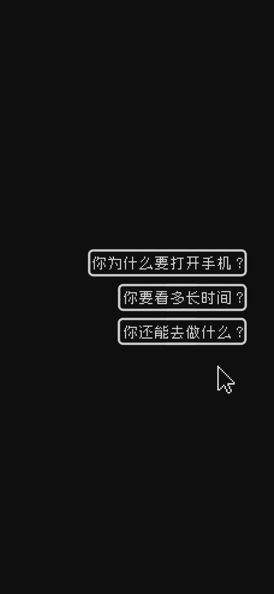

[TOC]

# 设置

- 手机使用时间限制：

    - 整体可用时长：每天1h

    - 应用限额

        - 始终允许：电话、短信、时钟、相机、录音机、备忘录、查找设备、运动健康（手环）、TIM、Forest
        - 限时30min：微信、To Do
        - 限时1min：剩下所有应用

    - 限制背景改为

        

# 必装软件

| 软件名 | 介绍| 软件名      | 介绍|
| :---: | :---: | :---: | :---: |
|[白描](https://baimiao.uzero.cn/)|OTC和文档扫描|[存储空间清理](https://www.coolapk.com/apk/com.ktls.fileinfo)|存储空间清理|
|[慢慢买](http://www.manmanbuy.com/)|查询历史价格&优惠信息|[账号本子](https://www.coolapk.com/apk/com.wei.account)|存储密码|
|[To Do](https://todo.microsoft.com/)| 任务清单 | [SSRR](https://github.com/shadowsocksrr/shadowsocksr-android/releases) | 代理 |
|米家| 远程控制插座（远程开电脑） | Forest | 种树 |
|[调音器和节拍器](https://play.google.com/store/apps/details?id=com.soundcorset.client.android&hl=zh&gl=US)| 练吉他好帮手 | [MX播放器](https://play.google.com/store/apps/details?id=com.mxtech.videoplayer.ad&hl=zh&gl=US) | 视频播放器 |
|全民K歌极速版| 练吉他伴奏 | [Clash for Android](https://github.com/Kr328/ClashForAndroid/releases) | 代理 |
|YOYI| 拍摄定格动画 | iShredder | 删除软件 |
|[zoo for zotero](https://apkpure.com/zoo-for-zotero/com.mickstarify.zooforzotero)| zotero安卓版（[配置](https://blog.csdn.net/OTZ_2333/article/details/128748897)） |  |  |

## Termux

从Google Play Store安装or[直接下载安装包](https://f-droid.org/packages/com.termux/)后，更换[清华镜像](https://mirror.tuna.tsinghua.edu.cn/help/termux/)。
其他必装软件：

```shell
pkg install openssh tmux 
```

python的安装教程参考[这个](https://www.zhihu.com/question/63482921/answer/281232032)（是`xxx-static`，不是`xxx-dev`）