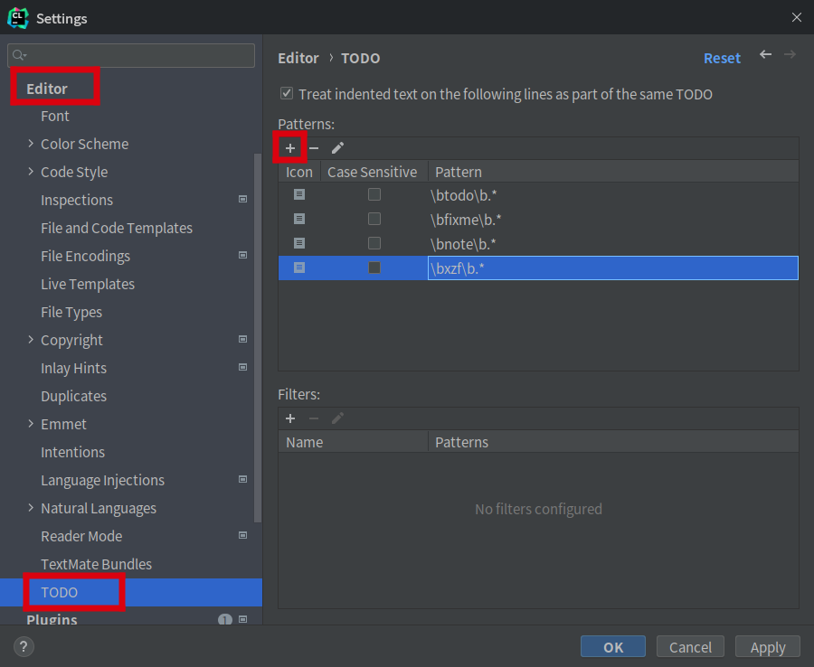
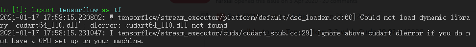

[TOC]


# Edge

- 开启多线程下载：地址栏输入`edge://flags/#enable-parallel-downloading`，选择Enable

- 插件

    | 插件名称            | 简介                                                         | chrome下载连接                                               | edge下载连接                                                 | 官网                                                         |
    | ------------------- | ------------------------------------------------------------ | ------------------------------------------------------------ | ------------------------------------------------------------ | ------------------------------------------------------------ |
    | EpubPress           | 将网页转为电子书格式epub                                     | [EpubPress](https://chrome.google.com/webstore/detail/epubpress-read-the-web-of/pnhdnpnnffpijjbnhnipkehhibchdeok) |                                                              |                                                              |
    | Collamark           | 网页批注                                                     | [Collamark](https://chrome.google.com/webstore/detail/collamark/kbpjikgngikhhpbjddnenemoonpbfikm) |                                                              |                                                              |
    | Forest              | 浏览器种树                                                   | [Forest](https://chrome.google.com/webstore/detail/forest-stay-focused-be-pr/kjacjjdnoddnpbbcjilcajfhhbdhkpgk) |                                                              |                                                              |
    | Tampermonkey        | 脚本使用平台                                                 | [Tampermonkey](https://chrome.google.com/webstore/detail/tampermonkey/dhdgffkkebhmkfjojejmpbldmpobfkfo) | [Tampermonkey](https://microsoftedge.microsoft.com/addons/detail/tampermonkey/iikmkjmpaadaobahmlepeloendndfphd) |                                                              |
    | 沙拉查词            | 划词翻译                                                     | [沙拉查词](https://chrome.google.com/webstore/detail/%E6%B2%99%E6%8B%89%E6%9F%A5%E8%AF%8D-%E8%81%9A%E5%90%88%E8%AF%8D%E5%85%B8%E5%88%92%E8%AF%8D%E7%BF%BB%E8%AF%91/cdonnmffkdaoajfknoeeecmchibpmkmg?hl=zh-CN) | [沙拉查词](https://microsoftedge.microsoft.com/addons/detail/%E6%B2%99%E6%8B%89%E6%9F%A5%E8%AF%8D%E8%81%9A%E5%90%88%E8%AF%8D%E5%85%B8%E5%88%92%E8%AF%8D%E7%BF%BB%E8%AF%91/idghocbbahafpfhjnfhpbfbmpegphmmp) |                                                              |
    | Grammarly           | 英语语法纠正和校对工具                                       | [Grammarly](https://chrome.google.com/webstore/detail/grammarly-for-chrome/kbfnbcaeplbcioakkpcpgfkobkghlhen?hl=zh-CN) | [Grammarly](https://microsoftedge.microsoft.com/addons/detail/grammarly-grammar-checke/cnlefmmeadmemmdciolhbnfeacpdfbkd) |                                                              |
    | Browse Manager      | 网址/域名黑名单、访问次数统计                                | [Browse Manager](https://chrome.google.com/webstore/detail/browse-manager/fibpimjmadkibpjkhlngcapnkkhhikpf) |                                                              | [browse-manager](https://github.com/ZDL-Git/browse-manager)  |
    | Vimium              | 通过键盘控制网页                                             | [Vimium](https://chrome.google.com/webstore/detail/vimium/dbepggeogbaibhgnhhndojpepiihcmeb) | [Vimium C](https://microsoftedge.microsoft.com/addons/detail/vimium-c-%E5%85%A8%E9%94%AE%E7%9B%98%E6%93%8D%E4%BD%9C%E6%B5%8F%E8%A7%88%E5%99%A8/aibcglbfblnogfjhbcmmpobjhnomhcdo) |                                                              |
    | AdGuard 广告拦截器  | 广告拦截                                                     |                                                              | [AdGuard](https://microsoftedge.microsoft.com/addons/detail/adguard-%E5%B9%BF%E5%91%8A%E6%8B%A6%E6%88%AA%E5%99%A8/pdffkfellgipmhklpdmokmckkkfcopbh) | [AdGuard 广告拦截器](https://adguard.com/zh_cn/adguard-browser-extension/overview.html) |
    | uBlacklist          | 可以屏蔽内容农场，黑名单来自[Github](https://github.com/cobaltdisco/Google-Chinese-Results-Blocklist) | [uBlacklist](https://chrome.google.com/webstore/detail/ublacklist/pncfbmialoiaghdehhbnbhkkgmjanfhe) |                                                              |                                                              |
    | Dark Reader         | 网页变成深色模式                                             | [Dark Reader](https://chrome.google.com/webstore/detail/dark-reader/eimadpbcbfnmbkopoojfekhnkhdbieeh) | [Dark Reader](https://microsoftedge.microsoft.com/addons/detail/dark-reader/ifoakfbpdcdoeenechcleahebpibofpc) |                                                              |
    | XDM browser monitor | 下载软件XDM对应的浏览器插件                                  |                                                              | [XDM browser monitor](https://microsoftedge.microsoft.com/addons/detail/xdm-browser-monitor/plohkbgcfpdjhcnoahppkcffaijkadgf) |                                                              |

# VS Code

## 扩展

- [**Markdown All in One**](https://marketplace.visualstudio.com/items?itemName=yzhang.markdown-all-in-one)：超级好用的快捷键、自动补全
- ~~**Markdown PDF**：将Markdown转为PDF（也可以转为jpg、HTML），但是生成的中文字体有点奇怪，而且生成的目录无法跳转~~
- ~~**Markdown TOC**：生成目录。简洁而且可以在Markdown PDF生成的PDF中也可以使用。~~
- ~~[**Markdown Preview Enhanced**](https://shd101wyy.github.io/markdown-preview-enhanced/#/zh-cn/)：可以生成目录、转换为PDF、以及有漂亮的预览~~
- **TabNine**：我觉得超级好用的自动补全软件
- **Python**：直接运行python文件（不需要扩展Code Runner），然后不需要手动配置python的路径了，好像会自动配置的（我已经安装了anaconda，而且添加到环境变量里面了）
- **C/C++**：编译C/C++，但是好像不能运行（具体的有点混，搞不清楚）
- **Code Runner**：配合扩展C/C++来运行C/C++的程序
- **CMake**：可以自动补全CMake相关的代码
- **Remote - SSH**：远程调试代码全家桶
- **Remote Development**：远程调试代码全家桶
- **Remote - Containers**：远程调试代码全家桶
- **Remote - SSH: Editing Configuration Files**：远程调试代码全家桶
- **Remote - WSL**：用来跟WSL互动
- **Anaconda Extension Pack**：可以切换Anaconda的虚拟环境
- **Chinese (Simplified) Language Pack for Visual Studio Code**：中文有时候还是用得到的吧

## 配置

- [显示限宽提示线or修改限宽]( https://www.zhihu.com/question/61341938/answer/186940141)：`setting=>editor.rulers`，内容设置成[80]

- 使用谷歌代码风格：`setting=>Clang_format_fallback Style`，内容改成`Google`

- 终端字体间隔过大：`setting=>Terminal.integrated.fontFamily`，填入`consolas`或者`monospace`

- 编辑器空格太小：首先[安装FiraCode](https://github.com/tonsky/FiraCode/wiki/Installing)（ubuntu 17.04及以上使用命令`sudo apt install fonts-firacode`），然后[在vscode的settings.json加入如下内容](https://github.com/tonsky/FiraCode/wiki/VS-Code-Instructions)
    ```json
    "editor.fontFamily": "Fira Code",
    "editor.fontLigatures": true,
    // （可选）字体粗细调节
    "editor.fontWeight": "300" // Light
    "editor.fontWeight": "400" // Regular
    "editor.fontWeight": "450" // Retina !! Only works with FiraCode-VF.ttf installed, see below when using separated font files (the normal case).
    "editor.fontWeight": "500" // Medium
    "editor.fontWeight": "600" // Bold
    ```

- ~~**python代码格式化**：使用库`Autopep8`。~~

    ```bash
    pip install --upgrade autopep8
    ```

- ~~**python代码检查**：使用库`Flake8`。~~

```bash
pip install --upgrade flake8
```

- ~~**配置C++运行环境**：主要参考[知乎上的一个回答](https://www.zhihu.com/question/30315894/answer/154979413)。但是要说的是，如果要**引用其他的库**（比如OpenCV），需要在**C_Cpp.default.includePath**中添加头文件路径（前面那个知乎的回答说还要填browse的）~~  
- ~~**整体settings.json**~~

```JSON
{
    "editor.formatOnType": true, // 输入分号(C/C++的语句结束标识)后自动格式化当前这一行的代码
    "files.autoSave": "afterDelay",
    "editor.acceptSuggestionOnEnter": "off", // 我个人的习惯，按回车时一定是真正的换行，只有tab才会接受Intellisense
    //忽略“推荐扩展”
    "extensions.ignoreRecommendations": true,
    //不继承VS Code的Windows环境，针对Linux
    "terminal.integrated.inheritEnv": false,
    //调整窗口的缩放级别
    "window.zoomLevel": 0,
    "explorer.confirmDragAndDrop": false,


    //C++配置
    "C_Cpp.default.includePath": [
        "E://Library//OpenCV//opencv//build//include",
        "E://Library//OpenCV//opencv//build//include//opencv",
        "E://Library//OpenCV//opencv//build//include//opencv2"
    ],
    "C_Cpp.default.browse.path": [
        "E://Library//OpenCV//opencv//build//include",
        "E://Library//OpenCV//opencv//build//include//opencv",
        "E://Library//OpenCV//opencv//build//include//opencv2"
    ],
    "C_Cpp.clang_format_sortIncludes": true,
    "code-runner.ignoreSelection": true,
    "code-runner.saveFileBeforeRun": true,
    "code-runner.runInTerminal": true, // 设置成false会在“输出”中输出，无法输入
    "C_Cpp.clang_format_fallbackStyle": "{ BasedOnStyle: Google, AllowShortIfStatementsOnASingleLine: true, ColumnLimit: 0, IndentWidth: 4}",
    "debug.onTaskErrors": "showErrors",


    //自动预览markdown
    "markdown.extension.preview.autoShowPreviewToSide": false,
    "markdown-pdf.displayHeaderFooter": true,
    //markdown的目录是否为纯文本？？？
    "markdown.extension.toc.plaintext": true,
    //防止Markdown TOC生成的目录不自动换行
    "files.eol": "\n",
    
    
    // 是否启用交互式窗口（jupyter）？
    // "python.dataScience.sendSelectionToInteractiveWindow": true,
    //代码自动检查
    "python.linting.flake8Enabled": true,
    //python一行代码的最长长度，超了会报错
    "python.linting.flake8Args": [
        "--max-line-length=200"
    ],
    "python.pythonPath": "E:\\Library\\Anaconda3\\python.exe",
    //python一行代码的最长长度，格式化时会将超了的自动换行
    "python.formatting.autopep8Args": [
        "--max-line-length=200"
    ],
    //防止报错Module 'cv2' has no 'imread' member
    "python.linting.pylintArgs": [
        "-–generate-members"
    ],
    //第三方库的自动补全
    "python.autoComplete.extraPaths": [
        "E://Library//Anaconda3//Lib//site-packages",
        "E://Library//Anaconda3//Scripts"
    ],
    
    
    "remote.SSH.defaultForwardedPorts": [],
    "remote.SSH.remotePlatform": {
        "106-外网": "linux",
        "112-外网": "linux"
    },
    "remoteX11.SSH.privateKey": "~/.ssh/112-out",
    "remoteX11.screen": 1,
    "remoteX11.display": 1,
    "markdown-preview-enhanced.liveUpdate": false,
    //vscode 没办法给中文断词，所以加上中文常用标点
    "editor.wordSeparators": "`~!@#$%^&*()-=+[{]}\\|;:'\",.<>/?、，。？！“”‘’；：（）「」【】〔〕『』〖〗",
    
}
```

>参考：[CLANG-FORMAT STYLE OPTIONS

# Typora

- 偏好设置：

    

    

    

- 快捷键配置：编辑文件`conf.user.json`，Linux上的路径为`~/.config/Typora/conf/conf.user.json`；或者点击`文件` -> `偏好设置` -> `通用` -> `高级设置` -> `打开高级设置`。将整个文件内容替换为

    ```json
    /** For advanced users. */
    {
      "defaultFontFamily": {
        "standard": null, //String - Defaults to "Times New Roman".
        "serif": null, // String - Defaults to "Times New Roman".
        "sansSerif": null, // String - Defaults to "Arial".
        "monospace": null // String - Defaults to "Courier New".
      },
      "autoHideMenuBar": false, //Boolean - Auto hide the menu bar unless the `Alt` key is pressed. Default is false.
    
      // Array - Search Service user can access from context menu after a range of text is selected. Each item is formatted as [caption, url]
      "searchService": [
        ["Search with Google", "https://google.com/search?q=%s"]
      ],
    
      // Custom key binding, which will override the default ones.
      "keyBinding": {
        // for example: 
        // "Always on Top": "Ctrl+Shift+P"
        "Inline Math": "Ctrl+M",
        "Highlight": "Ctrl+Shift+H",
        "Superscript": "Ctrl+Shift+=",
        "Subscript": "Ctrl+="
        // "Comment": "Ctrl+K+C"
    
      },
    
      "monocolorEmoji": false, //default false. Only work for Windows
      "autoSaveTimer" : 3, // Deprecidated, Typora will do auto save automatically. default 3 minutes
      "maxFetchCountOnFileList": 500,
      "flags": [] // default [], append Chrome launch flags, e.g: [["disable-gpu"], ["host-rules", "MAP * 127.0.0.1"]]
    }
    ```

- 字典更新：Typora支持用户更新字典。[字典](./user-dict.json)保存路径为`{typora-user-folder}\dictionaries`。`{typora-user-folder}`可以通过设置里面的`主题文件夹`找到，或者在Linux上为`~/.config/Typora`，在Windows上为`C:/user/<用户名>/appData/Roaming/Typora`。

# CLion

- 快捷键

    | 快捷键                       | 作用                                                         | 说明                                                       |
    | ---------------------------- | ------------------------------------------------------------ | ---------------------------------------------------------- |
    | `ctrl+{`或者`ctrl+}`         | [快速跳转花括号匹配的另一个](https://blog.csdn.net/qq_45311792/article/details/110469026) | 对于很长的函数、循环等，可以快速跳到开头or结尾             |
    | `alt+左键`or`alt+shift+左键` | [多行同时输入](https://blog.csdn.net/qq_33637730/article/details/115375349) | 在输入doxygon的param的in还是out的时候，可以一起输入        |
    | `ctrl + shift +enter`        | [自动补全当前代码](https://blog.csdn.net/reoak/article/details/79895832) | 在输入括号或者双引号的内容后，自动补全最后的分号或者花括号 |

- gnome快捷方式：在`/usr/share/applications`下面添加文件`CLion.desktop`，内容为

    ```
    [Desktop Entry]
    Name=CLion
    Exec=/opt/CLion/clion-2021.2.2/bin/clion.sh %U
    Terminal=false
    Type=Application
    Icon=/opt/CLion/clion-2021.2.2/bin/clion.svg
    Comment=C++ IDE
    Categories=IDE;
    
    ```

- 与WSL连接：[WSL - Help | CLion - JetBrains](https://www.jetbrains.com/help/clion/how-to-use-wsl-development-environment-in-clion.html)

- 设置自动补全提示不区分大小写：File -> Settings -> Editor -> General -> Code Completion -> Match case **打开**，并选择 All letters

- 设置提示无延迟：File -> Settings -> Editor -> General -> Code Completion -> Show the documentation ... 关闭

>[Clang-Format Style Options](https://clang.llvm.org/docs/ClangFormatStyleOptions.html)

- 远程调试代码转发图形界面：在`Configuration`中的`Environment variables`添加内容`DISPLAY=localhost:0`。`0`为MobaXterm的X11设置的端口。

- [行号栏变窄](https://blog.csdn.net/SW_LCC/article/details/93163533)：`File-Setting->Editor->General->Gutter Icons`取消勾选`show gutter icons`，然后保存。断点将以整行变红的方式显示（但是不知道怎么快速调出断点的配置）

- 横向滚屏快捷键：`setting->keymap`，搜索scroll，设置成如下

     

- 设置注释高亮关键词：`Setting->Editor->TODO`

    
    
- [设置谷歌代码风格](https://jasonkayzk.github.io/2022/07/05/%E9%85%8D%E7%BD%AEClion%E4%B8%AD%E7%9A%84%E4%BB%A3%E7%A0%81%E9%A3%8E%E6%A0%BC/)：`Setting`=>`Editor` => `Code Style` => `C/C++` => `Set From`，选择 `Google` 保存即可！

- [关闭参数提示（parameters hints）](https://blog.csdn.net/Geeker_boy/article/details/105127321)：`Setting`=>`Editor` => `Inlay Hints`，取消勾选`Parameter names`

- 代码跳转回去的快捷键：`Setting=>Keymap`，找到Navigate的Back，设置成想要的快捷键即可（推荐`Alt + -`）

- 修改限宽：`Setting=>Editor=>Code Style`，`Hard wrap at`设置成80

- 中文输入法不跟随光标：[RikudouPatrickstar / JetBrainsRuntime-for-Linux-x64](https://github.com/RikudouPatrickstar/JetBrainsRuntime-for-Linux-x64) （ubuntu 18.04等老系统需要使用老版本）

- **[官方性能调优技巧](https://jetbrains.com.zh.xy2401.com/help/clion/performance-tuning-tips.html)**：针对内存、CPU等问题

- [Jetbrains 试用期重置](https://youwu.today/blog/jetbrains-evaluate-reset/)：可以使用插件[RisesunStudios](https://github.com/RisesunStudios)/**[ide-eval-resetter](https://github.com/RisesunStudios/ide-eval-resetter)**

# Git

- 添加账号信息

    ```shell
    # 添加全局的账号信息
    git config --global user.email "orz@orz.orz"
    git config --global user.name "orz"
    # 仅对当前项目添加账号信息
    git config user.email "orz@orz.orz"
    git config user.name "orz"
    ```

- 生成ssh密钥

    ```shell
    ssh-keygen -t rsa -b 4096 -C "orz@orz.orz"
    ```

    将生成的`.pub`文件的内容添加到GitHub设置的**SSH and GPG keys**里面。测试是否添加成功

    ```shell
    ssh -T git@github.com
    ```

> [官方教程](https://docs.github.com/cn/free-pro-team@latest/github/authenticating-to-github/adding-a-new-ssh-key-to-your-github-account)

- 多账号配置：编辑~/.ssh/config文件，添加如下内容

    ```
    Host gitlab.com
     hostname gitlab.com
     User git
     IdentityFile /home/orz/.ssh/gitlab
    Host github.com
     hostname github.com
     User git
     IdentityFile /home/orz/.ssh/github
    ProxyCommand nc -X 5 -x 127.0.0.1:7890 %h %p
    ```

    > 其中`127.0.0.1:7891`是socks5代理的IP和端口

# Miniconda

[官网](https://mirrors.tuna.tsinghua.edu.cn/anaconda/miniconda/)。安装方法参考[我的这篇博客](https://blog.csdn.net/OTZ_2333/article/details/86688480)，安装完后需要更改 [Anaconda镜像源](https://mirrors.tuna.tsinghua.edu.cn/help/anaconda/) 和 [pypi镜像源](https://mirrors.tuna.tsinghua.edu.cn/help/pypi/) (可选)为清华镜像，并安装如下包

```bash
conda install python=3.8 numpy matplotlib pandas ipython jupyter pillow scikit-image tqdm
conda install pytorch torchvision cudatoolkit=11.1 -c pytorch -c conda-forge
pip install opencv-contrib-python torch-summary tensorboardX tensorflow tensorflow-datasets mmcv mmedit
# 以下是各个项目中遇到的包。使用率高的挑出来放在上面了
conda install cupy -c anaconda	# 这个跟cuda=9.2 & pytorch=0.4兼容
pip install easydict argparse scipy pprint albumentations json-py imageio
```

|       库       |                介绍                |      库      |              介绍              |
| :------------: | :--------------------------------: | :----------: | :----------------------------: |
|    easydict    | 允许访问dict值作为属性（递归工作） |   argparse   |   解析 Python 中的命令行参数   |
| albumentations |            数据增强工具            |    scipy     | 开源的Python算法库和数学工具包 |
|    imageio     |            读写图片文件            | scikit-image |        轻量级图像处理库        |
|      tqdm      |            进度提示信息            |     cupy     |       加速Numpy运算速度        |
|                |                                    |              |                                |

~~**注意**：tensorflow对于cudatoolkit和cudnn的版本有严格要求，建议查看官网（[win](https://www.tensorflow.org/install/source_windows#gpu)、[linux](https://www.tensorflow.org/install/source#gpu)）。不推荐安装2.4版本，因为2.4版本要求cuda11，而cuda11能用的cudnn只有6.0版本，还没有8版本的（2021.1.20）。或者可以给tf专门建一个环境，因为pytorch对于cuda、cudnn的版本要求并不严格。~~

~~**问题**：如果tensorflow装好后，报错找不到cuda的dll，如下图。可能是因为安装的tensorflow太新，不支持老版的cuda。~~



~~解决方案：（曲线救国）[使用**硬连接**，把老版的cuda名字变成新版的](https://github.com/tensorflow/tensorflow/issues/38194#issuecomment-657233766)。例如我的tf是2.4版本的，要求cuda>=11.0，而我在conda中装的cuda是10.2，则以**管理员身份**运行cmd，输入命令~~

```powershell
mklink /H "C:\ProgramData\Miniconda3\Library\bin\cudart64_110.dll" "C:\ProgramData\Miniconda3\Library\bin\cudart64_102.dll"
```

**问题**：用pip安装库的时候总是有Warning，并且报错找不到（但是到镜像源里可以手动找到），如下图


解决方案：降低pip版本。比如我的pip版本为20.3.3，降低到20.2后就好了

# Zotero

- 安装[zotfile](http://zotfile.com/)：下载后是xpi格式。在zotero中，`工具`=>`附加组件`=>右上角齿轮=>`Install Add-on From File`，找到xpi文件，即可
- 修改文件命名方式：在zotero中，`工具`=>`ZotFile Preferences`=>`Renaming Rules`，取消勾选`Use Zotero to Rename`，将其下面两个空格填入`{%y_}{%t_}{%a}`
- 显示列：刊名缩写、档案、短标题

# 杂

- clash for windows[自动选择路线](https://lancellc.gitbook.io/clash/clash-config-file/proxy-groups/auto)
- utools插件：翻译、FileShare文件共享