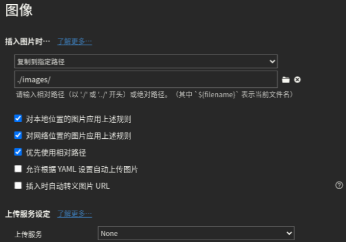
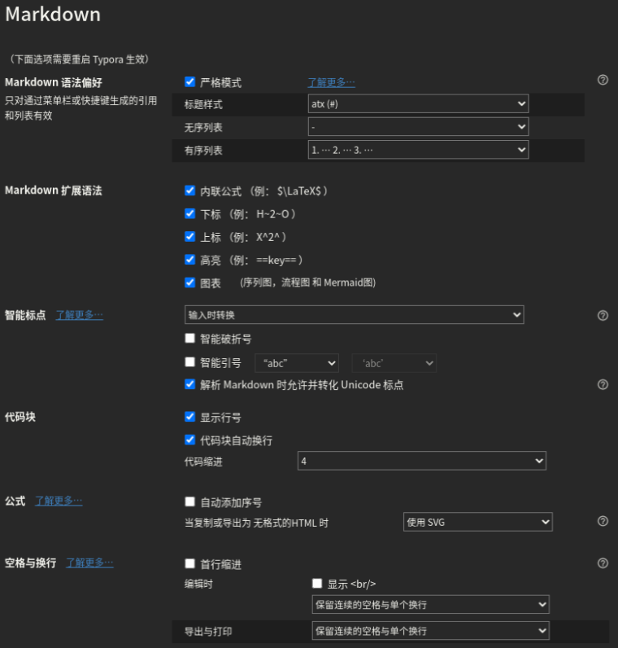
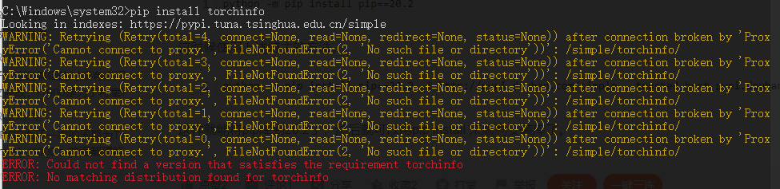

[TOC]

# 工具集合

| 工具                                                         | 简介                                                         | 工具                                                 | 简介                                               |
| ------------------------------------------------------------ | ------------------------------------------------------------ | ---------------------------------------------------- | -------------------------------------------------- |
| [字幕组机翻小助手](https://github.com/1c7/Translate-Subtitle-File) | 给字幕文件翻译（[网页版](https://tern.1c7.me/#/)），可配合腾讯云的[机器翻译](https://www.tencentcloud.com/zh/products/tmt)（每月有500万字的免费额度） | [KeymouseGo](https://github.com/taojy123/KeymouseGo) | 精简绿色版的按键精灵                               |
| [git-sim](https://github.com/initialcommit-com/git-sim)      | 可视化模拟 Git 操作                                          | [Pandora](https://github.com/pengzhile/pandora)      | 顺畅体验ChatGPT（[网页版](https://chat.zhile.io)） |
| [EasySpider](https://github.com/NaiboWang/EasySpider)        | 可视化爬虫（浙大人写的）                                     | [paraview](https://www.paraview.org/download/)       | 可视化软件                                         |
| [pix2tex](https://github.com/lukas-blecher/LaTeX-OCR)        | LaTeX OCR，本地部署，mathpix snip的替代品                    |                                                      |                                                    |


# Edge

- 开启多线程下载：地址栏输入`edge://flags/#enable-parallel-downloading`，选择Enable

- 插件

    | 插件名称            | 简介                                                         | chrome下载连接                                               | edge下载连接                                                 | 官网                                                         |
    | ------------------- | ------------------------------------------------------------ | ------------------------------------------------------------ | ------------------------------------------------------------ | ------------------------------------------------------------ |
    | EpubPress           | 将网页转为电子书格式epub                                     | [EpubPress](https://chrome.google.com/webstore/detail/epubpress-read-the-web-of/pnhdnpnnffpijjbnhnipkehhibchdeok) |                                                              |                                                              |
    | Collamark           | 网页批注                                                     | [Collamark](https://chrome.google.com/webstore/detail/collamark/kbpjikgngikhhpbjddnenemoonpbfikm) |                                                              |                                                              |
    | Forest              | 浏览器种树                                                   | [Forest](https://chrome.google.com/webstore/detail/forest-stay-focused-be-pr/kjacjjdnoddnpbbcjilcajfhhbdhkpgk) |                                                              |                                                              |
    | Tampermonkey        | 脚本使用平台                                                 | [Tampermonkey](https://chrome.google.com/webstore/detail/tampermonkey/dhdgffkkebhmkfjojejmpbldmpobfkfo) | [Tampermonkey](https://microsoftedge.microsoft.com/addons/detail/tampermonkey/iikmkjmpaadaobahmlepeloendndfphd) |                                                              |
    | 沙拉查词            | 划词翻译                                                     | [沙拉查词](https://chrome.google.com/webstore/detail/%E6%B2%99%E6%8B%89%E6%9F%A5%E8%AF%8D-%E8%81%9A%E5%90%88%E8%AF%8D%E5%85%B8%E5%88%92%E8%AF%8D%E7%BF%BB%E8%AF%91/cdonnmffkdaoajfknoeeecmchibpmkmg?hl=zh-CN) | [沙拉查词](https://microsoftedge.microsoft.com/addons/detail/%E6%B2%99%E6%8B%89%E6%9F%A5%E8%AF%8D%E8%81%9A%E5%90%88%E8%AF%8D%E5%85%B8%E5%88%92%E8%AF%8D%E7%BF%BB%E8%AF%91/idghocbbahafpfhjnfhpbfbmpegphmmp) |                                                              |
    | Grammarly           | 英语语法纠正和校对工具                                       | [Grammarly](https://chrome.google.com/webstore/detail/grammarly-for-chrome/kbfnbcaeplbcioakkpcpgfkobkghlhen?hl=zh-CN) | [Grammarly](https://microsoftedge.microsoft.com/addons/detail/grammarly-grammar-checke/cnlefmmeadmemmdciolhbnfeacpdfbkd) |                                                              |
    | Browse Manager      | 网址/域名黑名单、访问次数统计                                | [Browse Manager](https://chrome.google.com/webstore/detail/browse-manager/fibpimjmadkibpjkhlngcapnkkhhikpf) |                                                              | [browse-manager](https://github.com/ZDL-Git/browse-manager)  |
    | Vimium              | 通过键盘控制网页                                             | [Vimium](https://chrome.google.com/webstore/detail/vimium/dbepggeogbaibhgnhhndojpepiihcmeb) | [Vimium C](https://microsoftedge.microsoft.com/addons/detail/vimium-c-%E5%85%A8%E9%94%AE%E7%9B%98%E6%93%8D%E4%BD%9C%E6%B5%8F%E8%A7%88%E5%99%A8/aibcglbfblnogfjhbcmmpobjhnomhcdo) |                                                              |
    | AdGuard 广告拦截器  | 广告拦截                                                     |                                                              | [AdGuard](https://microsoftedge.microsoft.com/addons/detail/adguard-%E5%B9%BF%E5%91%8A%E6%8B%A6%E6%88%AA%E5%99%A8/pdffkfellgipmhklpdmokmckkkfcopbh) | [AdGuard 广告拦截器](https://adguard.com/zh_cn/adguard-browser-extension/overview.html) |
    | uBlacklist          | 可以屏蔽内容农场，黑名单来自[Github](https://github.com/cobaltdisco/Google-Chinese-Results-Blocklist) | [uBlacklist](https://chrome.google.com/webstore/detail/ublacklist/pncfbmialoiaghdehhbnbhkkgmjanfhe) |                                                              |                                                              |
    | Dark Reader         | 网页变成深色模式                                             | [Dark Reader](https://chrome.google.com/webstore/detail/dark-reader/eimadpbcbfnmbkopoojfekhnkhdbieeh) | [Dark Reader](https://microsoftedge.microsoft.com/addons/detail/dark-reader/ifoakfbpdcdoeenechcleahebpibofpc) |                                                              |
    | XDM browser monitor | 下载软件XDM对应的浏览器插件                                  |                                                              | [XDM browser monitor](https://microsoftedge.microsoft.com/addons/detail/xdm-browser-monitor/plohkbgcfpdjhcnoahppkcffaijkadgf) |                                                              |

# VS Code

==推荐登录Github/微软账号以开启设置同步==

## 扩展

- [**Markdown All in One**](https://marketplace.visualstudio.com/items?itemName=yzhang.markdown-all-in-one)：markdown全家桶

- ~~**TabNine**：我觉得超级好用的自动补全软件~~

- **[Bookmarks](https://marketplace.visualstudio.com/items?itemName=alefragnani.Bookmarks)**：书签

- [**Better Comments**](https://marketplace.visualstudio.com/items?itemName=aaron-bond.better-comments)：给不同的注释加颜色

    - 在设置中的`better-comments.tags`加入如下内容，给`// NOTE`添加颜色

        ```json
        {
            "tag": "note",
            "color": "#98C379",
            "strikethrough": false,
            "underline": false,
            "backgroundColor": "transparent",
            "bold": false,
            "italic": false
        },
        ```

- [**highlight-words**](https://marketplace.visualstudio.com/items?itemName=rsbondi.highlight-words)：在同一vscode窗口里打开的所有文档中，高亮所有 选中的文本。用来看日志是极好的

- [**Git Graph**](https://marketplace.visualstudio.com/items?itemName=mhutchie.git-graph)：常用的git插件

-  [**Git History**](https://marketplace.visualstudio.com/items?itemName=donjayamanne.githistory)：常用的git插件

- [**Colonize**](https://marketplace.visualstudio.com/items?itemName=vmsynkov.colonize)：换行末尾添加分号（类似clion）

- ~~[**macros**](https://marketplace.visualstudio.com/items?itemName=ctf0.macros)：宏操作，可以实现[换行末尾添加分号](https://blog.csdn.net/m0_46230476/article/details/115637879)~~

- [**VS Code Counter**](https://marketplace.visualstudio.com/items?itemName=uctakeoff.vscode-counter)：代码量统计

- [**indent-rainbow**](https://marketplace.visualstudio.com/items?itemName=oderwat.indent-rainbow)：给不同层级的缩进添加颜色

- **[Doxygen Documentation Generator](https://marketplace.visualstudio.com/items?itemName=cschlosser.doxdocgen)**：doxygen注释

    - 将设置中的`doxdocgen.cpp.tparamTemplate`改成`@param[in] {param} `

    - 在设置中的`editor.tokenColorCustomizations`加入如下内容，来[修改doxygen注释颜色](https://blog.csdn.net/weixin_44488341/article/details/130621912)

        ```json
        "textMateRules": [
            {
                "scope" : [
                    "comment.block.documentation.cpp",
                    "storage.type.class.doxygen"
                ],
                "settings": {
                    "foreground": "#689451",
                    "fontStyle": "bold"
                }
            }
        ]
        ```

    - [修改doxygen注释的格式](https://blog.csdn.net/lipenghui0804/article/details/112012514)：比如添加默认author

- [**Comment Divider**](https://marketplace.visualstudio.com/items?itemName=stackbreak.comment-divider)**: 生成类似下图的注释分割块**。记得修改配置中的“Length”为行宽（比如120）

    ```c++
    /* -------------------------------------------------------------------------- */
    /*                                Example text                                */
    /* -------------------------------------------------------------------------- */
    ```

- [**Inline Parameters for VSCode**](https://marketplace.visualstudio.com/items?itemName=liamhammett.inline-parameters)：跟clion一样的参数提示插件，但是暂不支持c++

- [**GitHub Theme**](https://marketplace.visualstudio.com/items?itemName=GitHub.github-vscode-theme)：主题插件，喜欢用里面的高对比度的主题


## 快捷键

| 内容                      | 快捷键             | 备注         | 内容                             | 快捷键               | 备注         |
| ------------------------- | ------------------ | ------------ | -------------------------------- | -------------------- | ------------ |
| 向后跳转（navigate back） | alt + ←            |              | 快速预览定义（peek definition）  | alt + F12            |              |
| 隐藏活动栏                | ctrl + shift + A   | 手动修改     | 快速预览申明（peek declaration） | ctrl + shift + F12   |              |
| 设置                      | ctrl + ,           | 默认         | 快捷键设置                       | ctrl + k<br>ctrl + s | 默认         |
| 块注释的切换              | ctrl + alt + /     |              |                                  |                      |              |
| 末尾加分号并换行          | ctrl + alt + enter | 安装Colonize | 光标不动、末尾加分号             | alt + enter          | 安装Colonize |
|                           |                    |              |                                  |                      |              |
|                           |                    |              |                                  |                      |              |

 ## cmake设置

- 添加编译器：linux上编辑~/.local/shared/cmake-tools-kits.json，windows上编辑`%userprofile%\AppData\Local\CMakeTools\cmake-tools-kits.json`，可以添加手动安装的编译器
- [cmake-tools插件关闭保存自动编译](https://www.cnblogs.com/feipeng8848/p/17309772.html)：设置中找到`Cmake: Configure On Edit`，取消勾选
- 状态栏中显示cmake按钮：设置中找到`Cmake > Options: Status Bar Visibility`，根据需求选择cmake按钮的显示程度。比如选择"visible"则显示所有的cmake按钮

## 配置

- [vscode + cmake开发，找不到头文件](https://blog.csdn.net/lizy_fish/article/details/106376080)：在setting.json中添加如下内容

    ```json
    "C_Cpp.default.configurationProvider": "ms-vscode.cmake-tools"
    ```

- [括号匹配辅助线的开启](https://github.com/CoenraadS/Bracket-Pair-Colorizer-2?tab=readme-ov-file#bracket-pair-colorizer-2)：`setting => Editor => Guides: Bracket Pairs`，设置为activate，效果类似下图

    

- vsode server安装包下载：根据系统、CPU架构选择连接，然后将其中的commit号换成对应vsode的即可

    -  https://update.code.visualstudio.com/commit:6c3e3dba23e8fadc360aed75ce363ba185c49794/server-win32/stable

    -  https://update.code.visualstudio.com/commit:6c3e3dba23e8fadc360aed75ce363ba185c49794/server-win32-x64/stable
    -  https://update.code.visualstudio.com/commit:6c3e3dba23e8fadc360aed75ce363ba185c49794/server-linux_x64/stable
    -  https://update.code.visualstudio.com/commit:6c3e3dba23e8fadc360aed75ce363ba185c49794/server-linux-arm64/stable
    -  https://update.code.visualstudio.com/commit:6c3e3dba23e8fadc360aed75ce363ba185c49794/server-darwin-arm64/stable

- [修改C++中访问限定符（public、private等）的颜色](https://blog.csdn.net/NEKOic/article/details/118855221)：在设置的json中加入如下内容

    ```json
    "editor.tokenColorCustomizations": {
        "textMateRules": [
            {
                "scope": [
                    "storage.modifier.access.control.public.cpp",
                    "storage.modifier.access.control.private.cpp",
                    "storage.modifier.access.control.protected.cpp",
                ],
                "settings": {
                    "foreground": "#FFFF00",
                    "fontStyle": "bold underline" 
                }
            }
        ]
    },
    ```

- 让标签页更紧凑：setting=> tab sizing，改为shrink

- 标签页自动换行：`setting › Editor: Wrap Tabs`打钩

- 自动换行：`setting=>Editor: Word Wrap`改成wordWrapColumn，`setting=>Editor: Word Wrap Column`改成跟code style中一致（比如120）

- [增加文件后缀类型的支持](https://blog.csdn.net/billbliss/article/details/82774315)：`setting=>files.associations`，添加例如"*.tpp": "cpp"

- 给中文断词：`setting=>editor.wordSeparators`，继续加上“、，。？！“”‘’；：（）「」【】〔〕『』〖〗”

- [不追踪软连接](https://www.likecs.com/show-204229604.html)：文件夹中包含太多软连接会消耗大量CPU。`setting=>search.followSymlinks`，设置为false

- [设置ssh远程服务器的插件安装位置](https://stackoverflow.com/questions/71856659/vs-code-ssh-server-install-path)：vscode用ssh远程linux服务器时，需要在${HOME}下面创建文件夹.vscode-server安装相关插件文件后才能正常远程，但是有时候可能没有home目录，因此就需要修改安装路径。在vscode的设置中搜索@ext:ms-vscode-remote.remote-ssh serverInstallPath，然后点击"Add Item"，Key为远程服务器的代号（即.ssh/config中Host后面的名称），Value为想要安装的路径

- [在新标签页打开文件](https://vscode.one/new-tab-vscode/)：点击一下文件名，是临时预览（文件名是斜体）；双击文件名，表示正式打开（文件名是正的）

    

- [显示限宽提示线or修改限宽]( https://www.zhihu.com/question/61341938/answer/186940141)：

    -  `setting=>editor.rulers`，内容设置成[80]

    -  如果不是自己指定了clang_format文件，则`setting=>C_Cpp.clang_format_style`，添加`{ColumnLimit: 120}`

- 使用谷歌代码风格：`setting=>C_Cpp: Clang_format_style`，内容改成`{BasedOnstyle: Google, ColumnLimit: 120}`

    -  以防万一，将`setting=>C_Cpp: Clang_format_fallback Style`也改了，虽然不知道有啥区别

- 终端字体间隔过大：`setting=>Terminal.integrated.fontFamily`，填入`consolas`或者`monospace`

- 编辑器空格太小：首先[安装FiraCode](https://github.com/tonsky/FiraCode/wiki/Installing)（ubuntu 17.04及以上使用命令`sudo apt install fonts-firacode`），然后[在vscode的settings.json加入如下内容](https://github.com/tonsky/FiraCode/wiki/VS-Code-Instructions)
    ```json
    "editor.fontFamily": "Fira Code",
    "editor.fontLigatures": true,
    // （可选）字体粗细调节
    "editor.fontWeight": "300" // Light
    "editor.fontWeight": "400" // Regular
    "editor.fontWeight": "450" // Retina !! Only works with FiraCode-VF.ttf installed, see below when using separated font files (the normal case).
    "editor.fontWeight": "500" // Medium
    "editor.fontWeight": "600" // Bold
    ```

- ~~**整体settings.json**~~

    ```json
    {
        "editor.formatOnType": true, // 输入分号(C/C++的语句结束标识)后自动格式化当前这一行的代码
        "files.autoSave": "afterDelay",
        "editor.acceptSuggestionOnEnter": "off", // 我个人的习惯，按回车时一定是真正的换行，只有tab才会接受Intellisense
        //忽略“推荐扩展”
        "extensions.ignoreRecommendations": true,
        //不继承VS Code的Windows环境，针对Linux
        "terminal.integrated.inheritEnv": false,
        //调整窗口的缩放级别
        "window.zoomLevel": 0,
        "explorer.confirmDragAndDrop": false,
    
        //自动预览markdown
        "markdown.extension.preview.autoShowPreviewToSide": false,
        "markdown-pdf.displayHeaderFooter": true,
        //markdown的目录是否为纯文本？？？
        "markdown.extension.toc.plaintext": true,
        //防止Markdown TOC生成的目录不自动换行
        "files.eol": "\n",
    
        // 是否启用交互式窗口（jupyter）？
        // "python.dataScience.sendSelectionToInteractiveWindow": true,
    
        "markdown-preview-enhanced.liveUpdate": false,
        //vscode 没办法给中文断词，所以加上中文常用标点
        "editor.wordSeparators": "`~!@#$%^&*()-=+[{]}\\|;:'\",.<>/?、，。？！“”‘’；：（）「」【】〔〕『』〖〗"
    }
    ```

    


# Typora

- 偏好设置：

    

    

    

- 快捷键配置：编辑文件`conf.user.json`，Linux上的路径为`~/.config/Typora/conf/conf.user.json`；或者点击`文件` -> `偏好设置` -> `通用` -> `高级设置` -> `打开高级设置`。将整个文件内容替换为

    ```json
    /** For advanced users. */
    {
      "defaultFontFamily": {
        "standard": null, //String - Defaults to "Times New Roman".
        "serif": null, // String - Defaults to "Times New Roman".
        "sansSerif": null, // String - Defaults to "Arial".
        "monospace": null // String - Defaults to "Courier New".
      },
      "autoHideMenuBar": false, //Boolean - Auto hide the menu bar unless the `Alt` key is pressed. Default is false.
    
      // Array - Search Service user can access from context menu after a range of text is selected. Each item is formatted as [caption, url]
      "searchService": [
        ["Search with Google", "https://google.com/search?q=%s"]
      ],
    
      // Custom key binding, which will override the default ones.
      "keyBinding": {
        // for example: 
        // "Always on Top": "Ctrl+Shift+P"
        "Inline Math": "Ctrl+M",
        "Highlight": "Ctrl+Shift+H",
        "Superscript": "Ctrl+Shift+=",
        "Subscript": "Ctrl+="
        // "Comment": "Ctrl+K+C"
    
      },
    
      "monocolorEmoji": false, //default false. Only work for Windows
      "autoSaveTimer" : 3, // Deprecidated, Typora will do auto save automatically. default 3 minutes
      "maxFetchCountOnFileList": 500,
      "flags": [] // default [], append Chrome launch flags, e.g: [["disable-gpu"], ["host-rules", "MAP * 127.0.0.1"]]
    }
    ```

- 字典更新：Typora支持用户更新字典。[字典](./user-dict.json)保存路径为`{typora-user-folder}\dictionaries`。`{typora-user-folder}`可以通过设置里面的`主题文件夹`找到，或者在Linux上为`~/.config/Typora`，在Windows上为`C:/user/<用户名>/appData/Roaming/Typora`。

# CLion

## 新

- 插件：离线下载：

    - 方法一：在有网络的电脑上安装相同版本的clion，然后在其中的插件市场中下载插件，不同系统的插件安装包存放路径为

        ```c++
        win => C:\Users\{用户名}\AppData\Local\JetBrains\CLion2023.3\plugins
        ```

    - 方法二：[官方插件网站](https://plugins.jetbrains.com/clion)上搜索，然后打开插件页面，点击“VERSION”按钮，根据自己的版本下载

| 插件                                                         | 简介                                                         | 插件                                                         | 简介                             |
| ------------------------------------------------------------ | ------------------------------------------------------------ | ------------------------------------------------------------ | -------------------------------- |
| [String Manipulation](https://plugins.jetbrains.com/plugin/2162-string-manipulation) | 快速转换代码命名风格，如转换大小写，驼峰变下划线等           | [Quick File Preview](https://plugins.jetbrains.com/plugin/12778-quick-file-preview) | 单击文件即可打开预览，类似VSCode |
| [CodeGlance Pro](https://plugins.jetbrains.com/plugin/18824-codeglance-pro) | 代码预览，类似VSCode                                         | [Smart Input](https://plugins.jetbrains.com/plugin/20575-smart-input) | 自动切换中英文                   |
| [OpenCV Image Viewer](https://plugins.jetbrains.com/plugin/14371-opencv-image-viewer/versions) | debug的时候可视化opencv的变量                                | [VSCode Keymap](https://plugins.jetbrains.com/plugin/12062-vscode-keymap) | vscode快捷键                     |
| [GitHub Theme](https://plugins.jetbrains.com/plugin/15418-github-theme) | github主题                                                   | Key Promoter X                                               | 快捷键提示                       |
| CodeGeeX                                                     | AI助手（可能要[手动设置](https://zhipu-ai.feishu.cn/docx/CKXrdaLUFoqlhfxn9eGc36Bqnyb)） |                                                              |                                  |

- 快捷键：将快捷键换成VSCode，然后修改如下的快捷键

| 快捷键             | 说明                             |                            |
| ------------------ | -------------------------------- | -------------------------- |
| Ctrl + Shift + E   | Project                          | 项目文件管理窗口打开/关闭  |
| Ctrl + K, Ctrl + F | Reformat Code                    | 格式化代码                 |
| Ctrl + `           | Terminal                         | 终端开启/关闭              |
| Ctrl + J           | Hide All Tool Windows            | 隐藏所有侧边窗口           |
| F9                 | Toggle Line Breakpoint           | 启用/取消break point       |
| Alt + F9           | Toggle Temporary Line Breakpoint | 启用一次性的break point    |
| Shift + F9         | Toggle Breakpoint Enabled        | 禁用/启用 break point      |
| Ctrl + F9          | View Breakpoints...              | 查看所有的break points信息 |
| Ctrl + Alt + /     | Comment with Block Comment       | 块注释                     |
| Ctrl + Alt + F5    | Attach to Process                | 附加到进程进行调试         |
|                    |                                  |                            |

- 双击标签页让窗口最大化：setting => advanced settings => Editor Tabs => Perform 'Maximize Editor''Normalize Splits'with double-click on editor tab

- 注释添加高亮规则：setting => Editor => TODO，添加新的Pattern，取消勾选“Use color scheme TODO default colors”来自定义颜色

    | Pattern    | 颜色   | Pattern | 颜色   |
    | ---------- | ------ | ------- | ------ |
    | \bnote\b.* | 00FF00 |         |        |
    | !\s.*      | FF0000 | ?\s.*   | 0000FF |

- [设置函数分割线](https://blog.csdn.net/xudahai513/article/details/126960141)：setting => Editor => General => Appearance，打钩"Show method sep"

- [注释靠近代码](https://blog.51cto.com/u_15127627/3280936)：Settings => Code Style => C/C++ ，在右边选择 “Code Generation” Tab，取消勾选`Line comment at first column`、`Block comment at first column`，勾选`Add a space at line comment start`

- [手动加载CMakePresets.json](https://www.jetbrains.com/help/clion/cmake-presets.html#load-preset)：开启全局搜索（快捷键双击shift或者ctrl+shift+A），搜索Load CMake Presets

- 块注释修改颜色：setting=>Editor=>Color Scheme=>Language Defaults，找到Commnets=>Block comment以及Commnets=>Doc comment=>Text，将Foreground改成98C379（来自vscode的插件Better Comments）

- doxygen注释模板添加@brief：

    - 旧版：setting=>Editor=>Code Style=>C/C++=>Code Generation=>Docummentation Comments，勾选"Add @brief tag"
    - 新版：setting=>Languages & Frameworks=>C/C++=>Code Generation=>Docummentation Comment Template，勾选"Add @brief tag"


## 旧

- 快捷键

    | 快捷键                       | 作用                                                         | 说明                                                       |
    | ---------------------------- | ------------------------------------------------------------ | ---------------------------------------------------------- |
    | `ctrl+{`或者`ctrl+}`         | [快速跳转花括号匹配的另一个](https://blog.csdn.net/qq_45311792/article/details/110469026) | 对于很长的函数、循环等，可以快速跳到开头or结尾             |
    | `alt+左键`or`alt+shift+左键` | [多行同时输入](https://blog.csdn.net/qq_33637730/article/details/115375349) | 在输入doxygon的param的in还是out的时候，可以一起输入        |
    | `ctrl + shift +enter`        | [自动补全当前代码](https://blog.csdn.net/reoak/article/details/79895832) | 在输入括号或者双引号的内容后，自动补全最后的分号或者花括号 |

- gnome快捷方式：在`/usr/share/applications`下面添加文件`CLion.desktop`，内容为

    ```
    [Desktop Entry]
    Name=CLion
    Exec=/opt/CLion/clion-2021.2.2/bin/clion.sh %U
    Terminal=false
    Type=Application
    Icon=/opt/CLion/clion-2021.2.2/bin/clion.svg
    Comment=C++ IDE
    Categories=IDE;
    ```
    
- 与WSL连接：[WSL - Help | CLion - JetBrains](https://www.jetbrains.com/help/clion/how-to-use-wsl-development-environment-in-clion.html)

- 设置自动补全提示不区分大小写：File -> Settings -> Editor -> General -> Code Completion -> Match case **打开**，并选择 All letters

- 设置提示无延迟：File -> Settings -> Editor -> General -> Code Completion -> Show the documentation ... 关闭

>[Clang-Format Style Options](https://clang.llvm.org/docs/ClangFormatStyleOptions.html)

- 远程调试代码转发图形界面：在`Configuration`中的`Environment variables`添加内容`DISPLAY=localhost:0`。`0`为MobaXterm的X11设置的端口。

- [行号栏变窄](https://blog.csdn.net/SW_LCC/article/details/93163533)：`File-Setting->Editor->General->Gutter Icons`取消勾选`show gutter icons`，然后保存。断点将以整行变红的方式显示（但是不知道怎么快速调出断点的配置）

- 横向滚屏快捷键：`setting->keymap`，搜索scroll，设置成如下

     

- [设置谷歌代码风格](https://jasonkayzk.github.io/2022/07/05/%E9%85%8D%E7%BD%AEClion%E4%B8%AD%E7%9A%84%E4%BB%A3%E7%A0%81%E9%A3%8E%E6%A0%BC/)：`Setting`=>`Editor` => `Code Style` => `C/C++` => `Set From`，选择 `Google` 保存即可！

- [关闭参数提示（parameters hints）](https://blog.csdn.net/Geeker_boy/article/details/105127321)：`Setting`=>`Editor` => `Inlay Hints`，取消勾选`Parameter names`

- 代码跳转回去的快捷键：`Setting=>Keymap`，找到Navigate的Back，设置成想要的快捷键即可（推荐`Alt + -`）

- 修改限宽：`Setting=>Editor=>Code Style`，`Hard wrap at`设置成80

- 中文输入法不跟随光标：[RikudouPatrickstar / JetBrainsRuntime-for-Linux-x64](https://github.com/RikudouPatrickstar/JetBrainsRuntime-for-Linux-x64) （ubuntu 18.04等老系统需要使用老版本）

- **[官方性能调优技巧](https://jetbrains.com.zh.xy2401.com/help/clion/performance-tuning-tips.html)**：针对内存、CPU等问题

- [Jetbrains 试用期重置](https://youwu.today/blog/jetbrains-evaluate-reset/)：可以使用插件[RisesunStudios](https://github.com/RisesunStudios)/**[ide-eval-resetter](https://github.com/RisesunStudios/ide-eval-resetter)**

# Git

- 添加账号信息

    ```shell
    # 添加全局的账号信息
    git config --global user.email "orz@orz.orz"
    git config --global user.name "orz"
    # 仅对当前项目添加账号信息
    git config user.email "orz@orz.orz"
    git config user.name "orz"
    ```

- 生成ssh密钥

    ```shell
    ssh-keygen -t rsa -b 4096 -C "orz@orz.orz"
    ```

    将生成的`.pub`文件的内容添加到GitHub设置的**SSH and GPG keys**里面。测试是否添加成功

    ```shell
    ssh -T git@github.com
    ```

> [官方教程](https://docs.github.com/cn/free-pro-team@latest/github/authenticating-to-github/adding-a-new-ssh-key-to-your-github-account)

- 多账号配置：编辑~/.ssh/config文件，添加如下内容

    ```
    Host gitlab.com
     hostname gitlab.com
     User git
     IdentityFile /home/orz/.ssh/gitlab
    Host github.com
     hostname github.com
     User git
     IdentityFile /home/orz/.ssh/github
    ProxyCommand nc -X 5 -x 127.0.0.1:7890 %h %p
    ```

    > 其中`127.0.0.1:7891`是socks5代理的IP和端口

- 使用跳板机访问私有git服务

    ```
    Host jump						# 跳板机名称，可自定义
    	HostName xxx.xxx.xxx.xxx	 # 跳板机IP
    	User xxx
    	IdentityFile xxxx			# 可选
    Host gitlab					    # git服务名称，可自定义
    	HostName xxx.xxx.xxx.xxx	 # git服务，可能是IP名称，可能是域名
    	ProxyJump jump				# 必须与上面的“跳板机名称”相同
    	User git
    	IdentityFile xxxx			# 可选
    ```

    填完后，使用命令`ssh gitlab`测试能否连通，不行的话进行排查。

    确认可以连通后，对于git服务上的某个git仓库，假设地址为`git@xxx.xxx.xxx.xxx:test.git`，则应该将@和冒号之间的内容改成上面的“git服务名称”然后进行git clone，即

    ```bash
    git clone git@gitlab:test.git
    ```

    注意：http形式的仓库链接暂时不知道咋弄

# Miniconda

[官网](https://mirrors.tuna.tsinghua.edu.cn/anaconda/miniconda/)。安装方法参考[我的这篇博客](https://blog.csdn.net/OTZ_2333/article/details/86688480)，安装完后需要更改 [Anaconda镜像源](https://mirrors.tuna.tsinghua.edu.cn/help/anaconda/) 和 [pypi镜像源](https://mirrors.tuna.tsinghua.edu.cn/help/pypi/) (可选)为清华镜像，并安装如下包

```bash
conda create --name DL python=3.9
conda install python=3.9 numpy matplotlib pandas ipython jupyter pillow scikit-image tqdm
conda install pytorch=1.13 torchvision cudatoolkit -c pytorch -c nvidia
pip install opencv-contrib-python tensorboardX tensorboard easydict scikit-image
pip install tensorflow tensorflow-datasets mmcv mmedit
# 以下是各个项目中遇到的包。使用率高的挑出来放在上面了
conda install cupy -c anaconda	# 这个跟cuda=9.2 & pytorch=0.4兼容
pip install scipy pprint albumentations json-py imageio kornia torch-summary
```

|       库       |                介绍                |      库      |              介绍              |
| :------------: | :--------------------------------: | :----------: | :----------------------------: |
|    easydict    | 允许访问dict值作为属性（递归工作） |   argparse   |   解析 Python 中的命令行参数   |
| albumentations |            数据增强工具            |    scipy     | 开源的Python算法库和数学工具包 |
|    imageio     |            读写图片文件            | scikit-image |        轻量级图像处理库        |
|      tqdm      |            进度提示信息            |     cupy     |       加速Numpy运算速度        |
|                |                                    |              |                                |


**问题**：用pip安装库的时候总是有Warning，并且报错找不到（但是到镜像源里可以手动找到），如下图



解决方案：降低pip版本。比如我的pip版本为20.3.3，降低到20.2后就好了

# Zotero

## 旧版

- 安装[zotfile](http://zotfile.com/)：下载后是xpi格式。在zotero中，`工具`=>`附加组件`=>右上角齿轮=>`Install Add-on From File`，找到xpi文件，即可
- 【≤ v6.x】修改文件命名方式：在zotero中，`工具`=>`ZotFile Preferences`=>`Renaming Rules`，取消勾选`Use Zotero to Rename`，将其下面两个空格填入`{%y_}{%t_}{%a}`
- 【≥ v7.x】修改文件命名方式：编辑=> 常规=>文件重命名=>自定义文件名格式=>文件名模板，改成

    ```
    {{ year suffix="_" }}{{ title truncate="100" suffix="_" }}{{ firstCreator }}
    ```
- 显示列：刊名缩写、档案、短标题

## 新版

- 文件命名方式：设置=>常规=>文件重命名=>自定义文件名格式，改成`{{ year suffix="_" }}{{ title suffix="_"}}{{ authors }}`

# clash for windows

- 设定远程控制流量走指定网卡：使用clash for windows（[教程](https://docs.cfw.lbyczf.com/contents/parser.html#%E7%AE%80%E4%BE%BF%E6%96%B9%E6%B3%95-yaml)），在Setting => Profiles => Parsers中添加如下内容，就可以在更新订阅链接的时候往里面加想要的内容了

    ```yaml
    parsers: 
      - url: https://xxx.xxx.xxx/link/xxx	# 订阅链接
        yaml:
          append-proxy-groups:
            - name: 远程控制
              type: select
              interface-name: wlp38s0  # 网卡名称
              proxies:
                - DIRECT
          prepend-rules:
            - DOMAIN-KEYWORD,oray,远程控制 # rules最前面增加一个规则
            - DOMAIN-KEYWORD,todesk,远程控制 
    ```

    - **注意**：向日葵等远程软件被一个网络屏蔽后，就可以使用该方法，但是需要clash for windows**一直开启Rule模式**，并远程软件的网络设置里面填入clash for windows的**代理IP和端口**

- clash for windows[自动选择路线](https://lancellc.gitbook.io/clash/clash-config-file/proxy-groups/auto)：在config.yaml添加如下内容

    ```yaml
      proxy-groups:
      - name: "auto"
        type: url-test
        proxies:
          - ss1
          - ss2
          - vmess1
        url: 'http://www.gstatic.com/generate_204'
        interval: 300
       #tolerance: 50
       #lazy: true
       #disable-udp: true
    ```

- [clash for windows同时使用双网卡](https://github.com/Fndroid/clash_for_windows_pkg/issues/2702)：在config.yaml添加如下内容

    ```yaml
    proxy-groups:
      - name: A
        type: select
        interface-name: 以太网  # 网卡1名称
        proxies:
          - DIRECT
      - name: B
        type: select
        interface-name: WLAN  # 网卡2名称
        proxies:
          - DIRECT
    
    rules:
      - DOMAIN-SUFFIX,foo.com,A
      - DOMAIN-SUFFIX,bar.com,B
    ```

- [自定义节点排序](https://docs.cfw.lbyczf.com/contents/proxyorder.html#版本要求)：Settings => Proxies => Order By

    > - Default：按配置文件定义节点顺序
    > - Latency：按节点延迟升序排列
    > - Alphabet：按节点名称字母表排列

- 


# 杂

- utools插件：翻译、FileShare文件共享