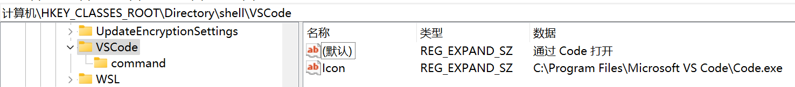
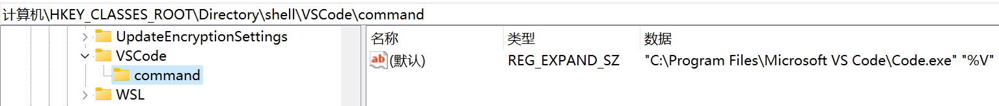
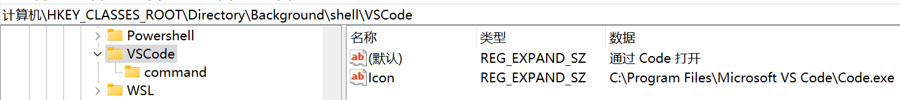
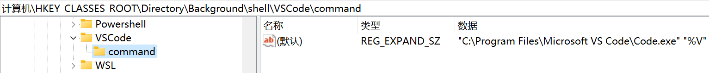
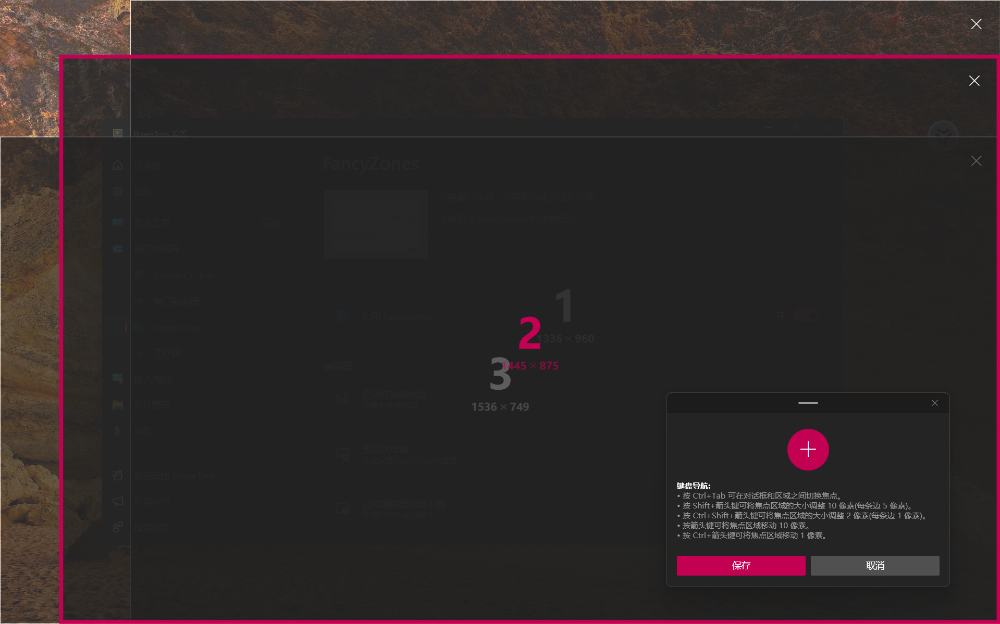

[TOC]

# 系统设置

- [WPS关闭强制登录](https://www.zhihu.com/question/525681203/answer/3206513391)：创建.reg格式文件，填入如下内容，然后双击打开导入注册表

    ```
    Windows Registry Editor Version 5.00
    
    [HKEY_CURRENT_USER\Software\kingsoft\Office\6.0\plugins\officespace\flogin]
    "enableForceLoginForFirstInstallDevice"="false"
    ```

- 右键菜单栏添加“通过xxx打开”：以vscode为例，要在注册表中两处位置添加，分别对应“文件夹的右键菜单”以及“目录的右键菜单”

    - 如果是Jetbrain的IDE，类型从REG_EXPAND_SZ改成REG_SZ（不改可能也没关系？）

    

    

    

    

- git bash 使用tmux：[How to run Tmux in GIT Bash on Windows | PJSen Blog](https://blog.pjsen.eu/?p=440#:~:text=This is what you do%3A Install before-mentioned msys2,Git for Windows directory%2C mine is C%3AProgram FilesGitusrbin.)

- 分区：系统+主要的软件装在SSD上面。

    - 若只有SSD：C盘至少150G，剩下所有的容量都分给D盘
    - SSD+HDD：SSD全分给C盘，HDD全分给其他盘
    
- 开启剪贴板历史记录：按`Windows 键` + `V`

- 开机启动管理：任务管理器 -> 启动

- 设置多用户同时登陆
    - 首先，按照[这个教程](https://blog.csdn.net/u010804317/article/details/100055558)允许远程连接&添加允许远程桌面用户（对应教程第1点）、设置最大连接数量（对应教程3-1，并且设为无限！！！）、将远程桌面服务用户限制到单独的远程桌面服务会话（对应教程3-2）、自动注销登出用户（对应教程第4点）
    - 然后，按照[这个教程](https://blog.csdn.net/u010804317/article/details/104011926)配置软件RDP Wrapper Library。

- cmd/PowerShell代理：

    ```powershell
    # 开启
    set http_proxy=http://10.168.1.237:7890
    set https_proxy=https://10.168.1.237:7890
    curl.exe ip.sb
    # 关闭
    set http_proxy=
    set https_proxy=
    ```

- vscode使用MSVC编译C++

    - vscode中安装c++相关插件

    - [在task.json中添加“windows”](https://code.visualstudio.com/docs/cpp/config-msvc#_reusing-your-c-configuration)：将VsDevCmd.bat的路径换成自己的，用来设置MSVC所需环境

        ```json
        {
            "tasks": [ ... ],
            "windows": {
                "options": {
                  "shell": {
                    "executable": "cmd.exe",
                    "args": [
                        "/C",
                        "\"C:/Program Files (x86)/Microsoft Visual Studio/2017/Professional/Common7/Tools/VsDevCmd.bat\"",
                        "&&"
                    ]
                  }
                }
            },
            "version": ...
        }
        ```

    - [在task.json中，将“type”从cppbuild改成shell](https://blog.csdn.net/hacker_lpy/article/details/115536517)，防止出现乱码

# 必装软件

+ 必装软件分三种：
    + 通过**软件包安装**而且比较平常的（比如TIM、微信等）
    + 通过**压缩包解压**的（比如PdgCntEditor、OfficeBox）
    + **库软件**（比如OpenCV，Anaconda）：==如果可以全部装在WSL里面==
+ 所有的软件都**安装在C盘**，软件包安装的放在`Program Files`或者`Program Files (x86)`文件夹，压缩包解压的放在`Soft`文件夹，库软件放在`Library`文件夹。库文件的源码可以放在其他地方，如果可以的话不要删掉。
+ WSL安装在其他盘：从[官网](https://docs.microsoft.com/en-us/windows/wsl/install-manual#downloading-distributions)上下载安装包，然后将后缀改为.zip，挪到其他盘后解压，运行`ubuntu.exe`即可
## 软件包安装
1. 不做介绍的软件：[TIM](https://tim.qq.com/download.html)、[微信](https://pc.weixin.qq.com/)、[~~网易云音乐~~](https://music.163.com/download)、[网易有道词典](https://cidian.youdao.com/index.html)、[钉钉](https://www.dingtalk.com/download)、[阿里旺旺](https://wangwang.taobao.com/)、[百度网盘](https://pan.baidu.com/download)、[GitHub Desktop](https://help.github.com/cn/desktop/getting-started-with-github-desktop/installing-github-desktop)、[OneDrive](https://www.microsoft.com/zh-cn/microsoft-365/onedrive/online-cloud-storage)、[VSCode](https://code.visualstudio.com/download)、[Bandizip](https://cn.bandisoft.com/bandizip/)、[Edge](https://www.microsoft.com/zh-cn/edge/)、chrome、[PotPlayer](https://daumpotplayer.com/download/)、[IDM](./Material/IDM.6.38.Build.2.Final.Retail.zip) 、[按键精灵](http://download.myanjian.com/)、[~~Mendeley~~](https://www.mendeley.com/download-desktop/)、[向日葵](https://sunlogin.oray.com/personal/download/)、[ToDesk](https://www.todesk.com/download.html)、[Foxmail](https://www.foxmail.com/)、[Everything](https://www.voidtools.com/zh-cn/downloads/)、[欧路词典](https://www.eudic.net/v4/en/app/download)、[腾讯会议](https://meeting.tencent.com/download-center.html)、[FastStone Image Viewer](https://www.faststone.org/download.htm)、[Meshlab](https://www.meshlab.net/#download)
2. 稍作介绍的软件：

| 软件名 | 介绍                | 软件名      | 介绍|
| :---: | :---: | :---: | :---: |
|                 [iperf](https://iperf.fr/iperf-download.php) |      局域网测网速      | ~~[X2Go](https://wiki.x2go.org/doku.php/download:start)~~ | ~~远程连接Linux的图形界面~~ |
|[flux](https://justgetflux.com/)|调节屏幕色温|[stretchly](https://github.com/hovancik/stretchly/releases)|休息提醒|
|[MobaXTerm](https://mobaxterm.mobatek.net/download.html)|远程连接linux的好工具|[Typora](https://typora.io/#download)|Markdown编辑器，[旧版下载地址](https://typora.io/windows/dev_release.html)|
|[cloc](https://github.com/AlDanial/cloc)|代码行数统计|[AIDA64](https://www.aida64.com/downloads)|显示电脑详细信息|
|  [Mathpix Snip](https://mathpix.com/#downloads)  |    数学公式识别神器（[网页版](https://snip.mathpix.com/)    |[clash for windows](https://github.com/Fndroid/clash_for_windows_pkg/releases)|ShadowsocksR的替代品。更好用。<br/>[教程](https://merlinblog.xyz/wiki/cfw.html)，[汉化补丁](https://github.com/BoyceLig/Clash_Chinese_Patch/releases)，[ssr订阅链接转clash](https://bianyuan.xyz/)|
|    [Microsoft To Do](https://to-do.microsoft.com/tasks/)     |        任务管理        | [PdgCntEditor](https://www.jianshu.com/p/498b0f8bb650) | 编辑PDF目录                        |
| [DiskGenius](https://www.diskgenius.cn/download.php)  | 管理磁盘     | [Scrcpy_GUI](https://github.com/Tomotoes/scrcpy-gui/releases) | 手机投屏到电脑（可以媲美华为的投屏） |
| ~~[哔哩哔哩动画](https://www.microsoft.com/zh-cn/p/%e5%93%94%e5%93%a9%e5%93%94%e5%93%a9%e5%8a%a8%e7%94%bb/9nblggh5q5fv?activetab=pivot:overviewtab)~~ | ~~官方渠道下载b站视频~~ | ~~[ShadowsocksR](https://github.com/shadowsocksrr/shadowsocksr-csharp)~~ | ~~必备工具~~                   |
| [万彩办公大师](http://www.wofficebox.com/) | 办公工具~~箱~~ | [wsl-notify-send](https://github.com/stuartleeks/wsl-notify-send)                    |                        WSL给win发通知                        |
| ~~[软媒魔方](https://mofang.ruanmei.com/)~~ | ~~管理电脑的工具箱~~ |                            [ImageJ](https://imagej.nih.gov/ij/download.html)                            |                         图像处理软件                         |
|[每日英语听力](https://www.eudic.net/v4/en/app/ting)|闭眼休息的时候听听英语|[spacedesk](https://spacedesk.net/##box_434)|将手机or平板变成电脑显示器|
|Total Control|电脑控制手机|splashtop|将手机or平板变成电脑显示器|
|Guitar Pro|吉他神器|[ImageMagick](https://imagemagick.org/script/download.php)|图像处理软件|
|[ventoy](https://www.lanzoui.com/b01bd54gb)|系统盘制作|[MulimgViewer](https://github.com/nachifur/MulimgViewer/releases)|同时查看多张图|
|uTools|好用工具集合|[Zotero](https://www.zotero.org/download/)|跨平台文献查看工具|
|Geomagic Wrap|三维模型处理工具|[Mellow Multi Player](http://mellow.official.jp/blog/archives/3081)|同时播放多个视频|
|[WinDirStat](https://windirstat.net/download.html)|磁盘分析工具|[Sumatra PDF](https://www.sumatrapdfreader.org/download-free-pdf-viewer)|PDF阅读器，支持黑暗模式(快捷键I)|
|[QTTabBar](https://github.com/indiff/qttabbar)|用浏览器的方式管理 Windows 资源管理器|          [HWiNFO](https://www.hwinfo.com/download/)          |查看电脑硬件，包含温度、功耗等|
|[PowerToys](https://github.com/microsoft/PowerToys)|windows工具箱| CapsWriter-Offline |语音输入&&字幕生成工具|

3. 大型软件：[Lightroom Classic](https://mp.weixin.qq.com/s/RH0oCJWD00QFXpuCYwB8oA)、[Photoshop](https://mp.weixin.qq.com/s/RH0oCJWD00QFXpuCYwB8oA)、[Microsoft Office](https://mp.weixin.qq.com/s/RH0oCJWD00QFXpuCYwB8oA)、[WLS（Ubuntu 20.04 LTS）](https://docs.microsoft.com/zh-cn/windows/wsl/install-win10)、[Visio](https://mp.weixin.qq.com/s/RH0oCJWD00QFXpuCYwB8oA)、[CLion](https://www.jetbrains.com/clion/download/#section=windows)、PyCharm、[SolidWorks](https://mp.weixin.qq.com/s/RH0oCJWD00QFXpuCYwB8oA)
3. 安装msys2：[如何优雅地配置 Windows 环境下的 MSys2 + Git 开发环境？（上） - 知乎 (zhihu.com)](https://zhuanlan.zhihu.com/p/33751738)

## 库软件

==如果可以，全部装在WSL里面==；否则全部安装于`C:\Library\`中。源码安装方法参考[CrossPlatform的文档](./CrossPlatform.md)

| 软件名 | 介绍| 软件名| 介绍|
| ---------- | ------ | ------------ | ------ |
| [Miniconda3](https://www.anaconda.com/distribution/) | 管理python| ~~CTEX~~ | ~~LaTeX发行版，毕设用~~ |
| [mingw64](https://sourceforge.net/projects/mingw-w64/files/mingw-w64/) | 编译器。选择seh版本，并且需要将/bin添加到环境变量 |[OpenCV](https://github.com/opencv/opencv/releases)| 计算机视觉库|
|[Eigen](http://eigen.tuxfamily.org/index.php?title=Main_Page)|矩阵库|[PCL](https://github.com/PointCloudLibrary/pcl/releases)|处理点云库|
|[CMake](https://cmake.org/download/)|编译工具|[Git](https://git-scm.com/download/win)|版本控制系统|

# Foxmail

|         | 邮箱类型 | 收件服务器            | SSL      | 端口 | 发件服务器            | SSL      | 端口 |
| ------- | -------- | --------------------- | -------- | ---- | --------------------- | -------- | ---- |
| outlook | IMAP     | imap-mail.outlook.com | &#10003; | 993  | smtp-mail.outlook.com | STARTTLS | 587  |
| gmail   | IMAP     | imap.gmail.com        | &#10003; | 993  | smtp.gmail.com        | &#10003; | 465  |
| 126     | IMAP     | imap.126.com          | &#10003; | 993  | smtp.126.com          | &#10003; | 465  |
| qq      | IMAP     | imap.qq.com           | &#10003; | 993  | smtp.qq.com           | &#10003; | 465  |


# PowerShell

- [离线安装模块](https://www.c-sharpcorner.com/blogs/how-to-install-powershell-modules-in-offline-mode)，安装完成后还需要import一下，例如Import-Module {Module Name}

    - [如果import报错](https://www.jianshu.com/p/4eaad2163567)”无法加载文件 xxx.psml，因为在此系统上禁止运行脚本“则运行命令set-executionpolicy remotesigned

- [**PSReadLine**](https://github.com/PowerShell/PSReadLine)**：**powershell增强模块

    - [启用命令补全](https://learn.microsoft.com/zh-cn/powershell/module/psreadline/about/about_psreadline?view=powershell-7.4#predictive-intellisense)：Set-PSReadLineOption -PredictionSource History

    - 使用page up和page down搜索历史命令：

        ```powershell
        Set-PSReadLineKeyHandler -Key PageUp -Function HistorySearchBackward
        Set-PSReadLineKeyHandler -Key PageDown -Function HistorySearchForward
        ```

        

# Git Bash

- 使用tmux：[How to run Tmux in GIT Bash on Windows | PJSen Blog](https://blog.pjsen.eu/?p=440#:~:text=This is what you do%3A Install before-mentioned msys2,Git for Windows directory%2C mine is C%3AProgram FilesGitusrbin.)

- [使用page up、page down搜索历史命令](https://stackoverflow.com/questions/60153457/how-to-enable-history-search-by-page-up-down-in-git-bash-like-in-linux)：在`~/.inputrc`中添加如下内容

    ```
        "\e[5~": history-search-backward
        "\e[6~": history-search-forward
    ```

    
# Visual Studio

## 配置

- VS2022开启自动格式化：工具 => 选项 => 文本编辑器 => C/C++ => 代码样式 => 格式设置 => 常规，勾选如下几个选项
    - 键入制表符时自动缩进
    - 键入 ; 时自动设置语句的格式
    - 键入 } 时自动设置块的格式
    - 在大括号自动完成时自动设置其格式
- [visual studio 2019 (vs) 显示右侧缩略图](https://cloud.tencent.com/developer/article/1768869)
- [设置编译输出信息为英文](https://stackoverflow.com/questions/2286216/how-to-change-msbuild-error-message-language)：添加环境变量VSLANG=1033

## 插件

| 插件名称                                                     | 说明                                                         | 插件名称                                                     | 说明                       |
| ------------------------------------------------------------ | ------------------------------------------------------------ | ------------------------------------------------------------ | -------------------------- |
| [Editor Guidelines](https://marketplace.visualstudio.com/items?itemName=PaulHarrington.EditorGuidelines) | 编辑器中的参考线（[教程](https://blog.csdn.net/HW140701/article/details/85162678)，[2022](https://marketplace.visualstudio.com/items?itemName=PaulHarrington.EditorGuidelinesPreview)） | [Doxygen Comments](https://marketplace.visualstudio.com/items?itemName=FinnGegenmantel.doxygenComments) | doxygen代码注释风格        |
| [NVIDIA Nsight Integration (64-bit)](https://marketplace.visualstudio.com/items?itemName=NVIDIA.NvNsightToolsVSIntegration) | 使用nsight system、compute等工具                             | [GLSL language integration](https://marketplace.visualstudio.com/items?itemName=DanielScherzer.GLSL2022) | GLSL高亮、补全等功能       |
| [Visual Assist](https://marketplace.visualstudio.com/items?itemName=WholeTomatoSoftware.VisualAssist) | C/C++代码助手                                                | [Highlighter](https://marketplace.visualstudio.com/items?itemName=DaxPandhi.Highlighter1) | 注释高亮                   |
| [CodeMaid](https://marketplace.visualstudio.com/items?itemName=SteveCadwallader.CodeMaidVS2022) | 代码清理、注释格式化等功能                                   | [ReSharper C++](https://marketplace.visualstudio.com/items?itemName=JetBrains.ReSharperC) | Jetbrains家的C/C++代码助手 |
| [Gitsoler](https://marketplace.visualstudio.com/items?itemName=gandalfliang.gitsoler) | 集成git bash终端                                             |                                                              |                            |

## 问题

- [warning C4819](https://blog.csdn.net/lcb_coconut/article/details/76136725)：因为换行符不对
- error LNK2019: 无法解析的外部符号
    - 如果是在一个库（程序）中用到另外一个库的函数，可能是因为没有导出 or 导入

# [PowerToys](https://github.com/microsoft/PowerToys)

- 窗口堆叠：PowerToys=>FancyZones=>启动布局编辑器=>新建布局=>画布，创建3个or4个窗口（如下所示）

    
