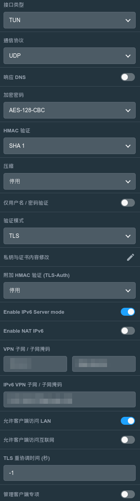

# 华硕路由器

- [IPV6防火墙](https://www.right.com.cn/forum/thread-4052554-1-1.html)：如果IPV6的联机类型为Passthrough（不会有local IVP6地址）或者动态IVP6（local IPV6可能会变），则设置防火墙的时候，本地IP填`::/::`

- [OpenVPN](https://post.smzdm.com/p/am8venrd/)：配置示例如下。如果有配置ddns的话，导出OpenVPN设置文件后记得将IP改成域名

    