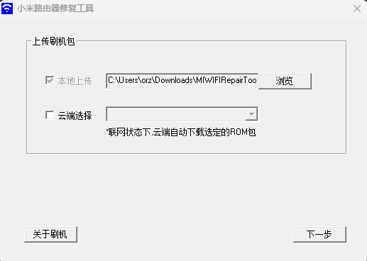
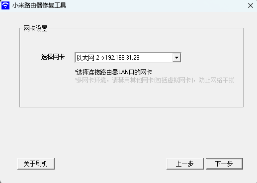
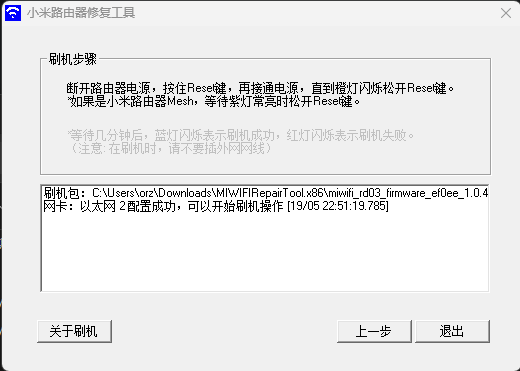
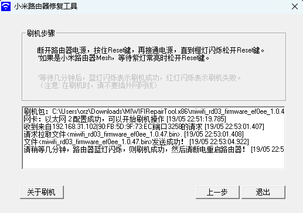
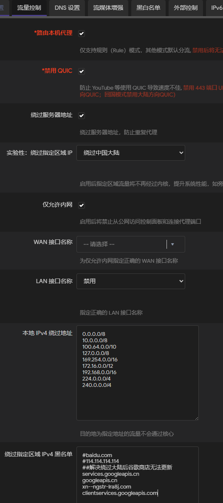
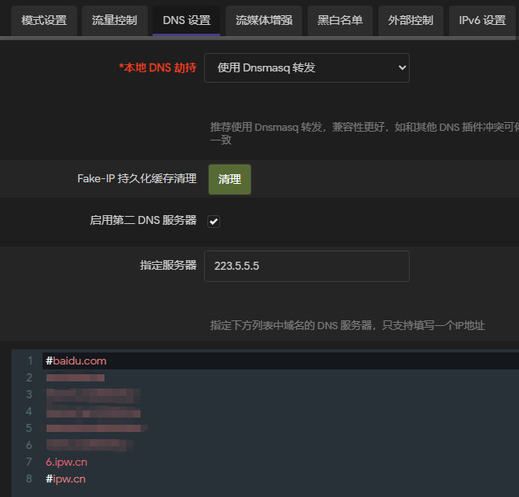
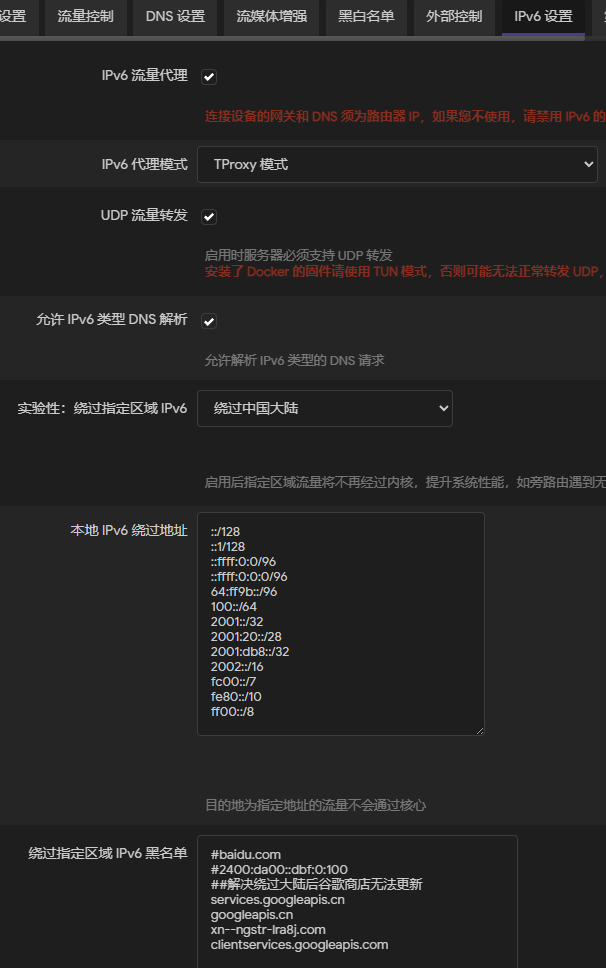
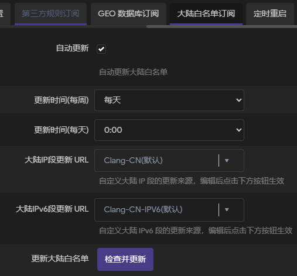

# 华硕路由器

- [IPV6防火墙](https://www.right.com.cn/forum/thread-4052554-1-1.html)：如果IPV6的联机类型为Passthrough（不会有local IVP6地址）或者动态IVP6（local IPV6可能会变），则设置防火墙的时候，本地IP填`::/::`

- [OpenVPN](https://post.smzdm.com/p/am8venrd/)：配置示例如下。如果有配置ddns的话，导出OpenVPN设置文件后记得将IP改成域名

    
    
    - 显示`Authenticate/Decrypt packet error: bad packet ID (may be a replay): [ #106097 ] -- see the man page entry for --no-replay and --replay-window for more info or silence this warning with --mute-replay-warnings`：可能是因为MTU设置不对导致
    
        
    
        - [路由器允许ping](https://jingyan.baidu.com/article/75ab0bcb1b089096864db2fb.html)：路由器后台 => 防火墙 => 响应 ICMP Echo（ping）要求
    
        - [查看路由器的MTU](https://www.sonassi.com/help/troubleshooting/setting-correct-mtu-for-openvpn)：设置初始MTU为1500，使用如下命令，如果显示`需要拆分数据包但是设置 DF`或者`ping: local error: message too long, mtu=1500`，则慢慢降低MTU值，直到成功
    
            ```bash
            ping -n 1 -l 1500 -f www.example.com 	# On Windows
            ping -M do -s 1500 -c 1 www.example.com	# On Linux
            ping -D -v -s 1500 -c 1 www.example.com	# On OSX
            ```
    
        - [修改openvpn的配置文件（.ovpn格式）](https://www.sonassi.com/help/troubleshooting/setting-correct-mtu-for-openvpn)：上面获取的是MTU，但是openvpn需要的是MSS=MTU-40。假设MTU=1470，则MSS=1430，在配置文件中加入如下一行
    
            ```
            mssfix 1430
            ```
    
            

# 小米AX3000T

> [HK's note ✨ 小米 AX3000T 路由器刷入使用官方原版 OpenWrt / ImmortalWrt 固件](https://note.okhk.net/xiaomi-ax3000t-router-install-openwrt-immortalwrt)

## 开启SSH

注意：如果连接ssh的时候报错Unable to negotiate with 192.168.31.1 port 22: no matching host key type found. Their offer: ssh-rsa，可以在`~/.ssh/config`中添加如下内容

```
Host ax3000t
  HostName 192.168.31.1
  Port 22
  User root
  HostKeyAlgorithms +ssh-rsa
```

### 方法一

- 降固件：下载小米路由器官方的刷机工具[MIWIFIRepairTool.x86.zip](https://www.miwifi.com/miwifi_download.html)以及到[openwrt](https://openwrt.org/inbox/toh/xiaomi/ax3000t?s%5B%5D=ax3000t#api_rce_support_status)上下载1.0.47版本的固件[miwifi_rd03_firmware_ef0ee_1.0.47.bin](https://cdn.cnbj1.fds.api.mi-img.com/xiaoqiang/rom/rd03/miwifi_rd03_firmware_ef0ee_1.0.47.bin)。运行刷机工具MIWIFIRepairTool.x86.exe，选择固件，根据提示操作

    - 如果刷机后，橙灯长亮然后灭掉再长亮，可以刷回高版本固件，使用另一个方法

        









- 登录小米路由器后台[http://192.168.31.1](http://192.168.31.1/)，获取URL里面的`stok` 值，例如为2a77be645acea6f11501086dbb5cae43

- 打开终端运行如下命令

    ```bash
    stok=81a013e6d658e6d72c11169f0147e859
    # 开启 SSH 配置
    curl -X POST "http://192.168.31.1/cgi-bin/luci/;stok=$stok/api/misystem/arn_switch" -d "open=1&model=1&level=%0Anvram%20set%20ssh_en%3D1%0A"
    # 提交配置
    curl -X POST "http://192.168.31.1/cgi-bin/luci/;stok=$stok/api/misystem/arn_switch" -d "open=1&model=1&level=%0Anvram%20commit%0A"
    # 设置 dropbear SSH 为 debug
    curl -X POST "http://192.168.31.1/cgi-bin/luci/;stok=$stok/api/misystem/arn_switch" -d "open=1&model=1&level=%0Ased%20-i%20's%2Fchannel%3D.*%2Fchannel%3D%22debug%22%2Fg'%20%2Fetc%2Finit.d%2Fdropbear%0A"
    # 启动 dropbear SSH
    curl -X POST "http://192.168.31.1/cgi-bin/luci/;stok=$stok/api/misystem/arn_switch" -d "open=1&model=1&level=%0A%2Fetc%2Finit.d%2Fdropbear%20start%0A"
    # 设置 root 密码为空
    curl -X POST "http://192.168.31.1/cgi-bin/luci/;stok=$stok/api/misystem/arn_switch" -d "open=1&model=1&level=%0Apasswd%20-d%20root%0A"
    # 以上每个命令的输出都是{"code":0}
    ```

    

### 方法二

- [【二选一】](https://www.right.com.cn/forum/thread-8404780-1-1.html)下载[openwrt-xiaomi/xmir-patcher](https://github.com/openwrt-xiaomi/xmir-patcher)的源代码：
    - 设置路由器ip，选择【1】Set IP-address，设置为192.168.31.1
    - 连接路由器，选择【2】Connect to device，输入刚才初始化路由器时写的登陆密码。成功后你会看到22端口和ssh开启
    - 选择【4】Create full backup，备份并下载分区
    - 选择 【8 - {{{ Other functions }}}】，再选择【2】修改root密码
    - 固化SSH，则选择【6 - Install permanent SSH】（如果刷openwrt好像没必要固化）


## 刷OpenWRT系统

- 到OpenWRT的[下载页面](https://openwrt.org/toh/views/toh_fwdownload)，根据找到AX3000T下载[Factory image](https://downloads.openwrt.org/releases/24.10.0/targets/mediatek/filogic/openwrt-24.10.0-mediatek-filogic-xiaomi_mi-router-ax3000t-initramfs-factory.ubi)和[Sysupgrade image](https://downloads.openwrt.org/releases/24.10.0/targets/mediatek/filogic/openwrt-24.10.0-mediatek-filogic-xiaomi_mi-router-ax3000t-squashfs-sysupgrade.bin)（也可以选择名字中带snapshot的版本）

    - 例如Factory image的文件名为openwrt-24.10.0-mediatek-filogic-xiaomi_mi-router-ax3000t-initramfs-factory.ubi
    - Factory snapshot image的文件名为openwrt-mediatek-filogic-xiaomi_mi-router-ax3000t-initramfs-factory.ubi

- 把`initramfs-factory.ubi`传到路由器的/tmp路径

    ```bash
    # 【二选一】Factory image
    scp -O openwrt-24.10.0-mediatek-filogic-xiaomi_mi-router-ax3000t-initramfs-factory.ubi ax3000t:/tmp/
    # 【二选一】Factory snapshot image
    scp -O openwrt-mediatek-filogic-xiaomi_mi-router-ax3000t-initramfs-factory.ubi ax3000t:/tmp/
    ```

- ssh连接路由器查看硬件信息：`cat /proc/cmdline`

    - 如果`firmware=0`，运行如下命令

        ```bash
        # 【二选一】Factory image
        ubiformat /dev/mtd9 -y -f /tmp/openwrt-24.10.0-mediatek-filogic-xiaomi_mi-router-ax3000t-initramfs-factory.ubi
        # 【二选一】Factory snapshot image
        ubiformat /dev/mtd9 -y -f /tmp/openwrt-mediatek-filogic-xiaomi_mi-router-ax3000t-initramfs-factory.ubi
        nvram set boot_wait=on
        nvram set uart_en=1
        nvram set flag_boot_rootfs=1
        nvram set flag_last_success=1
        nvram set flag_boot_success=1
        nvram set flag_try_sys1_failed=0
        nvram set flag_try_sys2_failed=0
        nvram commit
        reboot
        ```

    - 如果`firmware=1`，运行如下命令

        ```bash
        ubiformat /dev/mtd8 -y -f /tmp/openwrt-mediatek-filogic-xiaomi_mi-router-ax3000t-initramfs-factory.ubi
        nvram set boot_wait=on
        nvram set uart_en=1
        nvram set flag_boot_rootfs=0
        nvram set flag_last_success=0
        nvram set flag_boot_success=1
        nvram set flag_try_sys1_failed=0
        nvram set flag_try_sys2_failed=0
        nvram commit
        reboot
        ```

- 重启后，路由器的IP已经变成192.168.1.1，修改`~/.ssh/config`

- 再把`sysupgrade.bin`传到路由器的/tmp路径

    ```bash
    # 【二选一】Sysupgrade image
    scp -O openwrt-24.10.0-mediatek-filogic-xiaomi_mi-router-ax3000t-squashfs-sysupgrade.bin ax3000t:/tmp/
    # 【二选一】Factory sysupgrade image
    scp -O openwrt-mediatek-filogic-xiaomi_mi-router-ax3000t-squashfs-sysupgrade.bin ax3000t:/tmp/
    ```

- ssh连接路由器执行

    ```bash
    # 【二选一】Sysupgrade image
    sysupgrade -n /tmp/openwrt-24.10.0-mediatek-filogic-xiaomi_mi-router-ax3000t-squashfs-sysupgrade.bin
    # 【二选一】Factory sysupgrade image
    sysupgrade -n /tmp/openwrt-mediatek-filogic-xiaomi_mi-router-ax3000t-squashfs-sysupgrade.bin
    ```

## 配置OpenWRT

- 修改IP：编辑/etc/config/network，然后重启网络`service network restart`

    - NOTE: 如果连不了外网，可能是网关获取不对，把`option proto `从static改成dhcp，再运行命令

- 修改DHCP范围：网络=>接口，找到lan的编辑，DHCP服务器=>常规设置，“启动”改成2，“客户数”改成250

- [更换中科大镜像源](https://mirrors.ustc.edu.cn/help/openwrt.html)

    ```bash
    sed -i 's/downloads.openwrt.org/mirrors.ustc.edu.cn\/openwrt/g' /etc/opkg/distfeeds.conf
    opkg update
    ```

    - 如果报错`SSL verify error: unknown error`

        ```bash
        sed -i 's/https/http/g' /etc/opkg/distfeeds.conf
        opkg update
        opkg install libustream-openssl ca-bundle ca-certificates
        # 如果有如下报错，则不安装libustream-openssl
        # Package libustream-openssl20201210 wants to install file /lib/libustream-ssl.so
        #      But that file is already provided by package  * libustream-mbedtls20201210
        sed -i 's/http/https/g' /etc/opkg/distfeeds.conf
        opkg update
        ```

- [切换中文](https://blog.beanbang.cn/2023/11/26/pve-install-openwrt-as-secondary-router)：

    ```bash
    opkg install luci-i18n-base-zh-cn
    opkg install luci-i18n-firewall-zh-cn
    ```

- [更换主题](https://blog.csdn.net/sunky7/article/details/138198347)：`opkg install luci-compat luci-lib-ipkg`，然后下载主题（.ipk格式，比如[这个](https://github.com/jerrykuku/luci-theme-argon/releases/)）通过software upload package就可以了，默认上传直接生效

- 配置ddns-go：

    - [luci-app-ddns-go](https://github.com/sirpdboy/luci-app-ddns-go)的Release下载`ddns-go_6.9.4-r11_xxxx-xxx.ipk`（根据镜像源里的CPU型号选择，比如AX3000T路由器是a53）、`luci-app-ddns-go_xxxx_all.ipk`、`luci-i18n-ddns-go-zh-cn_xxx_all.ipk`

    - 把所有.ipk上传到openwrt，然后一次性安装（中文包必须在luci-app-ddns-go之后安装）
    
        ```bash
        opkg install ./*ipk
        ```

    - 如果OpenWrt的后台=>服务里面没有DDNS-GO的页面，重启，还不行的话`opkg install luci-compat`
    
    - 默认用户名和密码都是admin
    
- ~~配置DDNS：~~

    - ~~安装：`系统`=>`Software`，搜索安装`luci-i18n-ddns-zh-cn`~~
    - ~~安装aliyun的插件：没有官方的，以[ddns-scripts-aliyun](https://github.com/renndong/ddns-scripts-aliyun)为例，到[Release](https://github.com/renndong/ddns-scripts-aliyun/releases)下载.ipk文件，然后`系统`=>`Software`=>`Upload Package`~~
    - ~~分别开启ipv4和ipv6的ddns，勾选“使用HTTPS”，并设置更新间隔~~

- [安装OpenClash](https://github.com/vernesong/OpenClash/wiki/%E5%AE%89%E8%A3%85)：

    - 允许如下命令查看openwrt用的是iptables还是nftables，大概率是nftables

        ```bash
        opkg list-installed | grep -E 'iptables|nftables'
        ```

    - 安装依赖：[官方教程](https://github.com/vernesong/OpenClash/releases)

        ```bash
        opkg update
        # iptables，以下命令可能会变化，建议到这里看最新的
        opkg install bash iptables dnsmasq-full curl ca-bundle ipset ip-full iptables-mod-tproxy iptables-mod-extra ruby ruby-yaml kmod-tun kmod-inet-diag unzip luci-compat luci luci-base
        # nftables
        opkg install bash dnsmasq-full curl ca-bundle ip-full ruby ruby-yaml kmod-tun kmod-inet-diag unzip kmod-nft-tproxy luci-compat luci luci-base
        ```

        - 如果如下报错，可以先卸载dnsmasq，即运行命令`opkg remove dnsmasq`

            ```
            check_data_file_clashes: Package dnsmasq-full wants to install file /etc/hotplug.d/ntp/25-dnsmasqsec
                    But that file is already provided by package  * dnsmasq
            ```

        - 如果如下报错，则是正常的，是配置文件冲突，保留了原来的配置而已，dnsmasq full报的

            ```
            resolve_conffiles: Existing conffile /etc/config/dhcp is different from the conffile in the new package. The new conffile will be placed at /etc/config/dhcp-opkg.
            ```

    - 下载[.ipk文件](https://github.com/vernesong/OpenClash/releases)，上传到openwrt

        ```bash
        opkg install ./luci-app-openclash_0.33.7-beta_all.ipk
        ```

    - 配置：参考[Home · Aethersailor/Custom_OpenClash_Rules Wiki](https://github.com/Aethersailor/Custom_OpenClash_Rules/wiki)

        

         

        

- ~~[安装v2raya](https://v2raya.org/docs/prologue/installation/openwrt/)~~：

    ```bash
    opkg update
    opkg install luci-i18n-v2raya-zh-cn v2ray-geoip v2ray-geosite
    
    uci set v2raya.config.enabled='1'
    uci commit v2raya
    /etc/init.d/v2raya enable
    /etc/init.d/v2raya start
    ```

    

- 安装OpenVPN server：以下仅做备份，具体参考[官方文档](https://openwrt.org/zh/docs/guide-user/services/vpn/openvpn/server)（注意要是英文版！！！中文版可能不是最新的）

    - 准备工作：安装所需软件包。设定VPN服务器配置的一些参数。

        ```bash
        # 安装软件包
        opkg update
        opkg install openvpn-openssl openvpn-easy-rsa
         
        # 配置参数  # OVPN_POOL 除了本地网段意外，可以是任何网段。
        OVPN_DIR="/etc/openvpn"
        OVPN_PKI="/etc/easy-rsa/pki"
        OVPN_PORT="1194"
        OVPN_PROTO="udp"
        OVPN_POOL="192.168.8.0 255.255.255.0"
        OVPN_DNS="${OVPN_POOL%.* *}.1"
        OVPN_DOMAIN="$(uci get dhcp.@dnsmasq[0].domain)"
         
        # 获取WAN IP地址作为OVPN_SERV服务器地址
        . /lib/functions/network.sh
        network_flush_cache
        network_find_wan NET_IF
        network_get_ipaddr NET_ADDR "${NET_IF}"
        OVPN_SERV="${NET_ADDR}"
         
        # 对于非固定ip（例如PPPoE拨号上网）建议通过DDNS将动态IP地址映射到固定的域名
        # 如果在openwrt部署DDNS，从DDNS获取FQDN，作为OVPN_SERV服务器地址
        # 如果DDNS未部署在openwrt上，需自行设定OVPN_SERV
        NET_FQDN="$(uci -q get ddns.@service[0].lookup_host)"
        if [ -n "${NET_FQDN}" ]
        then OVPN_SERV="${NET_FQDN}"
        fi
        ```

    - 证书体系建立：使用 EasyRSA 管理 PKI 体系. 如有必要，可使用私钥密码保护。

        ```bash
        # 配置参数
        export EASYRSA_PKI="${OVPN_PKI}"
        export EASYRSA_TEMP_DIR="/tmp"
        export EASYRSA_BATCH="1"
        export EASYRSA_CERT_EXPIRE="3650" # Increases the client cert expiry from the default of 825 days to match the CA expiry
         
        # 清空，并初始化 PKI 目录
        easyrsa init-pki
         
        # 生成 DH 参数
        easyrsa gen-dh
         
        # 新建 CA
        easyrsa build-ca nopass
         
        # 生成服务器秘钥和证书
        easyrsa build-server-full server nopass
        openvpn --genkey tls-crypt-v2-server ${EASYRSA_PKI}/private/server.pem
         
        # 生成客户端秘钥和证书
        easyrsa build-client-full client nopass
        openvpn --tls-crypt-v2 ${EASYRSA_PKI}/private/server.pem \
        --genkey tls-crypt-v2-client ${EASYRSA_PKI}/private/client.pem
        ```

        > 如果运行`easyrsa build-client-full server nopass`的时候报错
        >
        > ```
        > Easy-RSA error:
        > Option conflict:
        > * 'build-client-full' does not support setting an external commonName
        > ```
        >
        > 应该是因为参考了官方的中文文档，设置了变量EASYRSA_REQ_CN

    - 防火墙设置：将 VPN 网络视为私有网络。 将 VPN 接口 tun+ 分配给防火墙 LAN 区域的涵盖设备，以最小化防火墙设置。 允许从 WAN 区域访问 VPN 服务器。

        ```bash
        # 配置防火墙
        uci rename firewall.@zone[0]="lan"
        uci rename firewall.@zone[1]="wan"
        uci del_list firewall.lan.device="tun+"
        uci add_list firewall.lan.device="tun+"
        uci -q delete firewall.ovpn
        uci set firewall.ovpn="rule"
        uci set firewall.ovpn.name="Allow-OpenVPN"
        uci set firewall.ovpn.src="wan"
        uci set firewall.ovpn.dest_port="${OVPN_PORT}"
        uci set firewall.ovpn.proto="${OVPN_PROTO}"
        uci set firewall.ovpn.target="ACCEPT"
        uci commit firewall
        /etc/init.d/firewall restart
        ```

    - VPN 服务设置：配置VPN服务，生成客户端文件。

        ```bash
        # 配置VPN服务，生成客户端文件
        umask go=
        OVPN_DH="$(cat ${OVPN_PKI}/dh.pem)"
        OVPN_CA="$(openssl x509 -in ${OVPN_PKI}/ca.crt)"
        ls ${OVPN_PKI}/issued \
        | sed -e "s/\.\w*$//" \
        | while read -r OVPN_ID
        do
        OVPN_TC="$(cat ${OVPN_PKI}/private/${OVPN_ID}.pem)"
        OVPN_KEY="$(cat ${OVPN_PKI}/private/${OVPN_ID}.key)"
        OVPN_CERT="$(openssl x509 -in ${OVPN_PKI}/issued/${OVPN_ID}.crt)"
        OVPN_EKU="$(echo "${OVPN_CERT}" | openssl x509 -noout -purpose)"
        case ${OVPN_EKU} in
        (*"SSL server : Yes"*)
        OVPN_CONF="${OVPN_DIR}/${OVPN_ID}.conf"
        cat << EOF > ${OVPN_CONF} ;;
        user nobody
        group nogroup
        dev tun
        port ${OVPN_PORT}
        proto ${OVPN_PROTO}
        server ${OVPN_POOL}
        topology subnet
        client-to-client
        keepalive 10 60
        persist-tun
        persist-key
        push "dhcp-option DNS ${OVPN_DNS}"
        push "dhcp-option DOMAIN ${OVPN_DOMAIN}"
        push "redirect-gateway def1"
        push "persist-tun"
        push "persist-key"
        <dh>
        ${OVPN_DH}
        </dh>
        EOF
        (*"SSL client : Yes"*)
        OVPN_CONF="${OVPN_DIR}/${OVPN_ID}.ovpn"
        cat << EOF > ${OVPN_CONF} ;;
        user nobody
        group nogroup
        dev tun
        nobind
        client
        remote ${OVPN_SERV} ${OVPN_PORT} ${OVPN_PROTO}
        auth-nocache
        remote-cert-tls server
        EOF
        esac
        cat << EOF >> ${OVPN_CONF}
        <tls-crypt-v2>
        ${OVPN_TC}
        </tls-crypt-v2>
        <key>
        ${OVPN_KEY}
        </key>
        <cert>
        ${OVPN_CERT}
        </cert>
        <ca>
        ${OVPN_CA}
        </ca>
        EOF
        done
        /etc/init.d/openvpn restart
        ls ${OVPN_DIR}/*.ovpn
        ```

    - 通过openwrt luci后台的备份下载包含配置文件的压缩包 backup。 解压提取客户端配置文件，导入客户端。

    - 在完成以上操作后，如需生成更多客户端配置文件 .ovpn :

        - 通过运行此 multi-client 脚本快速生成.
        - 需要修改脚本，确保脚本内有：上文第1条的“配置参数”部分，上文第4条的全部，方可运行脚本.
        - 注意：新生成的ovpn配置文件的 “remote” 这一行可能不正确，请确认指向设置的服务器地址.

    - 测试：建立 VPN 连接。 使用 traceroute 和 traceroute6 命令确认流量是否通过 VPN 网关。

        ```bash
        traceroute openwrt.org
        traceroute6 openwrt.org
        ```

        - 检查客户端IP地址：ipleak.net
        - 请确保客户端没有DNS泄露（DNS leak）发生：dnsleaktest.com

    - 故障排除：通过以下步骤，获取、分析日志.

        ```bash
        # 重启日志、openvpn服务
        /etc/init.d/log restart; /etc/init.d/openvpn restart; sleep 10
         
        # 获取日志和openvpn状态
        logread -e openvpn; netstat -l -n -p | grep -e openvpn
         
        # 各项运行中的配置参数（openvpn运行配置、网络信息、防火墙配置）
        pgrep -f -a openvpn
        ip address show; ip route show table all
        ip rule show; ip -6 rule show; nft list ruleset
         
        # 配置文件情况
        uci show network; uci show firewall; uci show openvpn
        head -v -n -0 /etc/openvpn/*.conf
        ```

- 配置WOL

    ```bash
    opkg install luci-app-wol luci-i18n-wol-zh-cn
    ```

    

TODO: [LD-Bao/gohome: 利用openclash和passwall搭建一个可以连接家里网络的节点](https://github.com/LD-Bao/gohome)


