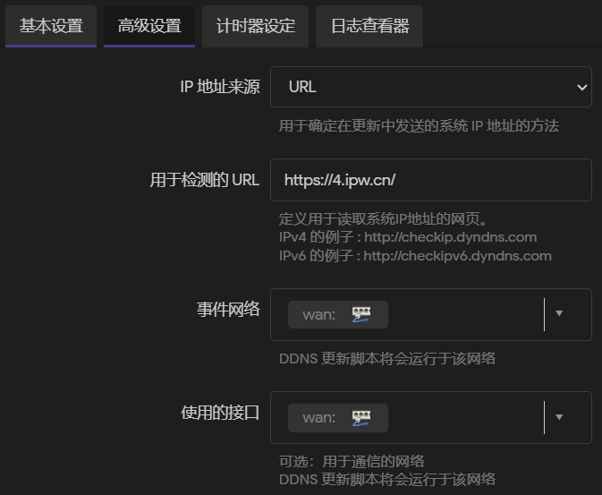
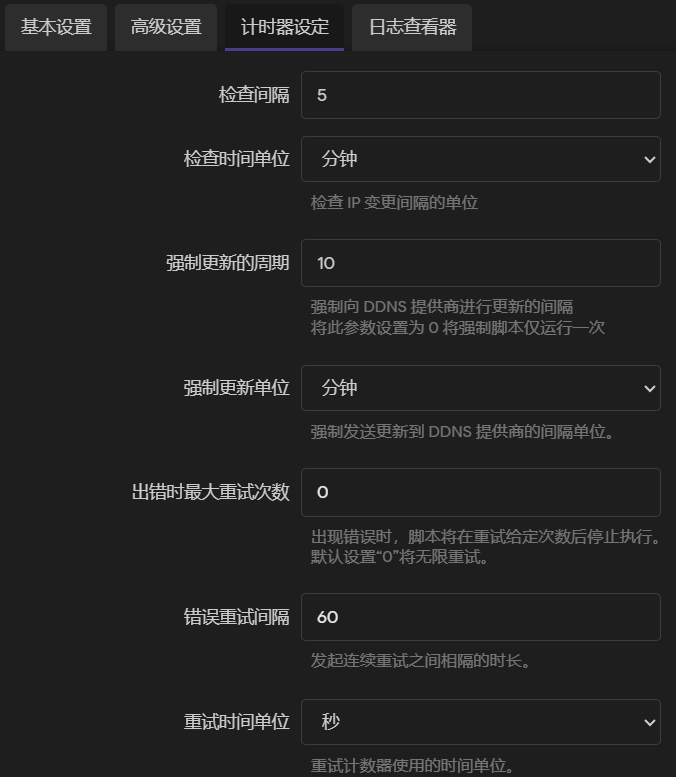

# 华硕路由器

- [IPV6防火墙](https://www.right.com.cn/forum/thread-4052554-1-1.html)：如果IPV6的联机类型为Passthrough（不会有local IVP6地址）或者动态IVP6（local IPV6可能会变），则设置防火墙的时候，本地IP填`::/::`

- [OpenVPN](https://post.smzdm.com/p/am8venrd/)：配置示例如下。如果有配置ddns的话，导出OpenVPN设置文件后记得将IP改成域名

    
    
    - 显示`Authenticate/Decrypt packet error: bad packet ID (may be a replay): [ #106097 ] -- see the man page entry for --no-replay and --replay-window for more info or silence this warning with --mute-replay-warnings`：可能是因为MTU设置不对导致
    
        
    
        - [路由器允许ping](https://jingyan.baidu.com/article/75ab0bcb1b089096864db2fb.html)：路由器后台 => 防火墙 => 响应 ICMP Echo（ping）要求
    
        - [查看路由器的MTU](https://www.sonassi.com/help/troubleshooting/setting-correct-mtu-for-openvpn)：设置初始MTU为1500，使用如下命令，如果显示`需要拆分数据包但是设置 DF`或者`ping: local error: message too long, mtu=1500`，则慢慢降低MTU值，直到成功
    
            ```bash
            ping -n 1 -l 1500 -f www.example.com 	# On Windows
            ping -M do -s 1500 -c 1 www.example.com	# On Linux
            ping -D -v -s 1500 -c 1 www.example.com	# On OSX
            ```
    
        - [修改openvpn的配置文件（.ovpn格式）](https://www.sonassi.com/help/troubleshooting/setting-correct-mtu-for-openvpn)：上面获取的是MTU，但是openvpn需要的是MSS=MTU-40。假设MTU=1470，则MSS=1430，在配置文件中加入如下一行
    
            ```
            mssfix 1430
            ```
    
            

# OpenWRT

## 刷机

- [小米AX3000T刷OpenWRT](https://note.okhk.net/xiaomi-ax3000t-router-install-openwrt-immortalwrt)

## 配置

- 切换[清华镜像](https://mirrors.tuna.tsinghua.edu.cn/help/openwrt/)

    ```bash
    sed -i 's_https\?://downloads.openwrt.org_https://mirrors.tuna.tsinghua.edu.cn/openwrt_' /etc/opkg/distfeeds.conf
    ```

- 安装中文：

    ```bash
    opkg update && opkg install luci-i18n-base-zh-cn
    ```

- 安装主题：[luci-theme-Argon](https://github.com/jerrykuku/luci-theme-argon/tree/master)

    ```c++
    opkg install luci-compat
    opkg install luci-lib-ipkg
    wget --no-check-certificate https://github.com/jerrykuku/luci-theme-argon/releases/download/v2.3.2/luci-theme-argon_2.3.2-r20250207_all.ipk
    opkg install luci-theme-argon*.ipk
    ```

- 安装OpenVPN：

    > [OpenWrt 图形化搭建 OpenVPN 服务 | 个人技术学习](https://6xyun.cn/article/openwrt-install-openvpn)

    

    - 服务端：安装和配置的[官方教程](https://openwrt.org/zh/docs/guide-user/services/vpn/openvpn/server)，以下只做拷贝

        ```bash
        opkg update && opkg install openvpn-openssl openvpn-easy-rsa
        
        # 配置参数  # OVPN_POOL 除了本地网段意外，可以是任何网段。
        OVPN_DIR="/etc/openvpn"
        OVPN_PKI="/etc/easy-rsa/pki"
        OVPN_PORT="10001"
        OVPN_PROTO="udp"
        OVPN_POOL="192.168.8.0 255.255.255.0"
        OVPN_DNS="${OVPN_POOL%.* *}.1"
        OVPN_DOMAIN="$(uci get dhcp.@dnsmasq[0].domain)"
        # 对于非固定ip（例如PPPoE拨号上网）建议通过DDNS将动态IP地址映射到固定的域名
        # 如果在openwrt部署DDNS，从DDNS获取FQDN，作为OVPN_SERV服务器地址
        # 如果DDNS未部署在openwrt上，需自行设定OVPN_SERV
        NET_FQDN="$(uci -q get ddns.@service[0].lookup_host)"
        if [ -n "${NET_FQDN}" ]
        then OVPN_SERV="${NET_FQDN}"
        fi
        
        # 配置参数
        export EASYRSA_PKI="${OVPN_PKI}"
        export EASYRSA_REQ_CN="ovpnca"
        export EASYRSA_BATCH="1"
        export EASYRSA_CERT_EXPIRE="3650" # Increases the client cert expiry from the default of 825 days to match the CA expiry
        # 清空，并初始化 PKI 目录
        easyrsa init-pki
        # 生成 DH 参数
        easyrsa gen-dh
        # 新建 CA
        easyrsa build-ca nopass
        # 生成服务器秘钥和证书
        easyrsa build-server-full server nopass
        openvpn --genkey tls-crypt-v2-server ${EASYRSA_PKI}/private/server.pem
        # 生成客户端秘钥和证书
        easyrsa build-client-full client nopass
        openvpn --tls-crypt-v2 ${EASYRSA_PKI}/private/server.pem \
        --genkey tls-crypt-v2-client ${EASYRSA_PKI}/private/client.pem
        
        # 配置防火墙
        uci rename firewall.@zone[0]="lan"
        uci rename firewall.@zone[1]="wan"
        uci del_list firewall.lan.device="tun+"
        uci add_list firewall.lan.device="tun+"
        uci -q delete firewall.ovpn
        uci set firewall.ovpn="rule"
        uci set firewall.ovpn.name="Allow-OpenVPN"
        uci set firewall.ovpn.src="wan"
        uci set firewall.ovpn.dest_port="${OVPN_PORT}"
        uci set firewall.ovpn.proto="${OVPN_PROTO}"
        uci set firewall.ovpn.target="ACCEPT"
        uci commit firewall
        /etc/init.d/firewall restart
        
        # 配置VPN服务，生成客户端文件
        umask go=
        OVPN_DH="$(cat ${OVPN_PKI}/dh.pem)"
        OVPN_CA="$(openssl x509 -in ${OVPN_PKI}/ca.crt)"
        ls ${OVPN_PKI}/issued \
        | sed -e "s/\.\w*$//" \
        | while read -r OVPN_ID
        do
        OVPN_TC="$(cat ${OVPN_PKI}/private/${OVPN_ID}.pem)"
        OVPN_KEY="$(cat ${OVPN_PKI}/private/${OVPN_ID}.key)"
        OVPN_CERT="$(openssl x509 -in ${OVPN_PKI}/issued/${OVPN_ID}.crt)"
        OVPN_EKU="$(echo "${OVPN_CERT}" | openssl x509 -noout -purpose)"
        case ${OVPN_EKU} in
        (*"SSL server : Yes"*)
        OVPN_CONF="${OVPN_DIR}/${OVPN_ID}.conf"
        cat << EOF > ${OVPN_CONF} ;;
        user nobody
        group nogroup
        dev tun
        port ${OVPN_PORT}
        proto ${OVPN_PROTO}
        server ${OVPN_POOL}
        topology subnet
        client-to-client
        keepalive 10 60
        persist-tun
        persist-key
        push "dhcp-option DNS ${OVPN_DNS}"
        push "dhcp-option DOMAIN ${OVPN_DOMAIN}"
        push "redirect-gateway def1"
        push "persist-tun"
        push "persist-key"
        <dh>
        ${OVPN_DH}
        </dh>
        EOF
        (*"SSL client : Yes"*)
        OVPN_CONF="${OVPN_DIR}/${OVPN_ID}.ovpn"
        cat << EOF > ${OVPN_CONF} ;;
        user nobody
        group nogroup
        dev tun
        nobind
        client
        remote ${OVPN_SERV} ${OVPN_PORT} ${OVPN_PROTO}
        auth-nocache
        remote-cert-tls server
        EOF
        esac
        cat << EOF >> ${OVPN_CONF}
        <tls-crypt-v2>
        ${OVPN_TC}
        </tls-crypt-v2>
        <key>
        ${OVPN_KEY}
        </key>
        <cert>
        ${OVPN_CERT}
        </cert>
        <ca>
        ${OVPN_CA}
        </ca>
        EOF
        done
        /etc/init.d/openvpn restart
        ls ${OVPN_DIR}/*.ovpn
        ```

    - 客户端：安装和配置的[官方教程](https://openwrt.org/zh/docs/guide-user/services/vpn/openvpn/client-luci)

- 安装

    - 服务端

        ```c++
        WG_IF="vpn"
        WG_PORT="51822"
        WG_ADDR="192.168.9.1/24"
        WG_ADDR6="fd00:9::1/64"
        
        # Generate keys
        umask go=
        wg genkey | tee wgserver.key | wg pubkey > wgserver.pub
        wg genkey | tee wgclient.key | wg pubkey > wgclient.pub
        wg genpsk > wgclient.psk
         
        # Server private key
        WG_KEY="$(cat wgserver.key)"
         
        # Pre-shared key
        WG_PSK="$(cat wgclient.psk)"
         
        # Client public key
        WG_PUB="$(cat wgclient.pub)"
            
        # Configure firewall
        uci rename firewall.@zone[0]="lan"
        uci rename firewall.@zone[1]="wan"
        uci del_list firewall.lan.network="${WG_IF}"
        uci add_list firewall.lan.network="${WG_IF}"
        uci -q delete firewall.wg
        uci set firewall.wg="rule"
        uci set firewall.wg.name="Allow-WireGuard"
        uci set firewall.wg.src="wan"
        uci set firewall.wg.dest_port="${WG_PORT}"
        uci set firewall.wg.proto="udp"
        uci set firewall.wg.target="ACCEPT"
        uci commit firewall
        /etc/init.d/firewall restart
        ```

        

- 设置MTU：网络=>接口=>设备，把WAN口对应的设备的MTU

    - 如果WAN口连的其他路由器的LAN口，设备类型为网桥设备，MTU改成和父路由器一样。如果不知道的话可以使用如下命令，找到不显示“需要拆分数据包但是设置 DF”的最大值，然后加28

        ```bash
        ping -f -l 1464 www.bing.com
        ```

- 设置WIFI：2.4G和5G选择信道的时候，还要注意国家代码

    - [GitHub - nivrrex/wifi-bestchannel: OpenWrt下 2.4G Wifi 最优信道选择，use lua and ubus](https://github.com/nivrrex/wifi-bestchannel)

- 安装DDNS

    ```bash
    opkg update && opkg install luci-app-ddns luci-i18n-ddns-zh-cn
    ```

    

    - 配置阿里云：下载[ddns-scripts-aliyun](https://github.com/renndong/ddns-scripts-aliyun)的[ipk](https://github.com/renndong/ddns-scripts-aliyun/releases)

- 配置WOL

    ```bash
    opkg install luci-app-wol luci-i18n-wol-zh-cn
    ```

    
