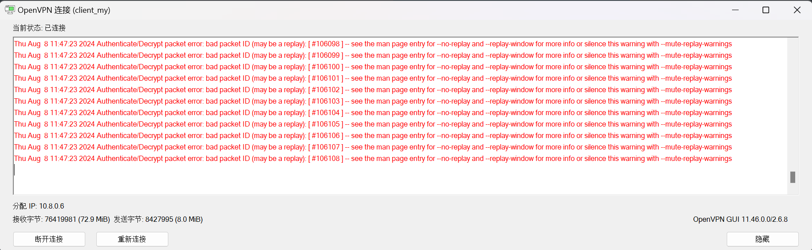

# 华硕路由器

- [IPV6防火墙](https://www.right.com.cn/forum/thread-4052554-1-1.html)：如果IPV6的联机类型为Passthrough（不会有local IVP6地址）或者动态IVP6（local IPV6可能会变），则设置防火墙的时候，本地IP填`::/::`

- [OpenVPN](https://post.smzdm.com/p/am8venrd/)：配置示例如下。如果有配置ddns的话，导出OpenVPN设置文件后记得将IP改成域名

    
    
    - 显示`Authenticate/Decrypt packet error: bad packet ID (may be a replay): [ #106097 ] -- see the man page entry for --no-replay and --replay-window for more info or silence this warning with --mute-replay-warnings`：可能是因为MTU设置不对导致
    
        
    
        - [路由器允许ping](https://jingyan.baidu.com/article/75ab0bcb1b089096864db2fb.html)：路由器后台 => 防火墙 => 响应 ICMP Echo（ping）要求
    
        - [查看路由器的MTU](https://www.sonassi.com/help/troubleshooting/setting-correct-mtu-for-openvpn)：设置初始MTU为1500，使用如下命令，如果显示`需要拆分数据包但是设置 DF`或者`ping: local error: message too long, mtu=1500`，则慢慢降低MTU值，直到成功
    
            ```bash
            ping -n 1 -l 1500 -f www.example.com 	# On Windows
            ping -M do -s 1500 -c 1 www.example.com	# On Linux
            ping -D -v -s 1500 -c 1 www.example.com	# On OSX
            ```
    
        - [修改openvpn的配置文件（.ovpn格式）](https://www.sonassi.com/help/troubleshooting/setting-correct-mtu-for-openvpn)：上面获取的是MTU，但是openvpn需要的是MSS=MTU-40。假设MTU=1470，则MSS=1430，在配置文件中加入如下一行
    
            ```
            mssfix 1430
            ```
    
            

