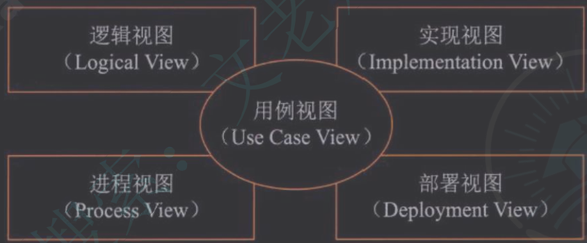
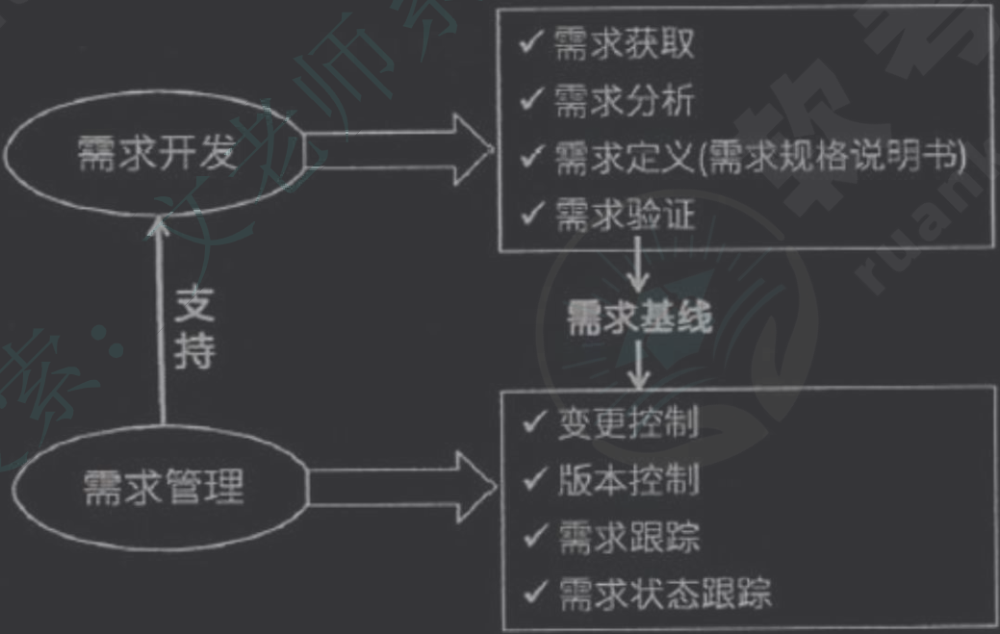
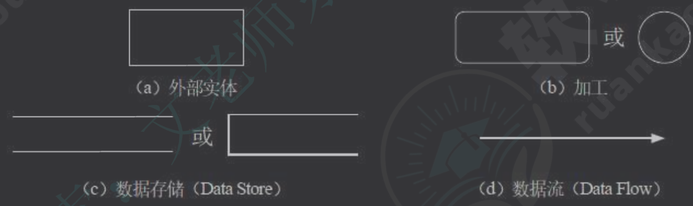
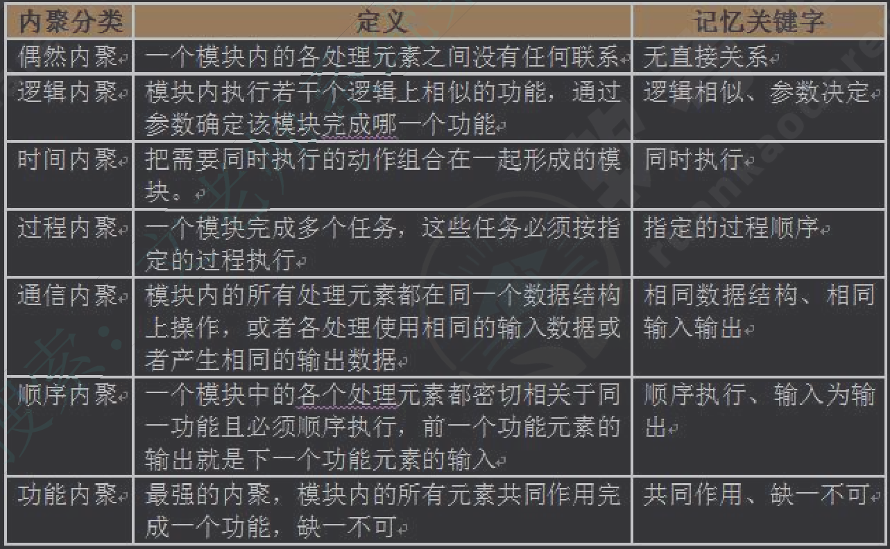
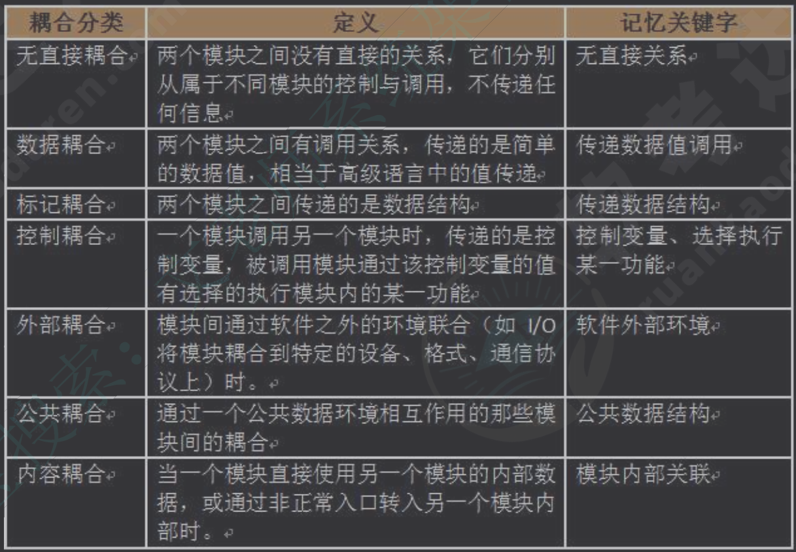
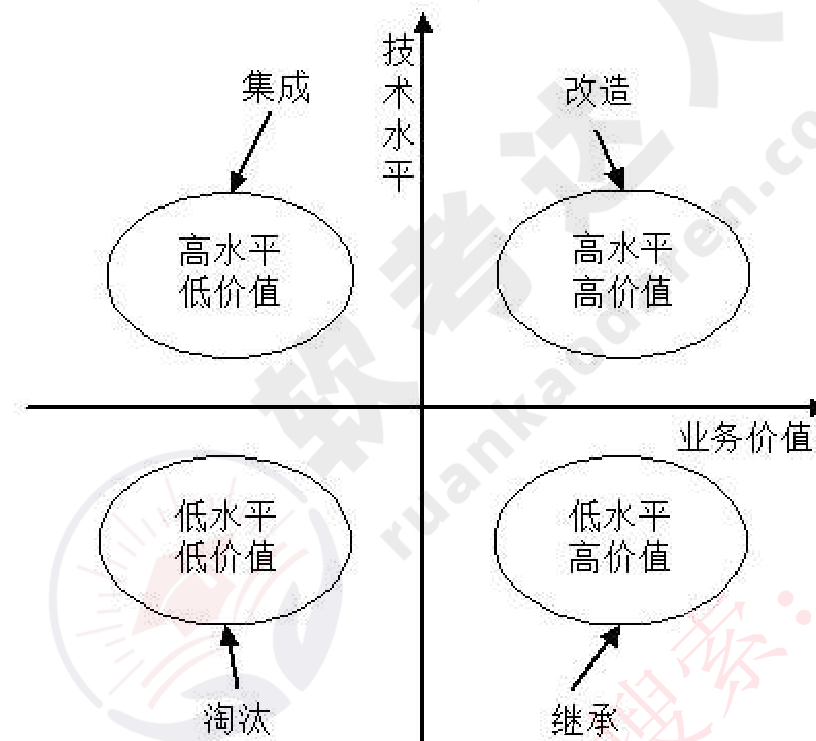
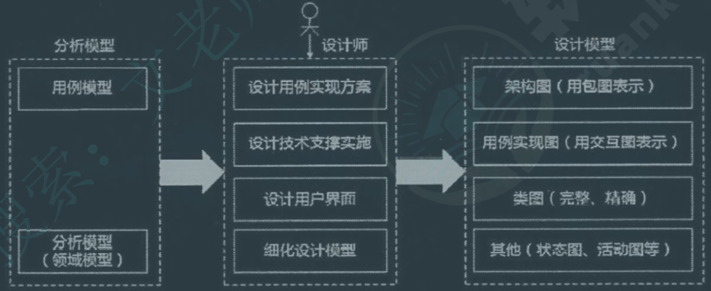

# 文老师

## 10.软件工程

- 软件工程过程：PDCA = plan + do + check + action

### 软件过程模型（开发模型）

> NOTE: 
> - 没有“面向对象模型”
> - 开发模型 != 开发方法

- 瀑布模型（SDLC）：上一个工作的成果 作为下一项工作的输入，适合结构性开发

- 螺旋模型：风险分析；适用于 大型项目，∵风险大

- 原型模型：需求不明确

- 增量模型：优先级最高的服务最先交付，每一次增量的版本都可以演示

- V模型：<u>测试 和 开发并行</u>

- 喷泉模型：已用户需求为动力，<u>面向对象</u>

- 基于构件的开发模型（CBSD）：增强复用性

- 形式化方法：建立在严格数学基础上

- 敏捷模型：个体和交互胜过过程和工具、工用软件胜过文档、客户合作胜过合同谈判、响应变化胜过遵循计划

- 统一过程模型（RUP）：，强调过程

    - 特点：用例驱动、以体系结构为中心、迭代与增量

    - 四个阶段：初始、细化、构造、移交

    - 4+1视图：用例视图（分析人员和测试人员）、逻辑视图（最终用户）、实现视图（程序员）、进程视图（系统集成人员）、部署视图（系统工程师）

        

### 逆向工程

- **再工程** 会生成 一个新版本

### 需求工程

- 结构化的需求分析：自顶向下、逐步分解、面向数据

    - 功能模型 => 数据流图（Data Flow Diagram）：外部实体、加工、数据存储、数据流

        - 数据流的一端必须是加工 
        - 加工 必须有输入&输出，而且 **要求输入要足以产生输出**

        

    - 行为模型 => 状态转换图

    - 数据模型 => E-R图

    - 数据字典：数据流、数据项、数据存储和基本加工。

        - 为了 说明数据流图。注意 没有 外部实体

- 需求定义：① 严格（结构化）定义方法，用于需求明确；② 原型（迭代循环）方法，用于需求不明确

-  流程设计工具：
    - 程序流程图（Program Flow Diagram，PFD）：只包含顺序、选择、循环结构
    - IPO图（input+process+ouput）：包含数据流图
    - N-S图（盒图）：表示嵌套和层次关系，**不适合复杂程序的设计**
    - 问题分析图（PAD）：支持**结构化**程序设计
- 业务流程重组（Business Process Reengineering）的三个原则：以流程为中心、团队管理以人为本、以客户为导向

### 系统化设计

- ★系统化设计基本原理：抽象化、自顶向下、信息隐蔽、（模块内）高内聚、（模块间）低耦合

    

    

    > 设计良好的软件结构，通常 顶层扇出大，中间扇出小，底层扇入大
    >
    > 扇入：直接调用该模块的上级模块的个数。扇入大，模块的复用程度高。
    >
    > 扇出：该模块直接调用的下级模块的个数。扇出大，模块的复杂程度高。

### 人机界面设计

- 三大黄金原则：置于用户控制之下，减少用户记忆负担，保持界面一致性

### 测试基础知识

- 成功的测试是发现了至今尚未发现的错误的测试。

- 测试原则：也要包含不合理、失效的用用例，检验程序是否做了不该做的事，等等

- 测试方法：
    - 静态测试：例如桌前检查、代码审查、代码走查
    - 动态测试：黑盒（功能性）测试、白盒（结构性）测试
    
- 测试阶段：
    - 单元（模块）测试：**测试对象** 可独立编译的程序模块，**依据** 软件详细设计说明书
    - 集成测试（模块之间）：**依据** 软件概要设计文档
    - 确认测试（用户参与）
    - 系统测试：**依据** 用户需求 或 开发合同
    - 配置项测试
    - 回归测试：检查变更部分

    > 单元测试 一般用 白盒测试，系统测试、确认测试 一般用 黑盒测试
    
- 测试用例的设计

    - 黑盒测试用例：等价类划分（一次覆盖较多的有效等价类、一个的无效等价类）、边界值划分、错误推测（经验）、因果图
    - 白盒测试用例：语句覆盖SC（覆盖层级最低）、判定（分支）覆盖DC、条件覆盖CC、条件判定组合覆盖CDC、路径覆盖（覆盖层级最高）

    > 判定覆盖 关心 整个判定表达式 的真/假，条件覆盖 关心 判定表达式的每个条件（不关心 真/假）。

- 软件度量
    - 外部属性：直接测量，例如性能指标
    - 内部指标：间接测量，例如可靠性
    - MaCabe度量法（环路复杂度）：针对有向图
        - 方法：①有向图边数为m，节点数为n，环路复杂度=m-n+2；② 封闭区域个数+1；③ 判定节点（菱形）个数+1；
        - 一般要求圈复杂度 不高于 10

### 系统运行与维护

- 遗留系统的分类

    

- 系统转换：直接转换（风险大）、并行转换、分段转换（用的多，需要协调新旧系统的接口）

- 系统的可维护性：维护人员理解、改正、改动和改进这个软件的难易程度，其评价指标如下：

    - 易分析性。软件产品诊断软件中的缺陷或失效原因或识别待修改部分的能力。
    - 易改变性。软件产品使指定的修改可以被实现的能力，实现包括编码、设计和文档的更改。
    - 稳定性。软件产品避免由于软件修改而造成意外结果的能力。
    - 易测试性。软件产品使已修改软件能被确认的能力。
    - 【不考】维护性的依从性。软件产品遵循与维护性相关的标准或约定的能力。

### 净室软件工程(Cleanroom Software Engineering, CSE)

- 应用数学和统计学理论（函数理论和抽样理论）产生 高质量软件
- 提倡 预防 > 检查和测试，提倡 不需要单元测试

### 基于构件的软件工程(Component-Based Software Engineering, CBSE)

- 哲学：购买而非构造，复用而非开发
- 特征：可组装性、可部署性、文档化、独立化、标准化
- 构件模型包含的要素有接口、使用信息、部署，包含的服务有平台服务（分布式）、支持服务
- 活动：系统需求概览、识别候选构件、根据发现的构件修改需求、体系结构设计、构件定制与适配、组装构件创建系统
- CBSE早期需要完整的需求
- 组装方式：顺序组装、层次组装、叠加组装

## 11.面向对象技术

### 面向对象开发

- 控制类：控制活动流，充当协调者

- 面向对象的分析 包含5个活动：认定对象、组织对象、描述对象间的相互作用关系、确定对象的操作、定义对象的内部信息

- 面向对象需求建模（需求分析）：

    - 用例模型：识别参与者，合并需求获得用例，细化用例描述，调整用例描述（用例图，UML）
    - 分析模型：定义概念类，识别类之间的关系，为类添加职责，建立交互图（类图、对象图、活动图、序列图）

- 面向对象的设计：

    - 分析模型：顶层架构图、用例与用例图、领域概念模型
    - 设计模型：以包图表示的软件体系结构图、以交互图表示的用例实现图、完整精确的类图、针对复杂对象的状态图、用以描述流程化处理过程的活动图

    

    > NOTE：体系结构 = 架构 = architecture

- 面向对象的设计原则：

    - 单一责任原则：
    - 开放封闭原则：可扩展，不可修改
    - 里氏替换原则：子类必须可以替换父类
    - 依赖倒置原则：抽象不依赖细节，细节依赖抽象
    - 接口分离原则：用户依赖抽象，不依赖具体方法

- 面向对象的测试：基本跟之前的一样，分成四个层次 算法层（方法）、类层、模板层、系统层

    > 类层 属于 模块测试，是面向对象测试特有的
