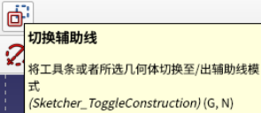
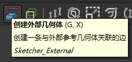
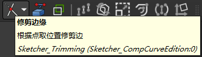

# FreeCAD 1.0 新手入门教程 2025年

> [【中英双语】FreeCAD 1.0 新手入门教程 2025年_哔哩哔哩_bilibili](https://www.bilibili.com/video/BV18dAsepEyx/)
>
> [FreeCAD 1.0 Tutorial for beginners 2025 - YouTube](https://www.youtube.com/watch?v=jULWgMV9_TM)

- FreeCAD采用模块化设计，模块称为工作台（workbenches，简称WB）

- 创建零件的主要模块是零件设计（Part Design）

- 一个Porject中可以有多个Body（主体），一个Body中只能有一个Soild（实体），通过Sketch（草图）创建Soild

- 辅助线（construction line）用于辅助绘图，不参与3D构建

    

- 可以选择已有零件的某个面，然后创建草图。在绘制的时候，可以通过“创建外部几何体”来选择已有零件上的线条等元素

    

- 删除线段可以使用“修建边缘”按钮

    