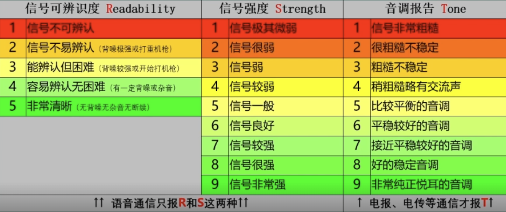
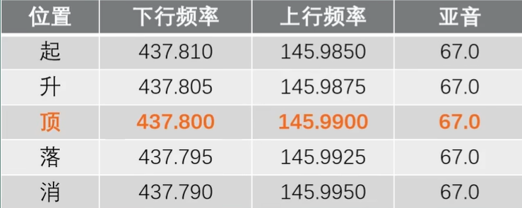
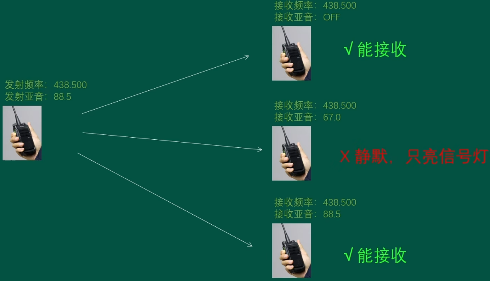
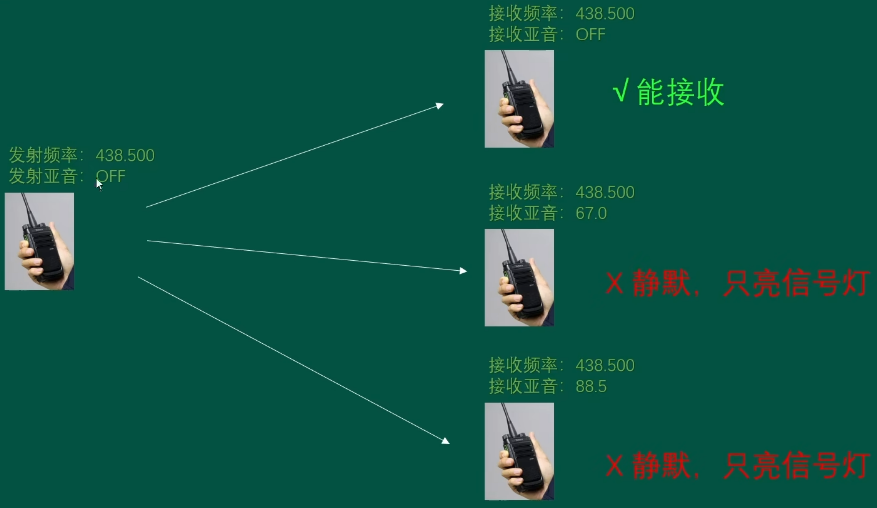
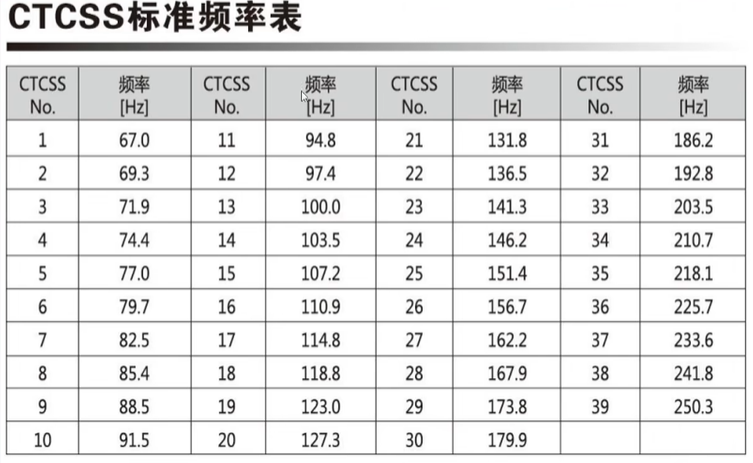
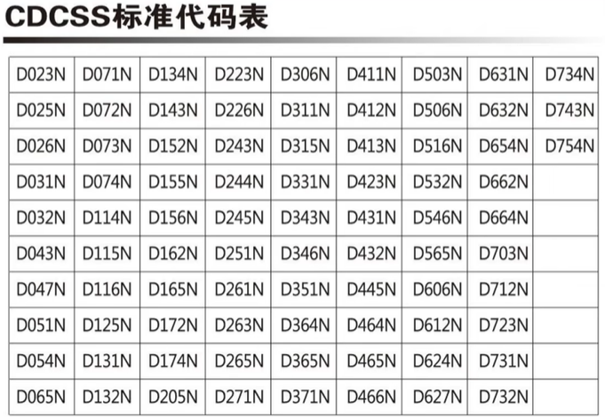

## CQ通联规范、如何给信号报告

- 中文呼叫

    - CQ、CQ、CQ，BH7GCM呼叫。Bravo Hotel Seven Golf Charlie Mikel呼叫，BBH7GCM呼叫频率上的友台
    - 答：BH7GCM，这里是BH7FNI，抄收你信号59

- 英文呼叫：

    - CQ, CQ, CQ. This is BH7GCM. Bravo Hotel Seven Golf Charlie Mike,BH7GCM is calling and standing by. 
    - 答：BH7GCM.This is BH7FNI. Your signal is five nine.

- 业余无线电通联必须的内容：双方呼号+信号报告

- 信号报告（RST）

    

- 字母解释法：常用版

    |                 字母                 |     代码      |          代码原意           | 字母                                 | 代码     | 代码原意                         |
    | :----------------------------------: | :-----------: | :-------------------------: | ------------------------------------ | -------- | -------------------------------- |
    | [A](https://zh.wikipedia.org/wiki/A) | Alpha or Alfa |      首个希腊字母（α）      | [N](https://zh.wikipedia.org/wiki/N) | November | 11月                             |
    | [B](https://zh.wikipedia.org/wiki/B) |     Bravo     |           喝采声            | [O](https://zh.wikipedia.org/wiki/O) | Oscar    | 奥斯卡（男子名）                 |
    | [C](https://zh.wikipedia.org/wiki/C) |    Charlie    |       查理（男子名）        | [P](https://zh.wikipedia.org/wiki/P) | Papa     | 爸爸（许多语言中对于父亲的昵称） |
    | [D](https://zh.wikipedia.org/wiki/D) |     Delta     | 第四个希腊字母（δ）；三角洲 | [Q](https://zh.wikipedia.org/wiki/Q) | Quebec   | 魁北克（加拿大的一个省份）       |
    | [E](https://zh.wikipedia.org/wiki/E) |     Echo      |            回音             | [R](https://zh.wikipedia.org/wiki/R) | Romeo    | 罗密欧（男子名）                 |
    | [F](https://zh.wikipedia.org/wiki/F) |    Foxtrot    |           狐步舞            | [S](https://zh.wikipedia.org/wiki/S) | Sierra   | 山脉                             |
    | [G](https://zh.wikipedia.org/wiki/G) |     Golf      |          高尔夫球           | [T](https://zh.wikipedia.org/wiki/T) | Tango    | 探戈                             |
    | [H](https://zh.wikipedia.org/wiki/H) |     Hotel     |            旅馆             | [U](https://zh.wikipedia.org/wiki/U) | Uniform  | 制服                             |
    | [I](https://zh.wikipedia.org/wiki/I) |     India     |            印度             | [V](https://zh.wikipedia.org/wiki/V) | Victor   | 维克多（男子名）                 |
    | [J](https://zh.wikipedia.org/wiki/J) |    Juliett    |      茱莉叶（女子名）       | [W](https://zh.wikipedia.org/wiki/W) | Whiskey  | 威士忌                           |
    | [K](https://zh.wikipedia.org/wiki/K) |     Kilo      |    千（公制单位的前缀）     | [X](https://zh.wikipedia.org/wiki/X) | X-ray    | X光                              |
    | [L](https://zh.wikipedia.org/wiki/L) |     Lima      |     利马（秘鲁的首都）      | [Y](https://zh.wikipedia.org/wiki/Y) | Yankee   | 北佬（用来称呼美国北方人的俚语） |
    | [M](https://zh.wikipedia.org/wiki/M) |     Mike      |       麦克（男子名）        | [Z](https://zh.wikipedia.org/wiki/Z) | Zulu     | 祖鲁（一个分布于非洲南部的民族） |

    - 还有地名版，但是网上不同地方搜出来的版本不一样，就不贴了

- 其他通联规则

    - B6/BH7GCM:7区的电台带到6区发射，“/”读作portable(便捷、移动设备)，也可以简略成BH7GCM/6
    - BH7GCM/QRP：QRZ表示"谁在呼我？/是不是有人刚在呼我？ "
    - BH7FNI/M：M表示车台
    - QTH:报告你电台位置 
    - 73:结束通联，祝福并再见

## 无线电新人如何不孤单

- 设备自带的扫描功能

    - 尽量高、开阔无遮挡，参数设置正确
    - 扫描≠扫频。扫描是在预设频率之间跳跃，扫频就是遍历所有频率（间隔很小）（可用于知道别的对讲机的频率）
    - 宝锋UV5R，先切换到频率模式，然后长按*键（Scan）

- 使用SDR软件查看周围信号（需额外硬件）

    - 可以同时查看一个频段内所有的信号，支持录制

- 守听当地的中继频率

    - 查询方式：http://weixin.cqcqcq.cn，微信小程序“无线电HAM”=>中继地图，CRCA官网http://www.crac.org.cn/News/Detail?ID=2850
    - 中继的下行频率就是我们接受的频率，上行频率是我们发送的频率
    - 下差就是上行频率比下行频率低多少，上差反过来

- 守听业余卫星中继网上

    - ISS国际空间站、CSS中国空间站

    - 频率设置和中继不一样，要考虑多普勒效应

        

    - 辅助追星软件：[Look4Sat](https://github.com/rt-bishop/Look4Sat)（只有安卓端）

    - 有条件的可以刷OpenGD77固件，可以自动同步频率信息

- 寻找当地的爱好者群（很多加群要呼号)

## 彻底弄明白-亚音/哑音

- 亚音的作用：

    - 可使用“频点”数量增加
    - 抗干扰性增强：过滤效果， 伪“加密”效果，抗噪音效果，中继台抗干扰

- 模拟中继都要设亚音的原因：只转发需要转发的信号。

    - 中继台就是一个信号转发器
    - 中继开启转发： 
        - 以前的中继台，需要先发射中继导频（1750Hz）频率信号，才能开启转发
        - 现在的中继台，发射上行都要带正确的亚音，中继才能开启转发

- 亚音的使用方法

    

    

- 模拟亚音CTCSS：从67.0Hz到250.3Hz，共39个亚音点(或50个)，一般为88.5

    

- 数字亚音CDCSS：用得比较少

    