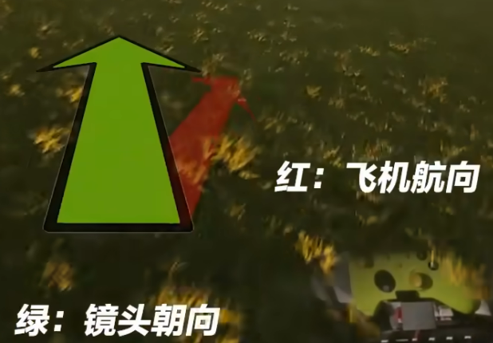

## 遥控器

### 打杆基本功

> 2025-06-19_BV1MXNnzKEXB_毕业！一次搞定穿越机打杆基本功

- **核心理念**: 先打单杆，再打混合杆

#### **准备（第1-3步）**

- 第1步：准备任意穿越机模拟器，对穿越机遥控器进行基础的校准和通道绑定。默认使用美国手（Mode 2）模式

- 第2步：双指握杆（用两个手指头抓住摇杆，更稳定）。美国手通道分布：

    - **左手摇杆上下**：油门（Throttle）

    - **右手摇杆上下**：俯仰（Pitch）

    - **右手摇杆左右**：横滚（Roll）

    - **左手摇杆左右**：偏航（Yaw）

- 第3步：感受油门

    - 直打左手摇杆上下，感受油门通道，不要左右晃动

    - 小游戏：打满油，把飞机抛起来，靠近地面时缓缓给油，以最缓慢的方式贴近地面降落

---

#### 油门+俯仰练习（第4-12步）

- 第4步：稳定悬停，练习5遍

    - **地平线大法**：天地比2:1（镜头30度情况下）

    - 直打油门杆，把飞机飞起来，找到悬停油门杆量

    - 飞机可能会向某个方向小幅飘移，这是正常的

- 第5步：感受俯仰

    - 进入稳定悬停后，左手不动。轻轻推动右摇杆的前和后

- 第6步：向前平飞，不同速度尝试5遍

    - 俯仰时配合轻轻上推油门，不要碰到左右轴

- 第7步：上浮下潜

    - 在平飞基础上，把幅度做得更大。向上和向下做垂直维度的S型运动

- 第8步：俯仰找平，练习5遍

    - 在上浮下潜过程中，回忆飞机放平时的天地比（2:1），俯仰和油门互相配合，快速找到水平姿态

- 第9步：自然减速，练习5遍

    - 向前平飞后，找平俯仰，稍等一会儿，飞机会自然减速（油门保持在悬停油门状态）

- 第10步：蹦蹦跳跳

    - 只利用油门和俯仰两个轴，玩一些简单的动作，纯粹玩

- 第11步：快速抽杆，练习5遍

    - 不看模拟器，只看遥控器摇杆。只打油门杆，快速收油给油

    - **注意**：不要收完，带一点点基本油量，快速抽杆时不要影响偏航轴（不要左右晃动）

- 第12步：紧急减速，**练习10遍**，争取每次都能安全距离刹停

    - 向前飞行，马上遇到障碍物时，快速后仰+快速抽油门杆，进行紧急减速

    - 再打俯仰向前，把机头压正，找回平稳状态

---

#### **横滚练习（第13-19步）**

- 第13步：感受滚转，重复5遍

    - 维持侧向平飞状态，**只打右手摇杆左/右，不要加俯仰**

-  第14步：左右横跳，连续完成5次，保证不炸机

    - 稳定悬停后，连续打横滚和油门（一下左一下右）

- 第15步：横滚找平，练习5次

    - 在左右横跳过程中，找回地平线平直状态

- 第16步：滚转的姿态认知

    - 水平悬停状态打横滚（画面旋转）和 平飞状态下打横滚（镜头旋转质感不同）

- 第17步：不倒翁，反复玩5遍

    - 油门杆打到十字中点（离地面稍高），左手不动，保持持续上升

    - 右手乱动让飞机进入不稳定状态，然后只利用右摇杆**同时配合输入横滚和俯仰**稳定飞机

- 第18步：同时找平，**重复10遍**

    - 把飞机拉高，进入稳定悬停，**闭眼1秒**，然后只动右摇杆随便打

    - 睁眼，快速感知飞机状态，找平，**锻炼空间感和快速识别空间能力**

- 第19步：找平补油，**重复10遍**

    - 飞高一点，**闭眼3秒**，收油，随便打右手杆，把飞机搞歪

    - 睁眼，先用右摇杆找平，再缓慢打油门稳定（不要动偏航）到悬停

---

#### **偏航练习（第20-24步）**

- 第20步：感受偏航

    - 稳定悬停状态左右打一打，多转几圈

- 第21步：克服摇杆

    - 不看模拟器，只看摇杆

    - 在不同位置（0、30、50、70、100%）练习左摇杆左右打

- 第22步：寻迹偏航，做5遍

  - 飞机进入平飞状态，打偏航，不会影响飞机航向（前提是不要影响油门）

  - 寻迹偏航：平飞后打偏航，持续沿着航线前进

- 第23步：协同打杆（纯肌肉记忆）

    - 不看模拟器，只看摇杆

    - 在不同位置（0、30、50、70、100%）练习左右摇杆同时左右打

- 第24步：偏航修正，左侧和右侧各来5遍

    - 飞机平飞状态，打左横滚并保持横滚量

    - 轻轻给一些左偏航，松开两边摇杆，飞机会被"拧正"

    - **原因**：偏航修正了横滚带来的歪姿态

    - 这就是老玩家常说的"多打偏航"

---

#### **高级技巧（第25-30步）**

- 第25步：朝向修正，**暂停练习20遍**

    - 完成偏航修正后，转弯后镜头朝向可能不是飞机航向，有一个小夹角，有点漂移感，有惯性牵引

    - **解决方法**：
      - 等一下，让两个方向统一
      - 给一点油门，加速统一朝向和航向的过程

    - 不同朝向转弯都试一试（急的、缓的），
    - **开始练习的顺序**：平飞→打右摇杆横滚→加左手偏航修正→补油；**熟练后**，转弯是一个细腻连续的调整过程，不是分步动作

- 第26步：心态准备

    - **稳定态**：稳定悬停和平飞（一直练的状态）
    - **混乱态**：错误操作、丢失空间感、撞击或紧急情况

    - 一旦进入混乱态，要有心理准备快速调整飞机姿态，回归稳定态

- 第27步：大半径转弯

    - 沿地图中心建筑外圈，用偏航修正的转弯方式转圈，逆时针和顺时针各10圈

    - **合格标准**：稳定高度，不会因杆量混合导致油门控制不住（上下浮动），飞机航向符合内心预期（如贴近栅栏飞过去）

- 第28步：八字转弯

  - 收紧航线，沿中心建筑的八字航线转圈，顺时针和逆时针各10遍

- 第29步：解决漂移

    - **症状**：航向和镜头朝向不一致
    - **解决方案**：第24、25步

    - 关键：判断飞机往哪个航向运动（哪个方向在拽飞机），针对性调整到想要的镜头朝向

- 第30步：小半径转弯（最难的一步）

    - 建筑栅栏内侧（不超过栅栏高度），沿栅栏内侧做环线绕圈，不发生严重撞击（即使撞击也要快速调整）

    - **要点**：
      - **控制好速度**：俯仰轴不要给太多，低头姿态抬起来一些
      - **提前准备姿态**：入弯前就准备好姿态，速度越快越要提前准备

    - 过充情况：及时向反方向调整并找回来
