# 李宇轩

## 反手高远，场上不慌，后场再无短板

### 介绍与正确&错误示范

- 刚开始练习不能加速，需要等所有动作都会了以后才能加速

### 反手握法

- 正确握法：

    - 首先，中指、无名指、小指握住球拍（宽面），如下图，整个拍子向左倾斜（甚至拍子整体还可以再往左平移一点）。此时，握紧拍子，掌心顶部的肉会鼓起来（这样就可以控拍），而且虎口是空的

        

    - 在比较**主动**的情况下，拇指和中指握住拍子上对角的两个**斜棱**。拇指的内侧放在斜棱上，食指中间段顶在对面的斜棱上

        

    - 在比较**被动**的情况下，拇指和中指握住拍子上对角的两个**侧棱**

    - 大拇指和食指同高或者略高一点

        

- 握拍位置高低都可以，但是握低一些力量更大

- 视频最后有一个握拍转换的练习，即在挥拍的时候从正手握拍变成反手握拍

### 挥拍动作：1架拍，2引拍

- 挥拍分成4部：架拍、引拍、

    - 架拍时，手大概在腰部，手腕往外翻

        

    - 引拍时手腕还是外翻，这样拍头会朝下 而且 离身体很近；手肘不能指向击球点，而是和最后击球时的大臂方向一致

        

- 击球点在斜外角（大概1-2点方向）。如果球从头顶来，可以倾斜身体

# 爱打球的羊

## 发力

### 杀球发力

> 2023-12-15_BV1BC4y1u7EK_想拥有同款钉地板的暴力杀球吗？快进来看看吧！

- 在击球瞬间才握紧球拍，击球瞬间小臂与手腕会出现一个小夹角，击球完成后，肩膀带动大臂随惯性挥下
- 手腕握紧后会出现领先于大小臂的自然前倾

> 2024-11-11_BV1HsmyYHEaR_杀球绵软无力？高远球打不出去？挥拍一卡一卡的？学会顶肘技巧轻松拿捏羽毛球后场发力！

- 胳膊肘位置变化：
    - **架拍时**：胳膊肘位置稍低于肩膀，且在肩膀后面
    - **击球前**：胳膊肘位置明显高于肩膀，且在肩膀前面
- **先向上顶肘，再向前顶肘**，一定要在蹬转完成后再顶肘发力
- **击球瞬间大臂需要制动静止**，以便更好地将力量传导至小臂、手腕和手指

> 2024-11-29_BV1tSziYXEXt_为什么你的杀球压不下来？为什么你的杀球用不上身体的力量？你不能错过的杀球发力教学，一个视频教会你如何狠狠地往地上砸！！！

- 通过**顶髋**实现**下半身先转正**，给予左髋和右肩之间的核心区足够的牵拉效应，从而带动上半身转正
- 在**上半身转正**过程中，将**左肩下拉**以保持**左髋与右肩间核心的拉伸**
- 在左髋与右肩间被拉伸的核心瞬间绷紧，带动**右肩下压**，进而带动大臂小臂挥出击球
- **练习方法**：站在发球线，双脚平行，（自己向上扔球），上半身侧身，直接转体收缩核心击球，注意转体时左肩下拉
    - **砸球练习**：想象用力向地板狠狠砸球，体会左肩下拉和核心收缩的感觉

> [2024-12-09_BV1JYqNYjE9i_羽毛球杀球发不上力、起跳即下坠、重心控制不住？拉转和蹬转的区别是什么？一个视频带你提升发力技巧](https://www.bilibili.com/video/BV1JYqNYjE9i)

- 后场发力的**重心转换由核心区控制**完成，核心绷紧先通过一条腿后蹬带动另一条腿屈膝
- 后场发力分成主动发力和被动发力
- **主动发力**：左脚位置变化不大
    - 左手带动左肩下拉（普通杀球还要动左脚）牵扯核心区，再带动右脚蹬顶右髋带动胳膊挥出，击球瞬间核心收紧，右膝上抬
    - 先动左手左脚是因为不需要制动重心后流
- **被动发力**：左脚位置变化很大，需要**制动重心后流**
    - 使用马来步，右脚确认步到位，然后上蹬 不让重心向后走，蹬起身体后才进行核心牵拉
    - 核心发力的方式是将腿向重心流出的方向后摆
    - 蹬转发力完成等同于完成了折返，便于快速回中

> [2025-03-16_BV1bjQ8YNEjE_学会这招，球场直接封神！杀球集中发力的终极奥义！](https://www.bilibili.com/video/BV1bjQ8YNEjE)

- **内旋发力**：顶肘时，胳膊肘朝前，**大臂停止小臂挥出**，小臂在挥出的同时内旋在击球时转正拍面，**击球后小臂因惯性继续做内旋**，所以击球后，**拍面朝外、胳膊肘朝上**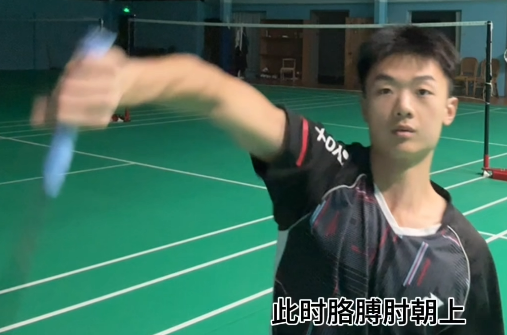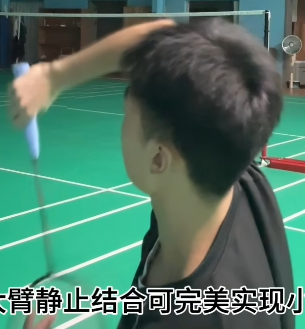

- 杀球太平的问题：想要将高球点下压需要以肘为轴（红线），将小臂甩离大臂这条直线（蓝线），这只有将**小臂继续内旋使胳膊肘朝上、拍面朝右**才能完成

    - 如果击球点比正常的靠后，还要靠手腕

    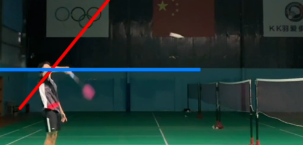

- 顶肘是身体力量通过大臂传导至小臂的基础，也是**大臂挥动的最大距离**

> [2025-05-14_BV136EvzmE8y_超详细羽毛球集中发力扣杀教学 杀球压不住？发力轻飘飘？击球点找不准？一个视频让你拥有发力集中的钉地板扣杀！](https://www.bilibili.com/video/BV136EvzmE8y)

- 发力区间：指手臂挥动到哪里可以击球
    - 抡胳膊的发力区间最大，即肩膀为原点画圆的3/4的圆圈内（排除了身后的1/4）每个点都可以击球，这就是**轮大臂**，区间大导致力发散，而且下压角度小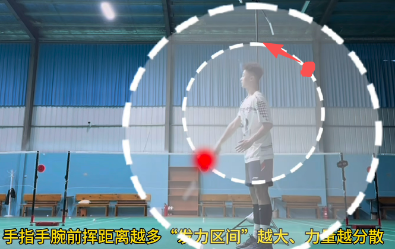
- **正确的发力区间**：以手腕为轴的发力最集中，身体带动大臂前挥，手腕始终位于原定放松，**大臂前挥顶肘后静止带动小臂上挥**， 小臂上挥时手指手腕依旧放松并因小臂上挥而向上移动，小臂上挥结束时内旋完成，最后**手指手腕向下发力**将传递至的力量发出击球
- 扣杀就是把拍子“扣”到球上面去发力，即发力区间是从上到下的
    - 举例：跳起来在身体即将下落的时候同时挥拍，由于发力向下可以将球轻松压住

> [2025-07-04_BV18X3jz3EVF_超详细羽毛球手臂集中发力教学 如何让自己的发力更加集中？如何提高杀球成功率？一个视频学会正确的手臂发力时机与轨迹！](https://www.bilibili.com/video/BV18X3jz3EVF)

- **闪动发力：大臂击球后，在击球点与胳膊肘组成的平面内向后拉动，把拍面停留在击球点**

    - 类似，鞭子向前挥动即将伸直时，再向后拉一下，进行二次甩动，末梢速度更快

    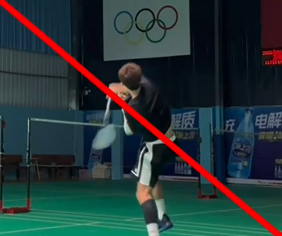 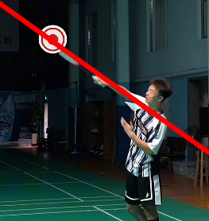

### 手指手腕发力

> [2025-05-17_BV17pJNzrEPj_超详细羽毛球手指手腕发力教学 杀球总下网？发力不集中？手腕经常想罢工？你绝对不能错过的羽毛球手指手腕发力教学！](https://www.bilibili.com/video/BV17pJNzrEPj)

- 手指手腕发力都是一个过程而不是一个瞬间，即发力区间

- **角动量守恒**，将发力区间限制在手指手腕会让线速度变大（类似花样滑冰的转圈）

- **力量由大区间传导到小区间**：

    - 首先身体力量带动大臂进入大臂的发力区间
    - 顶肘完成后**大臂制动**将小臂甩出，力量进入小臂的发力区间
    - **小臂上挥后制动**，将力量传至手指手腕
    - 最后**手指手腕绷紧**挥出击球，即集中发力点存在于手指手腕区间

- 手指手腕正确发力方式：

    - 握拍方式：排除苍蝇拍握法（因为无法制动，形成压手腕） ，将拇指和食指握在两个宽面

    - 首先明白，**手指抓紧**（尤其是拇指）状态下，手腕无法过多前压，**很适合做制动**；想要拍头向前挥动更长距离，需要小臂做内旋

    - 小臂前挥时，手腕放松（但是处于倒手腕的位置）

    - 小臂前挥结束后制动，力量传导至手腕，此时手腕受惯性前挥同时手指发力“握紧”（不等于抓紧），即**小拇指+无名指向掌心握紧**、**食指根部 发力 向前顶**，同时**配合手腕前挥**

        - 小臂制动时，手腕自然放松、掌心向上。**手腕是从掌心朝上这一刻开始发力**。此时还没到击球点

        - 手指手腕是是一体的

            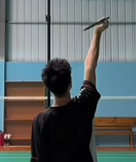

    - 击球瞬间，**大拇指发力制止手腕前挥**，实现“制动”的集中发力

        - 手指的全面握紧实现制动停止发力
        - 一切正确的话，完成这套动作后，拍头会抖

### 跳杀发力

> [2025-03-03_BV1k79iY1EK9_羽毛球力传导总出问题？一个视频提高你的杀球发力！](https://www.bilibili.com/video/BV1k79iY1EK9)

- 跳杀先转下半身的目的是收紧腰腹核心区，再借助收腿顶髋的方式进一步牵拉核心区，挥拍时核心绷紧发力（即挺一下）

- 双脚起跳时先通过弯腿形成背弓牵拉整个核心区，再通过重心转换过程中顶髋等环节将**核心区牵拉效果集中在左髋和右肩这条力线**上

    

- 架拍后，先顶髋（下半身转正，上半身不动）牵拉整体核心区，再**左肩下拉**带动右肩上抬完成身体基本转正，收紧核心区带动右肩带动手臂挥出

## 击球点

### 杀球

> [2025-05-24_BV1VtjtzdEKs_高远球能打到位但杀球依然压不住？一定是顶肘出了问题！羽毛球后场发力最高击球点在哪里？大力扣杀时正确顶肘方式是什么？击球点在身前是什么意思？](https://www.bilibili.com/video/BV1VtjtzdEKs)

- 最高击球点：胳膊自然向上伸直，肩膀是平的、放松的，胳膊肘没有明显弯曲角度 但不绷紧。此时，小臂放松后倒，出现顶肘动作时，肘朝正上方

    - 不是发力向上伸胳膊（肩膀上抬）“够出来的”最高点

    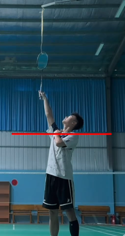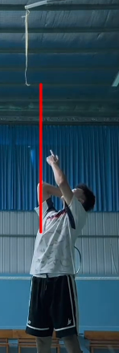

- 大臂前挥越多=>肘位置越低=>击球点越低=>下压角度越小

- 小臂开始前挥的位置=大臂前挥结束的位置

    - 肘的朝向在击球点前面（下图一），球飞行很平

    - **肘的朝向在击球点后面**（下图二），落点尖很多

        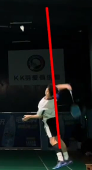

- 顶肘完成得越早，获得得击球点位置越高，下压角度越大

    - 在身体笔直站立时，不要试图抬大臂，会感觉肩膀卡住很难受

    - 正确的顶肘方式：肩膀放松的情况下，**通过身体的倾斜（形成反弓）提高顶肘角度**

        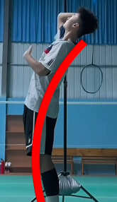

- 大臂前挥 不是 大臂自己发力前挥，而是 **核心收缩带动大臂一起前挥**

    - “身体带动大臂前挥”甚至可以死记硬背成 **大臂前挥角度等于上半身转正角度**
    - 没有反弓 会导致身体转动很懂角度才能完成顶肘，要么顶肘角度过低，要么过度抬大臂导致[肩峰撞击](https://www.bilibili.com/video/BV1EN4y1T758)

> [2025-08-02_BV1KqhNzHEEP_超详细羽毛球击球点教学！90%球友都会犯的击球点错误，明明找准球了可一挥拍发现球在身体后面？为什么杀球总下网或压不住？一个视频解决你关于击球点的难题！](https://www.bilibili.com/video/BV1KqhNzHEEP)

- 击球点：不等于可以击球的点（这样的点很多），而是完成正常发力的点

- 单手上举（上半身自然向左倾斜）的击球点比双手上举（直立）的击球点更高。所以击球时身体不是完全直立 

    - 不过向左倾斜不是为了获取更高的击球点，而是获得足够的发力空间

    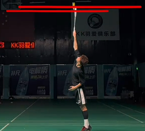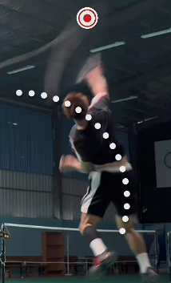

    - 身体直立时，想要大臂停下、小臂前挥的动作时，肘一定是朝后上方的（下图一）。但是身体直立的话，肩膀会被别住，而上半身左倾，动作就顺利多了（下图二）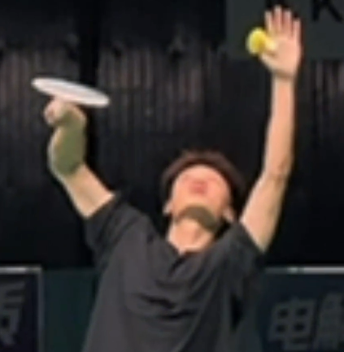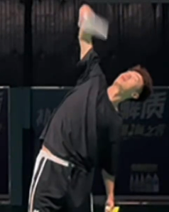

- 羽毛球后退到位时一定要先侧身架拍

- 决定出球角度的不是身体与击球点位置的关系

    - “击球点在身前是杀球、在头顶是平高、在身后是高远”这种说法不对

        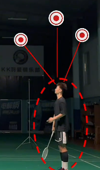

- **击球点不由手的位置决定，而由肘的位置决定**

    - 类似，写字时右臂的位置也是靠肘决定的

    - **肘的位置放在球后面就可以实现下压**。

        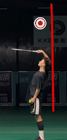

- 正确的顶肘找击球点的方式：重心放右脚架拍、再蹬到左脚（类似扔球的动作）可以利用上身体力量。在**身体“拉着”肘上升至球下落位置时制动定位** 

    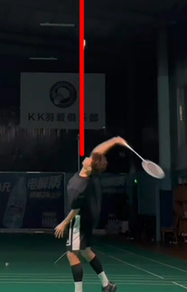

    - 上半身挺直转身的话，肘在前后方向上移动不太容易找准球

        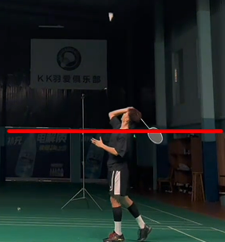

# 练球笔记

## 1月5日

- 平抽的时候，眼睛要低于网的顶部。只有小臂绕肘运动，手腕不要动

## 1月10日

- 反手接进攻球，右脚偏，重心大部分时间都在右脚上。击球的时候，手腕不要动，主要靠小臂

## 1月18日

- 杀球的击球点不在头顶，要往前一些

## 1月24日

- 热身运动*6：[新春跟练特辑丨移动专项步法练习_哔哩哔哩_bilibili](https://www.bilibili.com/video/BV1cS4y1V7xA)

    - 横向并步：重心不要有明显起伏，要等重心挪到前进方向的脚上后再并出去
    - 交叉步移动：交叉的时候要转跨（相当于是扭屁股），手可以抬起来保持平衡
    - 前&&后并步移动：先启动、再并步
    - 高抬腿转跨（前进&后退）：抬腿和转胯是串行的，不能并行

- 四角碰球训练：

    - 在球场四个角上各摆放n=3个球，按照如下轨迹进行跑动
    - 每次触球后要马上从网那一边进行转身
    - 触球的最后一步使用弓箭步，注意膝盖不要超过脚尖
    - 如果俯身触球的时候感觉腿挡住手了，可以把脚往外撇一点，同时把膝盖也往外撇一点
    - 除了正常跑动的步伐，最后一布的弓箭步要保证重心平稳下降（即边跨步、边俯身），不要等跨完步后才俯身

    

- 步伐训练：

    - 在做弓箭步的时候，要后脚跟着地；脚尖朝身体外撇，不要朝内撇，这样不会崴脚
    - 跑动的时候，重心的投影始终要在两脚的凸包内
    
- 力量训练：

    - 提踵：脚尖踩住（可以多踩一点）、后脚跟悬空，然后用小腿的力量尽量把身体抬高。弯曲膝盖效果更佳
    - 抬腿转胯：把凳子放在身体侧边，然后把靠凳子的腿抬起来转90度跨过凳子，然后放下来，再做逆向过程。整个过程要慢
    - [原地专项步法练习](https://www.bilibili.com/video/BV1EF411v7kf)

