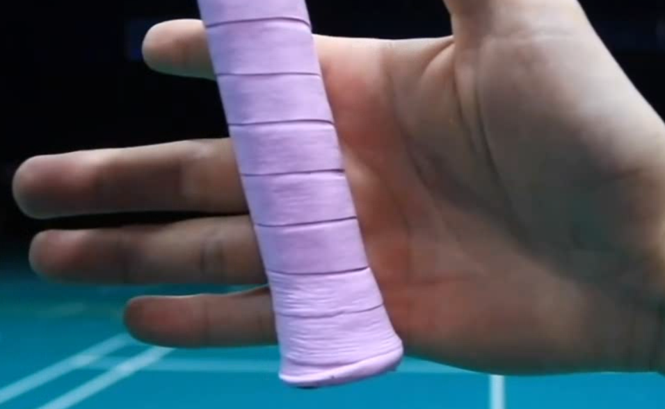
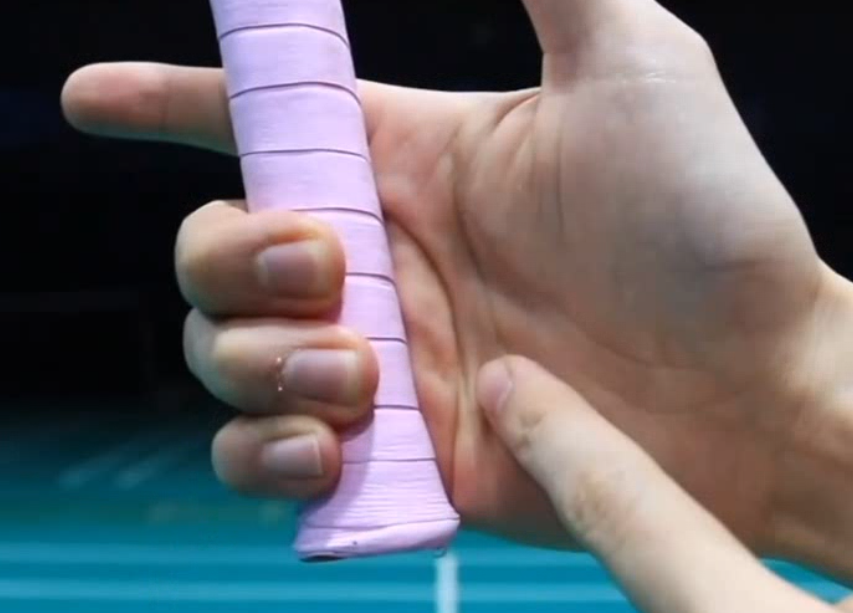
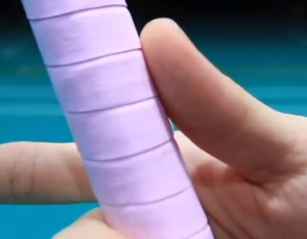
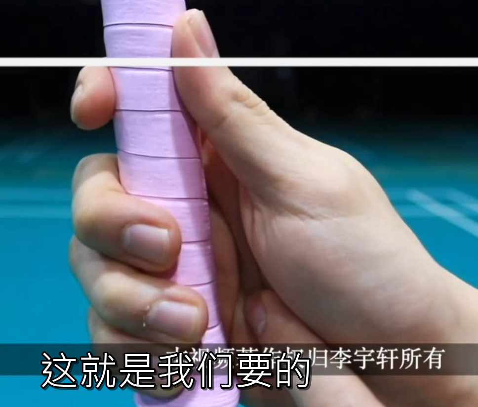
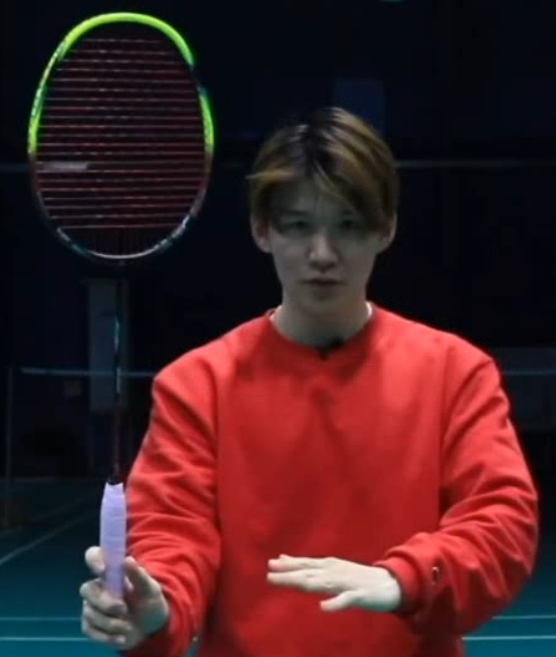
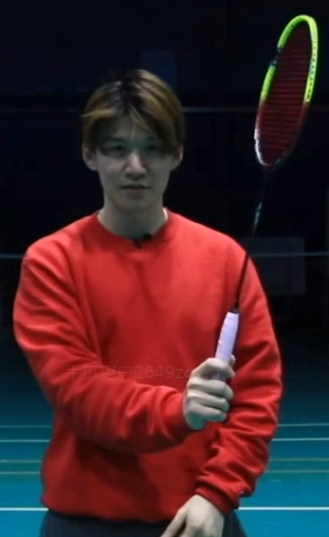
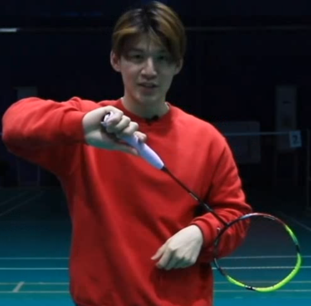
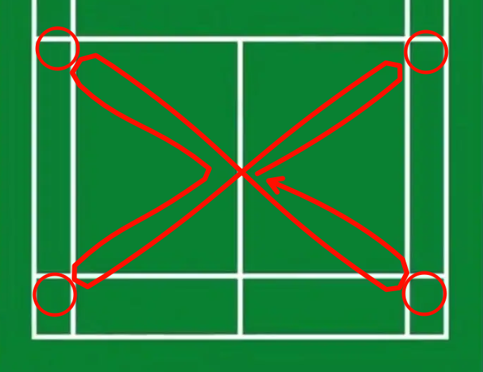

# 反手高远，场上不慌，后场再无短板

## 介绍与正确&错误示范

- 刚开始练习不能加速，需要等所有动作都会了以后才能加速

## 反手握法

- 正确握法：

    - 首先，中指、无名指、小指握住球拍（宽面），如下图，整个拍子向左倾斜（甚至拍子整体还可以再往左平移一点）。此时，握紧拍子，掌心顶部的肉会鼓起来（这样就可以控拍），而且虎口是空的

        

    - 在比较**主动**的情况下，拇指和中指握住拍子上对角的两个**斜棱**。拇指的内侧放在斜棱上，食指中间段顶在对面的斜棱上

        

    - 在比较**被动**的情况下，拇指和中指握住拍子上对角的两个**侧棱**

    - 大拇指和食指同高或者略高一点

        

- 握拍位置高低都可以，但是握低一些力量更大

- 视频最后有一个握拍转换的练习，即在挥拍的时候从正手握拍变成反手握拍

## 挥拍动作：1架拍，2引拍

- 挥拍分成4部：架拍、引拍、

    - 架拍时，手大概在腰部，手腕往外翻

        

    - 引拍时手腕还是外翻，这样拍头会朝下 而且 离身体很近；手肘不能指向击球点，而是和最后击球时的大臂方向一致

        

- 击球点在斜外角（大概1-2点方向）。如果球从头顶来，可以倾斜身体

# 练球笔记

## 1月5日

- 平抽的时候，眼睛要低于网的顶部。只有小臂绕肘运动，手腕不要动

## 1月10日

- 反手接进攻球，右脚偏，重心大部分时间都在右脚上。击球的时候，手腕不要动，主要靠小臂

## 1月18日

- 杀球的击球点不在头顶，要往前一些

## 1月24日

- 热身运动*6：[新春跟练特辑丨移动专项步法练习_哔哩哔哩_bilibili](https://www.bilibili.com/video/BV1cS4y1V7xA)

    - 横向并步：重心不要有明显起伏，要等重心挪到前进方向的脚上后再并出去
    - 交叉步移动：交叉的时候要转跨（相当于是扭屁股），手可以抬起来保持平衡
    - 前&&后并步移动：先启动、再并步
    - 高抬腿转跨（前进&后退）：抬腿和转胯是串行的，不能并行

- 四角碰球训练：

    - 在球场四个角上各摆放n=3个球，按照如下轨迹进行跑动
    - 每次触球后要马上从网那一边进行转身
    - 触球的最后一步使用弓箭步，注意膝盖不要超过脚尖
    - 如果俯身触球的时候感觉腿挡住手了，可以把脚往外撇一点，同时把膝盖也往外撇一点
    - 除了正常跑动的步伐，最后一布的弓箭步要保证重心平稳下降（即边跨步、边俯身），不要等跨完步后才俯身

    

- 步伐训练：

    - 在做弓箭步的时候，要后脚跟着地；脚尖朝身体外撇，不要朝内撇，这样不会崴脚
    - 跑动的时候，重心的投影始终要在两脚的凸包内
    
- 力量训练：

    - 提踵：脚尖踩住（可以多踩一点）、后脚跟悬空，然后用小腿的力量尽量把身体抬高。弯曲膝盖效果更佳
    - 抬腿转胯：把凳子放在身体侧边，然后把靠凳子的腿抬起来转90度跨过凳子，然后放下来，再做逆向过程。整个过程要慢
    - [原地专项步法练习](https://www.bilibili.com/video/BV1EF411v7kf)

