# 李宇轩

## 反手高远，场上不慌，后场再无短板

### 介绍与正确&错误示范

- 刚开始练习不能加速，需要等所有动作都会了以后才能加速

### 反手握法

- 正确握法：

    - 首先，中指、无名指、小指握住球拍（宽面），如下图，整个拍子向左倾斜（甚至拍子整体还可以再往左平移一点）。此时，握紧拍子，掌心顶部的肉会鼓起来（这样就可以控拍），而且虎口是空的

        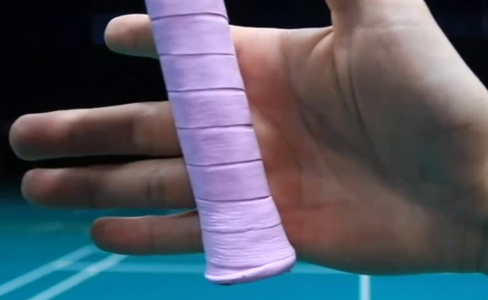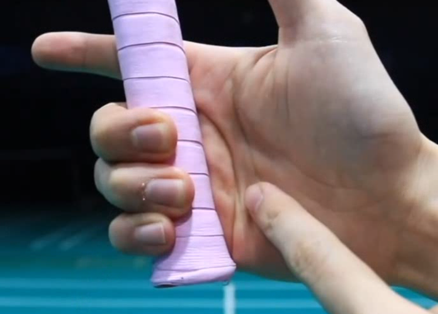

    - 在比较**主动**的情况下，拇指和中指握住拍子上对角的两个**斜棱**。拇指的内侧放在斜棱上，食指中间段顶在对面的斜棱上

        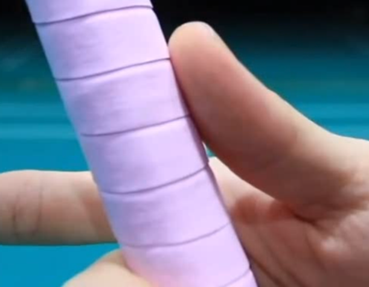

    - 在比较**被动**的情况下，拇指和中指握住拍子上对角的两个**侧棱**

    - 大拇指和食指同高或者略高一点

        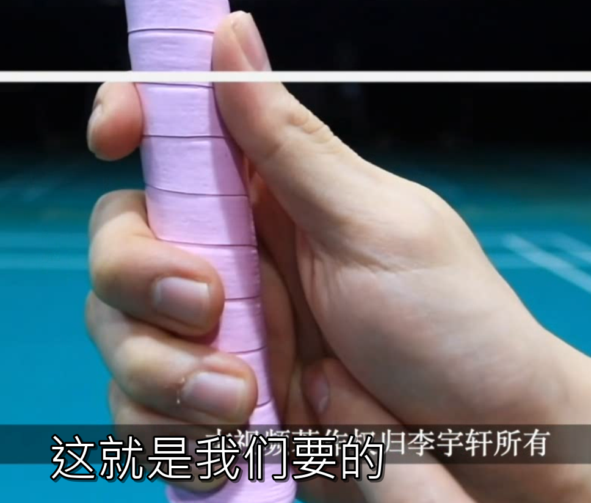

- 握拍位置高低都可以，但是握低一些力量更大

- 视频最后有一个握拍转换的练习，即在挥拍的时候从正手握拍变成反手握拍

### 挥拍动作：1架拍，2引拍

- 挥拍分成4部：架拍、引拍、

    - 架拍时，手大概在腰部，手腕往外翻

        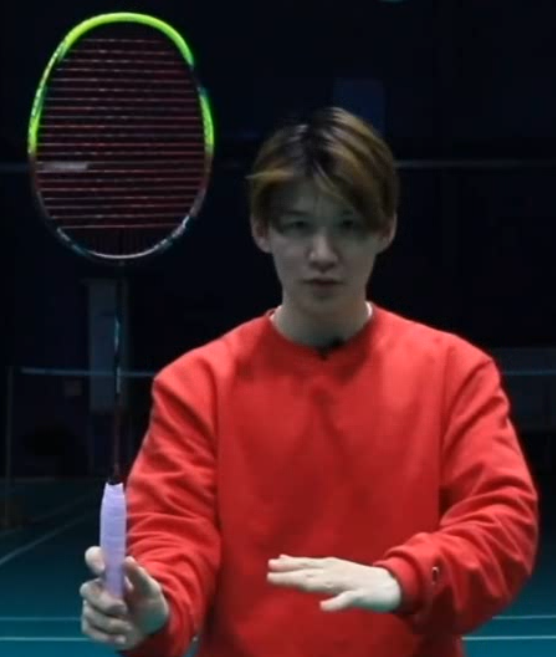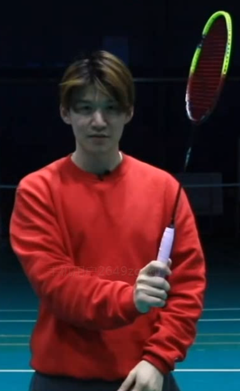

    - 引拍时手腕还是外翻，这样拍头会朝下 而且 离身体很近；手肘不能指向击球点，而是和最后击球时的大臂方向一致

        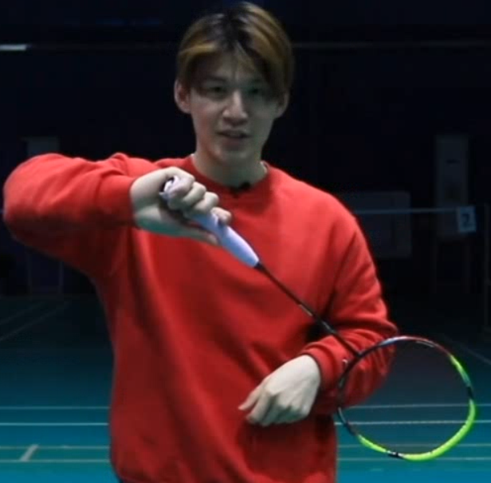

- 击球点在斜外角（大概1-2点方向）。如果球从头顶来，可以倾斜身体

# 爱打球的羊

## 发力

### 杀球发力

> 2023-12-15_BV1BC4y1u7EK_想拥有同款钉地板的暴力杀球吗？快进来看看吧！

- 在击球瞬间才握紧球拍，击球瞬间小臂与手腕会出现一个小夹角，击球完成后，肩膀带动大臂随惯性挥下
- 手腕握紧后会出现领先于大小臂的自然前倾

> 2024-11-11_BV1HsmyYHEaR_杀球绵软无力？高远球打不出去？挥拍一卡一卡的？学会顶肘技巧轻松拿捏羽毛球后场发力！

- 胳膊肘位置变化：
    - **架拍时**：胳膊肘位置稍低于肩膀，且在肩膀后面
    - **击球前**：胳膊肘位置明显高于肩膀，且在肩膀前面
- **先向上顶肘，再向前顶肘**，一定要在蹬转完成后再顶肘发力
- **击球瞬间大臂需要制动静止**，以便更好地将力量传导至小臂、手腕和手指

> 2024-11-29_BV1tSziYXEXt_为什么你的杀球压不下来？为什么你的杀球用不上身体的力量？你不能错过的杀球发力教学，一个视频教会你如何狠狠地往地上砸！！！

- 通过**顶髋**实现**下半身先转正**，给予左髋和右肩之间的核心区足够的牵拉效应，从而带动上半身转正
- 在**上半身转正**过程中，将**左肩下拉**以保持**左髋与右肩间核心的拉伸**
- 在左髋与右肩间被拉伸的核心瞬间绷紧，带动**右肩下压**，进而带动大臂小臂挥出击球
- **练习方法**：站在发球线，双脚平行，（自己向上扔球），上半身侧身，直接转体收缩核心击球，注意转体时左肩下拉
    - **砸球练习**：想象用力向地板狠狠砸球，体会左肩下拉和核心收缩的感觉

> [2024-12-09_BV1JYqNYjE9i_羽毛球杀球发不上力、起跳即下坠、重心控制不住？拉转和蹬转的区别是什么？一个视频带你提升发力技巧](https://www.bilibili.com/video/BV1JYqNYjE9i)

- 后场发力的**重心转换由核心区控制**完成，核心绷紧先通过一条腿后蹬带动另一条腿屈膝
- 后场发力分成主动发力和被动发力
- **主动发力**：左脚位置变化不大
    - 左手带动左肩下拉（普通杀球还要动左脚）牵扯核心区，再带动右脚蹬顶右髋带动胳膊挥出，击球瞬间核心收紧，右膝上抬
    - 先动左手左脚是因为不需要制动重心后流
- **被动发力**：左脚位置变化很大，需要**制动重心后流**
    - 使用马来步，右脚确认步到位，然后上蹬 不让重心向后走，蹬起身体后才进行核心牵拉
    - 核心发力的方式是将腿向重心流出的方向后摆
    - 蹬转发力完成等同于完成了折返，便于快速回中

> [2025-03-16_BV1bjQ8YNEjE_学会这招，球场直接封神！杀球集中发力的终极奥义！](https://www.bilibili.com/video/BV1bjQ8YNEjE)

- **内旋发力**：顶肘时，胳膊肘朝前，**大臂停止小臂挥出**，小臂在挥出的同时内旋在击球时转正拍面，**击球后小臂因惯性继续做内旋**，所以击球后，**拍面朝外、胳膊肘朝上**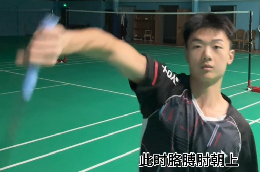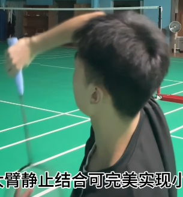

- 杀球太平的问题：想要将高球点下压需要以肘为轴（红线），将小臂甩离大臂这条直线（蓝线），这只有将**小臂继续内旋使胳膊肘朝上、拍面朝右**才能完成

    - 如果击球点比正常的靠后，还要靠手腕

    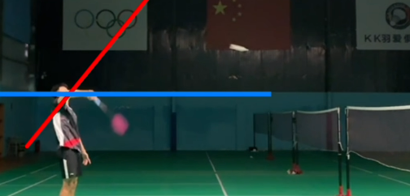

- 顶肘是身体力量通过大臂传导至小臂的基础，也是**大臂挥动的最大距离**

> [2025-05-14_BV136EvzmE8y_超详细羽毛球集中发力扣杀教学 杀球压不住？发力轻飘飘？击球点找不准？一个视频让你拥有发力集中的钉地板扣杀！](https://www.bilibili.com/video/BV136EvzmE8y)

- 发力区间：指手臂挥动到哪里可以击球
    - 抡胳膊的发力区间最大，即肩膀为原点画圆的3/4的圆圈内（排除了身后的1/4）每个点都可以击球，这就是**轮大臂**，区间大导致力发散，而且下压角度小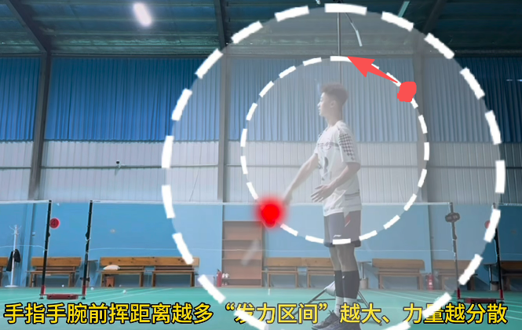
- **正确的发力区间**：以手腕为轴的发力最集中，身体带动大臂前挥，手腕始终位于原定放松，**大臂前挥顶肘后静止带动小臂上挥**， 小臂上挥时手指手腕依旧放松并因小臂上挥而向上移动，小臂上挥结束时内旋完成，最后**手指手腕向下发力**将传递至的力量发出击球
- 扣杀就是把拍子“扣”到球上面去发力，即发力区间是从上到下的
    - 举例：跳起来在身体即将下落的时候同时挥拍，由于发力向下可以将球轻松压住

> [2025-07-04_BV18X3jz3EVF_超详细羽毛球手臂集中发力教学 如何让自己的发力更加集中？如何提高杀球成功率？一个视频学会正确的手臂发力时机与轨迹！](https://www.bilibili.com/video/BV18X3jz3EVF)

- **闪动发力：大臂击球后，在击球点与胳膊肘组成的平面内向后拉动，把拍面停留在击球点**

    - 类似，鞭子向前挥动即将伸直时，再向后拉一下，进行二次甩动，末梢速度更快

    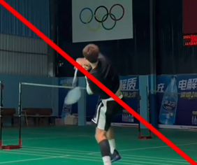 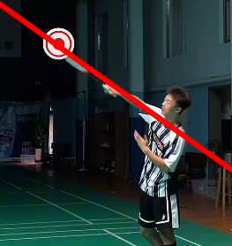

### 手指手腕发力

> [2025-05-17_BV17pJNzrEPj_超详细羽毛球手指手腕发力教学 杀球总下网？发力不集中？手腕经常想罢工？你绝对不能错过的羽毛球手指手腕发力教学！](https://www.bilibili.com/video/BV17pJNzrEPj)

- 手指手腕发力都是一个过程而不是一个瞬间，即发力区间

- **角动量守恒**，将发力区间限制在手指手腕会让线速度变大（类似花样滑冰的转圈）

- **力量由大区间传导到小区间**：

    - 首先身体力量带动大臂进入大臂的发力区间
    - 顶肘完成后**大臂制动**将小臂甩出，力量进入小臂的发力区间
    - **小臂上挥后制动**，将力量传至手指手腕
    - 最后**手指手腕绷紧**挥出击球，即集中发力点存在于手指手腕区间

- 手指手腕正确发力方式：

    - 握拍方式：排除苍蝇拍握法（因为无法制动，形成压手腕） ，将拇指和食指握在两个宽面

    - 首先明白，**手指抓紧**（尤其是拇指）状态下，手腕无法过多前压，**很适合做制动**；想要拍头向前挥动更长距离，需要小臂做内旋

    - 小臂前挥时，手腕放松（但是处于倒手腕的位置）

    - 小臂前挥结束后制动，力量传导至手腕，此时手腕受惯性前挥同时手指发力“握紧”（不等于抓紧），即**小拇指+无名指向掌心握紧**、**食指根部 发力 向前顶**，同时**配合手腕前挥**

        - 小臂制动时，手腕自然放松、掌心向上。**手腕是从掌心朝上这一刻开始发力**。此时还没到击球点

        - 手指手腕是是一体的

            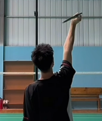

    - 击球瞬间，**大拇指发力制止手腕前挥**，实现“制动”的集中发力

        - 手指的全面握紧实现制动停止发力
        - 一切正确的话，完成这套动作后，拍头会抖

### 跳杀发力

> [2025-03-03_BV1k79iY1EK9_羽毛球力传导总出问题？一个视频提高你的杀球发力！](https://www.bilibili.com/video/BV1k79iY1EK9)

- 跳杀先转下半身的目的是收紧腰腹核心区，再借助收腿顶髋的方式进一步牵拉核心区，挥拍时核心绷紧发力（即挺一下）

- 双脚起跳时先通过弯腿形成背弓牵拉整个核心区，再通过重心转换过程中顶髋等环节将**核心区牵拉效果集中在左髋和右肩这条力线**上

    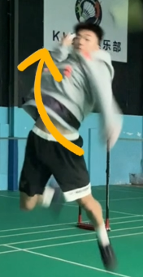

- 架拍后，先顶髋（下半身转正，上半身不动）牵拉整体核心区，再**左肩下拉**带动右肩上抬完成身体基本转正，收紧核心区带动右肩带动手臂挥出

## 击球点

### 杀球

> [2025-05-24_BV1VtjtzdEKs_高远球能打到位但杀球依然压不住？一定是顶肘出了问题！羽毛球后场发力最高击球点在哪里？大力扣杀时正确顶肘方式是什么？击球点在身前是什么意思？](https://www.bilibili.com/video/BV1VtjtzdEKs)

- 最高击球点：胳膊自然向上伸直，肩膀是平的、放松的，胳膊肘没有明显弯曲角度 但不绷紧。此时，小臂放松后倒，出现顶肘动作时，肘朝正上方

    - 不是发力向上伸胳膊（肩膀上抬）“够出来的”最高点

    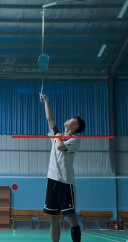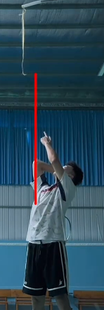

- 大臂前挥越多=>肘位置越低=>击球点越低=>下压角度越小

- 小臂开始前挥的位置=大臂前挥结束的位置

    - 肘的朝向在击球点前面（下图一），球飞行很平

    - **肘的朝向在击球点后面**（下图二），落点尖很多

        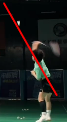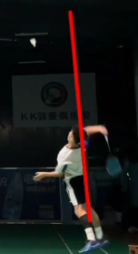

- 顶肘完成得越早，获得得击球点位置越高，下压角度越大

    - 在身体笔直站立时，不要试图抬大臂，会感觉肩膀卡住很难受

    - 正确的顶肘方式：肩膀放松的情况下，**通过身体的倾斜（形成反弓）提高顶肘角度**

        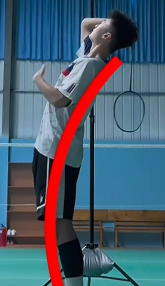

- 大臂前挥 不是 大臂自己发力前挥，而是 **核心收缩带动大臂一起前挥**

    - “身体带动大臂前挥”甚至可以死记硬背成 **大臂前挥角度等于上半身转正角度**
    - 没有反弓 会导致身体转动很懂角度才能完成顶肘，要么顶肘角度过低，要么过度抬大臂导致[肩峰撞击](https://www.bilibili.com/video/BV1EN4y1T758)

> [2025-08-02_BV1KqhNzHEEP_超详细羽毛球击球点教学！90%球友都会犯的击球点错误，明明找准球了可一挥拍发现球在身体后面？为什么杀球总下网或压不住？一个视频解决你关于击球点的难题！](https://www.bilibili.com/video/BV1KqhNzHEEP)

- 击球点：不等于可以击球的点（这样的点很多），而是完成正常发力的点

- 单手上举（上半身自然向左倾斜）的击球点比双手上举（直立）的击球点更高。所以击球时身体不是完全直立 

    - 不过向左倾斜不是为了获取更高的击球点，而是获得足够的发力空间

    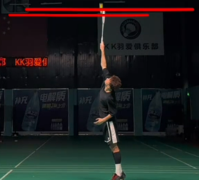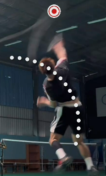

    - 身体直立时，想要大臂停下、小臂前挥的动作时，肘一定是朝后上方的（下图一）。但是身体直立的话，肩膀会被别住，而上半身左倾，动作就顺利多了（下图二）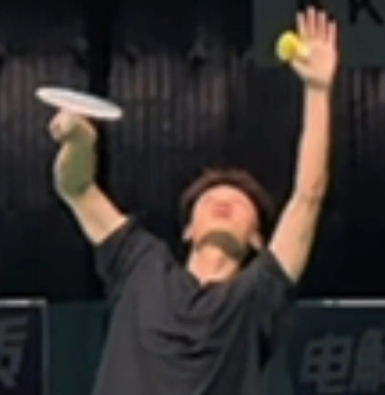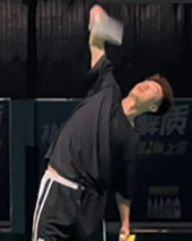

- 羽毛球后退到位时一定要先侧身架拍

- 决定出球角度的不是身体与击球点位置的关系

    - “击球点在身前是杀球、在头顶是平高、在身后是高远”这种说法不对

        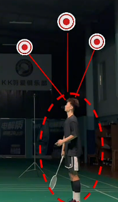

- **击球点不由手的位置决定，而由肘的位置决定**

    - 类似，写字时右臂的位置也是靠肘决定的

    - **肘的位置放在球后面就可以实现下压**。

        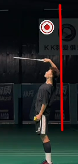

- 正确的顶肘找击球点的方式：重心放右脚架拍、再蹬到左脚（类似扔球的动作）可以利用上身体力量。在**身体“拉着”肘上升至球下落位置时制动定位** 

    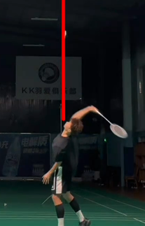

    - 上半身挺直转身的话，肘在前后方向上移动不太容易找准球

        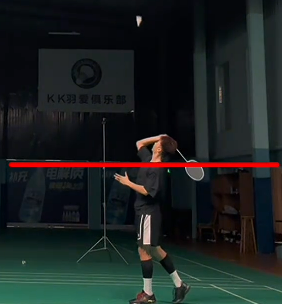

## 跳杀

> [2024-09-26_BV1U3x7eSEpg_跳杀绵软无力？起跳即下坠？发力即平抽？第一期跳杀发力技巧，启动！](https://www.bilibili.com/video/BV1U3x7eSEpg)

- 蹬转和下压之间的关系：

    - 对方推头顶平高，羊在右脚到位做确认步时不向上蹬，直接转体打球
    - 先**蹬**让身体获得一个向上的力，转体后的力传导才能**下压**
    - 杀球是蹬转的进阶

- 蹬转：**蹬**是向上蹬，**转**是右脚蹬后带着右胯转正

- 蹬转的初心：

    - 起跳是腿先给予了身体一个向上的初始力量，起跳后力量开始向上传导，转体是为了把这个力量从身体传导至球拍击球 
    - 只有展腹是不够的，仅仅展腹并不能将传过核心区的力量更大化

- **正确的跳杀**

    - 起跳开始时上身微展腹，在击球前下半身先完成转体，从而近一步拉紧核心，击球时结合腿部上蹬的力和核心拉紧的力，带动肩、大臂小臂手腕手指握紧发力

    - 上半身是因为挥拍击球而转正，不可以主动去转上半身，不然核心区绷紧的力量就没了！

        - 比如下图中可以明显发现下半身已经转体完成了，上半身还在架拍状态

            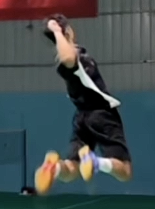

> [2024-09-28_BV1ydxPeGE6G_羽毛球学会了核心发力以后，空有一身力气但用不到击球上？一顿发力猛如虎，结果球速五十五？第二期跳杀视频来啦！！！](https://www.bilibili.com/video/BV1ydxPeGE6G)

- 利用核心更好地发力：右手放松随挥的方向就是发力的方向，而为了更好的发力，大家都上半身倾斜将右肩置于左肩上方，进一步拉伸核心力量
- 力量的传导：
    - 腿部发力上蹬，力量传到胯时，顶右胯，下半身转正，绷紧核心
    - 左手下拉，左肩降低，右肘上顶，右肩上抬，让汇聚的力量进一步顺着右肩传递至手腕
    - 最后击球时收紧核心，手腕控制出球角度，肩膀带动整体手臂，把球向下砸

> [2024-09-29_BV1dNxyeBEx4_你还在跳起来平抽吗？羽毛球跳杀如何把角度杀得尖，第三期跳杀教学看完我现在强得可怕！](https://www.bilibili.com/video/BV1dNxyeBEx4)

- 为了让力量极致传导，在击球瞬间大臂一定处于静止状态，此时球下压的角度是由手腕、胳膊肘共同决定的

- 让肘和手腕共同下压的方法：大臂静止，小臂内旋，胳膊肘上方，同时上身向左侧倾斜

    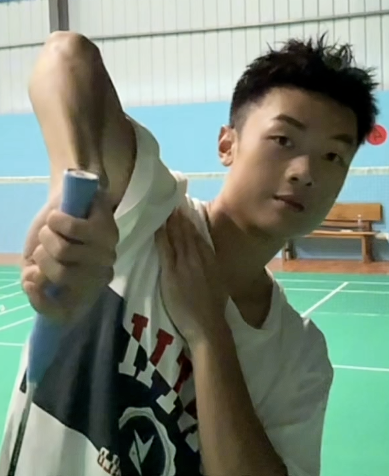

- 起跳时机和击球点的关系：起跳会给身体一个向上的力，只有在身体处于一个向上的力的情况下，才能把对你飞来的球向下砸；只要是在向上的力未停止前的击球，都是可以把球压下来的

    - 在击球时身体达到最高点，击球后正好下坠**可以将球下压**
    - 在身体到达最高点前击球，击球后身体还在上升，也**可把球下压**
    - 在身体开始下落后击球，此时又发不上力又无法下压

> [2025-03-03_BV1k79iY1EK9_羽毛球力传导总出问题？一个视频提高你的杀球发力！](https://www.bilibili.com/video/BV1k79iY1EK9)

- 先转下半身的目的是绷紧腰腹核心区，借助收腿顶髋的方式进一步牵拉核心区，挥拍时核心绷紧发力：就是所谓的挺一下

- 我们需要身体转正时右肩与左髋的力线处于绷紧状态，但左肩只往后拉带动身体转正时是左肩与右肩的力线绷紧，所以重心转换带来核心绷紧的力量在身体转正时又消失了，正确的方法是将**左肩下拉**，左肩下拉带动右肩上抬，此时可完美进一步牵拉左髋与右肩间的核心区

    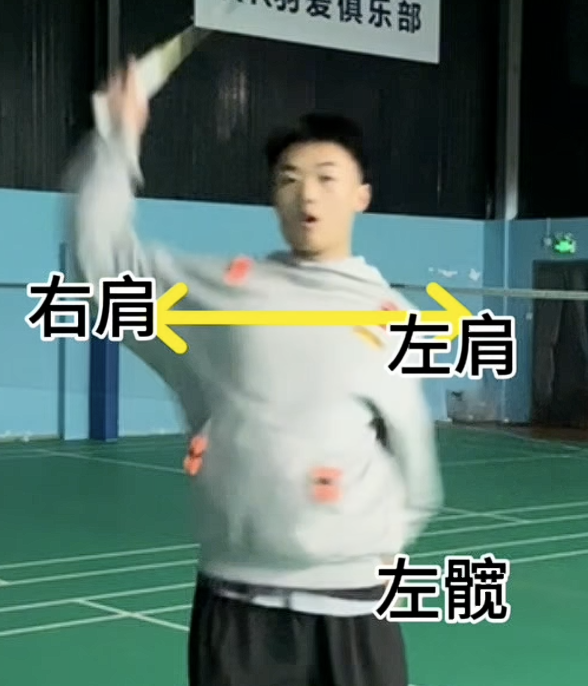

> [2025-03-24_BV1Roo2YzEhK_双脚跳杀不会滞空蓄力？用力跳杀打出去的球软弱无力？超详细杀球滞空蓄力教学，一个视频解决杀球力量传导难题！](https://www.bilibili.com/video/BV1Roo2YzEhK)

- 首先明白滞空重杀过程中挥拍动作与起跳时上升下落的关系：起跳、上升、架拍、挥拍、击球、下落

- 架拍框架是核心牵拉与力传导的基础。

    - 当右肘开始移动，意味着架拍结束挥拍开始。

    - **错误示范**：如果架拍框架完成时**右肘与右肩高度差很大**，身体在转正过程中力量是无法完全传到右臂的，就很像跳起来抢胳膊。由于架拍时右肘位置过低导致核心牵拉的力与手臂中断，所以一挥拍身体就往下掉

        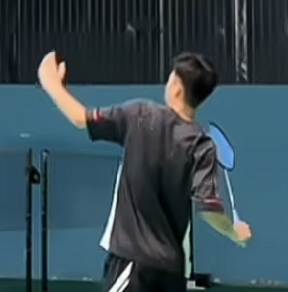
        
    - **架拍完成时右肘一定是与左肩几乎一条线**，这样才能将核心力量传导上来
    
    - 在**起跳最高点**左手下拉后绷紧核心带动顶肘，在**起跳最高点**才结束架拍，在**身体即将下落**的同时挥拍击球，此时收缩核心带动手臂挥出可实现完美力传导，还能借助身体下落时的重力势能把球狼狠砸下来
    
    - **起跳的上升阶段**同时也是完成**架拍**框架的过程，核心不可以提前绷紧，起跳上升时核心放松展开下落时收缩绷紧，一定要保证从起跳到最高点自已的架拍框架正确完成
    
    - 在你**到达最高点之前**，你的身体直都是一个**非常放松**的状态

> [2025-03-28_BV1Tso9Y1EXt_杀球进阶必看！侧身起跳与力传导的深度解析！一个视频掌握暴力跳杀的核心密码](https://www.bilibili.com/video/BV1Tso9Y1EXt)

- 侧身架拍对于发力的意义：
    - 侧身架拍是为了更好的完成力传导，而重心转换是实现良好力传导的基础
    - 跳杀对于重心转换与核心区收缩方式要求更严格
- 核心区发力方式主要有两种
    - 第一种是左右转体带动手臂前挥，可能会左右偏，想把球打直手臂就不能被核心带着挥
    - 【主要】第二种是上下卷腹带动手臂前挥，核心区的收紧方式是上下卷腹
- 起跳在最高点完成架拍框架后，要先通过左手带动左肩下拉使右肩右肘上抬，同时重心在从右脚向左脚倾斜中左脚后拉带动身体转正，**击球时**下半身转正、上半身向左倾斜，左肩在下右肩在上核心收紧卷腹发力

> [2025-06-12_BV1iKMwziEEw_超详细羽毛球双脚跳杀教学！想要跳杀但不会起跳？起跳后身体反而发不上力？一个视频让你学会正确的起跳方式！](https://www.bilibili.com/video/BV1iKMwziEEw)

- 跳杀常见错误：

    - 转体时机错误导致虽然跳的挺高但是核心区在挥拍前未受到充分牵拉
    - 核心发力方式错误导致“压腰”出现
    - 若起跳后在大臂前挥前核心区未能充分牵拉是错误的起跳方式

- **错误**的起跳方式

    - 当**腰杆挺直起跳**时再怎么发力弯腿抬手核心区也不会被牵拉，因为核心阻断则腿部力量与手臂力量会被隔开

- 核心区的正确牵拉方式一定是充分拉开左髋与右肩间肌肉

    - 上半身在完成侧身同时后仰（左肩高于右肩）
    - 若不用头顶找球或不抬头根本无法充分牵拉核心

    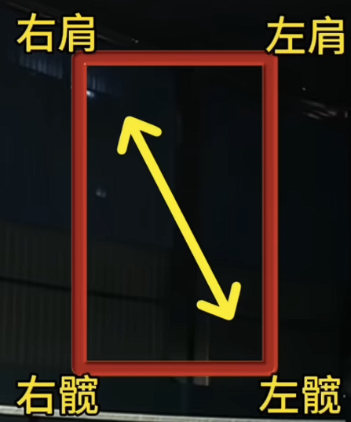

- **正确**的起跳方式

    - **滞空感**其实是起跳后核心在空中牵拉又收缩发力的感觉

    - 第一步用头顶找球，正确的抬头是抬头带动上半身上仰

    - 为了让重心留在原地我们双腿会自然弯曲保持平衡的，就是**跳杀的背弓**

        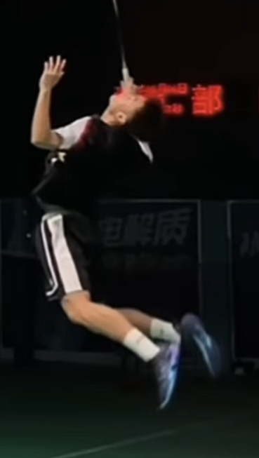

    - 只需要在前面基础上加入上半身的侧身架拍，就可以实现“髋朝前时上半身侧身会牵拉正确的核心区域”

    - 跳杀时完全没必要侧身太多，只要保证击球前左髋朝向目标位置即可

    - 顶髋是从双脚离地就开始的动作，伴随身体上升同时均匀完成的

- 不要试图用整个髋部去瞄准目标，而要在顶髋时**用左髋去瞄准**，因为**击球位置**一定在**左髋上方**，此时击球点、左髋、球落点是一条线，左髋一定是在击球前对准落点的，左髋面对的位置是手臂挥拍发力最充分的位置

    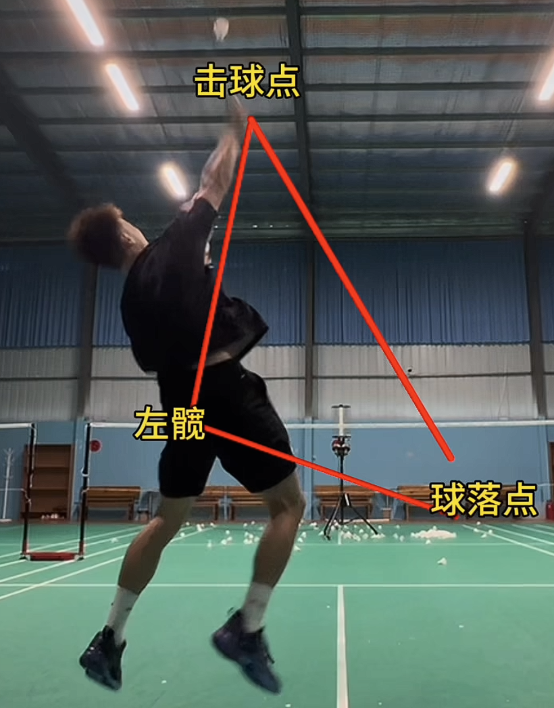

- 先练习微侧身的跳杀，只要保证上半身侧身架拍正确击球点正确就好，体会抬头起跳后自然曲腿展腹绷紧再收缩发力的感觉

- 想要起跳扣杀首先需要制动后流的重心

    - 用头顶找球移动到合适位置确认步**小腿**发力制动重心后流
    - **大腿**发力瞪起身体后保持架拍，同时髋部均匀前转至朝向目标位置。此时核心充分牵拉带动手臂挥出击球

- 判断自己跳杀是否错误就看自己起跳时核心能不能牵拉住就完事了

> [2025-12-25_BV12LBQBmEcK_超详细双脚跳杀顶髋教学，奥秘在脚尖？双脚跳杀总是学不会？找不到击球点？没有背弓发不上力？问题基本都在顶髋错误上，一个视频让你学会双脚起跳的正确顶髋方法](https://www.bilibili.com/video/BV12LBQBmEcK)
>
> 本期关键词：重心转换

- 跳杀流程：

    - 双腿弯曲主动向下蓄力
    - 起跳同时摆臂完成架拍
    - 顶髋形成背弓
    - 髋带动肩膀转正形成顶肘
    - 力传导至手臂发出

- 如果跳杀在起跳前重心在右脚，跳起后完成顶髋前将重心转换到左脚是非常难的。初学者起跳前如果不能将**重心放在两脚之间**建议不要跳杀

- 起跳前只有**重心在两脚之间**才能更容易连贯后续重心转换与顶髋，因为只有当重心转换到左脚时发生的顶髋才是正确的，只要髋部转正那么重心一定在左脚

    - **起跳前**拍子**不要架太高**，架太高起跳不好借力

    - 在做确认步时把重心压下来，右脚先落地再跟左脚

        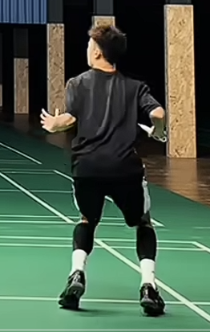

- 起跳时向上摆臂同时完成展肩架拍，起跳时要同时做到展开髋部与肩膀。只有正确展肩后顶髋才能利用核心收缩的力量带动手臂前挥

    - 注意髋部在起跳后不可以弯曲哦
    - 千万不要提前倒拍子或小臂

- 起跳后**手腕位置不动**，**先转正左脚尖**，当左脚尖转正、右脚不动时髋部被拉开（顶髋），此时左脚下踩则重心开始向左脚倾斜

    - 千万不能两个脚尖一起转

- **练习顺序**：

    - 可以先练熟起跳后转正左脚尖落地

    - 然后架好拍感受左脚尖转正瞬间髋部被拉开

        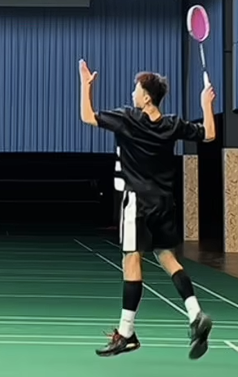

    - 然后在髋部被拉开瞬间下拉左手将重心往左腿上压

        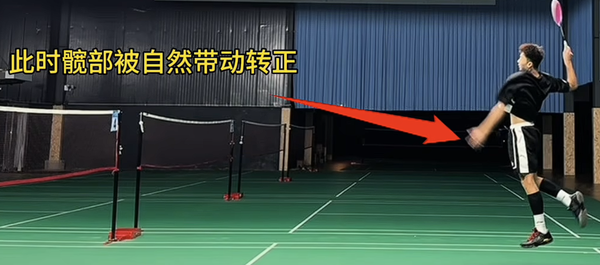

> 

# 练球笔记

## 1月5日

- 平抽的时候，眼睛要低于网的顶部。只有小臂绕肘运动，手腕不要动

## 1月10日

- 反手接进攻球，右脚偏，重心大部分时间都在右脚上。击球的时候，手腕不要动，主要靠小臂

## 1月18日

- 杀球的击球点不在头顶，要往前一些

## 1月24日

- 热身运动*6：[新春跟练特辑丨移动专项步法练习_哔哩哔哩_bilibili](https://www.bilibili.com/video/BV1cS4y1V7xA)

    - 横向并步：重心不要有明显起伏，要等重心挪到前进方向的脚上后再并出去
    - 交叉步移动：交叉的时候要转跨（相当于是扭屁股），手可以抬起来保持平衡
    - 前&&后并步移动：先启动、再并步
    - 高抬腿转跨（前进&后退）：抬腿和转胯是串行的，不能并行

- 四角碰球训练：

    - 在球场四个角上各摆放n=3个球，按照如下轨迹进行跑动
    - 每次触球后要马上从网那一边进行转身
    - 触球的最后一步使用弓箭步，注意膝盖不要超过脚尖
    - 如果俯身触球的时候感觉腿挡住手了，可以把脚往外撇一点，同时把膝盖也往外撇一点
    - 除了正常跑动的步伐，最后一布的弓箭步要保证重心平稳下降（即边跨步、边俯身），不要等跨完步后才俯身

    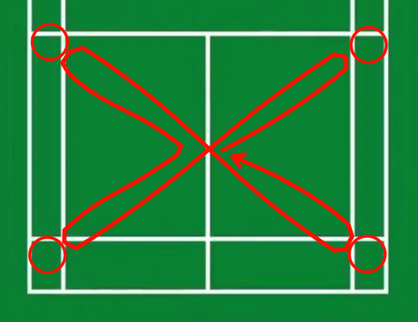

- 步伐训练：

    - 在做弓箭步的时候，要后脚跟着地；脚尖朝身体外撇，不要朝内撇，这样不会崴脚
    - 跑动的时候，重心的投影始终要在两脚的凸包内
    
- 力量训练：

    - 提踵：脚尖踩住（可以多踩一点）、后脚跟悬空，然后用小腿的力量尽量把身体抬高。弯曲膝盖效果更佳
    - 抬腿转胯：把凳子放在身体侧边，然后把靠凳子的腿抬起来转90度跨过凳子，然后放下来，再做逆向过程。整个过程要慢
    - [原地专项步法练习](https://www.bilibili.com/video/BV1EF411v7kf)

