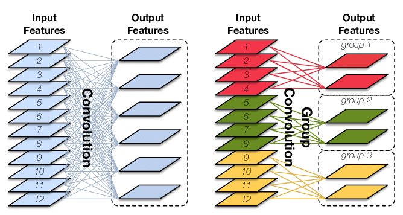
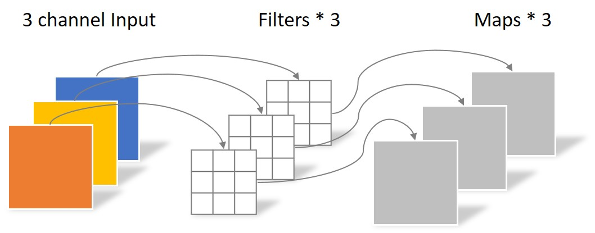
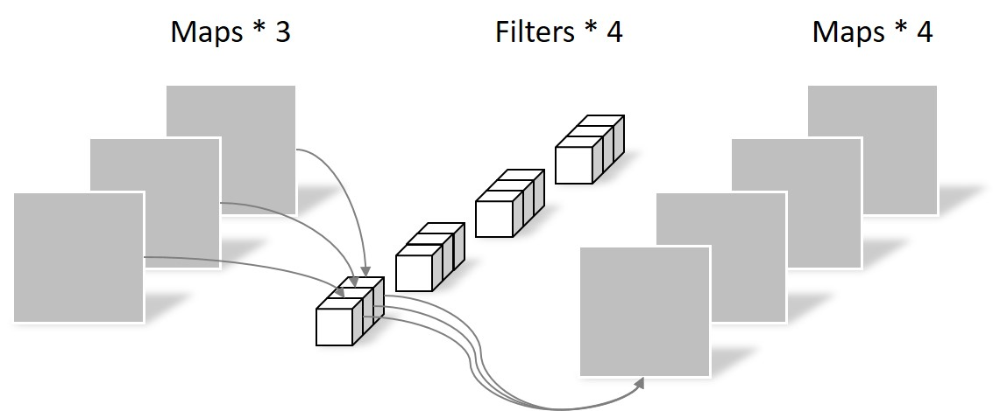
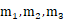
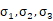
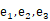
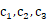
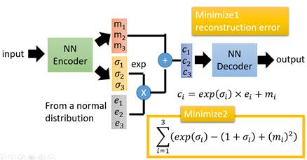

# 教程

## 网络结构

- **卷积神经网络**：[Convolutional Neural Networks: Architectures, Convolution / Pooling Layers](https://cs231n.github.io/convolutional-networks/)

- **U-Net++**：[研习U-Net](https://zhuanlan.zhihu.com/p/44958351)

    我的理解：① U-Net++的嵌套结构就相当对应小学（L1）、初中（L2）、高中（L3）、大学（L4）学的数学知识。每个结构都包含了更小的结构，比如大学（L4）包含了高中（L3），其实也包含了初中（L2）和小学（L1）

    ​				② 关于文中说的“剪枝”那部分，对于U-Net++训练中的反向传播，相当于你学到后面的知识会影响你前面学过的知识，比如在大学（L4）学的线性代数，会帮助你理解初中（L2）学了但是没学好的方程组；而当U-Net++进行测试的时候（即只有前向传播），因为L2和L4的精度差不多，但L4会花更多的时间，所以只用L2就能解决问题，对应到前面的例子中就是对于求解多个未知数，可以只用初中的方程组就能搞定，无需用上大学线代中的矩阵知识了。所以，训练的时候不能剪枝，但预测的时候可以剪枝！

- [**group convolution**](https://zhuanlan.zhihu.com/p/65377955)：原理如下图所示。group conv和conv的关系类似conv和全连接的关系。在卷积中设置groups=g，则参数减少为原来的1/g

  

- [**separable convolution**](https://yinguobing.com/separable-convolution/)：将一个完整的卷积运算分解为两步进行（Depthwise Convolution与Pointwise Convolution），简单来说首先用depthwise conv将feature的每个channel卷积（∴output fature的channel不变），然后用Pointwise Conv（1*1 conv）改变维度

  

  

- **变分自编码器（Variational auto-encoder，VAE）**：在auto-encoder中，编码器是直接产生一个编码的，但是在VAE中，为了给编码添加合适的噪音，编码器会输出两个编码，一个是原有编码()，另外一个是控制噪音干扰程度的编码()，第二个编码其实很好理解，就是为随机噪音码()分配权重，然后加上exp()的目的是为了保证这个分配的权重是个正值，最后将原编码与噪音编码相加，就得到了VAE在code层的输出结果()。其它网络架构都与Deep Auto-encoder无异。

  

  - [【学习笔记】生成模型——变分自编码器 (gwylab.com)](http://www.gwylab.com/note-vae.html)
  - [【机器学习】白板推导系列(三十二) ～ 变分自编码器(VAE)_哔哩哔哩_bilibili](https://www.bilibili.com/video/BV15E411w7Pz)

- **Gumbel Softmax**：属于重参数(re-parameterization)技巧，一个用处是把离散采样的步骤移出计算图，这样整个图就可以计算梯度BP更新了。在可微NAS中的应用为，在多选一（离散）的情况下，保持置信度高（即被选中的概率尽量高于其他选项）的同时，让梯度可以回传

  - [Gumbel softmax在可微NAS的作用是什么？](https://www.cnblogs.com/marsggbo/p/13227992.html)
  - [Gumbel-Softmax Trick和Gumbel分布 - initial_h - 博客园 (cnblogs.com)](https://www.cnblogs.com/initial-h/p/9468974.html#二、gumbel分布采样效果)

- Vision Transformer (ViT) ：

    - [ViT && Hybrid混合模型（resnet50 + ViT）的视频详解](https://www.bilibili.com/video/BV1Jh411Y7WQ)

## 炼丹技巧

- [网络训练前需要热身](https://www.bilibili.com/video/BV1sd4y1b72w)：为了解决训练刚开始数值不稳定的问题

## 领域

- **Hard Negative Mining**
    - 在目标检测中我们会事先标记好ground_truth，接下来在图片中随机提取一些列sample，与ground_truth重叠率IOU超过一定阈值的（比如0.5）, 则认为它是positive sample（正样本），否则为negative sample（负样本）
    - hard negative：难以正确分类的样本，也就是说在对负样本分类时候，loss比较大(label与prediction相差较大)的那些样本，也可以说是容易将负样本看成正样本的那些样本，即假正例（false positive）
    - 判断困难负样本：先用初始样本集去训练，再用训练好的网络模型去预测负样本集中的负样本，选择其中**得分最高**（即最容易被判断为正样本的负样本）为困难样本，加入负样本集中，重新训练网络。循环往复，然后会发现网络的分类性能越来越强了！假阳性负样本与正样本间也越来约相似了！（因为此时只有这些妖怪区域能迷惑我们的分类器了）
    - [什么是hard negative mining - 重大的小鸿 - 博客园 (cnblogs.com)](https://www.cnblogs.com/elitphil/p/12714479.html)
- **主动学习（Active Learning）**：大致思路，通过机器学习的方法获取到那些比较“难”分类的样本，让人工再次审核，然后用于训练，逐步提升模型的效果，将人工经验融入机器学习的模型中。

    - [主动学习(Active learning)算法的原理是什么，有哪些比较具体的应用？ - 张戎的回答 - 知乎](https://www.zhihu.com/question/265479171/answer/1474978784) 
- **NAS**：自动搜索网络结构
    - [神经网络结构搜索 (1/3): 基本概念和随机搜索 Neural Architecture Search: Basics & Random Search_哔哩哔哩_bilibili](https://www.bilibili.com/video/BV14q4y177gQ)
    - [神经网络结构搜索 (2/3): RNN + RL Neural Architecture Search: RNN + RL_哔哩哔哩_bilibili](https://www.bilibili.com/video/BV15K4y1A7hq)
    - [神经网络结构搜索 (3/3): 可微方法 Differentiable Neural Architecture Search_哔哩哔哩_bilibili](https://www.bilibili.com/video/BV1C64y127Fv)

## 

# [Deep Learning Tuning Playbook](https://github.com/google-research/tuning_playbook/blob/main/README.md#deep-learning-tuning-playbook)

> 中文翻译（但是我感觉翻译得不太好）
>
> 1. [ytzfhqs](https://github.com/ytzfhqs)/[Deep-Learning-Tuning-Playbook-CN](https://github.com/ytzfhqs/Deep-Learning-Tuning-Playbook-CN)
> 2. [schrodingercatss](https://github.com/schrodingercatss)/[tuning_playbook_zh_cn](https://github.com/schrodingercatss/tuning_playbook_zh_cn)

## [Guide for starting a new project](https://github.com/google-research/tuning_playbook/blob/main/README.md#guide-for-starting-a-new-project)

- 选择模型：
    - 在已有工作的基础上继续
    - 如果可以找到与当前任务类似的工作，以此为起点开始

- 选择初始超参
    - 找一个简单、相对快速、消耗资源相对较低的超参，能产生合理结果就行。比如 固定的lr rate、较小的模型。
        - “合理结果”根据问题而定，比如比随机选择的结果好
    - 训练时长涉及到两方面的平衡，不能太大 或者 太小
        - 一方面，训练时间越长效果越好、而且可以让超参的调整更容易（为什么会更容易？？？）
        - 一方面，训练时间越长 固定时间内做的实验越少，而且类似lr之类的参数是跟训练时长相关的，一旦确定就不好修改
- 选择优化器
    - 在当前问题所处领域中，选择最常用、最成熟、最受欢迎的优化器
    - 关注所选优化器的所有超参
        - 在项目初期尤其重要，因为调整完optimizer的参数之后，再调整其他超参（比如model的超参）时，optimizer的超参就变成了nuisance parameters
        - 可以先选择比较简单的optimizer（比如SGD with fixed momentum、Adam with fixed $\epsilon$、$\beta_{1}$、$\beta_{2}$），之后再换成其他更常用的优化器（什么时候开始换？？？）
    - 作者最喜欢的成熟优化器有
        - [SGD with momentum](https://github.com/google-research/tuning_playbook/blob/main/README.md#what-are-the-update-rules-for-all-the-popular-optimization-algorithms)
        - （更喜欢）[Adam and NAdam](https://github.com/google-research/tuning_playbook/blob/main/README.md#what-are-the-update-rules-for-all-the-popular-optimization-algorithms)：[Adam的4个超参都很重要](https://arxiv.org/abs/1910.05446)，调整策略如下
            - If < 10 trials in a study, only tune the (base) learning rate.
            - If 10-25 trials, tune learning rate and $\beta_{1}$.
            - If 25+ trials, tune the learning rate, $\beta_{1}$ and $\epsilon$.
            - If one can run substantially more than 25 trials, additionally tune $\beta_{2}$.
- 选择batch size
    - batch size不能作为 验证集性能的超参。∵只要调整好所有超参数（尤其是学习率和正则化超参数）并且训练步数足够，理论上任意的Batch Size都能获得相同的最终性能（参见 [Shallue et al. 2018](https://arxiv.org/abs/1811.03600)） 
    - 通常设置为硬件（比如显存）支持的最大值。使用不同的batch size（为2的幂次）来测试（保证尽可能减小IO之类的瓶颈），计算训练吞吐量（=每秒处理的样本数）。如果某个batch size之后，训练吞吐量不再增加，就选择这个batch size（相当于是选择刚好把GPU利用率占满的batch size吗？？？）
        - 避免使用 梯度累加。∵不提升训练吞吐量
    - 每次更改model或optimizer时，可能都需要重新选择batch size（例如，不同model可能允许更大的Batch Size）
    - 大多数超参的最优值 对 batch size 很敏感，尤其是optimizer的超参（lr、moment）和正则化的超参。**因此最开始确定batch size后，就不要调整了**

## [A scientific approach to improving model performance](https://github.com/google-research/tuning_playbook/blob/main/README.md#a-scientific-approach-to-improving-model-performance)

- 确定了搜索空间 && 哪些超参数应该被调整，可以使用贝叶斯优化工具
- 每次实验都要看训练时的train loss和val loss的曲线
- 确定 最大训练step（max_train_steps）的方法：
    - step应该是epoch 还是 iteration？？？
    - 使用不同的lr，没有lr调整策略、数据增强、正则化等操作，来训练网络，训练时间最短、效果最好的训练step 设置为max_train_steps的初始值
    - 之后 做实验，最好保持max_train_steps不要变
    - 如果最佳step 总是在训练steps的前10%，减小max_train_steps；如果总是在后25%，增加max_train_steps
    - 
- 其他的都看不懂。。。

## [Additional guidance for the training pipeline](https://github.com/google-research/tuning_playbook/blob/main/README.md#Additional-guidance-for-the-training-pipeline)

- batch norm的使用细节
    - **通常使用 layer norm 来替代**
    - Decoupling the total batch size and the number of examples used to calculate batch norm statistics is particularly useful for batch size comparisons.
    - 剩下的看不懂了。。。
- 

