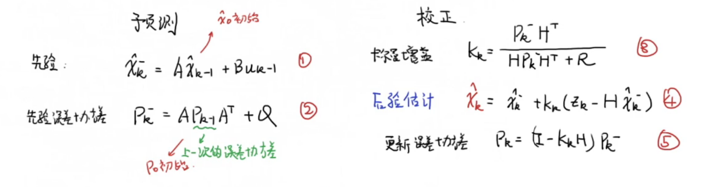
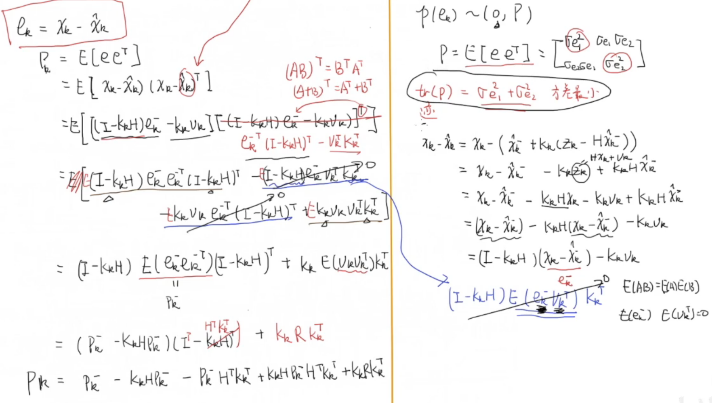
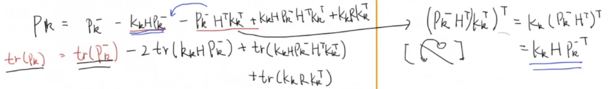
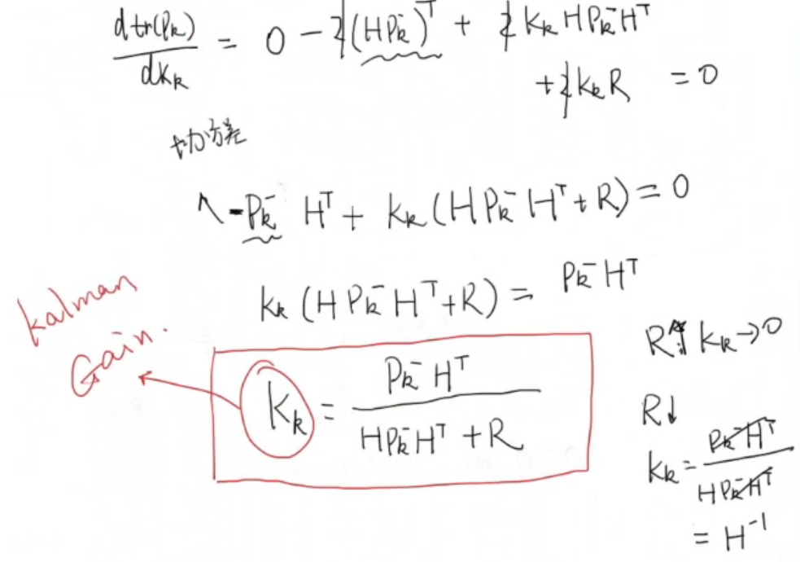
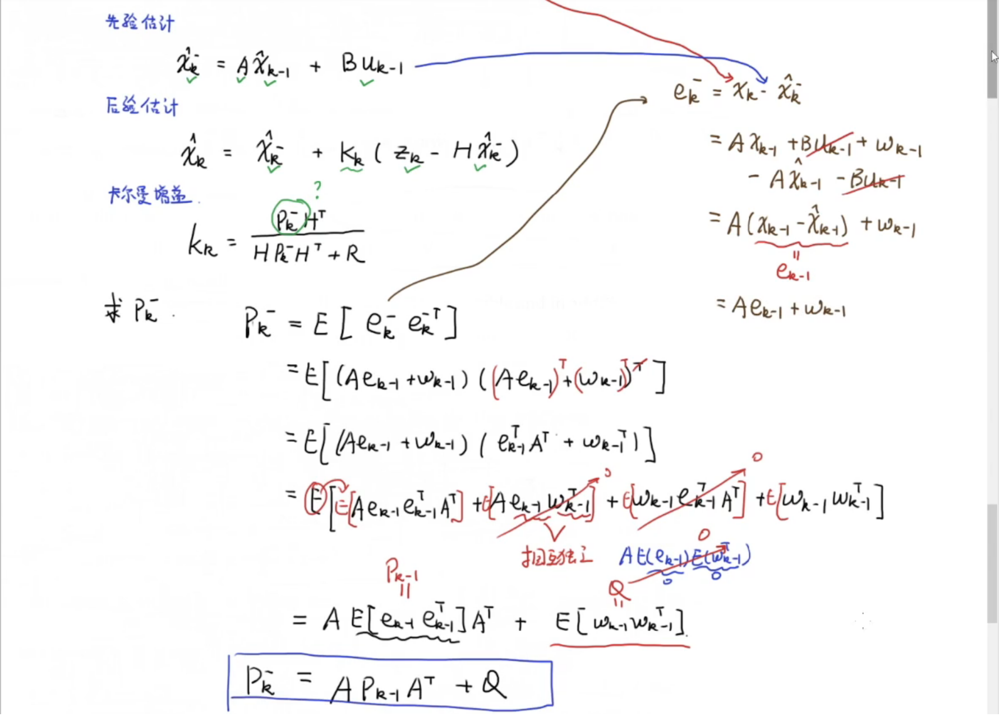
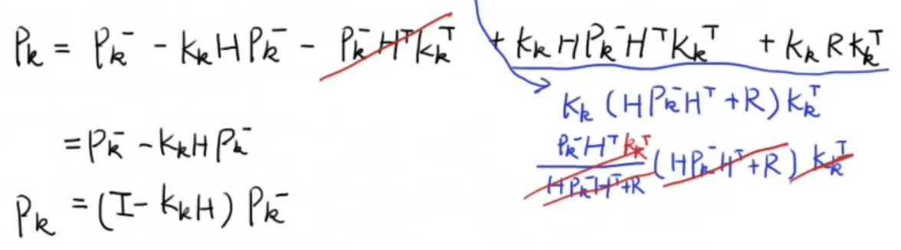
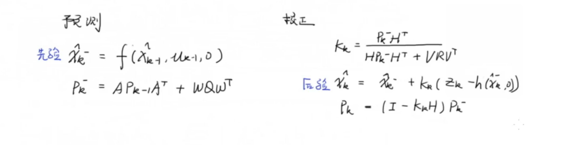
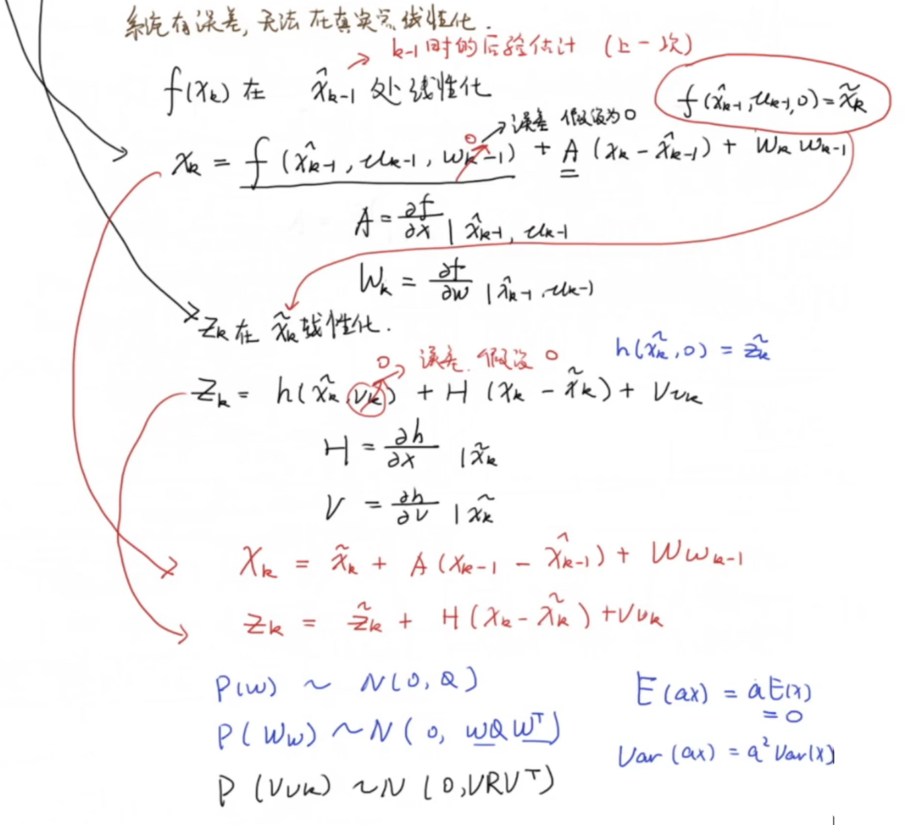

# 卡尔曼滤波

**针对线性系统**

## 普通表述

- Key idea

$$
\hat{x}_k= \hat{x}_{k-1}+K_k\left(z_k-\hat{x}_{k-1}\right) \\
当前估计值 = 上次估计值 + 系数 * (当前测量值 - 上次估计值)\\\\
K_k=\frac{e_{E S T_{k-1}}}{e_{E S T_{k-1}}+e_{M E A_k}}
$$

> $e_{E S T}$为估计误差，$e_{MEA}$为测量误差，带hat的表示估计值

- 系数$K_k$即为Kalman Gain，卡尔曼增益/因数

- 分析：在$k$时刻
    - $e_{E S T_{k-1}} >> e_{M E A_k},\quad k_k \rightarrow 1,\quad \hat{x}_k\approx \hat{x}_{k-1}+z_k-\hat{x}_{k-1}=z_k$，更相信观测值
    - $e_{E S T_{k-1}} << e_{M E A_k},\quad k_k \rightarrow 0,\quad \hat{x}_k\approx \hat{x}_{k-1}$，更相信上次估计值

- **步骤**

    - Step 1：计算Kalman Gain $K_k=\frac{e_{E S T_{k-1}}}{e_{E S_{k-1}}+e_{MAE_{k}}}$

    - Step 2：计算$\hat{x}_k= \hat{x}_{k-1}+K_k(z_k-\hat{x}_{k-1})$

    - Step 3：更新$e_{E S T_k}=(1-K_k) e_{E S T_{k-1}}$

## 状态空间表述

- 离散状态空间方程：线性系统

$$
x_k=A x_{k-1}+B u_k+\omega_{k-1}\\
z_k=H x_k+v_k
$$

> $x$为状态变量，$A$为状态矩阵，$B$为控制矩阵，$u$为控制，$\omega$为过程噪声
> 
> $z$为观测，$H$为观测矩阵，$v$为观测噪声
>
> $p(\omega)\sim N(0,Q), p(v)\sim N(0,R)$

- Key idea
    $$
    \hat{x}_k=\hat{x}_{\bar{k}}^{-}+K_k\left(z_k-H \hat{x}^{-}_{k}\right)\\
    K_k=\frac{P_k^{-} H^{T}}{H P_k^{-} H^{T}+R}
    $$

    > 带hat的表示估计值，右上角为减号的表示先验估计（即直接估计）
    >
    > $R$为噪声$v$的方差

### ☆步骤

### 推导的知识准备

- 协方差的矩阵计算方式：以3个变量为例
    $$
    a=\left[\begin{array}{lll}x_1 & y_1 & z_1 \\ x_2 & y_2 & z_2 \\ x_3 & y_3 & z_3\end{array}\right]-\frac{1}{3}\left[\begin{array}{lll}1 & 1 & 1 \\ 1 & 1 & 1 \\ 1 & 1 & 1\end{array}\right]\left[\begin{array}{lll}x_1 & y_1 & z_1 \\ x_2 & y_2 & z_2 \\ x_3 & y_3 & z_3\end{array}\right]\\
    p=\frac{1}{3} a^{T} a
    $$

    > 注意：$a$中减号后面其实是均值

- 对 矩阵相乘的迹 求导
    $$
    \frac{d tr(A B)}{d A}=B^{T}\\
    
    \frac{d\left(A B A^{T}\right)}{d A}=A (B+B^T)
    $$
    
- 若$A$、$B$独立，则$E[AB]=E[A]E[B]$

- $E[A+B+C]=E[A]+E[B]+E[C]$

### 推导

- ==逻辑==：寻找卡尔曼增益$K_k$，使得误差$e_k=\hat{x}_k-x_k$最小，即$e_k$的方差最小 <=> 协方差矩阵的迹最小 <=> $\sigma_{e_1}^2+\sigma_{e_2}^2$最小

    - $e_k$满足正态分布，即$p(e_k)\sim N(0, P)$​，$P$为协方差矩阵
        $$
        P=E\left[e e^{T}\right]+E^2\left[e\right]=E\left[e e^{T}\right]=\left[\begin{array}{cc}
        {\sigma_{e_1}^2} & \sigma_{e_1} \sigma_{e_2} \\
        \sigma_{e_2}\sigma_{e_1} & \sigma_{e_2}^2
        \end{array}\right]\\\\
        \text{Note:}\quad E[e]=E[x]-E[\hat{x}]=0-0=0
        $$
        

- **步骤一：**计算协方差矩阵$P$

    

    Note：$P_k^{-}=E\left[e_k^{-} e_k^{-T}\right]$

- **步骤二：**计算$P$的迹

     

- **步骤三：**计算 迹 关于$K_k$的导数，并令其=0，计算得到最小值

     

- 步骤四：计算先验协方差矩阵$P^-$

    

- **步骤五：**[协方差矩阵$P$的最终形式](https://www.bilibili.com/video/BV1yV411B7DM/?spm_id_from=333.788&vd_source=2ebea31310091516b679de9e615d4ff9&t=382.4)

     

> 参考资料：https://space.bilibili.com/230105574/channel/collectiondetail?sid=6939

# 扩展卡尔曼滤波

- Key idea：将 <u>非线性系统</u> 进行 <u>线性化</u>

- 非线性系统的状态方程
    $$
    \begin{aligned}
    &x_k=f\left(x_{k-1}, u_{k-1}, w_{k-1}\right) \\
    &z_k=h\left(x_k, v_k\right)
    \end{aligned}
    $$

    > $p(\omega)\sim N(0,Q), p(v)\sim N(0,R)$

- 非线性系统的线性化
    $$
    x_k=\tilde{x}_k+A(x_{k-1}-\hat{x}_{k-1})+W_{\omega_{k-1}}\\
    z_k=\tilde{z}_k+H(x_k-\tilde{\lambda}_k)+V_{v_k}
    $$
    其中
    $$
    \tilde{x}_k=f(\hat{x}_{k-1}, u_{k-1}, 0)，
    \tilde{z}_k=h(\tilde{x}_k, 0)\\
    A=\frac{\partial f}{\partial x} \mid \hat{x}_{k-1}, u_{k-1}，
    W_k=\frac{\partial f}{\partial w} \mid \hat{x}_k,u_{k-1}\\
    P(W_\omega) \sim N(0, \omega Q w^T), 
    P(V_{v_k}) \sim N(0, v R v^T)
    $$
    
- 逻辑：
    
    - 正态分布的随机变量通过 非线性系统 后，不是正态了
    - 可以一阶 泰勒展开来线性化
    - 但是系统有误差，无法在真实点线性化
    - 可以在$\hat{x}_{k-1}$附近线性化

## 步骤

 

## 线性化过程

> 推导：https://www.bilibili.com/video/BV1jK4y1U78V

 