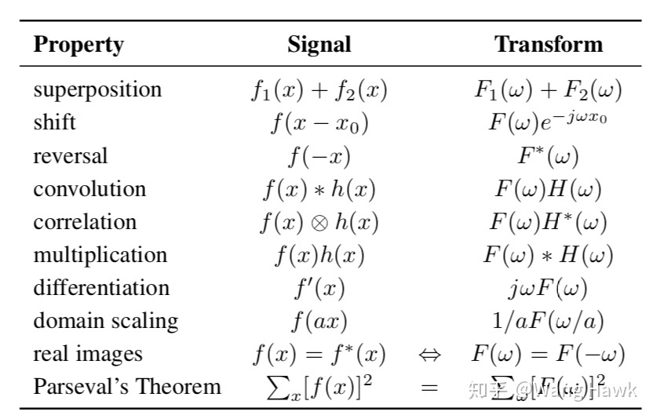
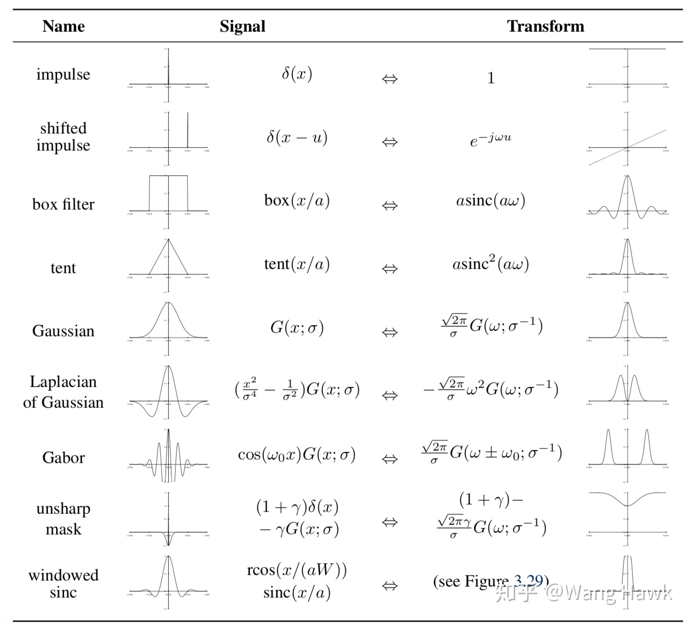

# 傅里叶

## 性质

- 

> 参考：[6. 傅里叶变换与图像的频域处理](https://zhuanlan.zhihu.com/p/54946461)

# 概率论

## 概念

- 独立同分布：一组[随机变量](https://zh.wikipedia.org/wiki/随机变量)中每个变量的[概率分布](https://zh.wikipedia.org/wiki/概率分布)都相同（比如都为正态分布且μ、σ相同），且这些随机变量互相[独立](https://zh.wikipedia.org/wiki/独立_(概率论))。

- **概率是已知模型和参数，推数据。统计是已知数据，推模型和参数。**

- 贝叶斯公式

  - 在描述，你有多大把握能相信一件证据？（how much you can trust the evidence）
  - 做判断的时候，要考虑所有的因素
  - 一个本来就难以发生的事情，就算出现某个证据和他强烈相关，也要谨慎。证据很可能来自别的虽然不是很相关，但发生概率较高的事情。 

- 对于$P(x∣θ)$，输入有两个：$x$表示某一个具体的数据；$\theta$​表示模型的参数

  |                                    | $x$  | $\theta$ | 描述                                            |
  | ---------------------------------- | ---- | -------- | ----------------------------------------------- |
  | **概率函数**(probability function) | 变量 | 已知     | 对于不同的样本点x，其出现概率是多少             |
  | 似然函数(likelihood function)      | 已知 | 变量     | 对于不同的模型参数，出现x这个样本点的概率是多少 |

- 极大似然估计（MLE）：首先假设概率模型（参数未知），然后实验获得数据，然后让概率模型获得相同数据的概率最大，从而确定模型参数

> 参考：[一文搞懂极大似然估计](https://zhuanlan.zhihu.com/p/26614750)、[详解最大似然估计（MLE）、最大后验概率估计（MAP），以及贝叶斯公式的理解](https://blog.csdn.net/u011508640/article/details/72815981)