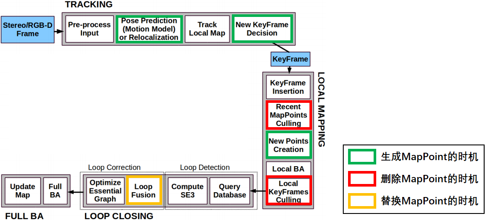

> 參考笔记https://www.yuque.com/books/share/95bfc64d-38f6-49f9-bbce-b3e8e4a02ec2

# ORBSLAM2


## TRACKING


- 属性：

    - 当前帧 & 上一帧 的 跟踪状态。eTrackingState取值

        | 值               | 意义                                                         |
        | ---------------- | ------------------------------------------------------------ |
        | SYSTEM_NOT_READY | 系统没有准备好,一般就是在启动后加载配置文件和词典文件时候的状态 |
        | NO_IMAGES_YET    | 未接收图片                                                   |
        | NOT_INITIALIZED  | 接收到图像，未初始化成功                                     |
        | OK               | 跟踪 成功                                                    |
        | LOST             | 跟踪 失败                                                    |

### Extract ORB

- **ORB = orientated FAST（旋转不变性）+ BRIEF描述子（特殊设计的固定的pattern）+ 图像金字塔（尺度不变性）**

- 步骤：

    - Step 1：检查图片有效性

    - Step 2：构建图像金字塔

        - 图像金字塔中，level越大（图片缩得越小），ORB特征越大，距离相机越近（因为远的点在图片缩小后看不到了）

        - 构建图像金字塔时，每缩小一次，要padding 19个像素

            - 其中3个像素（绿色），用于Fast角点提取
            - 19个像素（浅灰色+绿色），用于计算描述子

            

    - Step 3：逐层遍历，按cell提取特征点，然后使用八叉树筛选

        - ORBSLAM2将图片分块（30*30像素）然后每一块提取FAST角点
        - 每一个图像块先用较大阈值提取FAST，提取不到的话用小一些的阈值（为了保证FAST角点的均匀性）
        - 使用四叉树将整张图中所有的FAST角点（在空间上）**均匀采样**至所需数量（保留质量最好的，即FAST角点提取时的响应值最大的）
            - ORBSLAM2不能使用太竖屏的图片（即宽度<<高度），否则四叉树的初始节点数量为0
            - 数据结构为c++的list，每个节点分裂成4个节点然后加入list最前面
            - 如果节点中之有一个特征点，则后续不再分裂；如果一个都没有，则节点被删除
            - 由于每次分裂完后节点数量为4^n，所以如果想要节点数量刚好为所需的数量，需要：在最后一次分裂之前，优先分裂特征点数量最多的节点，然后到刚好分裂到所需数量时停下来
        - 计算每个特征点的方向（分层）
        - 使用**图像金字塔**提取了不同尺度下的ORB特征点后，还需要将金字塔中缩小的层上的ORB特征点的坐标**放大回**原始图像的坐标系

    - Step 4：逐层遍历，计算描述子

        - 使用**高斯模糊**来减少噪声
        - 描述子在特征点周围半径16的**圆域**内计算
        - 将 用于计算描述子的pattern（而非图片）旋转以将orientation跟主轴对齐

- orientated FAST**计算灰度质心**时（用于旋转不变性），为了加速计算灰度值的遍历，使用了**对称**的方法，即v只从1开始遍历到`v_max`（v=0的时候没有对称，因为在u轴上），然后使用v和-v的像素坐标。
    - 问题：为啥u没有用对称呢？

- 提取特征点时使用了**仿函数**，其优点在于
    - 仿函数有自己的成员变量
    - 仿函数通常比一般函数有更好的速度

- 对Keypoints进行去畸变，而不是对整张图去畸变，这样能减少计算量

- 去畸变的时候，需要计算去畸变后的图像边界，但是在第一帧或者内参改变之后算一次

- **将图片的有效区域（去畸变后）分成大小64像素的网格，特征点存在每个网格中**
    - 应该是为了后续快速遍历特征点

- 每帧提取完成ORB后，图像金字塔信息就作废了，下一帧再计算一遍

### Map Initialization

- 步骤如下
    - 将单目初始化的两帧都当做关键帧
    - 然后将所有关键帧的描述子转成BoW，并插入地图
    - 将初始化得到的3D点生成地图点
        - 每个3D点对应一个地图点（三维），包含属性：
            - 观测到地图点的关键帧ID以及它上面对应的二维特征点ID
            - 从这个地图点的所有特征点中选取**最具代表性的特征点**，其描述子作为这个地图点的描述子，选取方法为
                - 计算每个特征点跟其他所有特征点的描述子距离，选取中值
                - 选出中值最小的特征点作为最具代表性的特征点
            - **平均观测方向**：能观测到该地图点的所有关键帧，对该点的观测方向归一化为单位向量，然后进平均得到该地图点的朝向
            - **观测距离范围**：地图点和当前关键帧的光心距离，乘上所在金字塔的缩放倍数（$=1.2^n$，n为所在金字塔层数）为<u>最大范围</u>（因为图像缩放的时候会有精度丢失？），最大范围÷最大缩放倍数（$=1.2^N$，N为金字塔总层数）为<u>最小范围</u>
    - 将 新关键帧 跟 所有关键帧 建立**共视图**（无向加权图）
        - 将 新关键帧 和 每个已有关键帧 之间都能看到3D点的数量作为**权重**：遍历新关键帧中的所有3D点，遍历3D点所在的所有关键帧，将 这个关键帧 和 新关键帧的权重+1
        - 将“权重>阈值(15个) 以及 最大权重 的关键帧” 跟 新关键帧 建立边
        - 将权重最大的关键帧 作为 新关键帧 的<u>父关键帧</u>，而新关键帧为其<u>子关键帧</u>
    - 全局BA优化，同时优化所有位姿和三维点
    - 尺度归一化：计算所有3D点的深度的中值$z_{mid}$，将pose的平移和3D点都$÷z_{mid}$来归一化到1
    - 如果初始化的两帧之间的特征点<100个，则要<u>重新初始化</u>
    - 将关键帧插入局部地图，更新归一化后的位姿、局部地图点

### 卡方检验

- 主要在事实与期望不符合情况下看是否系统出了问题，还是属于正常波动。 

- 取95%置信度下的卡方检验**阈值**：

    - 单目2个自由度$(u,v)$为5.99
    - 双目3个自由度$(u_l,v_l,u_r)$（$v_r=v_1$）为7.82

- 步骤如下

    - 选择要检验的**假设**（H0）及其**备择假设**H1。例如：H0为系统没问题，H1为系统有问题

    - 确定**自由度**：用于计算检验统计量的独立变量的数目

        - 单行或单列：自由度 = 组数-限制数
        - 表格类：自由度 = (行数 - 1) * (列数 - 1)

    - 确定**显著性水平**，是指当原假设为正确时人们却把它拒绝了的概率或风险，通常取α=0.05或α=0.01（即接受H0时，正确概率为95%或99%）

    - 根据自由度 & 显著性水平，查表得到**拒绝域**

    - 计算**理论期望**$E$和**实际观察次数**$O$

    - 使用**卡方公式**计算统计量
        $$
        \mathcal{X}^2=\sum\frac{(O-E)^2}{E}
        $$

    - 如果计算得到的$\mathcal{X}^2$>拒绝域，则拒绝H0接受H1；<则接受，并将**统计量裕量**（=阈值-$\mathcal{X}^2$，越大越好）设为**置信度分数**

### 单目初始化

- 构造初始器Initializer必须要有连续2帧，每一帧 特征点数>100 而且 两帧配准上的特征点数量>100，否则删了重新构造

- 初始化时需要专门的特征匹配器

    - 只使用原始层级的特征点（缩小层级的不考虑），

    - 特征匹配范围为100像素（所以要求运动不能太大），搜索的时候**遍历范围内的网格**（事先已将图片分成大小64像素的网格）

        > 好像是当前网格周围3*3的网格？

    - 特征匹配距离记录最佳 & 次佳，要求①最佳距离小于一定距离；②最佳要明显小于次佳（即 最佳÷次佳<阈值）

    - 每个特征点最多一个匹配，如果多个匹配就都删掉（？）

    - 可以检查每个配准的角度差（使用直方图），因为一张图上的角度差应该是差不多的，角度差太大的配准可以删掉

- 使用**单应矩阵H**（更倾向）或者**本质矩阵F**进行**单目初始化**，得到2帧相对运动和三维点

    - 使用两个线程同时计算两个矩阵，都使用8对特征点，RA[应聘记录](https://jobs.bytedance.com/campus/position/application)NSAC迭代500次

        - 其实F只需要7对（因为尺度等价性&&$det(F)=0$两个约束），H只需要4对，但是为了方便编程&&公平（后面需要算分），都用8对点

    - 计算矩阵（H or F）前，需要对特征点进行归一化，即质心挪到原点然后对尺度归一化。这样能够在一定程度上消除噪声、错误匹配带来的影响，但还是不够的。归一化过程的矩阵形式为
        $$
        \left[\begin{array}{c}
        x^{\prime} \\
        y^{\prime} \\
        1
        \end{array}\right]=
        \left[\begin{array}{ccc}
        s X & 0 & -\operatorname{mean} X * s X \\
        0 & s Y & -\operatorname{mean} Y * s Y \\
        0 & 0 & 1
        \end{array} \right]
        \left[\begin{array}{l}
        x \\
        y \\
        1
        \end{array}\right]\\
        \operatorname{mean} X=\bar\mu_X \text{(均值), } sX=\frac{1}{|\bar\mu_X |\text{(一阶绝对矩) }}
        $$
        

         

    - 计算完单应矩阵后，需要转换成归一化之前的，基础矩阵同理
        $$
        p_1\text{为图1的特征点，}T_1\text{为它对应的归一化过程}
        \\p^N_1 = T_1 p_1, p^N_1 = T_2 p_2\\
        H_{2to1} =\operatorname{computeH\_2to1}(p_1, p_2)\\
        H^{final}_{2to1} = T^{-1}_2 H T_1,H^{final}_{1to2} = (H^{final}_{2to1})^{-1}
        $$

    - 计算完两个矩阵后，使用单应矩阵计算重投影误差，作为RANSAC的评分

    - H分数占比>40%，则使用H；否则使用F

- 初始化成功后，删除那些无法进行三角化的匹配点

- **单应矩阵**H计算$R+t$：《motion and structure from motion in a piecewise planar environment》

  - 单应矩阵$H=\boldsymbol{K}\left(\boldsymbol{R}-\frac{\boldsymbol{t} \boldsymbol{n}^{\mathrm{T}}}{d}\right) \boldsymbol{K}^{-1}$，令$A=\boldsymbol{R}-\frac{\boldsymbol{t} \boldsymbol{n}^{\mathrm{T}}}{d}$，则$A=K^{-1}*H*K$

  - 对A进行奇异分解，得到奇异值$d_1, d_2, d_3$（从大到小）

  - 令$d'=d_2$（也可以$d'=-d_2$），接下来要分别计算并讨论 H 矩阵分解的 8 组解

  - 根据论文eq.12得
    $$
    \left\{\begin{array}{l}
    x_{1}=\varepsilon_{1} \sqrt{\frac{d_{1}^{2}-d_{2}^{2}}{d_{1}^{2}-d_{3}^{2}}} \\
    x_{2}=0 \\
    x_{3}=\varepsilon_{3} \sqrt{\frac{d_{2}^{2}-d_{3}^{2}}{d_{1}^{2}-d_{3}^{2}}}
    \end{array}\right.
    \quad \varepsilon_{1}, \varepsilon_{3}=\pm 1
    $$

  - 首先讨论$d'>0$的情况，根据论文eq.13-14得到四组R+t

  - 再讨论$d'<0$的情况，根据论文eq.15-16得到四组R+t

  - 对**8组解**进行验证，并选择在相机前方最多3D点的解为最优解，满足以下条件

      - 最优解中3D点数量，*0.75>次优解，>最小数量，占总数的90%以上
      - 视差角>1°

- **基础矩阵**F计算$R+t$：

  - 计算本质矩阵$E=K^T*F*K$
  - 对本质矩阵E进行SVD分解得$E=U\Sigma V^T$
  - $U$的最后一列归一化后就是$t$（why？？？），令$\boldsymbol{R}_{1} =\boldsymbol{U} \boldsymbol{R}_{Z}^{\mathrm{T}}\left(\frac{\pi}{2}\right) \boldsymbol{V}^{\mathrm{T}}$和$ \boldsymbol{R}_{2} =\boldsymbol{U} \boldsymbol{R}_{Z}^{\mathrm{T}}\left(-\frac{\pi}{2}\right) \boldsymbol{V}^{\mathrm{T}}$，则得到四组可能的解$(R_1,\pm t)$和$(R_2,\pm t)$
  - 对**4组解**进行验证，并选择在相机前方最多3D点的解为最优解，满足以下条件
    - 有效匹配点的数量*0.9>50
    - 最优解中3D点数量，*0.7>次优解
    - 视差角>1°

- 单目投影恢复三维点：类似“DLT求解PnP”，只不过求解目标从T=>3D点

  

  - 假设单应矩阵or基本矩阵得到的R+t是从2->1的，则第2个相机的坐标系到第一个相机的坐标系的变换矩阵为
    $$
    T_{1->2}=T_{2->1}^{-1}=\left[\begin{array}{cc}R_{21} & t_{21} \\ 0^{T} & 1\end{array}\right]^{-1}=\left[\begin{array}{cc}
    R_{21}^{T} & -R_{21}^{T} t_{21} \\
    0^{T} & \mathbf{1}
    \end{array}\right]
    $$

  - 所以第二个相机的光心坐标为$-R_{21}^{T} t_{21}$

  - 特征点的投影矩阵为$P=K*[R | t]$（维度3*4）

  - 将空间点$X$投影到图像上的$x$，其中$\lambda$为归一化因子（未知），$p_1$的矩阵为投影矩阵
      $$
      \left[\begin{array}{c}
      x \\
      y \\
      1
      \end{array}\right]=\lambda\left[\begin{array}{llll}
      p_{1} & p_{2} & p_{3} & p_{4} \\
      p_{5} & p_{6} & p_{7} & p_{8} \\
      p_{9} & p_{10} & p_{11} & p_{12}
      \end{array}\right]\left[\begin{array}{c}
      X \\
      Y \\
      Z \\
      1
      \end{array}\right]=\lambda\left[\begin{array}{lll}
      - & P_{0} & - \\
      - & P_{1} & - \\
      - & P_{2} & -
      \end{array}\right]\left[\begin{array}{l}
      X \\
      Y \\
      Z \\
      1
      \end{array}\right]
      $$

  - 上面方程左右两遍同时叉乘$\left[\begin{array}{l}x \\ y \\ 1\end{array}\right]$后，左边变成0，同时可以约去$\lambda$，整理后得到
      $$
      \left[\begin{array}{c}
      y P_{2}-P_{1} \\
      P_{0}-x P_{2} \\
      x P_{1}-y P_{0}
      \end{array}\right]\left[\begin{array}{l}
      X \\
      Y \\
      Z
      \end{array}\right]=\left[\begin{array}{l}
      0 \\
      0 \\
      0
      \end{array}\right]
      $$

  -  根据一对特征点（2个点），并取上面矩阵的前两行（因为Z未知且单个点无法计算得到Z）得公式
      $$
      \left[\begin{array}{c}
      y P_{2}-P_{1} \\
      P_{0}-x P_{2} \\
      y^{\prime} P_{2}^{\prime}-P_{1}^{\prime} \\
      P_{0}^{\prime}-x^{\prime} P_{2}^{\prime}
      \end{array}\right] X=AX=0
      $$

  - 使用SVD求解，右奇异矩阵的最后一行就是最终的解。如果计算得到的Z＜0，则丢弃

  - （可选）计算$\angle O_1PO_2$，如果小于1°，则丢弃

  - 计算重投影误差，即将三维点投影到第二张图然后跟第二张图的二维点计算距离，如果太大的话就丢弃

### 双目 / RGBD初始化

- 双目初始化不需要畸变矫正，因为相机SDK自带 或者 输入之前以及矫正了（极线矫正的时候一起做了）

- 输入双目图片已经做了极线矫正

- 只要左图片提取特征点>500，即初始化成功

- 立体匹配步骤（左图右图反一下没关系）

    - Step 1 对于<u>右图</u>中每一个特征点$F_r$，确定<u>左图</u>搜索范围

        - 虽然已经做了极线矫正，但是实际中并不是只在对应的那一行上进行搜索，而是在那一行的**上下几行进行搜索**，因为存在误差
        - 也不是每一列都搜索的，如果在左图上搜索右图上的像素$p$，搜索范围为$[p-maxD,p-minD]$
            - 最小depth不能超过基线，所以最大视差$maxD=\frac{f*b}{b}$
            - 最大depth是无穷远，所以最小视差$minD=0$
        - 去搜索范围内的特征点来进行匹配，而且要求空间尺度差（**金字塔层级**）不超过2

    - Step 2 粗配准：将$F_r$跟搜索范围内所有的特征点配准，使用描述子的汉明距离来衡量相似度

    - Step 3 精配准：SAD，滑动窗口

        
    
        - 需要注意有没有越界
        - 在配准到的特征点的附近滑动，滑动范围为5
        - 将窗口中图片归一化以减少亮度变化的影响

    - Step 4 亚像素插值：跟左右像素再做个匹配，然后二次曲线插值

         
    
    - Step 5 保存最优视差值（深度）
    
    - Step 6 删除outliers：根据SAD的值，删除＞1.5\*1.4\*中值


### BoW

- BoW的**优点**：①加速匹配效率；②匹配精度好：源论文中说26K张图片中false positive=0

- BoW的**缺点**（忽略不计？）：加载预先训练的词袋字典；但是可以 使用 <u>二进制存储</u>

- BoW一般使用BRIEF描述子，因为

    - 计算描述子非常快（论文中说256位只要17.3µs），使用汉明距离（异或操作）匹配也非常快
    - 在中景和远景上，尺度变化不大，BRIEF 表现接近甚至优于SURF64（但可通过金字塔来一定程度解决尺度问题）；数据集上的表现，BRIEF的Percision和Recall的面积也最大

- BoW训练过程

    - 对<u>每一张</u>训练图像 <u>提取ORB</u>特征点
    - 设定vocabulary tree的<u>分支数K</u>和<u>深度L</u>
    - 首先使用K-means聚类，得到K个集合，作为第一层；然后对每个集合再做K-means聚类，总共生成L层
    - 叶子节点则作为单词Word，并赋予<u>权重</u>（<u>出现次数多</u>的，辨别力差，权重低）

- 正向索引表 和 逆向（倒排）索引表，可以加速检索

    - <u>正向</u>索引表 用于 参考关键帧跟踪

    - <u>逆向</u>（倒排）索引表 用于 <u>重定位</u>

        

### 跟踪模式一：参考关键帧跟踪

- **应用场景**：没有速度信息（初始化）、刚完成重定位、恒速模型跟踪失败（特征点数较少），<u>大部分时间不用</u>。<u>只利用参考帧</u>的信息。

- 思路：和最近一个关键帧匹配。利用BoW加速匹配

- **步骤**：

    

    - Step1：将当前帧的所有描述子转化为BoW向量，每一个描述子要记录
        - 在BoW中对应叶节点（单词）的ID、权重
        
        - 距离对应叶节点固定层数（=levelsup）的父节点的ID（如下图红色框中的节点）。此外还要将自己（描述子）记录在这个父节点对应的vector中——这样后续配准只需要配准这个父节点的子节点（下图绿色框），大大<u>缩小搜索空间</u>，从而<u>提速</u>
        
            
        
    - Step 2：通过词袋BoW加速当前帧与参考帧之间的特征点匹配，若匹配数量<15则认为跟踪失败
        - 分别取出 <u>关键帧</u> 和 <u>当前帧</u> 中记录好的属于同父节点的ORB特征点的ID：在前面“将帧内所有描述子转化为BoW向量”已经记录好了；因为只有属于同一节点，才有可能是匹配点
        - <u>暴力匹配</u> 上面取出的 关键帧中所有的特征点 和 当前帧中所有的特征点
        - （跟之前一样）根据 最小距离 和 次小距离 <u>筛选</u>：最小距离<阈值，最小距离<0.7*次小距离（比初始化的时候更加严格）
        - （跟之前一样）统计 旋转角度差（计算描述子的时候已经算好）的直方图，<u>剔除</u>不在3个主要角度差的匹配：因为所有的特征点的角度变化应该是差不多的
        
    - Step 3：将 <u>上一帧的位姿</u> 作为 当前帧位姿的<u>初始值</u>，通过优化3D-2D的重投影误差来获得位姿
        - 重投影使用<u>g2o</u>来迭代优化计算
        
    - Step 4：将 上一步计算得到的<u>outlier</u> 从 当前帧 中 <u>剔除</u>，防止后续影响；同时计算剩下的inlier数量，如果 <10 则 跟踪失败

### 跟踪模式二：恒速模型

NOTE：==主要使用==

- **思想**：<u>短时间</u>内（相邻帧）物体处于匀速状态，可用<u>上一帧的位姿和速度</u>来估计当前帧的位姿。

- **步骤**： ① 用恒速模型先估计一个初始位姿；②用该位姿进行投影匹配，候选点来自GetFeaturesInArea，未使用BoW；③ BA（？）优化（仅优化位姿），提供比较粗糙的位姿

    - Step 1：计算 上一帧 到 其<u>参考关键帧</u> 的 位姿，在上一帧中生成临时地图点（提高鲁棒性）

        - 如果 是 单目（why？） or 上一帧就是关键帧，则不更新地图点；
        - 只对 **双目&RGBD** 生成**临时地图点**，用来跟踪，不加入map
            - 临时地图点来自 上一帧 <u>未被算入地图点</u> 的 特征点（质量没那么好的特征点） & 创建后还<u>未被观测</u>到的 地图点（可能不靠谱）
            - 一旦发现  遍历到 <u>第100个特征点之后</u> 某个点的<u>深度超过阈值</u>（35倍基线？），则<u>停止生成&抛弃</u>临时地图点

    - Step 2：根据之前估计的速度，用恒速模型得到当前帧的<u>初始位姿</u>

    - Step 3：使用PNP重投影来匹配；若 匹配太少（<20），则 搜索范围 扩大一倍 再来一次，还是不行的话就不行了

        

        - 会计算相机是向前、向后运动 or 不动，来设定金字塔搜索范围

            

    - Step 4： 通过g2o优化3D-2D的重投影误差来获得位姿，根 [参考关键帧跟踪](#跟踪模式一：参考关键帧跟踪) 一样

    - Step 5：剔除outlier（根 [参考关键帧跟踪](#跟踪模式一：参考关键帧跟踪) 一样），若配准<u>数量>20</u>则认为<u>成功</u>

### 跟踪模式三：重定位

-  步骤

    - Step 1：计算当前帧的特征点的词袋向量

    - Step 2：找出候选关键帧

        

        - 找出所有和当前帧<u>共有word</u>的关键帧，
        - 第一次筛选：<u>保留</u> 与当前帧 共有word数量>最大数量*0.8 的帧，并计算每一候选帧 和 当前帧 的<u>相似度</u>（作为score）
        - 遍历剩下的候选关键帧，计算<u>总分</u>
            - 选出其 <u>共视程度</u>最高的10帧（也是关键帧，之前有记录）
            - 将<u>也在侯选帧中</u>的帧的score加起来作为总分，同时保留best score
        - 第二次筛选：计算<u>最高总分</u>，去除 总分<最高总分*0.75的帧

    - Step 3：使用 词袋BoW加速当前帧与候选帧之间的特征点匹配（详见[参考关键帧跟踪](#跟踪模式一：参考关键帧跟踪) ），如果 匹配数量 > 15 则初始化 **EPnP**

    - Step 4：不断遍历、剔除候选帧，<u>直到找到某一帧</u> or <u>所有帧都被剔除</u>（重定位失败）。

        - 使用 <u>EPnP</u>（使用到RANSAC） 迭代5次 估计 候选帧->当前帧的 位姿
        - 对EPnP找到的内点做BA优化（通过g2o），并剔除outlier；若内点数量<10则剔除这个候选帧；
        - 内点数量<50，则尝试拯救两次，让内点数量>50 
            - 第一次拯救：使用<u>PNP重投影</u>来<u>增加</u>匹配（详见[恒速模型](#跟踪模式二：恒速模型)的Step3）；若此时 内点数量>50，则再次对 这些匹配 使用 BA优化（通过g2o）
            - 第二次拯救：若内点数量在30-50，使用 更小窗口、更严格的描述子阈值 下的 <u>PNP重投影</u> 来<u>增加</u>匹配；若此时 内点数量>50，则再次对 这些匹配 使用 BA优化（通过g2o）
        - 若最终内点数量<u>>=50</u>，则<u>重定位成功</u>，也不考虑别的候选帧，记录当前帧id，直接<u>退出</u>

### 跟踪模式四：局部地图跟踪（Track Local Map）

- 应用场景：前面3种跟踪方式得到当前帧地图点后的后处理，每次跟踪都使用。前提是必须知道当前帧的 位姿和地图点（尽管不准确），利用到了当前帧的两级共视关键帧的信息，使得位姿更加准确。

- 帧类型

    - 当前帧：普通帧， mCurrentFrame
    - 参考关键帧: 与当前帧共视程度最高的关键帧作为参考关键帧，mCurrentFrame.mpReferenceKF
    - 父关键帧：和 当前关键帧 共视程度最高 的关键帧；在KeyFrame::UpdateConnections() 里确定关键帧的父子关系（<u>当前帧必须是关键帧</u>）
    - 子关键帧：是上述父关键帧的子关键帧（即当前关键帧）

- 步骤：

    - Step 1：找出 局部关键帧 和 局部地图点

        - 更新 局部关键帧：遍历 当前帧的地图点，将 <u>也有这些地图点</u>的关键帧（红色，共视关键帧？） 和 其相邻的关键帧（绿色，每个红色只取一个，二级共视关键帧？） 及 其父子关键帧（每个红色只取一个），作为mvpLocalKeyFrames

            

        - 更新 局部地图点：添加上面找到的所有帧的地图点（注意不要重复添加，可以使用标记）

    - Step 2：用局部地图点进行投影匹配，得到更多的匹配关系

        - 筛选前面找到的地图点：去除当前帧的地图点，去除在当前帧的坐标系下 深度为负、投影到当前帧后 超出像素范围、侧向观测（使用 之前算好的 平均观测方向）的地图点；剩下的点计算一个尺度（仿照特征点金字塔层级）
        - 使用PNP重投影来匹配（类似[恒速模型](#跟踪模式二：恒速模型)），不过没有用旋转差直方图

    - Step 3：更新当前帧的地图点被观测程度，并统计跟踪局部地图后匹配数目

    - Step 4：若刚刚才重定位过，则要求匹配>50才算成功；否则 匹配>30就成功

### New KeyFrame Decision

- 关键帧选取指标：
    - 不能刚重定位：因为重定位后位姿不太准
    - 待处理关键帧少：LocalMapping线程
    - 时间间隔够长：很长时间 没创建关键帧（距离够远？）
    - 当前帧质量好：地图点足够多，与 参考关键帧 的重合程度不能太大

- 跟踪完成后，判断当前帧 **是否成为关键帧** 步骤：
    - Step 1：不插入关键帧——纯定位模式、正在loop closing、上一次重定位比较近、超过关键帧最大数量限制
    - Step 2：查看当前帧的 参考关键帧 中 被观测数量>=3（如果关键帧才2帧，则要求>=2） 的地图点的个数
    - Step 3：决策是否需要插入关键帧=[① || (②&&③) || (④ || ⑤)] && ⑥
        - 条件①：很长时间（1秒）没有插入关键帧，可以插入
        - 条件②：满足插入关键帧的最小间隔（其实是0帧）
        - 条件③ ：localMapper处于空闲状态，可以插入
        - 条件④：双目、RGB-D，当前帧 跟踪到的地图点数 < 参考关键帧的0.25倍
        - 条件⑤：双目、RGB-D，近点（距离近的特征点） 中 是地图点的内点的数量 够少 && 近点中 剩下的点数 够多
        - （主）条件⑥：前帧 跟踪到的地图点数 < 参考关键帧的n倍（<u>单目插入关键帧更频繁</u>，∴n大些），但是 不能太少
    - Step 4：确定插入关键帧——localMapper空闲，直接插入；否则，单目不插入，双目、RGBD缓冲队列少于3帧时可以插入
- **插入关键帧**：标准较宽松，局部建图线程 再跟据共视冗余度进行剔除
    - 将 当前帧 构造成 关键帧
    - 将当前关键帧设置为当前帧的 <u>参考关键帧</u>
    - 只对 双目&RGBD 生成<u>地图点</u>（数量变多，类似[恒速模型](#跟踪模式二：恒速模型)的Step1中）
    - 插入关键帧

## LOCAL MAPPING

### KeyFrame Insertion

步骤如下：

- Step 1：从 关键帧缓冲队列 中取出一帧关键帧
- Step 2：计算BoW向量（BoW Vector + Feature Vector）
- Step 3：使用当前<u>关键帧中</u> <u>有效</u>的地图点，更新 <u>平均观测方向</u>、<u>观测距离范围</u>、<u>最佳描述子</u>等信息
- Step 4：`KeyFrame::UpdateConnections()`更新关键帧间的 连接关系（<u>共视图</u>）——很重要
    - 统计当前关键帧 和 其他关键帧 的共视程度（=与当前帧共视的地图点数量=<u>权重</u>）
    - 共视地图点数>15的关键帧 建立 <u>共视关系</u>（边），同时 找到 共视程度最高（=共视特征点数量） 的关键帧（权重最大）
    - 若上一步，一个共视关系都没有，则与 共视程度最高 的关键帧 建立共视关系（比较弱）
    - 对有 共视关系 的关键帧 的权重排序，并更新 连接边 的权重
    - 共视程度最高的关键帧 作为 当前帧的<u>父关键帧</u>，当前帧 则为其 <u>子关键帧</u>——用于生成树
- Step 5：当前关键帧 <u>插入地图</u>

### Recent MapPoints Culling

- 新增地图点的时候，以防万一 记录一下它是 新增的，再检查一遍 

- 遍历每一个地图点，“依次”（if…else if…） 满足下属要求的 从 地图 和 新增点 中<u>删除</u>
    - 条件 1：已经被标记是坏点
    
    - 条件 2： 
        $$
        召回率=\frac{跟踪到该地图点的帧数mnFound}{理论上观测帧数mnVisible}<0.25
        $$
        
    
    - 条件 3：已经重建超过2个关键帧 && 观测到该地图点的关键帧数 < 阈值 （单目为2，双目RGBD为3）
    
    - 条件4：若已经重建超过3个关键帧 （质量还不错，只从新增点中删除，不从地图中删除）

### New Points Creation（&&融合）


- 作用：用<u>当前关键帧</u> 与 相邻关键帧 **新的地图点**，使得<u>跟踪更稳</u>
    - 因为 当前帧 可能看到的是新场景，新场景没有啥地图点
    - 单目 使用 <u>三角化</u>，双目 使用 反投影
- 步骤：找到 当前关键帧 共视程度最高的n帧 共视关键帧，搜索匹配（使用BoW） 并用 <u>极线约束</u> 剔除误匹配，最终<u>三角化</u>
- 处理完成 关键帧缓冲队列 中所有关键帧后，会检查并**融合**（其实是替换or更新） 当前关键帧 与 相邻关键帧（两级相邻关键帧 = 共视排名前10/20帧 + 他们的前5个共视关键帧）中重复的地图点
    - **正向投影融合**：将当前帧的地图点分别 投影到 两级相邻关键帧，寻找匹配点对应的地图点进行融合；如果能匹配关键帧的特征点，融合策略如下
        - 若该特征点<u>有</u>对应的地图点，选择观测数目多的**替换**两个地图点
        - 若该特征点<u>没有</u>对应的地图点，为该点 **添加** 该投影地图点
    - **反向投影融合**：将 两级相邻关键帧 的地图点 分别投影到 当前关键帧，寻找匹配点对应的地图点进行融合；融合策略跟 正向 一致

### Local BA

- 处理完所有new keyframe之后，才进行local BA？？？？
- BA同时优化关键帧（当前帧+共视关键帧，至少2帧以上才会BA）的位姿 和 地图点坐标，但是会用到二级关键帧（不动）的信息来做约束
- **步骤：**
    - 取出 当前帧+共视关键帧（一级关键帧），以及他们的 地图点，后面都要优化更新
    - 取出 二级关键帧，用于约束 不更新
    - 构造g2o优化器，然后 根据外界停止标志 判断**要不要停止BA**
    - 添加待优化的位姿顶点：局部关键帧（当前帧+共视关键帧）的位姿
    - 添加不优化的位姿顶点：固定关键帧（二级关键帧）的位姿
    - 添加待优化的局部地图点顶点
    - 每一对关联的地图点和关键帧构建边，边的权重=地图点的金字塔尺度的倒数，然后判断要不要停止BA
    - 第一次BA优化，然后判断**要不要停止BA**，再将outlier剔除 后续不优化
    - 第二次BA优化（不使用核函数）
    - 重新计算误差，剔除连接误差比较大的关键帧和地图点（？？？）
    - 更新 关键帧位姿 以及 地图点的位置、平均观测方向 等属性


### Local KeyFrames Culling

- **目的：**对于当前关键帧的所有共视关键帧，<u>删除</u> 冗余 的<u>共视关键帧</u>
    - 不会动当前关键帧，只会动其他的关键帧

- **冗余的判定：**该关键帧的90%的地图点 可以 被其它所有关键帧（至少3个）观测到
- 剔除完之后的关键帧会再送到闭环检测？？

## LOOP CLOSING


- loop closing所用的关键帧来自local mapping新增的关键帧
- **不进行闭环检测**：距离上次闭环没多久（小于10帧）
- **连续3帧闭环**才算是闭环
- 闭环检测，除了要消除累计的**位姿误差**，单目还要消除**尺度误差**（ORBSLAM2认为双目&RGBD没有尺度误差）

### Candiates Detection

**步骤**：根据跟当前帧相连的关键帧（上图黄色）最低BoW得分，从<u>不相连</u>关键帧中①筛选出关键帧（得分>最低得分），②然后选出其中得分最大的一批，③并将每一帧及其相邻帧组成一组 选出得分最大的一批，为最终的候选闭环关键帧（上图绿色）

- **当前关键帧**：从 关键帧缓冲队列（来自local maping）开头中取出一个关键帧（上图**红色**关键帧），作为当前检测闭环关键帧

- **计算最低得分**：遍历当前回环关键帧所有连接（>15个共视地图点）关键帧（上图**黄色**关键帧），计算当前关键帧 与 每个共视关键的相似度（使用BowVec），并得到最低minScore（要求后续闭环关键帧的相似度>当前最低的）

- **候选**：在所有关键帧中 找出 <u>闭环候选帧</u>（**不和当前帧连接**，上图**绿色**关键帧）：类似重定位中的
    
    - **公共单词**：找出和当前帧 具有共视单词的所有关键帧（上图**绿色**关键帧的父集，=共视关键帧？），不包括与当前帧连接的关键帧
    - **最低得分**：统计出最大的共视单词数（上图红色和所有绿色之间），*0.8为阈值minCommonWords
    - **筛选**：选出 共视单词数>minCommonWords && 相似度(使用BowVec)>minScore 的关键帧
    - **分组**：遍历 每个闭环候选关键帧的 前10个共视关键帧（邻居也要相似）作为一<u>组</u>，要求
        - 组中每一帧都跟当前帧相似，找出其中最相似的那个，还要将10帧的相似度累加 作为 这一组的score（记录最高分的组，用于计算阈值）
        - 分组的目的：去除单独得分很高的 无匹配关键帧剔除？？？
    - **筛选**：将所有组 中 最高得分*0.75作为阈值，对于>阈值的组，取<u>其中分数最高的关键帧</u> 作为最后的闭环候选关键帧（上图**绿色**关键帧）
    
- 保留有<u>连续性</u>的候选关键帧：要求连续3帧关键帧都检测到闭环，且相邻两帧的前10帧（？？？）共视关键帧有重叠

    

### Compute Sim3

- sim3：相似变换(Similarity Transformation)，依次计算 旋转R、平移t、尺度因子s。

- 理论上，Sim3需要3对不共线的点对即可计算

    - 感性理解（虽然是错的）：可以根据 法向量=>旋转，面积=>尺度，然后将两个三角形平行放置=>计算距离=>平移

    - 论文：Berthold K. P. Horn在1987年发表的论文 "Closed-form solution of absolute orientation using unit quaternions"。优点如下：

        - 只需一步即可求得变换关系，不需要迭代，速度很快

        - 无需找一个好的初始解。闭式解（≠数值解）可以直接求得比较精确的结果

            > 数值解(numerical solution)：在特定条件下通过近似计算得出来的一个数值，比如数值逼近。
            > 闭式解（解析解）：给出解的具体函数形式，从解的表达式中就可以算出任何对应值。

        - 利用单位四元数表示旋转，简化了求解的推导。

- **步骤**

    
    
    - 将 每一个闭环候选帧 与当前关键帧 匹配特征（`SearchByBoW`，**第一次匹配**），保留匹配数>20的 为该帧构造 一个`Sim3Solver`
    
    - 对每一个候选帧用Sim3Solver 迭代匹配，直到有一个候选帧匹配成功（称为闭环关键帧），没有则退出
    
        - 对每一个候选帧的Sim3Solver 迭代求解 相似变换矩阵（Scm）
    
        - 利用Scm 将求解得到的inlier 与当前关键帧 匹配特征（`SearchBySim3`，**第二次匹配**）
    
        - 用新的匹配 优化Sim3（OptimizeSim3），只要有一帧（闭环关键帧）满足要求 就终止
    
            
    
            - 使用g2o，设置 待优化的Sim3位姿 作为顶点，设置 匹配的地图点 作为顶点
            - 添加边（地图点投影到特征点）：正向投影 + 反向投影
            - 使用g2o优化，先迭代5次，然后用 卡方检验 剔除误差大的边；若剩下的匹配 太少<10，则 退出 放弃优化
            - 再次g2o优化剔除（若上一步有bad点，则迭代10次；否则迭代5次）
            - 用优化后的结果来更新Sim3位姿
    
    - 将 闭环关键帧 及其连接关键帧（共视关键帧？） 的所有地图点 投影到 当前关键帧 进行投影匹配（`SearchByProjection`，**第三次匹配**），得到更多匹配
    
    - 若最终匹配数>40，则成功闭环，否则失败

### Correct Loop

#### Loop Fusion

回环矫正，步骤如下：先调整Mappoints，然后调整位姿？？？

- Step 0：准备：结束局部地图线程、全局BA

- Step 1：根据共视关系，<u>更新</u> 当前关键帧 与 其它关键帧 之间的<u>连接关系</u>：因为之前闭环检测、计算Sim3中改变了该关键帧的地图点。步骤参考[LOCALMAPPING中KeyFrame Insertion的Step4](#KeyFrame Insertion)

- Step 2：通过**位姿传播**，得到Sim3优化后，与当前帧相连的关键帧的位姿，以及它们的地图点

    

    - 取出 当前关键帧 + 其共视关键帧，称为“当前关键帧组”（上图红圈）
    - 计算组中每个共视关键帧 在世界坐标系下的**Sim3位姿**，即g2oSiw = g2oSic * mg2oScw
        - g2oSic：由 当前关键帧 到 该共视关键帧 的相对变换矩阵 转换过来
        - mg2oScw：认为是准的，[上个步骤](#Compute Sim3)得到，上图红线
    - 根据 修正后的 每个共视关键帧的Sim3位姿，**修正**它们的**地图点** & 其平均观测方向 & 观测距离范围。每个地图点只根据第一个遍历到它的 共视关键帧进行修正，不会重复修正
    - 根据共视关系，更新当前帧 与 其它关键帧之间的连接：因为地图点的位置变了，可能 引起 共视关系（权值）的改变。步骤参考[LOCALMAPPING中KeyFrame Insertion的Step4](#KeyFrame Insertion)

- Step 3：将当前帧的地图点替换成ComputeSim3中<u>match得到的地图点</u>

    - 如果ComputeSim3中match得到的地图点是 新的，则执行“添加地图点三件套” = 加点 + 加observation + 选取代表性描述子
    - 若是 旧的，则替换原来的地图点

- Step 4：遍历"当前关键帧<u>组</u>"中的每一帧，将ComputeSim3中优化过的地图点替换or添加到其中，添加要求为

    - ①在图像范围内②在图像合理金字塔尺度范围内③观测角度是<60度④深度为正

- Step 5：更新当前关键帧组之间的两级共视相连关系，得到 因**闭环**时地图点融合 而<u>新得到</u>的**连接关系**

    - 遍历 当前帧 相连关键帧组（一级相连）的每一帧，更新 当前帧 与 其它关键帧之间的连接。步骤参考[LOCALMAPPING中KeyFrame Insertion的Step4](#KeyFrame Insertion)
    - 从上面的连接中，去除 闭环之前 的一级和二级连接关系（`KeyFrame::mvpOrderedConnectedKeyFrames`），剩下的连接 就是 由闭环得到 的连接关系（`LoopConnections`，是本质图？？？）

- （应该有）Step 6：添加 当前帧 与 闭环匹配帧 之间的边（不参与优化）

#### Optimize Essential Graph

参数：

```
@param pMap               全局地图
@param pLoopKF            闭环匹配上的关键帧
@param pCurKF             当前关键帧
@param NonCorrectedSim3   未经过Sim3传播调整过的关键帧位姿
@param CorrectedSim3      经过Sim3传播调整过的关键帧位姿
@param LoopConnections    因闭环时地图点调整而新生成的边
```

步骤如下：

- 构造优化器
- 添加顶点：地图中所有关键帧的位姿
    - 优先使用经Sim3传播调整过的Sim3位姿
    - 闭环匹配上的帧 会fix，不进行 位姿优化（认为是准确的，作为基准）
        - 注意：第0个关键帧没有被fix，会参与优化
- 添加边（要防止重复）
    - ①闭环时，因为地图点调整而出现的关键帧间的新连接关系，
        - 若 共视点<100 && 不与回环关键帧或当前关键帧接触，则不要
    - ②跟踪时形成的边：生成树的边（有父关键帧）
    - ③闭环匹配成功形成的边：当前帧 与 闭环匹配帧 的连接关系（包括当前遍历到的这个关键帧之前 曾经存在的回环边）
    - ④共视程度超过100的关键帧
- g2o优化，迭代20次
- 对地图上锁（防止冲突），将优化后的位姿更新到关键帧中
- 地图点根据 参考帧优化前后 的相对关系 调整自己的位置

#### Global Bundle Adjustment

步骤：

- 全局BA，优化 所有的关键帧位姿 和 地图中所有的地图点
    - 初始化g2o优化器
    - 如果没有外部请求终止，向优化器添加顶点：关键帧位姿 + 地图点
    - 向优化器添加投影边（是在遍历地图点、添加地图点的顶点的时候顺便添加的）
    - 开始优化，得到优化结果
    - 更新所有的关键帧的位姿：把优化后的位姿 写入到 帧的一个专门成员变量mTcwGBA中备用
    - 更新所有参与优化的地图点
- 遍历并更新 全局地图中的所有spanning tree中的关键帧
- 遍历每一个地图点并用更新的关键帧位姿来更新地图点位置

## MAP


- 注意：都是针对关键帧

### 共视图（Covisibility Graph）


- 共视图是<u>无向加权图</u>，每个<u>节点</u>是关键帧；两关键帧间满足一定共视关系（>15个共同观测地图点）则建立<u>边</u>，<u>权重</u>=共视地图点数目

- 作用：

    - 跟踪局部地图，扩大搜索范围

        ```c++
        Tracking::UpdateLocalKeyFrames()
        ```

    - 局部建图里关键帧之间新建地图点

        ```c++
        LocalMapping::CreateNewMapPoints()
        LocalMapping:SearchlnNeighbors()
        ```

    - 闭环检测、重定位检

        ```c++
        LoopClosing::DetectLoop()
        LoopClosing:CorrectLoop()
        KeyFrameDatabase::DetectLoopCandidates()
        KeyFrameDatabase::DetectRelocalizationCandidates()
        ```

    - 优化

        ```c++
        Optimizer:：OptimizeEssentialGraph()
        ```

- 属性
    - 当前帧的所有共视关键帧的ID&权重
        - 无序一起存一份（使用map）
        - 降序、分开再存（用于后续生成树中选取parent）

### 本质图（Essential Graph）

- 本质图比共视图更稀疏

- 本质图的作用是用在闭环矫正时，用相似变换（Sim3）来矫正尺度漂移，把闭环误差均摊在本质图中。

- 本质图，<u>节点</u>是所有关键帧，但<u>边更少</u>，只保留了 **联系紧密的边**来使得结果更精确

- 本质图中包含：

    - 生成树 连接关系
    - 形成闭环的连接关系，闭环后地图点变动后新增加的连接关系
    - 共视关系 非常好（至少100个共视地图点）的 连接关系

- 本质图优化 和 全局BA 结果对比

    

### 生成树（spanning tree）

- 由 子关键帧 和 父关键帧构成，使用 <u>最少的边</u> 连接所有帧

    

- 关键帧只要一被创建就会被加入生成树

- 除了关键帧被删除，不会改变 生成树

- 生成树 不能包含 回环，因为一旦包含回环，意味着关键帧被分成多个独立区域

    - 方法：[最小生成树Kruskal算法](https://www.bilibili.com/video/BV1Eb41177d1)


### 地图点（Map Points）

- 特征点 和 地图点的区别

    - 特征点是2D的，地图点是3D的
    - 同一特征点在多个图片中的不同位置三角化得到一个地图点
    - 地图点在观测到的帧上必对应一个特征点
    - 特征点不一定能成功三角化出地图点

- 操作

    - 删除：先标记（`mbBad`），后删除。这样不用加锁

    - 替换：创建指针指向新的（`mpReplaced`，别人用的时候先看这个指针），后删除。这样不用加锁

        > 技巧：不能加锁后慢慢删除，因为别人都抢着用

- 生命周期

    

#### 属性

- **世界坐标（mWorldPos）**

- **坏点标志（mbBad）**

- **观测关系**

    - **被观测到的KeyFrame的索引**

        > 增加关键帧对地图点观测的时机：`AddMapPoint()`
        >
        > 
        >
        > 替换和删除地图点观测的时机：`EraseMapPointMatch()`和`ReplaceMapPointMatch()`
        >
        > 

    - **被观测到的次数**：单目/RGBD每次+1，双目每次+2

- **代表性描述子**：被观测到的关键帧上对应描述子中，与其他描述子的<u>距离中值</u>

    - `MapPoint::ComputeDistinctiveDescriptors()`
    - 更新时机：对关键帧的观测mObservations发生改变
    - 用途：3D-2D匹配

- **法线朝向（平均观测方向）**：所有被观测到的关键帧的特征点观测方向的均值

    - 观测方向 = 地图点三维坐标 - 当时相机光心
    - `MapPoint::UpdateNormalAndDepth()`

- **平均观测距离**：

    - ???**最大距离** = (地图点三维坐标 - 参考关键帧光心) * 尺度因子^当前帧上特征的金字塔层数

    

    - ???**最小距离** = (地图点三维坐标 - 参考关键帧光心) * 尺度因子^(当前帧上特征的金字塔层数-参考帧上金字塔层数+1)

- **参考关键帧**：选择方式如下

    - 创建该地图点的关键帧
    - 若原来参考关键帧的观测被删除，则取第一个观测到当前地图点的关键帧

> 只要地图点本身或关键帧对该地图点的观测发生变化,就应该调用函数`MapPoint::UpdateNormalAndDepth()`更新其观测尺度和方向信息
>
> 1. 创建地图点时初始化其观测信息
> 2. 地图点对关键帧的观测mObservations更新时
>     1. TrackingLocalMap 添加 或 删除 对关键帧的观测时
>     2. LocalMapping线程 删除冗余关键帧时
>     3. LoopClosing线程闭环矫正时
> 3. 地图点世界坐标mWorldPos发生变化时(BA优化之后)

### 普通帧

- **属性**

    - 相机内参、基线、基线与焦距的乘积

    - 特征点提取器、左右特征点的描述子、矫正前的左右特征点、矫正后的左特征点、左目特征点在右目中匹配特征点的横坐标（纵坐标相同）、特征点深度

        > 没有“矫正后的右特征点”是因为双目没有畸变矫正，而单目、RGBD没有右目

- **构造步骤**

    - 计算金字塔的参数

    - 提取特征点

    - 畸变矫正

    - 双目特征点匹配 / RGBD构造虚拟的右特征点 / 单目没有操作

    - 特征点分配到网格中

    - 计算静态成员变量（内参矩阵等）

- **用途**

    - 除了少数被选为KeyFrame，大部分Frame仅作用于Tracking线程内追踪当前帧位姿

    - 不对LocalMapping线程 和 LoopClosing线程 产生任何影响

    - 在mLastFrame和mCurrentFrame更新后，就被销毁

### 关键帧（Keyframes）

- **考虑因素**

    - 自身质量要好：特征点充足、分布均匀
    - 存在约束 && 信息冗余少：和别的关键帧有一定的共视关系，但是不能重复读太高

- **选取指标**

- **属性**

    - 生成树：是否加入生成树、父节点、子节点
    - 删除：坏帧标记、临时不被删除标记（可能参与了回环）、准备删除标记（针对不被删除标记的）

- **更新关键帧之间连接关系**`KeyFrame::UpdateConnections()`：参考[KeyFrame Insertion](#KeyFrame Insertion)的Step4

    - 使用时机：只要关键帧 与 地图点 之间的连接关系变化

        - 关键帧创建

        - 地图点重新匹配关键帧特征点

            

- **生命周期**

    

### 地图点和关键帧


### 参考关键帧

- **用途**
    - `Tracking::TrackReferenceKeyFrame()`使用参考关键帧的位姿 作为 **初始位姿**
    - `MapPoint::UpdateNormalAndDepth()`根据参考关键帧mpRefKF更新地图点的 **平均观测距离**
- **指定**
    - `Tracking::CreateNewKeyFrame()`创建 新关键帧 后，将**新创建**的关键帧设为参考关键帧.
    - `Tracking::TrackLocalMap()`调用`Tracking::UpdateLocalMap()`调用`Tracking::UpdateLocalKeyFrames()`将与当前帧**共视程度最高**的关键帧设为参考关键帧.

## PLACE RECOGNITION

