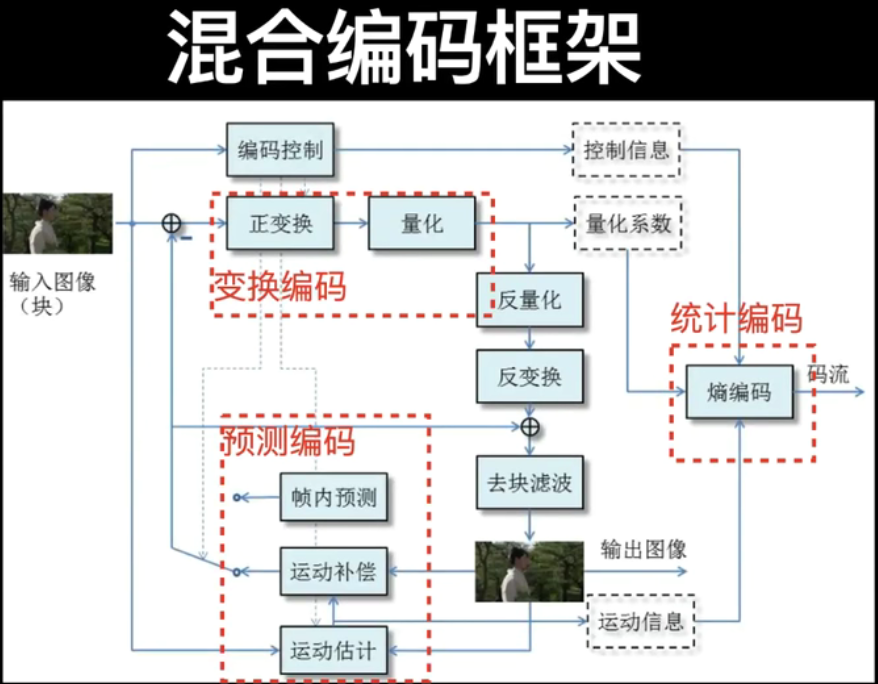
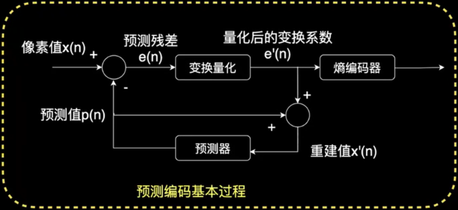
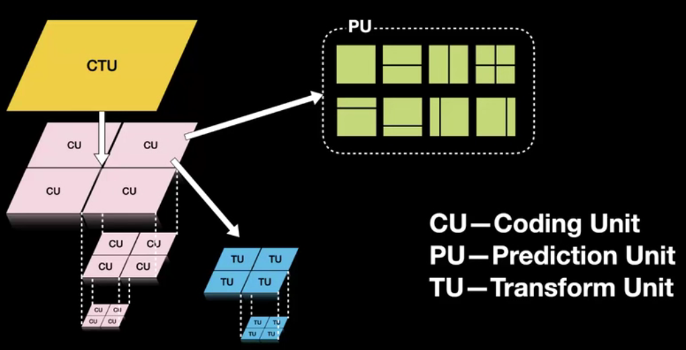
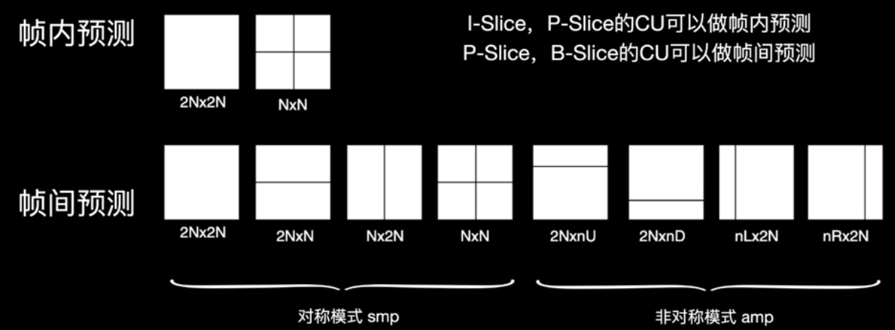
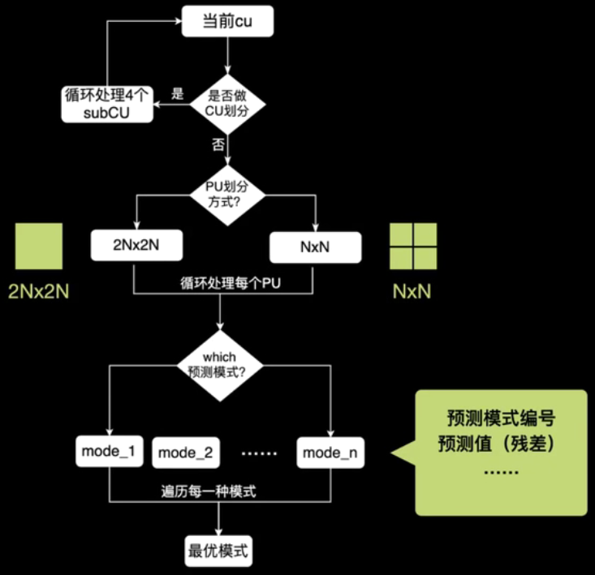
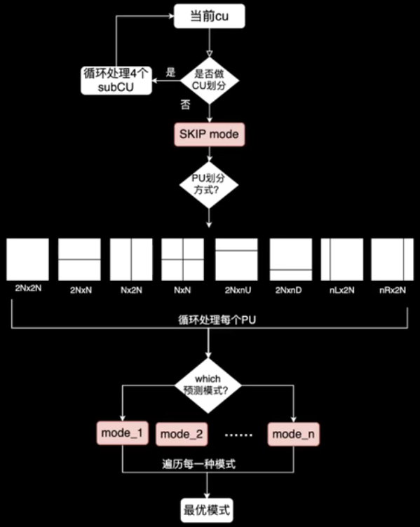

# H.265/HEVC

- 整体流程图

  

## 预测编码

- 基本过程

  

- 编码单元划分：CTU（Coding Tree Uint）64*64

  

- 预测单元划分：

  

- 帧内预测

  - 模式（共35种）：

    - PLANAR模式（模式编号0）：正左边、正上面、左下角、右上角四个像素的加权求和
    - DC模式（模式编号1）：正左边、正上面的平均，边缘还会有额外加权以保证平滑
    - 33种角度模式（模式编号2~34）

  - 步骤：①相邻参考像素的获取；②参考像素的平滑滤波；③预测像素的计算

    

- 帧间预测

  - 运动矢量MV（motion vector）
  - 步骤：