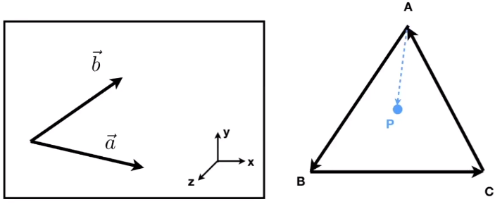

# GAMES101-现代计算机图形学入门-闫令琪

>https://www.bilibili.com/video/BV1X7411F744

## Lecture 01 Overview of Computer Graphics

- 从技术上讲，好的画面 ≈ 画面足够亮∵全局光照

- 特效是最简单的图形学应用，∵平常见的很少，不真实也看不出来；而最难的是日常中见得最多的东西，比如食物，很难让人觉得真实

- 课程的内容：rasterization、curves and meshes、ray tracing、animation / simulation

- 计算机视觉 与 计算机图形学 的最大区别：CV需要猜测（或多或少）

    

    PS: 边界越来越模糊

## Lecture 02: Review of Linear Algebra

- 图形学的基础：

    - mathematics：linear algebra、calculus（微积分）、statistics
    - physis：optics（光学）、mechaincs（力学）
    - aesthetics（美学）
    - misc：signal processing、numerial analysis（数值分析）

- 向量点乘（dot product）的作用：①取得两个向量的夹角；②取得一个向量在另一个向量的投影；③衡量2个向量的接近程度（可用于计算金属表面反射的高光区域）；④反映前后信息（即点乘>0或者<0）
    $$
    \vec{a} \cdot \vec{b}=\|\vec{a}\|\|\vec{b}\| \cos \theta
    $$
    向量叉乘（cross product）：使用右手定则
    $$
    \|a \times b\|=\|a \|\| b \| \sin \phi
    $$

    - 注意：OpenGL中使用的是左手；$\vec{a} \times \vec{a}=\overrightarrow{0}$（注意是零向量，不是零）

    - 叉乘的矩阵形式
        $$
        \vec{a} \times \vec{b}=A^* b=\left(\begin{array}{ccc}
        0 & -z_a & y_a \\
        z_a & 0 & -x_a \\
        -y_a & x_a & 0
        \end{array}\right)\left(\begin{array}{l}
        x_b \\
        y_b \\
        z_b
        \end{array}\right)=\left(\begin{array}{c}
        y_a z_b-y_b z_a \\
        z_a x_b-x_a z_b \\
        x_a y_b-y_a x_b
        \end{array}\right)
        $$

    - 叉乘的作用：

        

        - 判断左右：$\vec{a} \times \vec{b}>0$，b在a的左侧；$\vec{a} \times \vec{b}<0$，a在b的左侧

        - ==判断内外（光栅化的基础）==：P都在三条边的同侧，则在△内，否则在外。例如
            $$
            f_0=A \times B, f_1=B \times C, f_2=C \times A\\
            若\left\{\begin{array}{l}
            \left(p \cdot f_0\right) \times\left(f_0 \cdot C\right)>0 \\
            \left(p \cdot f_1\right) \times\left(f_1 \cdot A\right)>0 \\
            \left(p \cdot f_2\right) \times\left(f_2 \cdot B\right)>0
            \end{array}\right. ,则p在△内
            $$
            若P正好在三角形的边上，内外自己说了算（属于corner case）
    
- 坐标系的构建：
    $$
    \begin{array}{r}
    \|\vec{u}\|=\|\vec{v}\|=\|\vec{w}\|=1 \\
    \vec{u} \cdot \vec{v}=\vec{v} \cdot \vec{w}=\vec{u} \cdot \vec{w}=0 \\
    \vec{w}=\vec{u} \times \vec{v} \quad \text { (右手法则) } \\
    \vec{p}=(\vec{p} \cdot \vec{u}) \vec{u}+(\vec{p} \cdot \vec{v}) \vec{v}+(\vec{p} \cdot \vec{w}) \vec{w}
    \end{array}
    $$

## Lecture 03: Transformation

- 二维变换

    - scale：可用于翻转
        $$
        \left[\begin{array}{l}
        x^{\prime} \\
        y^{\prime}
        \end{array}\right]=\left[\begin{array}{ll}
        s_x & 0 \\
        0 & s_y
        \end{array}\right]\left[\begin{array}{l}
        x \\
        y
        \end{array}\right]
        $$

    - shear：水平切变
        $$
        \left[\begin{array}{l}
        x^{\prime} \\
        y^{\prime}
        \end{array}\right]=\left[\begin{array}{ll}
        1 & a \\
        0 & 1
        \end{array}\right]\left[\begin{array}{l}
        x \\
        y
        \end{array}\right]
        $$
        
    - rotation：绕原点旋转，旋转矩阵为正交矩阵（即逆=转置）
        $$
        \left[\begin{array}{l}
        x^{\prime} \\
        y^{\prime}
        \end{array}\right]=\left[\begin{array}{cc}
        \cos \theta & -\sin \theta \\
        \sin \theta & \cos \theta
        \end{array}\right]\left[\begin{array}{l}
        x \\
        y
        \end{array}\right]
        $$
        注意：$R_{-\theta}=R_\theta^{-1}=R^{\top}$
    
    - linear transform: 上面三个的统一
        $$
        \left[\begin{array}{l}
        x^{\prime} \\
        y^{\prime}
        \end{array}\right]=\left[\begin{array}{ll}
        a & b \\
        c & d
        \end{array}\right]\left[\begin{array}{l}
        x \\
        y
        \end{array}\right]
        $$
    
    - translation：
    
        - 2d point = $(x, y, 1)^{\top}$
            $$
            \left(\begin{array}{c}
            x^{\prime} \\
            y^{\prime} \\
            w^{\prime}
            \end{array}\right)=\left(\begin{array}{ccc}
            1 & 0 & t_x \\
            0 & 1 & t_y \\
            0 & 0 & 1
            \end{array}\right) \cdot\left(\begin{array}{l}
            x \\
            y \\
            1
            \end{array}\right)=\left(\begin{array}{c}
            x+t_x \\
            y+t_y \\
            1
            \end{array}\right)
            $$
    
        - 2d vector = $(x, y, 0)^{\top}$，有平移不变形
    
        > vector + vector = vector
        >
        > point - point = vector
        >
        > point + vector = point
        >
        > point + point = center of 2 point, ∵人为定义$(x, y, w)^{\top} \Leftrightarrow (x/w, y/w, 1)^{\top}$
    
    - affine map = linear map + translation
        $$
        \left(\begin{array}{l}
        x^{\prime} \\
        y^{\prime} \\
        1
        \end{array}\right)=\left(\begin{array}{llc}
        a & b & t_x \\
        c & d & t_y \\
        0 & 0 & 1
        \end{array}\right) \cdot\left(\begin{array}{l}
        x \\
        y \\
        1
        \end{array}\right)
        $$
    
- 以任意点（c）进行旋转：把所有点往-c移$T(-c)$，旋转$R(\theta)$完成后，再往c移动$T(c)$，即
    $$
    A=T(c)R(\theta)T(-c)
    $$

## Lecture 04: Transformation Cont

- 三维绕轴顺时针旋转：

    - 绕x轴：因为$y\times z \rightarrow x$，满足xyzxyz...的顺序，所以跟二维的一样
        $$
        \mathbf{R}_x(\alpha)=\left(\begin{array}{cccc}
        1 & 0 & 0 & 0 \\
        0 & \cos \alpha & -\sin \alpha & 0 \\
        0 & \sin \alpha & \cos \alpha & 0 \\
        0 & 0 & 0 & 1
        \end{array}\right)
        $$
        
    - 绕y轴：因为$z\times x \rightarrow y$，不满足xyzxyz...的顺序，所以跟二维相反
        $$
        \mathbf{R}_y(\alpha)=\left(\begin{array}{cccc}
        \cos \alpha & 0 & \sin \alpha & 0 \\
        0 & 1 & 0 & 0 \\
        -\sin \alpha & 0 & \cos \alpha & 0 \\
        0 & 0 & 0 & 1
        \end{array}\right)
        $$
        
    - 绕z轴：因为$x\times y \rightarrow z$，满足xyzxyz...的顺序，所以跟二维一样
        $$
        \mathbf{R}_z(\alpha)=\left(\begin{array}{cccc}
        \cos \alpha & -\sin \alpha & 0 & 0 \\
        \sin \alpha & \cos \alpha & 0 & 0 \\
        0 & 0 & 1 & 0 \\
        0 & 0 & 0 & 1
        \end{array}\right)
        $$

    - 绕任意轴$h=(a,b,c)$顺时针旋转$\alpha$ 角：先把$h$轴绕z轴转到$zOx$平面（角度为$-\theta$，矩阵为$m^{-1}$），再绕y轴旋转（角度为$-\phi$，矩阵为$n^{-1}$）到与z轴重合，接着转$\alpha$（矩阵为$A$），最后转回去
        $$
        R=m\cdot n\cdot A\cdot n^\top \cdot m^\top
        $$

- euler angles: roll + pitch + yaw

- rotation by angle $\alpha$ around axis $n$

    $$
    \mathbf{R}(\mathbf{n}, \alpha)=\cos (\alpha) \mathbf{I}+(1-\cos (\alpha)) \mathbf{n} \mathbf{n}^T+\sin (\alpha) \underbrace{\left(\begin{array}{ccc}
    0 & -n_z & n_y \\
    n_z & 0 & -n_x \\
    -n_y & n_x & 0
    \end{array}\right)}_{\mathbf{N}}
    $$

- 四元数：多用于旋转的插值

- **拍照的过程（MVP）**= **m**odel transformation（布置好实景）=> **v**iew transformation（摆好相机）=> projection tranformation（3D=>2D）

- viewing transformation = camera/eye transformation + projection transformation + viewport

- camera transformation = position $\vec{e}$ + look-at/gaze direction $\hat{g}$ + up direction $\hat{t}$

    

    - 约定俗成：相机在原点$(0,0,0)$，向上为Y轴，看向-Z轴
    - 把相机摆成约定俗称的样子。先平移再旋转，即
        $$
        M_{\text {view }}=R_{\text {view }} T_{\text {view }}\\
        M_{\text {透 } \rightarrow \text { 正 }}=\left(\begin{array}{llll}
        n & 0 & 0 & 0 \\
        0 & n & 0 & 0 \\
        0 & 0 & n+f & -nf \\
        0 & 0 & 1 & 0
        \end{array}\right)
        $$
        
        - 平移：相机挪到原点$(0,0,0)$
            $$
            T_{\text {view }}=\left[\begin{array}{cccc}
            1 & 0 & 0 & -x_e \\
            0 & 1 & 0 & -y_e \\
            0 & 0 & 1 & -z_e \\
            0 & 0 & 0 & 1
            \end{array}\right]
            $$
        
        - 旋转：先将$\hat{g}$旋转到-Z轴，然后再将$\hat{t}$旋转到Y轴，最后将$\hat{g}\times \hat{t}$旋转到X轴。但是这样的旋转矩阵很难写。不过可以考虑先写它的逆，然后利用旋转矩阵的正交性，简单很多，即
            $$
            R_{* i \text { iew }}^{-1}=\left[\begin{array}{cccc}
            x_{\hat{g} \times \hat{t}} & x_t & x_{-g} & 0 \\
            y_{\hat{g} \times \hat{t}} & y_t & y_{-g} & 0 \\
            z_{\hat{g} \times \hat{t}} & z_t & z_{-g} & 0 \\
            0 & 0 & 0 & 1
            \end{array}\right] \leftrightarrow 
            R_{\text {view }}=\left[\begin{array}{cccc}
            x_{\hat{g} \times \hat{t}} & y_{\hat{g} \times \hat{t}} & z_{\hat{g} \times \hat{t}} & 0 \\
            x_t & y_t & z_t & 0 \\
            x_{-g} & y_{-g} & z_{-g} & 0 \\
            0 & 0 & 0 & 1
            \end{array}\right]
            $$

- projection transformation

    - perspective projection（透视投影）：近大远小
    - orthographic projection（正交投影）：假设相机在无穷远

- **正交投影**：

    - 最简单的方法：丢掉z坐标，然后把x、y归一化到[-1, 1]

    - 常用方法：①在空间中定义一个$[l,r]\times[b,t]\times[f,n]$大小的长方体；②将其变换到$[-1,1]^3$大小的标准立方体（canonical cube），其中心在原点，其变换矩阵（先平移再缩放）为
        $$
        M_{\text {ortho }}=\left[\begin{array}{cccc}
        \frac{2}{r-l} & 0 & 0 & 0 \\
        0 & \frac{2}{t-b} & 0 & 0 \\
        0 & 0 & \frac{2}{n-f} & 0 \\
        0 & 0 & 0 & 1
        \end{array}\right]\left[\begin{array}{cccc}
        1 & 0 & 0 & -\frac{r+l}{2} \\
        0 & 1 & 0 & -\frac{t+b}{2} \\
        0 & 0 & 1 & -\frac{n+f}{2} \\
        0 & 0 & 0 & 1
        \end{array}\right]
        $$
        注意：l<r，b<t，但是f>n ∵使用右手系，看向-z轴（这也是OpenGL使用左手系的原因）

- **透视投影**：将透视变换的截头椎体（frustum）挤压成一个长方体（cuboid）（即$M_{\text {透} \rightarrow \text { 正 }}$），然后做正交变换（即$M_{\text {正}}$）。
    $$
    M_{\text {透}}=M_{\text {正}}M_{\text {透} \rightarrow \text { 正 }}=M_{\text {正}}
    $$
    推导如下
    
    
    
    - 根据相似三角形，可以获截头椎体中任意一点的坐标$(x',y')$，而且在挤压的过程中不变
        $$
        y^{\prime}=\frac{n}{z} y \quad x^{\prime}=\frac{n}{z} x\\
        M_{\text {透 } \rightarrow \text { 正 }}^{(4 \times 4)}\left(\begin{array}{c}
        x \\
        y \\
        z \\
        1
        \end{array}\right)=
        \left(\begin{array}{c}
        n x / z \\
        n y / z \\
        ? \\
        1
        \end{array}\right) \leftrightarrow
        \left(\begin{array}{c}
        n x \\
        n y \\
        ? \\
        z
        \end{array}\right)\\
        $$
        注意：这里$\leftrightarrow$的右边乘上n是为了让$M_{\text {透 } \rightarrow \text { 正 }}$的最后一列是1
    
        得
        $$
        M_{\text {透 } \rightarrow \text { 正 }}=\left(\begin{array}{llll}
        n & 0 & 0 & 0 \\
        0 & n & 0 & 0 \\
        ? & ? & ? & ? \\
        0 & 0 & 1 & 0
        \end{array}\right)
        $$
        
    
        
        
    - 又因为距离相机光心最近的平面上的点的z一直为n，所以得到方程
        $$
        M_{\text {透 } \rightarrow \text { 正 }}^{(4 \times 4)}\left(\begin{array}{c}
        x \\
        y \\
        n \\
        1
        \end{array}\right)=
        \left(\begin{array}{c}
        n x \\
        n y \\
        n^2 \\
        n
        \end{array}\right)\\
        $$
        得到$M_{\text {透 } \rightarrow \text { 正 }}$的第三行为$\left(\begin{array}{llll} 0 & 0 & A & B\end{array}\right)$，且满足
        $$
        A n+B=n^2\label{a}
        $$
    
    - 又因为远平面的中心点在挤压前后不变，得
        $$
        \left(\begin{array}{llll} 0 & 0 & A & B\end{array}\right)\left(\begin{array}{l}
        0 \\
        0 \\
        f \\
        1
        \end{array}\right)=\left(\begin{array}{c}
        0 \\
        0 \\
        f^2 \\
        f
        \end{array}\right)
        $$
        所以满足
        $$
        A f+B=f^2
        $$
    
    - 联立公式27和公式26，得
        $$
        M_{\text {透 } \rightarrow \text { 正 }}=\left(\begin{array}{llll}
        n & 0 & 0 & 0 \\
        0 & n & 0 & 0 \\
        0 & 0 & n+f & -nf \\
        0 & 0 & 1 & 0
        \end{array}\right)
        $$
        

## Lecture 05: Rasteriaztion 1 (Triangles)

-  透视变换的2个基本概念

    - field-of-view(fovY): 视角，分vertical、horizontal

    - aspect ratio: 高宽比

        

    - 可以根据fovY、aspect ratio反推正交投影的l、r、b、t
        $$
        \begin{gathered}
        \tan \frac{\text { fov } Y}{2}=\frac{t}{|n|} \\
        \text { aspect }=\frac{r}{t}
        \end{gathered}
        $$
        

- pixel = picture element；raser(光栅)=screen in German；rasterize(光栅化)=drawing onto the screen

- viewport：正交投影中归一化后的立方体投影到屏幕上，$[-1,1]\rightarrow [0,width]\times[0,height]$
    $$
    M_{\text {viewport }}=\left(\begin{array}{cccc}
    \frac{\text { width }}{2} & 0 & 0 & \frac{\text { width }}{2} \\
    0 & \frac{\text { height }}{2} & 0 & \frac{\text { height }}{2} \\
    0 & 0 & 1 & 0 \\
    0 & 0 & 0 & 1
    \end{array}\right)
    $$

- 光栅化：将立方体投影到屏幕上的图片打碎（离散）成像素

- 图形学的几何基元：triangle（三角形）

    - 优点：①最简单的多边形，可以构成其他多边形；②一定是平面，内外易区分，可通过顶点信息插值内部的任意一点信息
    - 任何三维模型都可以使用三角面片（mesh）来表示，3D的三角形投影到屏幕（2D）上还是三角形

- 投影到屏幕上的三角面片的光栅化：（离散）**采样sampling**，即通过判断**像素中心**是否在△内

    - 优化（不计算屏幕上的所有像素）：①使用bounding box；②沿着△边缘，即阶梯状（每行像素值考虑最左和最右） 

        

- （离散）采样会导致**锯齿Jappies**（也叫走样aliasing）：∵像素有大小，且采样率对信号不够高（香农定理）∴需要抗锯齿or反走样（antialiasing）

- LCD屏幕：绿色更多，∵人眼对绿色更敏感

## Lecture 06: Rasterization 2 (Antialiasing and Z-Buffering)

- Sampling Artifacts = Error/Mistakes/Inaccuracies in Computer Graphics，例如

    - 莫尔纹（Moire Patterns）：比如将图片的奇数行和列去掉，然后放大成一样的大小，就会出现
    - 锯齿
    - 人眼看高速行驶的汽车车轮倒转（∵人眼对时间的采样跟不上了）
    - 本质原因：采样频率跟不上信号频率

- **走样（Aliases）**的本质：（从时域角度）对于两个不同频率的信号，同一采样速率得到的结果相同

- 图像的频率=像素之间变换的剧烈程度。边缘为高频，平滑为低频

- 图像经过傅里叶变换后得到频谱图

    - 中间区域为低频信号，外边为高频信息，亮度为信号大小
    - 通常会有垂直、水平的2条亮线，∵图片一遍没有重复区域，其周期为本身，即整个平面（无限大）被这张图像挨着铺满，导致左右、上下的交界处产生剧烈的信号变化

- 图像中fiter的本质：时域的卷积 = 频域的乘积

- Filter Kernel越大，越只能保留低频信息

- Sampling的本质（频域）：重复信号在频域上的内容

    ∵信号的周期从$-\infin \sim \infin$ ∴信号转到频域后无周期性；而采样就是（周期性）间隔的单位脉冲信号，转到频域后仍为周期性的脉冲，∴信号经周期性的脉冲信号采样后也呈周期性

    

    注意：①左边一列是时域，右边一列是频域；②图d中脉冲频率↑，间隙↑

- 走样（Aliasing）的本质：采样（脉冲）的频率太低，导致频域上出现重叠

    

- 反走样（Antialiasing）的思路：在采样之前做个模糊（滤波）操作。不能反着来（称为blurred-aliases）

    

    

- 反走样（Antialiasing）的方法

    - 方法一：computing average pixel value，像素颜色 <=> 其中各种颜色所占区域的平均

        - 缺点：需要计算精确面积，计算量太大

        

    - 方法二：MSAA(Multisample anti-aliasing)，只是对反走样中模糊操作的近似

        - 与超分辨率类似，将一个像素分成多个小像素（比如n个），根据其中在三角形内的比例来确定这个像素的颜色，没有改变最终的分辨率

        - 缺点：增加计算量

    - 方法三：FXAA(Fast Approximate AA)，与采样无关，是一种图像的后期处理（大概只是在边缘处做抗锯齿）

    - 方法四：TAA(Temporal AA)，与时间相关，使用上一帧的数据

## Lecture 07: Shading 1 (Illumination, Shading and Graphics Pipeline)

- visibility / occlusing: 在空间中有很多物体（△）光栅化后出现遮挡∴需要进行判断

    - 想法一：painter‘s algorithm，即像油画先画远再画近，n个三角形的复杂度O(nlogn)，但是没有绝对的远近，所以不行

        

    - 想法二：Z-Buffer/Depth-Buffer，即每一帧都维护一个frame buffer（RGB图）+ depth buffer（Depth图）

        - 本质：depth图的每一个像素一直都是最小值，n个三角形的复杂度O(n)∵只用比较取最小值 无需排序
        - 注意：① Z取绝对值，保证小的近，大的远；②在MSAA中对采样点（而非像素）计算；③与计算物体（△）的顺序无关，结果一样，∴可以用GPU；④由于depth为浮点数，理论上同一位置不会有两个depth相等（实际上可能会有，但是暂不考虑）；⑤不能处理透明物体

- 着色（Shading）：the process of applying a **material** of an object

- 最简单的shading model：Blinn-Phong Reflectance Model

    - 反射的分类：specular highlights（镜面高光）、diffue reflection（漫反射）、ambient lighting（环境光，可以化简为常量）

    - 输入：viewer direction $\vec{v}$, surface normal $\vec{n}$, light direction $\vec{l}$, surface parameters (color, shininess, ...)

        注意：向量都是单位向量、朝向朝外，光线有很多束

    - shading有局部性：考虑每个shading point周围的一小块区域，不考虑光线是否被其他物体遮挡（shading≠shadow）

- Blinn-Phong中的**漫反射**：

    

    - 入射角度影响光强：$cos \theta=\vec{l}\cdot \vec{n}$
    - 距离影响光强：假设距离光源 单位距离处，光强为$I$；以光源为球心的任意球面上的能量之和都是$4\pi I$（不考虑损失），∴距离光源$r$的光强为$I/r^2$
    - $\text{max}(\cdot, \cdot)$是为了防止$\theta>90\degree$ or $\theta<-90\degree$

## Lecture 08: Shading 2 (shading, Pipeline and Texture Mapping)

- Blinn-Phong中的**高光**（Specular Term）：在光源镜面反射方向$\vec{R}$

    - 思路一：看$\vec{v}$与$\vec{R}$的接近程度（属于Phong Reflectance Model）

    - 思路二：看$\vec{v}$与$\vec{l}$的平均（$\vec{h}$）与$\vec{n}$的接近程度

        

        因为$\vec{R}$计算复杂，∴选思路二

        注意：指数$p$是为了控制高光大小，一般在100~200；高光一般认为是白色
        
        

- Blinn-Phong中的**环境光**（Ambient Term）：简化为常数$I_a$（与光源、视角无关），用于保证不是全照

    

- ==Blinn-Phong Relection Model==
    $$
    \begin{aligned}
    L & =L_a+L_d+L_s \\
    & =k_a I_a+k_d\left(I / r^2\right) \max (0, \mathbf{n} \cdot \mathbf{l})+k_s\left(I / r^2\right) \max (0, \mathbf{n} \cdot \mathbf{h})^p
    \end{aligned}
    $$
    

- Shading Frequencies（着色频率）

    

    - **Flat shading**：shade each triangle，平面法向量=三角形的两边叉乘
    - **Gouraud shading**：shade each vertx，顶点法向量=其所在（多个）平面法向量的简单平均or加权平均，△内部的通过Barycentric interpolation(重心坐标)
    - **Phong shading**：shade each pixel，像素法向量=顶点法向量插值

- ==Graphics (Realtime Rendering) Pipeline==

    

- shader：控制顶点和像素如何处理的代码

- Texture Mapping (纹理映射)：将三维物体的表面映射到二维平面$(u,v)$（范围0-1，方便处理），类似将地球=>地图（具体映射算法不用了解）

    - 对于一个三维场景，可以将其分割成一个个物体后，分别映射到二维平面
    - 重复的三维物体（比如地板）可以使用相同的纹理，但是要保证上下左右能衔接（有专门的算法）

    

## Lecture 09: Shading 3 (Texture Mapping Cont.)

- Barycentirc Coordinates（重心坐标）：用于△中任意位置的插值，可用于纹理、颜色、法向量等
    $$
    (x, y)=\alpha A+\beta B+\gamma C ,\text{且}
    \alpha+\beta+\gamma=1
    \\
    \begin{aligned}
    \alpha & =\frac{S_{\triangle BCP}}{S_{\triangle ABC}}=\frac{-\left(x-x_B\right)\left(y_C-y_B\right)+\left(y-y_B\right)\left(x_C-x_B\right)}{-\left(x_A-x_B\right)\left(y_C-y_B\right)+\left(y_A-y_B\right)\left(x_C-x_B\right)} \\
    \beta & =\frac{S_{\triangle ACP}}{S_{\triangle ABC}}=\frac{-\left(x-x_C\right)\left(y_A-y_C\right)+\left(y-y_C\right)\left(x_A-x_C\right)}{-\left(x_B-x_C\right)\left(y_A-y_C\right)+\left(y_B-y_C\right)\left(x_A-x_C\right)} \\
    \gamma & =\frac{S_{\triangle ABP}}{S_{\triangle ABC}}=1-\alpha-\beta
    \end{aligned}
    $$
    

    注意：① 如果$\alpha$、$\beta$、$\gamma$都大于0，则P在△ABC内，否则在外面

    ​	   ② 三维与二维同理

    ​	   ③ 重心坐标没有投影不变形，即三维重心坐标投影到二维后可能不等于二维重心坐标（例如depth）∴要在三维空间中插值后再投影到二维

    ​	   ④ 三角形的重心为$(\alpha, \beta, \gamma)=\left(\frac{1}{3}, \frac{1}{3}, \frac{1}{3}\right)$

- Texture Mapping的最简单方法：直接取纹理中对应位置的颜色作为所需颜色（即漫反射系数$k_d$

    - 问题1（Texture Magnification）：像素分辨率(pixel)  > 纹理分辨率(texel)

        - 可以使用bilinear filtering、bicubic filtering

    - 问题2（Texture Magnification）：像素分辨率(pixel)  < 纹理分辨率(texel)

        - 如果直接映射，会导致远处出现莫尔纹（Moire）、近处出现锯齿（Jaggies，本质是采样频率<<信号频率）

        - 方法一：使用antialiasing，但是计算量太大

        - 方法二：**Mipmap**，一种快速、近似正方形的范围查找法，有硬件支持

            - 先创建图像金字塔，最多多占用1/3的内存

            - 将screensapce中要贴图的像素 以及 其邻居（下图左边），投影到texture space（下图右边），计算当前像素在投影后的大小，再近似成正方形的长度（即取最长的边长，下图中的$L$），根据这个长度到图像金字塔中对应的层（下图中的$D$）里面进行查询

                

            - 如果反投影后的长度不为整数，可以用金字塔中相邻的层进行三线性插值

                缺点：因为是方形近似，所以远处会模糊一片

- **Anisotropic Filtering**（**各向异性过滤**）：相比Mipmap，增加长/宽上的不同压缩，即矩形近似（但对于斜的效果还不是很好），可以部分解决Mipmap中模糊的问题，但是内存是原来的3倍

    

- EWA Filtering（椭圆加权平均滤波）：用椭圆多次覆盖

## Lecture 10: Geometry 1 (Introductiong)

- 纹理（texturing）的应用：在moden GPU中，texture = memory + range query (filtering)

    - Environment lighting: 用纹理记录环境光照（来源无限远）

        - Spherical map：类似将地球表面展开形成矩形的地图，但是上、下会有很严重的扭曲
        - Cub map：将球表面每个店沿着半径向外与立方体相交，然后展开立方体，扭曲大大减少、但是查找会困难一些

    - Affect shading: 用纹理改变物体的阴影

        

        - Bump / Normal mapping：用纹理记录 height / normal ∵ 正常的纹理与几何表面距离为0 && 垂直不改变物体的几何结构，只是欺骗人的眼睛

            - 计算方法：在几何表面的局部坐标系下，原始
                $$
                \left\{\begin{array}{l}
                d p / d u=c 1 *[h(\mathbf{u}+1)-h(\mathbf{u})] \\
                d p / d v=c 2 *[h(\mathbf{v}+1)-h(\mathbf{v})]\\
                \end{array}\right.\\
                n=(-d p / d u,-d p / d v, 1) \cdot \text { normalized() }
                $$

            - 缺点：①看着凸起来的地方在其旁边不会留下投影；②在物体边缘仍为几何表面的形状，不会有凹凸

        - Displacement mapping：改变几何表面的顶点，与上一中方法使用相同的纹理

            - 缺点：要求mesh模型足够细腻 ∵只能动顶点，不能动△内部 ∴要求△顶点的间隔频率>纹理定义的频率（即把大△看起来被拆成小△）
            - 优化（即dynamic displacement mapping）：先做一个粗糙的模型，在映射纹理的过程中检测一下，应该拆分的地方再拆成更小、更细腻的△

    - 三维纹理：通过三维的噪声函数定义（3D procedural noise）定义空间中任意一点的纹理（solid modeling）

        

    - 记录已经算好的东西：比如记录Ambient occlusion texture map (环境光遮蔽)

    - volume rendering：体积渲染，比如渲染人的皮肤、器官、骨架等

- 几何的表示形式

    - Implict：隐式，通过constructive solid geometry (CSG) 构造复杂几何（多个简单几何的加、减、交、与等），从而写出点满足的方程or关系（绝对连续） ，或者用distance function (SDF)，或者用Fractals（分形）

        例如：$f(x, y, z)=\left(2-\sqrt{x^2+\hat{y}^2}\right)^2+z^2-1$ 表示一个三维圆环（甜甜圈）

    - Explicit：显式，直接给出所有点 or 通过参数映射（parameter mapping），是离散的

        例如：$f(u, v)=((2+\cos u) \cos v,(2+\cos u) \sin v, \sin u)$ 表示一个三维圆环（甜甜圈）

    - 隐式的缺点：很不直观，很难表示复杂的model     => 显式的优点

        ​	  优点：① 很容易判断一个点 与几何的位置关系 => 显式的缺点

        ​			例$f(x,y,z)=0$在表面上，$<0$在内部，$>0$在外部

        ​		     ② good for ray-to-surface intersection

        ​		     ③ easy to handle change in topology (e.g. fluid)

        ​		     ④ compact description

## Lecture 11: Geometry 2 (Curves and Surface)

- Bézier curve（贝塞尔曲线）：参数定义的显示表示（可二维、可三维）

    - 阶次n=点数-1(∵n从0开始)，两个控制点的叫Cube Bézier Curve（3阶），一个控制点的叫Quadratic Bézier Curve（2阶）

    - 画线方法：de Casteljau Algorithm

        

        选取起点和终点（$b_0$、$b_3$）及其控制点（$b_1$、$b_2$），令t从0→1（0表示起点，1表示终点），在每条线上根据t的比例选点然后依次连线（上图虚线$b_0^1 b_1^1$和$b_2^1 b_1^1$），不断重复上个步骤，直到剩下一条虚线（$b_0^2 b_1^2$），其上面的点（$b_0^3$）即为贝塞尔曲线
        $$
        \begin{aligned}
         \mathbf{b}_0^1(t)=&(1-t) \mathbf{b}_0+t \mathbf{b}_1 \\
         \mathbf{b}_1^1(t)=&(1-t) \mathbf{b}_1+t \mathbf{b}_2 \\
        \mathbf{b}_0^2(t)=&(1-t) \mathbf{b}_0^1+t \mathbf{b}_1^1\\
        =&(1-t)^2 \mathbf{b}_0+2 t(1-t) \mathbf{b}_1+t^2 \mathbf{b}_2
        \end{aligned}
        $$

    - 代数形式（Algebraic Formula）：n阶贝塞尔曲线（n=点数-1，∵n从0开始）

        

        例如 n=3（即2个控制点）

        PS: 如果把$b^n(t)$中所有的$B^n_i(t)$绘制在一个坐标系上，对称，且任意画一条竖线的交点的y坐标之和为1

        

    - 性质

        - 在仿射变换下有不变性，即可对控制点进行仿射变换后再划线 = 对画好的线直接变换；但对投影不行
        - 曲线在控制点形成的凸包（convex hull）内
        - 起点切线（tangent）：$\quad \mathbf{b}^{\prime}(0)=3\left(\mathbf{b}_1-\mathbf{b}_0\right) ; \quad \mathbf{b}^{\prime}(1)=3\left(\mathbf{b}_3-\mathbf{b}_2\right)$

- Piecewise(分段) Bézier Curve：当n很大时，将其分段（通常4个点一段，例如Photoshop中的钢笔功能）

    - 原因：当n很大时，画每个点都要很多计算，而且动一个点 整个曲线都要动，不好控制

    - 连续的种类

        - $C^0$ continuity：两段之间仅有几何连续（即两段曲线共享一个端点）

        - $C^n$ continuity：连接处的n阶导相等（一阶导就是切线的方向和长度一样）

- Spline（样条）：可控的曲线，由多项式分段定义

    B-spline：对贝塞尔曲线的扩展，具有局部性，使用奇函数（basis）

    NURBS：非均匀有理B样条 (Non-uniform rational B-spline)

- Bézier Surface（贝塞尔曲面）：在2个方向()上使用贝塞尔曲线，类似双线性插值，也有piecewise版本的

## Lecture 12: Geometry 3

- Mesh的操作：subdivision、simplification、regularzation

- Mesh Subdivision = 细分 + 调整

    - 算法一：Loop Subdivision（Loop是发明人的family name）

        - 步骤一：细分，将每1个△分成4个

            

        - 步骤二：调整，对于新生成的点（边界上的点），其位置为$\frac{3}{8}(A+B)+\frac{1}{8}(C+D)$，即AB多相信、CD少相信

            ​			 对于原来△的每个顶点，令 $n$ = 该点相连的边数（即degree），$u= \begin{cases}\frac{3}{16} & \text { if } n=3 \\ \frac{3}{8 n} & \text { other wise }\end{cases}$，其位置为$(1-n*u)*原始坐标 + u * 周围点之和$，即不仅要相信周围的点还要相信自己

            

        - 缺点：只能用于三角形的mesh

    - 算法二：Catmull-Clark Subdivision（可用于所有mesh）

        - 定义：non-quad face（非四边形面）, extraordinary vertex（奇异点，degree!=4）

        - 步骤一：细分，将每条边的中点与多边形中随便找个点（反正后面要调整）连线

            PS：第一次细分会增加奇异点，其个数=分割之前non-quad face个数（？？？），但是后续细分不会再增加（∵第一次细分后non-quad face就消失了）

        - 步骤二：调整

            

- Mesh Simplification：可以减少计算量 or 在不同场景（比如很处）使用不同复杂度的模型

    - Edge Collapsing：把每条线捏成一个点，然后计算ta的Quadric Error Metric（计算这个点到 与其连接的线 的距离平方之和最小的位置，这个Quadric Error作为这条边的Score），把所有score从小到大排列，从最小的开始捏。使用数据结构的堆（动态队列）更新其连接的线的score
    - 本质：局部最优=>全局最优（类似贪心）

- Shadow Mapping（阴影映射）：using rasterization to draw shadows（会有走样的问题）

    - 算法步骤：

        

        - 从光源（只能处理点光源）看场景，只记录depth image（shadow map，类似z-buffer）
        - 从 眼/相机 看场景，把看到的每个点计算到光源的depth
        - 如果步骤二的depth > 步骤一中同位置的depth，则为shadow；否则不是

    - 特点

        - 计算开销相比之前无阴影 *2
        - 此方法理论上用的是点光源，产生有明显边界的是<u>硬阴影</u>，否则是<u>软阴影</u>
        - shadow map的分辨率会影响阴影质量，分辨率降低了会有走样的问题（因为本质上就是光栅化）

## Lecture 13: Ray Tracing 1 (Whitted-Style Ray Tracing)

- Rasterization: fast, but quality is relativaly low

    Ray tracing: accurate, but very slow

- light rays的前提：① 光沿直线传播；② 光线不会发生碰撞；③ 光线可逆，即从光源出发，最终进入眼睛

- Recursive (Whitted-Style) Ray Tracing: 递归的光线追踪

    

    - 算法：光线从光源出发，经过每个像素中心向外，与三维空间中的物体相交后会发生多次反射/折射（理想的，并且存在能量损失），查看每个交点能否被光源看到（即把交点和光源连线），将能看到的交点的颜色（即phong）累加 就是图片上像素的颜色

    - 从眼睛出发，第一次和物体相交之前的光线称为primary ray / eye ray

        第一个交点之后的光线称为secondary ray / refracted ray

        光源与每个交点的连线称为shadow ray

- Ray-Surface Intersection：求ray和表面的交点

    - 光线的定义：$\mathbf{r}(t)=\mathbf{o}+t \mathbf{d} \quad 0 \leq t<\infty$，$\mathbf{o}$是起点，$\mathbf{d}$是方向

    - 光线与球 求交：球方程为$(\mathbf{p}-\mathbf{c})^2-R^2=0$，$\mathbf{p}$表示球上的点，$\mathbf{c}$是圆心，$R$是球半径

        令$\mathbf{p}=\mathbf{r}(t)$，求解$(\mathbf{o}+t \mathbf{d}-\mathbf{c})^2-R^2=0$，大于0的实数就是解

    - 光线与其他任何隐式表面 求交：隐式表面方程为$f(\mathbf{p})=0$，求解$f(\mathbf{o}+t \mathbf{d})=0$

    - 光线与三角形mesh 求交：

        - 用途：可以通过ray tracing判断一个点在物体内部or外部，即连接光源和该点，如果交点数为奇数，则在内部，否则在外部

        - 最简单的方法，跟每个三角形求交

        - 方法一：先求光线与平面交点，然后查看交点再△内or外

            平面方程：点法式$\left(\mathbf{p}-\mathbf{p}^{\prime}\right) \cdot \mathbf{N}=0$ <==> 一般式 $a x+b y+c z+d=0$

            求交：$\left(\mathbf{p}-\mathbf{p}^{\prime}\right) \cdot \mathbf{N}=\left(\mathbf{o}+t \mathbf{d}-\mathbf{p}^{\prime}\right) \cdot \mathbf{N}=0$ ==> $t=\frac{\left(\mathbf{p}^{\prime}-\mathbf{o}\right) \cdot \mathbf{N}}{\mathbf{d} \cdot \mathbf{N}} \quad$ 保证 $0 \leq t<\infty$

            判断在△内外：可用叉积 or 重心坐标

        - 方法二：Möller–Trumbore algorithm 更快，直接给出重心坐标，如果$b_1$、$b_2$、$b_1 - b_2$都非负，就在△内

            

            

- Accelerating Ray-Surface Intersection：因为跟场景中每个面 求交 太慢了

    - 方法一：Bounding Volumes，即Axis-Aligned Bounding Box （AABB）

        - 逻辑：如果光线不与bounding box相交，更不可能与里面的物体相交

        

        - 步骤：将光线与盒子的每个平面（无限大）求交点，获取到3对$\mathbf{t}_{\min }$和$\mathrm{t}_{\max }$（上图以二维为例，对应左边和中间的2张图），然后求这3个范围的交集（上图右边），即$t_{\text {enter }}=\max \left\{t_{\min }\right\}, t_{\text {exit }}=\min \left\{t_{\max }\right\}$
        - 使用AABB是因为与轴对齐，可以化简计算。例如在X轴，$t=\frac{\mathbf{p}_x^{\prime}-\mathbf{o}_x}{\mathbf{d}_x}$
        - 如果$t_{\text {exit }}<0$，说明bounding box在光源背后
        - 如果 $t_{\text {exit }}>=0$ and $t_{\text {enter }}<0$，说明光源在bounding box里面

