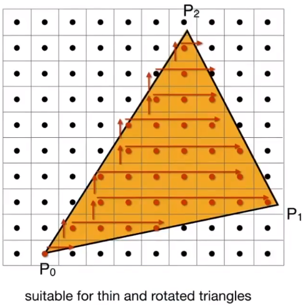
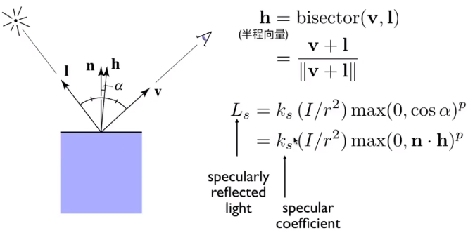

# GAMES101-现代计算机图形学入门-闫令琪

>https://www.bilibili.com/video/BV1X7411F744

## Lecture 01 Overview of Computer Graphics

- 从技术上讲，好的画面 ≈ 画面足够亮∵全局光照

- 特效是最简单的图形学应用，∵平常见的很少，不真实也看不出来；而最难的是日常中见得最多的东西，比如食物，很难让人觉得真实

- 课程的内容：rasterization、curves and meshes、ray tracing、animation / simulation

- 计算机视觉 与 计算机图形学 的最大区别：CV需要猜测（或多或少）

    

    PS: 边界越来越模糊

## Lecture 02: Review of Linear Algebra

- 图形学的基础：

    - mathematics：linear algebra、calculus（微积分）、statistics
    - physis：optics（光学）、mechaincs（力学）
    - aesthetics（美学）
    - misc：signal processing、numerial analysis（数值分析）

- 向量点乘（dot product）的作用：①取得两个向量的夹角；②取得一个向量在另一个向量的投影；③衡量2个向量的接近程度（可用于计算金属表面反射的高光区域）；④反映前后信息（即点乘>0或者<0）
    $$
    \vec{a} \cdot \vec{b}=\|\vec{a}\|\|\vec{b}\| \cos \theta
    $$
    向量叉乘（cross product）：使用右手定则
    $$
    \|a \times b\|=\|a \|\| b \| \sin \phi
    $$

    - 注意：OpenGL中使用的是左手；$\vec{a} \times \vec{a}=\overrightarrow{0}$（注意是零向量，不是零）

    - 叉乘的矩阵形式
        $$
        \vec{a} \times \vec{b}=A^* b=\left(\begin{array}{ccc}
        0 & -z_a & y_a \\
        z_a & 0 & -x_a \\
        -y_a & x_a & 0
        \end{array}\right)\left(\begin{array}{l}
        x_b \\
        y_b \\
        z_b
        \end{array}\right)=\left(\begin{array}{c}
        y_a z_b-y_b z_a \\
        z_a x_b-x_a z_b \\
        x_a y_b-y_a x_b
        \end{array}\right)
        $$

    - 叉乘的作用：

        

        - 判断左右：$\vec{a} \times \vec{b}>0$，b在a的左侧；$\vec{a} \times \vec{b}<0$，a在b的左侧

        - ==判断内外（光栅化的基础）==：P都在三条边的同侧，则在△内，否则在外。例如
            $$
            f_0=A \times B, f_1=B \times C, f_2=C \times A\\
            若\left\{\begin{array}{l}
            \left(p \cdot f_0\right) \times\left(f_0 \cdot C\right)>0 \\
            \left(p \cdot f_1\right) \times\left(f_1 \cdot A\right)>0 \\
            \left(p \cdot f_2\right) \times\left(f_2 \cdot B\right)>0
            \end{array}\right. ,则p在△内
            $$
            若P正好在三角形的边上，内外自己说了算（属于corner case）
    
- 坐标系的构建：
    $$
    \begin{array}{r}
    \|\vec{u}\|=\|\vec{v}\|=\|\vec{w}\|=1 \\
    \vec{u} \cdot \vec{v}=\vec{v} \cdot \vec{w}=\vec{u} \cdot \vec{w}=0 \\
    \vec{w}=\vec{u} \times \vec{v} \quad \text { (右手法则) } \\
    \vec{p}=(\vec{p} \cdot \vec{u}) \vec{u}+(\vec{p} \cdot \vec{v}) \vec{v}+(\vec{p} \cdot \vec{w}) \vec{w}
    \end{array}
    $$

## Lecture 03: Transformation

- 二维变换

    - scale：可用于翻转
        $$
        \left[\begin{array}{l}
        x^{\prime} \\
        y^{\prime}
        \end{array}\right]=\left[\begin{array}{ll}
        s_x & 0 \\
        0 & s_y
        \end{array}\right]\left[\begin{array}{l}
        x \\
        y
        \end{array}\right]
        $$

    - shear：水平切变
        $$
        \left[\begin{array}{l}
        x^{\prime} \\
        y^{\prime}
        \end{array}\right]=\left[\begin{array}{ll}
        1 & a \\
        0 & 1
        \end{array}\right]\left[\begin{array}{l}
        x \\
        y
        \end{array}\right]
        $$
        
    - rotation：绕原点旋转，旋转矩阵为正交矩阵（即逆=转置）
        $$
        \left[\begin{array}{l}
        x^{\prime} \\
        y^{\prime}
        \end{array}\right]=\left[\begin{array}{cc}
        \cos \theta & -\sin \theta \\
        \sin \theta & \cos \theta
        \end{array}\right]\left[\begin{array}{l}
        x \\
        y
        \end{array}\right]
        $$
        注意：$R_{-\theta}=R_\theta^{-1}=R^{\top}$
    
    - linear transform: 上面三个的统一
        $$
        \left[\begin{array}{l}
        x^{\prime} \\
        y^{\prime}
        \end{array}\right]=\left[\begin{array}{ll}
        a & b \\
        c & d
        \end{array}\right]\left[\begin{array}{l}
        x \\
        y
        \end{array}\right]
        $$
    
    - translation：
    
        - 2d point = $(x, y, 1)^{\top}$
            $$
            \left(\begin{array}{c}
            x^{\prime} \\
            y^{\prime} \\
            w^{\prime}
            \end{array}\right)=\left(\begin{array}{ccc}
            1 & 0 & t_x \\
            0 & 1 & t_y \\
            0 & 0 & 1
            \end{array}\right) \cdot\left(\begin{array}{l}
            x \\
            y \\
            1
            \end{array}\right)=\left(\begin{array}{c}
            x+t_x \\
            y+t_y \\
            1
            \end{array}\right)
            $$
    
        - 2d vector = $(x, y, 0)^{\top}$，有平移不变形
    
        > vector + vector = vector
        >
        > point - point = vector
        >
        > point + vector = point
        >
        > point + point = center of 2 point, ∵人为定义$(x, y, w)^{\top} \Leftrightarrow (x/w, y/w, 1)^{\top}$
    
    - affine map = linear map + translation
        $$
        \left(\begin{array}{l}
        x^{\prime} \\
        y^{\prime} \\
        1
        \end{array}\right)=\left(\begin{array}{llc}
        a & b & t_x \\
        c & d & t_y \\
        0 & 0 & 1
        \end{array}\right) \cdot\left(\begin{array}{l}
        x \\
        y \\
        1
        \end{array}\right)
        $$
    
- 以任意点（c）进行旋转：把所有点往-c移$T(-c)$，旋转$R(\theta)$完成后，再往c移动$T(c)$，即
    $$
    A=T(c)R(\theta)T(-c)
    $$

## Lecture 04: Transformation Cont

- 三维绕轴顺时针旋转：

    - 绕x轴：因为$y\times z \rightarrow x$，满足xyzxyz...的顺序，所以跟二维的一样
        $$
        \mathbf{R}_x(\alpha)=\left(\begin{array}{cccc}
        1 & 0 & 0 & 0 \\
        0 & \cos \alpha & -\sin \alpha & 0 \\
        0 & \sin \alpha & \cos \alpha & 0 \\
        0 & 0 & 0 & 1
        \end{array}\right)
        $$
        
    - 绕y轴：因为$z\times x \rightarrow y$，不满足xyzxyz...的顺序，所以跟二维相反
        $$
        \mathbf{R}_y(\alpha)=\left(\begin{array}{cccc}
        \cos \alpha & 0 & \sin \alpha & 0 \\
        0 & 1 & 0 & 0 \\
        -\sin \alpha & 0 & \cos \alpha & 0 \\
        0 & 0 & 0 & 1
        \end{array}\right)
        $$
        
    - 绕z轴：因为$x\times y \rightarrow z$，满足xyzxyz...的顺序，所以跟二维一样
        $$
        \mathbf{R}_z(\alpha)=\left(\begin{array}{cccc}
        \cos \alpha & -\sin \alpha & 0 & 0 \\
        \sin \alpha & \cos \alpha & 0 & 0 \\
        0 & 0 & 1 & 0 \\
        0 & 0 & 0 & 1
        \end{array}\right)
        $$

    - 绕任意轴$h=(a,b,c)$顺时针旋转$\alpha$ 角：先把$h$轴绕z轴转到$zOx$平面（角度为$-\theta$，矩阵为$m^{-1}$），再绕y轴旋转（角度为$-\phi$，矩阵为$n^{-1}$）到与z轴重合，接着转$\alpha$（矩阵为$A$），最后转回去
        $$
        R=m\cdot n\cdot A\cdot n^\top \cdot m^\top
        $$

- euler angles: roll + pitch + yaw

- rotation by angle $\alpha$ around axis $n$

    $$
    \mathbf{R}(\mathbf{n}, \alpha)=\cos (\alpha) \mathbf{I}+(1-\cos (\alpha)) \mathbf{n} \mathbf{n}^T+\sin (\alpha) \underbrace{\left(\begin{array}{ccc}
    0 & -n_z & n_y \\
    n_z & 0 & -n_x \\
    -n_y & n_x & 0
    \end{array}\right)}_{\mathbf{N}}
    $$

- 四元数：多用于旋转的插值

- **拍照的过程（MVP）**= **m**odel transformation（布置好实景）=> **v**iew transformation（摆好相机）=> projection tranformation（3D=>2D）

- viewing transformation = camera/eye transformation + projection transformation + viewport

- camera transformation = position $\vec{e}$ + look-at/gaze direction $\hat{g}$ + up direction $\hat{t}$

    

    - 约定俗成：相机在原点$(0,0,0)$，向上为Y轴，看向-Z轴
    - 把相机摆成约定俗称的样子。先平移再旋转，即
        $$
        M_{\text {view }}=R_{\text {view }} T_{\text {view }}\\
        M_{\text {透 } \rightarrow \text { 正 }}=\left(\begin{array}{llll}
        n & 0 & 0 & 0 \\
        0 & n & 0 & 0 \\
        0 & 0 & n+f & -nf \\
        0 & 0 & 1 & 0
        \end{array}\right)
        $$
        
        - 平移：相机挪到原点$(0,0,0)$
            $$
            T_{\text {view }}=\left[\begin{array}{cccc}
            1 & 0 & 0 & -x_e \\
            0 & 1 & 0 & -y_e \\
            0 & 0 & 1 & -z_e \\
            0 & 0 & 0 & 1
            \end{array}\right]
            $$
        
        - 旋转：先将$\hat{g}$旋转到-Z轴，然后再将$\hat{t}$旋转到Y轴，最后将$\hat{g}\times \hat{t}$旋转到X轴。但是这样的旋转矩阵很难写。不过可以考虑先写它的逆，然后利用旋转矩阵的正交性，简单很多，即
            $$
            R_{* i \text { iew }}^{-1}=\left[\begin{array}{cccc}
            x_{\hat{g} \times \hat{t}} & x_t & x_{-g} & 0 \\
            y_{\hat{g} \times \hat{t}} & y_t & y_{-g} & 0 \\
            z_{\hat{g} \times \hat{t}} & z_t & z_{-g} & 0 \\
            0 & 0 & 0 & 1
            \end{array}\right] \leftrightarrow 
            R_{\text {view }}=\left[\begin{array}{cccc}
            x_{\hat{g} \times \hat{t}} & y_{\hat{g} \times \hat{t}} & z_{\hat{g} \times \hat{t}} & 0 \\
            x_t & y_t & z_t & 0 \\
            x_{-g} & y_{-g} & z_{-g} & 0 \\
            0 & 0 & 0 & 1
            \end{array}\right]
            $$

- projection transformation

    - perspective projection（透视投影）：近大远小
    - orthographic projection（正交投影）：假设相机在无穷远

- **正交投影**：

    - 最简单的方法：丢掉z坐标，然后把x、y归一化到[-1, 1]

    - 常用方法：①在空间中定义一个$[l,r]\times[b,t]\times[f,n]$大小的长方体；②将其变换到$[-1,1]^3$大小的标准立方体（canonical cube），其中心在原点，其变换矩阵（先平移再缩放）为
        $$
        M_{\text {ortho }}=\left[\begin{array}{cccc}
        \frac{2}{r-l} & 0 & 0 & 0 \\
        0 & \frac{2}{t-b} & 0 & 0 \\
        0 & 0 & \frac{2}{n-f} & 0 \\
        0 & 0 & 0 & 1
        \end{array}\right]\left[\begin{array}{cccc}
        1 & 0 & 0 & -\frac{r+l}{2} \\
        0 & 1 & 0 & -\frac{t+b}{2} \\
        0 & 0 & 1 & -\frac{n+f}{2} \\
        0 & 0 & 0 & 1
        \end{array}\right]
        $$
        注意：l<r，b<t，但是f>n ∵使用右手系，看向-z轴（这也是OpenGL使用左手系的原因）

- **透视投影**：将透视变换的截头椎体（frustum）挤压成一个长方体（cuboid）（即$M_{\text {透} \rightarrow \text { 正 }}$），然后做正交变换（即$M_{\text {正}}$）。
    $$
    M_{\text {透}}=M_{\text {正}}M_{\text {透} \rightarrow \text { 正 }}=M_{\text {正}}
    $$
    推导如下
    
    
    
    - 根据相似三角形，可以获截头椎体中任意一点的坐标$(x',y')$，而且在挤压的过程中不变
        $$
        y^{\prime}=\frac{n}{z} y \quad x^{\prime}=\frac{n}{z} x\\
        M_{\text {透 } \rightarrow \text { 正 }}^{(4 \times 4)}\left(\begin{array}{c}
        x \\
        y \\
        z \\
        1
        \end{array}\right)=
        \left(\begin{array}{c}
        n x / z \\
        n y / z \\
        ? \\
        1
        \end{array}\right) \leftrightarrow
        \left(\begin{array}{c}
        n x \\
        n y \\
        ? \\
        z
        \end{array}\right)\\
        $$
        注意：这里$\leftrightarrow$的右边乘上n是为了让$M_{\text {透 } \rightarrow \text { 正 }}$的最后一列是1
    
        得
        $$
        M_{\text {透 } \rightarrow \text { 正 }}=\left(\begin{array}{llll}
        n & 0 & 0 & 0 \\
        0 & n & 0 & 0 \\
        ? & ? & ? & ? \\
        0 & 0 & 1 & 0
        \end{array}\right)
        $$
        
    
        
        
    - 又因为距离相机光心最近的平面上的点的z一直为n，所以得到方程
        $$
        M_{\text {透 } \rightarrow \text { 正 }}^{(4 \times 4)}\left(\begin{array}{c}
        x \\
        y \\
        n \\
        1
        \end{array}\right)=
        \left(\begin{array}{c}
        n x \\
        n y \\
        n^2 \\
        n
        \end{array}\right)\\
        $$
        得到$M_{\text {透 } \rightarrow \text { 正 }}$的第三行为$\left(\begin{array}{llll} 0 & 0 & A & B\end{array}\right)$，且满足
        $$
        A n+B=n^2\label{a}
        $$
    
    - 又因为远平面的中心点在挤压前后不变，得
        $$
        \left(\begin{array}{llll} 0 & 0 & A & B\end{array}\right)\left(\begin{array}{l}
        0 \\
        0 \\
        f \\
        1
        \end{array}\right)=\left(\begin{array}{c}
        0 \\
        0 \\
        f^2 \\
        f
        \end{array}\right)
        $$
        所以满足
        $$
        A f+B=f^2
        $$
    
    - 联立公式27和公式26，得
        $$
        M_{\text {透 } \rightarrow \text { 正 }}=\left(\begin{array}{llll}
        n & 0 & 0 & 0 \\
        0 & n & 0 & 0 \\
        0 & 0 & n+f & -nf \\
        0 & 0 & 1 & 0
        \end{array}\right)
        $$
        

## Lecture 05: Rasteriaztion 1 (Triangles)

-  透视变换的2个基本概念

    - field-of-view(fovY): 视角，分vertical、horizontal

    - aspect ratio: 高宽比

        

    - 可以根据fovY、aspect ratio反推正交投影的l、r、b、t
        $$
        \begin{gathered}
        \tan \frac{\text { fov } Y}{2}=\frac{t}{|n|} \\
        \text { aspect }=\frac{r}{t}
        \end{gathered}
        $$
        

- pixel = picture element；raser(光栅)=screen in German；rasterize(光栅化)=drawing onto the screen

- viewport：正交投影中归一化后的立方体投影到屏幕上，$[-1,1]\rightarrow [0,width]\times[0,height]$
    $$
    M_{\text {viewport }}=\left(\begin{array}{cccc}
    \frac{\text { width }}{2} & 0 & 0 & \frac{\text { width }}{2} \\
    0 & \frac{\text { height }}{2} & 0 & \frac{\text { height }}{2} \\
    0 & 0 & 1 & 0 \\
    0 & 0 & 0 & 1
    \end{array}\right)
    $$

- 光栅化：将立方体投影到屏幕上的图片打碎（离散）成像素

- 图形学的几何基元：triangle（三角形）

    - 优点：①最简单的多边形，可以构成其他多边形；②一定是平面，内外易区分，可通过顶点信息插值内部的任意一点信息
    - 任何三维模型都可以使用三角面片（mesh）来表示，3D的三角形投影到屏幕（2D）上还是三角形

- 投影到屏幕上的三角面片的光栅化：（离散）**采样sampling**，即通过判断**像素中心**是否在△内

    - 优化（不计算屏幕上的所有像素）：①使用bounding box；②沿着△边缘，即阶梯状（每行像素值考虑最左和最右） 

        

- （离散）采样会导致**锯齿Jappies**（也叫走样aliasing）：∵像素有大小，且采样率对信号不够高（香农定理）∴需要抗锯齿or反走样（antialiasing）

- LCD屏幕：绿色更多，∵人眼对绿色更敏感

## Lecture 06: Rasterization 2 (Antialiasing and Z-Buffering)

- Sampling Artifacts = Error/Mistakes/Inaccuracies in Computer Graphics，例如

    - 莫尔纹（Moire Patterns）：比如将图片的奇数行和列去掉，然后放大成一样的大小，就会出现
    - 锯齿
    - 人眼看高速行驶的汽车车轮倒转（∵人眼对时间的采样跟不上了）
    - 本质原因：采样频率跟不上信号频率

- **走样（Aliases）**的本质：（从时域角度）对于两个不同频率的信号，同一采样速率得到的结果相同

- 图像的频率=像素之间变换的剧烈程度。边缘为高频，平滑为低频

- 图像经过傅里叶变换后得到频谱图

    - 中间区域为低频信号，外边为高频信息，亮度为信号大小
    - 通常会有垂直、水平的2条亮线，∵图片一遍没有重复区域，其周期为本身，即整个平面（无限大）被这张图像挨着铺满，导致左右、上下的交界处产生剧烈的信号变化

- 图像中fiter的本质：时域的卷积 = 频域的乘积

- Filter Kernel越大，越只能保留低频信息

- Sampling的本质（频域）：重复信号在频域上的内容

    ∵信号的周期从$-\infin \sim \infin$ ∴信号转到频域后无周期性；而采样就是（周期性）间隔的单位脉冲信号，转到频域后仍为周期性的脉冲，∴信号经周期性的脉冲信号采样后也呈周期性

    

    注意：①左边一列是时域，右边一列是频域；②图d中脉冲频率↑，间隙↑

- 走样（Aliasing）的本质：采样（脉冲）的频率太低，导致频域上出现重叠

    

- 反走样（Antialiasing）的思路：在采样之前做个模糊（滤波）操作。不能反着来（称为blurred-aliases）

    

    

- 反走样（Antialiasing）的方法

    - 方法一：computing average pixel value，像素颜色 <=> 其中各种颜色所占区域的平均

        - 缺点：需要计算精确面积，计算量太大

        

    - 方法二：MSAA(Multisample anti-aliasing)，只是对反走样中模糊操作的近似

        - 与超分辨率类似，将一个像素分成多个小像素（比如n个），根据其中在三角形内的比例来确定这个像素的颜色，没有改变最终的分辨率

        - 缺点：增加计算量

    - 方法三：FXAA(Fast Approximate AA)，与采样无关，是一种图像的后期处理（大概只是在边缘处做抗锯齿）

    - 方法四：TAA(Temporal AA)，与时间相关，使用上一帧的数据

## Lecture 07: Shading 1 (Illumination, Shading and Graphics Pipeline)

- visibility / occlusing: 在空间中有很多物体（△）光栅化后出现遮挡∴需要进行判断

    - 想法一：painter‘s algorithm，即像油画先画远再画近，n个三角形的复杂度O(nlogn)，但是没有绝对的远近，所以不行

        

    - 想法二：Z-Buffer/Depth-Buffer，即每一帧都维护一个frame buffer（RGB图）+ depth buffer（Depth图）

        - 本质：depth图的每一个像素一直都是最小值，n个三角形的复杂度O(n)∵只用比较取最小值 无需排序
        - 注意：① Z取绝对值，保证小的近，大的远；②在MSAA中对采样点（而非像素）计算；③与计算物体（△）的顺序无关，结果一样，∴可以用GPU；④由于depth为浮点数，理论上同一位置不会有两个depth相等（实际上可能会有，但是暂不考虑）；⑤不能处理透明物体

- 着色（Shading）：the process of applying a **material** of an object

- 最简单的shading model：Blinn-Phong Reflectance Model

    - 反射的分类：specular highlights（镜面高光）、diffue reflection（漫反射）、ambient lighting（环境光，可以化简为常量）

    - 输入：viewer direction $\vec{v}$, surface normal $\vec{n}$, light direction $\vec{l}$, surface parameters (color, shininess, ...)

        注意：向量都是单位向量、朝向朝外，光线有很多束

    - shading有局部性：考虑每个shading point周围的一小块区域，不考虑光线是否被其他物体遮挡（shading≠shadow）

- Blinn-Phong中的**漫反射**：

    

    - 入射角度影响光强：$cos \theta=\vec{l}\cdot \vec{n}$
    - 距离影响光强：假设距离光源 单位距离处，光强为$I$；以光源为球心的任意球面上的能量之和都是$4\pi I$（不考虑损失），∴距离光源$r$的光强为$I/r^2$
    - $\text{max}(\cdot, \cdot)$是为了防止$\theta>90\degree$ or $\theta<-90\degree$

## Lecture 08: Shading 2 (shading, Pipeline and Texture Mapping)

- Blinn-Phong中的**高光**（Specular Term）：在光源镜面反射方向$\vec{R}$

    - 思路一：看$\vec{v}$与$\vec{R}$的接近程度（属于Phong Reflectance Model）

    - 思路二：看$\vec{v}$与$\vec{l}$的平均（$\vec{h}$）与$\vec{n}$的接近程度

        

        因为$\vec{R}$计算复杂，∴选思路二

        注意：指数$p$是为了控制高光大小，一般在100~200；高光一般认为是白色
        
        

- Blinn-Phong中的**环境光**（Ambient Term）：简化为常数$I_a$（与光源、视角无关），用于保证不是全照

    

- ==Blinn-Phong Relection Model==
    $$
    \begin{aligned}
    L & =L_a+L_d+L_s \\
    & =k_a I_a+k_d\left(I / r^2\right) \max (0, \mathbf{n} \cdot \mathbf{l})+k_s\left(I / r^2\right) \max (0, \mathbf{n} \cdot \mathbf{h})^p
    \end{aligned}
    $$
    

- Shading Frequencies（着色频率）

    

    - **Flat shading**：shade each triangle，平面法向量=三角形的两边叉乘
    - **Gouraud shading**：shade each vertx，顶点法向量=其所在（多个）平面法向量的简单平均or加权平均，△内部的通过Barycentric interpolation(重心坐标)
    - **Phong shading**：shade each pixel，像素法向量=顶点法向量插值

- ==Graphics (Realtime Rendering) Pipeline==

    

- shader：控制顶点和像素如何处理的代码

- Texture Mapping (纹理映射)：将三维物体的表面映射到二维平面$(u,v)$（范围0-1，方便处理），类似将地球=>地图（具体映射算法不用了解）

    - 对于一个三维场景，可以将其分割成一个个物体后，分别映射到二维平面
    - 重复的三维物体（比如地板）可以使用相同的纹理，但是要保证上下左右能衔接（有专门的算法）

    

## Lecture 09: Shading 3 (Texture Mapping Cont.)

- 

