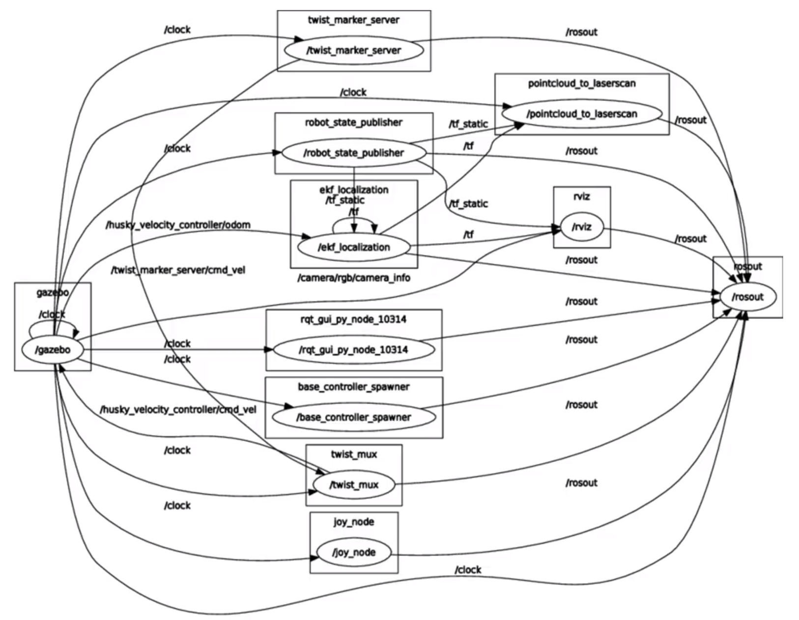
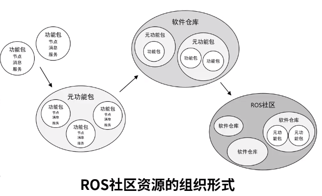
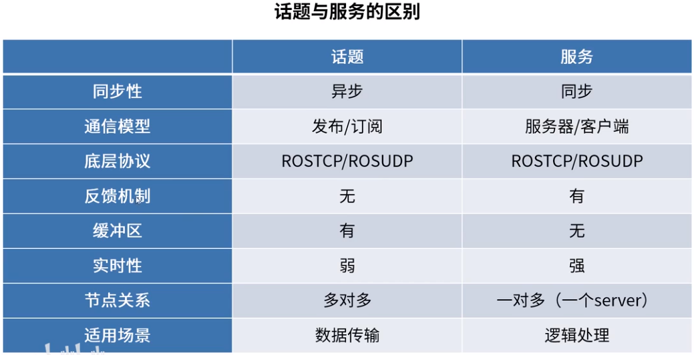
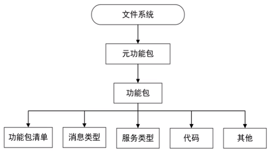

# ROS1

> [【古月居】古月·ROS入门21讲 | 一学就会的ROS机器人入门教程](https://www.bilibili.com/video/BV1zt411G7Vn?p=6)

## ROS是什么

- ROS包含四大部分

    

- 目的：提高机器人研发中的软件复用率

- 通信机制：耦合分布式通信，是一张计算图

    

- 开发工具：命令行&编译器、TF坐标变换、QT工具箱、Rviz（可视化）、Gazebo（仿真）

- 应用功能：nvaigation、SLAM、机械臂等

- 生态系统

    

    - 发行版(Distribution):ROS发行版包括一系列带有版本号、可以直接安装的功能包。
    - 软件源(Repository）：ROS依赖于共享网络上的开源代码，不同的组织机构可以开发或者共享自己的机器人软件。
    - ROS wiki:记录ROS信息文档的主要论坛。
    - 邮件列表(Mailing list):交流ROS更新的主要渠道，同时也可以交流ROS开发的各种疑问。
    - **ROS Answers**:咨询ROS相关问题的网站。
    - [博客(Blog)](http://www.ros.org/news)：发布ROS社区中的新闻、图片、视频

## ROS的核心概念

- **节点（node）**：执行单元
    - 执行**具体任务**的进程、**独立运行**的可执行文件：
    - 不同节点可使用**不同的编程语言**，可分布式运行在**不同的主机**；
    - 节点在系统中的名称必须是**唯一**的
- **节点管理器（ROS Master）**：控制中心
    - **命名和注册**节点
    - 跟踪和记录话题/服务通信，辅助节点相互查找、**建立连接**；
    - 提供**参数服务器**（全局信息），节点使用此服务器存储和检索运行时的参数
- **话题通信**：单向
    - 话题(Topic)：**异步**通信机制
        - 节点间用来传输数据的重要总线
        - 使用**发布/订阅**模型，数据由发布者传输到订阅者，同一个话题的订阅者或发布者可以**不唯一**。
    - 消息(Message)：话题数据
        - 具有一定的**类型**和**数据结构**，包括ROS提供的**标准类型**和用户**自定义类型**；
        - 使用**编程语言无关**的**.msg**文件，编译过程中生成对应的代码文件
- **服务通信**：双向
    - 服务(Service)：**同步**通信机制
        - 使用**客户端/服务器(C/S)**模型，客户端发送**请求**数据，服务器完成处理后返回**应答**数据；
        - 使用**编程语言无关**的**.srv**文件定义请求和应答数据结构，编译过程中生成对应的代码文件。



- **多变量**(Parameter)：全局共享字典（多变量），可通过网络访问

    - 节点使用此服务器来存储和检索**运行时的参数**；
    - 适合存储静态、非二进制的**配置参数**，不适合存储动态配置的数据

- 文件系统：

    

    - 功能包(Package)：ROS软件中的基本单元，包含节点源码、配置文件、数据定义等
    - 功能包清单(Package manifest)：记录功能包的基本信息，包含作者信息、许可信息、依赖选项、编译标志等
    - 元功能包(Meta Packages)：多个功能包，用于同一目的

## ROS命令行工具的使用

> http://www.autolabor.com.cn/book/ROSTutorials/
>
> https://blog.csdn.net/qq_31136513/article/details/106272169

### ROS 执行命令

- `roscore [选项]`:启动 master（ROS名称服务） + rosout（日志记录） + parameter server（参数管理）
- `rosrun [功能包名称] [节点名称]`：运行单个节点
- `roslaunch [功能包名称] [launch文件名]`：运行多个节点或设置运行选项

### ROS 信息命令

- `rostopic`：显示有关ROS topic的调试信息，包括发布者，订阅者，发布频率和ROS消息

    - `rostopic pub /topic名称 消息类型 消息内容`：直接调用命令向订阅者发布消息
    - `rostopic bw`：显示topic使用的带宽
    - `rostopic delay`：显示带有 header 的topic延迟
    - `rostopic echo`：打印消息到屏幕
    - `rostopic find`：根据类型查找topic
    - `rostopic hz`：显示topic的发布频率
    - `rostopic info`：显示topic相关信息
    - `rostopic list`：显示所有活动状态下的topic

- `rosservice [选项]/[选项+服务/类型名称]`：发布服务信息

    - `rosservice args [service_name]`：打印服务参数
    - `rosservice call [service_name] [参数]`：使用提供的参数调用服务
    - `rosservice find [service_name]`：按照服务类型查找服务
    - `rosservice info [service_name]`：打印有关服务的信息
    - `rosservice list`：列出所有活动的服务
    - `rosservice type [service_name]`：打印服务类型
    - `rosservice uri`：打印服务的 ROSRPC uri

- `rosnode`：显示当前运行的节点信息

    - `rosnode ping`测试到某个节点的连通性。
    - `rosnode list`：列出活跃的节点。
    - `rosnode info [node_name]`：返回一个特定节点的信息。
    - `rosnode kill -a`杀死所有的节点

- `rosbag`：记录和回放ROS topic数据

    - `rosbag record [选项] [topic1] [topic2] ...`：录制topic，可以指定录制哪几个

        > -a：录制所有
        >
        > -O [file_path]：保存文件路径
        >
        > --split --duration=[time]：间隔固定时间（比如5分钟表示为5m）分割一次

    - `rosbag info 文件名`：查看文件
    - `rosbag play 文件名`：回放文件

- `rosmsg`：显示有关 ROS消息类型的 信息

    - `rosmsg show [消息名称]`：显示消息描述
    - `rosmsg info`：显示消息信息
    - `rosmsg list`：列出所有消息
    - `rosmsg md5`：显示 md5 加密后的消息
    - `rosmsg package [包名]`：显示某个功能包下的所有消息
    - `rosmsg packages`：列出包含消息的功能包

    

## 创建工作空间与功能包

- 工作空间(workspace)：存放工程开发相关文件的文件夹。

    - src：代码空间(Source Space)
    - build：编译空间(Build Space)，编译中间文件
    - devel：开发空间(Development Space)，编译好的可执行文件、库等
    - install：安装空间(Install Space)，install命令安装路径

- 创建工作空间`catkin_init_workspace`：

    ```bash
    # 创建文件夹
    mkdir -p ~/catkin_ws/src
    cd ~/catkin_ws/src
    catkin_init_workspace
    # 编译工作空间
    cd ~/catkin_ws/
    catkin_make  # 后面添加install 来安装
    # 设置环境变量
    source devel/setup.bash
    # 检查环境变量，要包含~/catkin_ws/src
    echo SROS_PACKAGE_PATH
    ```

- 创建功能包`catkin_init_workspace`：在catkin_make之前，在工作空间`src`目录下运行如下命令

    ```bash
    catkin_create_pkg <package_name> [depend1] [depend2] [depend3] ...
    ```

    - **同一工作空间**下，**不允许**存在**同名**功能包；**不同工作空间**下，**允许**存在**同名**功能包

- 工作空间中src下的package.xml文件：记录package名称、描述、作者信息、依赖等

## 发布者Publisher的编程实现

- 步骤：

    - **初始化**ROS节点
    - 向ROS Master**注册**节点信息，包括发布的话题名和话题中的消息类型
    - **创建**消息数据
    - 按照一定频率循环**发布**消息

- C++示例：

    ```c++
    #include <ros/ros.h>
    #include <geometry_msgs/Twist.h>
    int main(int argc, char **argv) {
    	// ROS节点初始化
    	ros::init(argc, argv, "velocity_publisher");
    	// 创建节点句柄
    	ros::NodeHandle n;
    	// 创建一个Publisher，发布名为/turtle1/cmd_vel的topic，消息类型为geometry_msgs::Twist，队列长10
    	ros::Publisher turtle_vel_pub = n.advertise<geometry_msgs::Twist>("/turtle1/cmd_vel", 10);
    	// 设置循环的频率
    	ros::Rate loop_rate(10);
    	int count = 0;
    	while (ros::ok()) {
    	    // 初始化geometry_msgs::Twist类型的消息
    		geometry_msgs::Twist vel_msg;
    		vel_msg.linear.x = 0.5;
    		vel_msg.angular.z = 0.2;
    	    // 发布消息
    		turtle_vel_pub.publish(vel_msg);
    		ROS_INFO("Publsh turtle velocity command[%0.2f m/s, %0.2f rad/s]", 
                      vel_msg.linear.x, vel_msg.angular.z);
    	    // 按照循环频率延时
    	    loop_rate.sleep();
    	}
    	return 0;
    }
    ```

- 设置CMake编译规则：设置需要编译的代码和生成的可执行文件，以及链接库。例如

    ```cmake
    add_executable(<可执行文件名> <cpp路径>)
    target_link_libraries(<可执行文件名> ${catkin_LIBRARIES})
    ```

## 订阅者Subscriber的编程实现

- 步骤：

    - **初始化**ROS节点；
    - **订阅**需要的话题；
    - 循环等待话题消息，接收到消息后进入**回调**函数；
    - 在回调函数中完成消息**处理**

- C++示例

    ```c++
    #include <ros/ros.h>
    #include "turtlesim/Pose.h"
    // 接收到订阅的消息后，会进入消息回调函数
    void poseCallback(const turtlesim::Pose::ConstPtr& msg) {
        // 将接收到的消息打印出来
        ROS_INFO("Turtle pose: x:%0.6f, y:%0.6f", msg->x, msg->y);
    }
    int main(int argc, char **argv) {
        // 初始化ROS节点
        ros::init(argc, argv, "pose_subscriber");
        // 创建节点句柄
        ros::NodeHandle n;
        // 创建一个Subscriber，订阅名为/turtle1/pose的topic，填写队列长度10，注册回调函数poseCallback
        ros::Subscriber pose_sub = n.subscribe("/turtle1/pose", 10, poseCallback);
        // 循环等待回调函数
        ros::spin();
        return 0;
    }
    ```

- 设置CMake编译规则 与 Publisher 一样

## 话题消息的定义与使用

- 自定义话题消息步骤：

    - 定义msg文件：存放在功能包下的msg文件夹中（即`<工作空间路径>/src/<功能包名>/msg/`）例如Person.msg

        ```
        string name
        uint8 sex
        uint8 age
        uint8 unknown =0
        uint8 male =1
        uint8 female =2
        ```

    - 在package.xml中添加功能包依赖

        ```xml
        <build_depend>message_generation</build_depend>
        <exec_depend>message_runtime</exec_depend>
        ```

    - 在CMakeLists.txt添加编译选项

        ```cmake
        find_package(... message_generation)
        add_message_files(FILES Person.msg)
        generate_messages(DEPENDENCIES std_msgs)
        catkin_package(... message_runtime)
        ```

    - 编译生成语言相关 **一个头文件**，路径`<工作空间路径>/devel/include/<功能包名>/`

    - 编程使用的时候，include 对应头文件；还要设置CMake编译规则

        ```cmake
        add_dependencies(<可执行文件名> ${PROJECT_NAME}_generate_messages_cpp)
        ```

## 客户端Client的编程实现

- 步骤

    - **初始化**ROS节点
    - **创建**一个Client实例，必须要检测到对应服务存在 才能创建成功
    - **发布**服务请求数据
    - **等待**Server处理之后的应答结果

- C++示例

    ```c++
    #include <ros/ros.h>
    #include "learning_service/Person.h"
    int main(int argc, char** argv) {
        // 初始化ROS节点
    	ros::init(argc, argv, "person_client");
        // 创建节点句柄
    	ros::NodeHandle node;
        // 发现/spawn服务后，创建一个服务客户端，连接名为/spawn的service
    	ros::service::waitForService("/show_person");  // 阻塞型函数，等待找到对应server
    	ros::ServiceClient person_client = node.serviceClient<learning_service::Person>("/show_person");
        // 初始化learning_service::Person的请求数据
    	learning_service::Person srv;
    	srv.request.name = "Tom";
    	srv.request.age  = 20;
    	srv.request.sex  = learning_service::Person::Request::male;
        // 请求服务调用
    	ROS_INFO("Call service to show person[name:%s, age:%d, sex:%d]", 
    			 srv.request.name.c_str(), srv.request.age, srv.request.sex);
    	person_client.call(srv);  // 阻塞型函数，等到server反馈
    	// 显示服务调用结果
    	ROS_INFO("Show person result : %s", srv.response.result.c_str());
    	return 0;
    };
    
    ```

- 设置CMake编译规则 与 Publisher 一样

## 服务端Server的编程实现

- 步骤：

    - **初始化**ROS节点；
    - **创建**Server实例；
    - 循环**等待**服务请求，进入**回调**函数；
    - 在回调函数中，完成服务功能的**处理**并**反馈**应答数据。

- C++示例：

    ```c++
    #include <ros/ros.h>
    #include "learning_service/Person.h"
    // service回调函数，输入参数req，输出参数res
    bool personCallback(learning_service::Person::Request  &req,
             			learning_service::Person::Response &res) {
        // 显示请求数据
        ROS_INFO("Person: name:%s  age:%d  sex:%d", req.name.c_str(), req.age, req.sex);
    	// 设置反馈数据，发送给client
    	res.result = "OK";
        return true;
    }
    int main(int argc, char **argv) {
        // ROS节点初始化
        ros::init(argc, argv, "person_server");
        // 创建节点句柄
        ros::NodeHandle n;
        // 创建一个名为/show_person的server，注册回调函数personCallback
        ros::ServiceServer person_service = n.advertiseService("/show_person", personCallback);
        // 循环等待回调函数
        ROS_INFO("Ready to show person informtion.");
        ros::spin();
        return 0;
    }
    ```

- 设置CMake编译规则 与 Publisher 一样

## 服务数据的定义与使用

- 自定义 服务数据 步骤：

    - 定义srv文件：存放在功能包下的srv文件夹中（即`<工作空间路径>/src/<功能包名>/srv/`）例如Person.srv

        - ---之上为require数据，之下为response数据

        ```
        string name
        uint8 sex
        uint8 age
        uint8 unknown =0
        uint8 male =1
        uint8 female =2
        ---
        string result
        ```

    - 在package.xml中添加功能包依赖

        ```xml
        <build_depend>message_generation</build_depend>
        <exec_depend>message_runtime</exec_depend>
        ```

    - 在CMakeLists.txt添加编译选项

        ```cmake
        find_package(... message_generation)
        add_message_files(FILES Person.srv)
        generate_messages(DEPENDENCIES std_msgs)
        catkin_package(... message_runtime)
        ```

    - 编译生成语言相关 **三个头文件**，名称例如为Person.h、PersonReq.h、PersonRes.h，路径`<工作空间路径>/devel/include/<功能包名>/`

    - 编程使用的时候，include 总的头文件（一个，例如Person.h）；还要设置CMake编译规则

        ```cmake
        add_dependencies(<可执行文件名> ${PROJECT_NAME}_gencpp)
        ```

## 参数的使用与编程方法
## ROS中的坐标系管理系统
## 坐标系广播与监听的编程实现
## launch启动文件的使用方法
## 常用可视化工具的使用
## 课程总结与进阶攻略