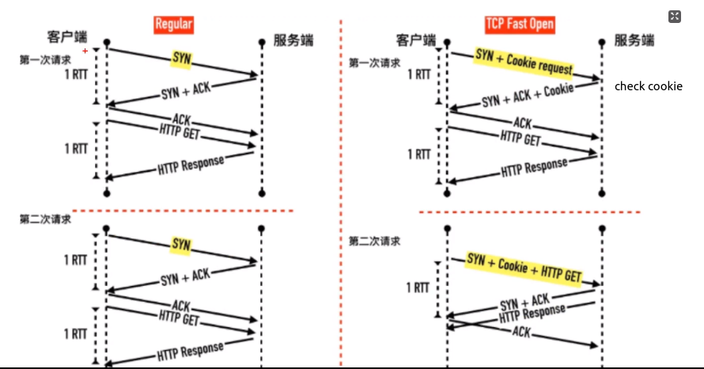

## #

- TCP的五个分层

- 三次握手：连接的时候，为了保证客户端和服务端都连接成功

    

- 四次挥手：断连的时候，客户端发送断连请求后（第一次），服务端要马上返回告知已经收到（第二次）；但是服务端清空缓存等操作要时间，完成后再通知客户端准备好了（第三次），最后客户端确认（第四次）

    

- SIN/FIN不包含数据，却要消耗一个序列

    - ∵只要对端确认，必须消耗TCP报文的序列号

- 半连接队列：握手时，客户端发送的信息（SYN）中包含源IP，服务端收到后会根据源IP发送请求（SYN+ACK），若客户端回复RST或者不回复，就会加入半连接队列

- SYN Flood攻击：

    - 攻击方发起大量包含虚假源IP的握手请求，服务端根据这些源IP返回信息（SYN+ACK）
    - 但源IP对应的真实客户端不回复或者回复RST，导致被加入服务端的半连接队列
    - 当队列满了后，服务端就不能处理正常请求

- TCP快速打开(TCP Fast Open,TFO)：在原来TCP协议上的扩展协议

    - 原理：在发送第一个SYN包的时候就开始传数据（Cookie + HTTP GET）

    - 前提：当前客户端之前已经完成过「正常」的三次握手（发送了Cookie）

    - 优势：利用握手减少一个往返RTT，防止SYN Flood攻击

        

- TCP报文中的时间戳：

    - 内容（共10bytes）：类别(kind，1byte)、长度(Length，1byte)、发送方时间戳(TS value，4bytes)、回显时间戳(TS Echo Reply，4bytes)
    - 目的一：为了解决发生重传时计算延迟
    - 目的二：防止序列号的回绕问题，因为可能发生重传后，原来的数据又收到了（相当于收到两份一样的数据，序列号一样，但是时间戳不一样）

- TCP超时重传时间（Retransmission Time Out，RTO）

    

    - 经典计算方法：平滑往返时间(Smoothed round trip time,SRTT)，α为平滑因子（一般0.8~0.9 ）

- TCP流量控制：

    - 目的：对于发送端和接收端而言，TCP需要把发送的数据放到发送缓存区，将接收的数据放到接收缓存区；通过接收缓存区的大小，控制发送端的发送。如果对方的接收缓存区满了，就不能再继续发送了

        

    - 方法：接收端会告知发送端自己接收窗口(rwnd)，也就是接收缓冲区中空闲的部分；发送端就会根据自己的数据包调整发送窗口（为“已发送但未确认”+“未发送但接收端可以接收”）

        

        

    - 发送端的数据包的状态：①已发送且已确认；②已发送但未确认；③未发送但接收端可以接收（接收端有空间接收）③ 未发送且不可以发送（接收端没空间接收）

        

- TCP的keep alive：握手成功后，如果客户端或者服务端断连了，对方不知道，会每7200s发送一个探测包来判断对方是否还在

    - 但是这个时间太久了，一般不用，而是在应用层做心跳机制

- TCP端口：

    - 包含源端口 和 目标端口，使用两个字节，范围0-65535
    - 常用端口号：熟知端口号（范围0-1023）、已登记的端口号（范围1024-49151）、临时端口号（范围49152-65535）

- TCP常用命令

    - telnet
    - netstat
    - tcpdump

- TCP和UDP区别：

    - TCP是一个面向连接的、可靠的、基于字节流的传输层协议。
        - TCP有三次握手，有状态（哪些发送、哪些接收等）、可控制（发送速度、重发等）
    - UDP是一个面向无连接的传输层协议
