#  

# CLion快捷键及调试方法

## 快捷键

- `Ctrl+Alt+V`：语句自动复制
- `Ctrl+Alt+P`：新参数加入函数声明
- `Ctrl+Alt+C`：定义常量
- `Ctrl+F6`：重构函数/类

## 调试技巧

- ★在断点的高级设置中，勾选上“Stack trace”，会在到达断点时，输出函数的堆栈跟踪（类似python）

  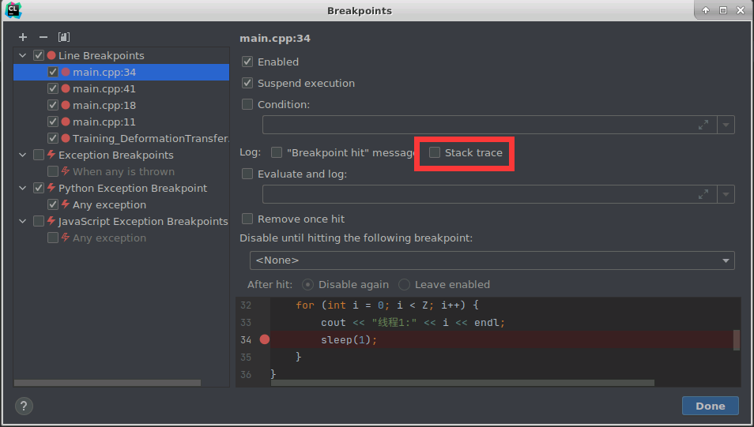 

# GDB调试

## 基本操作

- [官网](https://www.sourceware.org/gdb/documentation/)有[User Manual.pdf](https://sourceware.org/gdb/current/onlinedocs/gdb.pdf)

- 在gdb中运行shell的命令：`shell 命令`

- 常用一般指令

  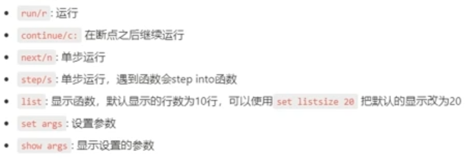 

  - `finish`：从函数内部推出

  - `info line [num]`：查看代码的内存地址及其他信息

- 设置断点

  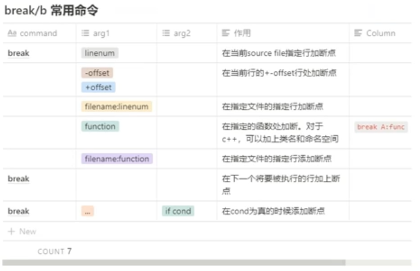 

  - `watch [variable]`：变量的值改变后停下来（watchpoint）

   

  PS：如果断点打在没有实际意义的行上（比如只有定义没有初始化的变量）则会被忽略

- 显示程序变量的值

   

  - `set var [variable]=[value]`：设置变量的值

    PS：gdb支持tab补全

- 改变程序的运行

  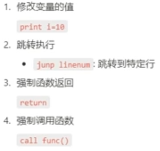 

  ​    `print func()`：也可以强制调用函数，同时打印输出

- 分析程序崩溃原因

  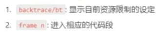 


## 多进程调试

- Linux下查看进程、线程命令

  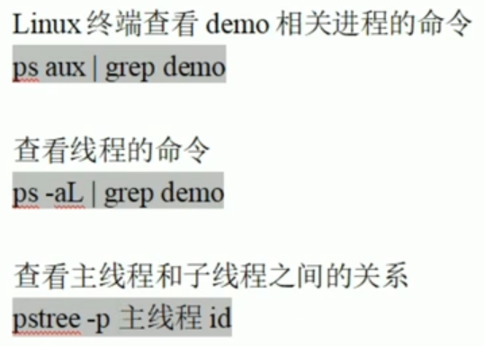 

  

- 选择调试的进程：

  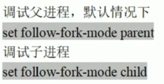 

  PS：调试一个进程的时候，默认情况另一个进程会正常运行

- 设置调试模式

  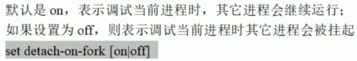 

- 查看和切换调试的进程

  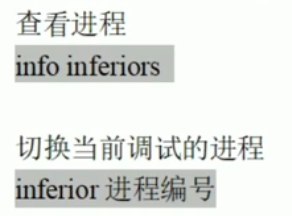 

## 多线程调试

- 编译程序：二选一

  - gcc/g++添加-lpthread，例如

    ```shell
    gcc -g demo.c -o demo -lpthread
    ```

  - CMakeLists.txt添加

    ```cmake
    find_package(Threads REQUIRED)
    target_link_libraries(main Threads::Threads)
    ```

- 查看当前线程：`info threads`

- 切换线程：`threads [id]`

- 设置调试模式：

  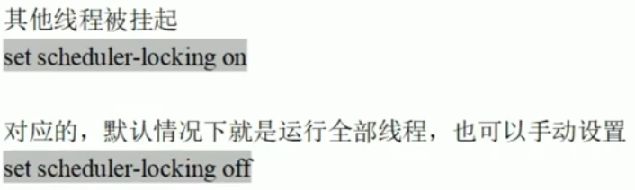 

- 指定某个线程执行命令

   

> 参考资料
>
> - [GDB to LLDB command map](https://lldb.llvm.org/use/map.html)


# Linux下段错误产生原因&解决方法

## 原因

- 访问不存在的内存地址
- 访问系统保护的内存地址
- 访问只读的内存地址
- 越界使用
- 栈溢出：比如定义了一个很大的数组

## 调试方式

- GDB调试：gcc加上参数-g，然后使用gdb调试程序，run后会显示在哪儿错误

- GDB+core文件定位：

  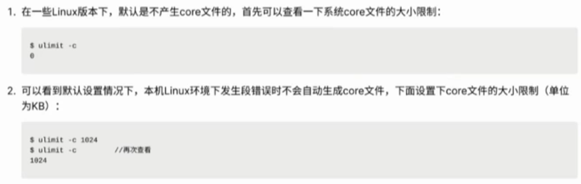 

  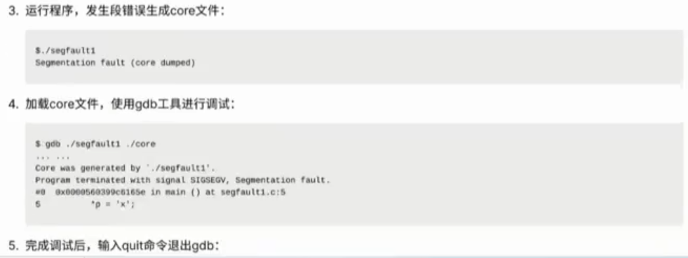 

- objdump反汇编查看：可以不需要-g参数编译（建议还是加上，因为信息更多）

  - 首先定位错误地址：有两个方法

    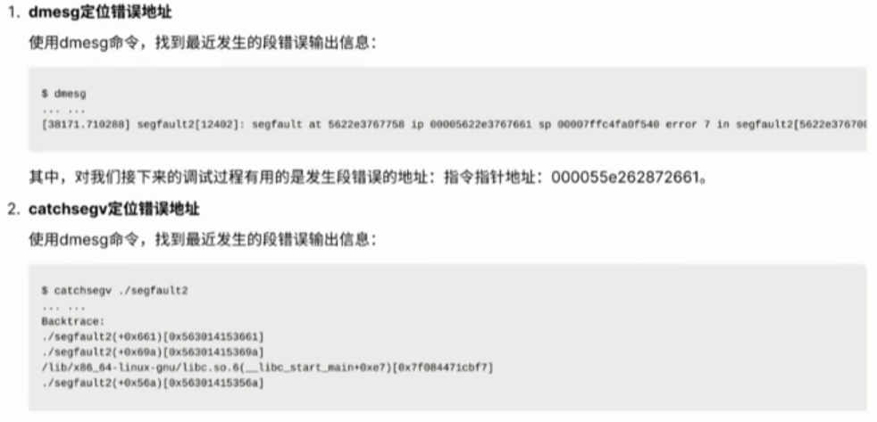 

    PS： 2中的“dmesg”所在行打错了

  - 反汇编查看

     

    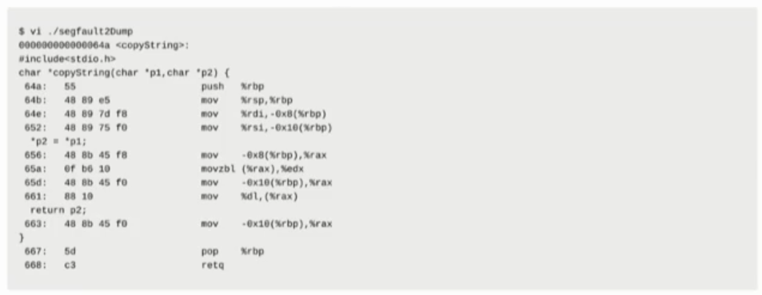  

## 注意事项

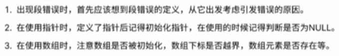 

# 通过log进行Debug

- log作用：

   

- log日志等级（常用）：

- 打桩法：在程序不同地方使用cout输出字符串

- 使用封装log类：[log4cpp](http://log4cpp.sourceforge.net/)