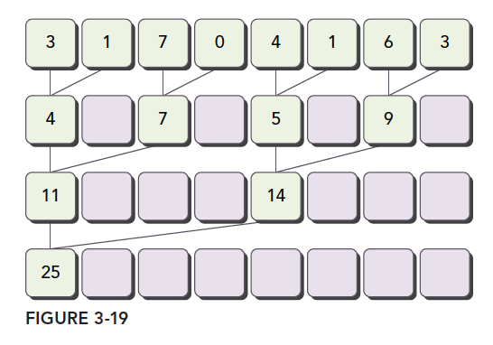
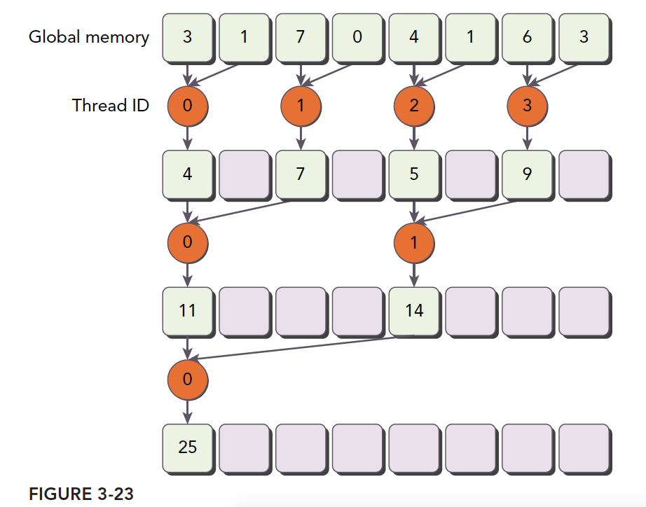
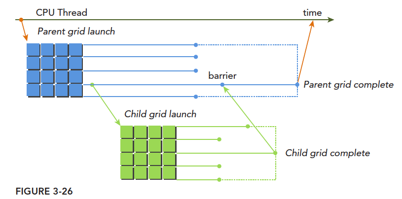
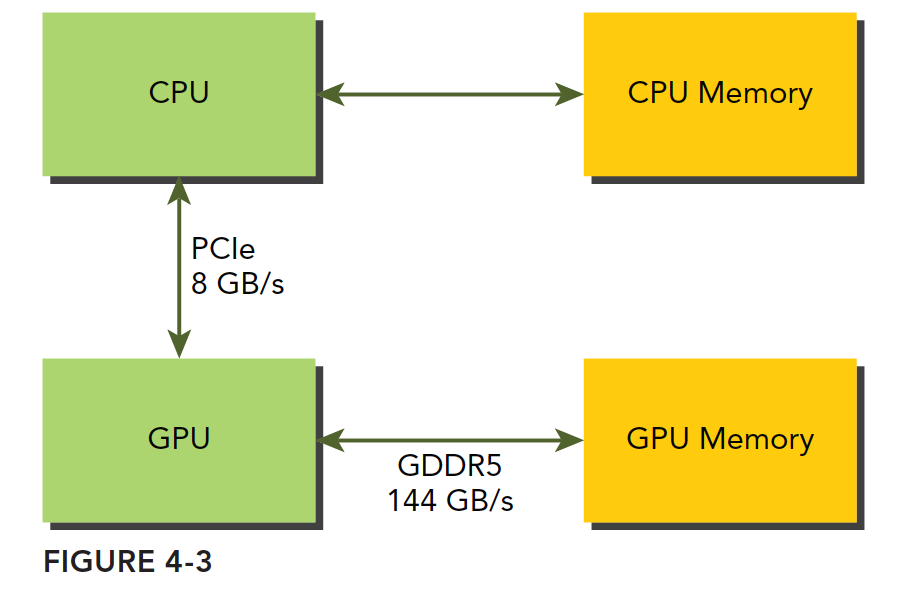

> [推荐几个不错的CUDA入门教程（非广告）](https://godweiyang.com/2021/01/25/cuda-reading/)

# CUDA编程入门极简教程

> CUDA编程入门极简教程 - 小小将的文章 - 知乎 https://zhuanlan.zhihu.com/p/34587739

## CUDA编程基础

- host指代CPU及其内存，device指代GPU及其内存

- 核函数（kernel）：在device上线程中并行执行的函数

    - 核函数用`__global__`符号声明，在调用时需要用`<<<grid, block>>>`来指定kernel要执行的线程数量
    - CUDA中，每一个线程都要执行核函数，并且每个线程会分配一个唯一的线程号thread ID，这个ID值可以通过核函数的内置变量`threadIdx`来获得

- cuda用三个函数类型限定词，区别host和device上的函数

    - `__global__`：在device上执行
        - 从host中调用（一些特定的GPU也可以从device上调用）
        - 返回类型必须是`void`，不支持可变参数参数，不能成为类成员函数
        - 注意：用`__global__`定义的kernel是异步的，这意味着host不会等待kernel执行完就执行下一步。
    - `__device__`：在device上执行
        - 单仅可以从device中调用
        - 不可以和`__global__`同时用
    - `__host__`：（一般省略不写）在host上执行
        - 仅可以从host上调用
        - 不可以和`__global__`同时用，但可和`__device__`，此时函数会在device和host都编译

- （逻辑层）kernel的线程两层组织结构：gird和block均为2-dim

    - 第一层**网格**（grid）：一个kernel所启动的所有线程称

        - 同一个网格上的线程共享相同的全局内存空间

    - 第二层**线程块**（block）：一个线程块里面包含很多线程

         

- grid和block都是定义为`dim3`类型的变量

    - `dim3`可以看成是包含三个无符号整数（x，y，z）成员的结构体变量

    - `dim3`在定义时，缺省值初始化为1。因此grid和block可以灵活地定义为1-dim，2-dim以及3-dim结构

    - 示例：上图结构（主要水平方向为x轴），定义的grid和block如下所示，kernel在调用时也必须通过[执行配置](https://link.zhihu.com/?target=http%3A//docs.nvidia.com/cuda/cuda-c-programming-guide/index.html%23execution-configuration)`<<<grid, block>>>`来指定kernel所使用的线程数及结构。

        ```c++
        dim3 grid(3, 2);
        dim3 block(5, 3);
        kernel_fun<<< grid, block >>>(prams...);
        ```

- 一个线程需要两个内置的坐标变量（blockIdx，threadIdx）来唯一标识，它们都是`dim3`类型变量，

    - blockIdx指明线程所在grid中的位置，而threaIdx指明线程所在block中的位置

    - 示例：上图Thread (1,1)满足

        ```c++
        threadIdx.x = 1
        threadIdx.y = 1
        blockIdx.x = 1
        blockIdx.y = 1
        ```

- 线程的全局ID： 假设线程局部ID为$(x,y,z)$，3-dim的block$(D_x,D_y,D_z)$​（通过变量blockDim获得），则全局坐标为
    $$
      (x+y*D_x+z*D_x*D_y)
    $$
    另外线程还有内置变量gridDim，用于获得网格块各个维度的大小。

- CUDA的内存模型

    - 本地内存（Local Memory）：每个 线程 有自己的私有

    - 共享内存（Shared Memory）：每个 线程块 包含，可以被线程块中所有线程共享

        - 其生命周期与线程块一致

    - 全局内存（Global Memory）：所有的线程都可以访问

    - 常量内存（Constant Memory）：所有的线程都只读

    - 纹理内存（Texture Memory）：所有的线程都只读

         

- 流式多处理器（SM，Streaming Multiprocessor）

    - 核心组件包括CUDA核心，共享内存，寄存器等
    - SM可以并发地执行数百个线程，并发能力就取决于SM所拥有的资源数
    - 一个线程块只能在一个SM上被调度。SM一般可以调度多个线程块
    - SM采用的是[SIMT](https://link.zhihu.com/?target=http%3A//docs.nvidia.com/cuda/cuda-c-programming-guide/index.html%23simt-architecture) (Single-Instruction, Multiple-Thread，单指令多线程)架构，
        - 基本的执行单元是线程束（warps)，线程束包含32个线程（所以block大小一般要设置为32的倍数）
        - 这些线程同时执行相同的指令，但是每个线程都包含自己的指令地址计数器和寄存器状态，也有自己独立的执行路径。

     

## 函数API

- 内存管理

    - cudaMalloc函数：在device上分配内存，和C语言中的malloc类似

        ```c++
        cudaError_t cudaMalloc(void** devPtr, size_t size);
        ```

        > devPtr：指向所分配内存的指针

    - cudaFree函数：释放分配的内存，和C语言中的free函数对应

    - cudaMemcpy函数：负责host和device之间数据通信

        ```c++
        cudaError_t cudaMemcpy(void* dst, const void* src, size_t count, cudaMemcpyKind kind)
        ```

        > src：向数据源
        >
        > dst：目标区域
        >
        > count：复制的字节数
        >
        > kind：控制复制的方向，cudaMemcpyHostToHost, cudaMemcpyHostToDevice, cudaMemcpyDeviceToHost及cudaMemcpyDeviceToDevice

    - cudaMallocManaged函数：统一内存，使用一个托管内存来共同管理host和device中的内存，并且自动在host和device中进行数据传输

        ```c++
        cudaError_t cudaMallocManaged(void **devPtr, size_t size, unsigned int flag=0);
        ```

# GPU编程（CUDA）- 谭升的博客

> [GPU编程（CUDA）- 谭升的博客](https://face2ai.com/program-blog/#GPU%E7%BC%96%E7%A8%8B%EF%BC%88CUDA%EF%BC%89)

## [1.0 并行计算与计算机架构](http://www.face2ai.com/CUDA-F-1-0-并行计算与计算机架构/)

- 该博客参考《CUDA C编程权威指南》，结构如下

     

- **并行计算** 涉及 计算机架构（硬件）&& 并行程序设计（软件）

- **程序并行** 分为 指令并行 && <u>数据并行</u>（更关注）

- 数据并行程序设计首先依据线程划分数据：块划分、周期划分
     


## 1.1 [异构计算与CUDA](https://face2ai.com/CUDA-F-1-1-%E5%BC%82%E6%9E%84%E8%AE%A1%E7%AE%97-CUDA/)

- 衡量GPU计算能力：

    | 容量特征                 | 性能指标     |
    | ------------------------ | ------------ |
    | CUDA核心数量（越多越好） | 峰值计算能力 |
    | 内存大小（越大越好）     | 内存带宽     |

    - nvidia自己有一套描述GPU计算能力的代码，其名字就是“计算能力”，主要区分不同的架构

        - 早其架构的计算能力不一定比新架构的计算能力强

        | 计算能力 | 1.x   | 2.x   | 3.x    | 4.x     | 5.x    | 6.x   |
        | -------- | ----- | ----- | ------ | ------- | ------ | ----- |
        | 架构名   | Tesla | Fermi | Kepler | Maxwell | Pascal | Volta |

- CUDA C 是标准ANSI C语言的扩展

- CUDA API：用来操作设备完成计算。分类

    - CUDA驱动API：低级的API，使用相对困难

    - CUDA运行时API：高级API使用简单，其实现基于驱动API

      > 注意：两者之间的函数不可以混合调用

       

- CUDA代码可以分成两部分：CPU 主机端代码 && GPU 设备端代码（核函数）
  
    - CUDA nvcc编译器会自动分离你代码里面的不同部分
        
    
- 一般CUDA程序分成下面这些步骤：

    - 分配GPU内存
    - 拷贝内存到设备
    - 调用CUDA内核函数来执行计算
    - 把计算完成数据拷贝回主机端
    - 内存销毁

- NVIDIA为提供工具

    - Nvidia Nsight集成开发环境
    - CUDA-GDB 命令行调试器
    - 性能分析可视化工具
    - CUDA-MEMCHECK工具
    - GPU设备管理工具

## [2.0 CUDA编程模型概述(一)](http://www.face2ai.com/CUDA-F-2-0-CUDA编程模型概述1/)

- 编程模型：

    - 理解我们要用到的语法，内存结构，线程结构等这些我们写程序时我们自己控制的部分，这些部分控制了异构计算设备的工作模式，都是属于编程模型。
    - GPU（或者其他异构）中大致可以分为：核函数 + 内存管理 + 线程管理 + 流

- **内存管理：**

    | 标准C函数 | CUDA C 函数 | 说明     |
    | --------- | ----------- | -------- |
    | malloc    | cudaMalloc  | 内存分配 |
    | memcpy    | cudaMemcpy  | 内存复制 |
    | memset    | cudaMemset  | 内存设置 |
    | free      | cudaFree    | 释放内存 |

     

- **线程管理：**

    - 一个核函数只能有一个grid，一个grid可以有很多个block，每个块可以有多个thread
    - 不同block内thread不能相互影响！他们是物理隔离的！
    - thread标号通过下面两个内置结构体（基于 uint3）确认
        - blockIdx（线程块在线程网格内的位置索引）：有x、y、z
        - threadIdx（线程在线程块内的位置索引）：有x、y、z
    - thread标号的范围则通过 blockDim和gridDim确定，是dim3类型（基于 uint3）。grid 和 block 一般是二维和三维的

## [2.1 CUDA编程模型概述(二)](http://www.face2ai.com/CUDA-F-2-1-CUDA编程模型概述2/)

- 核函数启动

    ```c
    kernel_name<<<grid,block>>>(argument list);
    ```

    > 可以使用dim3类型的grid维度和block维度配置内核，也可以使用int类型的变量，或者常量直接初始化
    >
    > **所有CUDA核函数的启动都是异步的**，这点与C语言是完全不同的

- 当host启动了核函数，控制权马上回到host，而不是host等待device完成核函数的运行

- **host等待device执行**

    - 显式方法

        ```c
        cudaError_t cudaDeviceSynchronize(void);
        ```

    - 隐式方法：设备端不执行完，主机没办法进行，比如内存拷贝函数

        ```
        cudaError_t cudaMemcpy(void* dst,const void * src,
          size_t count,cudaMemcpyKind kind);
        ```

- 核函数声明的**限定符**

    | 限定符     | 执行       | 调用                                            | 备注                     |
    | ---------- | ---------- | ----------------------------------------------- | ------------------------ |
    | __global__ | 设备端执行 | 可以从主机调用，也可以从计算能力3以上的设备调用 | 必须有一个void的返回类型 |
    | __device__ | 设备端执行 | 设备端调用                                      |                          |
    | __host__   | 主机端执行 | 主机调用                                        | 可以省略                 |

    > 特殊情况：有些函数可以同时定义为 device 和 host

- Kernel核函数限制

    - 只能访问设备内存
    - 必须有void返回类型
    - 不支持可变数量的参数
    - 不支持静态变量
    - 显示异步行为

- ==CUDA小技巧==：当我们进行调试的时候可以把核函数配置成单线程的

    ```c
    kernel_name<<<1,1>>>(argument list)
    ```

- 错误防御性处理

    ```c++
    #define CHECK(call)\
    {\
      const cudaError_t error=call;\
      if(error!=cudaSuccess)\
      {\
          printf("ERROR: %s:%d,",__FILE__,__LINE__);\
          printf("code:%d,reason:%s\n",error,cudaGetErrorString(error));\
          exit(1);\
      }\
    }
    ```

## [2.2 给核函数计时](http://www.face2ai.com/CUDA-F-2-2-核函数计时/)

- CPU计时

    ```c
    #include <sys/time.h>
    double cpuSecond(){
      struct timeval tp;
      gettimeofday(&tp,NULL);
      return((double)tp.tv_sec+(double)tp.tv_usec*1e-6);
    }
    int main(){
      // ...
      double iStart,iElaps;
      iStart=cpuSecond();
      sumArraysGPU<<<grid,block>>>(a_d,b_d,res_d,nElem);
      cudaDeviceSynchronize();
      iElaps=cpuSecond()-iStart;
      // ...
    }
    ```

     

- 用nvprof计时：用法

    ```c
    nvprof [nvprof_args] <application> [application_args]
    ```

    > 计算能力8.x以上的显卡不能使用这个方法

- ？？？GPU理论界限计算方式，例如

    - Tesla K10 单精度峰值浮点数计算次数：745MHz核心频率 x 2GPU/芯片 x（8个多处理器 x 192个浮点计算单元 x 32 核心/多处理器） x 2 OPS/周期 =4.58 TFLOPS
    - Tesla K10 内存带宽峰值： 2GPU/芯片 x 256 位 x 2500 MHz内存时钟 x 2 DDR/8位/字节 = 320 GB/s
    - 指令比：字节 4.58 TFLOPS/320 GB/s =13.6 个指令： 1个字节

## [2.3 组织并行线程](http://www.face2ai.com/CUDA-F-2-3-组织并行线程/)

- thread的全局坐标(ix, iy):

     

## [2.4 设备信息查询](http://www.face2ai.com/CUDA-F-2-4-设备信息/)

- GPU参数：每一个都对性能有影响
    - CUDA驱动版本
    - 设备计算能力编号
    - 全局内存大小
    - GPU主频
    - GPU带宽
    - L2缓存大小
    - 纹理维度最大值，不同维度下的
    - 层叠纹理维度最大值
    - 常量内存大小
    - 块内共享内存大小
    - 块内寄存器大小
    - 线程束大小
    - 每个处理器硬件处理的最大线程数
    - 每个块处理的最大线程数
    - 块的最大尺寸
    - 网格的最大尺寸
    - 最大连续线性内存


## [3.1 CUDA执行模型概述](http://www.face2ai.com/CUDA-F-3-1-CUDA执行模型概述/)

### GPU架构概述

 

- 流式多处理器SM

     

    > SFU为特殊功能单元，执行固有指令，如正弦，余弦，平方根和插值
    >
    > LD/ST为加载/存储单元

    - 当一个blcok被分配给一个SM后，只能在这个SM上执行，不能重新分配到其他SM上
    - 多个线程块可以被分配到同一个SM上。
    - 在SM上同一个块内的多个线程进行线程级别并行，而同一线程内 指令利用指令级并行将单个线程处理成流水线（串行）。

- 线程束warp：维持在32个线程

    - CUDA 采用单指令多线程SIMT架构管理执行线程

        - 单指令多数据SIMD vs 单指令多线程SIMT

            | SIMD               | SIMT                 |
            | ------------------ | -------------------- |
            | 规定所有人必须执行 | 规定有些人可以不执行 |
            | 指令级别的并行     | 线程级别的并行       |

        - SIMT包括以下SIMD不具有的关键特性：

            - 每个线程都有自己的指令地址计数器
            - 每个线程都有自己的寄存器状态
            - 每个线程可以有一个独立的执行路径

- 编程模型层面看，所有线程都是并行执行的，但在物理层面上看，因为SM有限，所有线程块也是分批执行。**块内同步，但 块之间没办法同步**

### 现有架构

- Fermi 架构：第一个完整的GPU架构

    - 支持并发执行内核：允许执行一些小的内核程序来充分利用GPU

        

-  Kepler 架构：Fermi架构的后代

    - 允许内核启动内核：可以使用GPU完成简单的递归操作

         

    - Hyper-Q技术：CPU和GPU之间的同步硬件连接，以确保CPU在GPU执行的同事做更多的工作

         

## [3.2 理解线程束执行的本质（Part I）](http://www.face2ai.com/CUDA-F-3-2-理解线程束执行的本质-P1/)

### 线程束和线程块

- 一个线程束为32个线程
- 线程块（block）是个逻辑产物，当编号使用三维编号时，x位于最内层，y位于中层，z位于最外层，那么(threadIdx.x,threadIdx.y,threadIdx.z)表示为`t[z][y][x]`

### 线程束分化

- 线程束的分化：一个线程束内部执行相同的指令，处理各自私有的数据；但是如果一个线程束中的不同线程包含不同的控制条件，那么执行到这个控制条件是就会面临不同的选择，从而产生相悖

- 解决方法：

    - 每个线程都执行所有的if和else部分：造成性能下降

         

    - 把都执行if的线程塞到一个线程束中，或者让一个线程束中的线程都执行if，另外线程都执行else：效率提高很多

- 核函数分支效率计算方法
    $$
    Branch Efficiency=\frac{Branches − DivergentBranches}{Branches}
    $$

- nvcc编译器会自动对某些线程束的分化进行优化

    ```c++
    __global__ void warmup(float *c) {
    	int tid = blockIdx.x* blockDim.x + threadIdx.x;
    	float a = 0.0, b = 0.0;
        // 会进行优化
    	if ((tid/warpSize) % 2 == 0)
    		a = 100.0f;
        /* 不会进行优化
        bool ipred = (tid % 2 == 0);
    	if (ipred)
    		a = 100.0f;*/
    	else
    		b = 200.0f;
    	c[tid] = a + b;
    }
    ```

    

## [3.2 理解线程束执行的本质（Part II）](http://www.face2ai.com/CUDA-F-3-2-理解线程束执行的本质-P2/)

### 资源分配

- 每个SM上执行的基本单位是线程束

- 未执行的线程束有2种状态：

    - 阻塞：已经激活的，即这类线程束其实已经在SM上准备就绪了，只是没轮到他执行
    - 未激活：可能分配到SM了，但是还没上到片上

- 处于激活态的线程束数量取决于程序计数器、寄存器（下图一）、共享内存（下图二）

     

    

    > 当SM内的资源没办法处理一个完整块，那么程序将无法启动

- 线程束一旦被激活来到片上，那么他就不会再离开SM直到执行结束。

- **活跃线程束**分成3类：

    - 选定的线程束：SM要执行的线程束
    - 阻塞的线程束：线程束不符合条件还没准备好
    - 符合条件的线程束：准备要执行的，即32个CUDA核心可以用于执行、执行所需要的资源全部就位

### 延迟隐藏

- 利用率与常驻线程束直接相关。

- 延迟隐藏：硬件中线程调度器负责调度线程束调度，当每时每刻都有可用的线程束供其调度，这时候可以达到计算资源的完全利用，以此来保证通过其他常驻线程束中发布其他指令的，可以隐藏每个指令的延迟。

    - 说人话，将硬件（计算资源&&内存带宽）利用率最大化

    - 活动的线程束的数量越多，隐藏的越好，但又收到上面资源分配的影响。计算方法
        $$
        利用率最大的最少线程数 = SM的计算核心数*单条指令的延迟
        $$
        比如32个单精度浮点计算器，每次计算延迟20个时钟周期，那么我需要最少 32x20 =640 个线程使设备处于忙碌状态

- 指令的延迟 分2类

    - 算术指令：一个算术操作从开始，到产生结果之间的时间，这个时间段内只有某些计算单元处于工作状态，而其他逻辑计算单元处于空闲。延迟大概10~20 个时钟周期
    - 内存指令：产生内存访问的时候，计算单元要等数据从内存拿到寄存器。延迟大概400~800 个时钟周期

- 保证最小化延迟的线程束
    $$
    所需线程束=延迟×吞吐量
    $$

    > 延迟：感觉像是单位时间内处理的指令数量？？
    >
    > 吞吐量：感觉像是并发执行的指令数量？？
    >
    > 注意：带宽一般指的是理论峰值，最大每个时钟周期能执行多少个指令，吞吐量是指实际操作过程中每分钟处理多少个指令。

    

- 提高并行的2种方法：

    - 指令级并行(ILP): 一个线程中有很多独立的指令
    - 线程级并行(TLP): 很多并发地符合条件的线程

### 占用率

- 占用率：一个SM中，活跃的线程束的数量，占SM最大支持线程束数量的比
- nvcc的编译选项支持手动控制寄存器的使用，因为内核使用寄存器的数量会影响SM内线程束的数量
- 也可以调整线程块内线程的多少来提高占用率，但是要合理
    - 对于小的线程块：若每个线程块中线程太少，会在所有资源没用完就达到了线程束的最大要求
    - 对于大的线程块：若每个线程块中太多线程，会导致每个SM中每个线程可用的硬件资源较少
- CUDA同步
    - 块级别：线程块内同步，使用`__syncthread()`
    - 系统级别

## [3.3 并行性表现](http://www.face2ai.com/CUDA-F-3-3-并行性表现/)

- 用nvprof查看活跃线程束

    ```shell
    nvprof --metrics achieved_occupancy {program}
    ```

    $$
    活跃线程束比例=\frac{每个周期活跃的线程束的平均值}{一个sm支持的线程束最大值}
    $$

    

- 活跃线程束比例高，未必执行速度快，因为还受到其他因素制约。

- 用nvprof查看内存利用率

    ```sh
    nvprof --metrics gld_throughput {program}
    ```

- 用nvprof查看全局加载效率

    ```sh
    nvprof --metrics gld_efficiency {program}
    ```

    $$
    全局加载效率 = \frac{被请求的全局加载吞吐量}{所需的全局加载吞吐量}
    $$

    

## [3.4 避免分支分化](http://www.face2ai.com/CUDA-F-3-4-避免分支分化/)

### 并行规约问题

- 适合的计算问题带有 结合性、交换性

- 理解：归约的归有递归的意思，约就是减少

- 归约的步骤：

    1. 将输入向量划分到更小的数据块中
    2. 用一个线程计算一个数据块的部分和
    3. 对每个数据块的部分和再求和得到最终的结果（一般在CPU上）

- 数据划分方式：

    - 相邻配对：元素与他们相邻的元素配对
        
    - 交错配对：元素与一定距离的元素配对
          

- 用nvporf查看分支指令数量：用来衡量分化程度，正比关系

    ```bash
    nvprof --metrics inst_per_warp {programfile}
    ```

### 改善并行规约的分支分化

- **相邻配对**的原始实现方法

    ```c++
    __global__ void reduceNeighbored(int *g_idata, int *g_odata, unsigned int n){
      int tid = threadIdx.x;
      if(tid>=n) return;
      // 每个block负责数据块的起点
      int *idata = g_idata + blockIdx.x * blockDim.x;
      // 逐步增大步长将每个block负责的数据汇总
      for(int stride = 1; stride<blockDim.x;stride*=2){
        if (tid % (2 * stride) == 0) {
          idata[tid] += idata[tid + stride];
        }
        __syncthreads();
      }
      // 每个block的第一个thread输出汇总后的数据结果
      if (tid == 0) {
        g_odata[blockIdx.x] = idata[0];
      }
    }
    ```

    

- 原始方法的缺点：大量浪费，因为给每一个数字都分配了一个thread

    第一轮 有 1212 的线程没用
    第二轮 有 3434 的线程没用
    第三轮 有 7878 的线程没用

     

- **优化一**：**相对配对**，每两个数字分配一个线程，注意下图橙色圆圈，表示thread id

     

    ```c++
    __global__ void reduceNeighboredOptimized(int *g_idata, int *g_odata, unsigned int n){
      int tid = threadIdx.x;
      int idx = threadIdx.x + blockIdx.x * blockDim.x;
      // 每个block负责数据块的起点
      int *idata = g_idata + blockDim.x * blockIdx.x;
      if(idx&gt;n) return;
      // 逐步增大步长将每个block负责的数据汇总
      for(int stride = 1; stride < blockDim.x;stride*=2){
        // 找到每个thread负责的数据位置
        int index = tid * 2 * stride;
        if (index &lt; blockDim.x) 
          idata[index] += idata[index + stride];
        __syncthreads();
      }
      // 每个block的第一个thread输出汇总后的数据结果
      if (tid == 0) 
        g_odata[blockIdx.x] = idata[0];
    }
    ```

    > 但其实还是分配了n个线程，只是真正起作用的是前$n/2$的线程，后面的线程所属的线程束中都没有上，就没有调度，从而节省了资源

- **优化二**：使用**交错配对**，书上说优势在内存读取，而非线程束分化；但是博主经过实验发现结果相反

    ```c++
    __global__ void reduceInterleaved(int *g_idata, int *g_odata, int n){
      int tid = threadIdx.x;
      // 每个block负责数据块的起点
      int *idata = g_idata + blockIdx.x * blockDim.x;
      for (int stride = blockDim.x / 2; stride > 0; stride >>=1) {
        if (tid<stride)	 // 只对前半线程进行处理
          idata[tid] += idata[tid + stride];
        __syncthreads();
      }
      if (tid == 0)
        g_odata[blockIdx.x] = idata[0];
    }
    ```

     

    > 这里也同样，其实还是分配了n个线程，只是真正起作用的是前$n/2$的线程，后面的线程所属的线程束中都没有上，就没有调度，从而节省了资源

## [3.5 循环展开](http://www.face2ai.com/CUDA-F-3-5-展开循环/)

以下优化方法可以同时使用？？

### 优化三：展开的规约

- key idea：让每个block负责多块数据（一块数据量=一个block中thread数量）

    - 之前是一个block负责一块数据

- 在之前reduceInterleaved()的基础上修改：以一个block负责4块为例

    ```c++
    __global__ void reduceUnroll4(int *g_idata, int *g_odata, int n){
      int tid = threadIdx.x;
      if (tid>n) return;
      int *idata = g_idata + blockIdx.x * blockDim.x * 4;	// 注意：多乘了个4
      /* 下面是新增的 */
      int idx = threadIdx.x + blockDim.x * blockIdx.x * 4;
      if(idx+blockDim.x<n){
        g_idata[idx]+=g_idata[idx+blockDim.x];
    	g_idata[idx]+=g_idata[idx+blockDim.x*2];
    	g_idata[idx]+=g_idata[idx+blockDim.x*3];
      }
      __syncthreads();
      /* 上面是新增的 */
      for (int stride = blockDim.x / 2; stride > 0; stride >>=1) {
        if (tid<stride)
          idata[tid] += idata[tid + stride];
        __syncthreads();
      }
      if (tid == 0)
        g_odata[blockIdx.x] = idata[0];
    }
    ```

    下面这张图是“一个block负责2块”

     

### 优化四：完全展开的归约

- key idea：让归约时的倒金字塔<32时，手动展开计算（不用循环）

    - 32是因为以GPU线程束为单位（包含32个线程）进行计算

- 在之前reduceInterleaved()的基础上修改

    ```c++
    __global__ void reduceInterleavedWarp(int *g_idata, int *g_odata, int n) {
      int tid = threadIdx.x;
      int *idata = g_idata + blockIdx.x * blockDim.x;
      for (int stride = blockDim.x / 2; stride > 32; stride >>= 1) {	// 注意：变成32了
        if (tid < stride)
          idata[tid] += idata[tid + stride];
        __syncthreads();
      }/* 下面是新增的 */
      if (tid < 32) {
        volatile int *vmem = idata;
        vmem[tid] += vmem[tid + 32];
        vmem[tid] += vmem[tid + 16];
        vmem[tid] += vmem[tid + 8];
        vmem[tid] += vmem[tid + 4];
        vmem[tid] += vmem[tid + 2];
        vmem[tid] += vmem[tid + 1];
      }/* 上面是新增的 */
      if (tid == 0) {
        g_odata[blockIdx.x] = idata[0];
      }
    }
    ```

- **解释**：

    - **回顾**：原先的归约过程如下图绿色框内所示，是一个倒金字塔的形状。每计算一层，都会有更多的thread闲置，而当某个线程束中所有的thread都闲置后该线程束就会停止调用从而节省硬件资源

        

    - **前提**：单个线程束中，所有thread的指令是同步的（不过可以选择不执行）。即，一个thread执行到第n行代码，其他所有thread也同步执行到n行代码。所以，内存的读取和数据的计算等操作都是同步的，**不会有竞争**

    - volatile int类型变量是控制变量结果写回到内存，而不是存在共享内存，或者缓存中

    - （上面代码第11行）当剩下64个数字时，则让32个thread，以步长=32，将后面的数字加到前面

         

    - （上面代码第12行）然后让32个thread，以步长=16，再将后面的数字加到前面。**前16个thread**是在做真正的计算，**后16个thread**是做无用功

        - 注意上面的前提：线程束中所有线程的指令是同步的，第12行代码有2个操作：内存读取 和 加法。0号和16号线程同时读取了16号和32号的内存，即便16号内存接下来马上要修改了也没关系

         

    - （上面代码第13-16行）重复上面过程，不断缩小步长即可

    > 这个展开还减少了5个线程束同步指令 __syncthreads()

- 用nvporf查看阻塞

    ```bash
    nvprof --metrics stall_sync {programfile}
    ```

### 优化五：模板函数的归约

- key idea：将整个倒金字塔都展开，即完全去掉for循环

- 在之前reduceInterleavedWarp()的基础上修改：假设blockdim为1024

    ```c++
    __global__ void reduceInterleavedCompleteWarp(int *g_idata, int *g_odata, int n) {
      int tid = threadIdx.x;
      int *idata = g_idata + blockIdx.x * blockDim.x;
      /* 下面是新增的 */  // 注意for循环没有了
      if(blockDim.x>=1024 && tid <512) idata[tid]+=idata[tid+512]; __syncthreads();
      if(blockDim.x>=512 && tid <256) idata[tid]+=idata[tid+256]; __syncthreads();
      if(blockDim.x>=256 && tid <128) idata[tid]+=idata[tid+128]; __syncthreads();
      if(blockDim.x>=128 && tid <64) idata[tid]+=idata[tid+64]; __syncthreads();
      /* 上面是新增的 */
      if (tid < 32) {
        volatile int *vmem = idata;
        vmem[tid] += vmem[tid + 32];
        vmem[tid] += vmem[tid + 16];
        vmem[tid] += vmem[tid + 8];
        vmem[tid] += vmem[tid + 4];
        vmem[tid] += vmem[tid + 2];
        vmem[tid] += vmem[tid + 1];
      }
      if (tid == 0) {
        g_odata[blockIdx.x] = idata[0];
      }
    }
    ```

- 解释

    - 跟后面tid<32的不同，前面的可以避免一半的thread浪费，因为即使<32还是会全都运行（线程束是最小运行单位）
    - 如果blockdim比1024小的话，新增内容中前面的部分其实没用的。这个时候**模板函数**就起作用了，编译时编译器会去检查blockDim.x 是否固定，如果固定，会自动删除不可能的部分（新增内容中前面的部分）

## [3.6 动态并行](http://www.face2ai.com/CUDA-F-3-6-动态并行/)（用处不大）

- 动态并行：核函数调用核函数。相当于串行编程的中的递归调用
- 内核中启动内核，就会有 父 和 子 的区别 

- 可以通过设置**栅格**的方式，**显式同步** 父网格和子网格（上图就是）；没有显示同步，则**隐式同步**（所有子网格全执行完后，父网格才退出）
- 父网格中的不同线程启动的不同子网格，这些子网格拥有相同的父线程块，他们之间是可以同步的。
- 

## [4.0 全局内存](http://www.face2ai.com/CUDA-F-4-0-全局内存/)

无

## [4.1 内存模型概述](http://www.face2ai.com/CUDA-F-4-1-内存模型概述/)

### 内存层次结构

- 程序具有局部性特点，包括：

    - 时间局部性：一个内存位置的数据某时刻被引用，那么在此时刻附近也很有可能被引用，随时间流逝，该数据被引用的可能性逐渐降低。
    - 空间局部性：若某一内存位置的数据被使用，那么附近的数据也有可能被使用。

    > 局部性的产生并不是因为设备的原因，而是程序从一开始被编写就有这个特征，与生俱来，所以当我们发现此特征后，就开始设计满足此特征硬件结构，也就是内存模型

- 现代计算机内存模型

    

- GPU和CPU的内存设计有相似的准则和模型。但，CUDA编程模型将内存层次结构更好的呈献给开发者，可以显示地控制其行为。

### CUDA内存模型


- CUDA内存模型包含：寄存器、共享内存、本地内存、常量内存、纹理内存、全局内存
- 对于一个应用来说，全局内存，常量内存和纹理内存有相同的生命周期

#### 寄存器（register）

- 寄存器（在CPU和GPU中）是最快的内存空间

- GPU的寄存器储量要比CPU多一些

- 寄存器中的变量

    - 在核函数内不加修饰声明的变量 && 常数长度的数组
    - 对于每个线程 都是**私有变量**，防止同时改变变量

    - 这些变量的**生命周期**和核函数一致

    > CPU中只有当前在计算的变量存储在寄存器中，其余在主存中，使用时传输至寄存器

- 一个线程如果使用更少的寄存器，那么就会有更多的常驻线程块，SM上并发的线程块越多，**效率越高**，性能和使用率也就越高。

- **寄存器溢出**：变量太多导致，会存放到 本地内存，但是会大大降低效率，一定要避免

- 避免寄存器溢出方法：

    - 方法一：在核函数定义中加关键字**lauch_bounds**

        ```c++
        __global__ void
        __lauch_bounds__(maxThreadaPerBlock, minBlocksPerMultiprocessor)
        kernel(...) {
            /* kernel code */
        }
        ```

        > 参数说明：
        >
        > 1. maxThreadaPerBlock：线程块内包含的最大线程数，线程块由核函数来启动
        > 2. [可选] minBlocksPerMultiprocessor：每个SM中预期的最小的常驻内存块参数

    - 方法二：编译选项中加入下面的参数，来控制一个编译单元里所有核函数使用的最大数量

        ```bash
        -maxrregcount=32
        ```


#### 本地内存（local memory）

- 存放核函数中，符合存储在寄存器，但不能进入被核函数分配的寄存器空间中的变量
- 变量种类
    - 使用未知索引引用的本地数组
    - 可能会占用大量寄存器空间的较大本地数组或者结构体
    - 任何不满足核函数寄存器限定条件（？？？）的变量
- 实质上是和全局内存一样在同一块存储区域当中
- 访问特点：高延迟，低带宽
- 对于2.0以上的设备，本地内存存储在每个SM的一级缓存，或者设备的二级缓存上。

#### 共享内存（share memory）

- 使用修饰符`__share__`的内存

- 每个SM都有一定数量的由线程块分配的共享内存

- 访问特点：**低延迟，高带宽**

- 注意：一个线程块使用的共享内存过多，导致更过的线程块没办法被SM启动，这样影响活跃的线程束数量

- **生命周期**：和线程块一致

- 共享内存是块内线程可见的，以通过共享内存进行通信

- 避免线程块中共享内存的竞争：添加同步语句

    ```c++
    void __syncthreads();
    ```

    > 但是频繁使用会影响内核执行效率

- SM中的**一级缓存和共享内存共享片上内存**，通过静态划分。可以通过下面的代码进行**设置**它们的**比例**

    ```
    cudaError_t cudaFuncSetCacheConfig(const void * func,enum cudaFuncCache);
    ```

    > cudaFuncCache参数可选配置如下
    >
    > - cudaFuncCachePreferNone：默认设置
    > - cudaFuncCachePreferShared：共享内存更大
    > - cudaFuncCachePreferL：一级缓存更大
    > - cudaFuncCachePreferEqual：一样大

#### 常量内存（constant memory）

- 使用修饰符`__constant__`的内存

- 常量内存在核函数外，全局范围内声明

- 对于所有设备，只可以声明64k的常量内存，对同一编译单元中的所有核函数可见

- 常量内存可在主机端代码初始化（方式如下），之后不能被核函数修改

    ```c++
    cudaError_t cudaMemcpyToSymbol(const void* symbol,const void *src,size_t count);
    ```

    > symbol表示设备端的常量内存
    >
    > 多数情况下此函数是同步（马上被执行）

- 常量内存的读取机制：一次读取会广播给所有线程束内的线程。所以

    - 线程束中所有线程都从相同的地址取数据时，常量内存表现较好，例如执行某一个多项式计算
    - 但是，不同的线程取不同地址的数据，常量内存就不那么好了

#### 纹理内存（texture memory）

- 实际上是存储在全局内存
- 当某一个变量绑定纹理内存后，在程序运行过程中会将部分信息存储在纹理缓存中，以减少线程块对全局内存的读取，进而提高程序的运行速度

#### 全局内存（global memory）

- 最常用、最大、延迟最高的内存空间，定义在主机端or设备端，不需要修饰符
- 生命周期：不销毁的话，与应用程序同周期
- 全局内存可以动态声明变量，或者静态声明变量（加修饰符`__device__`）
- 注意全局内存竞争
- 全局内存访问是对齐的，即一次要读取指定大小（32，64，128）整数倍字节的内存
    - 所以可能导致不需要的数据也被传输，造成利用率下降

#### GPU缓存

- GPU缓存不可编程，出厂时设定好其行为。
- CUDA中有4中缓存：
    - 一级缓存：每个SM都有一个
    - 二级缓存：所有SM公用一个
    - 只读常量缓存：每个SM有一个
    - 只读纹理缓存：每个SM有一个
- 一级二级缓存的作用：存储本地内存和全局内存中的数据，也包括寄存器溢出的部分
    - 除了旧设备，CUDA允许配置读操作的数据是两个都用，还是只使用二级缓存
    - GPU写的过程不被缓存，只有加载会被缓存
        - CPU读写过程都有可能被缓存
- 只读常量缓存和只读纹理缓存的作用：用于设备内存中提高来自于各自内存空间内的读取性能

#### ☆总结

|  存储器  |      修饰符      |    变量名称    | 片上/片外 |   缓存    | 存取 |     范围      | 生命周期 |
| :------: | :--------------: | :------------: | :-------: | :-------: | :--: | :-----------: | :------: |
|  寄存器  |                  |   float var    |   片上    |    n/a    | R/W  |   一个线程    |   线程   |
| 本地内存 |                  | float var[100] |   片外    | 1.0以上有 | R/W  |   一个线程    |   线程   |
| 共享内存 |  \_\_share\_\_   |   float var*   |   片上    |    n/a    | R/W  | 块内所有线程  |    块    |
| 全局内存 |  \_\_device\_\_  |   float var*   |   片外    | 1.0以上有 | R/W  | 所有线程+主机 | 应用程序 |
| 常量内存 | \_\_constant\_\_ |   float var*   |   片外    |    Yes    |  R   | 所有线程+主机 | 应用程序 |
| 纹理内存 |                  |   float var*   |   片外    |    Yes    |  R   | 所有线程+主机 | 应用程序 |

### 静态内存和动态内存

- 内存位置：动态分配在**堆**上进行，静态分配在**栈**上进行

- 动态分配使用new、malloc等类似函数，然后用delete和free来释放

- 静态分配：例如

    ```c++
    __device__ float devData;
    ```

    如果想要赋值的话，需要用函数cudaMemcpyFromSymbol，不能用cudaMemcpy（因为这是动态分配的函数），例如

    ```c++
    float value=3.14f;
    cudaMemcpyToSymbol(devData,&value,sizeof(float));
    // 定义如下
    template<class T>
    static __inline__ __host__ cudaError_t cudaMemcpyFromSymbol(
            void                *dst,
      const T                   &symbol,
            size_t               count,
            size_t               offset = 0,
            enum cudaMemcpyKind  kind   = cudaMemcpyDeviceToHost
    )
    ```

    注意：如果静态分配的变量devData本质上是个指针。由于这个指针对于host来说不知道指向哪里，因此想要知道内容的话，比如显示地传过来：

    ```c++
    cudaMemcpyFromSymbol(&value,devData,sizeof(float));
    ```

- 获取静态分配的内存地址：主机端不可以直接对设备变量进行取地址操作

    ```c++
    float *dptr=NULL;
    cudaGetSymbolAddress((void**)&dptr,devData);
    ```

    注意：例外，CUDA固定内存可以直接从主机引用GPU内存


## [4.2 内存管理](http://www.face2ai.com/CUDA-F-4-2-内存管理/)

### 内存管理

- 内存分配：

    ```c
    cudaError_t cudaMalloc(void ** devPtr,size_t count)
    ```

    一般的用法：先申明一个指针变量，再调用函数

    ```c++
    float * devMem=NULL;	// 指向NULL可以避免出现野指针
    cudaMalloc((float**) devMem, count)
    ```

    函数执行失败返回：`cudaErrorMemoryAllocation`

- 内存初始化：在分配之后，操作的内存都在GPU上

    ```c
    cudaError_t cudaMemset(void * devPtr,int value,size_t count)
    ```

- 内存释放：在分配之后

    ```c
    cudaError_t cudaFree(void * devPtr)
    ```

    如果 输入非法指针参数 or 重复释放一个空间，返回`cudaErrorInvalidDevicePointer`的错误

- 内存传输：对于异构计算，不能像C语言那样分配完内存直接读写，∵host线程不能访问device内存（反过来同理）。需要传送数据

    ```c
    cudaError_t cudaMemcpy(void *dst,const void * src,size_t count,enum cudaMemcpyKind kind)
    ```

    注意：前两个形参是指针，不是指针的指针；传输类型有

    - cudaMemcpyHostToHost

    - cudaMemcpyHostToDevice

    - cudaMemcpyDeviceToHost

    - cudaMemcpyDeviceToDevice

         

### 固定内存

- 来源：

    - 操作系统采用分页式内存管理（将物理内存分成“页”），给应用分配的内存可能在不连续的页上

    - 应用只能看到虚拟的内存地址（它觉得是连续的？），而操作系统可能会随时更换页（从一个地方复制到另一个地方），不过应用察觉不到

    - 然而，在cudaMemcpy传输数据的时候**不能**发生页的移动，否则传输会出错

    - 所以数据传输之前，开辟固定的主机内存，将主机源数据复制到固定内存上，然后从固定内存传输数据到设备上（下图左边）

    - 当然也可以直接分配固定内存，直接传输到device上，这样传输带宽变得高很多（下图右边）

         

- 分配固定内存：

    ```c++
    cudaError_t cudaMallocHost(void ** devPtr,size_t count)
    ```

    

## [4.3 内存访问模式](http://www.face2ai.com/CUDA-F-4-3-内存访问模式/)


## [4.4 核函数可达到的带宽](http://www.face2ai.com/CUDA-F-4-4-核函数可达到的带宽/)


## [4.5 使用统一内存的向量加法](http://www.face2ai.com/CUDA-F-4-5-使用统一内存的向量加法/)


## [5.0 共享内存和常量内存](http://www.face2ai.com/CUDA-F-5-0-共享内存和常量内存/)


## [5.1 CUDA共享内存概述](http://www.face2ai.com/CUDA-F-5-1-CUDA共享内存概述/)


## [5.2 共享内存的数据布局](http://www.face2ai.com/CUDA-F-5-2-共享内存的数据布局/)


## [5.3 减少全局内存访问](http://www.face2ai.com/CUDA-F-5-3-减少全局内存访问/)


## [5.4 合并的全局内存访问](http://www.face2ai.com/CUDA-F-5-4-合并的全局内存访问/)


## [5.5 常量内存](http://www.face2ai.com/CUDA-F-5-5-常量内存/)


## [5.6 线程束洗牌指令](http://www.face2ai.com/CUDA-F-5-6-线程束洗牌指令/)


## [6.0 流和并发](http://www.face2ai.com/CUDA-F-6-0-流和并发/)


## [6.1 流和事件概述](http://www.face2ai.com/CUDA-F-6-1-流和事件概述/)


## [6.2 并发内核执行](http://www.face2ai.com/CUDA-F-6-2-并发内核执行/)


## [6.3 重叠内核执行和数据传输](http://www.face2ai.com/CUDA-F-6-3-重叠内核执行和数据传输/)


## [6.4 重叠GPU和CPU的执行](http://www.face2ai.com/CUDA-F-6-4-重叠GPU和CPU的执行/)

## [6.5 流回调](http://www.face2ai.com/CUDA-F-6-5-流回调/)

# [NVIDIA CUDA初级教程视频](https://www.bilibili.com/video/BV1kx411m7Fk)

## [1.CPU体系架构概述](https://www.easyhpc.net/course/26/lesson/281/material/356)

- 编译好的程序，最优化目标 = CPI(每条指令的时钟数) * 时钟周期
- Pipelining：利用指令集的并行instruction-level parallelism(ILP)
    - \+ 极大的减小时钟周期
    - \- 增加一些延迟和芯片面积
    - 流水线长度：Alleged Pipeline Length
    - Bypassing旁路：将之前的数据临时开一个小路先送到后面去

5.GPU编程模型
6.CUDA编程（1）
7.CUDA编程（2）
8.CUDA编程（3）
9.CUDA程序分析和调试工具
10.CUDA程序基本优化
11.CUDA程序深入优化
12.CUDA Fortran 介绍 1
13.CUDA Fortran 介绍 2
14.cuDNN
15.SimpleNNwithCUDA