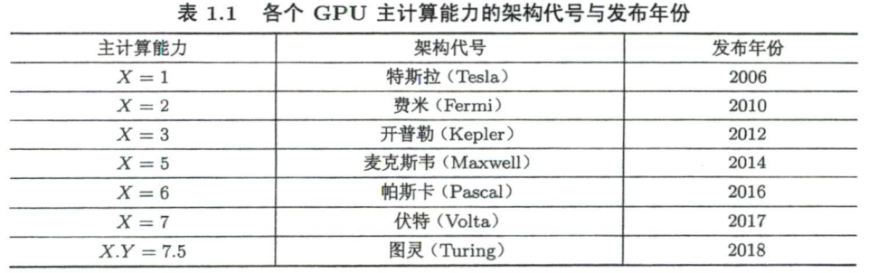
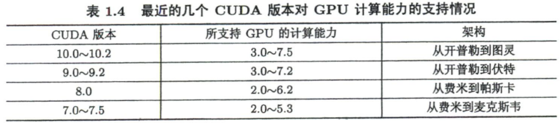
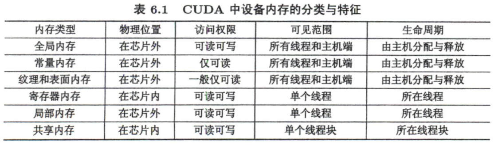
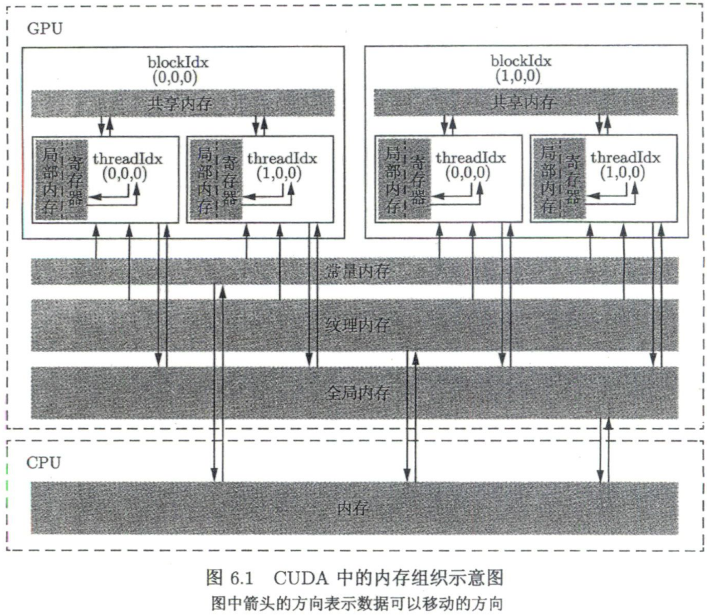
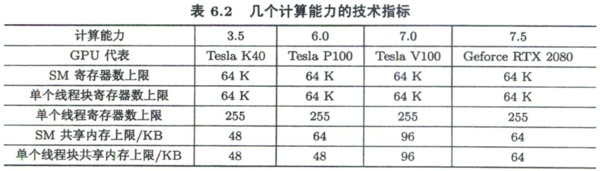
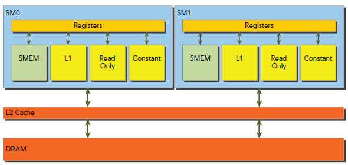
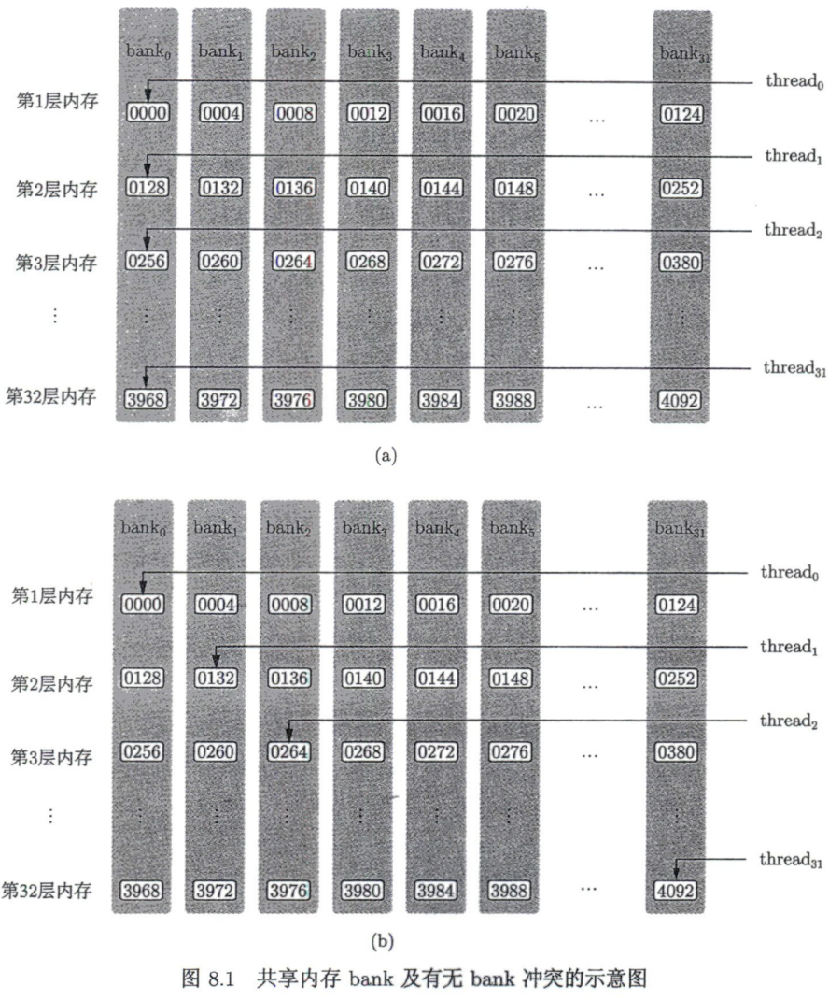
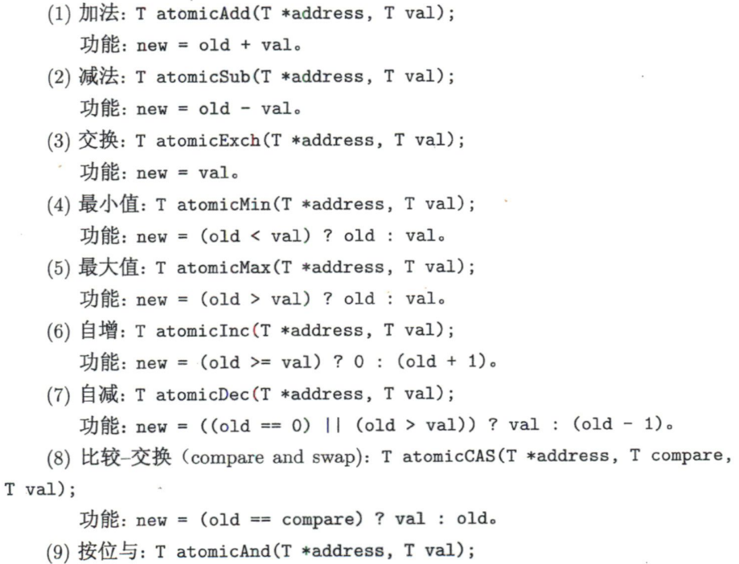
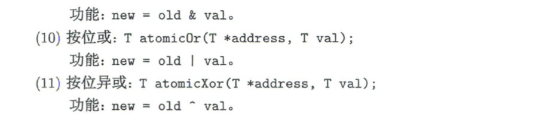
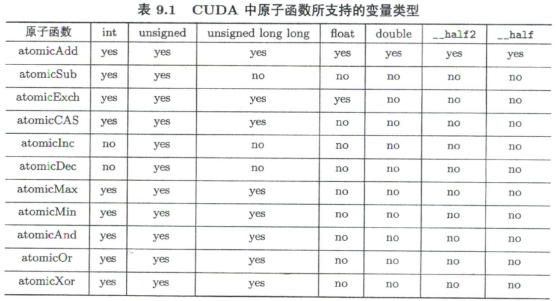

# CUDA编程：基础与实践

> 豆瓣：https://book.douban.com/subject/35252459/

注：之前简单学过一遍CUDA，我认为很简单的内容就没再记录了

## 总结

### 特性

- **网格与线程块大小的限制**：对任何从开普勒到图灵架构的GPU
    - grid，在x、y和z的最大允许值分别为 $2^{31}-1$、65535和65535
    - block，在x、y和z的最大允许值分别为 1024、1024和64，<u>且x、y、z的乘积≤1024</u>
    
- NVCC的**化简编译选项**：

    ```bash
    -arch=sm_XY
    # 等价于
    -gencode arcn＝compute_XY,code＝sm_XY
    -gencode arcn＝compute_XY,code＝sm_XY
    ```

- 所有CUDA runtime API都以cuda开头

- 一个SM中线程块数量$N_b$最多 16（开普勒和图灵架构）or 32（麦克斯韦、帕斯卡和伏特架构）

- 一个SM中线程数$N_t$最多 2048（开普勒到福特架构）or 1024（图灵架构）

### 编程习惯

- device的变量以`d_`开头，host的以`h_`开头
- 推荐，写了cudaMalloc后马上写cudaFree
- `cudaMemcpy()`可以起到隐式同步host和device的作用
- CHECK宏函数不能用于cudaEventQuery函数
- 调试时，可以设置环境变量`CUDA_LAUNCH_BLOCKING=1`将核函数的调用设置成同步（即host调用核函数，必须等它都执行完了才走下一步）
- 内存错误检查：可执行文件cuda-memcheck
- 要保证核函数中的代码执行顺序 与 写得一样，要用同步函数`__syncthreads()`

### 优化技巧

- 提升利用率：总的线程数>计算核心数
- 提升SM的利用率：SM中驻留的线程数 越大越好
    - 技巧一：参考CUDA工具箱中的`CUDA_Occupancy_Calculator.xls`的文档，来计算sm占有率
    - 技巧二：用编译器选项`--ptxas-options=-v` 显示每个核函数的寄存器使用数量
    - ‌技巧三：使用核函数的`__launch_bounds__()`修饰符和 编译选项`--maxrregcount=` 控制一个和所有 核函数中的寄存器使用数量

- 在不满足 读和写 都合并的情况下，尽量做到合并地写入，因为可以使用`__ldg()`读取 全局内存
- 核函数对共享内存访问的次数越多，则加速效果越明显
- 解决bank冲突方法的一种思路：数组多申请一列
- 通过 合并判断语句 减少分支发散
- 数组规约的优化

    - 利用洗牌函数规约
    - 让线程访问 "跨度为一个线程块 or 所有线程数（对于一维情况，=blockDim.x\*gridDim.x）"的数据
    - 使用 重复调用核函数 替换 原子操作：可以获得更精确的结果
    - 用静态全局内存代替动态全局内存数组

## 第1章 GPU硬件与CUDA程序开发工具

- CPU中有更多的晶体管用于数据缓存和流程控制，GPU中有更多的晶体管用于算术逻辑单元

- **==GPU计算==**：CPU+GPU的异构（heterogeneous）计算

- **==计算能力（compute capability）==**：形式为`X.Y`，前为主版本，后为次版本

    - 计算能力和性能没有简单的正比关系
    - 版本号越大，GPU架构（architecture）越新，∵主版本号与GPU的核心架构相关

    

    > 查看各GPU的计算能力：https://developer.nvidia.cn/zh-cn/cuda-gpus#compute

- 表征计算能力的参数：

    - 浮点数运算峰值（floating-point operations per second，FLOPS）
        - Tesla系列，双精度FLOPs是单精度的1/2左右，GeForce系列为1/32
    - GPU中的内存带宽 （memory bandwidth）

- CUDA提供2层API：性能上几乎没有差别

    - CUDA驱动（driver）API：更底层，提供了更为灵活的编程接口。
        - 在其他编程语言中使用CUDA，必须用这个
    - ==CUDA运行时（run time）API==：在CUDA驱动API的基础上构建，更高级、容易使用，都以cuda开头

- CUDA和计算能力的关系：CUDA版本是GPU软件开发平台的版本，而计算能力对应着 GPU硬件架构的版本

    

- 从CUDA 10.2开始，`CUDA C`改名为`CUDA C++`

- nvidia-smi信息：

    - GPU模式：

        - WDDM（Windows display driver model）模式
        - TCC（Tesla compute cluster）：仅在Tesla、Quadro和Titan系列的可选

        ```bash
        sudo nvidia-smi -g [GPU_ID] -dm 0 ＃设置为WDDM模式
        sudo nvidia-smi -g [GPU_ID] -dm 1 ＃设置为TCC模式
        ```

    - 计算模式（compute mode）

        ```bash
        sudo nvidia-smi -g [GPU_ID] -c 0 ＃默认模式
        sudo nvidia-smi -g [GPU_ID] -c 1 ＃独占进程（exclusive process mode，E.Process）
        ```

## 第2章 CUDA中的线程组织

- 核函数定义，`__global__`和void顺序随意

- 核函数不支持C++的`iostream`

- 核函数中有`printf`，调用后需要使用代码`cudaDeviceSynchr○nize();`

    - ∵核函数调用`printf`，输出流是先存放在缓冲区的，而缓冲区不会自动刷新。只有程序遇到某种同步操作时缓冲区才会刷新

- 提升利用率：总的线程数>计算核心数（一般为几倍）

    - ∵计算和内存访问之间及不同的计算之间合理地重叠，从而减小计算核心空闲的时间
    - 在执行时能够同时活跃（不活跃的线程处于等待状态）的线程数，由硬件（主要是CUDA核心数）和软件 （即核函数中的代码）决定

- **网格与线程块大小的限制**：对任何从开普勒到图灵架构的GPU

    - grid，在x、y和z的最大允许值分别为 $2^{31}-1$、65535和65535
    - block，在x、y和z的最大允许值分别为 1024、1024和64，<u>且x、y、z的乘积≤1024</u>

- CUDA的头文件

    - 使用nvcc编译.cu，自动包含必要的CUDA头文件，如`<cuda.h>`和` <cuda_runt1me.h>`
    - `<cuda.h>`包含`<stdlib.h>`

- **NVCC编译.cu**，包含3个步骤：

    - 步骤零：将全部源代码分离为主机代码（支持C++，交给gcc等编译器）和设备代码（部分地支持C++，继续由nvcc）
    - 步骤一：编译为PTX（parallel thread execution）伪汇编代码，使用选项`-arch＝compute_XY`指定虚拟架构的计算能力为X.Y，用以确定代码中能够使用的CUDA功能
    - 步骤二：再将PTX代 码编译为二进制的cubin目标代码，使用选项`-code＝sm_ZW`指定真实架构的计算能力为Z.W，用以确定可执行文件能够使用的GPU

    > 注意：
    >
    > - ZW必须大于XY
    > - 编译出的程序只能运行 在计算能力的主版本号=Z、次版本号≥W 的GPU上

- ==胖二进制文件（fatbinary）==：同时指定多组计算能力，可以用于更多的GPU（例如下），但是会增加编译时间&&可执行文件大小

    ```bash
    -gencode arcn＝compute_35,code＝sm_35
    -gencode arcn＝compute_50,code＝sm_50
    -gencode arcn＝compute_60,code＝sm_60
    -gencode arcn＝compute_70,code＝sm_70
    ```

- NVCC的==即时编译（just-in-time compilation）机制==：在运行可执行文件时从其中保留的PTX代码临时编译出一个cubin目标代码，需要使用如下方式保留PTX代码的虚拟架构

    ```bash
    -gencode arcn＝compute_XY,code＝compute_XY	# 注意：前后都是compute
    ```

- NVCC的**化简编译选项**：

    ```bash
    -arch=sm_XY
    # 等价于
    -gencode arcn＝compute_XY,code＝sm_XY
    -gencode arcn＝compute_XY,code＝sm_XY
    ```

- NVCC编译不指定计算能力，用默认的

    - CUDA 6.0及更早，默认为1.0。无法在核函数中使用printf
    - CUDA 6.5~8.0，默认为2.0
    - CUDA 9.0~10.2，默认为3.0

## 第3章 简单CUDA程序的基本框架

- 判断两个float是否相等时,不能用==。而要将这两个数的差的绝对值与—个很小的数进行比较

- 隐形的设备初始化：CUDA runtime API中，在第一次调用一个和设备管理及版本查询功能无关的run time API函数时，设备将自动初始化。

- 所有CUDA runtime API都以cuda开头

- device上**内存分配和释放**：在host中调用如下函数

    ```c++
    /* 内存分配 */
    // 定义
    __host__ cudaError_t cudaMalloc (
    	void **devPtr, 	// 传入双重指针，∵为了改变指针的值（指向其他地方），而不是改变指针所指内存的值
    	size_t  size );
    // 示例
    double *d_x;
    cudaMalloc((void **)&d_x, 1000);	// (void **)为强制类型转换（可以不明确写出来）
    /* 内存释放 */
    // 定义
    __host__ __device__ cudaError_t cudaFree ( void* devPtr );
    // 示例
    cudaFree(d_x);
    ```

    > - cudaMalloc和cudaFree一定要成对使用。**推荐，写了cudaMalloc后马上写cudaFree**
    > - [不建议] CUDA 2.0以及之后，可以在核函数内部使用`malloc()`和`free()`来分配 动态全局内存，但是性能较差

- 编程习惯：device的变量以`d_`开头，host的以`h_`开头

- 数据拷贝：

    ```c++
    __host__ cudaError_t cudaMemcpy ( 
        void* dst, 
        const void* src, 
        size_t count, 
        cudaMemcpyKind kind 	// 数据传递方向
    );
    ```

    > `cudaMemcpyKind`包含5种：`cudaMemcpyHostToDevice`、`cudaMemcpyDeviceToHost`、`cudaMemcpyHostToHost`、`cudaMemcpyDeviceToDevice`、`cudaMemcpyDefault`（根据指针自动判断传输方向，要求64位系统&&==统一虚拟寻址(unified virtual addressing)==）

- 核函数要求

    - 必须使用限定符`__global__`，跟其他C++中的限定符（如static）次序任意
    - 支持C++中的重载（overload）
    - 不支持可变数量的参数列表
    - 可传递非指针变量（如int n），其内容对每个线程可见
    - 除非使用统一内存（见第12章），否则传给核函数的数组 （指针）必须指向device内存
    - 核函数不可成为—个类的成员。通常的做法，用—个包装函数调用核函数，而将包装函数定义为类的成员
    - 从计算能力3.5开始, 引入==动态并行（dynamic parallelism）==机制，使得核函数可以调用其他核函数（包括自己）

- CUDA标识符

    - `__global__`：表示核函数。一般由host调用，在device上执行；通过动态并行，也可以在其他核函数中调用
    - `__device__`：表示==设备函数(device function)==。只能由核函数or其他设备函数调用，在device上执行。可以有return
    - `__host__`：表示host上的普通c++函数。可以省略
    - `__noinline__`：建议一个设备函数为非内联（编译器不一定接受）
    - `__forceinline__`：建议一个设备函数为内联

    > - 可以同时使用`__device__`和`__host__`，表示在host和device都可以运行，减少冗余代码
    > - 不能同时使用`__device__`和`__global__`
    > - 不能同时使用`__host__`和`__global__`

## 第4章 CUDA程序的错误检测

- 方法一：使用宏定义

    ```c
    #pragma once
    #include <stdio.h>
    
    #define CHECK(call)                                   \
    do {                                                  \
        const cudaError_t error_code = call;              \
        if (error_code != cudaSuccess) {                  \
            printf("CUDA Error:\n");                      \
            printf("    File:       %s\n", __FILE__);     \
            printf("    Line:       %d\n", __LINE__);     \
            printf("    Error code: %d\n", error_code);   \
            printf("    Error text: %s\n",                \
                cudaGetErrorString(error_code));          \
            exit(1);                                      \
        }                                                 \
    } while (0)
    ```

    > - 使用do-while是为了安全（没说为啥）
    > - **不能用于cudaEventQuery函数**，∵可能返回cudaErrorNotReady，但不代表程序错了

- 以上方法不能用于核函数，因为没有return，需要在调用核函数后加两句

    ```c++
    CHECK(cudaGetLastError());			// 捕捉cudaDeviceSynchronize之前的最后一个错误
    CHECK(cudaDeviceSynchronize());		// 同步host和device
    ```

    > 注意：`cudaDeviceSynchronize`比较耗时，不在内层循环使用

- `cudaMemcpy()`可以起到隐式同步host和device的作用

- 调试时，可以设置环境变量`CUDA_LAUNCH_BLOCKING=1`将核函数的调用设置成同步（即host调用核函数，必须等它都执行完了才走下一步）

- 内存错误检查：使用**CUDA-MEMCHECK**工具集，包含memcheck、racecheck、 jnitcheck、synccheck四个工具，由可执行文件cuda-memcheck调用

    ```c++
    cuda-memcheck --tool memcheck [options] app_name [app_options]
    // 上面可化简为 cuda-memcheck [options] app_name [app_options]
    cuda-memcheck --tool racecheck [options] app_name [app_options]
    cuda-memcheck --tool jnitcheck [options] app_name [app_options]
    cuda-memcheck --tool synccheck [options] app_name [app_options]
    ```

## 第5章 获得GPU加速的关键

- 基于CUDA event的计时方式

    ```c++
    cudaEvent_t start, stop;
    CHECK(cudaEventCreate(&start));		// 初始化
    CHECK(cudaEventCreate(&stop));
    CHECK(cudaEventRecord(start));		// 记录开始
    cudaEventQuery(start);		// 不能用CHECK宏定义。对于TCC驱动模式的GPU可省略，WDDM的必须保留，原因见下
    // TODO
    CHECK(cudaEventRecord(stop));		// 记录结束
    CHECK(cudaEventSynchronize(stop));	// 等待记录完成
    float elapsed_time;
    CHECK(cudaEventElapsedTime(&elapsed_time, start, stop));
    printf("Time = %g ms.\n", elapsed_time);
    ```

    > - 处于WDDM驱动模式的GPU中，一个==CUDA流（CUDA stream）==中的操作（如cudaEventRecord函数）并不是直接提交给GPU执行，而是先提交到一个软件队列，需要添加一条对该流的 cudaEventQuery操作（或者cudaEventSynchromze）刷新队列，才能促使前面的操作在GPU执行

- GPU加速的关键
    - 尽量缩减数据传输所花时间的比例
    - 算数强度：算数操作的工作量与必要的内存操作的工作量之比
    - （并行规模）核函数中定义的线程总数 等于 一个SM中最多驻留线程个数（也可能更小），图灵架构为1024，开普勒到伏特架构为2048
- CUDA数学库的函数：只有半精度需要包含头文件`<cuda_fp16.h>`，其他都不用额外头文件
    - 单精度、双精度、半精度的浮点数内建函数和数学函数
    - 整数类型的内建函数
    - 类型转换内建函数（type casting intrinsics）
    - 单指令-多数据内建函数（SIMD intrinsics）
- ==内建函数==：准确度较低，但效率较高的函数

## 第6章 CUDA的内存组织





- ==全局内存（global memory）==

    - 容量基本就是显存容量
    - 角色：为核函数提供数据，并在 host与device、device与device之间传输数据

    - 使用`cudaMalloc()`分配。在处理逻辑上的两维或三维问题时，可以使用`cudaMallocPitch()`和`cudaMalloc3D()`分配，用`cudaMemcpy2D()`和`cudaMemcpy3D()`复制，释放还是用`cudaFree()`
    - 可读可写
    - 生命周期由host决定，不由核函数决定

- ==静态全局内存==：所占内存在编译期间确定，是全局变量

    - 定义方式：在任何函数外部定义

        ```cpp
        __device__ T x; // 单个变量
        __device__ T y[N]; // 固定长度的数组
        ```

    - 核函数中，可直接访问 静态全局内存变量；不能在host函数中直接访问，需要使用`cudaMemcpyToSymbol()`和`cudaMemcpyFromSymbol()`在 静态全局内存 与 主机内存中传输数据，具体函数原型如下

        ```c++
        __host__cudaError_t cudaMemcpyToSymbol ( 
            const void* symbol,       // 静态全局内存变量名，或者 常量内存变量名
            const void* src,          // 主机内存缓冲区指针       
            size_t count,             // 复制的字节数
            size_t offset = 0,        // 从symbol对应设备地址开始偏移的字节数
            cudaMemcpyKind kind = cudaMemcpyHostToDevice    // 可选参数
        );
        __host__cudaError_t cudaMemcpyFromSymbol ( 
            const void* dst,          // 主机内存缓冲区指针     
            const void* symbol,       // 静态全局内存变量名，或者 常量内存变量名  
            size_t count,             // 复制的字节数
            size_t offset = 0,        // 从symbol对应设备地址开始偏移的字节数
            cudaMemcpyKind kind = cudaMemcpyDeviceToHost    // 可选参数
        )
        
        ```

- ==常量内存（constant memory）==：
    - 有常量缓存的全局内存，数量仅64KB
    - 仅可读
    - 如果一个线程束读取相同的常量内存数据，则速度>全局内存
    - 使用方法：① 在核函数外，使用`__constant__`定义变量；
                             ② 给核函数 传值 的参数都放在常量内存中，但是一个核函数最多只能用4KB的常量内存

- ==纹理内存（texture memory）==和==表面内存（surface memory）==：
    - 类似常量内存，也是带缓存的全局内存，但容量更大
    - 一般仅可读，表面内存也可以写
    - 纹理内存的使用方法
        - 计算能力>3.5的GPU，将只读全局内存 使用 `__ldg()`读取（利用 ==只读数据缓存（read-only data cache）==），可以加速

            ```c++
            T __ldg(const T* address);
            ```

        - 大于帕斯卡架构，全局内存的读取默认使用`__ldg()`

- ==寄存器（register）==

    - 核函数中定义的 不加任何限定符 的变量，存放在寄存器中，仅对一个线程可见
        - 但 数组 可能在 寄存器 也可能在 局部内存中
    - 各种内建变量（例如gridDim、blockIdx、warpSize等）都存在 特殊的寄存器中 

- ==局部内存（local memory）==：

    - 寄存器中放不下的变量 && 索引值不能再编译时确定的数组，都可能放在局部内存，由编译器自动判断
    - 用法类似寄存器，但硬件角度，局部内存是全局内存的一部分
    - 每个线程最多使用512KB的局部内存，用多了降低性能

- ==共享内存（shared memory）==

    - 位于芯片上，速度仅次于寄存器
    - 同一共享内存的变量在不同线程块中都有副本，具体值可以不同；单个副本 对 单个线程块 可见
    - 作用：减少对全局内存的访问

    

- ==L1和L2缓存==

    

    - 大于费米架构，SM层次的L1缓存 和 设备层次的L2缓存
    - 作用：缓存 全局内存 和 局部内存 的访问
    - 共享内存 是可编程的内存（完全由用户操控），L1和L2缓存 不可编程（用户顶多引导编译器）
    - 可针对 单个核函数 or 整个程序 改变 L1缓存和共享内存的比例
        - 计算能力3.5：共有64KB，共享内存可为16KB、32KB和48KB（默认），其余的归L1缓存
        - 计算能力3.7：共有128KB，共享内存可为80KB、96KB和112KB（默认），其余的归L1缓存
        - 麦克斯韦架构和帕斯卡架构，不能 调整共享内存
        - 伏特架构：统一的(L1/纹理/共享内存)缓存共有128KB，共享内存可为0KB、8KB、16KB、32KB、64KB或96KB。
        - 图灵架构：统一的(L1/纹理/共享内存)缓存共有96KB，共享内存可为32KB或64KB

- **SM的构成**

    - 寄存器、共享内存
    - 常量内存、纹理和表面内存的缓存
    - L1缓存
    - 2个（计算能力60）或 4个（其他）==线程束调度器（warp scheduler）==，用于 不同线程的上下文 之间的迅速切换，&& 为准备就绪的线程束发出执行指令。
    - 执行核心，包括
        - 整型数运算的核心(INT32)、单精度浮点数运算的核心(FP32)、双精度浮点数运算的核心(FP64)
        - 单精度浮点数==超越函数 (transcendental functions)==的==特殊函数单元(special function units，SFUs)==
        - 混合精度的张量核心 (tensor cores，由伏特架构引入，适用于机器学习中的低精度矩阵计算)

- ‌==SM的理论占有率（theoretical occupancy）===驻留的线程数目÷理论最大值

    - 实际情况中要让SM的占有率>某值（例如25%）才能获得较高性能
    - 已知：
        - 一个线程块中所有维度的线程数量加起来，不能超过1024
        - 一个SM中线程块数量$N_b$最多 16（开普勒和图灵架构）or 32（麦克斯韦、帕斯卡和伏特架构）
        - 一个SM中线程数$N_t$最多 2048（开普勒到福特架构）or 1024（图灵架构）
    - 指导方针：SM中驻留的线程数 越大越好
    - 情况一：寄存器和共享内存使用量很少
        - block size 需要>$N_t/N_b$ ，而且为32的倍数
    - ‌情况二：有限的寄存器数量
        - 一个SM最多使用寄存器数量为64K（见表6.2），假设一个线程使用n个寄存器，驻留的线程数目=$64*1024/n$
    - 情况三：有限的共享内存
        - 以计算能力7.5为例，SM中共享内存最多使用64KB，假设block size为128，单个block使用4KB 共享内存（最多使用64KB），
        - 则 最多有64KB/4KB=16个block，共16*128=2048个线程，SM占用率为100%

    > - 技巧一：参考CUDA工具箱中的`CUDA_Occupancy_Calculator.xls`的文档，来计算sm占有率
    > - 技巧二：用编译器选项`--ptxas-options=-v` 显示每个核函数的寄存器使用数量
    > - ‌技巧三：使用核函数的`__launch_bounds__()`修饰符和 编译选项`--maxrregcount=` 控制一个和所有 核函数中的寄存器使用数量

- 使用 runtime API查询设备信息

    ```cpp
        int device_id = 0;
        if (argc > 1) device_id = atoi(argv[1]);
        CHECK(cudaSetDevice(device_id));
    
        cudaDeviceProp prop;
        CHECK(cudaGetDeviceProperties(&prop, device_id));
    
        printf("Device id:                                 %d\n",
            device_id);
        printf("Device name:                               %s\n",
            prop.name);
        printf("Compute capability:                        %d.%d\n",
            prop.major, prop.minor);
        printf("Amount of global memory:                   %g GB\n",
            prop.totalGlobalMem / (1024.0 * 1024 * 1024));
        printf("Amount of constant memory:                 %g KB\n",
            prop.totalConstMem  / 1024.0);
        printf("Maximum grid size:                         %d %d %d\n",
            prop.maxGridSize[0], 
            prop.maxGridSize[1], prop.maxGridSize[2]);
        printf("Maximum block size:                        %d %d %d\n",
            prop.maxThreadsDim[0], prop.maxThreadsDim[1], 
            prop.maxThreadsDim[2]);
        printf("Number of SMs:                             %d\n",
            prop.multiProcessorCount);
        printf("Maximum amount of shared memory per block: %g KB\n",
            prop.sharedMemPerBlock / 1024.0);
        printf("Maximum amount of shared memory per SM:    %g KB\n",
            prop.sharedMemPerMultiprocessor / 1024.0);
        printf("Maximum number of registers per block:     %d K\n",
            prop.regsPerBlock / 1024);
        printf("Maximum number of registers per SM:        %d K\n",
            prop.regsPerMultiprocessor / 1024);
        printf("Maximum number of threads per block:       %d\n",
            prop.maxThreadsPerBlock);
        printf("Maximum number of threads per SM:          %d\n",
            prop.maxThreadsPerMultiProcessor);
    ```

## 第7章 全局内存的合理使用

- 对全局的访问将触发==内存事务（memory transaction）==，即==数据传输（data transfer）==

- 读取顺序：全局内存的读取 先从L1缓存，未命中则使用L2缓存，再未命中，直接从DRAM读取

    - **一次传输32 Byte**，给**线程束**用

- ==合并（coalesced）访问==：一个线程warp对全局内存的一次访问请求（读or写）导致最少数量的数据传输

    - 否则为==非合并（uncoalesced）==

- ==合并度（degree of coalescing）==：$=\frac{线程束请求的字节数}{该请求导致的所有数据传输处理的字节数}$

    - 是一种资源利用率，利用率低 表示 显存带宽浪费

- 在一次数据传输中，从全局内存 转移到 L2缓存 的一片<u>内存的首地址一定是32 Byte的整数倍</u>

    - 保证方法：使用CUDA函数（例如`cudaMalloc`）分配的内存首地址至少是256 Byte的整数倍

- 常见的内存访问模式 && 合并度

    - 顺序的合并访问：合并度100%

        ```cpp
        int n = threadIdx.x + blockIdx.x * blockDim.x;
        z[n] = x[n] + y[n];
        ```

        第一个线程块中的线程束 访问数组x中的0-31号元素，对应128 Byte的连续内存（int是4 Byte），且首地址一定是256 Byte的整数倍，∴只要4次数据传输，是合并访问，合并度100%

    - 乱序的合并访问：

        ```cpp
        int n = threadIdx.x ^ 0x1 + blockIdx.x * blockDim.x;	 // ^是异或操作，可以打乱threadIdx.x，但不会出现重复
        z[n] = x[n] + y[n];
        ```

        经过异或操作后，第一个线程块中的线程束 还是访问x中的0-31号元素（不按照顺序），但是同样是合并访问，合并度100%

    - 不对齐的非合并访问：合并度80%

        ```cpp
        int n = threadIdx.x + blockIdx.x * blockDim.x + 1;
        z[n] = x[n] + y[n];
        ```

        第一个线程块中的线程束 访问x中的1-32号元素，导致触发5次传输（分别传输0-7、8-15、16-23、24-31、32-40元素），没有进行对齐，合并度为$\frac{32*4 Byte}{5*32 Byte}=80\%$

    - 跨越式的非合并访问：合并度12.5%

        ```cpp
        int n = blockIdx.x + threadIdx.x * blockDim.x + 1;
        z[n] = x[n] + y[n];
        // block size = 32, grid size = 128
        ```

        第一个线程块中的线程束 访问x中的0、128、256、384等元素，将导致32次数据传输，合并度为$\frac{32*4 Byte}{32*32 Byte}=12.5\%$

    - 广播式的非合并访问：合并度12.5%

        ```cpp
        int n = threadIdx.x + blockIdx.x * blockDim.x;
        z[n] = x[0] + y[n];
        ```

        第一个线程块中的线程束 都访问同一元素，合并度为$\frac{4 Byte}{32 Byte}=12.5\%$

        推荐使用 <u>常量内存</u>

- 在不满足 读和写 都合并的情况下，尽量做到合并地写入，因为可以使用`__ldg()`读取 全局内存

    - 大于帕斯卡架构，会自动使用；其他的要手动使用

## 第8章 共享内存的合理使用

- 共享内存的作用

    - 减少核函数对全局内存的访问次数，实现高效的线程块内部通信
    - 提高全局内存访问的合并度

- 要保证核函数中的代码执行顺序 与 写得一样，要用同步 ==线程块函数==`__syncthreads()`（只能在核函数中用）

- 核函数中，位操作 比 对应的整数操作 高效

    - 编译期间知道变量可能的取值时（比如除2），编译器会自动使用 位操作

- **（静态）共享内存变量的定义**：加上限定符`__shared__`，同时指定数据量大小

- **可见范围**：在一个核函数中定义一个共享内存变量，相当于每个线程块中都有一个该变量的<u>副本</u>。每个副本不一样，但是共用一个 变量名。核函数中对共享内存的变量都是作用在所有副本上的

- 核函数对共享内存访问的次数越多，则加速效果越明显

- ==动态共享内存==

    ```cpp
    // 在核函数的调用时，加入第三个参数：每个线程块定义的动态共享内存的字节数
    <<<grid_size, block_size, sizeof(float) * block_size>>>
    // 声明：多加上extern，不能指定数组大小，不能用指针（∵数组≠指针）
    extern __shared__ float x[];
    ```

- ==内存bank==：为了获得高的内存带宽，共享内存 在物理上被分成32个（等价于warpSize）同样大小的、可以被同时访问的内存bank

    - 开普勒架构中，每个bank大小为8 Byte（不做讨论）；其他架构，都是4 Byte
    - 例如，对于bank大小为4 Byte的架构，维度32\*32的int数组，0-31号元素 依次 对应到32个bank的第1层，32-63号元素在第2层，等等，如下图

- ==bank冲突==：只要 同一线程束中不同线程 访问 同一bank中 n层的数据，就会出现bank冲突，导致n次==内存事务（memory transaction）==；否则就只需要一次 内存事务

    

    - 解决bank冲突方法的一种思路：对于上面的示例，数组多申请一列，即大小为32\*33（先遍历33）
        - 第0个线程读取\[0\]\[0\]坐标的元素，对应第0个元素，在bank0的第1层
        - 第1个线程读取\[0\]\[1\]坐标的元素，对应第34个元素，在bank1的第2层（因为总共32个bank）
        - 以此类推，每个线程都读取不同bank的不同层，∴一个内存事务就能读取完毕

- 注意：共享内存改善全局内存的访问，**不一定**能提高核函数的性能，要具体情况具体分析

    

## 第9章 原子函数的合理使用

- ==原子操作==：在不受其他线程的任何操作的影响下 完成某个（全局or共享内存中）数据的一套 “读-改-写”操作

- 特点

    - 原子函数 不能保证各个线程的执行顺序固定，但是能保证每个线程的操作 一气呵成，不被其他线程干扰
    - 没有 同步功能

- 各种 原子函数：返回值都是old，只能在核函数中使用

    

    

    

    - 以`atomicAdd()`为例，从帕斯卡架构起，引入了`atomicadd_system()`和`atomicAdd_block()`，前者 将原子函数的作用范围 扩大到 整个同节点的异构系统（包括host和所有device），后者将 范围缩小至一个block
    - 其他所有原子函数 都可以  用`atomicCAS()`函数实现，但是效率没有官方提供的高

## 第10章 线程束基本函数与协调组

- 线程块执行的时候，会被分配到 没有占满 的一个SM中（不会被拆分）

- ==线程束==：一个SM以32个线程为单位产生、管理、调度、执行线程，这样的32个线程为一个线程束

- 伏特架构之前，一个线程束中的线程共有一个==程序计数器（program counter）==，但 各自有不同的 ==寄存器状态（register state）==，从而可以 根据程序逻辑 选择不同分支。不过，执行的时候，每个分支 按顺序执行。

    - ==单指令-多线程（single instruction multiple thread， SIMT）的执行模式==：一个线程束中的线程只能执行 一个功能的指令，或者闲置，即 轮到的分支的线程执行，没有轮到的闲置
    - ==分支发散（branch divergence）==：<u>同一个线程束中</u>的线程 顺序的执行判断语句中的不同分支
        - 核函数中尽量避免 分支发散
        - 可以通过 合并判断语句 减少分支发散

- 从伏特架构开始，引入==独立线程调度（independent thread scheduling）机制==：每个线程有自己的程序计数器，有了新的线程束内 同步与通信的模式，提高编程灵活度

    - 缺点一：增加了寄存器负担，∵单个线程的程序计数器 需要 2个寄存器（导致用户能用的少了2个）

    - 缺点二：使得 假设了==线程束同步（warp synchronout）==的代码 不安全

        - 可以使用比 线程块同步函数`__syncthreads()` 更精细的 ==线程束同步函数==`__syncwarp()`

            ```cpp
            void __syncwarp(unsigned mask=0xffffffff);
            // mask中32个二进制表示 对应线程是否同步，1为同步
            ```

    - 忽略独立线程调度的方法：在编译时 将虚拟架构指定为 低于伏特架构的计算能力，例如

        ```shell
        -arch=compute_60 -code=sm_70	# 生成PTX代码时使用帕斯卡架构的线程调度机制
        ```

- 线程束内的基本函数：都以`_sync()`结尾，具有隐式的同步功能

    - ==线程束表决函数（warp vote functions）==：开普勒架构后可用，（必须用）CUDA 9更新后的函数原型

        - `unsinged __ballot_sync(unsigned mask, int predicate)`：返回一个无符号整数。如果线程束内第n个线程参与计算 且 predicate值非零，则将所返回无符号整数的第n个二进制位取为1，否则取为0。这里，参与的线程对应于mask中取1的比特位。
            - 该函数的功能相当于从一个旧的掩码出发，产生一个新的掩码
        - `int __all_sync(unsigned mask, int predicate)`：线程束内所有参与线程的predicate值都不为零才返回1，否则返回0。该函数实现了一个==归约-广播（reduction-and-broadcast）式计算==。
            - 该函数类似 所有人都同意才通过 的选举
        - `int __any_sync(unsigned mask, int predicate)`：线程束内所有参与线程的predicate值有一个不为零就返回1，否则返回0。该函数也实现了一个“归约-广播”式计算
            - 该函数类似 1人同意就通过 的选举

    - ==线程束洗牌函数（warp shuffle functions）==：开普勒架构后可用，（必须用）CUDA 9更新后的函数原型

        > - 类型T 可以为 int、long、long long、unsigned、unsigned long、unsigned long long
        > - 参数w只能为2、4、8、16、32，表示逻辑上的线程束大小
        > - 参数mask 表示要参与计算的线程，1为参与
        > - ==线程束指标==：`int lane_id = threadIdx.x % w = int lane_id = threadIdx.x & (w-1)`（后面的 按位与 的操作更高效）

        - `T __shfl_sync(unsigned mask, T v, int srcLane, int w=warpSize)`：参与线程返回标号为srcLane的线程中变量v的值
            - 广播式数据交换，即将一个线程中的数据广播到所有 (包括自己) 线程。
        - `T __shfl_up_sync(unsigned mask, T v, int srcLane, unsigned d, int w=warpSize)`：标号为t的参与线程返回标号为t-d的线程中变量v的值。标号满足t-d<0的线程返回原来的v。
            - 将数据向上（id小的）平移
        - `T __shfl_down_sync(unsigned mask, T v, unsigned d, int w=warpSize)`：标号为t的参与线程 返回标号为t+d的线程中变量v的值。标号满足t+d>=w的线程返回原来的v。
            - 将数据向下（id大的）平移
        - `T __shfl_xor_sync(unsigned mask, T v, int laneMask, int w=warpSize)`：标号为t的参与线程 返回标号为`t^laneMask`的线程中变量v的值。
            - 将 线程束内 线程 两两交换

        > **利用洗牌函数规约**：首先在一个线程块中将数组 规约到长度为32（因为线程束为32）的共享内存数组变量`s_y`中
        >
        > ```cpp
        > float y = s_y[threadIdx.x];		// 用寄存器，更快
        > for(int offset=16;offset>0;offset>>=1)	// 用洗牌函数将剩下的32个数汇总
        > 	y += __shfl_down_sync(0xffffffff, y, offset);	// 可以换成__shfl_xor_sync()
        > if (threadIdx.x == 0)	// 将所有线程块中的内容通过原子操作汇总
        > 	atomicAdd(d_y, y);
        > ```

    - ==线程束匹配函数（warp match functions）==：只能用于>伏特架构，不介绍

    - ==线程束矩阵函数（warp matrix functions）==：只能用于>伏特架构，不介绍

- [==协作组（cooperative groups）==](https://developer.nvidia.com/blog/cooperative-groups/)：是线程块和线程束同步机制的推广，提供了更为灵活的线程协作方式，包括线程块内部的、线程块之间的（网格级的）及 设备之间（不讨论） 的同步与协作

    - 添加头文件`cooperative_groups.h`
    - 使用命名空间`cooperative_groups`（推荐设置别名为`cg`）

- 协作组的类型

    - `thread_group`：最基本的类型，包含成员函数

        - `void sync()`：同步组内所有线程。`g.sync()`等价于`cg::synchronize(g)`
        - `unsigned size()`：返回组内总的线程数目，即组的大小
        - `unsigned thread_rank()`：返回 当前调用该函数的线程 在组内的标号（从0开始计数）
        - `bool is_valid()`：返回 定义的组 是否 满足所有CUDA的限制

    - `thread_block`：`thread_group`的派生类

        - 初始化方式：下面的`g`就是线程块，只是被包装成了一个类型。`g.sync()`完全等价于`__syncthreads()`

            ```c++
            thread_block g = this_thread_block();
            ```

        - 比`thread_group`多两个函数

            - `dim3 group_index()`：完全等价于`blockIdx`
            - `dim3 thread_index()`：完全等价于`threadIdx`

    - `thread_block_tile`：可以将`thread_block`进一步分割成 ==片（tile）==，从而在更精细的粒度上实现协作和同步

        ```cpp
        thread_group g32 = tiled_partition(this_thread_block(), 32);
        thread_group g4 = tiled_partition(tile32, 4);
        // 等价于 使用模板函数（在编译阶段确定）
        thread_block_tile<32> g32 = tiled_partition<32>(this_thread_block());
        thread_block_tile<4> g4 = tiled_partition<4>(this_thread_block());
        ```

        - 额外有如下函数（类似 线程束内的基本函数）：①少了参数mask，∵组内所有线程都要参与运算；②少了参数w，∵tile的大小就是参数w

            ```cpp
            unsigned __ballot_sync(int predicate);
            int __all_sync(int predicate);
            int __any_sync(int predicate);
            T __shfl_sync(T v, int srcLane);
            T __shfl_up_sync(T v, unsigned d);
            T __shfl_down_sync(T v, unsigned d);
            T __shfl_xor_sync(T v, int laneMask);
            ```

- 数组规约的优化

    - 提升线程利用率：不要让一个线程处理相邻的数据，∵必然导致全局内存的非合并访问。通过让线程访问 ""跨度为一个线程块 or 所有线程数（对于一维情况，=blockDim.x\*gridDim.x）"的数据

    - 使用 重复调用核函数 替换 原子操作：可以获得更精确的结果

        - 首先，线程访问的数据间隔=所有线程数（见上一条）

        - 还要使用动态共享内存，这样才能在两次调用使用不一样大小的共享内存

        - 然后，规约函数最后的原子操作 `if(threadIdx.x==0)  atomicAdd(d_y, y)`，替换成`if(threadIdx.x==0)  d_y[blockIdx.x] = y`，其中y保存了每个线程块的规约结果，相当于是分段规约

        - 调用两次核函数：第二次调用将所有段的结果汇总

            ```cpp
            cudaMalloc(&d_y, sizeof(float)*10240);	// d_y的长度是分段数量
            reduce_cp<<<10240, 128, sizeof(float)*128>>>(d_x, d_y, N);
            reduce_cp<<<1, 1024, sizeof(float)>>>(d_y, d_y, 10240)	// grid size必须为1（相当于在1个线程块内部规约），block size要小于上面的grid size，两个都是d_y，最后的N必须为上面的grid size
            ```

    - 避免反复分配和释放设备内存：上面的d_y都是分配的动态全局内存数组，比较耗时，可以用静态全局内存代替 更快（因为编译期间确定），在函数外定义

        ```cpp
        __device__ float static_y[10240]; 
        ```

        然后为了不改变核函数代码，不直接使用该变量，而是利用`cuddGetSymbo1Address()`获取指向该静态全局内存的指针

        ```cpp
        cuddGetSymbo1Address((vo1d**)&d_y, static_y);
        ```

## 第11章 CUDA流

- CUDA程序的并行层次 \* 2
    - 核函数内部的并行：重点
    - 核函数外部的并行：非重点
      - 核函数计算、主机计算、数据传输 之间的并行
      - 不同的数据传输（例如HostToDevice、DeviceToHost等）之间的并行
      - 不同核函数之间的并行：使用多个CUDA流
- ==CUDA流（stream）==：由host（或者device，暂不考虑）发出的在一个device中执行的CUDA操作序列（即跟CUDA相关的操作）
  
    - 由类型为`cudaStream_t`的变量表示
    - 要么存在于 ==默认流（default stream）==，也称为==空流（null stream）==，要么在 明确指定的==非空流==
- 非空流：在host端 产生和销毁

    ```cpp
    // 产生
    __host__ cudaError_t cudaStreamCreate ( cudaStream_t* pStream );
    // 销毁：CUDA 11.2的doc说也能在device上销毁？
    __host__ __device__ cudaError_t cudaStreamDestroy ( cudaStream_t stream );
    ```
- 检查CUDA流中所有的操作是否都在device中完成

    ```cpp
    // 强制阻塞host，直到操作都完成
    __host__ cudaError_t cudaStreamSynchronize ( cudaStream_t stream );
    // 不阻塞，只检查操作是否完成
    __host__cudaError_t cudaStreamQuery ( cudaStream_t stream );
    ```

- 一个CUDA流 中的CUDA操作 按顺序执行，前一个完成了才进行下一个

    - 实现多个核函数 之间的并行操作 必须使用 多个CUDA流

- 核函数执行配置中的 流参数
    ```cpp
    my_kernel<<<grid_size, block_size, shared_memory_size, stream_id>>>(函数参数);
    // 如果没用到动态共享内存，则设置shared_memory_size=0
    ```
- 多个CUDA流并发可以提升SM的利用率
    - 不同计算能力GPU中，并发数量上限不同（见[官方表格](https://docs.nvidia.com/cuda/cuda-c-programming-guide/index.html#features-and-technical-specifications-technical-specifications-per-compute-capability)的第一行）
- 异步数据传输：由GPU中的==DMA（direct memory access）==实现
    - 非默认流的数据传输 必须使用`cudaMemcpy()`的异步版本：
    
      ```cpp
      __host__ __device__cudaError_t cudaMemcpyAsync ( 
            void* dst, const void* src, 
            size_t count, cudaMemcpyKind kind, 
            cudaStream_t stream = 0     // 只比cudaMemcpy多了这一个函数
      );
      ```
    - 使用 异步数据传输，host内存要定义成==不可分页内存（non-pageable memory）==或者==固定内存（pinned memory）==
      - 不可分页内存：程序运行期间，其物理地址保持不变；可分页内存 则相反
      - 不可分页内存 的 分配 和 释放：都是host内存
      
          ```cpp
          // 分配：二选一。第二个函数的最后参数若为cudaHostAllocDefault，则跟第一个函数等价
          __host__ cudaError_t cudaMallocHost ( void** ptr, size_t size );
          __host__ cudaError_t cudaHostAlloc ( void** pHost, size_t size, unsigned int  flags ); // 注意没有M
          // 释放：要是误用了free()会出错
          __host__ cudaError_t cudaFreeHost ( void* ptr ); 
          ```
      
      - 如果将 可分页内存 传给`cudaMemcpyAsync()`，会退化成`cudaMemcpy`，进行同步传输
- 重叠核函数执行与数据传输的方法：
    - 如果只使用一个CUDA流：CPU传数据到GPU（称H2D）、核函数计算（称KER）、GPU传数据到CPU（称D2H）的顺序为
    
      ```
      stream 0: H2D => KER => D2H
      ```
    - 使用多个CUDA流（假设3个）：可以将数据均分（比如分成3份），执行效率提升$\frac{3}{5/3}=1.8$倍；随着流数量的增加，理论最大加速比为3倍（假设H2D、KER、D2H的耗时一样）
    
      ```
      stream 0: H2D0 => KER0 => D2H0
      stream 1:         H2D1 => KER1 => D2H1
      stream 2:                 H2D2 => KER2 => D2H2
      ```
- 使用CUDA工具箱中的`nvvp`工具 可以对 CUDA流 进行可视化性能剖析

## 第12章 使用同一内存编程
- CUDA 6引入。到CUDA 10.2为止，某些功能在win中受限
- ==统一内存（unified memory）==：系统中任何处理器（CPU or GPU）都可以访问、并保证一致性的虚拟内存
    - 实现方式：通过GPU和GPU内部各自集成的==内存管理单元（memory management unit）==
    - ==第一代统一内存==：开普勒和麦克斯韦架构，功能相对较弱
    - ==第二代统一内存==：帕斯卡架构开始，GPU有了精细的==缺页异常处理（page-fault handing）==能力
    - 很大程度上涉及 多GPU编程
- ==零复制内存（zero-copy memory）==：在统一内存之前，也提供了一种能被CPU和GPU统一访问的存储器。
    - 但其只用 host 内存作为存储介质
    - 统一内存则将数据放在最合适的地方，host或者device
- 统一内存的<u>硬件要求</u>
    - \>=开普勒架构，程序是64位
    - 新功能要>=帕斯卡架构 && Linux。win上只能用第一代统一内存
    - IBM Power 9 和 NVLink，伏特架构，device可以访问任何host内存（包含malloc和栈上的)
- 统一内存的**优势**：
    - CUDA编程更简单：不需要在host和device之间 手动传数据
    - 比手动传数据的性能更好：∵数据自动就近存放
    - 允许 超量分配：要求>=帕斯卡架构 && Linux
- 统一内存的**分配** && **释放**：只能在host分配，不能在device（核函数和__device__函数）。释放还是用`cudaFree()`
  - ==动态统一内存==：分配函数原型如下，可以直接由核函数和CPU访问

      ```cpp
      __host__ ?cudaError_t cudaMallocManaged ( 
        void** devPtr, size_t size, 
        unsigned int  flags = cudaMemAttachGlobal // 另一取值为cudaMemAttachHost
      );
      ```

  - ==静态统一内存==：在修饰符`__device__`的基础上加上修饰符`__managed__`即可

      - 在任何函数外部定义

- 使用同一内存**申请超量内存**：`nvcc`编译加上参数`-DUNIFIED`

    - 超量的原因：对于第二代统一内存，`cudaMallocManaged()`调用后只是预定了一段内存空间，只有在host或者device第一次访问预留的内存时，才会<u>实际分配</u> 统一内存
    - device上访问统一内存，最多使用量 = 内存+显存
    - host上访问统一内存，最多使用量 = 内存

- 优化 统一内存 的使用：避免缺页异常、保持数据的局部性（让相关数据尽可能靠近对应的处理器）、避免内存抖动（频繁在不同处理器之间传输数据）

    - 手动给编译器一些提示：

        ```cpp
        // 暂不介绍
        __host__ cudaError_t cudaMemAdvise ( const void* devPtr, size_t count, cudaMemoryAdvise advice, int  device );
        // 作用：将CUDA流中统一内存缓冲区devPtr内count字节的内存迁移到设备dstDevice（host用cudaCpuDeviceId表示）中的内存区域，从而 防止or减少 缺页异常，并提高数据的局部性
        // 感觉跟cudaMemcpy本质一样呀？？？
        __host__ cudaError_t cudaMemPrefetchAsync ( 
        	const void* devPtr, size_t count, 
        	int dstDevice, cudaStream_t stream = 0 );
        ```

        
