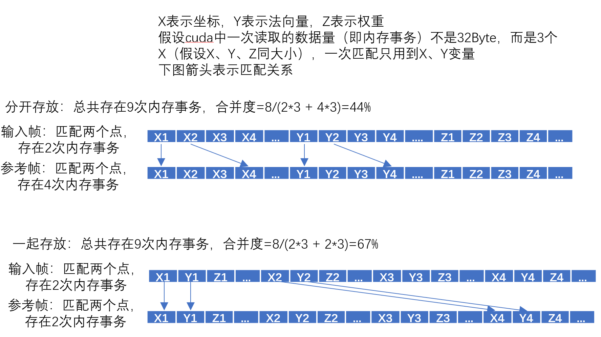

> [推荐几个不错的CUDA入门教程（非广告）](https://godweiyang.com/2021/01/25/cuda-reading/)


## **问题**

- thrust报错"error c2338 unimplemented for this system"，可能是因为当前文件被没有参与cuda（nvcc）编译，比如当前是个.cpp文件
- cudaMemcpyAsync报错an illegal memory access was encountered，可能是因为上面相邻的核函数有问题
- 使用cuda的程序运行时，整个屏幕会突然卡住，可能是因为核函数的参数使用了引用
- 在使用共享内存的情况下，一定要记得初始化，尤其要关注核函数刚开始就return的情况
    - 主要是在归约求和的时候，通常会有if(threadIdx.x + blockIdx.x * blockDim.x>=size) return;，一定要在这个之前把共享内存初始化了，否则后面在共享内部求和的时候会有问题
    - 如果使用前缀和来找全局坐标，也是一样的问题
- 调用一个使用cuda流的核函数后，想要启用多个cuda流做后续操作之前，一定要对核函数的cuda流进行同步
- 一个核函数中不能定义多个动态共享内存数组，[只能将这些数组弄成一个二维数组](https://stackoverflow.com/questions/9187899/cuda-shared-memory-array-variable)

## **优化**

- 压缩内存占用：尽可能利用每一位，因为很多时候IO的耗时远大于计算，宁可多算，也不多传。
    - 比如要从CPU传法向量（范围-1~1）和有效性的信息到GPU，原本法向量要3个float、有效性要1个bool，总共3*32+1个bit；现在可以只用32bit，其中低30位中每10位存法向量中的一个数字，第31位存有效性，从而减少2/3的带宽
    - 再比如原本要上传整个有序点云，现在只上传所有的深度值 + 相机内参（又减少2/3的带宽），点的三维坐标通过反投影计算
- 使用近似计算：比如在topK问题中，如果是要找到最小的10%，可以假设数据满足正态分布，然后用两倍标准差近似
- 大量独立小任务使用多个cuda流：虽然可以使用一个核函数（启用多个cuda block）处理每个小任务的每个步骤，但是核函数之间会有间隔；使用多个cuda流、每个流处理固定数量的小任务，可以尽可能地填满核函数之间的间隙（尤其是当CPU和GPU交替使用的时候）
- 不好并行的任务可以考虑在GPU上使用单个cuda thread完成：
    - 比如要从几百个数字中选取topK，虽然有相应的CUDA开源算法，但都针对超大数组才有效果，在小的数组上跟CPU比没有优势。而且这些开源算法很复杂，想要嵌入自己的代码很麻烦（比如要做一些特质化）。可以把CPU的代码拿来用1个cuda thread来完成，因为虽然cuda thread比CPU thread弱很多，但是把数据传到CPU、CPU算完后再传回GPU会更加耗时
- 随机访问的多个数据可以考虑提前放到一起
    - 比如在做ICP匹配的时候，虽然输入帧中的每个点是顺序访问的，但是参考帧中的是随机访问的，于是把一个点的所有信息一起存放比分开存放 更加高效



- 如果有一些小变量要在同一个地方初始化或者使用，可以考虑放到一个结构体中

    - 比如要计算一个点云中有效点的个数以及有效点的质心，可以弄到一个结构体里面。**如果后续在cpu上只用到其中一个变量，可以不用传入整个结构体的地址，只用传入所需变量的地址即可**

        ```c++
        struct Valid{
          float3 center;
          short num;
        }
        Valid *valid;    // cudaMallc省略
        cudaMemset(valid, 0, sizeof(Valid));    // 只用调用一次cudaMemset，避免多个cudaMemset之间的时间等待
        /* 一些操作 */
        SomeFunc<<<xx,xx>>>(&(valid->center));    // 如果后续只用到其中一个变量，是可以在CPU上单独调用
        ```

        
