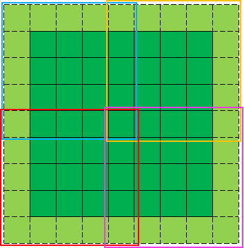

> [推荐几个不错的CUDA入门教程（非广告）](https://godweiyang.com/2021/01/25/cuda-reading/)


## **问题**

- thrust报错"error c2338 unimplemented for this system"，可能是因为当前文件被没有参与cuda（nvcc）编译，比如当前是个.cpp文件
- cudaMemcpyAsync报错an illegal memory access was encountered，可能是因为上面相邻的核函数有问题
- 使用cuda的程序运行时，整个屏幕会突然卡住，可能是因为核函数的参数使用了引用 或者 出现了其他错误
- 在使用共享内存的情况下，一定要记得初始化，尤其要关注核函数刚开始就return的情况
    - 主要是在归约求和的时候，通常会有if(threadIdx.x + blockIdx.x * blockDim.x>=size) return;，一定要在这个之前把共享内存初始化了，否则后面在共享内部求和的时候会有问题
    - 如果使用前缀和来找全局坐标，也是一样的问题
- 调用一个使用cuda流的核函数后，想要启用其他cuda流做后续操作之前，一定要对核函数的cuda流进行同步
- 一个核函数中不能定义多个动态共享内存数组，[只能将这些数组弄成一个二维数组](https://stackoverflow.com/questions/9187899/cuda-shared-memory-array-variable)
- 在device函数中，使用std::min（例如下面第一个）会有问题

    ```c++
    template<typename T>
    __host__ __device__ T clip(T num, T min, T max) { return std::max(min, std::min(num, max)); }
    template<typename T>
    __host__ __device__ T clip(T num, T min, T max) { return num > max ? max : (num < min ? min : num); }
    ```

    

## **优化**

- 压缩内存占用：尽可能利用每一位，因为很多时候IO的耗时远大于计算，宁可多算，也不多传。
    - 有损压缩：比如法向量（3个float）和权重（1个float），可以只用1个uint，其中8位给权重、剩下每个8位给法向量的每个数字。传到GPU的数据减少至原来的1/4，然后在GPU上将这1个uint拆成法向量和权重
    - 无损压缩：假设有序点云总共有N个点，则三维坐标信息占用3*N个float，可以只保留z值（ N个float）、再加 相机内参（6个float）和图像宽度（1个int），传到GPU的数据减少至原来的1/3，然后在GPU上通过反投影计算三维坐标
- 使用近似计算：比如在topK问题中，如果是要找到最小的10%，可以假设数据满足正态分布，然后用两倍标准差近似
- 大量独立小任务使用多个cuda流：虽然可以使用一个核函数（启用多个cuda block）处理每个小任务的每个步骤，但是核函数之间会有间隔；使用多个cuda流、每个流处理固定数量的小任务，可以尽可能地填满核函数之间的间隙（尤其是当CPU和GPU交替使用的时候）
- 不好并行的任务可以考虑在GPU上使用单个cuda thread完成：
    - 比如要从几百个数字中选取topK，虽然有相应的CUDA开源算法，但都针对超大数组才有效果，在小的数组上跟CPU比没有优势。而且这些开源算法很复杂，想要嵌入自己的代码很麻烦（比如要做一些特质化）。可以把CPU的代码拿来用1个cuda thread来完成，因为虽然cuda thread比CPU thread弱很多，但是把数据传到CPU、CPU算完后再传回GPU会更加耗时
- 随机访问的多个数据可以考虑提前放到一起
    - 比如在做ICP匹配的时候，虽然输入帧中的每个点是顺序访问的，但是参考帧中的是随机访问的，于是把一个点的所有信息一起存放比分开存放 更加高效 

- 如果有一些小变量要在同一个地方初始化或者使用，可以考虑放到一个结构体中

    - 比如要计算一个点云中有效点的个数以及有效点的质心，可以弄到一个结构体里面。**如果后续在cpu上只用到其中一个变量，可以不用传入整个结构体的地址，只用传入所需变量的地址即可**

        ```c++
        struct Valid{
          float3 center;
          short num;
        }
        Valid *valid;    // cudaMallc省略
        cudaMemset(valid, 0, sizeof(Valid));    // 只用调用一次cudaMemset，避免多个cudaMemset之间的时间等待
        /* 一些操作 */
        SomeFunc<<<xx,xx>>>(&(valid->center));    // 如果后续只用到其中一个变量，是可以在CPU上单独调用
        ```

- 使用buffer来分配显存：即提前分配一大块显存，然后根据变量所需内存大小计算起始地址

    - 分配速度很快，就是计算一个地址；清空也很快，直接use_bytes=0，之后从头开始分配地址即可
    - 需要一起拷贝or初始化的变量紧挨着分配，这样只用一次拷贝or初始化

    ```c++
    class BufferCuda {
     public:
      BufferCuda(size_t size) : max_bytes_(size) {
        cudaMalloc(&buffer_, size);
        used_bytes_ = 0;
      }
      ~BufferCuda() {
        if (buffer_ != nullptr) cudaFree(buffer_);
      }
      template <typename T> T *GetAddress(size_t bytes) {
        if (used_bytes_ + bytes > max_bytes_)
          return nullptr;
        else {
          T *ptr = reinterpret_cast<T *>(buffer_ + used_bytes_ / sizeof(char));
          used_bytes_ += bytes;
          return ptr;
        }
      }
      template <typename T> T *GetAddress(int num) { return GetAddress<T>(num * sizeof(T)); }
      void Clear() { used_bytes_ = 0; }
      // TODO: 考虑字节对齐、允许一次性分配多个变量的内存、支持锁页内存、自动扩容
     private:
      char *buffer_;
      size_t used_bytes_;
      size_t max_bytes_;
    }
    // 简单使用方法
    BufferCuda buffer(1<<10);
    int pt_num = 1000;
    float3 *d_pts = GetAddress(pt_num);
    float3 *d_norms = GetAddress(pt_num);
    cudaMemset(d_pts, 0, sizeof(float3) * pt_num * 2);	// 一次性初始化
    ```

- 将全局内存中多次读取的数据提前转移到共享内存：在类似卷积的操作中，将cuda block中要访问的数据先从全局内存转移到共享内存中

    - 假设数据（下图深绿色）卷积核大小为3*3，步长为1，padding为1（下图淡绿色），核函数的block size为3\*3，则单个cuda block会访问的数据大小为5\*5（下图的彩色框）

    - 每个深绿色数据从全局内存中读取的次数从平均7.4次（$=(25*9+20*6+4*4)/49$）降低到平均1.3次（$=(36*1+12*2+1*4)/49$）

        

    > 注意：提前计算所需共享内存大小，可以通过cuda的接口指定L1和共享内存的分配情况

- “永远”首先使用异步的拷贝、初始化，并在核函数中指定cuda stream（id≠0）

    > 注意：旧版本（比如10）的cuda不支持异步的cudaMalloc

- 在GPU上判断迭代是否收敛、收敛后剩下的空跑：在多次迭代中，不用每次迭代结束后都把数据拷贝到CPU来判断迭代是否收敛。而是在GPU上判断是否迭代收敛（使用只有一个cuda thread的核函数），同时迭代的每个核函数中 首先判断是否收敛，若收敛，直接return。

## 工具

- host和device端的随机数生成：[【CUDA教程】三、cuda的随机数生成 - 知乎 (zhihu.com)](https://zhuanlan.zhihu.com/p/147713616)

- [Compute Sanitizer](https://docs.nvidia.com/compute-sanitizer/index.html)可以定位核函数中具体的报错位置（需要在nvcc编译的时候命令行加入`-lineinfo`才能显示行号），类似下面

    ```
    ========= Invalid __global__ write of size 4 bytes
    =========     at unaligned_kernel():0x160 in memcheck_demo.cu:6
    =========     by thread (0,0,0) in block (0,0,0)
    =========     Address 0x7f6510c00001 is misaligned
    ```

    
