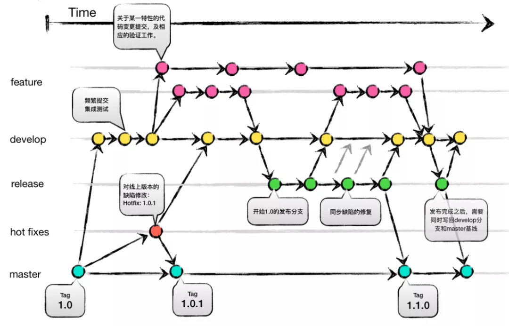
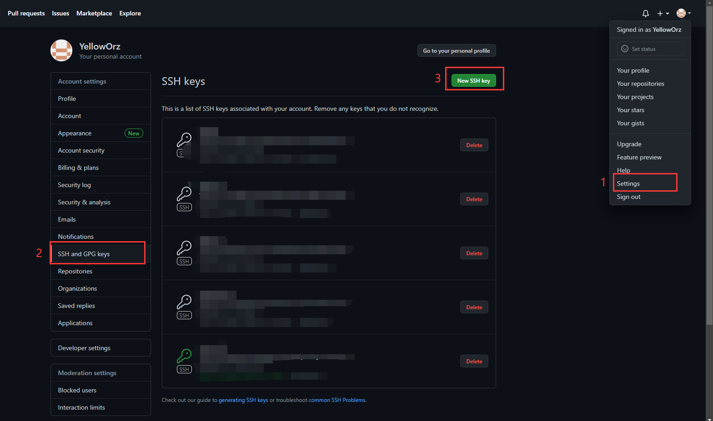
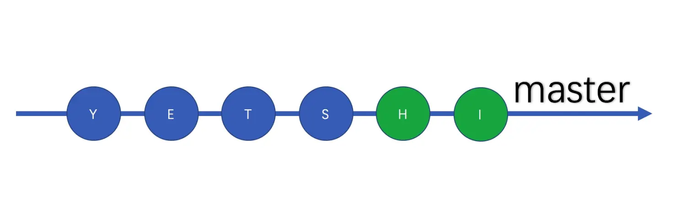
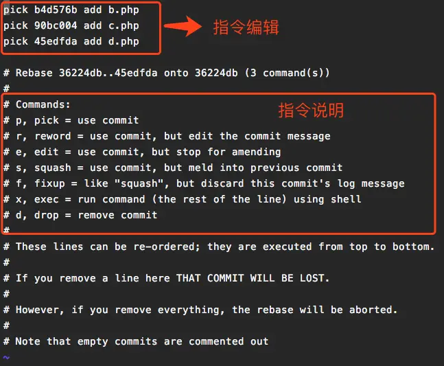
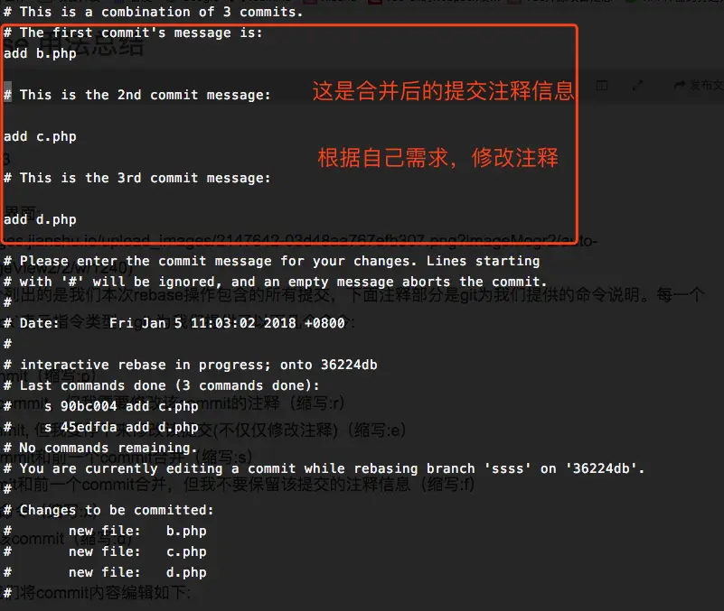

[TOC]


> 来源：[Git教程- 廖雪峰的官方网站](https://www.liaoxuefeng.com/wiki/896043488029600)
>
> 其他学习资料：[LearnGitBranching](https://learngitbranching.js.org/?demo=&locale=zh_CN)

# 概念

- **工作区**（Working Directory）：就是整个文件夹，比如本文件所在文件夹`My-Learning-Notes`就是工作区

- **版本库**（Repository）：工作区下的隐藏目录`.git`。里面存了

    - 暂存区（stage、index）
    - `master`（Git为我们自动创建的第一个分支）
    - 指针`HEAD`（指向`master`）

    
    
- **分支**（Branch）：本质是指针

    

- **冲突**（Conflict）：产生原因为被合并的两个分支修改了同一个地方，Git会用`<<<<<<<`，`=======`，`>>>>>>>`标记出不同分支的内容

# 基础操作

- `git init`：**初始化**本地文件夹变成Git可以管理的仓库。会创建一个隐藏文件夹`.git`

- `git add <file>`：把文件**添加到版本库**，把文件修改添加到暂存区。前提：必须初始化。

    ```shell
    # 添加指定文件
    $ git add readme.txt test.cpp
    # 添加当前目录下的所有文件
    $ git add .
    ```

- `git commit  -m <message>`：把文件**提交到仓库**，是把暂存区的所有内容提交到当前分支，所以只提交`add`过的文件修改。参数`-m`后面输入的是本次提交的说明，最好必须有。

    ```shell
    $ git commit -m "wrote a readme file"
    [master (root-commit) eaadf4e] wrote a readme file
     1 file changed, 2 insertions(+)
     create mode 100644 readme.txt
    # 命令返回内容的意思——1 file changed：1个文件被改动；2 insertions：插入了两行内容
    ```

> 可以多次`add`不同的文件，然后`commit`一次

# 时光机穿梭

- `git status`：查看**仓库**当前的**状态**。比如

    ```shell
    $ git status
    On branch master
    Changes not staged for commit:
      (use "git add <file>..." to update what will be committed)
      (use "git checkout -- <file>..." to discard changes in working directory)
    
    	modified:   readme.txt
    
    no changes added to commit (use "git add" and/or "git commit -a")
    ```

- `git diff <file>`：查看**文件变动**情况。只能查看文本。

- `git log`：查看所有的提交**日志**（最近到最远）。参数`--pretty=oneline`可以简略显示

    ```shell
    $ git log --pretty=oneline
    # 版本号（即commit id） 					（HEAD表示当前版本） commit内容
    1094adb7b9b3807259d8cb349e7df1d4d6477073 (HEAD -> master) append GPL
    e475afc93c209a690c39c13a46716e8fa000c366 add distributed	
    eaadf4e385e865d25c48e7ca9c8395c3f7dfaef0 wrote a readme file
    ```

    上一个版本为`HEAD^`，上上个版本为`HEAD^^`，往上100个版本为`HEAD~100`

- `git checkout <file>`：**撤销**文件在**工作区**的修改（包括删除），相当于是手动把文件修改过的地方改回去。

- `git reset`：[**退回**之前的版本](https://www.yiibai.com/git/git_reset.html)，所有的内容也就变成之前的了。退回的速度很快，因为是通过**指针操作**的。

    - `git reset [file/folder]`：从暂存区撤销指定文件/文件夹的修改，重新放回工作区

    - `git reset [--soft/mixed/hard] [<commit>]`：==撤销提交==。

        - 使用参数`--soft`退回之后，处于`add`**后**`commit`**之前**的状态，即位于暂存区；
        - 使用参数`--mixed`退回之后，处于**修改之后**`add`**之前**的状态；
        - 使用参数`--hard`退回之后，处于**修改之前**的状态。
        
        ==注意==：不要撤销已经推送（push）到远程的提交，否则将无法再次正常推送！

    ```shell
    
    $ git reset --hard HEAD^
    HEAD is now at e475afc add distributed
    # 也可以通过commit id找回。没必要写全，能保证唯一的前几位就够了。
    $ git reset --hard 1094a
    HEAD is now at 83b0afe append GPL
    ```

    如果退回之前的版本后，还想回来，必须用`<commit id>`，不能用`HEAD`了

- `git reflog`：查看命令**历史**

- `git reset HEAD <file>`：**撤销暂存区**的修改，重新放回工作区。然后可以再执行一遍`git checkout -- <file>`撤销文件在工作区的修改

- `git rm <file>`：从**版本库**中**删除**文件，即已经被`add`过的文件。一般是在命令`rm <file>`后面执行，或者不执行命令`rm <file>`而是添加参数`-f`强制删除

    > 如果不小心用`rm <file>`误删文件了，可以用命令`git checkout -- <file>`恢复

# 远程仓库

- `git remote add origin <url>`：将本地已有仓库与远程仓库**关联**。`origin`是Git对远程仓库的默认叫法，可以修改

    > 如果要将连接方式从https改成ssh，可重新运行这个代码
    
- `git remote -v`：显示需要读写远程仓库使用的 Git 保存的简写与其对应的 URL

- `git remote remove origin`：==取消本地目录下关联的远程库==

- `git push -u origin master`：把本地库的所有内容**推送**到远程库。推送之前必须将SSH Key公钥添加到Github账户的列表里面。参数`-u`在第一次推送成功后将本地和远程的`master`分支关联，可以**化简**以后的push和pull的命令

- `git fetch <remote>`：从远程仓库中获得数据

# 分支管理

- `git branch`：**列出所有分支**，当前分支前会有`*`

- `git branch <name>`：**创建分支**

- `git switch <name>` or ~~`git checkout <name>`~~ ：**切换分支**

- `git switch -c <name>` or ~~`git checkout -b <name>`~~：**创建+切换分支**

- `git merge <name>`：**合并指定分支到当前分支**。默认使用`Fast forward`模式，但删除分支后会丢掉分支信息，即合并后看不出来曾经做过合并。可以使用参数`--no-ff`禁用`Fast forward`，使用普通模式

- `git branch -d <name>`：**删除指定分支**

- **解决冲突**：把Git合并失败的文件手动编辑后再`add`和`commit`，可以使用merge tool，比如meld

    ```shell
    $ sudo apt install meld # 安装 meld
    $ git config --global merge.tool meld # 配置 meld 为全局 merge tool
    $ git mergetool # 使用 merge tool 解决冲突
    ```
    
- `git log --graph`：**查看分支合并图**。

- **分之策略**：

    

- `git stash`：将工作空间中未提交的修改**储藏**至栈，等以后恢复现场后继续工作

- `git stash push -m "message"`：储藏修改，并加上备注信息

- `git stash list：`查看栈中的储藏列表

    ```shell
    $ git stash list
    stash@{0}: WIP on dev: f52c633 add merge
    #stash@{0}就是下面用到的<stash>
    ```

    

- `git stash show [<stash>]`：查看一个储藏的详情

- `git stash apply [<stash>]`：恢复一个储藏，但是不会自动删除

- `git stash drop [<stash>]：`从栈中移除一个储藏

- `git stash pop [<stash>]`：从栈中取出储藏（apply + drop）

- `git stash clear：`清空栈中的全部储藏

- 

 # 技巧

## 电脑上Github与Gitlab账号共存

- 分别使用两个账号的邮箱去[生成ssh key](https://docs.github.com/en/free-pro-team@latest/github/authenticating-to-github/generating-a-new-ssh-key-and-adding-it-to-the-ssh-agent)。先生成的要**重命名**，以免后面的把它覆盖了

```shell
# your.email@example.com是账号所用的邮箱。-f 为文件路径
$ ssh-keygen -t rsa -C "your.email@example.com" -f file_path
# 。。。这里省略一些操作。操作完后效果如下
$ ll ~/.ssh/
总用量 28
drwx------  2 orz orz 4096 8月  10 14:22 ./
drwxr-xr-x 43 orz orz 4096 8月  10 14:29 ../
-rw-------  1 orz orz 1675 7月   1 11:11 id_rsa_github
-rw-r--r--  1 orz orz  405 7月   1 11:11 id_rsa_github.pub
-rw-------  1 orz orz 3247 8月  10 14:22 id_rsa_gitlab
-rw-r--r--  1 orz orz  743 8月  10 14:22 id_rsa_gitlab.pub
-rw-r--r--  1 orz orz 1994 8月  10 14:14 known_hosts
```

- 到两个账号的后台设置里面，将公钥（.pub结尾）的内容添加到设置里面

    

- 将其中一个常用的账号设置为全局的，另一个只在特定项目中设置

    ```shell
    # 比如将github账号设置成全局的，在任意路径下操作
    $ git config --global user.name "YellowOrz"
    $ git config --global user.email "your.email@example.com"
    
    # 将gitlab账号只在特定项目中使用，需要进入项目文件夹，比如项目“test”
    $ cd ~/Desktop/test
    $ git config user.name "user1"
    $ git config user.email "your.email1@example.com"
    $ cat .git/config
    [core]
    	repositoryformatversion = 0
    	filemode = true
    	bare = false
    	logallrefupdates = true
    [remote "origin"]
    	url = gitlab@hostname.com:user/test.git
    	fetch = +refs/heads/*:refs/remotes/origin/*
    [branch "master"]
    	remote = origin
    	merge = refs/heads/master
    [user]
    	name = user1
    	email = hostname
    ```

- 在`/etc/ssh/ssh_config`或者`~/.ssh/config`后添加如下内容，从而针对不同的git网站使用不同的ssh key：

    ```shell
    # 注意：User不能乱改，是固定的。主要是看git clone的链接中@前面的字符
    Host github.com
     hostname github.com
     User git 
     IdentityFile /home/orz/.ssh/id_rsa_github
    
    Host hostname.com
     hostname hostname.com
     User gitlab
     IdentityFile /home/orz/.ssh/id_rsa_gitlab
    ```

- 测试：

    ```bash
    $ ssh -T git@github.com
    Hi YellowOrz! You've successfully authenticated, but GitHub does not provide shell access.
    $ ssh -T gitlab@hostname.com
    Welcome to GitLab, user1!
    ```

> 参考资料：[[Git技巧]两个Git帐号如何在一台电脑上共存](https://mp.weixin.qq.com/s?__biz=MzI3NTE2NjYxNw==&mid=2650600198&idx=1&sn=4b1a910e5461653ca6963fac9c460bbe&scene=21)、[gitlab和github共存](https://www.jianshu.com/p/6325e9929232)


## 一个项目与多个远程仓库关联

比如一个项目已经与Github上的远程仓库相关联了，但是还想跟GitLab上的一个远程仓库相关联。推荐使用ssh的方式连接，前提是需要将key添加到github/gitlab的设置里面

- 目前状态如下：

    ```shell
    $ git remote -v
    origin	git@github.com:YellowOrz/Practice.git (fetch)
    origin	git@github.com:YellowOrz/Practice.git (push)
    ```

    注意：如果想用**ssh的方法**关联多个远程仓库，需要先完成这一步：[电脑上Github与Gitlab账号共存](# 电脑上Github与Gitlab账号共存 )

- 方法一：使用`git remote add`在添加一个远程仓库

    ```shell
    # 语法：git remote add [<选项>] <名称> <地址>
    # “gitlab”可以任意，后面为Gitlab远程仓库的地址
    $ git remote add gitlab gitlab@hostname.com:PointCloudFeature.git
    
    # 再查看状态，可以看到有两个远程仓库了。缺点是要push两次
    $ git remote -v
    gitlab	gitlab@hostname.com:PointCloudFeature.git (fetch)
    gitlab	gitlab@hostname.com:PointCloudFeature.git (push)
    origin	git@github.com:YellowOrz/Practice.git (fetch)
    origin	git@github.com:YellowOrz/Practice.git (push)
    
    # 缺点是要分开push，也就是push两次
    $ git push origin master
    $ git push gitlab master
    ```

> ==好像不能设置使用不同的用户名&邮箱==
>
> 参考资料：[一个项目push到多个远程Git仓库](https://segmentfault.com/a/1190000011294144)

  

## git clone命令的非标准SSH端口连接

```shell
git clone ssh://git@主机名:端口号/用户名/仓库名.git
```

**例**：要使用自己搭建的Gitlab服务，本地服务器的22号端口与阿里云（地址为`hostname.com`，也可以为IP地址）的2333号端口绑定，且GItlab中的账号为user1，仓库名称为test，则clone命令为

```shell
git clone ssh://git@hostname.com:2333/user1/test.git
```

## 同步远程仓库的有所分支

```shell
git branch -r | grep -v '\->' | while read remote; do git branch --track "${remote#origin/}" "$remote"; done
git fetch --all
git pull --all
```

## 分支合并

**假设将devel合并到master**

- 方法一（不推荐）：`git merge`，这样会导致devel提交的所有commit都会跟着master走，会**让master很冗余**

    ```bash
    git checkout master
    git merger devel
    ```

    

    

- 方法二（不推荐）：`git merge --squash`，然后让你重新提交commit，类似先git merge然后reset soft，但是这样会导致devel所有的commit记录全没了，而且**新提交的commit信息是操作者而不是原作者**

    ```bash
    git checkout master
    git merger --squash devel
    git commit -m "xxxx"
    ```

- ==方法三（推荐）==：`git reset -i HEAD~n`，可以完整保留devel分支，而且master上新的commit信息是原作者

    ```bash
    git checkout master
    git merger devel
    git rebase -i HEAD~n # n为devel分支上多的commit数量
    ```

    输入上面命令后会出现如下界面（如果设置git使用nano编辑器），除了第一个pick之外所有pick改成s或者（squash），然后保存退出

    

    然后又会进入第二次编辑界面，将commit信息改成最终想要的即可（注释会被自动忽略）

    
