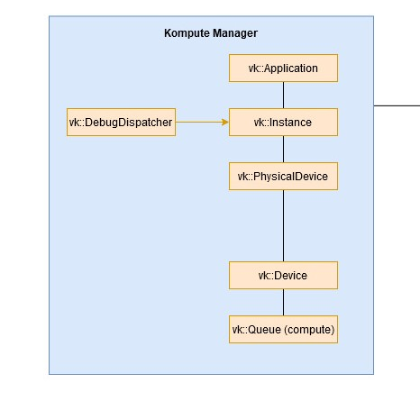
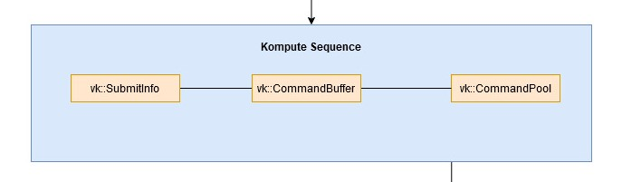
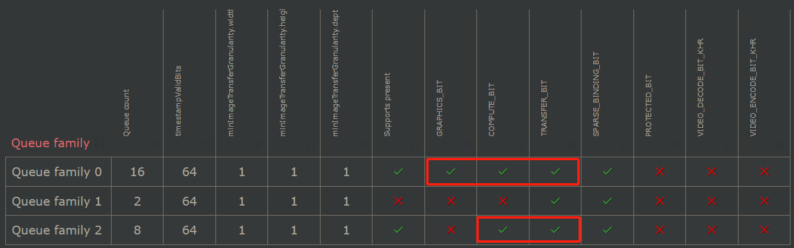
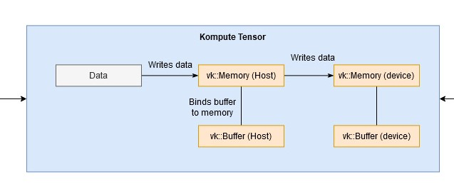
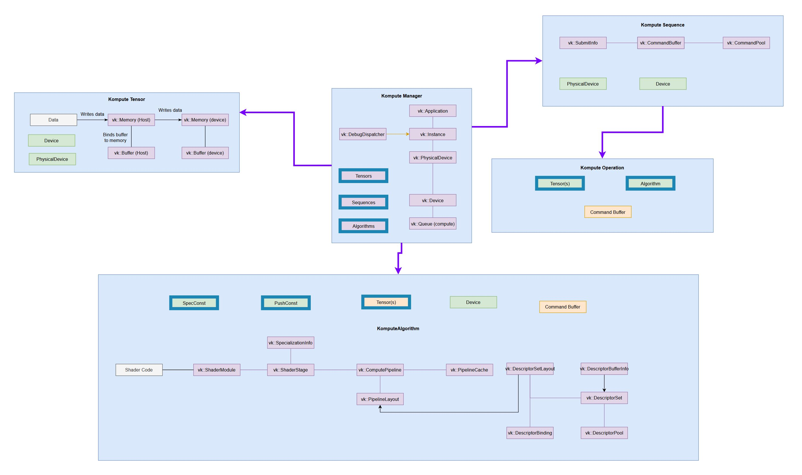

## 数据结构

> [Class Documentation and C++ Reference — Kompute Documentation (Python & C++)](https://kompute.cc/overview/reference.html#)

### kp::Manager



- 初始化时，可以设置physical device id + family queue id + extension，或者vk::Instance + vk::PhysicalDevice + vk::Device

    ```c++
    uint32_t deviceIndex(0);
    std::vector<uint32_t> familyIndices = {0, 2};
    std::vector<string> desiredExtensions = {"VK_EXT_shader_atomic_float"};
    kp::Manager mgr(deviceIndex, familyIndices, desiredExtensions);
    ```
    
- 通过`kp::Manager`创建的各种资源被`kp::Manager`托管（包括destory）

    - 以shared_ptr创建时，但是以weak_ptr存储在`kp::Manager`内部
    - 析构函数中，会将资源的weak_ptr转成shared_ptr，然后调用资源的destroy()

    ```c++
    std::shared_ptr<Sequence> sequence(uint32_t queueIndex = 0, uint32_t totalTimestamps = 0);
    
    template<typename T>
    std::shared_ptr<TensorT<T>> tensorT(const std::vector<T> &data, Tensor::TensorTypes tensorType = Tensor::TensorTypes::eDevice);
    
    template<typename S = float, typename P = float>
    std::shared_ptr<Algorithm> algorithm(const std::vector<std::shared_ptr<Tensor>> &tensors, const std::vector<uint32_t> &spirv, const Workgroup &workgroup, const std::vector<S> &specializationConstants, const std::vector<P> &pushConstants)
    ```

    

### kp::Sequence



- 构造函数需要输入vulkan变量

    ```c++
    Sequence::Sequence(std::shared_ptr<vk::PhysicalDevice> physicalDevice, std::shared_ptr<vk::Device> device, std::shared_ptr<vk::Queue> computeQueue, uint32_t queueIndex, uint32_t totalTimestamps = 0);
    ```
    
- 获取Sequence

    ```c++
// 如果在创建Manager的时候指定了多个familyIndices
    sqOne = mgr.sequence(0);
    sqTwo = mgr.sequence(1);
    ```

- record()：将operation以batch的方式添加到GPU queue。

    - `rerecord`会清理command buffer，然后就可以重新record。适用于`kp::Tensors`或者`kp::Algorithms`被修改后使用

    ```c++
    std::shared_ptr<Sequence> record(std::shared_ptr<OpBase> op);
    
    template<typename T, typename ...TArgs>
    std::shared_ptr<Sequence> record(std::vector<std::shared_ptr<Memory>> memObjects, TArgs&&... params)
    
    template<typename T, typename ...TArgs>
    std::shared_ptr<Sequence> record(std::shared_ptr<Algorithm> algorithm, TArgs&&... params);
    ```
    
- record()支持的opreation有

    - `kp::OpTensorSyncDevice` / `kp::OpTensorSyncLocal`：同步一个或多个tensor到GPU or CPU 

        ```c++
        mgr.sequence()->record<kp::OpTensorSyncDevice>({ tensor });
        ```

    - `kp::OpSyncDevice` / `kp::OpTensorSyncLocal`：同步`kp::Memory`（可以包含tensor、image等）到GPU or CPU

        ```c++
        const std::vector<std::shared_ptr<kp::Memory>> params = {tensorArray, tensorNum, tensorSum };
        mgr.sequence()->record<kp::OpSyncDevice>(params);
        ```

    - `kp::OpAlgoDispatch`：负责在 GPU 上调度并执行指定的算法、添加push_constant等

        ```c++
        mgr.sequence()->record<kp::OpAlgoDispatch>(algo, std::vector<float>{ 0.1, 0.2, 0.3 });
        ```

        - 允许对[`kp::OpAlgoDispatch`进行继承](https://kompute.cc/overview/advanced-examples.html#your-custom-kompute-operation)得到自定义的类`OpMyCustom`

- eval：用于提交record记录的操作到GPU并执行

    - `eval()`：是同步版本，带有barrier，等价于`evalAsync()`+`evalAwait()`

        ```c++
        std::shared_ptr<Sequence> eval();
        // 以下接口等价于先调用record或者new，然后再调用eval
        std::shared_ptr<Sequence> eval(std::shared_ptr<OpBase> op);
        template<typename T, typename... TArgs>
        std::shared_ptr<Sequence> eval(std::vector<std::shared_ptr<Memory>> memObjects, TArgs&&... params);
        template<typename T, typename... TArgs>
        std::shared_ptr<Sequence> eval(std::shared_ptr<Algorithm> algorithm, TArgs&&... params);
        ```

    - `evalAsync()`：是异步版本，必须手动调用`evalAwait()`以保证sequence正确结束

        - 需要注意GPU对intra-family parallelization和inter-family parallelization的支持情况
            - 比如[1650](https://vulkan.gpuinfo.org/displayreport.php?id=9700#queuefamilies)不支持前者，只支持后者，意味着提交到同一个family内的不同queue，也还会同步执行
            
                
            
                ```c++
                kp::Manager mgr(0, {0, 2});
                sqOne = mgr.sequence(0);
                sqTwo = mgr.sequence(1);
                
                sqOne->evalAsync<kp::OpAlgoDispatch>(algo);
                sqTwo->evalAsync<kp::OpAlgoDispatch>(algo);
                // Here we can do other work
                sqOne.evalOpAwait();
                sqTwo.evalOpAwait();
                // 然后可以用同步的方式把数据从GPU拷贝到CPU
                mgr.sequence()->eval<kp::OpTensorSyncLocal>({ tensorA, tensorB });
                ```

    - `evalAwait()`：等待fence，然后调用`postEval()`

        ```c++
        std::shared_ptr<Sequence> evalAwait(uint64_t waitFor = UINT64_MAX);
        ```

### kp::Tensor



- 每个tensor都会有各自的Vulkan memory和buffer

- `kp::Tensor`的子类是`kp::TensorT<T>`

- `rebuild`：用新数据重新初始化memory和buffer

    ```c++
    void rebuild(void *data, uint32_t elementTotalCount, uint32_t elementMemorySize);
    ```

    

### kp::Algorithm

- 从kp::Manager::algorithm初始化

    ```c++
    std::shared_ptr<Algorithm> algorithm(
        const std::vector<std::shared_ptr<Memory>>& memObjects = {},
        const std::vector<uint32_t>& spirv = {},
        const Workgroup& workgroup = {},
        const std::vector<float>& specializationConstants = {},
        const std::vector<float>& pushConstants = {});
    ```


## 内存管理

> [Memory Management Principles — Kompute Documentation (Python & C++)](https://kompute.cc/overview/memory-management.html)

- 原则（？）

    - Memory management是可选的，只有在资源由Kompute创建时才有效
    - Memory management ownership architecture是非循环的，只有一个top manager
    - Operations不管理任何GPU内存或资源
    - Top level manager是GPU资源的主要所有者，并在销毁时删除所有资源
    - Manager持有weak_ptr以确保如果在外部创建的对象被销毁，它就会被释放
    - 资源只有在没有被破坏的情况下才能重建，否则无法重新创建

- Kompute遵循BYOV原则(Bring your own VulkanSDK)，可以和与现有的支持Vulkan SDK的应用程序一起使用

    - 可以用现有的Vulkan SDK资源初始化Kompute组件，例如

        ```c++
        Manager::Manager(std::shared_ptr<vk::Instance> instance,
                    std::shared_ptr<vk::PhysicalDevice> physicalDevice,
                    std::shared_ptr<vk::Device> device);
        ```

- Kompute中各组件的关系图：紫色箭头表示GPU内存管理

    

## Compute Shader

- 在Kompute中使用Compute Shader：

    - 方法一：调用glslangValidator编译成.spv，然后读取。

        ```c++
        static std::vector<uint32_t> compileSource(const std::string& source) {
            std::ofstream fileOut("tmp_kp_shader.comp");
            fileOut << source;
            fileOut.close();
            if (system(std::string("glslangValidator -V tmp_kp_shader.comp -o tmp_kp_shader.comp.spv").c_str()))
                throw std::runtime_error("Error running glslangValidator command");
            std::ifstream fileStream("tmp_kp_shader.comp.spv", std::ios::binary);
            std::vector<char> buffer;
            buffer.insert(buffer.begin(), std::istreambuf_iterator<char>(fileStream), {});
            return {(uint32_t*)buffer.data(), (uint32_t*)(buffer.data() + buffer.size())};
        }
        ```

    - 方法二：使用[scripts/convert_shaders.py](https://github.com/KomputeProject/kompute/blob/master/scripts/convert_shaders.py)转换成.hpp，然后读取

        - py脚本的使用方法如下

            ```
            Usage: convert_shaders.py [OPTIONS]
              CLI function for shader generation
            Options:
              -p, --shader-path TEXT    The path for the directory to build and convert shaders  [required]
              -s, --shader-binary TEXT  The path for the directory to build and convert shaders  [required]
              -c, --header-path TEXT    The (optional) output file for the cpp header files
              -v, --verbose             Enable verbosity if flag is provided 
              --help                    Show this message and exit.
            ```

        - 可以通过cmake调用脚本

            ```cmake
            vulkan_compile_shader(INFILE my_shader.comp
                                  OUTFILE my_shader.hpp
                                  NAMESPACE "shader"
                                  RELATIVE_PATH "${kompute_SOURCE_DIR}/cmake")
            ```

            

## 自定义

> [Extending Kompute with Custom C++ Operations — Kompute Documentation (Python & C++)](https://kompute.cc/overview/custom-operations.html)

- 所有其他operation都会继承的顶层operation是`kp::OpBase`

    | Function                        | Description                                                  |
    | :------------------------------ | :----------------------------------------------------------- |
    | OpBase(…, tensors, freeTensors) | 构造函数，可以加载/定义资源，例如着色器等。                  |
    | ~OpBase()                       | 析构函数，释放GPU资源（如果拥有），这些资源应用于管理 operation创建的任何内存分配。 |
    | init()                          | record阶段中，被Sequence / Manager调用。此函数允许在操作中初始化相关对象。 |
    | record()                        | record阶段中，在init()之后被Sequence / Manager调用。在这个函数中的内容直接记录到vk::CommandBuffer。 |
    | preEval()                       | 在Sequence::evalAsync()中，preEval()在提交command到GPU之前被调用。可用于例如，将数据从CPU复制到GPU。 |
    | postEval()                      | 在Sequence::evalAwait()的最后调用postEval()，用来收尾（如释放临时资源、数据回读、状态重置等）。所以异步操作中必须调用evalAwait() |

- 继承`kp::OpAlgoDispatch`从而创建自己的包含自定义着色器逻辑的操作（即需要计算管道、描述符集等）
