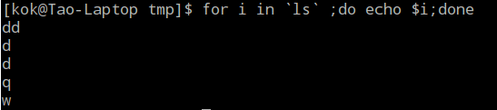

## 获取指定目录下子目录的路径

```shell
# 相对路径，所有子目录
#递归			筛选出目录  删除最后的冒号
ls -R ./ | grep / | sed 's/://g'
# 当前子目录的最大深度以及最深路径
find ./ -type d | awk -F'/' '{print NF-1" "$0}' | sort | tail -1
```

> [得到当前目录的最大深度以及最深路径](https://blog.csdn.net/topgun_chenlingyun/article/details/8152046)

## 从路径中提取文件名or目录

> 参考：[Linux shell 之 提取文件名和目录名的一些方法](https://blog.csdn.net/ljianhui/article/details/43128465)

- 方法一：`basename`和`dirname`

  ```shell
  $ dir=/home/xzf/Projects/temp.txt
  # 从文件路径中提取文件名（带后缀）
  $ echo $(basename $dir)
  temp.txt
  # 从文件路径中提取文件名（不带后缀）
  $ echo $(basename $dir .txt)
  temp
  # 从（文件or文件夹的）路径中提取目录
  $ echo $(dirname $dir)
  /home/xzf/Projects
  $ echo $(dirname $(dirname $dir))
  /home/xzf
  ```

- 方法二：使用`#`和`%`

  ```shell
  $ dir=/home/xzf/Projects/temp.txt
  # 从文件路径中提取文件名（带后缀）
  $ echo ${dir##*/}
  temp.txt
  # 从（文件or文件夹的）路径中提取目录
  $ echo ${dir%/*}
  /home/xzf/Projects
  # 提取文件后缀
  $ echo ${dir##*.}
  txt
  # 更改文件后缀
  $ echo ${dir%.*}".md"
  /home/xzf/Projects/temp.md
  ```

> \#：表示从左边算起第一个
> %：表示从右边算起第一个
> \##：表示从左边算起最后一个
> %%：表示从右边算起最后一个
> *：表示要删除的内容
> ​	对于#和##的情况，它位于指定的字符（例子中的'/'和'.'）的左边，表于删除指定字符及其左边的内容；
> ​	对于%和%%的情况，它位于指定的字符（例子中的'/'和'.'）的右边，表示删除指定字符及其右边的内容。
> ​	**不能把\*号放在#或##的右边，反之亦然。**

## du统计文件大小并排序

```shell
# 从大到小排
du -sh * |grep G|sort -nr
```

## for循环遍历目录&文件的空格问题

使用类似`for i in $(find ./ -tyep d)`的命令时，是用空格来划分列表中的每个值，因此如果路径中存在空格，遍历得到的结果将不对，例如下图

在for循环前面加上下面一句即可

```shell
IFS=$(echo -en "\n\b")
```

## 获取第n行

比如获取第3行

```shell
cat test.txt|sed -n '3p'
```

