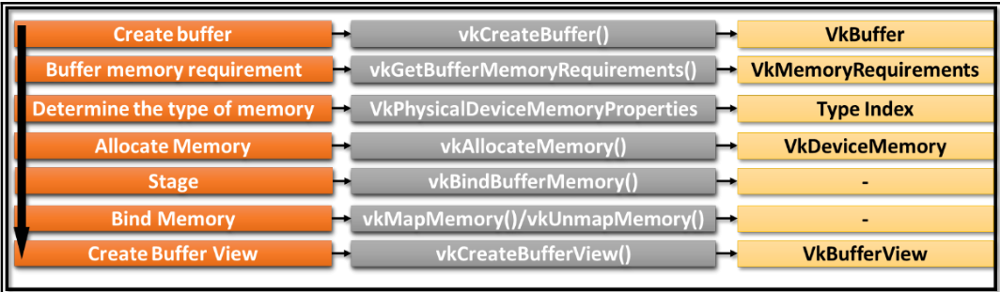

# 《Vulkan学习指南》

>《Learning Vulkan》

## 第1章 开始学习新一代3D图形API

### 1.3 重要术语
- physical device (物理设备): 各品牌型号的独显、集显等支持vulkan的硬件设备
- device (设备): 物理设备在应用程序中的逻辑表示。一个物理设备对应一个设备？
- queue (队列): 执行引擎与应用程序之间的接口。一个物理设备包含一个或多个队列。队列负责收集准备执行的工作（指令缓存）并分发到物理设备执行
- queue Family (队列族): 一组具有相同属性和能力的队列。一个队列族负责图形渲染、计算、数据传输、内存管理等操作中的一种。
- memory type (内存类型): 分为宿主内存和设备内存
- command (指令): 执行用户定义的行为。或者叫做命令
    - action command (动作指令): 包含绘制图源、清除表面、复制缓存、查询时间戳操作、以及子通道的开始和结束操作。用于修改帧缓存附件、读取或写入内存（缓存或者图像）以及写入查询池？
    - set state command (状态设计指令): 用来绑定流水线、描述符集合、缓存，或者设置 动态状态、渲染通道、子通道的状态
    - synchronization command (同步指令): 通过设置同步事件、等待事件、流水线屏障对象、渲染通道、子通道的依赖，来保证多个动作指令的同步
- command buffer (指令缓存): 一组指令的集合，记录多个指令并统一发送到队列中

### 1.4 vulkan的原理
- （简化的）执行模型：vulkan程序控制一组vulkan设备，将多个command记录到 多个command buffer 中，并发送到多个queue。设备的驱动会读取queue并按照记录的顺序依次执行各个command
  
    
    
    - 指令队列的构件需要代价 而一旦构建完成就可以 被缓存 和 发送到队列，根据自己的需要多次执行
    - 有些指令缓存支持以多线程的方式并行构建
    - vulkan程序还负责：各种准备（资源、着色器、流水线）、内存管理、同步、风险管理
    
- **queue（队列）**: 一种中间层机制，负责接收指令缓存并传递给设备。指令缓存的发送分成两类
  
    - 单一对列：按照指令缓存发送的顺序进行维护、执行或者回放
    - 多重队列：指令缓存 以并行的方式在多个队列中执行。除非有同步操作，否则无法保证发送和执行的顺序不变
    
- 同步
  
    - **semaphore (信号量)**: 跨队列，或在单一队列中以粗粒度执行？
    - **event (事件)**: 单个队列中，以细粒度执行，确保单一指令缓存中或多个指令缓存之间的同步要求
    - **fence (栅栏)**: 允许host和device之间同步
    - **pipeline barrier (流水线屏障)**: 插入command buffer中的指令，保证它之前的指令先执行，它之后的后执行
    
- vulkan对象：vulkan程序中的device、queue、command buffer、pipeline等对象，分为两类
    - 可分发的句柄：~~这类指针指向不透明的内部图形实体。不能直接访问成员，要通过API函数访问。~~
        - 包含vk::instance、vk::CommandBuffer、vk::PhysicalDevice、vk::Device、vk::Queue
    - 非可分发的句柄：这些64位整型类型的句柄不指向结构体，而是直接包含对象自身的信息
        - 包含vk::Pipeline、vk::PipelineCache、vk::PipelineLayout、vk::Buffer、vk::DeviceMemory、vk::QueryPool、vk::ShaderModule、vk::DescriptorPool、vk::DescriptorSet、vk::DescriptorSetLayout、vk::CommandPool、vk::Semaphore、vk::Fence、vk::Event等
    
- **指令语法**
    - 创建&&销毁：需要创建的对象使用`vk::Device::createXXX()`实现，需要一个结构体`vk::XXXCreateInfo`作为输入；销毁该对象则使用对应的`vk::Dvice::destoryXXX()`
        - 比如创建buffer，使用`vk::Device::createBuffer()`，输入为`vk::BufferCreateInfo`，销毁则使用`vk::Dvice::destoryBuffer()`
        - 包含：Instance、DeviceQueue、Device、CommandPool、DescriptorPool、DescriptorSetLayout、PipelineLayout、ShaderModule、PipelineShaderStage、ComputePipeline、Buffer 等
    - 分配&&释放：从已有对象池or堆中创建（分配）使用`vk::Device::allocateXXX()`实现，需要一个结构体`vk::XXXAllocateInfo`作为输入；释放该对象则使用对应的`vk::Dvice:freeXXX()`
        - 比如分配Memory，使用`vk::Device::allocateMemory()`，输入为`vk::MemoryAllocateInfo`，释放则使用`vk::Dvice::freeMemory()`
        - 包含：Memory、CommandBuffer、DescriptorSet 等
    - 上述所有的实现方法都可以通过`vk::getXXX()`获取  ？？？
    - 将指令记录到指令缓存中，使用`vk::cmdXXX()`  ？？？   

### 1.5 理解vulkan应用程序


- 驱动：支持vulkan的系统至少包含一个CPU和一个GPU。GPU的生产者会为某个vulkan标准提供完整的驱动实现。驱动为vulkan程序提供了高级的功能接口，使其可以与设备通信。例如，驱动可以找到系统中所有可用的设备、可用的队列类型等
- 应用程序（vulkan程序）：用户编写的、可以调用vulkan API执行图形or计算工作的程序。首先，初始化硬件和软件，可以检测驱动并找到所有可用的vulkan API。然后，创建资源并绑定到着色器阶段，会用到descriptor。descriptor辅助将创建后的资源绑定到底层（基于某种图形or计算类型）的pipeline。最后，记录command buffer并发送到queue执行
- WSI (Windows System Integration)： 将不同操作系统的展示层（presentation layer）统一起来
- SPIV-R：将不同着色器代码语言（HLSL、GLSL）转成相同的、预编译的二进制数据格式
- LunarG SDK：包含加载器、验证层、跟踪回放工具、SPIR-V工具、运行库、文档、demo等工具资源的vulkan skd

### 1.6 开始学习Vulkan编程模型

- 应用程序编程模型：采用自顶向下的实现过程

    

- 硬件初始化：应用程序需要与loader（加载器）进行通信来激活vulkan的驱动。

    

    - loader（加载器）：一段应用程序启动时执行的代码，它使用平台 无关的方式来定位系统中的Vulkan驱动
        - 负责：①定位并加载驱动；②保证API与系统无关；③ 支持层次化的结构，并且可以在运行过程中随时注入不同类型的层（例如 开发阶段打开所有需要注入的层，发布的时候关闭它们）
    - 注入层的功能：① 跟踪vulkan API的指令执行② 捕获渲染的场景 稍后再继续执行 ③ 满足调试需要，进行错误处理和验证
    - 加载器完成后，就可以①创建实例②查询物理设备上所有可用队列 ③支持注入层

- 资源设置：
    - 内存分类
    ① device local：在device上只对device可见的内存
    ② device local, host visible：在device上，但对device和host都可见
    ③ host local, host visible：在host上，对device和host都可见，比device local慢
    - 【推荐】**子分配**：应用程序提前申请一大块物理内存，然后将物理内存的很大一部分立即分配完成并存入不同的资源对象
    - sparse memory（稀疏内存）：将图像分割为多个小块 根据需求加载必需的，从而使得存储资源比实际的内存容量更大
    - staging buffer（阶段缓存）：应用程序先将资源设置到阶段缓存中，它对host是可见的，然后再传递到理想的存储区域（对host不可见）

- 流水线设置

     

     - **pipeline**：根据应用程序逻辑定义的一系列事件，照固定的顺序执行。包含设置着色器、资源的绑定以及状态管理

     - **descriptor set（描述符集）**：资源和着色器之间的接口。可以将着色器绑定到资源（例如image or buffer），也可以将资源内存关联或者绑定到准备使用的着色器实例上。它变化频繁，支持多线程同步更新，从**descriptor pool（描述符缓冲池）**分配而来

         - 更新或者改变描述符集是vulkan中关键的性能瓶颈之一。需要保证高频率更新的描述符 不会影响到低频率的描述符。

     - 基于SPIR-V的**shader（着色器）**：
         - 支持GLSL和HLSL等源语言转换成SPIR-V格式
         - shader的编译是离线的，不过预先就进行了注入
         - shader提供了多种不同的程序入口

     - **pipeline state（流水线状态）**：物理设备包含的一系列硬件设置，用来定义准备发送的几何输入数 据是如何解释和绘制的。

         - 包含光栅化状态、融混状态，以及深度/模板状态、输入 几何数据的图元拓扑类型（点/线/三角形）以及渲染所用的着色器
         - 流水线状态分为：动态状态和静态状态。<u>后者对于性能的优化来说至关重要。</u>
         - Vulkan允许用户使用**Pipeline（流水线）**与**Pipeline Cache（流水线缓存）**和**pipeline layout（流水线布局）**一起，来进行状态的控制
         - Pipeline Cache的实现由驱动完成

         > cache（缓存）和buffer（缓冲区）不同。cache是为了加快访问速度，buffer是为了减少响应次数

     - **pipeline layout（流水线布局）**：提供了pipeline中所用 的descriptor set，其中设置了各种不同的资源关联到着色器的不同方法。 不同的pipeline可以使用相同的pipeline layout。

     - 

- 指令的记录：

    

    - command（指令）的记录是逐渐构成指令缓存的过程
    - command buffer（指令缓存）是从command pool（指令池）当中分配而来的。command pool 可以用来同时分配多个command buffer
    - command buffer的创建是对性 能影响最大的一项操作
    - 也可以通过多线程的方式同步生 成多个command buffer。command pool 的设计确保了多线程环境下不会出现资源互锁的问题

- 队列的提交

    - Vulkan向应用程序暴露了不同类型的队列接口，例如图形、DMA/传 输，或者计算队列
    - 提交的工作通 过异步的方式执行
    - 多个command buffer可以被压送到独立、兼容的队列 里，从而实现并行的执行

## 第2章 你的第一个Vulkan伪代码程序

### 2.2 Hello World伪代码

- 初始化过程：包括validtion layer（验证层）属性的初始化，以及`vk::Instance`（实例对象）的构建，然后检查是否有可用物理设备（vk::PhysicalDeveice），接着通过实例对象创建一个对应的逻辑设备（vk::Device）

    

    

    - Vulkan通过错误信息和验证层提供了调试功能。这类功能扩展分成2类
        - 实例相关（Instance-specific）：全局级别。通过`vk::enumerateInstanceLayerProperties()`获取layer信息，通过`vk::enumerateInstanceExtensionProperties()`获取extension信息
        - 设备相关（Device-specific）：物理设备相关。**获取layer信息的API已经废弃**，通过vk::enumerate**Device**ExtensionProperties()获取extension信息

    ==初始化的示意代码==如下：

    ```c++
      /*** 1. Enumerate Instance Layer properties ***/
      vector<vk::LayerProperties> layper_property = vk::enumerateInstanceLayerProperties();
      for (auto &lp : layper_property)
        vector<vk::ExtensionProperties> extension_property =
            vk::enumerateInstanceExtensionProperties(vk::Optional<const std::string>(lp.layerName));
      /*** 2. Instance Creation ***/
      vk::ApplicationInfo app_info; // 可选
      app_info.setApiVersion(VK_API_VERSION_1_3);
      std::vector<const char *> layers = {"VK_LAYER_KHRONOS_validation"};
      vk::InstanceCreateInfo instance_info;
      instance_info.setPApplicationInfo(&app_info).setPEnabledLayerNames(layers); // 还可以设置ExtensionNames
      vk::Instance instance = vk::createInstance(instance_info);
      /*** 3. Enumerate physical devices ***/
      vector<vk::PhysicalDevice> devices = instance.enumeratePhysicalDevices();
      vk::PhysicalDevice phy_device = devices[0]; // 随便选一个
      cout << "[INFO] pick up physical deivce " << phy_device.getProperties().deviceName << endl;
      /*** 4. Create Device ***/
      vk::PhysicalDeviceMemoryProperties mem_properties = phy_device.getMemoryProperties();	// 物理设备中可用内存类型
      vk::PhysicalDeviceProperties phy_device_properties = phy_device.getProperties();	// 物理设备属性
      vector<vk::QueueFamilyProperties> queue_props = phy_device.getQueueFamilyProperties();	// 物理设备中的队列以及其属性
      vk::DeviceCreateInfo create_info = {};  // 必须要设置vk::DeviceQueueCreateInfo
      vk::Device device = phy_device.createDevice(create_info);
    ```

- 指令缓存初始化：首先创建command pool，然后分配command buffer

    > 代码见第5章

- 资源对象：分成buffer和image

    

    - buffer view：表示数据缓存自身。它可 以将数据用连续的方式保存起来，并设置一个特定的数据解析格式
    - image view: 类似buffer view
    - 应用程序中并不会直接访问vk::Buffer和vk::kImage对象，而是使用对应的视图对象（VkBufferView以及 VkImageView）来完成

- 资源分配：

    - 资源（缓存为VkBuffer，图像为VkImage）刚被创建 时，并没有关联任何的内存空间。
    - 内存需求：每种资源对象都有 自己的内存创建需求，可以通过vk::Device::getBufferMemoryRequirements()或 者vk::Device::GetImageMemoryRequirements()来进行查询。这个函数有助于计 算内存分配的大小
    - 分配：使用vk::Device::allocateMemory()
    - 绑定：将资源对象绑定到这个刚分配 的内存上，对应的函数为vk::Device::bindBufferMemory()或者 vk::Device::bindImageMemory()。
    - 内存映射：负责更新物理设备内存数据。首先， 使用函数vk::Device::mapMemory()将设备内存映射到宿主机内存。然后更新 映射内存区域（在宿主机上）的数据，最后调用vk::Device::unmapMemory() 函数。这个API函数会将映射内存区域的数据更新到设备内存中

- 着色器支持

    ```c++
    vector<char> source_code = ReadWholeFile(spv_path);
    vk::ShaderModuleCreateInfo module_info;
    module_info.setCodeSize(source_code.size()).setPCode((uint32_t *)source_code.data());
    vk::ShaderModule compute_module = device.createShaderModule(module_info);
    ```

- 构建descriptor set layout：

    - descriptor负责将资源与着色器通过布局绑定的方式关联起来
    - 一个descriptor set里可以包含多个布局绑定的descriptor，它相当于是数组的代码块
    - 一个descriptor set layout表示这个descriptor set所包含的信息的类型

    ```c++
    vector<vk::DescriptorSetLayoutBinding> binding(2);
    binding[0].setBinding(0).setDescriptorCount(1).setDescriptorType(vk::DescriptorType::eStorageBuffer)
        .setStageFlags(vk::ShaderStageFlagBits::eCompute);
    binding[1].setBinding(1).setDescriptorCount(1).setDescriptorType(vk::DescriptorType::eStorageBuffer)
        .setStageFlags(vk::ShaderStageFlagBits::eCompute);
    vk::DescriptorSetLayoutCreateInfo layout_info;
    layout_info.setBindings(binding);
    vk::DescriptorSetLayout descriptor_layout = device.createDescriptorSetLayout(layout_info);
    std::array<vk::DescriptorSetLayout, 2> layouts = {descriptor_layout}; // 这么写对吗？
    ```

- 构建pipeline layout：decriptor set被创建之后，还不能够直接被底层的流水线访问到。pipeline layout就是 让底层pipeline可以访问到 descriptor set 的信息

    > pipeline用到decriptor set layout，但不会用到decriptor set

    ```c++
    vk::PipelineLayoutCreateInfo pipe_layout_info;
    pipe_layout_info.setSetLayouts(descriptor_layout);  // 不能用layouts
    vk::PipelineLayout pipeline_layout = device.createPipelineLayout(pipe_layout_info);
    ```

- 创建流水线：流水线是一系列状态（state）的集合。每个状态都包括了一组属性（用来 定义状态的执行协议）。分成 Graphics pipeline和Compute pipeline

    - 定义状态：
        - Dynamic states（动态状态）：提示流水线在运行过程中观察状态的变 化情况。此时流水线会使用一个特殊的过程去更新各个状态量，而不 是直接使用初始值。使用结构体vk::PipelineDynamicStateCreateInfo设置
        - 还有顶点输入状态、光栅化状态、颜色融混附件状态、视口状态、深度模板状态、多重采样状态
    - **从流水线缓存 （vk::PipelineCache）中构建pipeline 对象来获得最大的性能**

    ```c++
    vk::PipelineCacheCreateInfo pipeline_cache_info;
    vk::PipelineCache pipeline_cache = device.createPipelineCache(pipeline_cache_info);
    vk::ComputePipelineCreateInfo pipeline_info;
    pipeline_info.setLayout(pipeline_layout).setStage(stage_info);
    auto result = device.createComputePipeline(pipeline_cache, pipeline_info); // pipeline cache可选
    if (result.result != vk::Result::eSuccess)
    	throw std::runtime_error("failed to create compute pipeline!");
    vk::Pipeline compute_pipeline = result.value;
    ```

-  队列的提交和同步:

    ```c++
    vk::FenceCreateInfo fence_info = {...};
    vk::Fence fence = device_.createFence(fence_info);
    vk::SubmitInfo submit_info;
    submit_info.setCommandBuffers(cmd_buffer);
    compute_queue.submit(submit_info);
    ```

### 2.3 全部整合到一起


## 第3章 连接硬件设备

### 3.1 学习使用LunarG SDK

- Installable Client Driver (ICD)：兼容vulkan的显示驱动。不同ICD（例如nvidia和intel的驱动）可以互不影响地共存；
- layer（层）：这是一种插件式的组件，可以捕捉或着拦截vulkan的指令，提供诸如调试、验证、跟踪等方面的服务功能
- loader（加载器）：定位显示驱动的位置，并通过 与平台无关的方式提供layer所用的库文件。在Windows上，加载库（vulkan-1.dll）使用注册表来定位ICD和layer的配置信息

### 3.3 扩展简介

- layer（层）：层会捕捉当前的Vulkan API并且将自己注入到 Vulkan指令的执行链中，使其与指定的层关联在一起。我们通常使用layer来进行开发过程当中的验证工作。例如，驱动程序不会检查Vulkan API 所传入的参数，所以我们可以通过层来完成输入参数的验证，判断它 们正确与否。 
- extension（扩展）：扩展提供了额外的功能或者特性，它可能未 来会成为标准的一部分，也可能不会。扩展也可以作为设备或实例的 一部分存在。扩展指令的链接无法通过静态的方式实现，我们需要首 先进行查询，然后动态地将它们链接为函数指针。

### 3.4 创建一个Vulkan实例

- 创建vulkan实例：

    ```c++
    vk::Instance createInstance(vk::InstanceCreateInfo const &createInfo,
                                vk::Optional<const vk::AllocationCallbacks> allocator = nullptr) const;
    ```

    - 实例的创建信息：vk::InstanceCreateInfo = VkInstanceCreateInfo

        ```
        InstanceCreateInfo(vk::InstanceCreateFlags flags_,
                           const vk::ApplicationInfo *pApplicationInfo_,
                           vk::ArrayProxyNoTemporaries<const char *const> const &pEnabledLayerNames_,
                           vk::ArrayProxyNoTemporaries<const char *const> const &pEnabledExtensionNames_ = {},
                           const void *pNext_ = nullptr)
        ```

    - 创建所需的application信息：

        ```c+=
        ApplicationInfo(const char *pApplicationName_ = {}, uint32_t applicationVersion_ = {},
                        const char *pEngineName_ = {}, uint32_t engineVersion_ = {},
                        uint32_t apiVersion_ = {}, const void *pNext_ = nullptr);
        ```

- 获取实例的

- 销毁实例：`vk::Instance::clear()` => 内部调用`vkDestroyInstance()`

> 可以直接显式地启用层，设置环境变量VK_INSTANCE_LAYERS=VK_LAYER_LUNARG_api_dump

### 3.5 理解物理设备和逻辑设备

- 枚举物理设备：

    ```c++
    std::vector<vk::PhysicalDevice> vk::Instance::enumeratePhysicalDevices();
    ```

- 查询物理设备的扩展：输入为 准备查询扩展的layer的名称

    ```c++
    std::vector<vk::ExtensionProperties> vk::PhysicalDevice::enumerateDeviceExtensionProperties(
        Optional<const std::string> layerName) const;
    ```

- 获取物理设备的属性：包含设备名称、类型等

    ```c++
    vk::PhysicalDeviceProperties vk::PhysicalDevice::getProperties() const;
    ```

- 获取物理设备的内存属性

    ```c++
    vk::PhysicalDeviceMemoryProperties vk::PhysicalDevice::getMemoryProperties() const;
    ```

    > PhysicalDeviceMemoryProperties见5.5节

- 获取物理设备支持的queue family：根据QueueFamilyProperties::queueFlags判断queue的类型，记录所需queue的id（int类型）

    ```c++
    std::vector<vk::QueueFamilyProperties> PhysicalDevice::getQueueFamilyProperties() const;
    ```

- 创建逻辑设备：DeviceCreateInfo包含扩展的名称（也有layer的名称，但是已经废弃，仅用于兼容）、需要创建和关联的队列

    ```c++
    vk::Device PhysicalDevice::createDevice( vk::DeviceCreateInfo const & createInfo, vk::Optional<const vk::AllocationCallbacks> allocator) const;
    ```

    - 逻辑设备的创建信息：主要设置QueueCreateInfos

        ```c++
        DeviceCreateInfo(vk::DeviceCreateFlags flags_ = {}, uint32_t queueCreateInfoCount_ = {},
                         const vk::DeviceQueueCreateInfo *pQueueCreateInfos_ = {}, uint32_t enabledLayerCount_ = {},
                         const char *const *ppEnabledLayerNames_ = {}, uint32_t enabledExtensionCount_ = {},
                         const char *const *ppEnabledExtensionNames_ = {},
                         const vk::PhysicalDeviceFeatures *pEnabledFeatures_ = {}, const void *pNext_ = nullptr);
        ```

    - 逻辑设备的queue创建信息：主要设置queueFamilyIndex和queueCount

        ```c++
        DeviceQueueCreateInfo(vk::DeviceQueueCreateFlags flags_ = {}, uint32_t queueFamilyIndex_ = {},
                uint32_t queueCount_ = {}, const float *pQueuePriorities_ = {}, const void *pNext_ = nullptr);
        ```

        > queueFamilyIndex是前面通过getQueueFamilyProperties找到的所需queue的id
        >
        > QueuePriorities表示优先级

- host端等待：等待所有队列进入空闲

    ```c++
    void Device::waitIdle()
    ```

> 如果physical device丢失，创建的device会失败；但是device丢失，某些指令会返回VK_ERROR_DEVICE_LOST，但是physical device不受影响，不会重置device

### 3.6 理解队列和队列族

- queue: 应用程序和物理设备之间的通信过程

    - 应用程序通过将cmd buffer提交到quere的方式来发布工作任务。
    - 物理设备读取queue中的任务，然后异步地处理

    

    - 物理设备中可能包括一个或者多个queue family，每个queue family所支持的queue类型各不相同、可能包含一个或者多个queue

- 查询queue family：根据QueueFamilyProperties::queueFlags判断queue的类型，记录所需queue的id（int类型）

    ```c++
    std::vector<vk::QueueFamilyProperties> PhysicalDevice::getQueueFamilyProperties() const;
    ```

    

    - 根据QueueFamilyProperties::queueFlags判断queue的类型，记录所需queue的id（int类型）

        ```c++
        int queue_indices_ = -1;
        for (int i = 0; i < queue_props.size(); i++) 
            if (queue_props[i].queueFlags & vk::QueueFlagBits::eCompute) {
                queue_indices_ = i;
                break;
            }
        ```

- 创建queue：提前创建device，创建的时候传入DeviceQueueCreateInfo（将3.5节）

    ```c++
    vk::Queue Device::getQueue( uint32_t queueFamilyIndex, uint32_t queueIndex ) const;
    ```

    > 一个queue family有多个queue，每个queue有唯一id。queueIndex设置queue family（对应queueFamilyIndex）中的queue id

## 第4章 调试Vulkan程序

### 4.1 初探Vulkan中的调试方法

- 开启调试功能：实例级添加扩展名`VK_EXT_DEBUG_REPORT_EXTENSION_NAME`

- Vulkan的调试API并不属于核心指令，不能通过loader直接静态加载。可以通过扩展API，在运行过程中通过动态链接的形式获取预定义的函数指针。使用如下调试功能扩展API函数创建和销毁调试报告

    ```c++
    vk::DebugReportCallbackEXT vk::Instance::createDebugReportCallbackEXT(vk::DebugReportCallbackCreateInfoEXT const &createInfo,vk::Optional<const vk::AllocationCallbacks> allocator ) const;
    void vk::DebugReportCallbackEXT::clean(); // 内部调用的vkDestroyDebugReportCallbackEXT
    ```

### 4.2 了解LunarG验证层及其特性

- VK_LAYER_GOOGLE_unique_objects：不可分发的Vulkan对象句柄并不需要自身是唯一的。驱动程序可能会为它认为等价的多个对象分配同一个句柄，导致跟踪对象变得困难。该层会将Vulkan创建的对象打包到一个统一的标识符中，当应用程序需要使用对象时再进行分包。这样的话，我们进行验证的时候就可以跟踪到正确的对象生命周期了。
    - LunarG官方推荐将该层放置在验证层的最后，这样它可以更为靠近显示驱动程序。
- VK_LAYER_LUNARG_api_dump：判断传入Vulkan API的参数值是否存在。会将所有的数据结构体参数及其值直接打印出来。
- VK_LAYER_LUNARG_core_validation：验证和打印描述符集合、流水线状态、动态状态等。可以跟踪和验证GPU内存、对象绑定，以及指令缓存。还负责验证图形流水线和计算流水线。
- VK_LAYER_LUNARG_image：验证纹理格式、渲染目标的格式等。例如，可以验证给定的格式是否可以被当前设备所支持。还可以验证图像视图的创建参数，对于这个视图对应的图像来说是否是合法的。
- VK_LAYER_LUNARG_object_tracker：负责跟踪对象的创建、使用和销毁过程，因此可以避免内存泄漏的问题。还可以验证被引用的对象是否已经创建，以及它是否当前有效
- VK_LAYER_LUNARG_parameter_validation：确保所有传递给API函数的参数都是正确的，负责检查参数值是否一致，并且判断它是否在Vulkan标准定义的可用范围之内。此外，还会检查Vulkan控制结构体中的类型参数，是否和标准中所指定的参数相符。
- VK_LAYER_LUNARG_swapchain：验证WSI交换链扩展的用法是否正确。例如，在使用WSI扩展的函数之前，检查WSI扩展是否可用。也可以验证传递给交换链的图像索引号是否在可用范围之内。
- VK_LAYER_GOOGLE_threading：判断线程环境的安全性。可以检查多线程API的使用，保证对象的同步调用过程是在多个不同的线程中发生的。会检查和汇报线程的违规操作，并且强制对相关的调用使用互斥锁。在已经发生线程问题的情况下，依然让应用程序继续执行后续的代码。
- VK_LAYER_LUNARG_standard_validation：按照正确的顺序，启用所有的标准层。

### 4.3 在Vulkan程序中实现调试

- 验证层的种类与供应商以及SDK版本都是有直接关系

- `vk::Instance::createDebugReportCallbackEXT()`不属于Vulkan核心指令的一部分，不能直接调用（或者说不能通过loader直接静态加载），会报错“未定义符号”

- 所有调试相关的API都需要先通过`Instance::getProcAddr()`进行查询得到函数指针（或者说 动态链接），即PFN_vkCreateDebugReportCallbackEXT。销毁同理。

    ```c++
    PFN_vkVoidFunction vk::Instance::getProcAddr( const std::string & name ) const
    /* -------------------------------------------- 以下是示例代码 ------------------------------------------- */
    PFN_vkCreateDebugReportCallbackEXT dbgCreateDebugReportCallback =
        (PFN_vkCreateDebugReportCallbackEXT)instance.getProcAddr("vkCreateDebugReportCallbackEXT");
    ```

- 调用上面的函数指针，需要通过如下结构体 定义调试的具体行为模式，例如调试信息的内容（错误、常规警告、信息、性能相关的警告），还引用了一个用户自定义的函数（debugFunction）。可以在系统获取了数据之后直接将它们过滤并打印输出

    ```c++
    DebugReportCallbackCreateInfoEXT(vk::DebugReportFlagsEXT flags_ = {}, PFN_vkDebugReportCallbackEXT pfnCallback_ = {}, void *pUserData_ = {}, const void *pNext_ = nullptr);
    /* -------------------------------------------- 以下是示例代码 ------------------------------------------- */
    vk::DebugReportCallbackEXT debugReportCallback;
    // Debug report callback create information control structure
    vk::DebugReportCallbackCreateInfoEXT dbgReportCreateInfo(VK_DEBUG_REPORT_WARNING_BIT_EXT | VK_DEBUG_REPORT_PERFORMANCE_WARNING_BIT_EXT | VK_DEBUG_REPORT_ERROR_BIT_EXT | VK_DEBUG_REPORT_DEBUG_BIT_EXT, /*用户自定义*/debugFunction, NULL, NULL);
    result = dbgCreateDebugReportCallback(*instance, &dbgReportCreateInfo, NULL, &debugReportCallback); // TODO: 不知道c++版本的怎么写
    ```

    - 结构体VkDebugReportFlagBitsEXT可以定义一个按位整合的标识变量

        

## 第5章 Vulkan中的指令缓存和内存管理

### 5.1 开始使用指令缓存

- 指令缓存可以录制多种不同的Vulkan API指令，创建之后可以重复使用。分为如下两类

    - 主指令缓存（primary command buffer）：包含次指令缓存，负责执行它们，并且直接发送它们到队列中。
    - 次指令缓存（secondary command buffer）：通过主指令缓存执行，自己不能直接提交到队列

- 指令缓存的分配必须通过指令池来完成

- 某一个指令缓存不使用时，可以休眠指令恢复到可复用的状态（重置？），从而让另一个录制流程就可以使用

- 多线程创建多个指令缓存时，为每个线程引入单独的指令池来确保它们的同步运行。可以更高效，并且不需要在线程之间执行同步操作

    

    - 若多个线程之间共享的指令缓存，必须由应用程序进行同步

    > OpenGL中的指令缓存提交在幕后进行管理的，应用程序不能控制，因此不能保证这些指令都被系统执行，因为OpenGL按批次来执行指令缓存

- 指令缓存中的指令类型

    - 行为（action）：执行诸如绘制、分发、清屏、复制、查询/时间戳，以及子通道的开始/结束等操作。
    - 状态管理（state management）：包括描述符集合、绑定流水线、缓存，用于设置动态状态、推送常量，以及设置渲染通
        道/子通道的状态。
    - 同步（synchronization）：执行各种同步、流水线屏障、设置事件、等待事件，以及渲染通道/子通道的依赖

- 执行顺序

    - 单队列提交（single queue submission）：按照具体操作的顺序排列
    - 多队列提交（multiple queue submission）：按照任何一种顺序执行，除非使用信号量、屏障等同步机制

### 5.2 理解指令池和指令缓存API

- command pool的创建信息：结构体，构造函数如下

    ```c++
    CommandPoolCreateInfo(vk::CommandPoolCreateFlags flags_ = {}, uint32_t queueFamilyIndex_ = {},
            const void *pNext_ = nullptr);
    ```

    > flags是按位的枚举量，表示指令池和分配指令缓存的方式。取值如下
    >
    > - VK_COMMAND_POOL_CREATE_TRANSIENT_BIT：指令池中分配的频率较高，生命周期较短。可以用来控制内存池中的内存分配方式
    > - VK_COMMAND_POOL_CREATE_RESET_COMMAND_BUFFER_BIT：表示指令缓存从指令池当中分配完成之后，只能通过两种方式来重置，即显式调用`vk::CommandBuffer::reset()`，或者隐式完成（通过`vk::CommandBuffer::begin()`）
    >     - 不使用该标志位的话，只能通过`vk::CommandPool::reset()`重置???
    >
    > queueFamilyIndex_表示队列族的id，指令缓会被发送给这个队列族

- 创建command pool：

    ```c++
    vk::CommandPool vk::Device::createCommandPool(vk::CommandPoolCreateInfo const &createInfo,
            vk::Optional<const vk::AllocationCallbacks> allocator = nullptr) const;
    ```

    > AllocationCallbacks用于宿主机内存的管理，见5.5节

- 重置command pool

    ```c++
    void vk::CommandPool::reset( vk::CommandPoolResetFlags flags ) const;
    ```

    > flags控制重置的行为

- 销毁command pool：也可以销毁device的时候自动销毁command pool

    ```c++
    void vk::Device::destroyCommandPool(vk::CommandPool commandPool,
                                    Optional<const vk::AllocationCallbacks> allocator,
                                    Dispatch const &d) const;
    ```

- command buffer的分配信息：结构体，构造函数如下

    ```c++
    CommandBufferAllocateInfo(vk::CommandPool commandPool_ = {},
                              vk::CommandBufferLevel level_ = vk::CommandBufferLevel::ePrimary,
                              uint32_t commandBufferCount_ = {}, const void *pNext_ = nullptr);
    ```

    > level_是按位枚举量，表示command buffer为主级别or次级别

- 分配command buffer

    ```c++
    std::vector<vk::CommandBuffer, CommandBufferAllocator> Device::allocateCommandBuffers( 
            const vk::CommandBufferAllocateInfo & allocateInfo, Dispatch const & d ) const;
    ```

- 重置command buffer

    ```c++
    void CommandBuffer::reset( vk::CommandBufferResetFlags flags ) const;
    ```

    > flags只有一个取值VK_COMMAND_BUFFER_RESET_RELEASE_RESOURCES_BIT，表示指令缓存所对应的内存也会被返回到它的父指令池当中
    >
    > - 但是看源码，在有些情况还可以取值VK_COMMAND_BUFFER_RESET_FLAG_BITS_MAX_ENUM

- 释放command buffer：

    ```c++
    void Device::freeCommandBuffers(vk::CommandPool commandPool,
            vk::ArrayProxy<const vk::CommandBuffer> const &commandBuffers, Dispatch const &d) const;
    void Device::freeCommandBuffers(vk::CommandPool commandPool, uint32_t commandBufferCount,
            const vk::CommandBuffer *pCommandBuffers, Dispatch const &d) const;
    ```

### 5.3 记录指令缓存


- 开始录制

    ```c++
    void CommandBuffer::begin(const vk::CommandBufferBeginInfo &beginInfo, Dispatch const &d) const;
    ```

    - 开始录制信息：构造函数如下

        ```c++
        CommandBufferBeginInfo(vk::CommandBufferUsageFlags flags_ = {},
                               const vk::CommandBufferInheritanceInfo *pInheritanceInfo_ = {},
                               const void *pNext_ = nullptr);
        ```

        > flags_是按位的掩码，表示指令缓存使用时的特性
        >
        > - eOneTimeSubmit：command buffer只能提交一次。因此不用保留状态信息，可以提高性能；
        > - eRenderPassContinue：允许command buffer在同一个渲染传递中被多次执行
        > - eSimultaneousUse：允许command buffer在不同queue中同时提交，可以提高并行度，但需要硬件支持
        >
        > pInheritanceInfo_只在次级指令缓存生效

- 停止录制

    ```c++
    void CommandBuffer::end( Dispatch const & d ) const;
    ```

- 队列提交：将指令记录到vk::CommandBuffer之后，就可以将它提交给一个队列

    ```c++
    void Queue::submit(vk::ArrayProxy<const vk::SubmitInfo> const & submits, vk::Fence fence, Dispatch const & d ) const;
    ```

    > submits和fence都非空，则fence会在所有command buffer结束后发出信号

    - 提交信息：构造函数如下

        ```c++
        SubmitInfo(vk::ArrayProxyNoTemporaries<const vk::Semaphore> const &waitSemaphores_,
                   vk::ArrayProxyNoTemporaries<const vk::PipelineStageFlags> const &waitDstStageMask_ = {},
                   vk::ArrayProxyNoTemporaries<const vk::CommandBuffer> const &commandBuffers_ = {},
                   vk::ArrayProxyNoTemporaries<const vk::Semaphore> const &signalSemaphores_ = {},
                   const void *pNext_ = nullptr);
        ```

        > waitSemaphores_：执行command buffer之前要等待的信号量
        >
        > waitDstStageMask_：流水线阶段，在各个阶段发生的时候都需要等待信号量
        >
        > signalSemaphores_：执行command buffer之后要等待的信号量

- 等待队列完成

    ```c++
    void Queue::waitIdle( Dispatch const & d ) const;
    ```

### 5.5 管理Vulkan内存

- Vulkan使用宿主机内存来存储API的内部数据结构

- 宿主机内存的管理：通过如下数据结构进行手动管理。非必要，vulkan有默认的

    ```c++
    AllocationCallbacks(void *pUserData_ = {}, PFN_vkAllocationFunction pfnAllocation_ = {},
                        PFN_vkReallocationFunction pfnReallocation_ = {}, PFN_vkFreeFunction pfnFree_ = {},
                        PFN_vkInternalAllocationNotification pfnInternalAllocation_ = {},
                        PFN_vkInternalFreeNotification pfnInternalFree_ = {});
    ```

    > - pUserData：AllocationCallbacks中任何一个回调调用的时候，第一个参数都是pUserData，而且取值可以不同
    >
    > - 除了pUserData之外其余的参数都是内存相关的函数指针
    >
    > - pfnAllocation_：自定义的内存分配的函数指针
    >
    >     ```c++
    >     typedef void *(VKAPI_PTR *PFN_vkAllocationFunction)(void *pUserData, 
    >     	size_t size, 							// 分配内存的字节大
    >     	size_t alignment,						// 内存分配的对齐方式，以字节为单位，必须是2的倍数
    >     	VkSystemAllocationScope allocationScope); // 内存分配的生命周期
    >     /*内存生命周期如下*/
    >     typedef enum VkSystemAllocationScope {
    >       VK_SYSTEM_ALLOCATION_SCOPE_COMMAND = 0,     //在Vulkan命令期间
    >       VK_SYSTEM_ALLOCATION_SCOPE_OBJECT = 1,      //在对象被创建和使用期间
    >       VK_SYSTEM_ALLOCATION_SCOPE_CACHE = 2,       //与VkPipelineCache对象关联
    >       VK_SYSTEM_ALLOCATION_SCOPE_DEVICE = 3,      //在Vulkan device期间
    >       VK_SYSTEM_ALLOCATION_SCOPE_INSTANCE = 4,    //在Vulkan instance期间
    >     } VkSystemAllocationScope;
    >     ```
    >
    > - pfnReallocation_：自定义的内存重分配的函数指针
    >
    >     ```c++
    >     typedef void *(VKAPI_PTR *PFN_vkReallocationFunction)(void *pUserData, 
    >     	void *pOriginal, 	// 必须是NULL或者是同一个内存分配器的pfnReallocation或pfnAllocation返回的指针
    >     	size_t size, 		// =0, 等价于free；大于pOriginal的size时，多余的内存是未指定的
    >     	size_t alignment, VkSystemAllocationScope allocationScope);
    >     ```
    >
    > - pfnFree_：自定义的内存释放的函数指针
    >
    >     ```c++
    >     typedef void(VKAPI_PTR *PFN_vkFreeFunction)(void *pUserData, 
    >     	void *pMemory);	// 要释放的内存地址
    >     ```
    >
    > - pfnInternalAllocation_：自定义的分配内存时额外调用的函数指针，可用来通知
    >
    >     ```c++
    >     typedef void(VKAPI_PTR *PFN_vkInternalAllocationNotification)(void *pUserData, size_t size,
    >     	VkInternalAllocationType allocationType, VkSystemAllocationScope allocationScope);
    >     ```
    >
    >     - VkInternalAllocationType只有VK_INTERNAL_ALLOCATION_TYPE_EXECUTABLE一个取值，表示分配的内存给CPU使用
    >
    > - pfnInternalFree_：自定义的释放内存时额外调用的函数指针，可用来通知
    >
    >     ```c++
    >     typedef void(VKAPI_PTR *PFN_vkInternalFreeNotification)(void *pUserData, size_t size,
    >     	VkInternalAllocationType allocationType, VkSystemAllocationScope allocationScope);
    >     ```

- 获取物理设备的可用内存以及属性

    ```c++
    vk::PhysicalDeviceMemoryProperties vk::PhysicalDevice::getMemoryProperties() const;
    ```

    - 内存属性 定义如下

        ```c++
        typedef struct VkPhysicalDeviceMemoryProperties {
            uint32_t                 memoryTypeCount;                       // 可用内存类型的数量
            VkMemoryType             memoryTypes [ VK_MAX_MEMORY_TYPES ];   // 可用内存类型的类型   
            uint32_t                 memoryHeapCount;                       // 可用的内存堆的数量
            VkMemoryHeap             memoryHeaps [ VK_MAX_MEMORY_HEAPS ];   // 可用的内存堆
        } VkPhysicalDeviceMemoryProperties;
        ```

    - 内存类型 定义如下：

        ```c++
        typedef struct VkMemoryType {
            VkMemoryPropertyFlags    propertyFlags;  // 内存类型的相关属性标识量
            uint32_t                 heapIndex;      // 堆的索引
        } VkMemoryType;
        ```

        > VkMemoryPropertyFlags可能的取值如下
        >
        > - VK_MEMORY_PROPERTY_DEVICE_LOCAL_BIT：效率最高（显存？寄存器？共享内存？）
        > - VK_MEMORY_PROPERTY_HOST_VISIBLE_BIT：可被host访问（通过vk::Device::mapMemory()）
        > - VK_MEMORY_PROPERTY_HOST_COHERENT_BIT：不需要通过Device::[flush|invalidate]MappedMemoryRanges()设置host可见性
        > - VK_MEMORY_PROPERTY_HOST_CACHED_BIT：在host端缓存，从而提高host端的读取速度（锁页内存？）
        > - VK_MEMORY_PROPERTY_LAZILY_ALLOCATED_BIT：只在device端使用，延迟分配，只用于vk::Image
        > - VK_MEMORY_PROPERTY_PROTECTED_BIT
        > - VK_MEMORY_PROPERTY_DEVICE_COHERENT_BIT_AMD
        > - VK_MEMORY_PROPERTY_DEVICE_UNCACHED_BIT_AMD
        > - VK_MEMORY_PROPERTY_RDMA_CAPABLE_BIT_NV

    - 内存堆 定义如下

        ```c++
        typedef struct VkMemoryHeap {
            VkDeviceSize             size;     // 堆中内存的总大小，单位字节
            VkMemoryHeapFlags        flags;    // 按位的掩码，堆的属性，类型为VkMemoryHeapFlagBits
        } VkMemoryHeap;
        ```

    - 内存堆的属性 如下

        ```c++
        typedef enum VkMemoryHeapFlagBits {
            VK_MEMORY_HEAP_DEVICE_LOCAL_BIT = 1,
            VK_MEMORY_HEAP_MULTI_INSTANCE_BIT = 2,          // TODO: ???
            VK_MEMORY_HEAP_FLAG_BITS_MAX_ENUM = 0x7FFFFFFF
        } VkMemoryHeapFlagBits;
        ```

- 分配设备内存

    ```c++
    DeviceMemory Device::allocateMemory(const vk::MemoryAllocateInfo &allocateInfo,
                                        Optional<const vk::AllocationCallbacks> allocator, Dispatch const &d) const;
    ```

    - 分配信息：构造函数如下

        ```c++
        MemoryAllocateInfo(VULKAN_HPP_NAMESPACE::DeviceSize allocationSize_ = {}, // 分配内存大小
                           uint32_t memoryTypeIndex_ = {},                        // 设置内存所在堆及内存类型
                           const void *pNext_ = nullptr);
        ```

        > 内存分配后，它还没初始化。需要创建vk::DeviceMemory并且进一步进行子内存分配

- 释放设备内存

    ```c++
    void Device::freeMemory(VULKAN_HPP_NAMESPACE::DeviceMemory memory,
                            Optional<const VULKAN_HPP_NAMESPACE::AllocationCallbacks> allocator, 
                            Dispatch const &d);
    ```

- host端访问设备内存：host只能访问支持映射的设备内存（内存属性包含VK_MEMORY_PROPERTY_HOST_VISIBLE_BIT）

    - 宿主机对设备内存的映射访问：如下函数（二选一）会返回一个虚拟地址的指针

        ```c++
        void *Device::mapMemory(vk::DeviceMemory memory, 
                                vk::DeviceSize offset,     // 起始地址，单位字节
                                vk::DeviceSize size,       // 内存大小
                                vk::MemoryMapFlags flags,  // 暂时保留
                                Dispatch const &d) const;
        void *DeviceMemory::mapMemory(vk::DeviceSize offset, vk::DeviceSize size,
                                      vk::MemoryMapFlags flags) const;
        ```

        > 该接口不会主动检查内存区域是否已经被映射过

    - 结束映射

        ```c++
        void Device::unmapMemory( vk::DeviceMemory memory, Dispatch const & d ) const
        void DeviceMemory::unmapMemory() const;
        ```

- 延迟分配内存：内存flag为VK_MEMORY_PROPERTY_LAZILY_ALLOCATED_BIT，内存可以根据实际需要动态增长，但是只适用于vk::Image。使用如下函数查询已经提交的内存大小

    ```c++
    void Device::getMemoryCommitment(vk::DeviceMemory memory, vk::DeviceSize *pCommittedMemoryInBytes,
                                     Dispatch const &d) const;
    vk::DeviceSize Device::getMemoryCommitment(vk::DeviceMemory memory, Dispatch const &d) const;
    ```

### 第7章 缓存资源、渲染通道、帧缓存以及SPIR-V着色器

### 7.1 理解Vulkan的缓存资源类型

- vk::Buffer可以直接作为顶点数据的数据源访问，或者通过shader的描述符进行访问。

- 如果shader需要按照某种固定格式去访问vk::Buffer中的数据，可能要显式地转换到vk::BufferView

- 创建buffer

    ```c++
    vk::Buffer Device::createBuffer(const vk::BufferCreateInfo &createInfo,
                                    Optional<const vk::AllocationCallbacks> allocator, Dispatch const &d) const;
    ```

    - buffer的创建信息：构造函数如下

        ```c++
        BufferCreateInfo(vk::BufferCreateFlags flags_, vk::DeviceSize size_, 
                         vk::BufferUsageFlags usage_,
                         vk::SharingMode sharingMode_, 
                         vk::ArrayProxyNoTemporaries<const uint32_t> const &queueFamilyIndices_,
                         const void *pNext_ = nullptr) 
        ```
        
        > flags_：类型为[BufferCreateFlagBits](https://registry.khronos.org/vulkan/specs/1.3-extensions/man/html/VkBufferCreateFlagBits.html)
        >
        > - eSparseBinding (VK_BUFFER_CREATE_SPARSE_BINDING_BIT)：绑定稀疏内存
        > - eSparseResidency (VK_BUFFER_CREATE_SPARSE_RESIDENCY_BIT): 部分绑定稀疏内存，必须跟eSparseBinding同时使用
        > - eSparseAliased (VK_BUFFER_CREATE_SPARSE_ALIASED_BIT): 
        > - eProtected (VK_BUFFER_CREATE_PROTECTED_BIT): 表示当前buffer受保护
        > - eDeviceAddressCaptureReplay  (VK_BUFFER_CREATE_DEVICE_ADDRESS_CAPTURE_REPLAY_BIT): 
        > - eDeviceAddressCaptureReplayEXT (VK_BUFFER_CREATE_DEVICE_ADDRESS_CAPTURE_REPLAY_BIT_EXT): 
        > - eDeviceAddressCaptureReplayKHR (VK_BUFFER_CREATE_DEVICE_ADDRESS_CAPTURE_REPLAY_BIT_KHR): 
        > - eDescriptorBufferCaptureReplayEXT  (VK_BUFFER_CREATE_DESCRIPTOR_BUFFER_CAPTURE_REPLAY_BIT_EXT): 
        > - eVideoProfileIndependentKHR  (VK_BUFFER_CREATE_VIDEO_PROFILE_INDEPENDENT_BIT_KHR): 
        >
        > usage_：描述buffer的内在用途，GPGPU中常用的有eUniformBuffer、eStorageBuffer
        >
        > 
        >
        > sharingMode_：被多个 queue family访问时的共享模式
        >
        > - eExclusive (VK_SHARING_MODE_EXCLUSIVE): 不可共享
        > - eConcurrent (VK_SHARING_MODE_CONCURRENT): 可以共享
    
- 销毁buffer

    ```c++
    void Device::destroyBuffer(vk::Buffer buffer, Optional<const vk::AllocationCallbacks> allocator,
                               Dispatch const &d) const;
    ```

- 创建buffer viewer：通常在调试阶段使用，发布的时候不需要

    ```c++
    vk::BufferView Device::createBufferView(const vk::BufferViewCreateInfo &createInfo,
                                            Optional<const vk::AllocationCallbacks> allocator, Dispatch const &d);
    ```

    - buffer viewer的创建信息

        ```c++
        BufferViewCreateInfo(vk::BufferViewCreateFlags flags_ = {}, vk::Buffer buffer_ = {},
                             vk::Format format_ = vk::Format::eUndefined, vk::DeviceSize offset_ = {},
                             vk::DeviceSize range_ = {}, const void *pNext_ = nullptr)
        ```

        > flags_：暂时没用上
        >
        > format_: 可用的图像格式，比如几个通道、每个通道用几位表示等
        >
        > offset\_和range\_：buffer中的范围

- 销毁buffer viewer

    ```c++
    void Device::destroyBufferView(vk::BufferView bufferView, Optional<const vk::AllocationCallbacks> allocator,
                                   Dispatch const &d);
    ```

### 7.2 使用缓存资源创建几何体

- 完整的buffer创建流程

    

    

### 7.6 在Vulkan中实现着色器

- 顶点、细分控制、细分计算、几何着色器，都用于顶点处理阶段；之后是片元着色器的阶段，它需要在光栅化结束之后执行。

- SPIR-V是一个二进制、平台无关的中间语言，为一组32位数组成的数据流，包括两个部分

    - 头部分：数据流的前五个数（5×4字节=20字节），可以用来标识SPIR-V输入数据的类型
    - 负载部分：包含各种输入的变量数据

    

- ，它可以用来执行，程序用法为

    ```bash
    
    ```

- 不同shader对应的glsl文件格式如下

    

- GLSL到SPIR-V的.spv格式的转换

    - 方法一：使用可执行文件glslangValidator提前（比如在cmake的时候）将glsl文件编译成.spv文件，用法

        ```shell
        glslangValidator [option]...[file]....
        #例如
        glslangValidator -V Tri.vert -o Tri-Vert.spv
        ```

    - 方法二：使用Lunar SDK提供的GLslang库编译空间，在程序中读取glsl文件，然后转成spv的数据流

        - [CMakeLists.txt中添加如下内容](https://github.com/PacktPublishing/Learning-Vulkan/blob/master/Chapter%2007/7e_ShadersWithSPIRV/CMakeLists.txt)

            ```c++
            set(GLSLANGDIR "${VULKAN_PATH}/Include/glslang")
            get_filename_component(GLSLANG_PREFIX "${GLSLANGDIR}" ABSOLUTE)
            include_directories( ${GLSLANG_PREFIX} )
            target_link_libraries( ${Recipe_Name} SPIRV glslang)
            ```

        - 程序中包含头文件"SPIRV/GlslangToSpv.h"和"Public/ShaderLang.h"

        - 首先glslang::InitializeProcess()初始化GLSL着色器库。该函数在每个进程中只能调用一次

        - 然后将GLSL代码（char类型）转换成SPIR-V（uint32类型）

            ```c++
            bool GLSLtoSPV(const VkShaderStageFlagBits shaderType, const char* pshader,
                                         std::vector<unsigned int>& spirv) {
            	glslang::TProgram program;
            	const char* shaderStrings[1];
            	TBuiltInResource Resources;
            	initializeResources(Resources);
            
            	// Enable SPIR-V and Vulkan rules when parsing GLSL
            	EShMessages messages = (EShMessages)(EShMsgSpvRules | EShMsgVulkanRules);
            
            	EShLanguage stage = getLanguage(shaderType);
            	glslang::TShader shader(stage);
            
            	shaderStrings[0] = pshader;
            	shader.setStrings(shaderStrings, 1);
                // 解析GLSL源代码
            	if (!shader.parse(&Resources, 100, false, messages)) return false;
            	// 将解析的着色器添加到程序
            	program.addShader(&shader);
            	// 链接到程序对象
            	if (!program.link(messages)) return false;
                // 格式转换
            	glslang::GlslangToSpv(*program.getIntermediate(stage), spirv);
            	return true;
            }
            ```

        - 创建shader模块

            ```c++
            vk::ShaderModule Device::createShaderModule(const vk::ShaderModuleCreateInfo &createInfo,
                                                        Optional<const vk::AllocationCallbacks> allocator, Dispatch const &d) const;
            ```

            - shader模块的创建信息：构造函数如下

                ```c++
                ShaderModuleCreateInfo(vk::ShaderModuleCreateFlags flags_ = {}, size_t codeSize_ = {}, const uint32_t *pCode_ = {},
                                       const void *pNext_ = nullptr);
                ```

                > flags_：暂时不用
                >
                > pCode_

        - 函数glslang::FinalizeProcess()结束整个过程。该函数在每个进程中只能调用一次

        - 销毁shader模块：将shader模块添加到PipelineShaderStageCreateInfo，然后添加到Pipeline后就可以销毁了

            ```c++
            void Device::destroyShaderModule(VULKAN_HPP_NAMESPACE::ShaderModule shaderModule,
                                             Optional<const VULKAN_HPP_NAMESPACE::AllocationCallbacks> allocator,
                                             Dispatch const &d) const;
            ```

            

## 第8章 流水线和流水线状态管理

### 8.1 开始学习流水线

- ==流水线==：由一系列固定阶段组成，输入数据流，每一个阶段对数据处理、传递下一阶段。最终的成果是光栅化后的绘制图形（图形流水线），或者通过某种计算逻辑（计算流水线）完成更新的资源信息（缓存或者图像）

    

- ==流水线状态对象（Pipeline State Object，PSO）==：控制有硬件加成的某些操作（比如光栅化、条件更新等）的属性

- ==流水线缓冲对象（Pipeline Cache Object，PCO）==：用于快速获取合、复用之前的流水线

- ==流水线布局（Pipeline layout）==：管理多个descriptor set layout

- ==descriptor（描述符）==：已有资源和着色器阶段之间的一种接口

- ==descriptor set layout==：将资源关联到逻辑（shader？）对象上

### 8.2 通过PCO缓冲流水线对象

- Pipeline cache有两种方式

    - 多个pipeline之间：创建pipeline的时候输入pipeline cache
    - 多个程序之间：对pipeline cache进行序列化（存在文件、内存？）

- 创建pipeline cache

    ```c++
    vk::PipelineCache Device::createPipelineCache(const vk::PipelineCacheCreateInfo &createInfo,
                                                  Optional<const vk::AllocationCallbacks> allocator,
                                                  Dispatch const &d) const;
    ```

    - pipeline cache的创建信息

        ```c++
        PipelineCacheCreateInfo(vk::PipelineCacheCreateFlags flags_ = {}, size_t initialDataSize_ = {},
                                const void *pInitialData_ = {}, const void *pNext_ = nullptr);
        ```

        > flags_：暂时用不到
        >
        > initialDataSize\_：初始数据长度（字节）。若为空，表示pipeline cache刚开始是空的，会忽略pInitialData\_
        >
        > pInitialData_：之前pipeline cache信息。若不兼容，则自动设为空

- 合并pipeline cache

    ```c++
    void Device::mergePipelineCaches(vk::PipelineCache dstCache, vk::ArrayProxy<const vk::PipelineCache> const &srcCaches,
                                     Dispatch const &d) const;
    ```

- 获取pipeline cache的数据（字节流）：保存后，可以在其他程序使用。可以通过数据的头信息查看是否兼容

    ```c++
    std::vector<uint8_t> Device::getPipelineCacheData(vk::PipelineCache pipelineCache, Dispatch const &d) const;
    ```

- 销毁pipeline cache

    ```c++
    void Device::destroyPipelineCache(vk::PipelineCache pipelineCache, Optional<const vk::AllocationCallbacks> allocator,
                                      Dispatch const &d) const;
    ```

- pipeline cache数据包含2个部分

    - 头数据：包含五个数据域，根据标准的变更可能会变。头数据的大小不固定，通过前4个字节获取。提供必要信息保证运行程序的兼容性

        

        

    - 负载数据

### 8.4 理解计算流水线

- 创建计算流水线

    ```c++
    vk::Pipeline Device::createComputePipeline(vk::PipelineCache pipelineCache,	// 可选
                                               const vk::ComputePipelineCreateInfo &createInfo,
                                               Optional<const vk::AllocationCallbacks> allocator, Dispatch const &d) const;
    ```

    - 计算流水线的创建信息：构造函数如下

        ```c++
        ComputePipelineCreateInfo(vk::PipelineCreateFlags flags_ = {}, vk::PipelineShaderStageCreateInfo stage_ = {},
                                  vk::PipelineLayout layout_ = {}, vk::Pipeline basePipelineHandle_ = {},
                                  int32_t basePipelineIndex_ = {}, const void *pNext_ = nullptr);
        ```

        > flags_：判断流水线生成方式，由[VkPipelineCreateFlagBits](https://registry.khronos.org/vulkan/specs/1.3-extensions/man/html/VkPipelineCreateFlagBits.html)组成，常见的几种如下
        >
        > - eDisableOptimization (VK_PIPELINE_CREATE_DISABLE_OPTIMIZATION_BIT)：关闭优化（用于调试）
        > - eAllowDerivatives (VK_PIPELINE_CREATE_ALLOW_DERIVATIVES_BIT)：可作为父pipeline
        > - eDerivative (VK_PIPELINE_CREATE_DERIVATIVE_BIT)：可作为子pipeline
        >
        > stage_：shader相关信息
        >
        > basePipelineHandle_：父pipeline
        >
        > basePipelineIndex_：父pipeline中createInfo的索引位置（？）

        - pipeline中shader信息：

            ```c++
            PipelineShaderStageCreateInfo(vk::PipelineShaderStageCreateFlags flags_ = {},
                                          vk::ShaderStageFlagBits stage_ = vk::ShaderStageFlagBits::eVertex,
                                          vk::ShaderModule module_ = {}, const char *pName_ = {},
                                          const vk::SpecializationInfo *pSpecializationInfo_ = {}, const void *pNext_ = nullptr);
            ```

            > flags_：暂时不用
            >
            > stage_：流水线阶段，比如Vertex、Fragment、Compute等
            >
            > module_： 包含SPIR-V格式的shader源码信息
            >
            > pName_：shader中入口函数的名称（UTF-8格式）
            >
            > pSpecializationInfo_：==特化常量（Specialization Constants）==，允许在运行时修改SPIR-V模块中的常量，从而为shader提供可配置的参数，而无需重新编译shader

### 8.5 Vulkan的流水线状态对象

- ==pipeline state（流水线状态）==：控制物理设备的硬件设置接口的方法
    - dynamic state（动态状态）：设置流水线中用到的动态状态
    - vertex input state（顶点输入状态）：设置数据输入的频率和解析方法
    - input assembly state （输入装配状态）：将顶点数据装配成为不同的几何图元拓扑结构（线、点、各种三角形）
    - rasterization state（光栅化状态）：有关光栅化的操作，例如多边形填充的模式、面的朝向设置、裁减模式，等等
    - color blend state（颜色融混状态）：设置源片元和目标片元之间的融混因子和操作方式
    - viewport state（视口状态）：定义视口的裁切方式和维度
    - depth stencil state（深度/模板状态）：定义深度/模板的操作方式
    - multi sample state（多重采样状态）：控制光栅化过程中的像素采样方式，实现抗锯齿的需求

### 8.6 实现流水线


## 第9章 绘制对象

### 9.2 准备绘制对象

- 绑定pipeline

    ```c++
    void CommandBuffer::bindPipeline(vk::PipelineBindPoint pipelineBindPoint, vk::Pipeline pipeline,
                                     Dispatch const &d) const;
    ```

    > pipelineBindPoint取值为
    >
    > - eGraphics = VK_PIPELINE_BIND_POINT_GRAPHICS：如果是这个，则只能用CommandBuffer::dispatch()和
    >     CommandBuffer::dispatchIndirect()
    > - eCompute  = VK_PIPELINE_BIND_POINT_COMPUTE：如果是这个，则能用CommandBuffer::draw()、CommandBuffer::drawIndexed()、CommandBuffer::drawIndirect()、CommandBuffer::drawIndexedIndirect()

### 9.5 理解Vulkan中的同步图元

- 同步类型

    - 栅栏（Fence）：提供宿主机和设备之间的同步
    - 信号量（Semaphore）：提供队列之间，以及队列内的同步
    - 事件（Event）：队列提交时的同步
    - 屏障（Barrier）：指令缓存中各个指令之间的同步

- Fence：类似cudaDeviceSyncthorize()

    - 目的：对GPU后续的指令队列进行控制，避免与之前已经发送的指令产生重叠，进而引发不可预知的结果或者异常的内存访问

    - 创建fence

        ```c++
        vk::Fence Device::createFence(const vk::FenceCreateInfo &createInfo, Optional<const vk::AllocationCallbacks> allocator,
                                      Dispatch const &d) const;
        ```

        - fence的创建信息：构造函数如下

            ```c++
            FenceCreateInfo( vk::FenceCreateFlags flags_ = {}, const void * pNext_ = nullptr );
            ```

            > flags_：表示fence处于已发送信号还是未发送信号的状态。取值只能为eSignaled = VK_FENCE_CREATE_SIGNALED_BIT？
            >
            > pNext_暂时没有作用

    - 创建了fence之后，宿主机可以将它插入到指令当中

    - 等待fence

        ```c++
        vk::Result Device::waitForFences(vk::ArrayProxy<const vk::Fence> const &fences, vk::Bool32 waitAll, uint64_t timeout,
                                         Dispatch const &d) const;
        ```

        > waitAll：控制阻塞状态。=VK_TRUE，所有fences都要收到信号后，才能解锁阻塞状态；=VK_FALSE只要有一个fence收到信号就能解锁阻塞
        >
        > timeout：超过该时间自动解锁，单位纳秒

    - 销毁fence

        ```c++
        void Device::destroyFence(vk::Fence fence, Optional<const vk::AllocationCallbacks> allocator, Dispatch const &d) const;
        ```

    - 重置fence

        ```c++
        void Device::resetFences(vk::ArrayProxy<const vk::Fence> const &fences, Dispatch const &d) const;
        ```

- Semaphore：可以对一个或者多个队列进行同步

    - 有两种状态：收到信号和未收到信号

    - 信号量通过Queue::submit()中的vk::SubmitInfo设置的，它会阻塞之后的指令数据，直到信号量收到信号为止

    - 若多个队列提交指令在等待同一个信号量，那么每次只会产生一个收到信号的消息，其他队列仍需等待，确保操作的原子性

    - 创建semaphore

        ```c++
        vk::Semaphore Device::createSemaphore(const vk::SemaphoreCreateInfo &createInfo,
                                              Optional<const vk::AllocationCallbacks> allocator, Dispatch const &d) const;
        ```

        - semaphore创建信息：构造函数如下

            ```c++
            SemaphoreCreateInfo( vk::SemaphoreCreateFlags flags_ = {}, const void * pNext_ = nullptr );
            ```

            > flags_暂时没有用
            >
            > pNext_：扩展功能相关指针

    - 销毁semaphore

        ```c++
        void Device::destroySemaphore(vk::Semaphore semaphore, Optional<const vk::AllocationCallbacks> allocator,
                                      Dispatch const &d) const;
        ```

    - 没有重置操作

- Event

    - 可以更为细致地实现同步，并同时存在收到信号和未收到信号的状态

    - 允许在同一个指令缓存中存在同步的需求，或者在一组准备提交到队列的指令缓存之间进行同步

    - 宿主机和设备端都可以给事件发送信号、重设事件、等待事件（设备端只能在流水线的某些特定阶段中等待）

    - 创建event

        ```c++
        vk::Event Device::createEvent(const vk::EventCreateInfo &createInfo, Optional<const vk::AllocationCallbacks> allocator,
                                      Dispatch const &d) const;
        ```

        - event创建信息：构造信息如下

            ```c++
            EventCreateInfo(vk::EventCreateFlags flags_ = {}, const void *pNext_ = nullptr);
            ```

            > flags_暂时没有用
            >
            > pNext_：扩展功能相关指针

    - 销毁event

        ```c++
        void Device::destroyEvent(vk::Event event, Optional<const vk::AllocationCallbacks> allocator, Dispatch const &d) const;
        ```

    - 查询event状态：判断是否收到信号

        ```c++
        vk::Result Device::getEventStatus( vk::Event event, Dispatch const & d ) const;
        ```

        > 返回VK_EVENT_SET，表示收到信号；返回VK_EVENT_RESET，没有收到

    - host端设置（发送）和重置event

        ```c++
        void Device::setEvent(vk::Event event, Dispatch const &d);
        void Device::resetEvent(vk::Event event, Dispatch const &d);
        ```

    - device端设置（发送）和重置event

        ```c++
        void CommandBuffer::setEvent(vk::Event event, vk::PipelineStageFlags stageMask, Dispatch const &d) const;
        void CommandBuffer::resetEvent(vk::Event event, vk::PipelineStageFlags stageMask, Dispatch const &d) const;
        ```

        > stageMask为流水线阶段，表示这个事件在什么阶段进行更新

    - device端等待event

        ```c++
        void CommandBuffer::waitEvents(vk::ArrayProxy<const vk::Event> const &events, vk::PipelineStageFlags srcStageMask,
                                       vk::PipelineStageFlags dstStageMask,
                                       vk::ArrayProxy<const vk::MemoryBarrier> const &memoryBarriers,
                                       vk::ArrayProxy<const vk::BufferMemoryBarrier> const &bufferMemoryBarriers,
                                       vk::ArrayProxy<const vk::ImageMemoryBarrier> const &imageMemoryBarriers,
                                       Dispatch const &d) const;
        ```

        > srcStageMask：需要获取event信号的流水线阶段，按位与的掩码
        >
        > dstStageMask：需要等待event信号的流水线阶段，按位与的掩码
        >
        > memoryBarriers：通用的内存屏障，用于同步对所有内存类型（包括图像资源、缓冲区等）的访问
        >
        > bufferMemoryBarriers：用于同步缓冲区（Buffer）的访问
        >
        > imageMemoryBarriers：用于同步图像资源的访问

## 第10章 描述符与推送常数

- ==一致变量（Uniform）==：shader中只读的数据块
    - 通过描述符和描述符池来进行管理
- ==描述符（descriptor）==将资源和着色器关联起来，本质是用于通信
- ==描述符池（descriptor pool）==：描述符的缓存区域，方便经常性地修改变量的值
- 推送常数：有助于更新着色器中的常量数据，并且可以优化更新的速度使其更快

### 10.1 理解描述符的概念

> [一张图形象理解Vulkan DescriptorSet](https://zhuanlan.zhihu.com/p/450434645)：在DescriptorSetLayout的指导下，利用Descriptor Pool提供的Descriptors，组装成一个符合DescriptorSetLayout的Set

- 描述符（descriptor）由描述符集（descriptor set）构成

- ==描述符集（descriptor set）==：关联着色器和相关用户资源，例如一致变量缓存、采样图像、存储图像等，进而在着色器中读取和解析资源中的数据，着色器中需要通过描述符集布局（descriptor set layout）来定义对应的布局绑定信息

- 描述符（descriptor）是一种不透明的对象，它定义了一种和着色器进行通信的通信协议。在系统内部，描述符通过位置绑定的方式来关联资源内存和着色器

- 描述符集布局（descriptor set layout）：一组描述符绑定信息，数量可为0。它提供了一个在着色器中读取特定位置的资源的接口

    

- 创建descriptor set layout：

    ```c++
    vk::DescriptorSetLayout Device::createDescriptorSetLayout(const vk::DescriptorSetLayoutCreateInfo &createInfo,
                                                              Optional<const vk::AllocationCallbacks> allocator,
                                                              Dispatch const &d) const;
    ```

    - descriptor set layout的创建信息：构造函数如下

        ```c++
        DescriptorSetLayoutCreateInfo(vk::DescriptorSetLayoutCreateFlags flags_,
                                      vk::ArrayProxyNoTemporaries<const vk::DescriptorSetLayoutBinding> const &bindings_,
                                      const void *pNext_ = nullptr);
        ```

        > flags_：目前用不到
        >
        > bindings_：descriptor set layout绑定信息的数组

    - 单个descriptor set layout绑定信息：构造函数如下

        ```c++
        DescriptorSetLayoutBinding(uint32_t binding_ = {}, vk::DescriptorType descriptorType_ = vk::DescriptorType::eSampler,
                                   uint32_t descriptorCount_ = {}, vk::ShaderStageFlags stageFlags_ = {},
                                   const vk::Sampler *pImmutableSamplers_ = {});
        ```

        > binding_：绑定descriptor在pool中的起始id号（相当于是全局id），跟shader中保持一致
        >
        > descriptorType_：描述符的类型（直接反应了绑定资源的类型）
        >
        >  
        >
        > descriptorCount_：绑定的描述符的数量
        >
        > stageFlags_：可以访问描述符的shader阶段（或者说类型？），按位的掩码
        >
        >  
        >
        > pImmutableSamplers\_：一组不变采样器，只有descriptorType\_为eSampler或者eCombinedImageSampler才有效
        >
        > - 采样器：定义如何从一个纹理中读取数据，包括过滤模式、坐标变换等

        

- 销毁descriptor set layout：

    ```c++
    void Device::destroyDescriptorSetLayout(vk::DescriptorSetLayout descriptorSetLayout,
                                            Optional<const vk::AllocationCallbacks> allocator, Dispatch const &d) const;
    ```

- ==流水线布局（pipeline layout）==：包含了一组descriptor set layout和推送常数，允许一个流水线（图形或者计算）对象直接访问描述符集（相当于是资源）

    - 可以连续包含零个或者多个描述符集

    

- 创建pipeline layout：

    ```c++
    vk::PipelineLayout Device::createPipelineLayout(const vk::PipelineLayoutCreateInfo &createInfo,
                                                    Optional<const vk::AllocationCallbacks> allocator,
                                                    Dispatch const &d) const;
    ```

    - pipeline layout的创建信息：构造函数如下

        ```c++
        PipelineLayoutCreateInfo(vk::PipelineLayoutCreateFlags flags_,
                                 vk::ArrayProxyNoTemporaries<const vk::DescriptorSetLayout> const &setLayouts_,
                                 vk::ArrayProxyNoTemporaries<const vk::PushConstantRange> const &pushConstantRanges_ = {},
                                 const void *pNext_ = nullptr);
        ```

        > flags_：按位的掩码，选的话只有eIndependentSetsEXT = VK_PIPELINE_LAYOUT_CREATE_INDEPENDENT_SETS_BIT_EXT（表示descriptor set不会影响pipeline layout）
        >
        > pushConstantRanges_：推送常数范围的数组，见10.3节

- 销毁pipeline layout：

    ```c++
    void Device::destroyPipelineLayout(vk::PipelineLayout pipelineLayout, Optional<const vk::AllocationCallbacks> allocator,
                                       Dispatch const &d) const;
    ```

- ==描述符池（descriptor pool）==：描述符集不能被直接创建的。它们需要从一个特定的缓冲池中被分配得到

- 创建descriptor pool

    ```c++
    vk::DescriptorPool Device::createDescriptorPool(const vk::DescriptorPoolCreateInfo &createInfo,
                                                    Optional<const vk::AllocationCallbacks> allocator,
                                                    Dispatch const &d) const;
    ```

    - descriptor pool的创建信息：构造函数如下

        ```c++
        DescriptorPoolCreateInfo(vk::DescriptorPoolCreateFlags flags_, uint32_t maxSets_,
                                 vk::ArrayProxyNoTemporaries<const vk::DescriptorPoolSize> const &poolSizes_,
                                 const void *pNext_ = nullptr);
        ```

        > flags_：按位的掩码，表示descriptor pool启用的功能
        >
        > 
        >
        > maxSets_：描述符池中分配描述符的最大数量
        >
        > poolSizes_：记录每种类型的描述符预先分配数量

    - 描述符池中某种类型的描述符的预分配信息：构造函数如下

        ```c++
        DescriptorPoolSize(vk::DescriptorType type_ = vk::DescriptorType::eSampler, uint32_t descriptorCount_ = {});
        ```

        > type_：描述符的类型，见DescriptorSetLayoutBinding()
        >
        > descriptorCount_：预分配的数量

- 销毁descriptor pool

    ```c++
    void Device::destroyDescriptorPool(vk::DescriptorPool descriptorPool, Optional<const vk::AllocationCallbacks> allocator,
                                       Dispatch const &d) const;
    ```

- 创建uniform buffer：在vk::Device::createBuffer()的BufferCreateInfo中，令BufferUsageFlags=eUniformBuffer

- 创建descriptor set：包含两个步骤，描述符集的分配 和 资源的关联

- 从descriptor pool中分配descriptor set：

    ```c++
    std::vector<vk::DescriptorSet, DescriptorSetAllocator>
    Device::allocateDescriptorSets(const vk::DescriptorSetAllocateInfo &allocateInfo, Dispatch const &d) const;
    std::vector<vk::DescriptorSet, DescriptorSetAllocator>
    Device::allocateDescriptorSets(const vk::DescriptorSetAllocateInfo &allocateInfo,
                                   DescriptorSetAllocator &descriptorSetAllocator, Dispatch const &d) const;
    ```

    - descriptor set的分配信息：构造函数如下

        ```c++
        DescriptorSetAllocateInfo(vk::DescriptorPool descriptorPool_,
                                  vk::ArrayProxyNoTemporaries<const vk::DescriptorSetLayout> const &setLayouts_,
                                  const void *pNext_ = nullptr);
        ```

- 释放descriptor set

    ```c++
    void Device::freeDescriptorSets(vk::DescriptorPool descriptorPool,
                                    vk::ArrayProxy<const vk::DescriptorSet> const &descriptorSets, Dispatch const &d) const;
    ```

- 关联资源与descriptor set：完成后，descriptor set就创建完成了

    ```c++
    void Device::updateDescriptorSets(vk::ArrayProxy<const vk::WriteDescriptorSet> const &descriptorWrites,
                                      vk::ArrayProxy<const vk::CopyDescriptorSet> const &descriptorCopies,
                                      Dispatch const &d) const;
    ```

    > descriptorWrites：描述符集的写入过程，相当于描述符集不是个空壳了、是有资源关联的
    >
    > descriptorCopies：将已有的描述符集复制到目标描述符集
    >
    > 调用updateDescriptorSets()的时候先执行写入，再执行复制

    - 描述符集的写入（更新）信息：构造函数如下

        ```c++
        WriteDescriptorSet(vk::DescriptorSet dstSet_ = {}, uint32_t dstBinding_ = {}, uint32_t dstArrayElement_ = {},
                           uint32_t descriptorCount_ = {}, vk::DescriptorType descriptorType_ = vk::DescriptorType::eSampler,
                           const vk::DescriptorImageInfo *pImageInfo_ = {}, const vk::DescriptorBufferInfo *pBufferInfo_ = {},
                           const vk::BufferView *pTexelBufferView_ = {}, const void *pNext_ = nullptr);
        ```

        > dstSet_：要更新的描述符集
        >
        > dstBinding\_：dstSet\_在pool中的起始id号（相当于是全局id），跟DescriptorSetLayoutBinding()中的binding\_保持一致
        >
        > dstArrayElement\_：大于0、小于DescriptorSetLayoutBinding()中的descriptorCount\_，dstSet\_中的起始id（相当于是局部id）
        >
        > descriptorCount_：如果下面的类型为VK_DESCRIPTOR_TYPE_INLINE_UNIFORM_BLOCK，则是要更新的字节数；否则为pImageInfo\_、pBufferInfo\_、或者pTexelBufferView\_中的元素数量
        >
        > descriptorType_：dstSet\_的类型（[官方文档](https://registry.khronos.org/vulkan/specs/1.3-extensions/man/html/VkWriteDescriptorSet.html)说是每个描述符的类型，但是它不是数组啊？？？）。跟DescriptorSetLayoutBinding()中descriptorType\_一致，除非那里为VK_DESCRIPTOR_TYPE_MUTABLE_EXT
        >
        > pImageInfo\_、pBufferInfo\_、pTexelBufferView_是Image、buffer、buffer view的相关信息

        - descriptor中buffer的信息：构造函数如下

            ```c++
            DescriptorBufferInfo(vk::Buffer buffer_ = {}, vk::DeviceSize offset_ = {}, vk::DeviceSize range_ = {});
            ```

            > offset\_和range\_要绑定的buffer的偏移量和范围

    - 描述符集的复制信息：构造函数如下

        ```c++
        CopyDescriptorSet(vk::DescriptorSet srcSet_ = {}, uint32_t srcBinding_ = {}, uint32_t srcArrayElement_ = {},
                          vk::DescriptorSet dstSet_ = {}, uint32_t dstBinding_ = {}, uint32_t dstArrayElement_ = {},
                          uint32_t descriptorCount_ = {}, const void *pNext_ = nullptr);
        ```

## 10.2 如何在Vulkan中实现一致变量

- 映射（vk::mapMemory）了一致变量缓存之后，除非应用程序停止使用一致变量缓存，否则不用主动逆映射（vk::unmapMemory）

    - 确保host能够看到device所做的更改，使用如下函数

        ```c++
        void Device::invalidateMappedMemoryRanges(vk::ArrayProxy<const vk::MappedMemoryRange> const &memoryRanges,
                                             Dispatch const &d) const;
        ```

    - 确保device能够看到host所做的更改，使用如下函数

        ```c++
        void Device::flushMappedMemoryRanges(vk::ArrayProxy<const vk::MappedMemoryRange> const &memoryRanges,
                                             Dispatch const &d) const;
        ```

## 10.3 推送常数的更新

- ==推送常数（push constant）==：一种特殊的更新着色器常量数据的方法，使用指令缓存的方式、而非资源的写入或者复制描述符来完成更新的操作，高效地更新流水线中的常量数据

- shader中推送常数资源使用关键字push_constant来定义，例如

    ```c++
    layout(push_constant) uniform ColorBlock{
        int value;
    }PushConstantColorBlock;
    ```

- 在PipelineLayoutCreateInfo（见10.1节）中记录推送常数的范围：构造函数如下

    ```c++
    PushConstantRange( vk::ShaderStageFlags stageFlags_ = {}, uint32_t offset_ = {}, uint32_t size_ = {} );
    ```

    > stageFlags_：shader阶段（或者说类型）
    >
    > offset\_和range\_：偏移量和范围，单位字节，都必须是4的倍数

- 更新推送常数

    ```c++
    void CommandBuffer::pushConstants(vk::PipelineLayout layout, vk::ShaderStageFlags stageFlags, uint32_t offset,
                                      uint32_t size, const void *pValues, Dispatch const &d) const;
    template <typename ValuesType>
    void CommandBuffer::pushConstants(vk::PipelineLayout layout, vk::ShaderStageFlags stageFlags, uint32_t offset,
                                      vk::ArrayProxy<const ValuesType> const &values, Dispatch const &d) const;
    ```

    > layout：管理推送常数的更新逻辑的pipeline layout
    >
    > stageFlags：更新推送常数的shader阶段，按位的掩码
    >
    > pValues：一次性推送的所有常量（在内存上连续？）的首地址

- 推送常数的大小不可超过vk::PhysicalDeviceProperties::limits::maxPushConstantsSize所定义的最大值


# 语法

## Memory

- **Memory Mapping技术**：把Vulkan当中生成的任何内存（VkDeviceMemory）映射到CPU端的一个void*指针，以便CPU端读取或者写入这块内存。
    - `vkMapMemory()`进行映射操作，`vkUnmapMemory()`进行映射解除操作
    - 内存必须要带`VK_MEMORY_PROPERTY_HOST_VISIBLE_BIT`标识符
    - 一块内存只能Mapping一次
    - 除非GPU上要使用，否则可以不需要UnMap操作
- **Cache flush and invalidate**：没有`VK_MEMORY_PROPERTY_HOST_COHERENT_BIT`标识符的内存，CPU与GPU的数据就无法及时更新入内存（存在缓存）
    - 在CPU端读取之前，调用**invalidate cache**操作，即`vkInvalidateMappedMemoryRanges()`；
        - 在 `vkMapMemory()`之后调用

    - 在CPU写入数据后，进行**flush cache**操作（CPU的Cache到主存RAM都会有一些延迟），即`vkFlushMappedMemoryRanges()`；
        - 在 `vkUnmapMemory()` 之前调用


## layer && extension

- instance的layer
    - `VK_LAYER_KHRONOS_validation`：由 Khronos 提供的标准验证层，可在开发阶段捕获常见的使用错误，避免运行时崩溃或未定义行为
- device的extension
    - `VK_EXT_shader_atomic_float`：在shader中使用float的原子操作
    - `VK_KHR_shader_non_semantic_info`：在shader中可以printf


# 三方库

## VMA

> [Vulkan系列教程-VMA教程](https://www.zhihu.com/column/c_1462201569261744128)

- 分配的内存默认属于一整块已经分配好的内存上。vmaAllocation用来记录它的offset和它的size。
    - 如果不想从原有的内存上割一块，而是分配独立的内存，使用VMA_ALLOCATION_CREATE_DEDICATED_MEMORY_BIT这个flag
    - 
