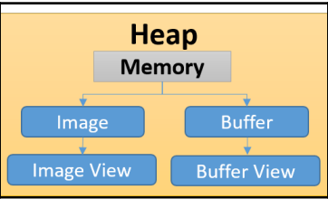

> 《Vulkan学习指南》 <=> 《Learning Vulkan》

# 第1章 开始学习新一代3D图形API

## 1.3 重要术语
- physical device (物理设备): 各品牌型号的独显、集显等支持vulkan的硬件设备
- device (设备): 物理设备在应用程序中的逻辑表示。一个物理设备对应一个设备？
- queue (队列): 执行引擎与应用程序之间的接口。一个物理设备包含一个或多个队列。队列负责收集准备执行的工作（指令缓存）并分发到物理设备执行
- queue Family (队列族): 一组具有相同属性和能力的队列。一个队列族负责图形渲染、计算、数据传输、内存管理等操作中的一种。
- memory type (内存类型): 分为宿主内存和设备内存
- command (指令): 执行用户定义的行为。或者叫做命令
    - action command (动作指令): 包含绘制图源、清除表面、复制缓存、查询时间戳操作、以及子通道的开始和结束操作。用于修改帧缓存附件、读取或写入内存（缓存或者图像）以及写入查询池？
    - set state command (状态设计指令): 用来绑定流水线、描述符集合、缓存，或者设置 动态状态、渲染通道、子通道的状态
    - synchronization command (同步指令): 通过设置同步事件、等待事件、流水线屏障对象、渲染通道、子通道的依赖，来保证多个动作指令的同步
- command buffer (指令缓存): 一组指令的集合，记录多个指令并统一发送到队列中

## 1.4 vulkan的原理
- （简化的）执行模型：vulkan程序控制一组vulkan设备，将多个command记录到 多个command buffer 中，并发送到多个queue。设备的驱动会读取queue并按照记录的顺序依次执行各个command
  
    
    
    - 指令队列的构件需要代价 而一旦构建完成就可以 被缓存 和 发送到队列，根据自己的需要多次执行
    - 有些指令缓存支持以多线程的方式并行构建
    - vulkan程序还负责：各种准备（资源、着色器、流水线）、内存管理、同步、风险管理
    
- **queue（队列）**: 一种中间层机制，负责接收指令缓存并传递给设备。指令缓存的发送分成两类
  
    - 单一对列：按照指令缓存发送的顺序进行维护、执行或者回放
    - 多重队列：指令缓存 以并行的方式在多个队列中执行。除非有同步操作，否则无法保证发送和执行的顺序不变
    
- 同步
  
    - **semaphore (信号量)**: 跨队列，或在单一队列中以粗粒度执行？
    - **event (事件)**: 单个队列中，以细粒度执行，确保单一指令缓存中或多个指令缓存之间的同步要求
    - **fence (栅栏)**: 允许host和device之间同步
    - **pipeline barrier (流水线屏障)**: 插入command buffer中的指令，保证它之前的指令先执行，它之后的后执行
    
- vulkan对象：vulkan程序中的device、queue、command buffer、pipeline等对象，分为两类
    - 可分发的句柄：~~这类指针指向不透明的内部图形实体。不能直接访问成员，要通过API函数访问。~~
        - 包含vk::instance、vk::CommandBuffer、vk::PhysicalDevice、vk::Device、vk::Queue
    - 非可分发的句柄：这些64位整型类型的句柄不指向结构体，而是直接包含对象自身的信息
        - 包含vk::Pipeline、vk::PipelineCache、vk::PipelineLayout、vk::Buffer、vk::DeviceMemory、vk::QueryPool、vk::ShaderModule、vk::DescriptorPool、vk::DescriptorSet、vk::DescriptorSetLayout、vk::CommandPool、vk::Semaphore、vk::Fence、vk::Event等
    
- **指令语法**
    - 创建&&销毁：需要创建的对象使用`vk::Device::createXXX()`实现，需要一个结构体`vk::XXXCreateInfo`作为输入；销毁该对象则使用对应的`vk::Dvice::destoryXXX()`
        - 比如创建buffer，使用`vk::Device::createBuffer()`，输入为`vk::BufferCreateInfo`，销毁则使用`vk::Dvice::destoryBuffer()`
        - 包含：Instance、DeviceQueue、Device、CommandPool、DescriptorPool、DescriptorSetLayout、PipelineLayout、ShaderModule、PipelineShaderStage、ComputePipeline、Buffer 等
    - 分配&&释放：从已有对象池or堆中创建（分配）使用`vk::Device::allocateXXX()`实现，需要一个结构体`vk::XXXAllocateInfo`作为输入；释放该对象则使用对应的`vk::Dvice:freeXXX()`
        - 比如分配Memory，使用`vk::Device::allocateMemory()`，输入为`vk::MemoryAllocateInfo`，释放则使用`vk::Dvice::freeMemory()`
        - 包含：Memory、CommandBuffer、DescriptorSet 等
    - 上述所有的实现方法都可以通过`vk::getXXX()`获取  ？？？
    - 将指令记录到指令缓存中，使用`vk::cmdXXX()`  ？？？   

## 1.5 理解vulkan应用程序


- 驱动：支持vulkan的系统至少包含一个CPU和一个GPU。GPU的生产者会为某个vulkan标准提供完整的驱动实现。驱动为vulkan程序提供了高级的功能接口，使其可以与设备通信。例如，驱动可以找到系统中所有可用的设备、可用的队列类型等
- 应用程序（vulkan程序）：用户编写的、可以调用vulkan API执行图形or计算工作的程序。首先，初始化硬件和软件，可以检测驱动并找到所有可用的vulkan API。然后，创建资源并绑定到着色器阶段，会用到descriptor。descriptor辅助将创建后的资源绑定到底层（基于某种图形or计算类型）的pipeline。最后，记录command buffer并发送到queue执行
- WSI (Windows System Integration)： 将不同操作系统的展示层（presentation layer）统一起来
- SPIV-R：将不同着色器代码语言（HLSL、GLSL）转成相同的、预编译的二进制数据格式
- LunarG SDK：包含加载器、验证层、跟踪回放工具、SPIR-V工具、运行库、文档、demo等工具资源的vulkan skd

## 1.6 开始学习Vulkan编程模型

- 应用程序编程模型：采用自顶向下的实现过程

    

- 硬件初始化：应用程序需要与loader（加载器）进行通信来激活vulkan的驱动。

    

    - loader（加载器）：一段应用程序启动时执行的代码，它使用平台 无关的方式来定位系统中的Vulkan驱动
        - 负责：①定位并加载驱动；②保证API与系统无关；③ 支持层次化的结构，并且可以在运行过程中随时注入不同类型的层（例如 开发阶段打开所有需要注入的层，发布的时候关闭它们）
    - 注入层的功能：① 跟踪vulkan API的指令执行② 捕获渲染的场景 稍后再继续执行 ③ 满足调试需要，进行错误处理和验证
    - 加载器完成后，就可以①创建实例②查询物理设备上所有可用队列 ③支持注入层

- 资源设置：
    - 内存分类
    ① device local：在device上只对device可见的内存
    ② device local, host visible：在device上，但对device和host都可见
    ③ host local, host visible：在host上，对device和host都可见，比device local慢
    - 【推荐】**子分配**：应用程序提前申请一大块物理内存，然后将物理内存的很大一部分立即分配完成并存入不同的资源对象
    - sparse memory（稀疏内存）：将图像分割为多个小块 根据需求加载必需的，从而使得存储资源比实际的内存容量更大
    - staging buffer（阶段缓存）：应用程序先将资源设置到阶段缓存中，它对host是可见的，然后再传递到理想的存储区域（对host不可见）

- 流水线设置

     

     - **pipeline**：根据应用程序逻辑定义的一系列事件，照固定的顺序执行。包含设置着色器、资源的绑定以及状态管理

     - **descriptor set（描述符集）**：资源和着色器之间的接口。可以将着色器绑定到资源（例如image or buffer），也可以将资源内存关联或者绑定到准备使用的着色器实例上。它变化频繁，支持多线程同步更新，从**descriptor pool（描述符缓冲池）**分配而来

         - 更新或者改变描述符集是vulkan中关键的性能瓶颈之一。需要保证高频率更新的描述符 不会影响到低频率的描述符。

     - 基于SPIR-V的**shader（着色器）**：
         - 支持GLSL和HLSL等源语言转换成SPIR-V格式
         - shader的编译是离线的，不过预先就进行了注入
         - shader提供了多种不同的程序入口

     - **pipeline state（流水线状态）**：物理设备包含的一系列硬件设置，用来定义准备发送的几何输入数 据是如何解释和绘制的。

         - 包含光栅化状态、融混状态，以及深度/模板状态、输入 几何数据的图元拓扑类型（点/线/三角形）以及渲染所用的着色器
         - 流水线状态分为：动态状态和静态状态。<u>后者对于性能的优化来说至关重要。</u>
         - Vulkan允许用户使用**Pipeline（流水线）**与**Pipeline Cache（流水线缓存）**和**pipeline layout（流水线布局）**一起，来进行状态的控制
         - Pipeline Cache的实现由驱动完成

         > cache（缓存）和buffer（缓冲区）不同。cache是为了加快访问速度，buffer是为了减少响应次数

     - **pipeline layout（流水线布局）**：提供了pipeline中所用 的descriptor set，其中设置了各种不同的资源关联到着色器的不同方法。 不同的pipeline可以使用相同的pipeline layout。

     - 

- 指令的记录：

    

    - command（指令）的记录是逐渐构成指令缓存的过程
    - command buffer（指令缓存）是从command pool（指令池）当中分配而来的。command pool 可以用来同时分配多个command buffer
    - command buffer的创建是对性 能影响最大的一项操作
    - 也可以通过多线程的方式同步生 成多个command buffer。command pool 的设计确保了多线程环境下不会出现资源互锁的问题

- 队列的提交

    - Vulkan向应用程序暴露了不同类型的队列接口，例如图形、DMA/传 输，或者计算队列
    - 提交的工作通 过异步的方式执行
    - 多个command buffer可以被压送到独立、兼容的队列 里，从而实现并行的执行

# 第2章 你的第一个Vulkan伪代码程序

## 2.2 Hello World伪代码

- 初始化过程：包括validtion layer（验证层）属性的初始化，以及`vk::Instance`（实例对象）的构建，然后检查是否有可用物理设备（vk::PhysicalDeveice），接着通过实例对象创建一个对应的逻辑设备（vk::Device）

    

    

    - Vulkan通过错误信息和验证层提供了调试功能。这类功能扩展分成2类
        - 实例相关（Instance-specific）：全局级别。通过`vk::enumerateInstanceLayerProperties()`获取layer信息，通过`vk::enumerateInstanceExtensionProperties()`获取extension信息
        - 设备相关（Device-specific）：物理设备相关。**获取layer信息的API已经废弃**，通过vk::enumerate**Device**ExtensionProperties()获取extension信息

    ==初始化的示意代码==如下：

    ```c++
      /*** 1. Enumerate Instance Layer properties ***/
      vector<vk::LayerProperties> layper_property = vk::enumerateInstanceLayerProperties();
      for (auto &lp : layper_property)
        vector<vk::ExtensionProperties> extension_property =
            vk::enumerateInstanceExtensionProperties(vk::Optional<const std::string>(lp.layerName));
      /*** 2. Instance Creation ***/
      vk::ApplicationInfo app_info; // 可选
      app_info.setApiVersion(VK_API_VERSION_1_3);
      std::vector<const char *> layers = {"VK_LAYER_KHRONOS_validation"};
      vk::InstanceCreateInfo instance_info;
      instance_info.setPApplicationInfo(&app_info).setPEnabledLayerNames(layers); // 还可以设置ExtensionNames
      vk::Instance instance = vk::createInstance(instance_info);
      /*** 3. Enumerate physical devices ***/
      vector<vk::PhysicalDevice> devices = instance.enumeratePhysicalDevices();
      vk::PhysicalDevice phy_device = devices[0]; // 随便选一个
      cout << "[INFO] pick up physical deivce " << phy_device.getProperties().deviceName << endl;
      /*** 4. Create Device ***/
      vk::PhysicalDeviceMemoryProperties mem_properties = phy_device.getMemoryProperties();	// 物理设备中可用内存类型
      vk::PhysicalDeviceProperties phy_device_properties = phy_device.getProperties();	// 物理设备属性
      vector<vk::QueueFamilyProperties> queue_props = phy_device.getQueueFamilyProperties();	// 物理设备中的队列以及其属性
      vk::DeviceCreateInfo create_info = {};  // 必须要设置vk::DeviceQueueCreateInfo
      vk::Device device = phy_device.createDevice(create_info);
    ```

- 指令缓存初始化：首先创建command pool，然后分配command buffer

    > 代码见第5章

- 资源对象：分成buffer和image

    

    - buffer view：表示数据缓存自身。它可 以将数据用连续的方式保存起来，并设置一个特定的数据解析格式
    - image view: 类似buffer view
    - 应用程序中并不会直接访问vk::Buffer和vk::kImage对象，而是使用对应的视图对象（VkBufferView以及 VkImageView）来完成

- 资源分配：

    - 资源（缓存为VkBuffer，图像为VkImage）刚被创建 时，并没有关联任何的内存空间。
    - 内存需求：每种资源对象都有 自己的内存创建需求，可以通过vk::Device::getBufferMemoryRequirements()或 者vk::Device::GetImageMemoryRequirements()来进行查询。这个函数有助于计 算内存分配的大小
    - 分配：使用vk::Device::allocateMemory()
    - 绑定：将资源对象绑定到这个刚分配 的内存上，对应的函数为vk::Device::bindBufferMemory()或者 vk::Device::bindImageMemory()。
    - 内存映射：负责更新物理设备内存数据。首先， 使用函数vk::Device::mapMemory()将设备内存映射到宿主机内存。然后更新 映射内存区域（在宿主机上）的数据，最后调用vk::Device::unmapMemory() 函数。这个API函数会将映射内存区域的数据更新到设备内存中

- 着色器支持

    ```c++
    vector<char> source_code = ReadWholeFile(spv_path);
    vk::ShaderModuleCreateInfo module_info;
    module_info.setCodeSize(source_code.size()).setPCode((uint32_t *)source_code.data());
    vk::ShaderModule compute_module = device.createShaderModule(module_info);
    ```

- 构建descriptor set layout：

    - descriptor负责将资源与着色器通过布局绑定的方式关联起来
    - 一个descriptor set里可以包含多个布局绑定的descriptor，它相当于是数组的代码块
    - 一个descriptor set layout表示这个descriptor set所包含的信息的类型

    ```c++
    vector<vk::DescriptorSetLayoutBinding> binding(2);
    binding[0].setBinding(0).setDescriptorCount(1).setDescriptorType(vk::DescriptorType::eStorageBuffer)
        .setStageFlags(vk::ShaderStageFlagBits::eCompute);
    binding[1].setBinding(1).setDescriptorCount(1).setDescriptorType(vk::DescriptorType::eStorageBuffer)
        .setStageFlags(vk::ShaderStageFlagBits::eCompute);
    vk::DescriptorSetLayoutCreateInfo layout_info;
    layout_info.setBindings(binding);
    vk::DescriptorSetLayout descriptor_layout = device.createDescriptorSetLayout(layout_info);
    std::array<vk::DescriptorSetLayout, 2> layouts = {descriptor_layout}; // 这么写对吗？
    ```

- 构建pipeline layout：decriptor set被创建之后，还不能够直接被底层的流水线访问到。pipeline layout就是 让底层pipeline可以访问到 descriptor set 的信息

    > pipeline用到decriptor set layout，但不会用到decriptor set

    ```c++
    vk::PipelineLayoutCreateInfo pipe_layout_info;
    pipe_layout_info.setSetLayouts(descriptor_layout);  // 不能用layouts
    vk::PipelineLayout pipeline_layout = device.createPipelineLayout(pipe_layout_info);
    ```

- 创建流水线：流水线是一系列状态（state）的集合。每个状态都包括了一组属性（用来 定义状态的执行协议）。分成 Graphics pipeline和Compute pipeline

    - 定义状态：
        - Dynamic states（动态状态）：提示流水线在运行过程中观察状态的变 化情况。此时流水线会使用一个特殊的过程去更新各个状态量，而不 是直接使用初始值。使用结构体vk::PipelineDynamicStateCreateInfo设置
        - 还有顶点输入状态、光栅化状态、颜色融混附件状态、视口状态、深度模板状态、多重采样状态
    - **从流水线缓存 （vk::PipelineCache）中构建pipeline 对象来获得最大的性能**

    ```c++
    vk::PipelineCacheCreateInfo pipeline_cache_info;
    vk::PipelineCache pipeline_cache = device.createPipelineCache(pipeline_cache_info);
    vk::ComputePipelineCreateInfo pipeline_info;
    pipeline_info.setLayout(pipeline_layout).setStage(stage_info);
    auto result = device.createComputePipeline(pipeline_cache, pipeline_info); // pipeline cache可选
    if (result.result != vk::Result::eSuccess)
    	throw std::runtime_error("failed to create compute pipeline!");
    vk::Pipeline compute_pipeline = result.value;
    ```

-  队列的提交和同步:

    ```c++
    vk::FenceCreateInfo fence_info = {...};
    vk::Fence fence = device_.createFence(fence_info);
    vk::SubmitInfo submit_info;
    submit_info.setCommandBuffers(cmd_buffer);
    compute_queue.submit(submit_info);
    ```

## 2.3 全部整合到一起


# 第3章 连接硬件设备

## 3.1 学习使用LunarG SDK

- Installable Client Driver (ICD)：兼容vulkan的显示驱动。不同ICD（例如nvidia和intel的驱动）可以互不影响地共存；
- layer（层）：这是一种插件式的组件，可以捕捉或着拦截vulkan的指令，提供诸如调试、验证、跟踪等方面的服务功能
- loader（加载器）：定位显示驱动的位置，并通过 与平台无关的方式提供layer所用的库文件。在Windows上，加载库（vulkan-1.dll）使用注册表来定位ICD和layer的配置信息

## 3.3 扩展简介

- layer（层）：层会捕捉当前的Vulkan API并且将自己注入到 Vulkan指令的执行链中，使其与指定的层关联在一起。我们通常使用layer来进行开发过程当中的验证工作。例如，驱动程序不会检查Vulkan API 所传入的参数，所以我们可以通过层来完成输入参数的验证，判断它 们正确与否。 
- extension（扩展）：扩展提供了额外的功能或者特性，它可能未 来会成为标准的一部分，也可能不会。扩展也可以作为设备或实例的 一部分存在。扩展指令的链接无法通过静态的方式实现，我们需要首 先进行查询，然后动态地将它们链接为函数指针。

## 3.4 创建一个Vulkan实例

- 创建vulkan实例：

    ```c++
    vk::Instance createInstance(vk::InstanceCreateInfo const &createInfo,
                                vk::Optional<const vk::AllocationCallbacks> allocator = nullptr) const;
    ```

    - 实例的创建信息：vk::InstanceCreateInfo = VkInstanceCreateInfo

        ```
        InstanceCreateInfo(vk::InstanceCreateFlags flags_,
                           const vk::ApplicationInfo *pApplicationInfo_,
                           vk::ArrayProxyNoTemporaries<const char *const> const &pEnabledLayerNames_,
                           vk::ArrayProxyNoTemporaries<const char *const> const &pEnabledExtensionNames_ = {},
                           const void *pNext_ = nullptr)
        ```

    - 创建所需的application信息：

        ```c+=
        ApplicationInfo(const char *pApplicationName_ = {}, uint32_t applicationVersion_ = {},
                        const char *pEngineName_ = {}, uint32_t engineVersion_ = {},
                        uint32_t apiVersion_ = {}, const void *pNext_ = nullptr);
        ```

- 获取实例的

- 销毁实例：`vk::Instance::clear()` => 内部调用`vkDestroyInstance()`

> 可以直接显式地启用层，设置环境变量VK_INSTANCE_LAYERS=VK_LAYER_LUNARG_api_dump

## 3.5 理解物理设备和逻辑设备

- 枚举物理设备：

    ```c++
    std::vector<vk::PhysicalDevice> vk::Instance::enumeratePhysicalDevices();
    ```

- 查询物理设备的扩展：输入为 准备查询扩展的layer的名称

    ```c++
    std::vector<vk::ExtensionProperties> vk::PhysicalDevice::enumerateDeviceExtensionProperties(
        Optional<const std::string> layerName) const;
    ```

- 获取物理设备的属性：包含设备名称、类型等

    ```c++
    vk::PhysicalDeviceProperties vk::PhysicalDevice::getProperties() const;
    ```

- 获取物理设备的内存属性

    ```c++
    vk::PhysicalDeviceMemoryProperties vk::PhysicalDevice::getMemoryProperties() const;
    ```

- 获取物理设备支持的queue family：根据QueueFamilyProperties::queueFlags判断queue的类型，记录所需queue的id（int类型）

    ```c++
    std::vector<vk::QueueFamilyProperties> PhysicalDevice::getQueueFamilyProperties() const;
    ```

- 创建逻辑设备：DeviceCreateInfo包含扩展的名称（也有layer的名称，但是已经废弃，仅用于兼容）、需要创建和关联的队列

    ```c++
    vk::Device PhysicalDevice::createDevice( vk::DeviceCreateInfo const & createInfo, vk::Optional<const vk::AllocationCallbacks> allocator) const;
    ```

    - 逻辑设备的创建信息：主要设置QueueCreateInfos

        ```c++
        DeviceCreateInfo(vk::DeviceCreateFlags flags_ = {}, uint32_t queueCreateInfoCount_ = {},
                         const vk::DeviceQueueCreateInfo *pQueueCreateInfos_ = {}, uint32_t enabledLayerCount_ = {},
                         const char *const *ppEnabledLayerNames_ = {}, uint32_t enabledExtensionCount_ = {},
                         const char *const *ppEnabledExtensionNames_ = {},
                         const vk::PhysicalDeviceFeatures *pEnabledFeatures_ = {}, const void *pNext_ = nullptr);
        ```

    - 逻辑设备的queue创建信息：主要设置queueFamilyIndex和queueCount

        ```c++
        DeviceQueueCreateInfo(vk::DeviceQueueCreateFlags flags_ = {}, uint32_t queueFamilyIndex_ = {},
                uint32_t queueCount_ = {}, const float *pQueuePriorities_ = {}, const void *pNext_ = nullptr);
        ```

        > queueFamilyIndex是前面通过getQueueFamilyProperties找到的所需queue的id
        >
        > QueuePriorities表示优先级

- host端等待：等待所有队列进入空闲

    ```c++
    void Device::waitIdle()
    ```

> 如果physical device丢失，创建的device会失败；但是device丢失，某些指令会返回VK_ERROR_DEVICE_LOST，但是physical device不受影响，不会重置device

## 3.6 理解队列和队列族

- queue: 应用程序和物理设备之间的通信过程

    - 应用程序通过将cmd buffer提交到quere的方式来发布工作任务。
    - 物理设备读取queue中的任务，然后异步地处理

    

    - 物理设备中可能包括一个或者多个queue family，每个queue family所支持的queue类型各不相同、可能包含一个或者多个queue

- 查询queue family：根据QueueFamilyProperties::queueFlags判断queue的类型，记录所需queue的id（int类型）

    ```c++
    std::vector<vk::QueueFamilyProperties> PhysicalDevice::getQueueFamilyProperties() const;
    ```

    

    - 根据QueueFamilyProperties::queueFlags判断queue的类型，记录所需queue的id（int类型）

        ```c++
        int queue_indices_ = -1;
        for (int i = 0; i < queue_props.size(); i++) 
            if (queue_props[i].queueFlags & vk::QueueFlagBits::eCompute) {
                queue_indices_ = i;
                break;
            }
        ```

- 创建queue：提前创建device，创建的时候传入DeviceQueueCreateInfo（将3.5节）

    ```c++
    vk::Queue Device::getQueue( uint32_t queueFamilyIndex, uint32_t queueIndex ) const;
    ```

    > 一个queue family有多个queue，每个queue有唯一id。queueIndex设置queue family（对应queueFamilyIndex）中的queue id

# 第4章 调试Vulkan程序


